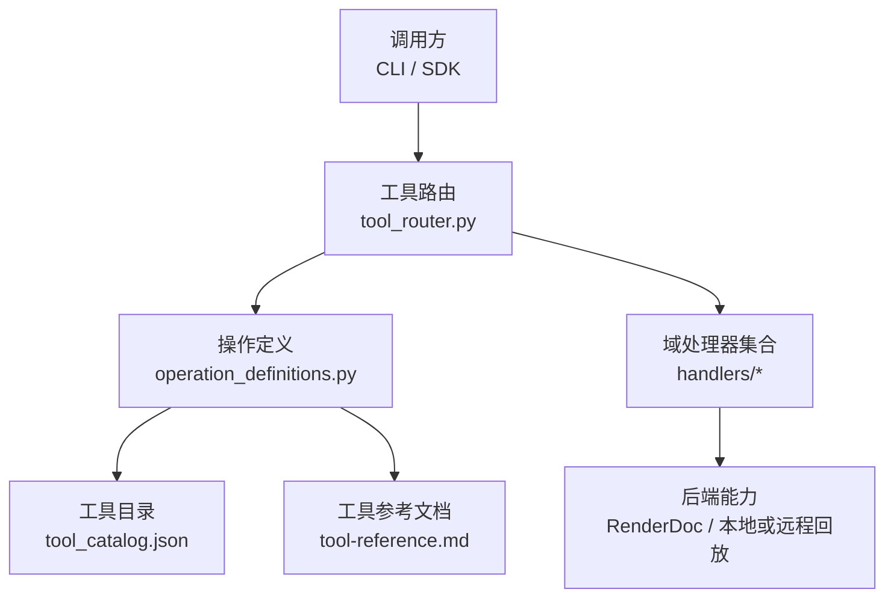
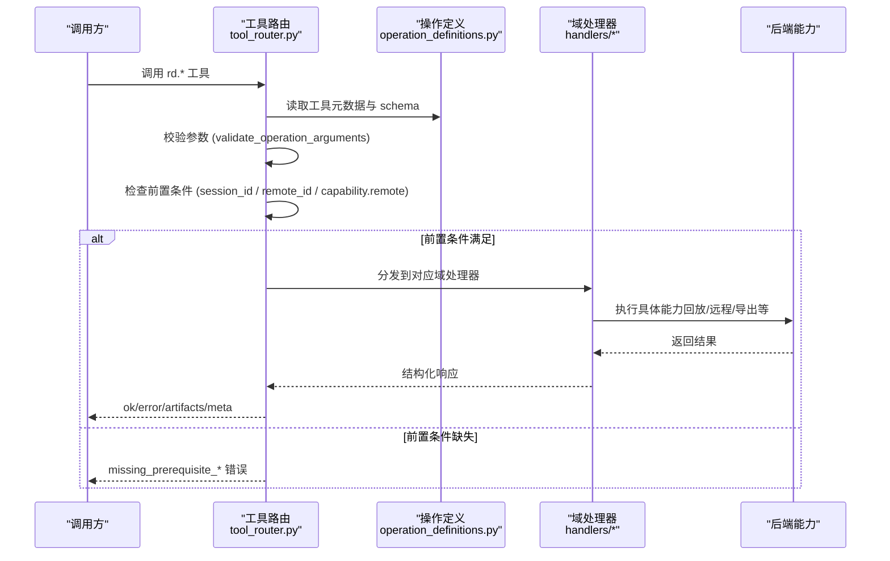
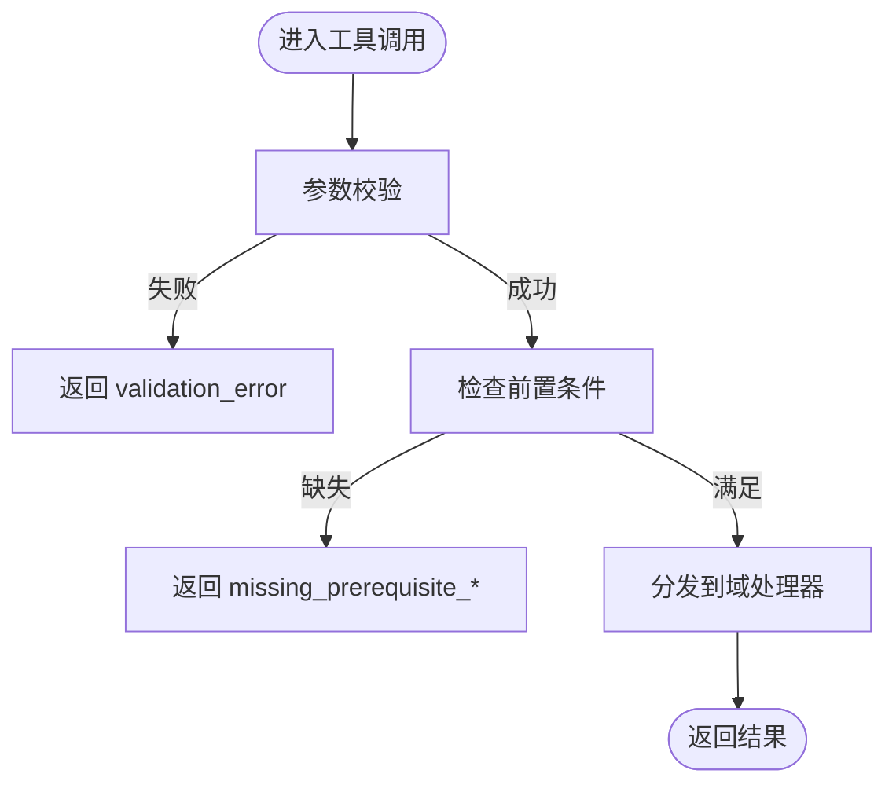
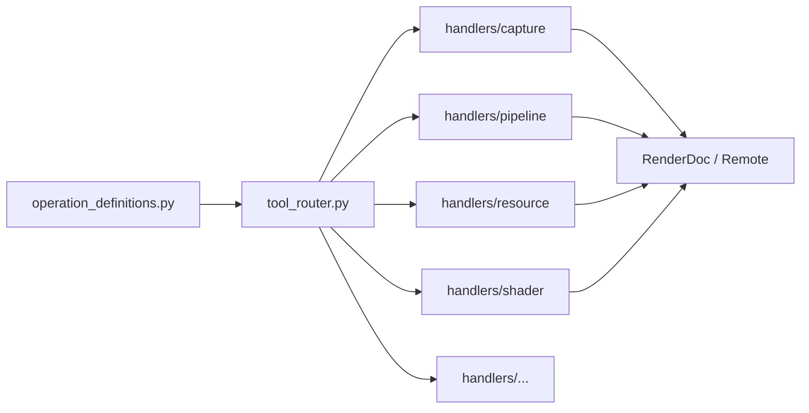

# 工具接口升级指南

<cite>
**本文引用的文件**
- [README.md](file://README.md)
- [tool-interface-upgrade.md](file://docs/tool-interface-upgrade.md)
- [tool-reference.md](file://docs/tool-reference.md)
- [operation_definitions.py](file://rdx/operation_definitions.py)
- [tool_router.py](file://rdx/tool_router.py)
- [tool_catalog.json](file://spec/tool_catalog.json)
</cite>

## 目录
1. [简介](#简介)
2. [项目结构](#项目结构)
3. [核心组件](#核心组件)
4. [架构总览](#架构总览)
5. [详细组件分析](#详细组件分析)
6. [依赖关系分析](#依赖关系分析)
7. [性能与稳定性考虑](#性能与稳定性考虑)
8. [故障排查指南](#故障排查指南)
9. [结论](#结论)
10. [附录：迁移对照与最佳实践](#附录：迁移对照与最佳实践)

## 简介
本指南面向需要升级或迁移到当前 RDX Agent Tools 工具接口的调用方，聚焦“已删除/合并/新增”的 rd.* 操作、推荐替代路径、以及运行时路由与前置条件校验机制。文档基于仓库中的公开定义、生成式参考文档与路由实现，帮助你在不破坏现有工作流的前提下完成平滑升级。

## 项目结构
RDX Agent Tools 以“声明式操作定义 + 目录化处理器 + 统一路由”的方式组织：
- 操作定义：集中声明在 rdx/operation_definitions.py，作为唯一事实来源（Single Source of Truth）。
- 工具目录与处理器：按领域划分（buffer/capture/core/debug/diag/event/export/macro/mesh/perf/pipeline/remote/replay/resource/session/shader/texture/util/vfs），由 handlers 包提供具体实现。
- 路由与注册：rdx/tool_router.py 将 catalog 中的工具映射到对应域处理器，并执行参数校验与前置条件检查。
- 生成产物：spec/tool_catalog.json 与 docs/tool-reference.md 由 operation_definitions.py 生成，用于发现、检索与参考。

图表来源
- [tool_router.py:1-156](file://rdx/tool_router.py#L1-L156)
- [operation_definitions.py:1-800](file://rdx/operation_definitions.py#L1-L800)
- [tool_catalog.json:1-800](file://spec/tool_catalog.json#L1-L800)
- [tool-reference.md:1-253](file://docs/tool-reference.md#L1-L253)

章节来源
- [README.md:1-70](file://README.md#L1-L70)
- [tool_reference.md:1-253](file://docs/tool-reference.md#L1-L253)

## 核心组件
- 操作定义层：集中描述每个工具的输入、输出、作用域、副作用、前置条件与分组，是工具契约的唯一权威来源。
- 路由层：负责加载目录、解析工具名、校验参数、检查前置条件，并将请求分发到对应域处理器。
- 处理器层：按领域实现具体逻辑（如 capture、pipeline、resource、shader、export 等）。
- 目录与参考：通过脚本从定义生成 JSON 目录与中文参考文档，便于自动化发现与人类阅读。

章节来源
- [operation_definitions.py:1-800](file://rdx/operation_definitions.py#L1-L800)
- [tool_router.py:1-156](file://rdx/tool_router.py#L1-L156)
- [tool_catalog.json:1-800](file://spec/tool_catalog.json#L1-L800)
- [tool-reference.md:1-253](file://docs/tool-reference.md#L1-L253)

## 架构总览
下图展示一次典型工具调用的端到端流程，包括参数校验、前置条件检查与域处理器的分发。

图表来源
- [tool_router.py:60-156](file://rdx/tool_router.py#L60-L156)
- [operation_definitions.py:1-800](file://rdx/operation_definitions.py#L1-L800)

## 详细组件分析

### 路由与前置条件校验
- 路由职责：
  - 加载 catalog，构建工具索引。
  - 对每个 rd.* 工具建立异步处理器，先做参数校验，再做前置条件检查，最后分发给域处理器。
- 前置条件规则：
  - session_id：来自参数或运行时上下文。
  - capture_file_id：来自参数或运行时上下文。
  - remote_id：支持从 options.remote_id 注入或通过连接获取。
  - active_event_id：要求当前事件有效。
  - capability.remote：需启用远程能力。
- 失败策略：
  - 参数校验失败返回 validation_error。
  - 前置条件缺失返回 structured prerequisite error，包含 via_tools 建议与原因说明。

图表来源
- [tool_router.py:64-156](file://rdx/tool_router.py#L64-L156)

章节来源
- [tool_router.py:60-156](file://rdx/tool_router.py#L60-L156)

### 操作定义与目录生成
- 单一事实来源：所有工具的 name、group、description、parameter_raw、returns_raw、prerequisites、scope、effects、evidence_kind、path_inputs 均来源于 operation_definitions.py。
- 目录与参考：
  - spec/tool_catalog.json 由定义生成，供工具发现与自动化消费。
  - docs/tool-reference.md 为可读性更强的中文参考，同样由定义生成。
- 版本指纹：catalog 包含 fingerprint，便于变更追踪。

章节来源
- [operation_definitions.py:1-800](file://rdx/operation_definitions.py#L1-L800)
- [tool_catalog.json:1-800](file://spec/tool_catalog.json#L1-L800)
- [tool-reference.md:1-253](file://docs/tool-reference.md#L1-L253)

### 关键域处理器概览
- capture：打开/关闭捕获文件与回放会话，获取元数据与缩略图。
- replay：设置帧、查询 API 属性、驱动信息、帧统计。
- event：事件树、父链、动作详情、搜索、资源使用、API 调用（结构化）。
- pipeline：管线状态、阶段状态、着色器、常量缓冲、顶点/索引缓冲、资源绑定。
- resource：资源列表、详情、内存估算、使用历史、别名、描述符范围。
- texture/buffer/mesh：纹理/缓冲区/网格的数据读取、统计、差异、导出。
- shader：反射、反汇编、源码、编译、替换、撤销、消息、调试。
- export：截图、纹理、缓冲区、网格、着色器 bundle、常量缓冲转储。
- perf：计数器枚举、描述、采样、事件耗时、整帧测量。
- remote：连接、目标管理、抓帧、队列、拷贝、删除。
- session/context：上下文快照、预览窗口、会话选择与恢复。
- util/vfs：通用辅助与只读 VFS 导航。

章节来源
- [tool-reference.md:36-253](file://docs/tool-reference.md#L36-L253)

## 依赖关系分析
- 强耦合点：
  - tool_router.py 依赖 operation_definitions.py 的 catalog 与 schema。
  - 各域处理器依赖后端能力（本地 RenderDoc 或远程设备）。
- 外部依赖：
  - RenderDoc 库与驱动能力（不同平台/版本可能影响可用功能）。
  - 远程连接（adb/bootstrap、direct endpoint）。
- 潜在循环：
  - 路由与处理器之间无循环导入；处理器仅被路由引用。
- 可观测性：
  - 通过 rd.core.get_runtime_metrics 与 rd.core.get_logs 监控运行状态与日志。

图表来源
- [tool_router.py:34-54](file://rdx/tool_router.py#L34-L54)
- [operation_definitions.py:1-800](file://rdx/operation_definitions.py#L1-L800)

章节来源
- [tool_router.py:34-54](file://rdx/tool_router.py#L34-L54)
- [operation_definitions.py:1-800](file://rdx/operation_definitions.py#L1-L800)

## 性能与稳定性考虑
- 避免大对象直接返回：
  - 文本/二进制数据优先写入 artifact 或指定 output_path，避免 JSON 过大。
- 分页与预算：
  - 事件树、结构化调用、描述符范围等接口提供 offset/limit/max_nodes 等限制，防止一次性拉取过多数据。
- 资源释放：
  - 及时关闭回放会话与远程连接，减少句柄泄漏。
- 远程能力矩阵：
  - 通过 rd.core.get_capabilities 与 context 快照了解当前后端能力，避免无效调用。
- 测量边界：
  - 事件耗时与计数器采样适用于定位慢事件；整帧测量需明确语义与限制。

[本节为通用指导，不直接分析具体文件]

## 故障排查指南
- 常见错误类型：
  - validation_error：参数不符合 schema。
  - missing_prerequisite_*：缺少必要的前置条件（如未打开捕获/未连接远程）。
  - 后端能力不足：某些能力在当前后端不可用（例如远程调试/替换）。
- 诊断步骤：
  - 使用 rd.core.healthcheck 验证环境。
  - 使用 rd.core.get_runtime_metrics 查看指标与限制。
  - 使用 rd.core.get_logs 过滤最近日志定位问题。
  - 使用 rd.session.get_context 查看上下文、会话与恢复摘要。
- 回滚与清理：
  - 着色器替换后如需恢复，使用 rd.shader.revert_replacement。
  - 使用 rd.util.cleanup_artifacts 清理临时产物。

章节来源
- [tool-router.py:64-156](file://rdx/tool_router.py#L64-L156)
- [tool-reference.md:64-81](file://docs/tool-reference.md#L64-L81)
- [tool-reference.md:183-199](file://docs/tool-reference.md#L183-L199)
- [tool-reference.md:231-238](file://docs/tool-reference.md#L231-L238)

## 结论
本次接口升级以“最小化破坏、最大化可组合性”为原则：移除冗余或不可靠入口，保留并增强基础 primitive，将复杂编排交给 Skill/可编程调用。升级时请遵循：
- 优先使用 canonical rd.* 主接口。
- 利用目录与参考文档进行工具发现与参数校验。
- 关注前置条件与能力矩阵，避免无效调用。
- 对旧宏/包装类接口，改用组合 primitive 的方式重建工作流。

[本节为总结性内容，不直接分析具体文件]

## 附录：迁移对照与最佳实践

### 删除/合并/新增的关键变化
- 删除与合并：
  - 许多细粒度导出/报告/宏已被移除，改为调用方自行组合 primitive 与序列化。
  - 部分管线状态查询合并至 rd.pipeline.get_state 的 sections，提升一致性。
- 新增与增强：
  - 结构化事件调用查询、描述符范围读取、整帧测量等能力得到增强。
  - 上下文快照与预览窗口提供更强的会话管理能力。

章节来源
- [tool-interface-upgrade.md:1-332](file://docs/tool-interface-upgrade.md#L1-L332)
- [tool-reference.md:104-117](file://docs/tool-reference.md#L104-L117)
- [tool-reference.md:172-182](file://docs/tool-reference.md#L172-L182)
- [tool-reference.md:248-253](file://docs/tool-reference.md#L248-L253)

### 迁移建议
- 事件与 API 检查：
  - 使用 rd.event.get_action_tree 与 rd.event.search_actions 替代旧的根级 actions 查询。
  - 使用 rd.event.get_api_calls 的结构化调用查询替代空壳或受限接口。
- 管线状态：
  - 使用 rd.pipeline.get_state(sections=...) 获取完整状态，避免多个碎片化入口。
- 资源与描述符：
  - 使用 rd.resource.list_all 与 rd.resource.get_descriptors 获取更完整的绑定与视图信息。
- 导出与报告：
  - 使用统一的导出入口（截图/纹理/缓冲区/网格/着色器 bundle），由调用方决定持久化格式。
- 远程与上下文：
  - 使用 rd.remote.* 管理远程连接与抓帧；使用 rd.session.* 管理上下文与预览。

章节来源
- [tool-reference.md:104-117](file://docs/tool-reference.md#L104-L117)
- [tool-reference.md:144-155](file://docs/tool-reference.md#L144-L155)
- [tool-reference.md:172-182](file://docs/tool-reference.md#L172-L182)
- [tool-reference.md:156-171](file://docs/tool-reference.md#L156-L171)
- [tool-reference.md:183-199](file://docs/tool-reference.md#L183-L199)