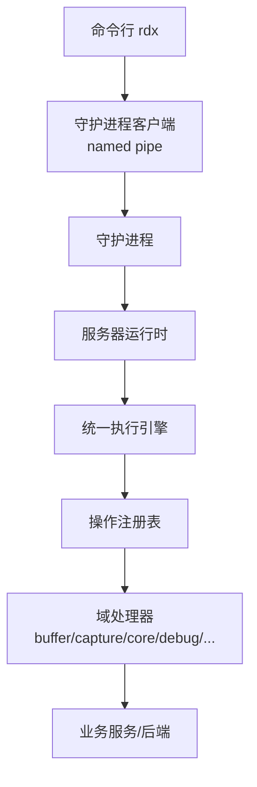
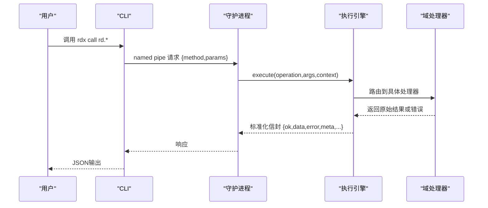
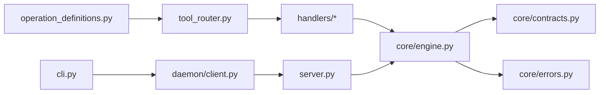

# API规范

<cite>
**本文引用的文件**
- [operation_definitions.py](file://rdx/operation_definitions.py)
- [contracts.py](file://rdx/core/contracts.py)
- [engine.py](file://rdx/core/engine.py)
- [errors.py](file://rdx/core/errors.py)
- [tool_router.py](file://rdx/tool_router.py)
- [server.py](file://rdx/server.py)
- [handlers/core.py](file://rdx/handlers/core.py)
- [daemon/client.py](file://rdx/daemon/client.py)
- [cli.py](file://rdx/cli.py)
- [public-contract.md](file://docs/public-contract.md)
</cite>

## 目录
1. [简介](#简介)
2. [项目结构](#项目结构)
3. [核心组件](#核心组件)
4. [架构总览](#架构总览)
5. [详细组件分析](#详细组件分析)
6. [依赖关系分析](#依赖关系分析)
7. [性能与并发特性](#性能与并发特性)
8. [故障排查指南](#故障排查指南)
9. [结论](#结论)
10. [附录：操作清单与示例](#附录操作清单与示例)

## 简介
本规范聚焦于 rd.* 操作的标准化接口，覆盖参数校验、返回值结构、错误码、JSON-RPC通信协议实现（请求/响应/错误处理）、幂等性、事务性与并发安全、生命周期与资源清理、向后兼容与版本迁移、客户端集成最佳实践。所有说明均基于代码仓库中的公开契约与实现。

## 项目结构
RDX工具通过CLI调用守护进程，再由守护进程调度到统一执行引擎，最终路由到各域处理器并执行业务逻辑。关键路径如下：
- CLI负责解析参数、启动/连接守护进程、发送方法调用并输出结果
- 守护进程通过命名管道接收请求，维护上下文状态，转发到内部执行器
- 统一执行引擎负责操作注册、参数校验、前置条件检查、异常归一化、产物发布和标准信封封装
- 操作定义集中声明在操作目录中，按命名空间分组

**图表来源**
- [server.py:62-145](file://rdx/server.py#L62-L145)
- [tool_router.py:131-154](file://rdx/tool_router.py#L131-L154)
- [engine.py:40-75](file://rdx/core/engine.py#L40-L75)
- [daemon/client.py:467-515](file://rdx/daemon/client.py#L467-L515)

**章节来源**
- [server.py:62-145](file://rdx/server.py#L62-L145)
- [tool_router.py:131-154](file://rdx/tool_router.py#L131-L154)
- [engine.py:40-75](file://rdx/core/engine.py#L40-L75)
- [daemon/client.py:467-515](file://rdx/daemon/client.py#L467-L515)

## 核心组件
- 统一信封与产物契约：成功/失败响应结构、schema_version、tool_version、artifacts、meta、projections
- 错误分类与映射：将各类异常映射为稳定类别与错误码
- 操作注册与路由：从目录加载操作，按命名空间分发到处理器，执行前置条件校验
- 执行引擎：统一执行入口，规范化输出，统计耗时，追踪ID注入
- 守护进程通信：命名管道请求/响应，超时与诊断信息，上下文状态持久化

**章节来源**
- [contracts.py:98-164](file://rdx/core/contracts.py#L98-L164)
- [errors.py:9-121](file://rdx/core/errors.py#L9-L121)
- [tool_router.py:34-154](file://rdx/tool_router.py#L34-L154)
- [engine.py:30-75](file://rdx/core/engine.py#L30-L75)
- [daemon/client.py:467-515](file://rdx/daemon/client.py#L467-L515)

## 架构总览
RDX采用“CLI + 守护进程 + 统一引擎”的三层架构。CLI仅负责用户交互与参数装载；守护进程负责长驻运行、上下文隔离与资源管理；统一引擎提供跨传输一致的执行语义与响应格式。

**图表来源**
- [daemon/client.py:467-515](file://rdx/daemon/client.py#L467-L515)
- [server.py:62-145](file://rdx/server.py#L62-L145)
- [engine.py:40-75](file://rdx/core/engine.py#L40-L75)
- [tool_router.py:131-154](file://rdx/tool_router.py#L131-L154)

## 详细组件分析

### 统一响应信封与产物
- 成功信封字段：schema_version、tool_version、result_kind、ok=true、data、artifacts、error=null、meta、projections
- 失败信封字段：同上，但 ok=false，error包含code、category、message、details
- 产物：支持本地路径或URL，自动计算sha256与mime类型，支持S3等后端
- 元数据：trace_id、transport、duration_ms等

**章节来源**
- [contracts.py:98-164](file://rdx/core/contracts.py#L98-L164)
- [contracts.py:46-95](file://rdx/core/contracts.py#L46-L95)

### 错误分类与映射
- 分类：validation、not_found、assertion_failed、runtime、permission、io、internal
- 映射规则：将Python异常转换为CoreError子类，保持稳定的code与category
- 会话相关错误：SessionError被映射为not_found或runtime，保留detail中的code/message/details

**章节来源**
- [errors.py:9-121](file://rdx/core/errors.py#L9-L121)

### 操作注册与前置条件校验
- 操作名规范：rd.<domain>.<action>，如 rd.capture.open_file
- 路由：根据命名空间选择对应处理器模块
- 前置条件：从目录读取prerequisites，动态判断是否满足（如session_id、capture_file_id、remote_id）
- 参数校验：使用目录中的input_schema进行严格校验，未知参数拒绝

**章节来源**
- [tool_router.py:34-154](file://rdx/tool_router.py#L34-L154)
- [operation_definitions.py:1-800](file://rdx/operation_definitions.py#L1-L800)

### 执行引擎与输出规范化
- 执行流程：解析操作→查找处理器→执行→捕获异常→生成标准信封
- 输出规范化：支持多种输入格式（字符串JSON、字典、success/error标志），统一转换为标准信封
- 产物发布：自动收集路径/URL候选并发布为artifacts
- 追踪与计时：注入trace_id、记录duration_ms

**章节来源**
- [engine.py:40-204](file://rdx/core/engine.py#L40-L204)

### 守护进程通信协议（类JSON-RPC）
- 请求格式：{token, method, params}
- 响应格式：由守护进程返回给CLI的dict，随后被引擎标准化
- 超时处理：等待响应时轮询，超时抛出DaemonRequestTimeout，附带诊断信息
- 上下文隔离：每个上下文独立状态文件，支持多实例并行

**章节来源**
- [daemon/client.py:467-515](file://rdx/daemon/client.py#L467-L515)
- [daemon/client.py:623-733](file://rdx/daemon/client.py#L623-L733)

### 处理器与域操作
- 处理器入口：每个域模块提供handle(action, args, env)异步函数
- 核心处理器：转发到server_runtime._dispatch_core，由引擎统一调度
- 其他域：buffer、capture、debug、event、export、macro、mesh、perf、pipeline、remote、replay、resource、session、shader、texture、util、vfs

**章节来源**
- [handlers/core.py:8-10](file://rdx/handlers/core.py#L8-L10)
- [tool_router.py:34-54](file://rdx/tool_router.py#L34-L54)

## 依赖关系分析

**图表来源**
- [operation_definitions.py:1-800](file://rdx/operation_definitions.py#L1-L800)
- [tool_router.py:131-154](file://rdx/tool_router.py#L131-L154)
- [engine.py:40-75](file://rdx/core/engine.py#L40-L75)
- [server.py:62-145](file://rdx/server.py#L62-L145)
- [daemon/client.py:467-515](file://rdx/daemon/client.py#L467-L515)
- [cli.py:1-200](file://rdx/cli.py#L1-L200)

**章节来源**
- [tool_router.py:131-154](file://rdx/tool_router.py#L131-L154)
- [engine.py:40-75](file://rdx/core/engine.py#L40-L75)
- [server.py:62-145](file://rdx/server.py#L62-L145)
- [daemon/client.py:467-515](file://rdx/daemon/client.py#L467-L515)
- [cli.py:1-200](file://rdx/cli.py#L1-L200)

## 性能与并发特性
- 单上下文串行执行：同一上下文内操作顺序执行，避免竞争
- 多上下文隔离：不同daemon context可并行运行，互不影响
- 预览同步：部分操作会触发预览自动同步，减少额外开销
- 产物缓存：artifacts支持URL与本地路径，避免重复写入
- 超时控制：守护进程请求默认超时，防止阻塞

[本节为通用指导，不直接分析具体文件]

## 故障排查指南
- 未知操作：在CLI层即拒绝，返回operation_not_found
- 参数校验失败：返回validation_error，包含详细信息
- 前置条件缺失：返回missing_prerequisite_*，提示所需工具链
- 守护进程超时：返回daemon_timeout，附带active_operation与daemon_state_excerpt
- 会话恢复失败：open_replay可能返回stale_session_requires_restart，需重启会话

**章节来源**
- [cli.py:107-125](file://rdx/cli.py#L107-L125)
- [tool_router.py:64-128](file://rdx/tool_router.py#L64-L128)
- [daemon/client.py:467-515](file://rdx/daemon/client.py#L467-L515)
- [operation_definitions.py:245-282](file://rdx/operation_definitions.py#L245-L282)

## 结论
RDX的rd.*操作通过统一的目录驱动定义、严格的参数校验、稳定的错误分类与信封格式，提供了高可靠性的API接口。守护进程与执行引擎分离确保了可扩展性与可维护性。建议客户端遵循公共契约，使用标准信封处理成功与失败，并利用artifacts机制管理大对象。

[本节为总结，不直接分析具体文件]

## 附录：操作清单与示例

### 核心与环境管理 (rd.core.*)
- rd.core.init：初始化运行时，启用远程能力
- rd.core.get_capabilities：获取环境能力矩阵
- rd.core.get_config / set_config：读取/设置运行时配置
- rd.core.get_logs：查询日志，支持时间戳与级别过滤
- rd.core.get_operation_history：查询操作历史，支持状态过滤
- rd.core.get_runtime_metrics：获取自监控指标与限制
- rd.core.get_tool_graph：获取工具依赖图
- rd.core.get_version：获取版本信息
- rd.core.healthcheck：执行自检
- rd.core.list_tools：列出可用工具
- rd.core.set_log_level：设置日志等级
- rd.core.shutdown：关闭运行时并释放资源

**章节来源**
- [operation_definitions.py:283-596](file://rdx/operation_definitions.py#L283-L596)

### 捕获与回放 (rd.capture.*)
- rd.capture.open_file：打开捕获文件，返回句柄
- rd.capture.close_file：关闭捕获句柄
- rd.capture.open_replay：创建回放会话，支持远程选项
- rd.capture.close_replay：关闭回放会话
- rd.capture.get_info：获取捕获元数据

**章节来源**
- [operation_definitions.py:161-282](file://rdx/operation_definitions.py#L161-L282)

### 缓冲区与网格数据访问 (rd.buffer.*)
- rd.buffer.get_data：读取原始字节，支持offset/size/base64
- rd.buffer.get_structured_data：按布局解码结构化数据
- rd.buffer.search_pattern：搜索字节模式

**章节来源**
- [operation_definitions.py:4-160](file://rdx/operation_definitions.py#L4-L160)

### Shader调试 (rd.debug.*)
- rd.debug.clear_breakpoints：清除断点
- rd.debug.continue：继续执行直到断点/结束/超时
- rd.debug.evaluate_expression：求值表达式
- rd.debug.finish：结束调试会话
- rd.debug.get_callstack：获取调用栈
- rd.debug.get_variables：获取变量列表
- rd.debug.run_to：运行到指定位置
- rd.debug.set_breakpoints：设置断点

**章节来源**
- [operation_definitions.py:597-800](file://rdx/operation_definitions.py#L597-L800)

### JSON-RPC通信协议实现
- 请求格式：{token, method, params}
- 响应格式：守护进程返回dict，由引擎标准化为标准信封
- 错误处理：超时、无效响应、状态清理
- 上下文管理：每个上下文独立状态文件，支持多实例

**章节来源**
- [daemon/client.py:467-515](file://rdx/daemon/client.py#L467-L515)
- [daemon/client.py:623-733](file://rdx/daemon/client.py#L623-L733)

### 幂等性、事务性与并发安全
- 幂等性：读操作（如get_data、get_info）通常幂等；写操作（如set_config）需谨慎
- 事务性：无显式事务，操作原子性由底层服务保证
- 并发安全：同上下文串行执行，不同上下文隔离

[本节为概念性说明，不直接分析具体文件]

### 生命周期管理与资源清理
- 会话生命周期：open_replay → 使用 → close_replay
- 文件句柄：open_file → 使用 → close_file
- 运行时：init → 使用 → shutdown
- 资源清理：守护进程自动清理孤立状态，支持超时回收

**章节来源**
- [operation_definitions.py:161-282](file://rdx/operation_definitions.py#L161-L282)
- [daemon/client.py:554-607](file://rdx/daemon/client.py#L554-L607)

### 向后兼容性保证与版本迁移
- 公共契约稳定：schema_version固定，未知操作/参数拒绝
- 迁移表：文档化替代操作，非运行时强制
- 版本检测：通过rd.core.get_version获取构建信息

**章节来源**
- [public-contract.md:1-26](file://docs/public-contract.md#L1-L26)
- [operation_definitions.py:283-306](file://rdx/operation_definitions.py#L283-L306)

### 客户端集成示例与最佳实践
- 使用rdx CLI调用：rdx call rd.* --args-json ...
- 处理标准信封：检查ok字段，读取data或error
- 管理上下文：使用--daemon-context隔离多任务
- 错误重试：对timeout错误实施指数退避
- 产物下载：从artifacts获取文件路径或URL

**章节来源**
- [cli.py:62-104](file://rdx/cli.py#L62-L104)
- [daemon/client.py:467-515](file://rdx/daemon/client.py#L467-L515)