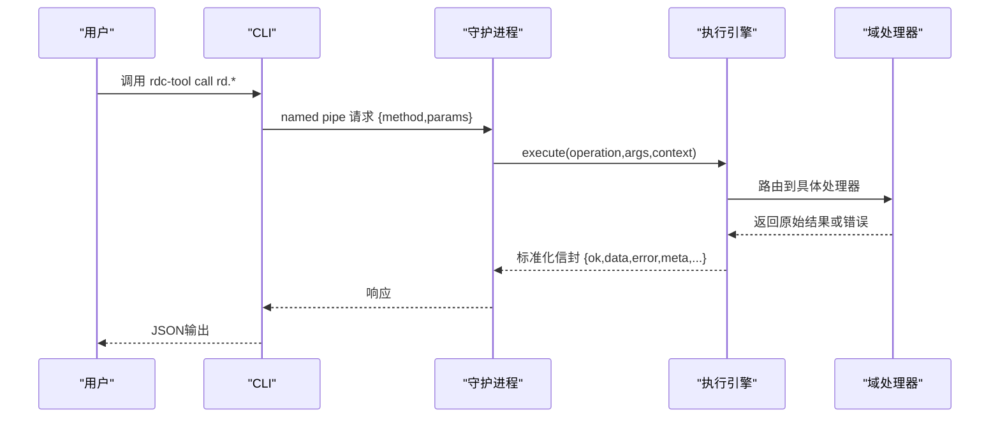
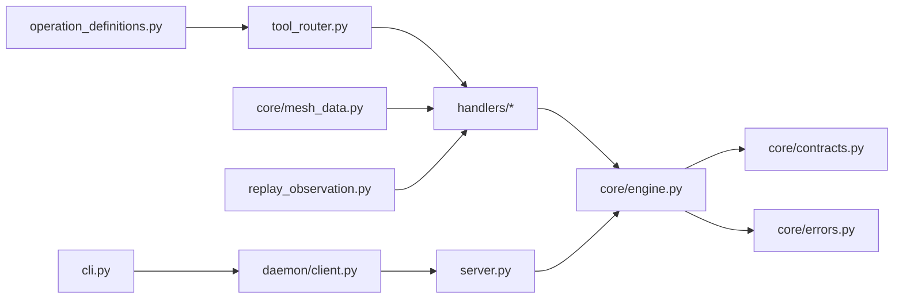

# API规范

<cite>
**本文引用的文件**
- [operation_definitions.py](file://rdc_tool/operation_definitions.py)
- [contracts.py](file://rdc_tool/core/contracts.py)
- [engine.py](file://rdc_tool/core/engine.py)
- [errors.py](file://rdc_tool/core/errors.py)
- [tool_router.py](file://rdc_tool/tool_router.py)
- [server.py](file://rdc_tool/server.py)
- [handlers/core.py](file://rdc_tool/handlers/core.py)
- [handlers/mesh.py](file://rdc_tool/handlers/mesh.py)
- [handlers/session.py](file://rdc_tool/handlers/session.py)
- [core/mesh_data.py](file://rdc_tool/core/mesh_data.py)
- [replay_observation.py](file://rdc_tool/replay_observation.py)
- [daemon/client.py](file://rdc_tool/daemon/client.py)
- [cli.py](file://rdc_tool/cli.py)
- [public-contract.md](file://docs/public-contract.md)
</cite>

## 更新摘要
**变更内容**
- 网格数据API增强：支持着色器输入空间、法线和UV属性导出，新增`rd.mesh.get_drawcall_mesh_config`操作
- Android原生呈现集成：`rd.session.observe`操作新增远程设备呈现能力，支持Android远端GPU呈现确认
- 更新操作定义和处理器路由以支持新功能
- 增强错误处理和状态报告机制

## 目录
1. [简介](#简介)
2. [项目结构](#项目结构)
3. [核心组件](#核心组件)
4. [架构总览](#架构总览)
5. [详细组件分析](#详细组件分析)
6. [依赖关系分析](#依赖关系分析)
7. [性能与并发特性](#性能与并发特性)
8. [故障排查指南](#故障排查指南)
9. [结论](#结论)
10. [附录：操作清单与示例](#附录操作清单与示例)

## 简介
本规范聚焦于 rd.* 操作的标准化接口，覆盖参数校验、返回值结构、错误码、JSON-RPC通信协议实现（请求/响应/错误处理）、幂等性、事务性与并发安全、生命周期与资源清理、向后兼容与版本迁移、客户端集成最佳实践。所有说明均基于代码仓库中的公开契约与实现。

**更新** 本次更新重点增强了网格数据API的着色器输入空间支持和Android原生呈现集成能力。

## 项目结构
RDC工具通过CLI调用守护进程，再由守护进程调度到统一执行引擎，最终路由到各域处理器并执行业务逻辑。关键路径如下：
- CLI负责解析参数、启动/连接守护进程、发送方法调用并输出结果
- 守护进程通过命名管道接收请求，维护上下文状态，转发到内部执行器
- 统一执行引擎负责操作注册、参数校验、前置条件检查、异常归一化、产物发布和标准信封封装
- 操作定义集中声明在操作目录中，按命名空间分组

**图表来源**
- [server.py:62-145](file://rdc_tool/server.py#L62-L145)
- [tool_router.py:131-154](file://rdc_tool/tool_router.py#L131-L154)
- [engine.py:40-75](file://rdc_tool/core/engine.py#L40-L75)
- [daemon/client.py:467-515](file://rdc_tool/daemon/client.py#L467-L515)

**章节来源**
- [server.py:62-145](file://rdc_tool/server.py#L62-L145)
- [tool_router.py:131-154](file://rdc_tool/tool_router.py#L131-L154)
- [engine.py:40-75](file://rdc_tool/core/engine.py#L40-L75)
- [daemon/client.py:467-515](file://rdc_tool/daemon/client.py#L467-L515)

## 核心组件
- 统一信封与产物契约：成功/失败响应结构、schema_version、tool_version、artifacts、meta、projections
- 错误分类与映射：将各类异常映射为稳定类别与错误码
- 操作注册与路由：从目录加载操作，按命名空间分发到处理器，执行前置条件校验
- 执行引擎：统一执行入口，规范化输出，统计耗时，追踪ID注入
- 守护进程通信：命名管道请求/响应，超时与诊断信息，上下文状态持久化

**更新** 新增了网格数据处理和Android原生呈现的核心组件支持。

**章节来源**
- [contracts.py:98-164](file://rdc_tool/core/contracts.py#L98-L164)
- [errors.py:9-121](file://rdc_tool/core/errors.py#L9-L121)
- [tool_router.py:34-154](file://rdc_tool/tool_router.py#L34-L154)
- [engine.py:30-75](file://rdc_tool/core/engine.py#L30-L75)
- [daemon/client.py:467-515](file://rdc_tool/daemon/client.py#L467-L515)

## 架构总览
RDC采用"CLI + 守护进程 + 统一引擎"的三层架构。CLI仅负责用户交互与参数装载；守护进程负责长驻运行、上下文隔离与资源管理；统一引擎提供跨传输一致的执行语义与响应格式。

**图表来源**
- [daemon/client.py:467-515](file://rdc_tool/daemon/client.py#L467-L515)
- [server.py:62-145](file://rdc_tool/server.py#L62-L145)
- [engine.py:40-75](file://rdc_tool/core/engine.py#L40-L75)
- [tool_router.py:131-154](file://rdc_tool/tool_router.py#L131-L154)

## 详细组件分析

### 网格数据API增强

**新增功能** 网格数据API现在支持着色器输入空间的完整属性导出，包括位置、法线和UV坐标。

#### 着色器输入空间解码
- `vertex_input`函数支持从顶点缓冲区解码VS输入属性
- 自动识别POSITION、NORMAL、TEXCOORD/UV语义
- 支持多种顶点格式：Float、UInt、SInt、UNorm、SNorm
- 支持BGRA通道重排序

#### OBJ导出增强
- `input_obj`函数现在支持完整的v/vt/vn导出
- 三角形拓扑支持法线和UV索引
- 线图和点图仅支持位置数据
- 严格验证顶点格式和语义匹配

#### 新增操作：rd.mesh.get_drawcall_mesh_config
- 获取当前drawcall的mesh配置信息
- 返回顶点输入布局、绑定信息和属性状态
- 支持实例化渲染和索引绘制
- 提供详细的顶点行数据和属性值

**章节来源**
- [core/mesh_data.py:46-148](file://rdc_tool/core/mesh_data.py#L46-L148)
- [operation_definitions.py:1539-1559](file://rdc_tool/operation_definitions.py#L1539-L1559)

### Android原生呈现集成

**新增功能** `rd.session.observe`操作现在支持Android设备的原生GPU呈现。

#### 远程呈现机制
- 通过`remote_display`字段报告呈现状态
- 支持presented、unavailable、unsupported、not_applicable四种状态
- 使用独立的序列号确认成功的GPU呈现
- PNG导出与原生呈现分离处理

#### 呈现流程
- 检测Present动作和交换缓冲区资源
- 调用`present_remote`进行原生呈现
- 捕获呈现序列号和状态信息
- 处理呈现失败的降级策略

#### 错误处理
- 缺少原生能力时返回unsupported
- 表面创建失败返回unavailable
- 网络问题导致的不支持状态
- 清晰的错误原因描述

**章节来源**
- [replay_observation.py:40-174](file://rdc_tool/replay_observation.py#L40-L174)
- [operation_definitions.py:2680-2723](file://rdc_tool/operation_definitions.py#L2680-L2723)

### 处理器路由增强

**更新** 处理器模块现在支持新的操作类型和路由逻辑。

#### Mesh处理器
- 新增`handle`函数支持mesh域操作
- 通过`server_runtime._dispatch_mesh`分发到具体实现
- 保持与其他处理器一致的异步接口

#### Session处理器增强
- 特殊处理`get_replay_events`和`observe`操作
- 直接路由到`replay_observation.handle`
- 其他session操作继续使用默认分发逻辑

**章节来源**
- [handlers/mesh.py:8-10](file://rdc_tool/handlers/mesh.py#L8-L10)
- [handlers/session.py:8-13](file://rdc_tool/handlers/session.py#L8-L13)

### 统一响应信封与产物
- 成功信封字段：schema_version、tool_version、result_kind、ok=true、data、artifacts、error=null、meta、projections
- 失败信封字段：同上，但 ok=false，error包含code、category、message、details
- 产物：支持本地路径或URL，自动计算sha256与mime类型，支持S3等后端
- 元数据：trace_id、transport、duration_ms等

**章节来源**
- [contracts.py:98-164](file://rdc_tool/core/contracts.py#L98-L164)
- [contracts.py:46-95](file://rdc_tool/core/contracts.py#L46-L95)

### 错误分类与映射
- 分类：validation、not_found、assertion_failed、runtime、permission、io、internal
- 映射规则：将Python异常转换为CoreError子类，保持稳定的code与category
- 会话相关错误：SessionError被映射为not_found或runtime，保留detail中的code/message/details

**更新** 新增了网格数据读取错误和Android呈现错误的专门处理。

**章节来源**
- [errors.py:9-121](file://rdc_tool/core/errors.py#L9-L121)

### 操作注册与前置条件校验
- 操作名规范：rd.<domain>.<action>，如 rd.capture.open_file
- 路由：根据命名空间选择对应处理器模块
- 前置条件：从目录读取prerequisites，动态判断是否满足（如session_id、capture_file_id、remote_id）
- 参数校验：使用目录中的input_schema进行严格校验，未知参数拒绝

**章节来源**
- [tool_router.py:34-154](file://rdc_tool/tool_router.py#L34-L154)
- [operation_definitions.py:1-800](file://rdc_tool/operation_definitions.py#L1-L800)

### 执行引擎与输出规范化
- 执行流程：解析操作→查找处理器→执行→捕获异常→生成标准信封
- 输出规范化：支持多种输入格式（字符串JSON、字典、success/error标志），统一转换为标准信封
- 产物发布：自动收集路径/URL候选并发布为artifacts
- 追踪与计时：注入trace_id、记录duration_ms

**章节来源**
- [engine.py:40-204](file://rdc_tool/core/engine.py#L40-L204)

### 守护进程通信协议（类JSON-RPC）
- 请求格式：{token, method, params}
- 响应格式：由守护进程返回给CLI的dict，随后被引擎标准化
- 超时处理：等待响应时轮询，超时抛出DaemonRequestTimeout，附带诊断信息
- 上下文隔离：每个上下文独立状态文件，支持多实例并行

**章节来源**
- [daemon/client.py:467-515](file://rdc_tool/daemon/client.py#L467-L515)
- [daemon/client.py:623-733](file://rdc_tool/daemon/client.py#L623-L733)

### 处理器与域操作
- 处理器入口：每个域模块提供handle(action, args, env)异步函数
- 核心处理器：转发到server_runtime._dispatch_core，由引擎统一调度
- 其他域：buffer、capture、debug、event、export、macro、mesh、perf、pipeline、remote、replay、resource、session、shader、texture、util、vfs

**更新** mesh和session处理器现在支持新的操作类型。

**章节来源**
- [handlers/core.py:8-10](file://rdc_tool/handlers/core.py#L8-L10)
- [tool_router.py:34-54](file://rdc_tool/tool_router.py#L34-L54)

## 依赖关系分析

**图表来源**
- [operation_definitions.py:1-800](file://rdc_tool/operation_definitions.py#L1-L800)
- [tool_router.py:131-154](file://rdc_tool/tool_router.py#L131-L154)
- [engine.py:40-75](file://rdc_tool/core/engine.py#L40-L75)
- [server.py:62-145](file://rdc_tool/server.py#L62-L145)
- [daemon/client.py:467-515](file://rdc_tool/daemon/client.py#L467-L515)
- [cli.py:1-200](file://rdc_tool/cli.py#L1-L200)
- [core/mesh_data.py:1-148](file://rdc_tool/core/mesh_data.py#L1-L148)
- [replay_observation.py:1-174](file://rdc_tool/replay_observation.py#L1-L174)

**章节来源**
- [tool_router.py:131-154](file://rdc_tool/tool_router.py#L131-L154)
- [engine.py:40-75](file://rdc_tool/core/engine.py#L40-L75)
- [server.py:62-145](file://rdc_tool/server.py#L62-L145)
- [daemon/client.py:467-515](file://rdc_tool/daemon/client.py#L467-L515)
- [cli.py:1-200](file://rdc_tool/cli.py#L1-L200)

## 性能与并发特性
- 单上下文串行执行：同一上下文内操作顺序执行，避免竞争
- 多上下文隔离：不同daemon context可并行运行，互不影响
- 预览同步：部分操作会触发预览自动同步，减少额外开销
- 产物缓存：artifacts支持URL与本地路径，避免重复写入
- 超时控制：守护进程请求默认超时，防止阻塞

**更新** 网格数据读取和Android呈现操作增加了专门的性能优化和错误恢复机制。

## 故障排查指南
- 未知操作：在CLI层即拒绝，返回operation_not_found
- 参数校验失败：返回validation_error，包含详细信息
- 前置条件缺失：返回missing_prerequisite_*，提示所需工具链
- 守护进程超时：返回daemon_timeout，附带active_operation与daemon_state_excerpt
- 会话恢复失败：open_replay可能返回stale_session_requires_restart，需重启会话

**更新** 新增了网格数据读取错误和Android呈现问题的专门排查指南。

**章节来源**
- [cli.py:107-125](file://rdc_tool/cli.py#L107-L125)
- [tool_router.py:64-128](file://rdc_tool/tool_router.py#L64-L128)
- [daemon/client.py:467-515](file://rdc_tool/daemon/client.py#L467-L515)
- [operation_definitions.py:245-282](file://rdc_tool/operation_definitions.py#L245-L282)

## 结论
RDC的rd.*操作通过统一的目录驱动定义、严格的参数校验、稳定的错误分类与信封格式，提供了高可靠性的API接口。守护进程与执行引擎分离确保了可扩展性与可维护性。建议客户端遵循公共契约，使用标准信封处理成功与失败，并利用artifacts机制管理大对象。

**更新** 本次更新显著增强了网格数据分析和Android原生呈现能力，为移动设备调试和复杂图形分析提供了更强大的工具支持。

## 附录：操作清单与示例

### 核心与环境管理 (rd.core.*)
- rd.core.init：初始化运行时，启用远程能力
- rd.core.get_capabilities：获取环境能力矩阵
- rd.core.get_config / set_config：读取/设置运行时配置
- rd.core.get_logs：查询日志，支持时间戳与级别过滤
- rd.core.get_operation_history：查询操作历史，支持状态过滤
- rd.core.get_runtime_metrics：获取自监控指标与限制
- rd.core.get_tool_graph：获取工具依赖图
- rd.core.get_version：获取版本信息
- rd.core.healthcheck：执行自检
- rd.core.list_tools：列出可用工具
- rd.core.set_log_level：设置日志等级
- rd.core.shutdown：关闭运行时并释放资源

**章节来源**
- [operation_definitions.py:283-596](file://rdc_tool/operation_definitions.py#L283-L596)

### 捕获与回放 (rd.capture.*)
- rd.capture.open_file：打开捕获文件，返回句柄
- rd.capture.close_file：关闭捕获句柄
- rd.capture.open_replay：创建回放会话，支持远程选项
- rd.capture.close_replay：关闭回放会话
- rd.capture.get_info：获取捕获元数据

**章节来源**
- [operation_definitions.py:161-282](file://rdc_tool/operation_definitions.py#L161-L282)

### 缓冲区与网格数据访问 (rd.buffer.*)
- rd.buffer.get_data：读取原始字节，支持offset/size/base64
- rd.buffer.get_structured_data：按布局解码结构化数据
- rd.buffer.search_pattern：搜索字节模式

**更新** 网格数据访问现在支持更丰富的顶点属性解析。

**章节来源**
- [operation_definitions.py:4-160](file://rdc_tool/operation_definitions.py#L4-L160)

### 网格数据操作 (rd.mesh.*)
- rd.mesh.get_drawcall_mesh_config：获取当前drawcall的mesh配置，包括顶点输入布局、绑定信息和属性状态

**新增** 这是网格数据分析的核心操作，支持着色器输入空间的完整属性导出。

**章节来源**
- [operation_definitions.py:1539-1559](file://rdc_tool/operation_definitions.py#L1539-L1559)

### Shader调试 (rd.debug.*)
- rd.debug.clear_breakpoints：清除断点
- rd.debug.continue：继续执行直到断点/结束/超时
- rd.debug.evaluate_expression：求值表达式
- rd.debug.finish：结束调试会话
- rd.debug.get_callstack：获取调用栈
- rd.debug.get_variables：获取变量列表
- rd.debug.run_to：运行到指定位置
- rd.debug.set_breakpoints：设置断点

**章节来源**
- [operation_definitions.py:597-800](file://rdc_tool/operation_definitions.py#L597-L800)

### 导出与报告 (rd.export.*)
- rd.export.buffer：导出缓冲区数据
- rd.export.cbuffer_dump：导出常量缓冲数据
- rd.export.mesh：导出网格数据，支持OBJ格式和着色器输入属性
- rd.export.screenshot：导出屏幕截图
- rd.export.shader_bundle：导出Shader包
- rd.export.texture：导出纹理数据

**更新** `rd.export.mesh`现在支持完整的着色器输入空间属性导出，包括位置、法线和UV坐标。

**章节来源**
- [operation_definitions.py:1247-1265](file://rdc_tool/operation_definitions.py#L1247-L1265)

### 上下文快照工具 (rd.session.*)
- rd.session.clear_context：清除上下文
- rd.session.close_preview：关闭预览窗口
- rd.session.create_context：创建上下文
- rd.session.get_context：获取上下文状态
- rd.session.get_replay_events：获取回放事件
- rd.session.list_contexts：列出上下文
- rd.session.list_sessions：列出会话
- rd.session.observe：原子应用事件并导出颜色输出，支持Android原生呈现
- rd.session.open_preview：打开预览窗口
- rd.session.resume：恢复会话
- rd.session.select_session：选择会话
- rd.session.update_context：更新上下文

**更新** `rd.session.observe`现在支持Android设备的原生GPU呈现，提供完整的呈现状态报告。

**章节来源**
- [operation_definitions.py:2680-2879](file://rdc_tool/operation_definitions.py#L2680-L2879)

### JSON-RPC通信协议实现
- 请求格式：{token, method, params}
- 响应格式：守护进程返回dict，由引擎标准化为标准信封
- 错误处理：超时、无效响应、状态清理
- 上下文管理：每个上下文独立状态文件，支持多实例

**章节来源**
- [daemon/client.py:467-515](file://rdc_tool/daemon/client.py#L467-L515)
- [daemon/client.py:623-733](file://rdc_tool/daemon/client.py#L623-L733)

### 幂等性、事务性与并发安全
- 幂等性：读操作（如get_data、get_info）通常幂等；写操作（如set_config）需谨慎
- 事务性：无显式事务，操作原子性由底层服务保证
- 并发安全：同上下文串行执行，不同上下文隔离

**更新** 网格数据读取和Android呈现操作具有特定的并发安全保证。

### 生命周期管理与资源清理
- 会话生命周期：open_replay → 使用 → close_replay
- 文件句柄：open_file → 使用 → close_file
- 运行时：init → 使用 → shutdown
- 资源清理：守护进程自动清理孤立状态，支持超时回收

**更新** Android原生呈现操作具有独立的资源管理和清理机制。

**章节来源**
- [operation_definitions.py:161-282](file://rdc_tool/operation_definitions.py#L161-L282)
- [daemon/client.py:554-607](file://rdc_tool/daemon/client.py#L554-L607)

### 向后兼容性保证与版本迁移
- 公共契约稳定：schema_version固定，未知操作/参数拒绝
- 迁移表：文档化替代操作，非运行时强制
- 版本检测：通过rd.core.get_version获取构建信息

**更新** 新增的功能都保持了向后兼容性，不会影响现有客户端。

**章节来源**
- [public-contract.md:1-26](file://docs/public-contract.md#L1-L26)
- [operation_definitions.py:283-306](file://rdc_tool/operation_definitions.py#L283-L306)

### 客户端集成示例与最佳实践
- 使用rdc CLI调用：rdc-tool call rd.* --args-json ...
- 处理标准信封：检查ok字段，读取data或error
- 管理上下文：使用--daemon-context隔离多任务
- 错误重试：对timeout错误实施指数退避
- 产物下载：从artifacts获取文件路径或URL

**更新** 建议使用新的网格数据API和Android呈现功能进行高级图形分析。

**章节来源**
- [cli.py:62-104](file://rdc_tool/cli.py#L62-L104)
- [daemon/client.py:467-515](file://rdc_tool/daemon/client.py#L467-L515)