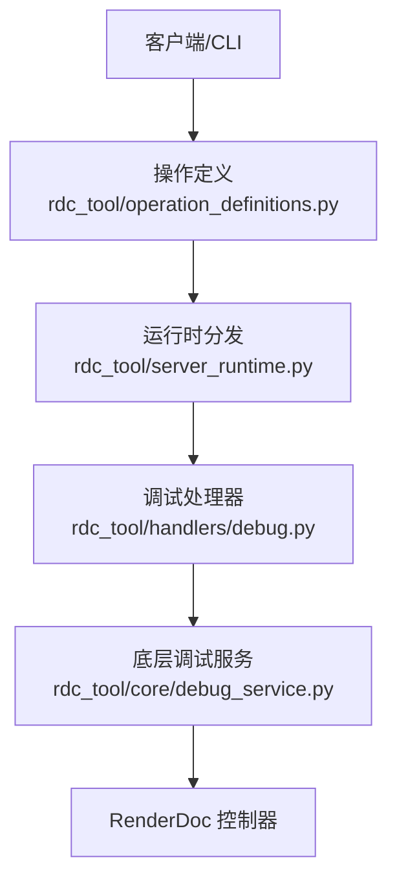
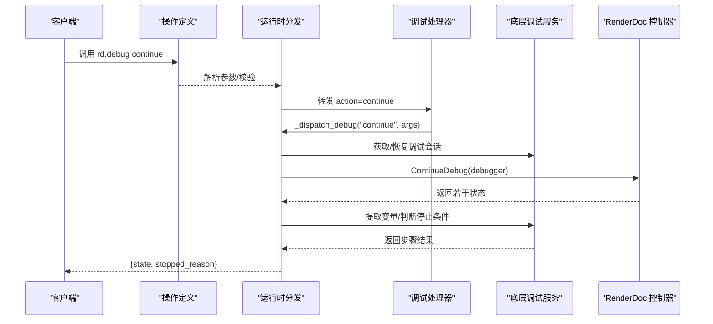
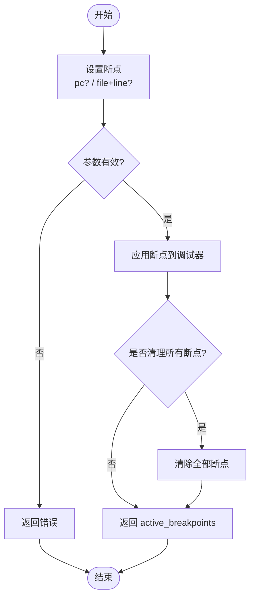
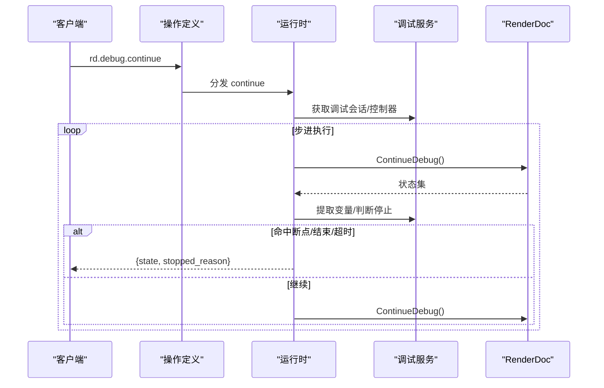
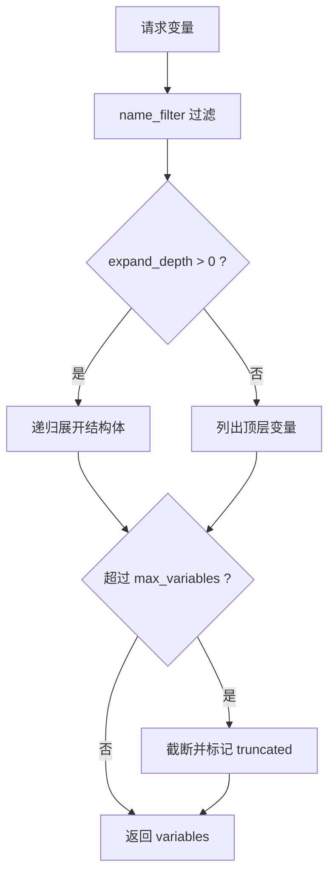
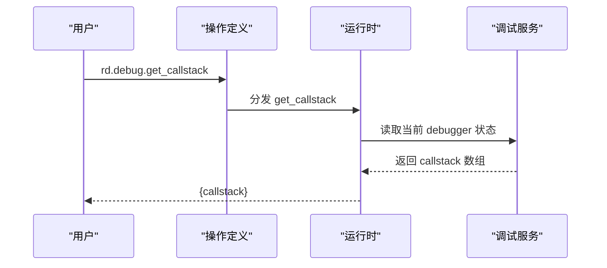
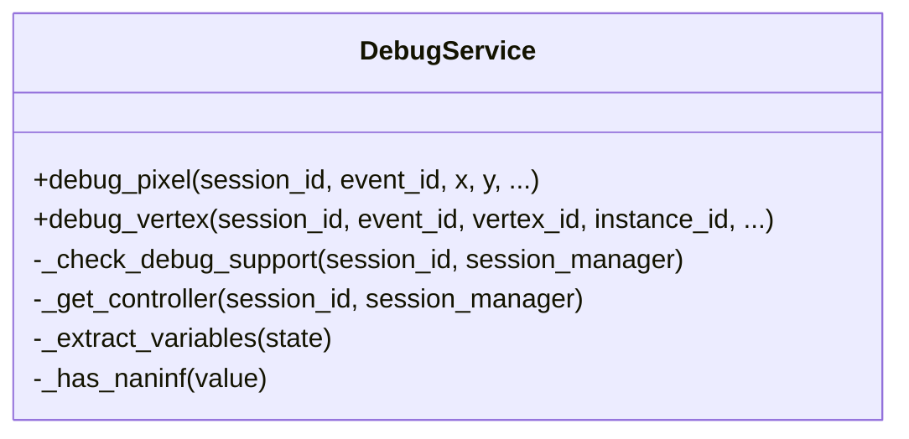
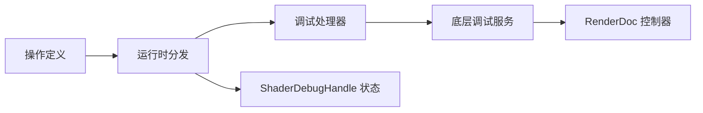

# Shader调试API

<cite>
**本文引用的文件**
- [rdc_tool/handlers/debug.py](file://rdc_tool/handlers/debug.py)
- [rdc_tool/server_runtime.py](file://rdc_tool/server_runtime.py)
- [rdc_tool/operation_definitions.py](file://rdc_tool/operation_definitions.py)
- [rdc_tool/core/debug_service.py](file://rdc_tool/core/debug_service.py)
</cite>

## 目录
1. [简介](#简介)
2. [项目结构](#项目结构)
3. [核心组件](#核心组件)
4. [架构总览](#架构总览)
5. [详细组件分析](#详细组件分析)
6. [依赖关系分析](#依赖关系分析)
7. [性能考量](#性能考量)
8. [故障排查指南](#故障排查指南)
9. [结论](#结论)
10. [附录](#附录)

## 简介
本文件面向使用 rdc-tools 的开发者与测试工程师，系统化说明 Shader 调试 API（rd.debug.*）的能力、数据模型与调用流程。重点覆盖：
- 断点管理：设置、清理断点，支持按 PC 地址或源码位置。
- 调试控制：继续执行、运行到指定位置、结束调试会话。
- 变量检查与表达式求值：变量过滤、展开深度、表达式语法。
- 调用栈分析：获取当前 shader 调用栈帧信息。
- 最佳实践：断点策略、性能影响评估、调试会话管理。

## 项目结构
Shader 调试能力由“操作定义 + 运行时分发 + 处理器 + 底层服务”四层构成：
- 操作定义层：在工具目录中声明 rd.debug.* 的公开接口、参数与约束。
- 运行时分发层：将 action 路由到具体实现，并维护调试会话状态。
- 处理器层：统一入口，转发到运行时调度。
- 底层服务层：封装 RenderDoc 的像素/顶点级调试原语，提供逐步执行、变量提取、NaN/Inf 检测等。

**图示来源**
- [rdc_tool/operation_definitions.py:597-799](file://rdc_tool/operation_definitions.py#L597-L799)
- [rdc_tool/server_runtime.py:10900-10920](file://rdc_tool/server_runtime.py#L10900-L10920)
- [rdc_tool/handlers/debug.py:8-9](file://rdc_tool/handlers/debug.py#L8-L9)
- [rdc_tool/core/debug_service.py:43-120](file://rdc_tool/core/debug_service.py#L43-L120)

**章节来源**
- [rdc_tool/operation_definitions.py:597-799](file://rdc_tool/operation_definitions.py#L597-L799)
- [rdc_tool/server_runtime.py:178-214](file://rdc_tool/server_runtime.py#L178-L214)
- [rdc_tool/handlers/debug.py:8-9](file://rdc_tool/handlers/debug.py#L8-L9)
- [rdc_tool/core/debug_service.py:43-120](file://rdc_tool/core/debug_service.py#L43-L120)

## 核心组件
- 操作定义（rd.debug.*）：集中声明断点、继续、运行到、变量、表达式、调用栈、结束等操作的输入输出与前置条件。
- 运行时状态（ShaderDebugHandle）：维护每个调试会话的 trace、debugger、当前状态、断点列表、停止原因等。
- 处理器（debug handler）：统一入口，将 action 转交给运行时调度。
- 底层服务（DebugService）：基于 RenderDoc 的 DebugPixel/DebugVertex/ContinueDebug 等 API，完成逐步执行、变量提取、NaN/Inf 检测与 artifact 持久化。

**章节来源**
- [rdc_tool/operation_definitions.py:597-799](file://rdc_tool/operation_definitions.py#L597-L799)
- [rdc_tool/server_runtime.py:178-214](file://rdc_tool/server_runtime.py#L178-L214)
- [rdc_tool/handlers/debug.py:8-9](file://rdc_tool/handlers/debug.py#L8-L9)
- [rdc_tool/core/debug_service.py:43-120](file://rdc_tool/core/debug_service.py#L43-L120)

## 架构总览
下图展示一次典型的 rd.debug.continue 调用链：从 CLI/客户端进入操作定义，经运行时分发到处理器，再调用底层服务逐步执行，最终返回状态与停止原因。

**图示来源**
- [rdc_tool/operation_definitions.py:620-645](file://rdc_tool/operation_definitions.py#L620-L645)
- [rdc_tool/server_runtime.py:10900-10920](file://rdc_tool/server_runtime.py#L10900-L10920)
- [rdc_tool/handlers/debug.py:8-9](file://rdc_tool/handlers/debug.py#L8-L9)
- [rdc_tool/core/debug_service.py:143-191](file://rdc_tool/core/debug_service.py#L143-L191)

## 详细组件分析

### 断点管理：rd.debug.set_breakpoints 与 rd.debug.clear_breakpoints
- 设置断点（set_breakpoints）
  - 支持两种目标：
    - 按 PC 地址：通过 target 中的 pc 字段定位指令。
    - 按源码位置：通过 file 与 line 组合定位源码行。
  - 返回值包含 active_breakpoints，表示成功激活的断点集合。
- 清理断点（clear_breakpoints）
  - 清除当前调试会话的所有断点，便于重置调试上下文。

**图示来源**
- [rdc_tool/operation_definitions.py:597-619](file://rdc_tool/operation_definitions.py#L597-L619)
- [rdc_tool/operation_definitions.py:782-799](file://rdc_tool/operation_definitions.py#L782-L799)

**章节来源**
- [rdc_tool/operation_definitions.py:597-619](file://rdc_tool/operation_definitions.py#L597-L619)
- [rdc_tool/operation_definitions.py:782-799](file://rdc_tool/operation_definitions.py#L782-L799)

### 调试控制流程：continue、run_to、finish
- continue（继续执行）
  - 在超时时间内持续调用底层 ContinueDebug，直到命中断点、执行结束或达到步数限制。
  - 返回当前 state 与 stopped_reason（如 breakpoint、end、timeout）。
- run_to（运行到指定位置）
  - 支持以纹理目标（texture_id + rt_index）作为运行目标，用于快速跳转到特定渲染目标像素。
  - 内部会设置断点或直接驱动调试器前进至目标。
- finish（结束调试会话）
  - 释放调试资源，关闭 trace/debugger，清理会话状态。

**图示来源**
- [rdc_tool/operation_definitions.py:620-645](file://rdc_tool/operation_definitions.py#L620-L645)
- [rdc_tool/operation_definitions.py:751-781](file://rdc_tool/operation_definitions.py#L751-L781)
- [rdc_tool/core/debug_service.py:143-191](file://rdc_tool/core/debug_service.py#L143-L191)

**章节来源**
- [rdc_tool/operation_definitions.py:620-645](file://rdc_tool/operation_definitions.py#L620-L645)
- [rdc_tool/operation_definitions.py:751-781](file://rdc_tool/operation_definitions.py#L751-L781)
- [rdc_tool/core/debug_service.py:143-191](file://rdc_tool/core/debug_service.py#L143-L191)

### 变量检查与表达式求值：get_variables、evaluate_expression
- get_variables（获取变量）
  - name_filter：支持正则或子串匹配，用于筛选变量名。
  - expand_depth：控制结构体/对象展开的深度，避免过大负载。
  - max_variables：限制返回变量数量，防止响应过大。
  - 返回当前作用域内的变量集合，适合快速定位着色器状态。
- evaluate_expression（表达式求值）
  - 在当前调试上下文中对表达式求值，例如访问常量缓冲区成员或寄存器表达式。
  - 返回 value；若表达式不可用或未实现，返回相应错误。

**图示来源**
- [rdc_tool/operation_definitions.py:717-750](file://rdc_tool/operation_definitions.py#L717-L750)

**章节来源**
- [rdc_tool/operation_definitions.py:717-750](file://rdc_tool/operation_definitions.py#L717-L750)
- [rdc_tool/operation_definitions.py:646-670](file://rdc_tool/operation_definitions.py#L646-L670)

### 调用栈分析：get_callstack
- 获取当前 shader 调用栈，包括函数名、源文件与行号等信息。
- 适用于定位复杂嵌套调用路径，辅助理解着色器执行上下文。

**图示来源**
- [rdc_tool/operation_definitions.py:694-716](file://rdc_tool/operation_definitions.py#L694-L716)

**章节来源**
- [rdc_tool/operation_definitions.py:694-716](file://rdc_tool/operation_definitions.py#L694-L716)

### 底层调试服务：DebugService
- 能力检测：根据 session 能力或 GraphicsAPI 判断是否支持 shader debugging（D3D11/D3D12/Vulkan）。
- 逐步执行：通过 ContinueDebug 循环采集状态，提取变量，检测 NaN/Inf。
- 资源管理：确保 FreeTrace 被调用，避免驱动资源泄漏。
- 持久化：将 trace 保存为 JSON artifact，便于离线分析。

**图示来源**
- [rdc_tool/core/debug_service.py:43-120](file://rdc_tool/core/debug_service.py#L43-L120)
- [rdc_tool/core/debug_service.py:427-466](file://rdc_tool/core/debug_service.py#L427-L466)
- [rdc_tool/core/debug_service.py:492-562](file://rdc_tool/core/debug_service.py#L492-L562)

**章节来源**
- [rdc_tool/core/debug_service.py:43-120](file://rdc_tool/core/debug_service.py#L43-L120)
- [rdc_tool/core/debug_service.py:427-466](file://rdc_tool/core/debug_service.py#L427-L466)
- [rdc_tool/core/debug_service.py:492-562](file://rdc_tool/core/debug_service.py#L492-L562)

## 依赖关系分析
- 操作定义依赖运行时分发：所有 rd.debug.* 操作均通过运行时进行参数校验与会话管理。
- 运行时依赖处理器：debug 处理器统一转发 action 给运行时调度。
- 运行时依赖底层服务：实际调试逻辑由 DebugService 完成，依赖 RenderDoc 控制器。
- 状态管理：ShaderDebugHandle 维护每个调试会话的关键状态，包括断点、当前状态、停止原因等。

**图示来源**
- [rdc_tool/operation_definitions.py:597-799](file://rdc_tool/operation_definitions.py#L597-L799)
- [rdc_tool/server_runtime.py:178-214](file://rdc_tool/server_runtime.py#L178-L214)
- [rdc_tool/handlers/debug.py:8-9](file://rdc_tool/handlers/debug.py#L8-L9)
- [rdc_tool/core/debug_service.py:43-120](file://rdc_tool/core/debug_service.py#L43-L120)

**章节来源**
- [rdc_tool/operation_definitions.py:597-799](file://rdc_tool/operation_definitions.py#L597-L799)
- [rdc_tool/server_runtime.py:178-214](file://rdc_tool/server_runtime.py#L178-L214)
- [rdc_tool/handlers/debug.py:8-9](file://rdc_tool/handlers/debug.py#L8-L9)
- [rdc_tool/core/debug_service.py:43-120](file://rdc_tool/core/debug_service.py#L43-L120)

## 性能考量
- 逐步执行开销：ContinueDebug 每步都会产生状态采集与变量提取，建议合理设置 max_steps 与 timeout_ms，避免长时间阻塞。
- 变量展开成本：expand_depth 越大，数据结构越深，响应体积越大；建议在交互式调试时逐步增加深度。
- 断点密度：过多断点会导致频繁暂停，影响执行效率；建议仅在关键路径设置断点。
- 资源释放：每次调试会话结束后务必调用 finish，确保 FreeTrace 被调用，避免驱动资源泄漏。
- 日志与指标：结合 core.get_logs 与 core.get_runtime_metrics 监控调试操作耗时与失败率。

[本节为通用指导，不直接分析具体文件]

## 故障排查指南
- 不支持的图形 API：当当前 API/driver 不支持 shader debugging 时，底层服务会返回 notes 提示；可切换至 D3D11/D3D12/Vulkan。
- RenderDoc 模块不可用：若 renderdoc Python 模块未加载，调试功能不可用；需确保模块路径正确。
- 控制器获取失败：无法获取 replay controller 时，调试操作会失败；检查 session_id 与回放状态。
- 断点无效：确认断点目标（pc/file+line）是否正确映射到当前 shader；必要时先获取调用栈与变量缩小范围。
- 超时与步数限制：continue/run_to 可能因超时或步数限制提前结束；调整 timeout_ms 与 max_steps。
- 变量为空：若变量提取结果为空，检查当前 step 是否有 changes；必要时单步执行观察变化。

**章节来源**
- [rdc_tool/core/debug_service.py:94-120](file://rdc_tool/core/debug_service.py#L94-L120)
- [rdc_tool/core/debug_service.py:427-466](file://rdc_tool/core/debug_service.py#L427-L466)
- [rdc_tool/core/debug_service.py:492-562](file://rdc_tool/core/debug_service.py#L492-L562)

## 结论
rd.debug.* 提供了一套完整的 Shader 调试能力，涵盖断点管理、调试控制、变量检查、表达式求值与调用栈分析。通过操作定义、运行时分发、处理器与底层服务的分层设计，既保证了易用性，又具备良好的扩展性与可维护性。在实际使用中，应结合断点策略、性能预算与资源管理，获得高效稳定的调试体验。

[本节为总结，不直接分析具体文件]

## 附录
- 常用操作速查
  - rd.debug.set_breakpoints：设置断点（pc 或 file+line）
  - rd.debug.clear_breakpoints：清除所有断点
  - rd.debug.continue：继续执行（支持超时）
  - rd.debug.run_to：运行到指定位置（纹理目标）
  - rd.debug.get_variables：获取变量（name_filter、expand_depth、max_variables）
  - rd.debug.evaluate_expression：表达式求值
  - rd.debug.get_callstack：获取调用栈
  - rd.debug.finish：结束调试会话

**章节来源**
- [rdc_tool/operation_definitions.py:597-799](file://rdc_tool/operation_definitions.py#L597-L799)