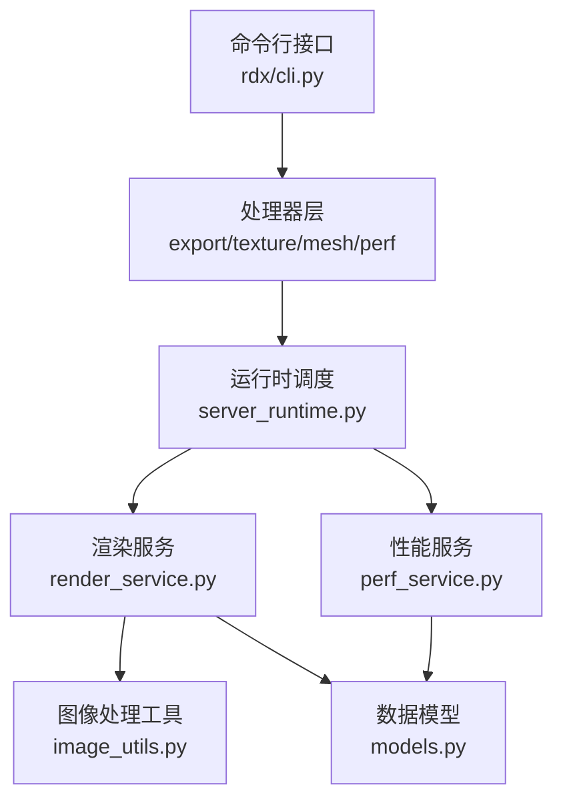
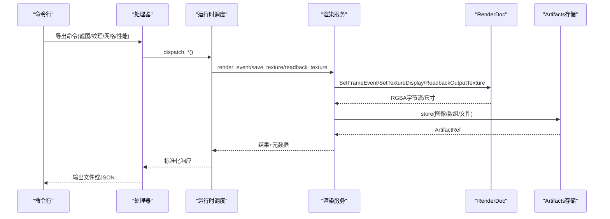
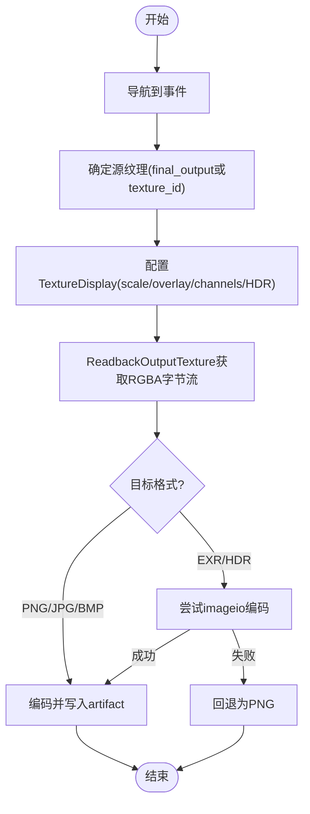
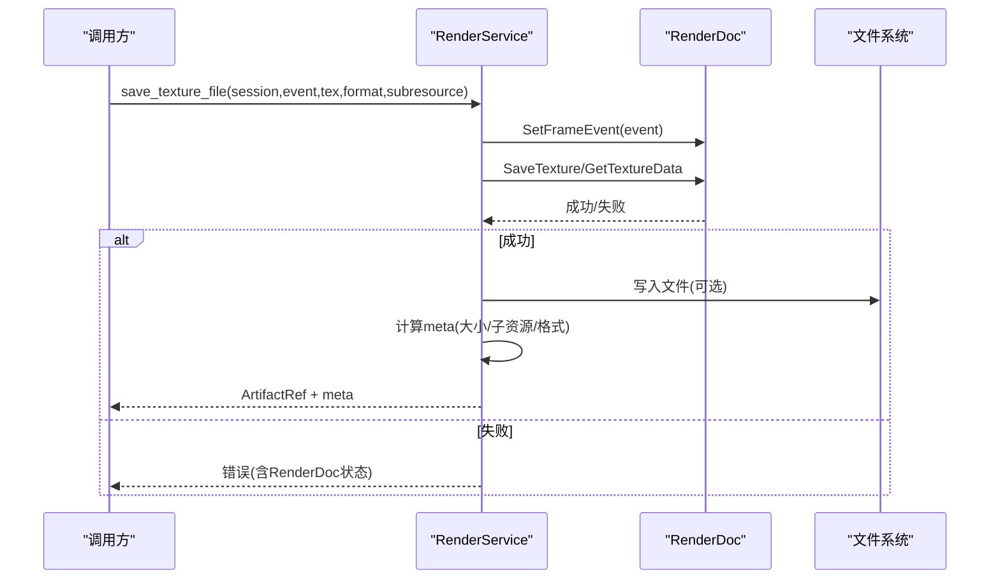
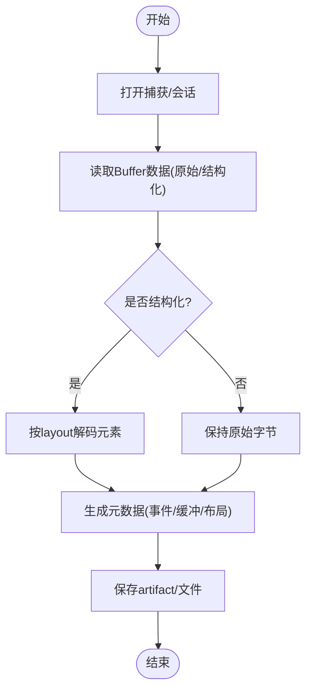
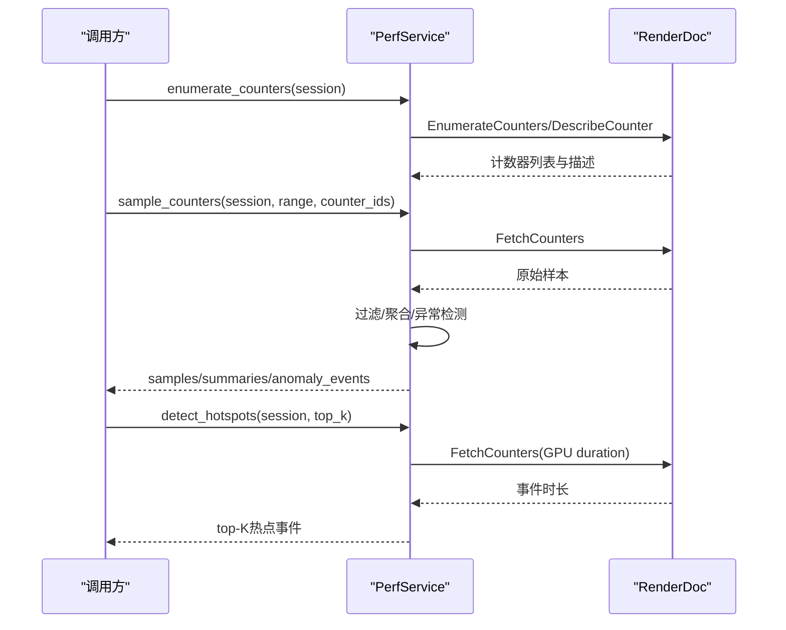
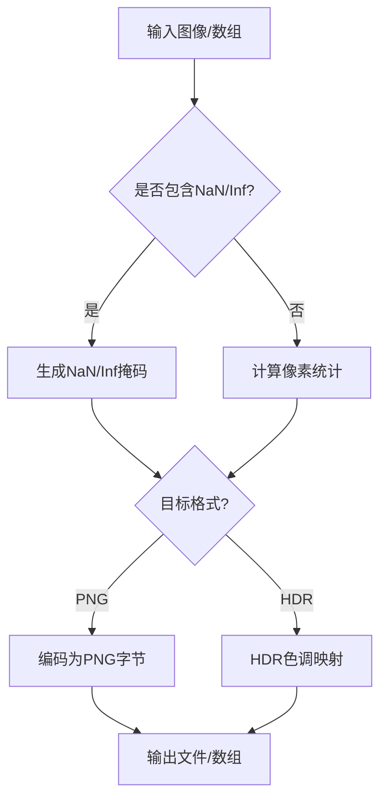
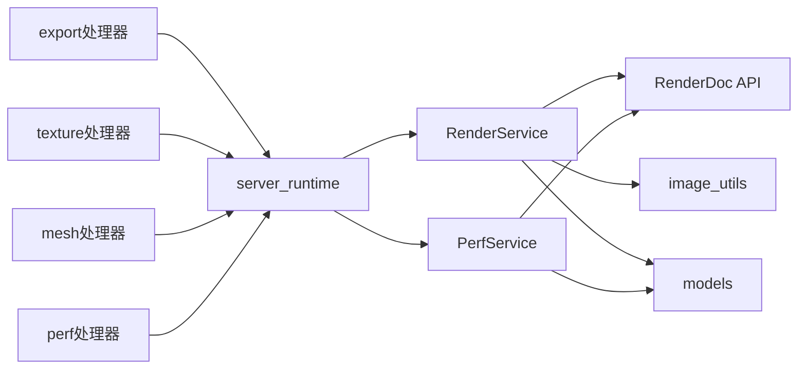

# 导出与分析API

<cite>
**本文引用的文件**
- [rdx/handlers/export.py](file://rdx/handlers/export.py)
- [rdx/handlers/texture.py](file://rdx/handlers/texture.py)
- [rdx/handlers/mesh.py](file://rdx/handlers/mesh.py)
- [rdx/handlers/perf.py](file://rdx/handlers/perf.py)
- [rdx/core/render_service.py](file://rdx/core/render_service.py)
- [rdx/core/perf_service.py](file://rdx/core/perf_service.py)
- [rdx/utils/image_utils.py](file://rdx/utils/image_utils.py)
- [rdx/models.py](file://rdx/models.py)
- [rdx/server_runtime.py](file://rdx/server_runtime.py)
- [rdx/cli.py](file://rdx/cli.py)
- [rdx/operation_definitions.py](file://rdx/operation_definitions.py)
</cite>

## 目录
1. [简介](#简介)
2. [项目结构](#项目结构)
3. [核心组件](#核心组件)
4. [架构总览](#架构总览)
5. [详细组件分析](#详细组件分析)
6. [依赖关系分析](#依赖关系分析)
7. [性能考量](#性能考量)
8. [故障排查指南](#故障排查指南)
9. [结论](#结论)
10. [附录](#附录)

## 简介
本文件面向“导出与分析API”，聚焦数据导出与分析能力，覆盖以下方面：
- 截图导出：图像格式支持（PNG、JPEG、BMP等）、分辨率控制、裁剪区域指定、透明度处理。
- 纹理导出：纹理格式转换、Mipmap/子资源选择、压缩格式支持（如DDS）。
- 网格数据导出：顶点数据提取、索引缓冲导出、材质属性保留。
- 性能分析工具集成：帧率统计、GPU利用率分析、瓶颈识别。
- 导出数据的后处理工具链：数据验证、格式转换、批量处理脚本。

## 项目结构
导出与分析相关代码主要分布在以下模块：
- 处理器层：将外部调用路由到具体服务实现（export、texture、mesh、perf）。
- 服务层：RenderService（渲染与读回）、PerfService（性能计数器采样与分析）。
- 工具层：image_utils（图像处理、HDR色调映射、NaN/Inf检测、差异图）。
- 模型与运行时：models（统一响应与引用）、server_runtime（全局调度与上下文管理）、cli（命令行入口）。
- 操作定义：operation_definitions（公开操作契约与参数说明）。

**图表来源**
- [rdx/cli.py:1538-1555](file://rdx/cli.py#L1538-L1555)
- [rdx/handlers/export.py:8-9](file://rdx/handlers/export.py#L8-L9)
- [rdx/handlers/texture.py:8-9](file://rdx/handlers/texture.py#L8-L9)
- [rdx/handlers/mesh.py:8-9](file://rdx/handlers/mesh.py#L8-L9)
- [rdx/handlers/perf.py:8-9](file://rdx/handlers/perf.py#L8-L9)
- [rdx/server_runtime.py:230-238](file://rdx/server_runtime.py#L230-L238)
- [rdx/core/render_service.py:346-521](file://rdx/core/render_service.py#L346-L521)
- [rdx/core/perf_service.py:212-487](file://rdx/core/perf_service.py#L212-L487)
- [rdx/utils/image_utils.py:21-478](file://rdx/utils/image_utils.py#L21-L478)
- [rdx/models.py:103-122](file://rdx/models.py#L103-L122)

**章节来源**
- [rdx/cli.py:1538-1555](file://rdx/cli.py#L1538-L1555)
- [rdx/handlers/export.py:8-9](file://rdx/handlers/export.py#L8-L9)
- [rdx/handlers/texture.py:8-9](file://rdx/handlers/texture.py#L8-L9)
- [rdx/handlers/mesh.py:8-9](file://rdx/handlers/mesh.py#L8-L9)
- [rdx/handlers/perf.py:8-9](file://rdx/handlers/perf.py#L8-L9)
- [rdx/server_runtime.py:230-238](file://rdx/server_runtime.py#L230-L238)

## 核心组件
- 渲染服务（RenderService）：负责事件级截图、纹理保存、像素读取、纹理统计等。
- 性能服务（PerfService）：枚举GPU计数器、采样、热点检测、异常事件识别。
- 图像处理工具（image_utils）：提供NaN/Inf掩码、差异图、边界框叠加、HDR色调映射等。
- 模型（models）：统一响应封装、ArtifactRef、性能结果等数据结构。
- 运行时调度（server_runtime）：集中注册与分发工具调用，维护上下文与配置。
- 命令行（cli）：暴露导出命令（screenshot、texture、buffer、mesh）与像素检查命令。

**章节来源**
- [rdx/core/render_service.py:346-521](file://rdx/core/render_service.py#L346-L521)
- [rdx/core/perf_service.py:212-487](file://rdx/core/perf_service.py#L212-L487)
- [rdx/utils/image_utils.py:80-220](file://rdx/utils/image_utils.py#L80-L220)
- [rdx/models.py:103-122](file://rdx/models.py#L103-L122)
- [rdx/server_runtime.py:230-238](file://rdx/server_runtime.py#L230-L238)
- [rdx/cli.py:1538-1555](file://rdx/cli.py#L1538-L1555)

## 架构总览
导出与分析API的调用路径如下：
- CLI解析参数并生成工具名与参数。
- 处理器将调用转发至server_runtime进行分发。
- server_runtime根据命名空间调用对应服务（RenderService/PerfService）。
- 服务通过RenderDoc API执行实际工作，并将结果持久化为artifact或返回结构化数据。
- 工具层对数据进行编码、统计、可视化等后处理。

**图表来源**
- [rdx/cli.py:1538-1555](file://rdx/cli.py#L1538-L1555)
- [rdx/handlers/export.py:8-9](file://rdx/handlers/export.py#L8-L9)
- [rdx/server_runtime.py:230-238](file://rdx/server_runtime.py#L230-L238)
- [rdx/core/render_service.py:357-521](file://rdx/core/render_service.py#L357-L521)
- [rdx/core/render_service.py:523-646](file://rdx/core/render_service.py#L523-L646)
- [rdx/core/render_service.py:658-794](file://rdx/core/render_service.py#L658-L794)

## 详细组件分析

### 截图导出（事件输出截图）
- 功能要点
  - 支持格式：PNG、JPEG、EXR、HDR、BMP、RAW、NPZ等；默认PNG。
  - 分辨率控制：通过scale设置缩放；0表示自适应窗口。
  - 裁剪区域：readback_texture支持region参数（x,y,width,height），用于限定矩形区域。
  - 透明度处理：RGBA输入在编码时正确处理alpha；JPEG会转换为RGB丢弃alpha。
  - HDR处理：EXR/HDR使用float32通道；若依赖库不可用则回退为PNG。
- 关键流程
  - 导航到指定event，选择source（final_output或指定texture_id）。
  - 构建TextureDisplay并设置subresource（mip/slice/sample）。
  - ReadbackOutputTexture获取RGBA字节流，编码为目标格式并存储为artifact。
- 错误与健壮性
  - 无效subresource或region抛出明确错误。
  - 编码器缺失时记录警告并回退到PNG。

**图表来源**
- [rdx/core/render_service.py:357-521](file://rdx/core/render_service.py#L357-L521)
- [rdx/core/render_service.py:278-338](file://rdx/core/render_service.py#L278-L338)
- [rdx/core/render_service.py:658-794](file://rdx/core/render_service.py#L658-L794)

**章节来源**
- [rdx/core/render_service.py:357-521](file://rdx/core/render_service.py#L357-L521)
- [rdx/core/render_service.py:278-338](file://rdx/core/render_service.py#L278-L338)
- [rdx/core/render_service.py:658-794](file://rdx/core/render_service.py#L658-L794)

### 纹理导出（纹理资源保存与读取）
- 功能要点
  - 格式转换：支持PNG、JPG、BMP、DDS、TGA、EXR、HDR、RAW等。
  - Mipmap与子资源：通过subresource指定mip/slice/sample。
  - 压缩格式：DDS作为压缩纹理容器可被保存。
  - 原始数据导出：raw模式直接写出GetTextureData返回的字节。
- 关键流程
  - 解析output_format并映射到RenderDoc FileType。
  - 构造TextureSave并设置subresource。
  - 调用SaveTexture或GetTextureData，校验文件大小并存储artifact。
- 错误与健壮性
  - 空文件或保存失败时抛出明确错误，附带RenderDoc状态信息。
  - 未提供输出路径且无artifact_store时会拒绝执行。

**图表来源**
- [rdx/core/render_service.py:523-646](file://rdx/core/render_service.py#L523-L646)
- [rdx/core/render_service.py:143-158](file://rdx/core/render_service.py#L143-L158)

**章节来源**
- [rdx/core/render_service.py:523-646](file://rdx/core/render_service.py#L523-L646)
- [rdx/core/render_service.py:143-158](file://rdx/core/render_service.py#L143-L158)

### 网格数据导出（顶点与索引缓冲）
- 功能要点
  - 顶点数据提取：通过buffer.get_data或get_structured_data按布局解码顶点缓冲。
  - 索引缓冲导出：以raw或base64形式导出索引数据。
  - 材质属性保留：通过pipeline snapshot中的绑定信息与描述符保留材质相关元数据。
- 关键流程
  - 打开replay session，定位事件。
  - 读取buffer原始字节或按layout解码结构化数据。
  - 将结果保存为artifact或文件，附带元数据（事件ID、缓冲区ID、布局等）。
- 错误与健壮性
  - 不支持的拓扑或未完成readback会拒绝写入占位文件。
  - 结构化解码需正确stride与fields定义，否则报错。

**图表来源**
- [rdx/operation_definitions.py:4-66](file://rdx/operation_definitions.py#L4-L66)
- [rdx/operation_definitions.py:67-124](file://rdx/operation_definitions.py#L67-L124)

**章节来源**
- [rdx/operation_definitions.py:4-66](file://rdx/operation_definitions.py#L4-L66)
- [rdx/operation_definitions.py:67-124](file://rdx/operation_definitions.py#L67-L124)

### 性能分析工具集成（帧率统计、GPU利用率、瓶颈识别）
- 功能要点
  - 帧率统计：measure_frame_gpu读取整回放GPU时长，支持warmup与samples。
  - GPU利用率分析：enumerate_counters列出可用计数器，sample_counters在事件范围内采样。
  - 瓶颈识别：detect_hotspots基于EventGPUDuration/GPUDuration找出最慢事件。
- 关键流程
  - 枚举计数器并描述其单位与类型。
  - 在指定事件范围抓取计数器值，过滤并聚合统计。
  - 计算均值、p95、标准差，识别异常事件（z-score阈值）。
- 错误与健壮性
  - 缺少GPU计数器或后端不支持时抛出明确错误。
  - 非有限值或不支持的resultType会被拒绝。

**图表来源**
- [rdx/core/perf_service.py:28-63](file://rdx/core/perf_service.py#L28-L63)
- [rdx/core/perf_service.py:235-308](file://rdx/core/perf_service.py#L235-L308)
- [rdx/core/perf_service.py:314-487](file://rdx/core/perf_service.py#L314-L487)
- [rdx/core/perf_service.py:493-618](file://rdx/core/perf_service.py#L493-L618)

**章节来源**
- [rdx/core/perf_service.py:28-63](file://rdx/core/perf_service.py#L28-L63)
- [rdx/core/perf_service.py:235-308](file://rdx/core/perf_service.py#L235-L308)
- [rdx/core/perf_service.py:314-487](file://rdx/core/perf_service.py#L314-L487)
- [rdx/core/perf_service.py:493-618](file://rdx/core/perf_service.py#L493-L618)

### 后处理工具链（数据验证、格式转换、批量处理）
- 数据验证
  - NaN/Inf检测：compute_naninf_mask生成彩色掩码并统计密度与边界框。
  - 像素统计：pixel_stats计算逐通道min/max/mean/std，支持区域裁剪。
- 格式转换
  - array_to_png_bytes将NumPy数组转为PNG字节；png_bytes_to_array反向解码。
  - tonemap_hdr对HDR浮点图像应用Reinhard色调映射，输出LDR图像。
- 批量处理建议
  - 结合CLI导出命令循环处理多个事件或纹理。
  - 使用artifacts存储与元数据进行追踪与审计。

**图表来源**
- [rdx/utils/image_utils.py:80-135](file://rdx/utils/image_utils.py#L80-L135)
- [rdx/utils/image_utils.py:311-367](file://rdx/utils/image_utils.py#L311-L367)
- [rdx/utils/image_utils.py:375-426](file://rdx/utils/image_utils.py#L375-L426)
- [rdx/utils/image_utils.py:434-478](file://rdx/utils/image_utils.py#L434-L478)

**章节来源**
- [rdx/utils/image_utils.py:80-135](file://rdx/utils/image_utils.py#L80-L135)
- [rdx/utils/image_utils.py:311-367](file://rdx/utils/image_utils.py#L311-L367)
- [rdx/utils/image_utils.py:375-426](file://rdx/utils/image_utils.py#L375-L426)
- [rdx/utils/image_utils.py:434-478](file://rdx/utils/image_utils.py#L434-L478)

## 依赖关系分析
- 处理器与运行时
  - export/texture/mesh/perf处理器仅做轻量转发，核心逻辑在服务层。
- 服务与底层API
  - RenderService依赖RenderDoc的TextureDisplay/ReadbackOutputTexture/SaveTexture/GetTextureData/PickPixel/GetMinMax。
  - PerfService依赖RenderDoc的EnumerateCounters/DescribeCounter/FetchCounters。
- 工具与模型
  - image_utils依赖PIL与NumPy进行图像处理。
  - models提供统一的ArtifactRef与性能结果结构，便于跨模块传递。

**图表来源**
- [rdx/handlers/export.py:8-9](file://rdx/handlers/export.py#L8-L9)
- [rdx/handlers/texture.py:8-9](file://rdx/handlers/texture.py#L8-L9)
- [rdx/handlers/mesh.py:8-9](file://rdx/handlers/mesh.py#L8-L9)
- [rdx/handlers/perf.py:8-9](file://rdx/handlers/perf.py#L8-L9)
- [rdx/server_runtime.py:230-238](file://rdx/server_runtime.py#L230-L238)
- [rdx/core/render_service.py:346-521](file://rdx/core/render_service.py#L346-L521)
- [rdx/core/perf_service.py:212-487](file://rdx/core/perf_service.py#L212-L487)
- [rdx/utils/image_utils.py:21-478](file://rdx/utils/image_utils.py#L21-L478)
- [rdx/models.py:103-122](file://rdx/models.py#L103-L122)

**章节来源**
- [rdx/handlers/export.py:8-9](file://rdx/handlers/export.py#L8-L9)
- [rdx/handlers/texture.py:8-9](file://rdx/handlers/texture.py#L8-L9)
- [rdx/handlers/mesh.py:8-9](file://rdx/handlers/mesh.py#L8-L9)
- [rdx/handlers/perf.py:8-9](file://rdx/handlers/perf.py#L8-L9)
- [rdx/server_runtime.py:230-238](file://rdx/server_runtime.py#L230-L238)

## 性能考量
- 异步与线程池
  - 所有阻塞的RenderDoc调用通过asyncio.to_thread分派，避免阻塞事件循环。
- 内存与带宽
  - readback_texture返回完整像素数组，注意大纹理的内存占用；建议使用region限制区域。
  - raw导出避免额外编码开销，适合后续自定义处理。
- 编码器依赖
  - EXR/HDR需要imageio；缺失时自动回退PNG，确保可用性但可能影响精度。
- 性能采样
  - 计数器采样应在合理事件范围内进行，避免全回放扫描带来的开销。
  - 热点检测基于GPU duration，适用于定位最慢draw-call。

[本节提供通用指导，不直接分析具体文件]

## 故障排查指南
- 截图导出失败
  - 检查event是否存在、source texture是否有效。
  - 确认输出格式受支持；EXR/HDR依赖缺失会回退PNG。
  - 查看RenderDoc状态与错误详情（status_code_raw/status_text）。
- 纹理导出失败
  - 验证subresource范围（mip/slice/sample）与纹理描述一致。
  - 若保存为空文件，检查GetTextureData返回值与路径权限。
- 性能分析不可用
  - 确认RenderDoc Python模块可用；否则计数器查询不可用。
  - 检查GPU duration计数器名称与单位是否符合预期。
- 像素读取异常
  - 坐标超出纹理范围或subresource无效会抛出错误。
  - 整数格式纹理需提供正确的value_type（float/uint/int）。

**章节来源**
- [rdx/core/render_service.py:523-646](file://rdx/core/render_service.py#L523-L646)
- [rdx/core/render_service.py:801-873](file://rdx/core/render_service.py#L801-L873)
- [rdx/core/perf_service.py:235-308](file://rdx/core/perf_service.py#L235-L308)
- [rdx/core/perf_service.py:493-618](file://rdx/core/perf_service.py#L493-L618)

## 结论
本导出与分析API围绕RenderDoc能力构建了完整的截图、纹理、网格与性能分析链路。通过服务化设计与工具链支持，用户可灵活导出多种格式的数据并进行后处理与验证。建议在大规模导出与采样时关注内存与带宽占用，并结合异常检测与热点分析优化渲染管线。

[本节总结内容，不直接分析具体文件]

## 附录
- CLI导出命令参考
  - 截图：rdx ... export screenshot --event-id <id> --out <path>
  - 纹理：rdx ... export texture --resource-id <id> --out <path>
  - 缓冲：rdx ... export buffer --resource-id <id> --out <path>
  - 网格：rdx ... export mesh --event-id <id> --out <path>
- 常用参数
  - format：输出格式（png/jpg/bmp/dds/exr/hdr/raw/npz）
  - subresource：{mip, slice, sample}
  - region：{x, y, width, height}
  - overlay：调试叠加层（nan/clipping/wireframe/depth/stencil等）
  - channels：{r, g, b, a}布尔开关
  - hdr_multiplier：HDR显示乘数

**章节来源**
- [rdx/cli.py:1538-1555](file://rdx/cli.py#L1538-L1555)
- [rdx/core/render_service.py:357-521](file://rdx/core/render_service.py#L357-L521)
- [rdx/core/render_service.py:658-794](file://rdx/core/render_service.py#L658-L794)