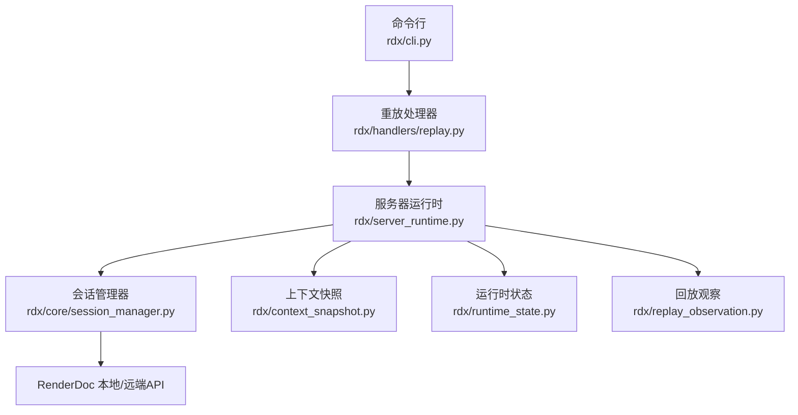
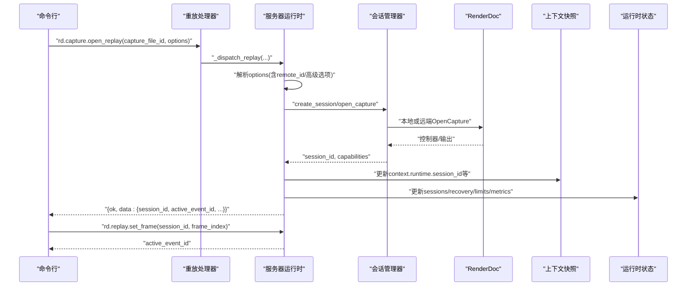
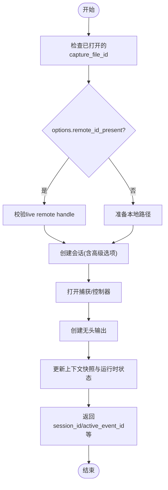
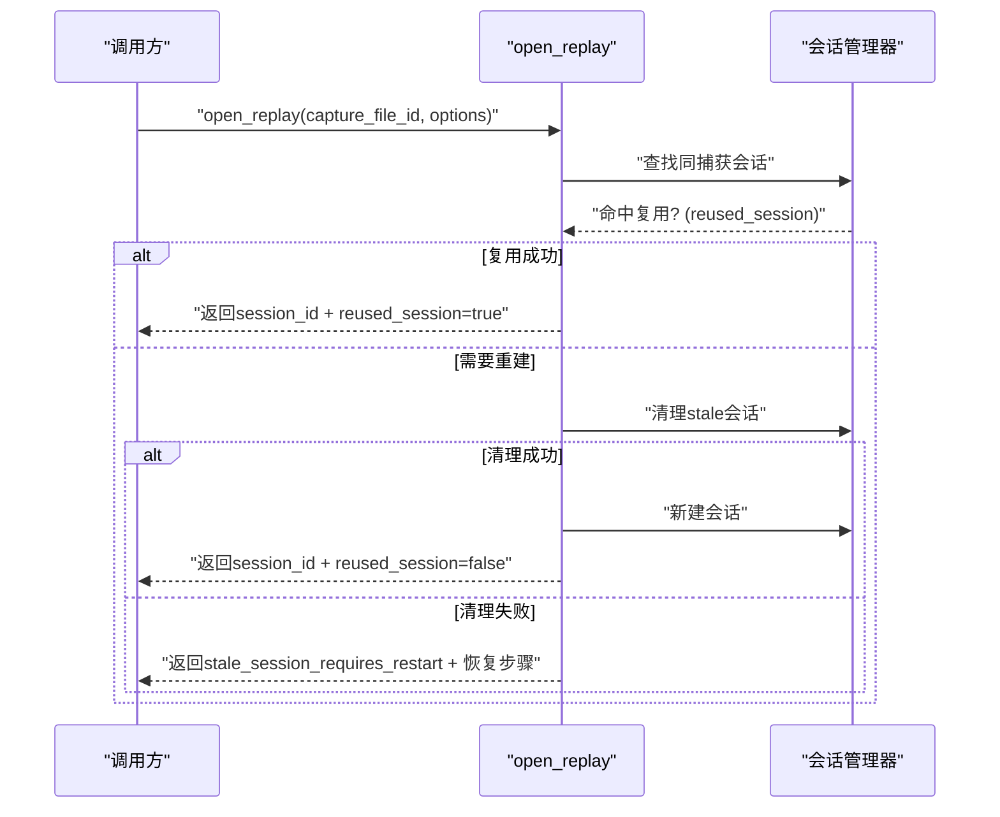
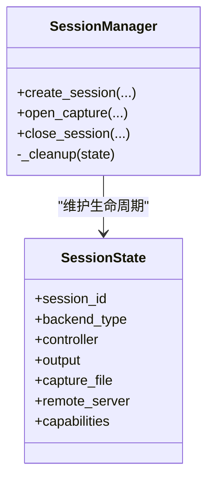
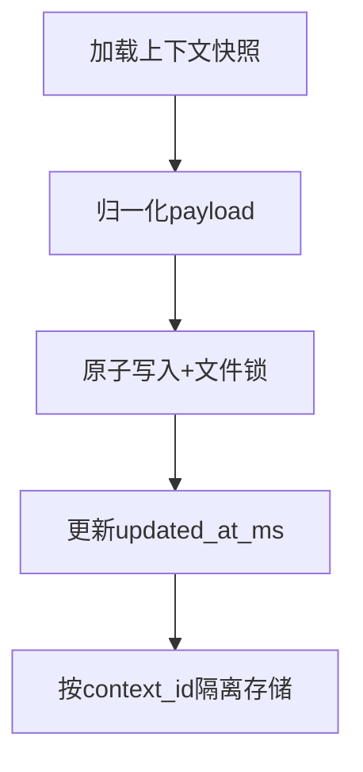
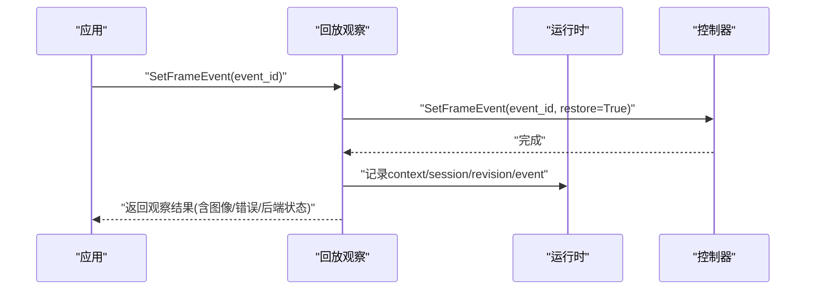
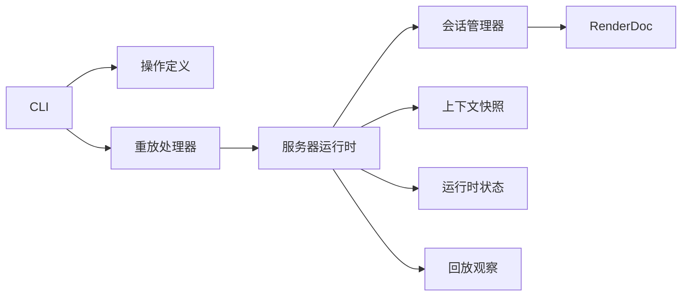

# Replay会话管理

<cite>
**本文引用的文件**   
- [rdx/operation_definitions.py](file://rdx/operation_definitions.py)
- [rdx/cli.py](file://rdx/cli.py)
- [rdx/handlers/replay.py](file://rdx/handlers/replay.py)
- [rdx/server_runtime.py](file://rdx/server_runtime.py)
- [rdx/core/session_manager.py](file://rdx/core/session_manager.py)
- [rdx/context_snapshot.py](file://rdx/context_snapshot.py)
- [rdx/runtime_state.py](file://rdx/runtime_state.py)
- [rdx/replay_observation.py](file://rdx/replay_observation.py)
- [tests/test_cli_capture_open.py](file://tests/test_cli_capture_open.py)
</cite>

## 目录
1. [简介](#简介)
2. [项目结构](#项目结构)
3. [核心组件](#核心组件)
4. [架构总览](#架构总览)
5. [详细组件分析](#详细组件分析)
6. [依赖关系分析](#依赖关系分析)
7. [性能考虑](#性能考虑)
8. [故障排查指南](#故障排查指南)
9. [结论](#结论)
10. [附录](#附录)

## 简介
本文面向RDX工具链中的Replay会话生命周期管理，覆盖从捕获文件打开、回放会话创建与配置、会话切换与销毁，到上下文快照与复用机制的完整流程。重点说明 rd.capture.open_replay 的高级选项（force_api、gpu_id、software_replay、enable_debug、replay_cache_mb）在接口契约中的位置与作用；解释相同捕获文件的会话复用条件、stale session检测与自动清理策略；并系统阐述上下文快照系统的创建、保存、恢复以及多上下文隔离的实现原理。最后给出资源监控、内存优化与错误恢复的最佳实践建议。

## 项目结构
围绕Replay会话的关键代码分布在以下模块：
- 操作定义与契约：rdx/operation_definitions.py 定义了 rd.capture.open_replay 的参数、前置条件、返回值与语义约束。
- CLI入口：rdx/cli.py 负责将命令行参数转换为 open_replay 调用，并在成功后设置帧位置。
- 分发层：rdx/handlers/replay.py 将 replay 命名空间请求转发至 server_runtime。
- 运行时调度：rdx/server_runtime.py 集中实现会话、捕获、远程连接、预览、上下文状态等能力。
- 会话管理：rdx/core/session_manager.py 封装 RenderDoc 本地/远端会话的创建、打开、关闭与清理。
- 上下文快照：rdx/context_snapshot.py 提供持久化上下文快照的读写、归一化与保留策略。
- 运行时状态：rdx/runtime_state.py 提供上下文级持久化状态、限制与指标。
- 观察与事件推进：rdx/replay_observation.py 记录事件推进、后端类型与图像输出信息。
- 测试用例：tests/test_cli_capture_open.py 验证CLI端到端调用序列与返回字段。

**图示来源**
- [rdx/cli.py:1090-1120](file://rdx/cli.py#L1090-L1120)
- [rdx/handlers/replay.py:8-10](file://rdx/handlers/replay.py#L8-L10)
- [rdx/server_runtime.py:120-163](file://rdx/server_runtime.py#L120-L163)
- [rdx/core/session_manager.py:175-251](file://rdx/core/session_manager.py#L175-L251)
- [rdx/context_snapshot.py:242-279](file://rdx/context_snapshot.py#L242-L279)
- [rdx/runtime_state.py:104-149](file://rdx/runtime_state.py#L104-L149)
- [rdx/replay_observation.py:91-109](file://rdx/replay_observation.py#L91-L109)

**章节来源**
- [rdx/operation_definitions.py:245-277](file://rdx/operation_definitions.py#L245-L277)
- [rdx/cli.py:1090-1120](file://rdx/cli.py#L1090-L1120)
- [rdx/handlers/replay.py:8-10](file://rdx/handlers/replay.py#L8-L10)
- [rdx/server_runtime.py:120-163](file://rdx/server_runtime.py#L120-L163)
- [rdx/core/session_manager.py:175-251](file://rdx/core/session_manager.py#L175-L251)
- [rdx/context_snapshot.py:242-279](file://rdx/context_snapshot.py#L242-L279)
- [rdx/runtime_state.py:104-149](file://rdx/runtime_state.py#L104-L149)
- [rdx/replay_observation.py:91-109](file://rdx/replay_observation.py#L91-L109)

## 核心组件
- 操作契约层：定义 rd.capture.open_replay 的输入 schema、前置依赖（已打开的 capture_file_id，可选 remote_id）、返回值（session_id、active_event_id、api_properties、recovery_status、reused_session 等）与错误语义（stale session 清理失败时返回 stale_session_requires_restart）。
- CLI编排层：组装 options（如 remote_id），调用 open_replay，再调用 rd.replay.set_frame 定位到指定帧，最终汇总 recovery_status、backend、remote_id 等信息返回。
- 分发与调度层：replay 处理器统一转发到 server_runtime._dispatch_replay，由运行时根据 action 路由到具体逻辑。
- 会话管理层：SessionManager 维护本地/远端会话的生命周期，包括初始化渲染子系统、打开捕获、创建无头输出、关闭释放资源。
- 上下文快照层：持久化当前上下文的状态（当前会话、捕获、预览、焦点、最近产物等），支持按上下文隔离与原子写入。
- 运行时状态层：维护每个上下文的 sessions/captures/recovery/limits/metrics 等，用于跨进程/重启后的恢复与限制控制。
- 回放观察层：记录事件推进、后端类型、图像输出目标等，辅助调试与可视化。

**章节来源**
- [rdx/operation_definitions.py:245-277](file://rdx/operation_definitions.py#L245-L277)
- [rdx/cli.py:1090-1120](file://rdx/cli.py#L1090-L1120)
- [rdx/handlers/replay.py:8-10](file://rdx/handlers/replay.py#L8-L10)
- [rdx/core/session_manager.py:175-251](file://rdx/core/session_manager.py#L175-L251)
- [rdx/context_snapshot.py:242-279](file://rdx/context_snapshot.py#L242-L279)
- [rdx/runtime_state.py:104-149](file://rdx/runtime_state.py#L104-L149)
- [rdx/replay_observation.py:91-109](file://rdx/replay_observation.py#L91-L109)

## 架构总览
下图展示了从CLI到渲染后端的完整调用链，包括会话复用、远端处理与上下文快照交互。

**图示来源**
- [rdx/cli.py:1090-1120](file://rdx/cli.py#L1090-L1120)
- [rdx/handlers/replay.py:8-10](file://rdx/handlers/replay.py#L8-L10)
- [rdx/core/session_manager.py:175-251](file://rdx/core/session_manager.py#L175-L251)
- [rdx/context_snapshot.py:242-279](file://rdx/context_snapshot.py#L242-L279)
- [rdx/runtime_state.py:104-149](file://rdx/runtime_state.py#L104-L149)

## 详细组件分析

### 会话创建与配置（rd.capture.open_replay）
- 前置条件：必须存在已打开的 capture_file_id；若 options.remote_id_present 为真，则要求通过 rd.remote.connect 建立有效的 remote handle，且不允许静默回退到本地 OpenCapture。
- 高级选项：接口契约明确支持 options 中包含 force_api、gpu_id、software_replay、enable_debug、replay_cache_mb 等键，用于强制指定API后端、选择GPU、启用软件渲染、开启调试模式、配置缓存大小等。这些选项在运行时被解析并传递给底层会话创建与渲染输出初始化流程。
- 返回值：包含 session_id、capture_file_id、frame_count、active_event_id、api_properties、recovery_status、reused_session 等，便于上层判断是否复用了已有会话及恢复状态。
- 错误语义：当同捕获的stale会话清理失败时，返回 stale_session_requires_restart 并附带恢复步骤提示。

**图示来源**
- [rdx/operation_definitions.py:245-277](file://rdx/operation_definitions.py#L245-L277)
- [rdx/core/session_manager.py:175-251](file://rdx/core/session_manager.py#L175-L251)
- [rdx/context_snapshot.py:242-279](file://rdx/context_snapshot.py#L242-L279)
- [rdx/runtime_state.py:104-149](file://rdx/runtime_state.py#L104-L149)

**章节来源**
- [rdx/operation_definitions.py:245-277](file://rdx/operation_definitions.py#L245-L277)
- [rdx/core/session_manager.py:175-251](file://rdx/core/session_manager.py#L175-L251)

### 会话复用与Stale Session清理
- 复用条件：同一捕获文件在同一上下文内可复用已有会话，open_replay 返回 reused_session=true 表示命中复用。
- Stale检测与清理：当检测到同捕获的会话处于stale状态时，系统会尝试自动清理；若清理失败，则返回 stale_session_requires_restart，并附带恢复步骤，要求用户重启或重新建立会话。
- CLI行为：CLI在成功获取 session_id 后会立即调用 rd.replay.set_frame 定位到指定帧，确保会话可用后再返回结果。

**图示来源**
- [rdx/operation_definitions.py:245-277](file://rdx/operation_definitions.py#L245-L277)
- [rdx/cli.py:1090-1120](file://rdx/cli.py#L1090-L1120)

**章节来源**
- [rdx/operation_definitions.py:245-277](file://rdx/operation_definitions.py#L245-L277)
- [rdx/cli.py:1090-1120](file://rdx/cli.py#L1090-L1120)

### 会话切换与销毁
- 切换：通过 rd.replay.set_frame 改变当前活动事件/帧，从而切换回放位置；该操作会影响 active_event_id 并可能触发观察记录。
- 销毁：通过会话管理器关闭控制器、输出、捕获文件与远端连接，释放资源；本地渲染子系统在所有本地会话结束后关闭。

**图示来源**
- [rdx/core/session_manager.py:175-251](file://rdx/core/session_manager.py#L175-L251)
- [rdx/core/session_manager.py:517-569](file://rdx/core/session_manager.py#L517-L569)

**章节来源**
- [rdx/core/session_manager.py:175-251](file://rdx/core/session_manager.py#L175-L251)
- [rdx/core/session_manager.py:517-569](file://rdx/core/session_manager.py#L517-L569)

### 上下文快照系统
- 创建与保存：默认上下文快照包含 context_id、backend、runtime（session_id、capture_file_id、frame_index、active_event_id、backend_type）、remote（state、remote_id、endpoint、reuse_policy等）、focus、notes、last_artifacts、preview、updated_at_ms。保存时使用原子写入与文件锁保证并发安全。
- 恢复机制：启动时加载上下文快照，若文件不存在或解析失败则使用默认快照；运行时更新后再次保存，保持最新状态。
- 多上下文隔离：通过 normalize_context_id 将上下文ID标准化（default或自定义），不同上下文对应不同的快照文件与状态文件，避免互相干扰。
- 保留策略：last_artifacts 支持去重与数量限制（total_limit、per_type_limit），防止快照膨胀。

**图示来源**
- [rdx/context_snapshot.py:242-279](file://rdx/context_snapshot.py#L242-L279)
- [rdx/context_snapshot.py:447-475](file://rdx/context_snapshot.py#L447-L475)
- [rdx/context_snapshot.py:335-364](file://rdx/context_snapshot.py#L335-L364)

**章节来源**
- [rdx/context_snapshot.py:242-279](file://rdx/context_snapshot.py#L242-L279)
- [rdx/context_snapshot.py:447-475](file://rdx/context_snapshot.py#L447-L475)
- [rdx/context_snapshot.py:335-364](file://rdx/context_snapshot.py#L335-L364)

### 回放观察与事件推进
- 事件推进：通过控制器 SetFrameEvent 推进到指定事件，并记录 context_id、session_id、revision、event_id、modification_state、display_parameters、is_final_output、final_output_error、image_path 等。
- 后端识别：根据 state.sessions[session_id].backend_type 或 state.backend 推断后端类型（local/remote），影响远程显示状态字段。
- 输出目标：查询输出目标资源ID，用于后续截图或像素历史分析。

**图示来源**
- [rdx/replay_observation.py:91-109](file://rdx/replay_observation.py#L91-L109)

**章节来源**
- [rdx/replay_observation.py:91-109](file://rdx/replay_observation.py#L91-L109)

## 依赖关系分析
- CLI依赖 operation_definitions 定义的 open_replay 契约，并通过 handlers/replay 转发到 server_runtime。
- server_runtime 依赖 session_manager 进行底层会话管理，依赖 context_snapshot 与 runtime_state 进行上下文与状态持久化。
- session_manager 依赖 RenderDoc API（本地/远端）进行捕获打开、控制器创建与输出初始化。
- replay_observation 依赖运行时提供的控制器与状态，记录事件推进与输出信息。

**图示来源**
- [rdx/operation_definitions.py:245-277](file://rdx/operation_definitions.py#L245-L277)
- [rdx/handlers/replay.py:8-10](file://rdx/handlers/replay.py#L8-L10)
- [rdx/server_runtime.py:120-163](file://rdx/server_runtime.py#L120-L163)
- [rdx/core/session_manager.py:175-251](file://rdx/core/session_manager.py#L175-L251)
- [rdx/context_snapshot.py:242-279](file://rdx/context_snapshot.py#L242-L279)
- [rdx/runtime_state.py:104-149](file://rdx/runtime_state.py#L104-L149)
- [rdx/replay_observation.py:91-109](file://rdx/replay_observation.py#L91-L109)

**章节来源**
- [rdx/operation_definitions.py:245-277](file://rdx/operation_definitions.py#L245-L277)
- [rdx/handlers/replay.py:8-10](file://rdx/handlers/replay.py#L8-L10)
- [rdx/server_runtime.py:120-163](file://rdx/server_runtime.py#L120-L163)
- [rdx/core/session_manager.py:175-251](file://rdx/core/session_manager.py#L175-L251)
- [rdx/context_snapshot.py:242-279](file://rdx/context_snapshot.py#L242-L279)
- [rdx/runtime_state.py:104-149](file://rdx/runtime_state.py#L104-L149)
- [rdx/replay_observation.py:91-109](file://rdx/replay_observation.py#L91-L109)

## 性能考虑
- 会话复用：优先复用同捕获的活跃会话以减少重复初始化开销；当 reused_session=true 时可跳过部分重建步骤。
- 缓存配置：通过 replay_cache_mb 合理设置回放缓存大小，平衡内存占用与回放流畅度。
- 软件渲染：software_replay 适用于无GPU或驱动异常场景，但性能较低，仅作为降级方案。
- 调试模式：enable_debug 会增加日志与诊断开销，建议在问题定位阶段启用。
- 远端传输：远端复制捕获文件时注意带宽与延迟，必要时使用ADB Android专用路径与校验。
- 资源清理：确保 close_session 正确释放控制器、输出、捕获文件与远端连接，避免资源泄漏。

## 故障排查指南
- 打开回放失败：检查 capture_file_id 是否有效、options.remote_id 是否存在且连通；查看返回的错误详情与修复提示。
- Stale会话清理失败：根据 stale_session_requires_restart 的恢复步骤重启会话或清理残留句柄。
- 远端复制失败：确认远端可达、路径权限与设备序列号；检查 adb_android 路径与包名配置。
- 无头输出创建失败：检查分辨率配置与渲染后端可用性；必要时切换到 software_replay。
- 上下文快照损坏：若快照文件解析失败，系统将回退到默认快照；建议定期备份与校验。
- 事件推进异常：核对 event_id 是否在范围内；检查后端类型与输出目标资源ID是否正确。

**章节来源**
- [rdx/operation_definitions.py:245-277](file://rdx/operation_definitions.py#L245-L277)
- [rdx/core/session_manager.py:347-440](file://rdx/core/session_manager.py#L347-L440)
- [rdx/context_snapshot.py:447-475](file://rdx/context_snapshot.py#L447-L475)
- [rdx/replay_observation.py:91-109](file://rdx/replay_observation.py#L91-L109)

## 结论
RDX的Replay会话管理以操作契约为核心，结合CLI编排、运行时调度、会话管理与上下文快照，形成了完整的生命周期闭环。通过高级选项灵活控制API后端、GPU、渲染模式与调试级别；通过会话复用与stale清理提升效率与稳定性；通过上下文快照与运行时状态保障多上下文隔离与恢复能力。遵循最佳实践可有效监控资源、优化内存并快速恢复错误。

## 附录
- CLI端到端验证：测试用例覆盖了 open_file → open_replay → set_frame → get_context 的调用序列与返回字段，可用于回归验证。
- 远程能力矩阵：运行时可根据当前会话与远端连接情况生成 capability matrix，辅助判断功能可用性。

**章节来源**
- [tests/test_cli_capture_open.py:67-100](file://tests/test_cli_capture_open.py#L67-L100)
- [rdx/server_runtime.py:6052-6165](file://rdx/server_runtime.py#L6052-L6165)