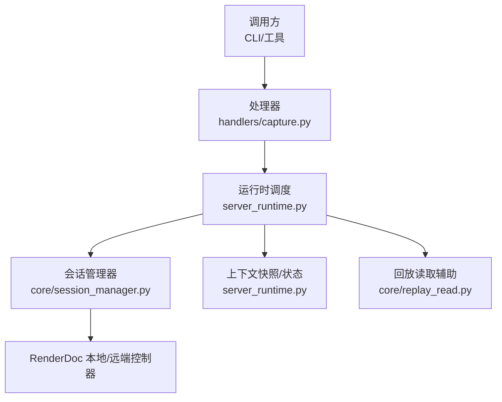
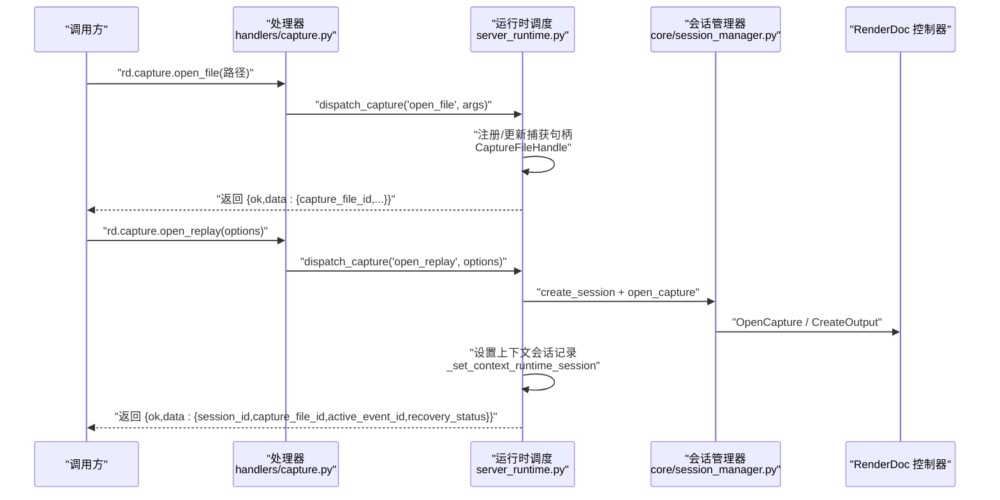
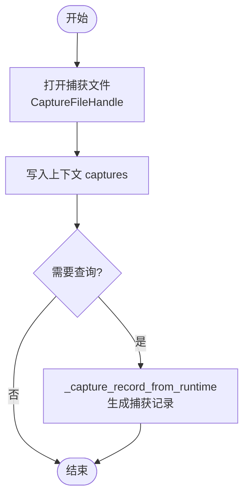
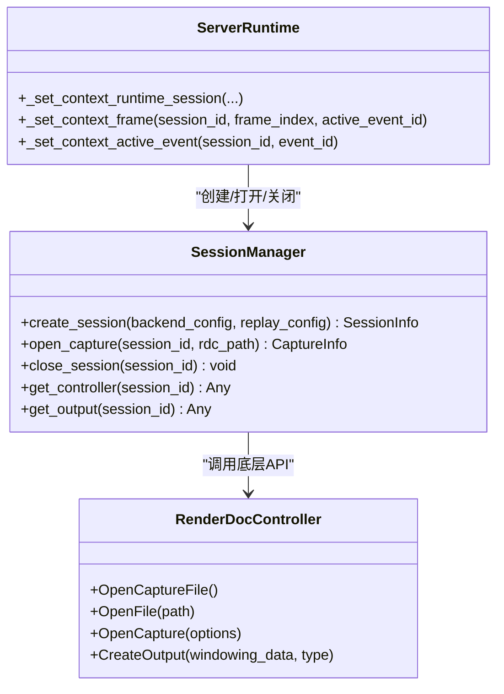
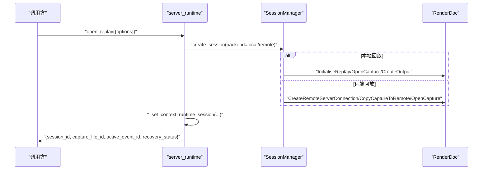
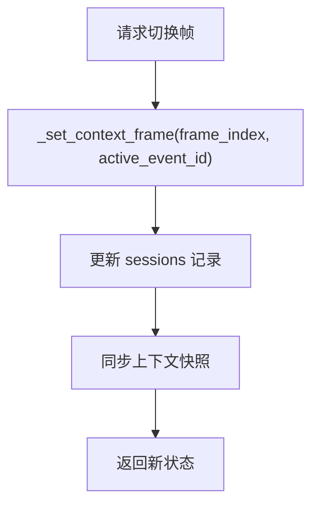
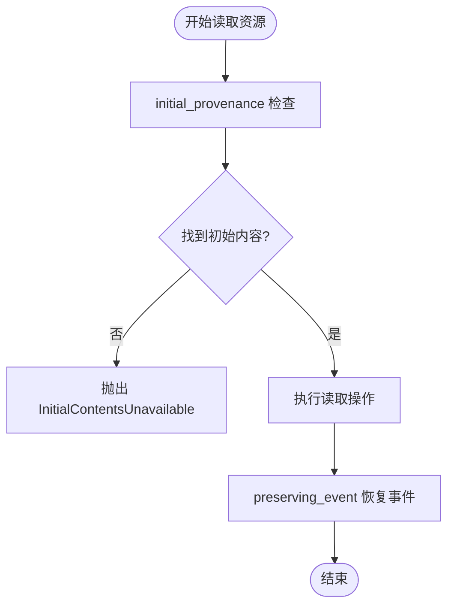
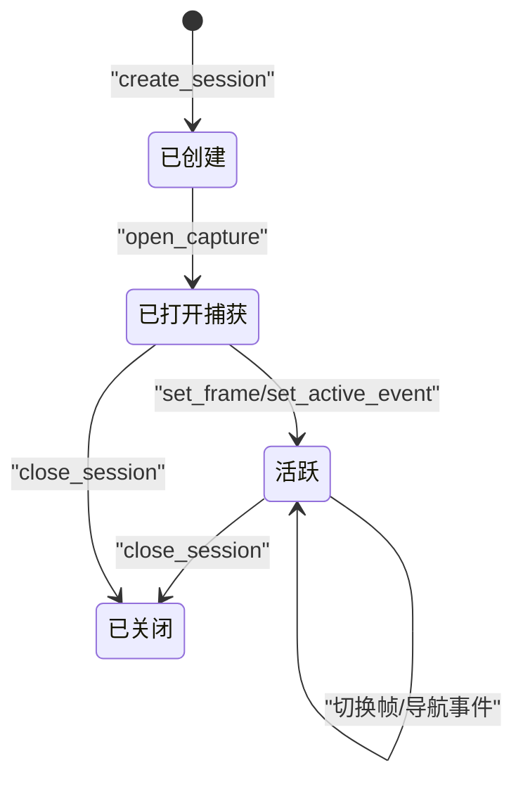
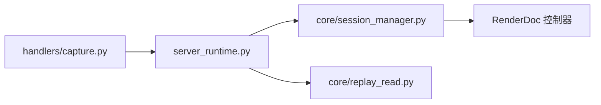

# 捕获文件与Replay会话API

<cite>
**本文引用的文件**
- [capture.py](file://rdx/handlers/capture.py)
- [replay.py](file://rdx/handlers/replay.py)
- [server_runtime.py](file://rdx/server_runtime.py)
- [session_manager.py](file://rdx/core/session_manager.py)
- [replay_read.py](file://rdx/core/replay_read.py)
- [test_cli_capture_open.py](file://tests/test_cli_capture_open.py)
</cite>

## 目录
1. [简介](#简介)
2. [项目结构](#项目结构)
3. [核心组件](#核心组件)
4. [架构总览](#架构总览)
5. [详细组件分析](#详细组件分析)
6. [依赖关系分析](#依赖关系分析)
7. [性能考量](#性能考量)
8. [故障排查指南](#故障排查指南)
9. [结论](#结论)
10. [附录](#附录)

## 简介
本文件面向 rd.capture.* 操作组，系统性说明捕获文件的打开、关闭与信息查询流程，以及 Replay 会话的生命周期管理。重点覆盖：
- 捕获文件打开：路径要求、只读模式、返回的 capture_file_id 结构。
- Replay 会话生命周期：创建、帧切换、事件导航、资源访问、远程回放支持。
- 会话复用机制：通过上下文状态与运行时句柄实现会话/捕获句柄的复用与选择。
- 错误处理策略：会话失效、资源不足、远程连接失败等场景的处理方式。
- 完整会话状态转换图：从创建到活跃、帧切换、事件导航、资源访问的状态流转。

## 项目结构
围绕 rd.capture.* 的关键代码分布在以下模块：
- 处理器入口：将动作分发到 server_runtime 的统一调度器。
- 运行时状态：维护捕获文件句柄、Replay 会话句柄、上下文快照与指标。
- 会话管理：封装本地/远端 RenderDoc 回放控制器的创建、打开捕获、输出创建与清理。
- 回放读取辅助：在回放中恢复初始数据并保证事件一致性。
- CLI 测试用例：验证 open_file/open_replay/set_frame/get_context 的端到端调用顺序与错误包装。

**图示来源**
- [capture.py:8-9](file://rdx/handlers/capture.py#L8-L9)
- [replay.py:8-9](file://rdx/handlers/replay.py#L8-L9)
- [server_runtime.py:120-238](file://rdx/server_runtime.py#L120-L238)
- [session_manager.py:148-259](file://rdx/core/session_manager.py#L148-L259)

**章节来源**
- [capture.py:8-9](file://rdx/handlers/capture.py#L8-L9)
- [replay.py:8-9](file://rdx/handlers/replay.py#L8-L9)
- [server_runtime.py:120-238](file://rdx/server_runtime.py#L120-L238)
- [session_manager.py:148-259](file://rdx/core/session_manager.py#L148-L259)

## 核心组件
- 捕获文件句柄 CaptureFileHandle：记录 capture_file_id、文件路径、是否只读、驱动信息、打开时间戳。用于上下文状态中的 captures 映射。
- 回放句柄 ReplayHandle：记录 session_id、capture_file_id、当前帧索引、活动事件ID。用于上下文状态中的 sessions 映射。
- 会话管理器 SessionManager：负责创建会话、打开捕获（本地/远端）、创建无头输出、清理资源；提供控制器与输出访问。
- 运行时状态 RuntimeState：集中持有 captures、replays、remotes、context_snapshots、previews 等全局句柄与快照。
- 回放读取辅助 replay_read：在回放过程中确保初始内容可用，并在读取后恢复事件位置。

**章节来源**
- [server_runtime.py:120-162](file://rdx/server_runtime.py#L120-L162)
- [server_runtime.py:196-238](file://rdx/server_runtime.py#L196-L238)
- [session_manager.py:118-259](file://rdx/core/session_manager.py#L118-L259)
- [replay_read.py:9-132](file://rdx/core/replay_read.py#L9-L132)

## 架构总览
rd.capture.* 操作通过 handlers 统一转发至 server_runtime，再由 server_runtime 协调 SessionManager 完成底层回放控制。上下文状态与快照贯穿整个流程，用于会话/捕获句柄的选择、复用与展示。

**图示来源**
- [capture.py:8-9](file://rdx/handlers/capture.py#L8-L9)
- [server_runtime.py:1214-1267](file://rdx/server_runtime.py#L1214-L1267)
- [session_manager.py:175-251](file://rdx/core/session_manager.py#L175-L251)

## 详细组件分析

### 捕获文件打开与查询
- 打开流程
  - 处理器接收 action="open_file"，转交 server_runtime._dispatch_capture。
  - server_runtime 构建 CaptureFileHandle，记录 capture_file_id、file_path、read_only、driver、opened_at_ms。
  - 将捕获句柄写入上下文状态 captures，并同步上下文快照 metrics。
- 查询流程
  - 通过上下文快照或 _capture_record_from_runtime 获取捕获元数据：文件路径、大小、修改时间、指纹、只读标志、驱动、恢复状态等。
- 路径与只读
  - file_path 使用 Path.resolve() 规范化；read_only 由 CaptureFileHandle.read_only 字段表达。
  - 测试用例表明 open_file 成功后会返回 capture_file_id，后续 open_replay 可复用该捕获。

**图示来源**
- [server_runtime.py:120-127](file://rdx/server_runtime.py#L120-L127)
- [server_runtime.py:694-710](file://rdx/server_runtime.py#L694-L710)
- [server_runtime.py:807-829](file://rdx/server_runtime.py#L807-L829)

**章节来源**
- [server_runtime.py:120-127](file://rdx/server_runtime.py#L120-L127)
- [server_runtime.py:694-710](file://rdx/server_runtime.py#L694-L710)
- [server_runtime.py:807-829](file://rdx/server_runtime.py#L807-L829)
- [test_cli_capture_open.py:9-93](file://tests/test_cli_capture_open.py#L9-L93)

### Replay 会话生命周期
- 创建会话
  - create_session 根据 backend_config.type 决定 local/remote；local 时初始化回放子系统，remote 时建立远端连接。
  - 返回 SessionInfo，包含 session_id、backend_type、capabilities、created_at。
- 打开捕获
  - open_capture 校验未重复打开；本地走 _open_local_capture，远端走 _open_remote_capture。
  - 本地：OpenCaptureFile -> OpenFile -> OpenCapture -> CreateHeadlessWindowingData/CreateOutput。
  - 远端：CopyCaptureToRemote（或 adb_android）-> remote.OpenCapture -> CreateOutput。
- 设置帧与事件
  - server_runtime 提供 _set_context_frame/_set_context_active_event，更新 session 记录的 frame_index 与 active_event_id。
  - 测试用例显示 set_frame 后 active_event_id 会更新。
- 查询上下文
  - get_context 返回 context_id、current_session_id、runtime（含 session_id、capture_file_id、frame_index、active_event_id、backend_type）、sessions、preview 等。

**图示来源**
- [session_manager.py:175-251](file://rdx/core/session_manager.py#L175-L251)
- [session_manager.py:347-383](file://rdx/core/session_manager.py#L347-L383)
- [session_manager.py:509-515](file://rdx/core/session_manager.py#L509-L515)
- [server_runtime.py:1224-1286](file://rdx/server_runtime.py#L1224-L1286)

**章节来源**
- [session_manager.py:175-251](file://rdx/core/session_manager.py#L175-L251)
- [session_manager.py:347-383](file://rdx/core/session_manager.py#L347-L383)
- [session_manager.py:509-515](file://rdx/core/session_manager.py#L509-L515)
- [server_runtime.py:1224-1286](file://rdx/server_runtime.py#L1224-L1286)
- [test_cli_capture_open.py:9-93](file://tests/test_cli_capture_open.py#L9-L93)

### 回放选项与会话复用
- 回放选项
  - open_replay 的 options 可包含 remote_id，用于选择远端回放后端；server_runtime 在记录操作时根据 options.remote_id 推断 backend。
  - 远端回放通过 SessionManager._init_remote 建立连接，必要时复制捕获文件到远端。
- 会话复用
  - 上下文状态维护 current_session_id 与 sessions 映射；_select_session_from_state 自动选择当前会话或捕获。
  - 测试用例验证 open_replay 成功后可通过 set_frame 与 get_context 复用同一会话。

**图示来源**
- [server_runtime.py:987-992](file://rdx/server_runtime.py#L987-L992)
- [session_manager.py:309-345](file://rdx/core/session_manager.py#L309-L345)
- [session_manager.py:373-440](file://rdx/core/session_manager.py#L373-L440)
- [server_runtime.py:1224-1267](file://rdx/server_runtime.py#L1224-L1267)

**章节来源**
- [server_runtime.py:987-992](file://rdx/server_runtime.py#L987-L992)
- [session_manager.py:309-345](file://rdx/core/session_manager.py#L309-L345)
- [session_manager.py:373-440](file://rdx/core/session_manager.py#L373-L440)
- [server_runtime.py:1224-1267](file://rdx/server_runtime.py#L1224-L1267)
- [test_cli_capture_open.py:95-157](file://tests/test_cli_capture_open.py#L95-L157)

### 帧切换与事件导航
- 帧切换
  - _set_context_frame 更新 session 的 frame_index 与 active_event_id，并持久化到上下文状态。
- 事件导航
  - _set_context_active_event 直接设置 active_event_id。
  - 测试用例验证 set_frame 后 active_event_id 变化，get_context 可读取最新状态。

**图示来源**
- [server_runtime.py:1280-1286](file://rdx/server_runtime.py#L1280-L1286)
- [server_runtime.py:1271-1276](file://rdx/server_runtime.py#L1271-L1276)
- [test_cli_capture_open.py:9-93](file://tests/test_cli_capture_open.py#L9-L93)

**章节来源**
- [server_runtime.py:1271-1286](file://rdx/server_runtime.py#L1271-L1286)
- [test_cli_capture_open.py:9-93](file://tests/test_cli_capture_open.py#L9-L93)

### 资源访问与初始内容恢复
- 回放读取保护
  - preserving_event 在执行读取操作前后确保 SetFrameEvent 被调用以恢复事件位置，避免并发或取消导致的事件错位。
- 初始内容可用性
  - initial_provenance 检查资源是否存在于捕获帧命令之前，并定位 Internal::Initial Contents chunk，支持 Buffer/Texture 的 subresource 覆盖判断。
- 适用场景
  - 当需要读取资源的初始字节或纹理内容时，需确保捕获包含完整的初始数据，否则抛出 InitialContentsUnavailable。

**图示来源**
- [replay_read.py:17-100](file://rdx/core/replay_read.py#L17-L100)
- [replay_read.py:103-132](file://rdx/core/replay_read.py#L103-L132)

**章节来源**
- [replay_read.py:17-100](file://rdx/core/replay_read.py#L17-L100)
- [replay_read.py:103-132](file://rdx/core/replay_read.py#L103-L132)

### 会话状态转换图

**图示来源**
- [session_manager.py:175-259](file://rdx/core/session_manager.py#L175-L259)
- [server_runtime.py:1224-1286](file://rdx/server_runtime.py#L1224-L1286)

## 依赖关系分析
- 处理器依赖 server_runtime 的分发函数。
- server_runtime 依赖 SessionManager 进行回放控制，同时维护上下文快照与指标。
- SessionManager 依赖 RenderDoc 本地/远端 API，负责资源生命周期管理。
- replay_read 依赖控制器方法以保障事件一致性与初始内容可用性。

**图示来源**
- [capture.py:8-9](file://rdx/handlers/capture.py#L8-L9)
- [server_runtime.py:120-238](file://rdx/server_runtime.py#L120-L238)
- [session_manager.py:148-259](file://rdx/core/session_manager.py#L148-L259)
- [replay_read.py:9-132](file://rdx/core/replay_read.py#L9-L132)

**章节来源**
- [capture.py:8-9](file://rdx/handlers/capture.py#L8-L9)
- [server_runtime.py:120-238](file://rdx/server_runtime.py#L120-L238)
- [session_manager.py:148-259](file://rdx/core/session_manager.py#L148-L259)
- [replay_read.py:9-132](file://rdx/core/replay_read.py#L9-L132)

## 性能考量
- 回放内存估计：基于文件大小与 multiplier 估算回放所需内存，避免资源不足。
- 计数器采样：全回放 GPU 时间戳采样需确认计数器可用且格式正确，否则抛出异常。
- 上下文容量限制：max_contexts、max_sessions_per_context、max_capture_files 等限制防止过度占用。
- 异步卸载：大量 RenderDoc 调用通过 offload 到线程池执行，避免阻塞主循环。

[本节为通用性能指导，不直接分析具体文件]

## 故障排查指南
- 会话失效
  - 若 session_id 不存在，_update_context_session_record 会抛出 session_not_found。
  - close_session 时若找不到状态，抛出 session_not_found。
- 资源不足
  - 上下文容量超限会抛出 context_limit_exceeded，包含占用上下文列表与已知上下文。
  - 回放内存估计过大可能导致启动失败，需调整配置或减少捕获规模。
- 远程连接失败
  - 远端复制捕获失败会抛出 remote_capture_copy_failed，附带 copy_error 与分类信息。
  - 远端 OpenCapture 失败会包装为 renderdoc_error，包含 stage 与修复提示。
- 超时与异常包装
  - CLI 测试用例展示了 open_replay 超时或异常时，错误会被包装并附加 failed_step、daemon_state、context_snapshot 等信息，便于定位问题。

**章节来源**
- [server_runtime.py:846-897](file://rdx/server_runtime.py#L846-L897)
- [server_runtime.py:427-447](file://rdx/server_runtime.py#L427-L447)
- [session_manager.py:384-440](file://rdx/core/session_manager.py#L384-L440)
- [test_cli_capture_open.py:160-367](file://tests/test_cli_capture_open.py#L160-L367)

## 结论
rd.capture.* 操作组通过统一的处理器与运行时调度，结合 SessionManager 对本地/远端回放的控制，实现了捕获文件与 Replay 会话的完整生命周期管理。上下文状态与快照确保了会话/捕获句柄的复用与可视化。错误处理策略覆盖了会话失效、资源不足、远程连接失败等常见场景，并提供详细的诊断信息。建议在实际使用中关注上下文容量限制、回放内存估计与远端连接稳定性，以获得更可靠的回放体验。

[本节为总结性内容，不直接分析具体文件]

## 附录
- 关键数据结构
  - CaptureFileHandle：capture_file_id、file_path、read_only、driver、opened_at_ms。
  - ReplayHandle：session_id、capture_file_id、frame_index、active_event_id。
  - RemoteHandle：remote_id、host、port、connected、reuse_policy、transport、leased_session_ids 等。
- 关键函数
  - _set_context_runtime_session：设置会话记录并同步快照。
  - _set_context_frame/_set_context_active_event：更新帧与事件。
  - SessionManager.create_session/open_capture/close_session：会话生命周期管理。
  - initial_provenance/preserving_event：回放读取保护与初始内容定位。

**章节来源**
- [server_runtime.py:120-162](file://rdx/server_runtime.py#L120-L162)
- [server_runtime.py:1224-1286](file://rdx/server_runtime.py#L1224-L1286)
- [session_manager.py:175-259](file://rdx/core/session_manager.py#L175-L259)
- [replay_read.py:17-132](file://rdx/core/replay_read.py#L17-L132)