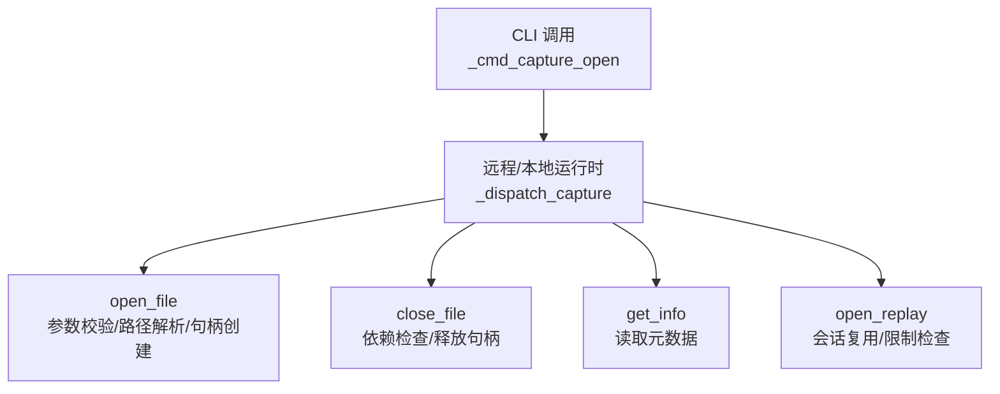
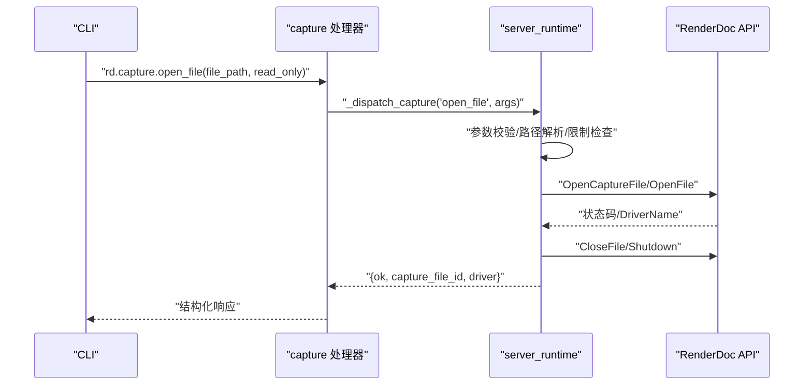
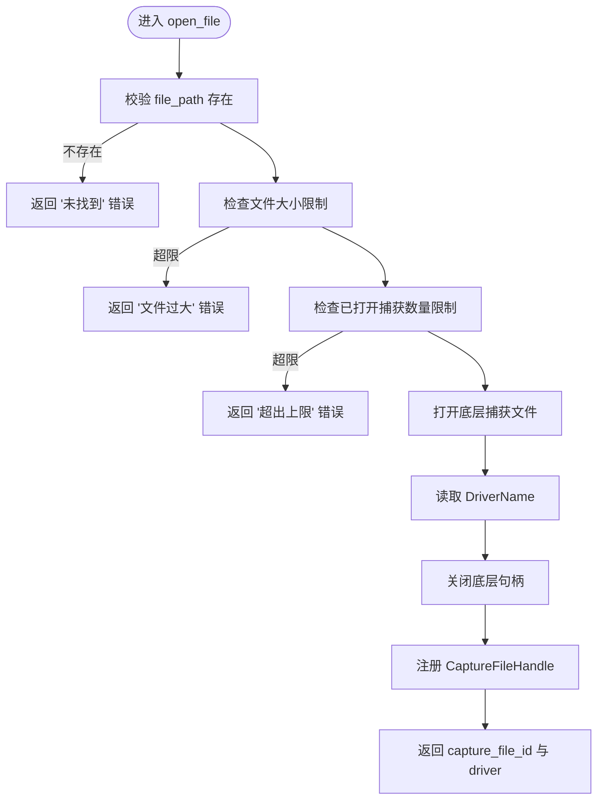
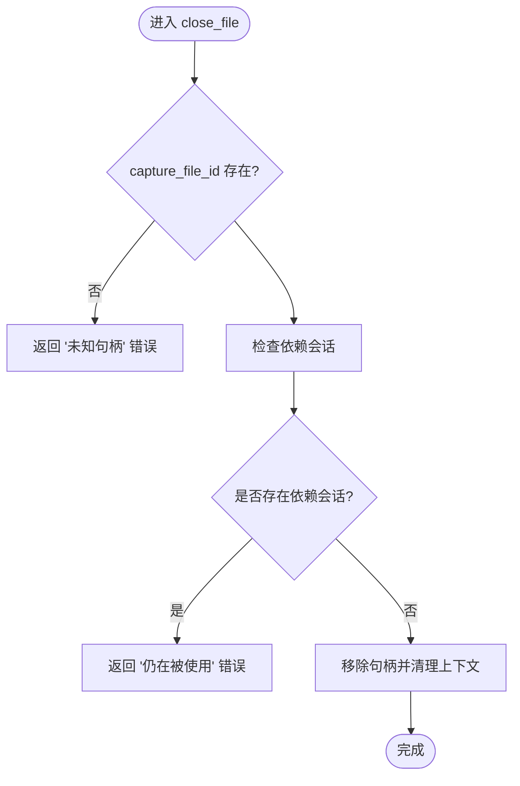
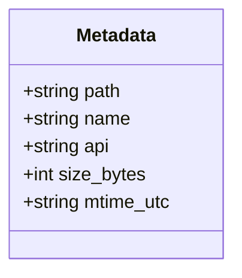
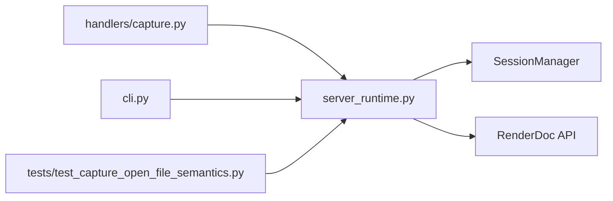

# 捕获文件操作

<cite>
**本文引用的文件**
- [rdc_tool/handlers/capture.py](file://rdc_tool/handlers/capture.py)
- [rdc_tool/server_runtime.py](file://rdc_tool/server_runtime.py)
- [rdc_tool/operation_definitions.py](file://rdc_tool/operation_definitions.py)
- [rdc_tool/cli.py](file://rdc_tool/cli.py)
- [tests/test_capture_open_file_semantics.py](file://tests/test_capture_open_file_semantics.py)
</cite>

## 目录
1. [简介](#简介)
2. [项目结构](#项目结构)
3. [核心组件](#核心组件)
4. [架构总览](#架构总览)
5. [详细组件分析](#详细组件分析)
6. [依赖关系分析](#依赖关系分析)
7. [性能与资源管理](#性能与资源管理)
8. [故障排查指南](#故障排查指南)
9. [结论](#结论)
10. [附录：最佳实践](#附录：最佳实践)

## 简介
本文聚焦于捕获文件的基本操作，包括打开、关闭与元数据查询。重点说明：
- rd.capture.open_file 的参数验证规则、路径解析与只读模式行为差异
- rd.capture.close_file 的资源清理机制与错误处理
- rd.capture.get_info 返回的元数据结构及其字段含义
- 文件操作的最佳实践（错误重试、资源泄漏防护、并发访问控制）

## 项目结构
捕获文件操作由“处理器 -> 运行时调度 -> 具体实现”的分层组成：
- 处理器层：统一入口，将 action 转发到运行时调度器
- 运行时层：参数校验、上下文状态管理、资源句柄生命周期、与底层渲染捕获库交互
- CLI 层：调用远端/本地运行时执行工具，封装错误并输出结构化结果

图表来源
- [rdc_tool/handlers/capture.py:8-9](file://rdc_tool/handlers/capture.py#L8-L9)
- [rdc_tool/server_runtime.py:6782-7147](file://rdc_tool/server_runtime.py#L6782-L7147)

章节来源
- [rdc_tool/handlers/capture.py:1-11](file://rdc_tool/handlers/capture.py#L1-L11)
- [rdc_tool/server_runtime.py:6782-7147](file://rdc_tool/server_runtime.py#L6782-L7147)

## 核心组件
- CaptureFileHandle：记录已打开的捕获文件句柄信息（路径、是否只读、驱动、打开时间等）
- ReplayHandle：记录回放会话信息（会话ID、关联的捕获文件ID、帧索引、活动事件ID）
- RuntimeState：进程级运行时状态容器，维护 captures/replays/remotes 等句柄集合
- _dispatch_capture：捕获相关操作的统一分发器，包含 open_file/close_file/get_info/open_replay/close_replay

章节来源
- [rdc_tool/server_runtime.py:120-215](file://rdc_tool/server_runtime.py#L120-L215)
- [rdc_tool/server_runtime.py:6782-7147](file://rdc_tool/server_runtime.py#L6782-L7147)

## 架构总览
捕获文件操作的关键流程如下：
- open_file：校验参数与限制 -> 打开底层捕获文件 -> 获取驱动名 -> 关闭底层句柄 -> 注册 CaptureFileHandle
- close_file：校验存在性 -> 检查是否有活跃会话依赖 -> 删除句柄并清理上下文
- get_info：基于已打开句柄读取文件路径、大小、修改时间、API/驱动等信息
- open_replay：复用或创建回放会话，进行内存与数量限制检查，设置默认活动事件

图表来源
- [rdc_tool/handlers/capture.py:8-9](file://rdc_tool/handlers/capture.py#L8-L9)
- [rdc_tool/server_runtime.py:6782-6856](file://rdc_tool/server_runtime.py#L6782-L6856)

章节来源
- [rdc_tool/server_runtime.py:6782-6856](file://rdc_tool/server_runtime.py#L6782-L6856)

## 详细组件分析

### open_file：参数验证、路径解析与只读模式
- 参数验证
  - 必须提供 file_path；read_only 为可选布尔，默认 true
  - 路径必须是存在的文件；否则返回“未找到”错误
  - 文件大小受限于配置项 max_capture_size_bytes；超限则拒绝并记录指标
  - 当前上下文内打开的捕获文件数量受限于 max_capture_files；超限则拒绝并记录指标
- 路径解析
  - 使用 Path.resolve() 规范化路径，确保绝对路径与可访问性
- 只读模式行为差异
  - read_only=True：仅用于读取元数据与回放，不写入捕获文件
  - read_only=False：允许后续可能的写操作（如扩展捕获），但当前 open_file 本身仍为只读打开
  - CLI 在打开捕获时强制以只读方式调用，避免意外写入
- 底层交互
  - 通过 RenderDoc API 打开捕获文件，读取 DriverName，随后立即关闭底层句柄，避免长期占用
  - 成功后在运行时注册 CaptureFileHandle，并设置当前上下文的当前捕获文件

图表来源
- [rdc_tool/server_runtime.py:6782-6856](file://rdc_tool/server_runtime.py#L6782-L6856)

章节来源
- [rdc_tool/server_runtime.py:6782-6856](file://rdc_tool/server_runtime.py#L6782-L6856)
- [rdc_tool/cli.py:1084-1090](file://rdc_tool/cli.py#L1084-L1090)
- [tests/test_capture_open_file_semantics.py:31-63](file://tests/test_capture_open_file_semantics.py#L31-L63)

### close_file：资源清理与错误处理
- 参数验证
  - 必须提供 capture_file_id；不存在则返回“未知句柄”错误
- 依赖检查
  - 若该捕获文件仍有活跃的 replay 会话依赖，则拒绝关闭并返回“仍在被使用”错误，附带依赖会话列表
- 资源清理
  - 从运行时 captures 字典中移除句柄
  - 清除当前上下文中对该捕获文件的引用
- 错误处理
  - 对依赖检查失败的情况给出明确错误码与详情，便于上层重试或提示用户先关闭相关会话

图表来源
- [rdc_tool/server_runtime.py:6858-6877](file://rdc_tool/server_runtime.py#L6858-L6877)

章节来源
- [rdc_tool/server_runtime.py:6858-6877](file://rdc_tool/server_runtime.py#L6858-L6877)

### get_info：元数据结构与字段含义
- 输入
  - 必须提供 capture_file_id；不存在则返回“未知句柄”错误
- 输出元数据
  - path：捕获文件的绝对路径
  - name：文件名
  - api：驱动名称（来自 open_file 阶段读取的 DriverName）
  - size_bytes：文件大小（字节）
  - mtime_utc：文件最后修改时间的 UTC ISO 字符串
- 用途
  - 用于展示捕获基本信息、辅助诊断与日志记录
  - 结合其他工具（如 get_thumbnail）进行预览与分析

图表来源
- [rdc_tool/server_runtime.py:6903-6916](file://rdc_tool/server_runtime.py#L6903-L6916)

章节来源
- [rdc_tool/server_runtime.py:6903-6916](file://rdc_tool/server_runtime.py#L6903-L6916)

### open_replay：会话复用与限制检查（补充）
- 会话复用
  - 若同一捕获已有活跃回放会话，直接复用并返回 reused_session=true
- 限制检查
  - 检查每上下文最大会话数
  - 估算回放内存占用，超过限制则拒绝
- 默认活动事件
  - 选择可预览的默认事件 ID，便于快速预览
- 错误恢复
  - 清理陈旧会话失败时返回明确的恢复步骤，指导用户重启或手动清理

章节来源
- [rdc_tool/server_runtime.py:6920-7147](file://rdc_tool/server_runtime.py#L6920-L7147)

## 依赖关系分析
- 处理器层
  - rdc_tool/handlers/capture.py：将 action 转发至 server_runtime._dispatch_capture
- 运行时层
  - rdc_tool/server_runtime.py：实现 open_file/close_file/get_info/open_replay/close_replay
  - 依赖 RenderDoc API（OpenCaptureFile/OpenFile/DriverName/CloseFile）
  - 依赖 SessionManager 进行回放会话生命周期管理
- CLI 层
  - rdc_tool/cli.py：调用远端/本地运行时执行工具，封装错误并输出结构化结果
- 测试
  - tests/test_capture_open_file_semantics.py：验证 open_file 不会自动打开回放、会正确关闭底层句柄

图表来源
- [rdc_tool/handlers/capture.py:8-9](file://rdc_tool/handlers/capture.py#L8-L9)
- [rdc_tool/server_runtime.py:6782-7147](file://rdc_tool/server_runtime.py#L6782-L7147)
- [rdc_tool/cli.py:1084-1120](file://rdc_tool/cli.py#L1084-L1120)
- [tests/test_capture_open_file_semantics.py:31-63](file://tests/test_capture_open_file_semantics.py#L31-L63)

章节来源
- [rdc_tool/handlers/capture.py:1-11](file://rdc_tool/handlers/capture.py#L1-L11)
- [rdc_tool/server_runtime.py:6782-7147](file://rdc_tool/server_runtime.py#L6782-L7147)
- [rdc_tool/cli.py:1084-1120](file://rdc_tool/cli.py#L1084-L1120)
- [tests/test_capture_open_file_semantics.py:31-63](file://tests/test_capture_open_file_semantics.py#L31-L63)

## 性能与资源管理
- 打开后立即关闭底层句柄：open_file 在读取驱动名后立刻关闭底层捕获句柄，避免长时间占用系统资源
- 限制保护：文件大小、已打开捕获数量、会话数量、估算回放内存均受配置限制，防止资源耗尽
- 会话复用：同一捕获的活跃回放会话会被复用，减少重复开销
- 进度上报：关键阶段通过进度上报记录状态，便于监控与诊断

章节来源
- [rdc_tool/server_runtime.py:6782-7147](file://rdc_tool/server_runtime.py#L6782-L7147)

## 故障排查指南
- 常见错误与定位
  - 文件未找到：检查 file_path 是否正确且可访问
  - 文件过大：查看 max_capture_size_bytes 配置与文件大小
  - 超出上限：检查 max_capture_files 与当前已打开捕获数量
  - 仍在被使用：先关闭相关回放会话后再尝试关闭捕获文件
  - 未知句柄：确认 capture_file_id 有效且未被提前关闭
- 错误包装与上下文快照
  - CLI 在失败时会附加上下文快照与守护进程状态，便于定位问题根因
  - failed_step 指示具体失败的步骤（如 open_replay、set_frame、get_context）

章节来源
- [rdc_tool/cli.py:1060-1120](file://rdc_tool/cli.py#L1060-L1120)
- [tests/test_cli_capture_open.py:222-309](file://tests/test_cli_capture_open.py#L222-L309)

## 结论
捕获文件操作通过分层设计与严格的参数校验、资源限制与错误处理，确保了打开、关闭与元数据查询的稳定性和可观测性。open_file 负责安全地打开并注册句柄，close_file 保证在依赖检查通过后释放资源，get_info 提供必要的元数据用于分析与诊断。配合 CLI 的错误包装与上下文快照，便于快速定位与解决问题。

## 附录：最佳实践
- 错误重试
  - 对网络或远端连接相关的错误（如 remote_not_connected）建议指数退避重试
  - 对临时资源竞争（如会话限制）可在等待一段时间后重试
- 资源泄漏防护
  - 始终在 finally 或异常分支中关闭捕获文件与会话，避免句柄泄漏
  - 使用上下文管理器或统一的资源清理函数，确保即使异常也能释放资源
- 并发访问控制
  - 在同一上下文中避免同时打开过多捕获文件与会话，遵循配置限制
  - 对共享资源（如远端连接）加锁或使用队列串行化访问
- 只读模式
  - 默认以只读方式打开捕获文件，避免意外写入
  - 仅在必要时才以非只读模式打开，并确保有相应的权限与备份策略
- 元数据利用
  - 使用 get_info 获取的文件时间与大小信息进行版本管理与归档
  - 结合 api 字段判断驱动类型，以便选择合适的回放或分析策略

[本节为通用指导，不直接分析具体文件]