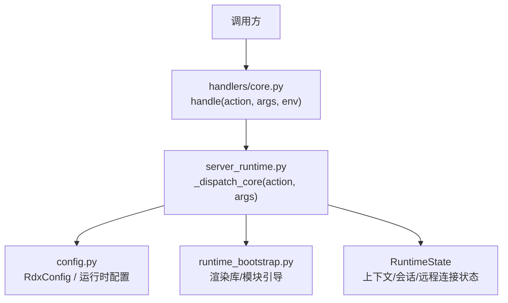
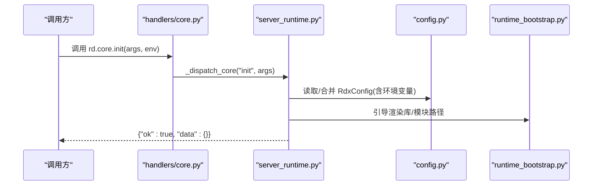
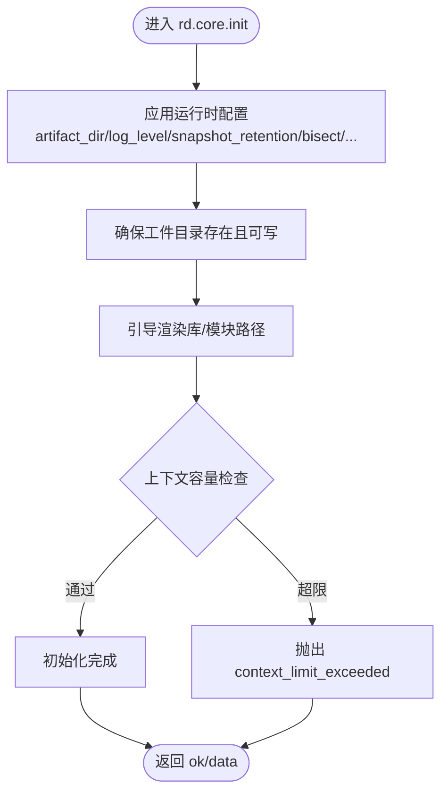
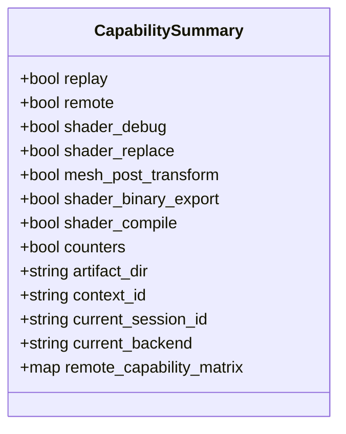
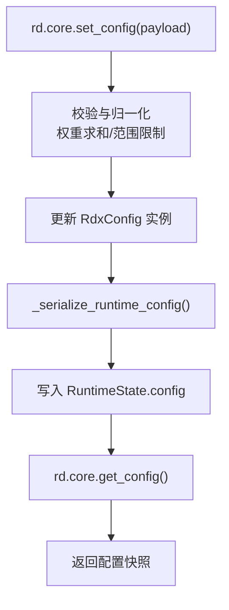
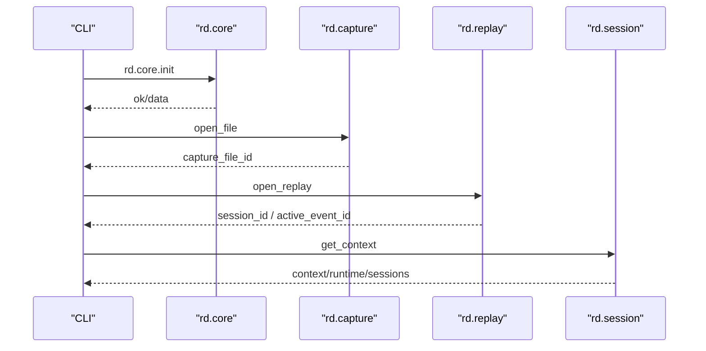
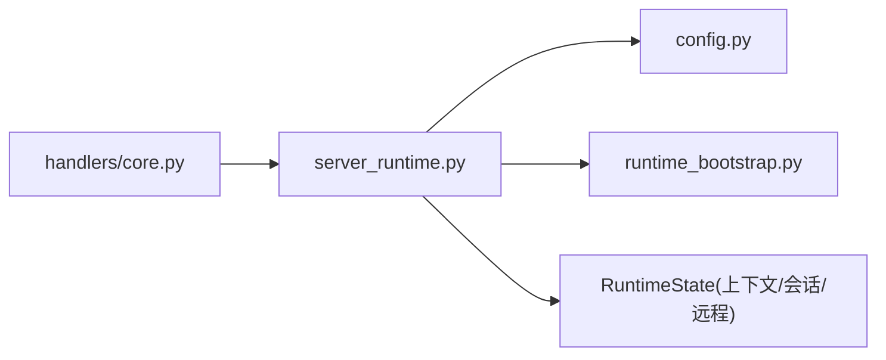

# 核心与环境管理API

<cite>
**本文引用的文件**
- [core.py](file://rdx/handlers/core.py)
- [server_runtime.py](file://rdx/server_runtime.py)
- [config.py](file://rdx/config.py)
- [runtime_bootstrap.py](file://rdx/runtime_bootstrap.py)
- [test_cli_capture_open.py](file://tests/test_cli_capture_open.py)
</cite>

## 目录
1. [简介](#简介)
2. [项目结构](#项目结构)
3. [核心组件](#核心组件)
4. [架构总览](#架构总览)
5. [详细组件分析](#详细组件分析)
6. [依赖关系分析](#依赖关系分析)
7. [性能考虑](#性能考虑)
8. [故障排查指南](#故障排查指南)
9. [结论](#结论)
10. [附录](#附录)

## 简介
本文件聚焦于 rd.core.* 操作组的核心与环境管理能力，覆盖环境初始化、配置管理、版本查询与能力检测等关键功能。重点说明：
- rd.core.init 的初始化参数与 global_env/enable_remote 的作用
- rd.core.get_capabilities 返回的能力矩阵结构与含义
- rd.core.get_version 的版本信息格式
- 运行时配置管理机制：rd.core.set_config 支持的配置项（artifact_dir、temp_dir、log_level 等）及 rd.core.get_config 返回值结构
- 错误处理最佳实践：环境检查、资源清理与异常恢复策略

## 项目结构
rd.core.* 通过统一处理器转发到 server_runtime 中的核心实现，核心逻辑集中在 server_runtime.py；配置模型在 config.py；运行时引导与 DLL/模块加载在 runtime_bootstrap.py；测试用例展示了调用序列与错误包装行为。

图表来源
- [core.py:8-9](file://rdx/handlers/core.py#L8-L9)
- [server_runtime.py:230-239](file://rdx/server_runtime.py#L230-L239)
- [config.py:117-134](file://rdx/config.py#L117-L134)
- [runtime_bootstrap.py:42-57](file://rdx/runtime_bootstrap.py#L42-L57)

章节来源
- [core.py:8-9](file://rdx/handlers/core.py#L8-L9)
- [server_runtime.py:230-239](file://rdx/server_runtime.py#L230-L239)
- [config.py:117-134](file://rdx/config.py#L117-L134)
- [runtime_bootstrap.py:42-57](file://rdx/runtime_bootstrap.py#L42-L57)

## 核心组件
- 处理器层：将 action 路由到 server_runtime 的核心分发器
- 运行时层：维护全局配置、上下文快照、会话/捕获句柄、远程连接、预览绑定、日志与指标
- 配置层：集中定义后端、回放、工件存储、数据库、二分搜索、报告、置信度权重、快照保留、运行时限制、自适应二分等配置项，并支持从环境变量注入
- 引导层：解析运行期二进制与 Python 模块路径，必要时注册 DLL 目录并调整 PATH

章节来源
- [core.py:8-9](file://rdx/handlers/core.py#L8-L9)
- [server_runtime.py:230-239](file://rdx/server_runtime.py#L230-L239)
- [config.py:15-134](file://rdx/config.py#L15-L134)
- [runtime_bootstrap.py:42-85](file://rdx/runtime_bootstrap.py#L42-L85)

## 架构总览
rd.core.* 操作通过 handlers/core.py 的 handle 函数统一转发至 server_runtime._dispatch_core，由该分发器根据 action 字符串执行具体逻辑（如 init、get_version、get_capabilities、set_config、get_config、healthcheck）。配置通过 RdxConfig 统一管理，运行时状态保存在 RuntimeState 中，远程能力与本地渲染库能力共同决定能力矩阵。

图表来源
- [core.py:8-9](file://rdx/handlers/core.py#L8-L9)
- [server_runtime.py:230-239](file://rdx/server_runtime.py#L230-L239)
- [config.py:135-186](file://rdx/config.py#L135-L186)
- [runtime_bootstrap.py:42-85](file://rdx/runtime_bootstrap.py#L42-L85)

## 详细组件分析

### 环境初始化：rd.core.init
- 作用：初始化运行环境，应用配置，准备渲染库/模块，建立上下文容量检查与默认状态
- 关键参数
  - global_env：用于设置或传递全局环境键值，影响后续操作的上下文与行为（例如上下文 ID、后端选择等）
  - enable_remote：布尔开关，控制是否允许远程能力（当为 false 时，远程相关能力将被禁用）
- 典型流程
  - 解析并应用配置（包括 artifact_dir、log_level、snapshot_retention、bisect、confidence_weights、adaptive_bisect、runtime_limits 等）
  - 确保工件目录可写、创建必要目录
  - 引导渲染库/Python 模块路径，必要时注册 DLL 目录
  - 校验上下文容量，避免超过 max_contexts
  - 返回标准化成功载荷

图表来源
- [server_runtime.py:277-390](file://rdx/server_runtime.py#L277-L390)
- [server_runtime.py:427-447](file://rdx/server_runtime.py#L427-L447)
- [runtime_bootstrap.py:42-85](file://rdx/runtime_bootstrap.py#L42-L85)

章节来源
- [server_runtime.py:277-390](file://rdx/server_runtime.py#L277-L390)
- [server_runtime.py:427-447](file://rdx/server_runtime.py#L427-L447)
- [runtime_bootstrap.py:42-85](file://rdx/runtime_bootstrap.py#L42-L85)

### 版本查询：rd.core.get_version
- 作用：返回当前渲染库/运行时的版本字符串
- 返回值：包含版本信息的标准载荷，版本值来源于内部版本获取函数
- 使用场景：兼容性检查、诊断、发布基线验证

章节来源
- [server_runtime.py:6049-6051](file://rdx/server_runtime.py#L6049-L6051)

### 能力检测：rd.core.get_capabilities
- 作用：探测当前环境可用的能力集合，形成“能力矩阵”
- 能力项示例
  - replay：内置回放运行时可用性
  - remote：远程能力是否可用（受 enable_remote 与远程连接状态影响）
  - shader_debug/shader_replace/mesh_post_transform/shader_binary_export/shader_compile/counters：基于当前会话控制器暴露的 API 能力
  - artifact_dir：当前工件目录路径
  - context_id/current_session_id/current_backend：当前上下文与会话信息
  - remote_capability_matrix：当存在远程连接或远程会话时的能力矩阵详情
- 细节模式：detail=full 时可附加 sessions/capture_files/remote_connections 计数

图表来源
- [server_runtime.py:6052-6165](file://rdx/server_runtime.py#L6052-L6165)

章节来源
- [server_runtime.py:6052-6165](file://rdx/server_runtime.py#L6052-L6165)

### 运行时配置管理：rd.core.set_config 与 rd.core.get_config
- set_config
  - 支持的配置项
    - artifact_dir：工件存储目录（自动创建并确保可写）
    - temp_dir：临时目录（通常指向运行时根目录）
    - log_level：日志级别（大写化后生效）
    - snapshot_retention.total_limit/per_type_limit：快照保留上限
    - bisect.default_strategy/max_iterations/default_confidence_threshold/confidence_profile：二分搜索策略与阈值
    - confidence_weights.sharpness/consistency/range_factor：置信度权重（需为正且总和非零，内部会归一化）
    - adaptive_bisect.mode/history_store_path：自适应二分模式与历史存储路径
    - runtime_limits.max_contexts/max_sessions_per_context/max_capture_files/max_capture_size_bytes/max_estimated_replay_memory_bytes/replay_memory_multiplier/max_recent_operations：运行时限制
  - 行为：更新全局 RdxConfig 并序列化回 RuntimeState.config
- get_config
  - 返回当前运行时配置的序列化视图，字段与 set_config 对应，便于外部工具读取当前生效配置

图表来源
- [server_runtime.py:277-390](file://rdx/server_runtime.py#L277-L390)

章节来源
- [server_runtime.py:277-390](file://rdx/server_runtime.py#L277-L390)

### 健康检查：rd.core.healthcheck
- 作用：对渲染库导入、工件目录可写性、回放/远程运行时进行探针检查
- 输出：checks 列表，每项包含 name/ok/detail
- 用途：部署前自检、故障定位

章节来源
- [server_runtime.py:6018-6044](file://rdx/server_runtime.py#L6018-L6044)

### 调用序列与错误包装示例
- CLI 打开捕获的典型调用序列：rd.core.init → rd.capture.open_file → rd.capture.open_replay → rd.replay.set_frame → rd.session.get_context
- 当中间步骤失败时，上层会将错误包装为结构化错误载荷，包含 failed_step、capture_file_id、session_id、daemon_state、context_snapshot 等上下文信息，便于诊断

图表来源
- [test_cli_capture_open.py:15-80](file://tests/test_cli_capture_open.py#L15-L80)

章节来源
- [test_cli_capture_open.py:15-80](file://tests/test_cli_capture_open.py#L15-L80)

## 依赖关系分析
- handlers/core.py 仅作为薄封装，将 action 分派给 server_runtime
- server_runtime 依赖 config.py 的配置模型与 from_env 注入机制
- server_runtime 依赖 runtime_bootstrap.py 进行渲染库与 Python 模块路径引导
- 运行时状态（RuntimeState）集中管理配置、日志、捕获/会话/远程句柄、上下文快照与预览绑定

图表来源
- [core.py:8-9](file://rdx/handlers/core.py#L8-L9)
- [server_runtime.py:230-239](file://rdx/server_runtime.py#L230-L239)
- [config.py:117-134](file://rdx/config.py#L117-L134)
- [runtime_bootstrap.py:42-85](file://rdx/runtime_bootstrap.py#L42-L85)

章节来源
- [core.py:8-9](file://rdx/handlers/core.py#L8-L9)
- [server_runtime.py:230-239](file://rdx/server_runtime.py#L230-L239)
- [config.py:117-134](file://rdx/config.py#L117-L134)
- [runtime_bootstrap.py:42-85](file://rdx/runtime_bootstrap.py#L42-L85)

## 性能考虑
- 配置应用阶段会对权重进行归一化与边界约束，避免无效配置导致后续计算异常
- 运行时限制（max_contexts、max_capture_files、replay_memory_multiplier 等）有助于控制资源占用
- 工件目录与日志写入应确保磁盘空间与权限充足，避免 I/O 瓶颈
- 远程能力启用会增加网络开销，按需开启并监控连接数

[本节提供通用指导，不直接分析具体文件]

## 故障排查指南
- 常见错误与定位
  - context_limit_exceeded：上下文数量超过限制，检查 max_contexts 与占用上下文
  - healthcheck 失败：渲染库导入失败或工件目录不可写，检查路径与权限
  - 远程能力不可用：确认 enable_remote 与远程连接状态
- 建议流程
  - 先执行 rd.core.healthcheck 确认基础环境
  - 使用 rd.core.get_capabilities(detail="full") 查看能力矩阵与连接数
  - 若失败，结合 rd.core.get_config 检查当前生效配置
  - 对于捕获/回放失败，参考测试中的错误包装结构，定位 failed_step 与 daemon_state

章节来源
- [server_runtime.py:427-447](file://rdx/server_runtime.py#L427-L447)
- [server_runtime.py:6018-6044](file://rdx/server_runtime.py#L6018-L6044)
- [test_cli_capture_open.py:160-310](file://tests/test_cli_capture_open.py#L160-L310)

## 结论
rd.core.* 提供了稳定的环境初始化、配置管理与能力探测入口。通过集中式配置模型与运行时状态管理，系统能够在本地与远程环境下保持一致的行为与可观测性。建议在生产环境中优先执行健康检查与能力探测，合理设置运行时限制，并结合错误包装信息进行快速定位与恢复。

[本节总结性内容，不直接分析具体文件]

## 附录
- 环境变量注入要点（来自配置模块）
  - RDX_RENDERDOC_PATH、RDX_ARTIFACT_STORE、RDX_DATA_DIR、RDX_REPORT_DIR、RDX_LOG_LEVEL、RDX_GPU_VENDOR、RDX_SPIRV_TOOLS_PATH、RDX_HEADLESS、RDX_BISECT_*、RDX_CONTEXT_ARTIFACT_*、RDX_MAX_* 等
- 运行时引导要点
  - 通过 RDX_RUNTIME_DLL_DIR 与 RDX_RENDERDOC_PATH 指定二进制与 Python 模块路径
  - Windows 下可能调用 add_dll_directory 注册 DLL 目录，PATH 会被前置追加以避免冲突

章节来源
- [config.py:135-186](file://rdx/config.py#L135-L186)
- [runtime_bootstrap.py:42-85](file://rdx/runtime_bootstrap.py#L42-L85)