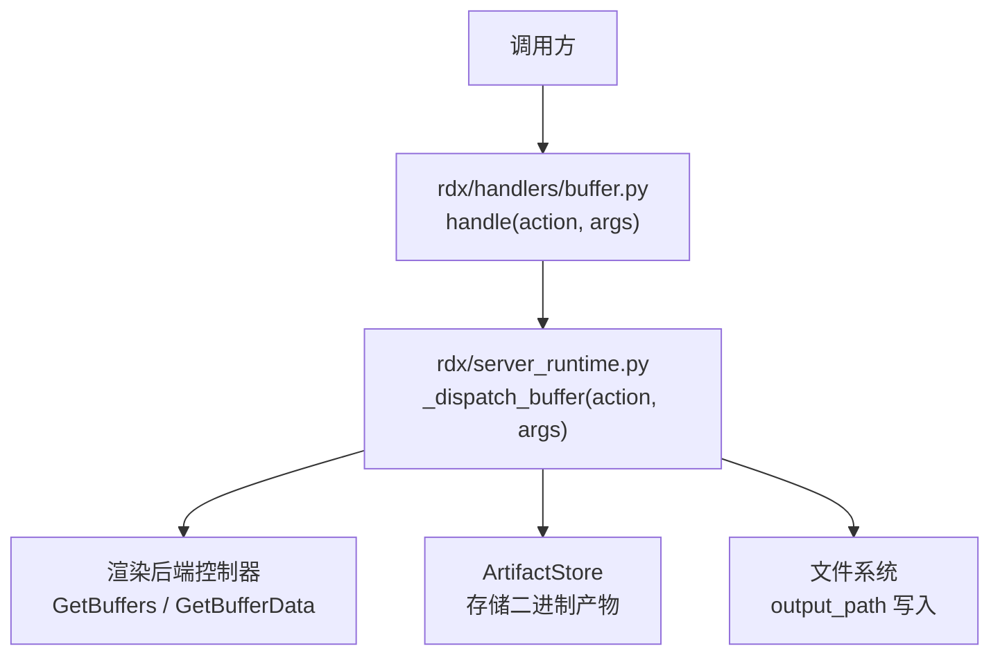
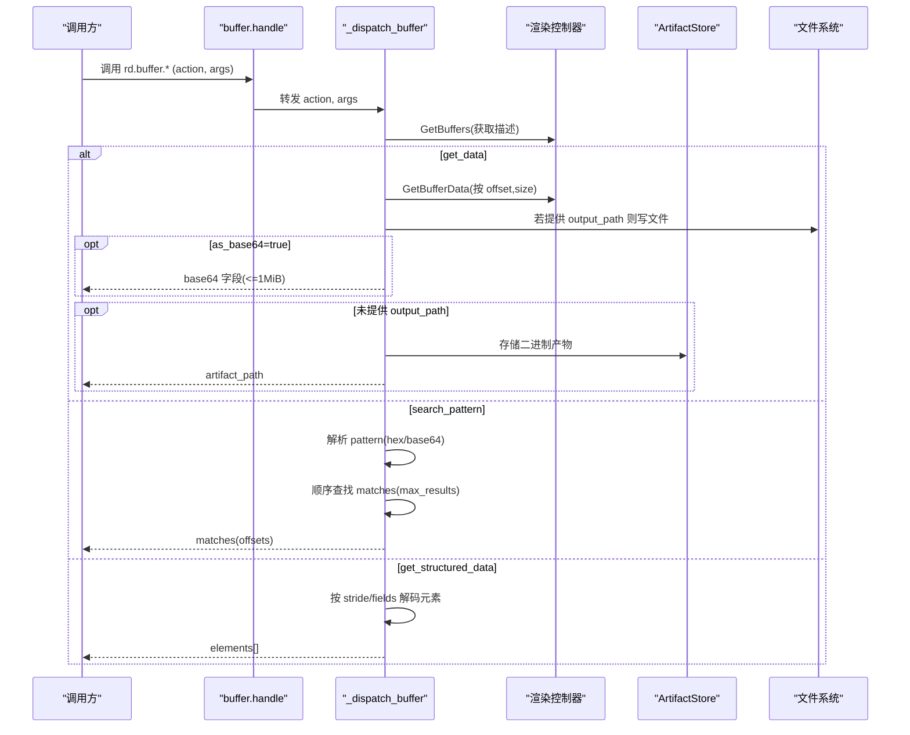
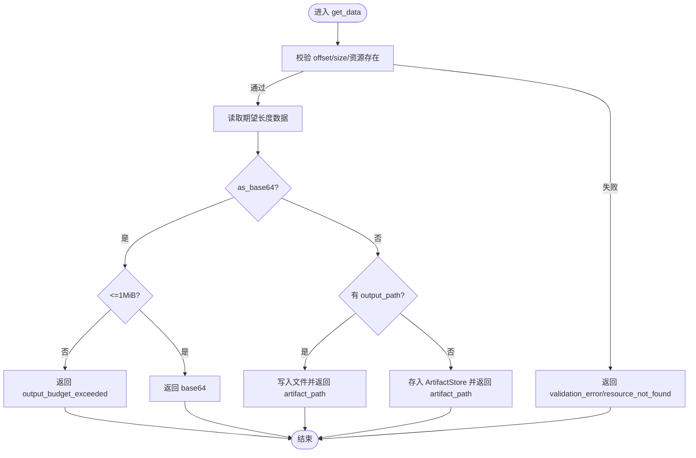
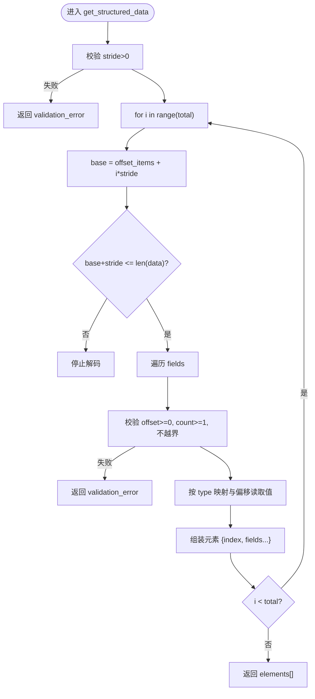
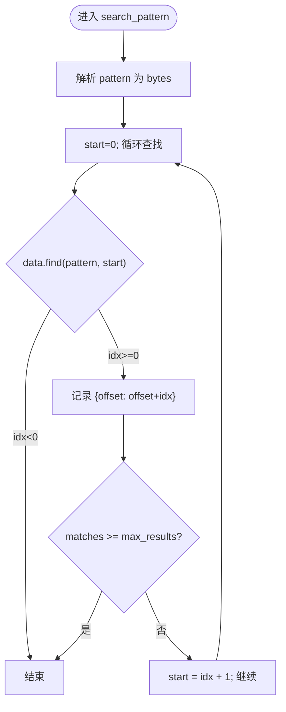
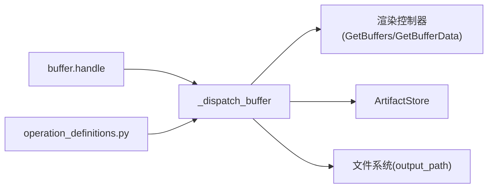

# 缓冲区与网格数据API

<cite>
**本文引用的文件**
- [rdx/handlers/buffer.py](file://rdx/handlers/buffer.py)
- [rdx/server_runtime.py](file://rdx/server_runtime.py)
- [rdx/operation_definitions.py](file://rdx/operation_definitions.py)
</cite>

## 目录
1. [简介](#简介)
2. [项目结构](#项目结构)
3. [核心组件](#核心组件)
4. [架构总览](#架构总览)
5. [详细组件分析](#详细组件分析)
6. [依赖关系分析](#依赖关系分析)
7. [性能考虑](#性能考虑)
8. [故障排查指南](#故障排查指南)
9. [结论](#结论)
10. [附录](#附录)

## 简介
本文件聚焦于缓冲区与网格数据访问 API（操作组 rd.buffer.*），围绕以下能力进行系统化说明：
- 原始字节读取：rd.buffer.get_data，涵盖 offset/size 范围校验、as_base64 内联返回限制与输出路径写入机制。
- 结构化数据解码：rd.buffer.get_structured_data，详细说明布局定义语法（stride、fields 的 name/type/offset/count）、数据类型映射（u8/i8/u16/i16/u32/i32/f32）以及元素遍历逻辑。
- 模式搜索：rd.buffer.search_pattern，支持十六进制字符串（含通配符 ??）与 base64 格式的模式匹配，并说明 max_results 结果限制。
- 性能优化建议：批量读取、内存映射、异步处理等策略，帮助在大规模缓冲场景下提升吞吐与降低延迟。

## 项目结构
缓冲区相关入口与实现分布在如下位置：
- 处理器路由：rdx/handlers/buffer.py 将 action 转发到运行时调度器。
- 运行时调度与实现：rdx/server_runtime.py 中的 _dispatch_buffer 集中实现了 get_data、get_structured_data、search_pattern 三大动作。
- 公开操作定义：rdx/operation_definitions.py 定义了 rd.buffer.* 的输入参数、返回值、作用域与约束，作为对外契约。

图表来源
- [rdx/handlers/buffer.py:8-9](file://rdx/handlers/buffer.py#L8-L9)
- [rdx/server_runtime.py:8180-8220](file://rdx/server_runtime.py#L8180-L8220)

章节来源
- [rdx/handlers/buffer.py:1-10](file://rdx/handlers/buffer.py#L1-L10)
- [rdx/server_runtime.py:8180-8220](file://rdx/server_runtime.py#L8180-L8220)
- [rdx/operation_definitions.py:4-66](file://rdx/operation_definitions.py#L4-L66)

## 核心组件
- 处理器路由层：接收 action 与参数，统一委派给运行时调度器。
- 运行时调度层：解析参数、校验范围、执行底层读取、组织返回体、处理输出路径或 artifact。
- 公开契约层：以 JSON Schema 形式声明参数类型、取值范围、必填项与作用域，保证跨工具一致性。

章节来源
- [rdx/handlers/buffer.py:8-9](file://rdx/handlers/buffer.py#L8-L9)
- [rdx/server_runtime.py:8180-8292](file://rdx/server_runtime.py#L8180-L8292)
- [rdx/operation_definitions.py:4-160](file://rdx/operation_definitions.py#L4-L160)

## 架构总览
下图展示了从调用方到后端控制器的完整调用链，包括参数校验、数据读取、输出落盘与结构化解码流程。

图表来源
- [rdx/handlers/buffer.py:8-9](file://rdx/handlers/buffer.py#L8-L9)
- [rdx/server_runtime.py:8180-8292](file://rdx/server_runtime.py#L8180-L8292)

## 详细组件分析

### rd.buffer.get_data：原始字节读取
- 参数与约束
  - session_id、buffer_id：必需。
  - offset：非负整数，默认 0。
  - size：非负整数；缺省时读取至 buffer 末尾。
  - output_path：可选；提供时直接写入该路径，否则写入临时 artifact。
  - as_base64：可选布尔；启用时以内联 base64 返回，但受 1 MiB 限制。
  - state/event_id：用于指定回放状态或事件上下文（由上层保障互斥）。
- 范围校验
  - 计算 expected = descriptor.length - offset（当 size 为 0），或取 size。
  - 校验 offset >= 0、expected >= 0、offset + expected <= descriptor.length，否则返回 validation_error。
- 读取与输出
  - 通过控制器 GetBufferData 读取期望长度数据，若长度不匹配则报错。
  - 若 as_base64=true 且 expected > 1 MiB，拒绝请求以避免响应过大。
  - 若提供 output_path，创建父目录并写入二进制文件，返回 artifact_path。
  - 否则将数据存入 ArtifactStore，返回 artifact_path。
- 错误与边界
  - 资源不存在：resource_not_found。
  - 范围越界：validation_error。
  - 内联大小超限：output_budget_exceeded。
  - 不完整读取：运行时异常（内部转换为错误）。

图表来源
- [rdx/server_runtime.py:8191-8220](file://rdx/server_runtime.py#L8191-L8220)

章节来源
- [rdx/server_runtime.py:8180-8220](file://rdx/server_runtime.py#L8180-L8220)
- [rdx/operation_definitions.py:4-66](file://rdx/operation_definitions.py#L4-L66)

### rd.buffer.get_structured_data：结构化数据解码
- 布局定义
  - layout.stride：正整数，表示每个元素的步长（字节）。
  - layout.fields：数组，每项包含：
    - name：字段名。
    - type：数据类型，限定为 u8/i8/u16/i16/u32/i32/f32。
    - offset：字段相对元素起始偏移（字节），必须非负。
    - count：字段重复次数，至少为 1。
- 类型映射
  - 使用 struct 格式串与小端序：
    - u8 -> "<B", i8 -> "<b"
    - u16 -> "<H", i16 -> "<h"
    - u32 -> "<I", i32 -> "<i"
    - f32 -> "<f"
- 元素遍历与校验
  - 根据 stride 计算每个元素基址 base = offset_items + i * stride。
  - 对每个 field，检查 field_offset + size_bytes * field_count <= stride，否则返回 validation_error。
  - 使用 struct.unpack_from 按字段偏移与计数逐值读取，count=1 时返回标量，否则返回列表。
- 数量限制
  - count 与 max_elements 共同决定实际解码元素数，默认上限保护系统资源。
- 错误与边界
  - stride 非正：validation_error。
  - 字段类型不支持：validation_error。
  - 字段超出 stride：validation_error。
  - 数据不足：提前停止解码。

图表来源
- [rdx/server_runtime.py:8250-8290](file://rdx/server_runtime.py#L8250-L8290)

章节来源
- [rdx/server_runtime.py:8250-8290](file://rdx/server_runtime.py#L8250-L8290)
- [rdx/operation_definitions.py:67-124](file://rdx/operation_definitions.py#L67-L124)

### rd.buffer.search_pattern：模式搜索
- 模式输入
  - 字符串模式：支持十六进制表示，允许空格分隔与通配符“??”；也支持前缀“0x”。
  - base64：当前实现接受字符串或列表形式的字节序列；字符串会先清理空格并尝试 hex 解析。
- 搜索过程
  - 将模式转为 bytes，从 start=0 开始顺序查找 data.find(pattern, start)。
  - 记录每个匹配的绝对偏移（相对于 buffer 的 offset + idx）。
  - 最多返回 max_results 个匹配（默认 256）。
- 注意
  - 当前实现不支持真正的“??”通配匹配，仅做精确字节匹配；若需通配，应自行预处理为多段匹配或扩展实现。
  - 大数据集上建议结合分页或分块读取以降低内存占用。

图表来源
- [rdx/server_runtime.py:8224-8248](file://rdx/server_runtime.py#L8224-L8248)

章节来源
- [rdx/server_runtime.py:8224-8248](file://rdx/server_runtime.py#L8224-L8248)
- [rdx/operation_definitions.py:125-160](file://rdx/operation_definitions.py#L125-L160)

## 依赖关系分析
- 处理器与运行时：
  - rdx/handlers/buffer.py 仅负责分发，无业务逻辑。
  - rdx/server_runtime.py 承载全部业务逻辑，依赖渲染控制器与 ArtifactStore。
- 公开契约：
  - rdx/operation_definitions.py 提供输入/输出 Schema，驱动工具发现与文档生成。

图表来源
- [rdx/handlers/buffer.py:8-9](file://rdx/handlers/buffer.py#L8-L9)
- [rdx/server_runtime.py:8180-8292](file://rdx/server_runtime.py#L8180-L8292)
- [rdx/operation_definitions.py:4-160](file://rdx/operation_definitions.py#L4-L160)

章节来源
- [rdx/handlers/buffer.py:1-10](file://rdx/handlers/buffer.py#L1-L10)
- [rdx/server_runtime.py:8180-8292](file://rdx/server_runtime.py#L8180-L8292)
- [rdx/operation_definitions.py:4-160](file://rdx/operation_definitions.py#L4-L160)

## 性能考虑
- 避免大对象内联传输
  - as_base64 限制 1 MiB；对于较大缓冲，优先使用 output_path 或 artifact 方式导出，减少网络与序列化开销。
- 分批与分页
  - 对超大缓冲采用分段 offset/size 读取，配合并发任务聚合结果，降低单次内存峰值。
- 内存映射与零拷贝
  - 若后端支持，可考虑基于内存映射的只读访问以减少复制；当前实现通过控制器读取后交由 ArtifactStore 管理。
- 结构化解码优化
  - 合理设置 stride 与 fields，避免不必要的字段读取；对大量元素解码时限制 max_elements，必要时分批次处理。
- 搜索性能
  - 对频繁搜索场景，可缓存已读取的数据片段或使用索引；注意当前实现为线性扫描，max_results 可限制结果规模。
- 异步与并发
  - 利用异步框架并行发起多个独立读取/解码任务，提高吞吐；注意共享资源的锁与超时控制。

[本节为通用性能建议，不直接引用具体代码行]

## 故障排查指南
- 常见错误码与原因
  - resource_not_found：buffer_id 在当前会话中不存在。
  - validation_error：offset/size 越界、stride 非正、字段越界、类型不支持等。
  - output_budget_exceeded：as_base64 模式下数据超过 1 MiB。
  - 不完整读取：GetBufferData 返回长度与预期不符。
- 定位步骤
  - 检查 session_id 与 buffer_id 是否有效。
  - 确认 offset/size 与资源长度关系。
  - 核对 structured layout 的 stride 与 fields 定义是否符合实际布局。
  - 查看最近操作历史与日志，定位失败阶段与上下文。
- 恢复建议
  - 调整读取范围或改用 artifact 导出。
  - 修正结构化布局定义。
  - 如会话状态异常，关闭并重新打开会话。

章节来源
- [rdx/server_runtime.py:8191-8292](file://rdx/server_runtime.py#L8191-L8292)
- [rdx/operation_definitions.py:4-160](file://rdx/operation_definitions.py#L4-L160)

## 结论
rd.buffer.* API 提供了对缓冲区数据的灵活访问能力：
- get_data 适合原始字节读写，具备严格的范围校验与大对象安全限制。
- get_structured_data 通过声明式布局高效解码复杂数据结构，适用于顶点、常量缓冲等场景。
- search_pattern 便于快速定位关键字节模式，但需注意当前实现的匹配语义与性能特征。
在生产环境中，建议结合分批读取、artifact 导出与异步并发策略，以获得最佳性能与稳定性。

[本节为总结性内容，不直接引用具体代码行]

## 附录
- 术语
  - stride：每个结构化元素占用的字节跨度。
  - artifact：系统生成的二进制产物，可通过 artifact_path 引用。
  - 回放状态：当前或捕获初始状态的上下文，影响读取的数据视图。
- 参考
  - 公开操作定义位于 operation_definitions.py，可作为接口契约与自动化文档来源。

[本节为补充信息，不直接引用具体代码行]