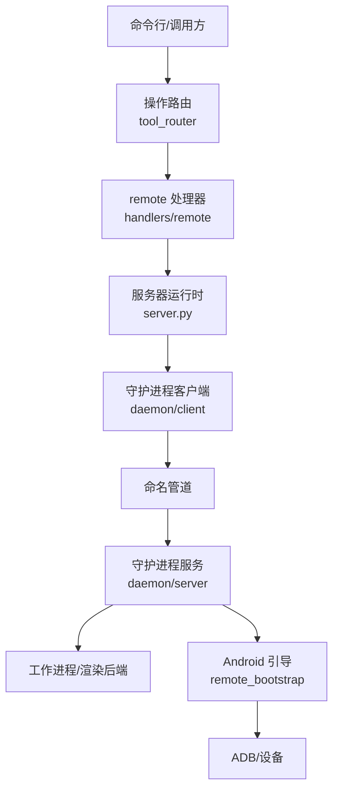
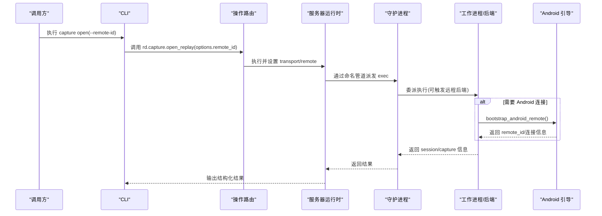
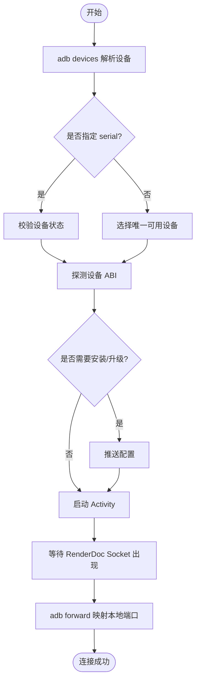
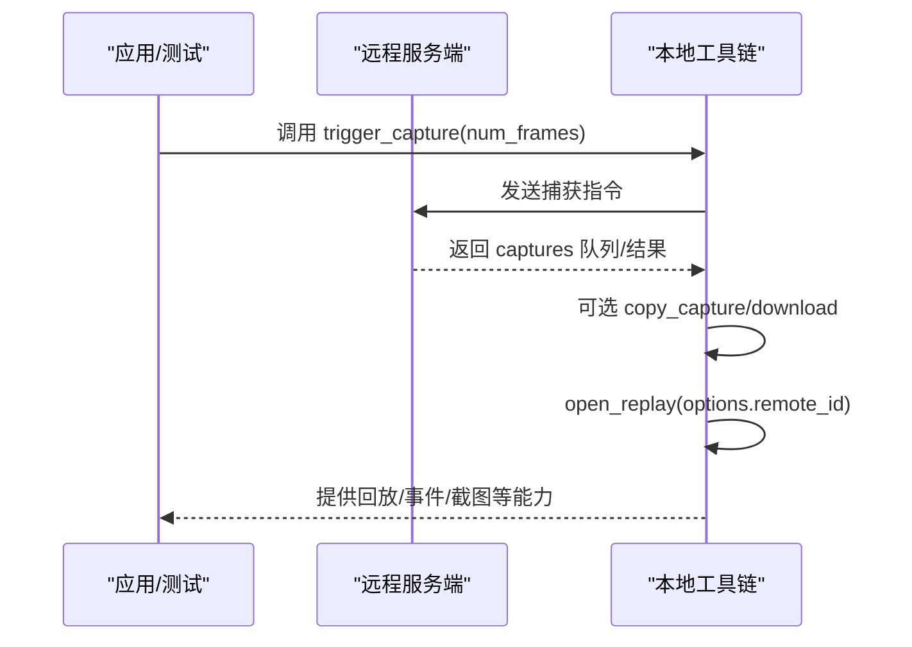
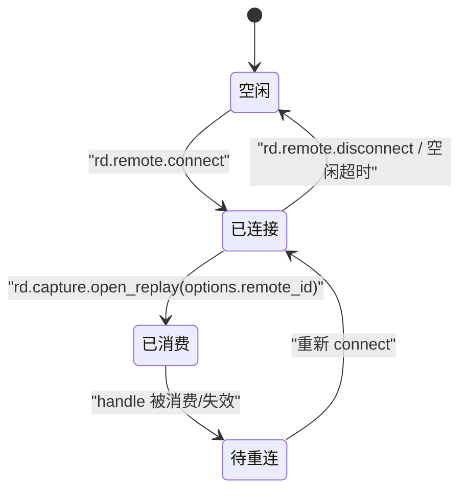

# 远程连接API

<cite>
**本文引用的文件**
- [rdc_tool/handlers/remote.py](file://rdc_tool/handlers/remote.py)
- [rdc_tool/tool_router.py](file://rdc_tool/tool_router.py)
- [rdc_tool/server.py](file://rdc_tool/server.py)
- [rdc_tool/daemon/client.py](file://rdc_tool/daemon/client.py)
- [rdc_tool/daemon/server.py](file://rdc_tool/daemon/server.py)
- [rdc_tool/operation_definitions.py](file://rdc_tool/operation_definitions.py)
- [rdc_tool/remote_bootstrap.py](file://rdc_tool/remote_bootstrap.py)
- [rdc_tool/cli.py](file://rdc_tool/cli.py)
- [docs/troubleshooting.md](file://docs/troubleshooting.md)
- [docs/rdc-native-agent-playbook.md](file://docs/rdc-native-agent-playbook.md)
</cite>

## 目录
1. [简介](#简介)
2. [项目结构](#项目结构)
3. [核心组件](#核心组件)
4. [架构总览](#架构总览)
5. [详细组件分析](#详细组件分析)
6. [依赖关系分析](#依赖关系分析)
7. [性能与传输特性](#性能与传输特性)
8. [故障排除指南](#故障排除指南)
9. [结论](#结论)
10. [附录：操作清单与使用要点](#附录：操作清单与使用要点)

## 简介
本文件聚焦于远程连接API，围绕 rd.remote.* 操作组，系统化说明 Android 设备连接管理、远程捕获控制、远程会话管理、数据传输协议与错误恢复机制，并提供面向生产环境的故障排除指南。该能力通过本地守护进程（daemon）与远端 RenderDoc/Android 助手协同工作，将设备发现、连接建立、认证、资源生命周期管理与上层工具调用统一封装，使 capture/replay/session 等高层语义在“本地/远程”后端之间透明切换。

## 项目结构
远程能力由以下层次组成：
- 操作定义层：集中声明所有公开操作（含 rd.remote.*），包含参数、前置条件、返回值与影响范围。
- 路由与执行层：根据操作名分发到对应领域处理器；remote 域处理器仅做转发。
- 运行时调度层：负责上下文、进度、预览同步、异常归一化与元数据记录。
- 守护进程层：基于命名管道提供进程间通信，维护状态、客户端心跳、空闲回收、工作进程委派。
- Android 引导层：通过 ADB 完成设备发现、APK 安装/复用、配置推送、端口转发、Socket 就绪检测。
- CLI 集成层：将用户命令转换为操作调用，支持 --remote-id 强制走远程后端。

图表来源
- [rdc_tool/tool_router.py:34-54](file://rdc_tool/tool_router.py#L34-L54)
- [rdc_tool/handlers/remote.py:8-9](file://rdc_tool/handlers/remote.py#L8-L9)
- [rdc_tool/server.py:62-145](file://rdc_tool/server.py#L62-L145)
- [rdc_tool/daemon/client.py:467-515](file://rdc_tool/daemon/client.py#L467-L515)
- [rdc_tool/daemon/server.py:572-643](file://rdc_tool/daemon/server.py#L572-L643)
- [rdc_tool/remote_bootstrap.py:495-698](file://rdc_tool/remote_bootstrap.py#L495-L698)

章节来源
- [rdc_tool/tool_router.py:1-156](file://rdc_tool/tool_router.py#L1-L156)
- [rdc_tool/handlers/remote.py:1-11](file://rdc_tool/handlers/remote.py#L1-L11)
- [rdc_tool/server.py:1-150](file://rdc_tool/server.py#L1-L150)
- [rdc_tool/daemon/client.py:1-800](file://rdc_tool/daemon/client.py#L1-L800)
- [rdc_tool/daemon/server.py:1-728](file://rdc_tool/daemon/server.py#L1-L728)
- [rdc_tool/remote_bootstrap.py:1-785](file://rdc_tool/remote_bootstrap.py#L1-L785)

## 核心组件
- 操作定义与路由
  - 所有 rd.* 操作在 operation_definitions.py 中集中声明，包含前置条件、输入模式与作用域。
  - tool_router.py 加载目录并构建注册表，按 domain.action 分派到 handlers/*。
- remote 处理器
  - handlers/remote.py 将 action 透传到 server_runtime._dispatch_remote，实现“远程能力”的统一入口。
- 服务器运行时
  - server.py 的 dispatch_operation 负责创建执行上下文、进度上报、异常归一化、预览同步与结果后处理。
- 守护进程
  - daemon/server.py 提供命名管道服务，维护 daemon 状态、客户端列表、活动操作、工作进程委派与生命周期监控。
  - daemon/client.py 提供连接、认证、重试、超时、清理与状态持久化。
- Android 引导
  - remote_bootstrap.py 实现设备发现、ABI 探测、APK 安装/复用、配置推送、端口转发、Socket 就绪检测与清理。
- CLI 集成
  - cli.py 将 capture open 等流程与 --remote-id 结合，确保 open_replay 严格走远程后端。

章节来源
- [rdc_tool/operation_definitions.py:1960-2300](file://rdc_tool/operation_definitions.py#L1960-L2300)
- [rdc_tool/tool_router.py:1-156](file://rdc_tool/tool_router.py#L1-L156)
- [rdc_tool/handlers/remote.py:1-11](file://rdc_tool/handlers/remote.py#L1-L11)
- [rdc_tool/server.py:62-145](file://rdc_tool/server.py#L62-L145)
- [rdc_tool/daemon/server.py:102-169](file://rdc_tool/daemon/server.py#L102-L169)
- [rdc_tool/daemon/client.py:467-515](file://rdc_tool/daemon/client.py#L467-L515)
- [rdc_tool/remote_bootstrap.py:495-698](file://rdc_tool/remote_bootstrap.py#L495-L698)
- [rdc_tool/cli.py:1090-1171](file://rdc_tool/cli.py#L1090-L1171)

## 架构总览
下图展示一次典型远程捕获打开流程：CLI 发起 capture open，若指定 --remote-id，则 open_replay 必须走远程后端；底层通过守护进程与工作进程协作，必要时触发 Android 引导以建立连接。

图表来源
- [rdc_tool/cli.py:1090-1171](file://rdc_tool/cli.py#L1090-L1171)
- [rdc_tool/tool_router.py:131-154](file://rdc_tool/tool_router.py#L131-L154)
- [rdc_tool/server.py:62-145](file://rdc_tool/server.py#L62-L145)
- [rdc_tool/daemon/server.py:452-493](file://rdc_tool/daemon/server.py#L452-L493)
- [rdc_tool/remote_bootstrap.py:495-698](file://rdc_tool/remote_bootstrap.py#L495-L698)

## 详细组件分析

### Android 设备连接管理
- 设备发现
  - 通过 ADB 列出设备并解析状态；支持指定 serial 或自动选择唯一可用设备。
  - ABI 探测优先读取 64 位属性，回退至 32 位；不支持的 ABI 会明确报错。
- 连接建立
  - 若目标未运行，则安装/升级 APK 或强制替换不兼容版本；随后启动 Loader Activity。
  - 等待 RenderDoc Unix Socket 出现，解析端口并通过 adb forward 映射到本地端口。
  - 成功后返回 host/port/remote_port/forward_spec 等连接信息。
- 认证机制
  - 守护进程层使用 token 进行请求级鉴权；Android 侧通过 Socket 名称 renderdoc_{port} 标识服务实例。
- 连接池管理
  - 守护进程维护 attached_clients 列表，基于 heartbeat 与 lease_timeout 清理僵尸客户端。
  - Android 引导层对已运行的 helper 进程进行“借用”，避免重复安装与冲突。

图表来源
- [rdc_tool/remote_bootstrap.py:294-338](file://rdc_tool/remote_bootstrap.py#L294-L338)
- [rdc_tool/remote_bootstrap.py:401-422](file://rdc_tool/remote_bootstrap.py#L401-L422)
- [rdc_tool/remote_bootstrap.py:563-698](file://rdc_tool/remote_bootstrap.py#L563-L698)
- [rdc_tool/daemon/server.py:166-169](file://rdc_tool/daemon/server.py#L166-L169)
- [rdc_tool/daemon/server.py:181-211](file://rdc_tool/daemon/server.py#L181-L211)

章节来源
- [rdc_tool/remote_bootstrap.py:294-338](file://rdc_tool/remote_bootstrap.py#L294-L338)
- [rdc_tool/remote_bootstrap.py:401-422](file://rdc_tool/remote_bootstrap.py#L401-L422)
- [rdc_tool/remote_bootstrap.py:495-698](file://rdc_tool/remote_bootstrap.py#L495-L698)
- [rdc_tool/daemon/server.py:166-211](file://rdc_tool/daemon/server.py#L166-L211)

### 远程捕获控制
- 启动/停止捕获
  - 通过 rd.remote.queue_capture 与 rd.remote.trigger_capture 在远程 target 上排队或触发捕获。
  - 可通过 rd.remote.set_capture_options 设置保存路径模板、帧数限制、VSYNC 策略等。
- 捕获配置
  - 支持 capture_all_cmd_lists、hook_into_children、ref_all_resources 等选项，适配不同场景。
- 实时数据传输
  - 捕获完成后，open_replay 可基于 remote_id 直接回放远程数据；后续事件查询、截图导出等通过标准 rd.* 接口完成。
  - 当 open_replay 消耗了 remote handle，需重新连接或走恢复流程，不可复用旧句柄。

图表来源
- [rdc_tool/operation_definitions.py:2193-2285](file://rdc_tool/operation_definitions.py#L2193-L2285)
- [rdc_tool/operation_definitions.py:2221-2251](file://rdc_tool/operation_definitions.py#L2221-L2251)
- [rdc_tool/operation_definitions.py:245-282](file://rdc_tool/operation_definitions.py#L245-L282)

章节来源
- [rdc_tool/operation_definitions.py:2193-2285](file://rdc_tool/operation_definitions.py#L2193-L2285)
- [rdc_tool/operation_definitions.py:2221-2251](file://rdc_tool/operation_definitions.py#L2221-L2251)
- [rdc_tool/operation_definitions.py:245-282](file://rdc_tool/operation_definitions.py#L245-L282)

### 远程会话管理
- 会话创建
  - 通过 rd.capture.open_replay 创建回放会话；当 options.remote_id_present 时，必须走远程后端，禁止静默回退到本地。
- 状态同步
  - 守护进程定期从上下文快照刷新 session_id、capture_file_id、active_event_id、frame_index 等关键状态。
- 资源迁移
  - 关闭 replay 释放资源；清理失败时会返回明确的恢复步骤。
- 断线重连机制
  - 若检测到 remote_handle_consumed 或连接失效，应重新执行 rd.remote.connect 获取新句柄后再 open_replay。
  - 守护进程通过心跳与租约时间清理僵尸客户端，并在空闲超时时自动退出。

图表来源
- [rdc_tool/operation_definitions.py:245-282](file://rdc_tool/operation_definitions.py#L245-L282)
- [rdc_tool/daemon/server.py:334-357](file://rdc_tool/daemon/server.py#L334-L357)
- [rdc_tool/daemon/server.py:532-570](file://rdc_tool/daemon/server.py#L532-L570)
- [docs/troubleshooting.md:13-19](file://docs/troubleshooting.md#L13-L19)

章节来源
- [rdc_tool/operation_definitions.py:245-282](file://rdc_tool/operation_definitions.py#L245-L282)
- [rdc_tool/daemon/server.py:334-357](file://rdc_tool/daemon/server.py#L334-L357)
- [rdc_tool/daemon/server.py:532-570](file://rdc_tool/daemon/server.py#L532-L570)
- [docs/troubleshooting.md:13-19](file://docs/troubleshooting.md#L13-L19)

### 数据传输协议与优化
- 传输通道
  - 本地到守护进程：Windows 命名管道，带 token 鉴权与超时控制。
  - 守护进程到工作进程：内部委派，支持超时策略与异常恢复。
  - 本地到 Android：ADB forward + RenderDoc Unix Socket，端口动态分配与就绪检测。
- 压缩算法
  - 仓库内包含通用压缩库（zlib/gzip/lzma/bz2/zstd），但远程捕获与回放的具体压缩策略由后端实现决定；上层通过操作参数与后端能力矩阵交互。
- 错误恢复
  - 统一错误模型：ok/error/meta，错误包含 code/category/message/details。
  - 超时与重试：守护进程客户端具备指数退避式轮询与超时抛出；Android 引导层对每个子步骤设置独立超时。
- 性能优化
  - 重用现有会话：同一上下文中相同 capture 的 replay 会被复用。
  - 资源清理：显式 close_replay 释放资源，避免 stale session 导致性能退化。
  - 连接预算：Android 引导使用 ConnectionBudget 控制整体超时与取消信号，避免长时间阻塞。

章节来源
- [rdc_tool/daemon/client.py:467-515](file://rdc_tool/daemon/client.py#L467-L515)
- [rdc_tool/daemon/server.py:452-493](file://rdc_tool/daemon/server.py#L452-L493)
- [rdc_tool/remote_bootstrap.py:37-58](file://rdc_tool/remote_bootstrap.py#L37-L58)
- [rdc_tool/operation_definitions.py:245-282](file://rdc_tool/operation_definitions.py#L245-L282)

## 依赖关系分析
- 模块耦合
  - tool_router 依赖 operation_definitions 与 handlers；remote 处理器仅转发，降低耦合。
  - server.py 依赖 core engine 与 server_runtime；daemon 层解耦进程边界。
  - Android 引导与守护进程松耦合：仅在需要时触发引导。
- 外部依赖
  - ADB、RenderDoc 后端、Python 运行时与系统命名管道。
- 循环依赖
  - 未发现明显循环依赖；各层职责清晰。

图表来源
- [rdc_tool/tool_router.py:1-156](file://rdc_tool/tool_router.py#L1-L156)
- [rdc_tool/handlers/remote.py:1-11](file://rdc_tool/handlers/remote.py#L1-L11)
- [rdc_tool/server.py:62-145](file://rdc_tool/server.py#L62-L145)
- [rdc_tool/daemon/client.py:467-515](file://rdc_tool/daemon/client.py#L467-L515)
- [rdc_tool/daemon/server.py:572-643](file://rdc_tool/daemon/server.py#L572-L643)
- [rdc_tool/remote_bootstrap.py:495-698](file://rdc_tool/remote_bootstrap.py#L495-L698)

章节来源
- [rdc_tool/tool_router.py:1-156](file://rdc_tool/tool_router.py#L1-L156)
- [rdc_tool/server.py:62-145](file://rdc_tool/server.py#L62-L145)
- [rdc_tool/daemon/server.py:572-643](file://rdc_tool/daemon/server.py#L572-L643)

## 性能与传输特性
- 连接建立耗时
  - Android 引导包含安装/启动/Socket 就绪/端口转发，整体受设备性能与网络影响；默认超时为 120 秒，可按需调整。
- 回放复用
  - 同上下文同 capture 的 replay 会话会被复用，减少重建开销。
- 资源释放
  - 建议显式关闭 replay 与断开连接，避免资源泄漏与状态污染。
- 传输效率
  - 大文件下载建议使用 copy_capture 落盘；小数据可直接 base64 返回（有大小限制）。
- 超时与重试
  - 守护进程客户端具备超时与诊断信息；Android 引导对每步设置超时，失败时给出具体原因。

[本节为通用指导，无需特定文件引用]

## 故障排除指南
- 网络连接问题
  - 检查守护进程状态与 token 是否正确；确认命名管道可达。
  - 检查 ADB 是否可用、设备是否在线、端口转发是否生效。
- 设备兼容性
  - 确认 ABI 受支持；如提示签名不匹配或版本降级，按引导提示卸载重装。
- 权限配置
  - 确保 APK 安装与启动权限；必要时推送配置文件。
- 会话与句柄
  - 若状态显示 remote_handle_consumed，请重新 connect 再 open_replay，不要复用旧句柄。
  - 若 stale session 清理失败，按返回的恢复命令执行。
- 日志与诊断
  - 使用 rdc-tool --json doctor 与环境自检；查看 context status 与操作历史定位问题。

章节来源
- [docs/troubleshooting.md:1-58](file://docs/troubleshooting.md#L1-L58)
- [docs/rdc-native-agent-playbook.md:117-144](file://docs/rdc-native-agent-playbook.md#L117-L144)
- [rdc_tool/daemon/client.py:467-515](file://rdc_tool/daemon/client.py#L467-L515)
- [rdc_tool/remote_bootstrap.py:495-698](file://rdc_tool/remote_bootstrap.py#L495-L698)

## 结论
rd.remote.* 提供了从设备发现、连接建立、认证到捕获控制与会话管理的完整闭环。通过守护进程与工作进程的解耦设计，以及 Android 引导层的健壮性保障，上层工具可在本地与远程后端之间无缝切换。遵循“显式连接—严格回放—及时释放—按需重连”的最佳实践，可获得稳定高效的远程调试体验。

[本节为总结，无需特定文件引用]

## 附录：操作清单与使用要点
- 连接与探测
  - rd.remote.connect：建立远程连接，支持 direct 与 adb_android 两种传输；成功后返回 remote_id 与 server_info。
  - rd.remote.ping：检查连接可用性与延迟。
- 捕获控制
  - rd.remote.set_capture_options：设置捕获参数。
  - rd.remote.queue_capture / rd.remote.trigger_capture：排队或触发捕获。
  - rd.remote.copy_capture / rd.remote.delete_capture：下载或删除远程捕获。
  - rd.remote.list_targets / rd.remote.list_captures：列举目标与捕获。
  - rd.remote.launch_app：在远程启动应用并注入（若支持）。
  - rd.remote.disconnect：断开连接。
- 回放与会话
  - rd.capture.open_replay：创建回放会话；当 options.remote_id_present 时必须走远程后端。
  - rd.replay.set_frame：设置回放帧位置。
  - rd.session.get_context：获取当前上下文与运行时状态。
- 使用要点
  - 首次使用前调用 rd.core.init 启用远程能力。
  - 使用 --remote-id 强制 open_replay 走远程后端，避免静默回退。
  - 捕获完成后如需再次使用，应重新 connect 获取新句柄。

章节来源
- [rdc_tool/operation_definitions.py:1960-2300](file://rdc_tool/operation_definitions.py#L1960-L2300)
- [rdc_tool/cli.py:1090-1171](file://rdc_tool/cli.py#L1090-L1171)
- [docs/rdc-native-agent-playbook.md:117-144](file://docs/rdc-native-agent-playbook.md#L117-L144)