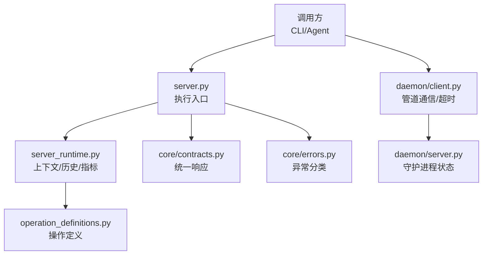
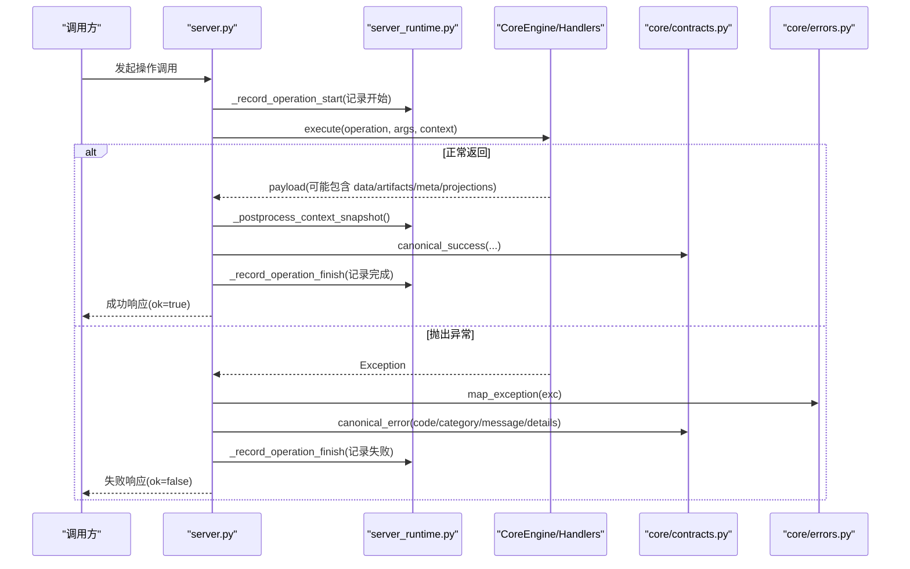
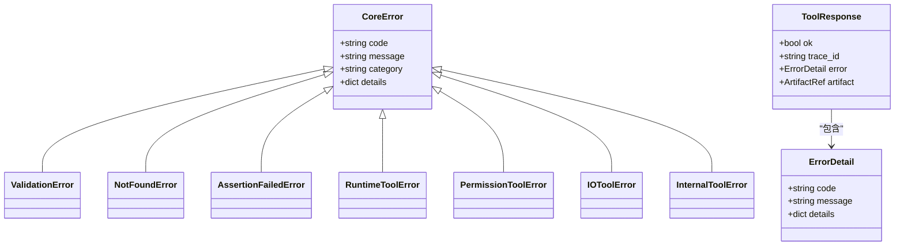
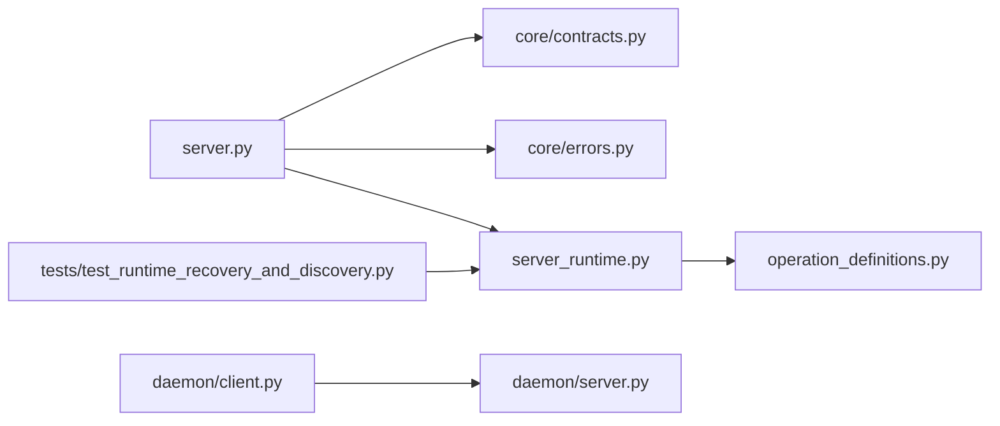

# 错误处理与状态API

<cite>
**本文引用的文件**
- [rdx/core/contracts.py](file://rdx/core/contracts.py)
- [rdx/core/errors.py](file://rdx/core/errors.py)
- [rdx/server.py](file://rdx/server.py)
- [rdx/server_runtime.py](file://rdx/server_runtime.py)
- [rdx/operation_definitions.py](file://rdx/operation_definitions.py)
- [rdx/models.py](file://rdx/models.py)
- [rdx/daemon/client.py](file://rdx/daemon/client.py)
- [rdx/daemon/server.py](file://rdx/daemon/server.py)
- [tests/test_runtime_recovery_and_discovery.py](file://tests/test_runtime_recovery_and_discovery.py)
</cite>

## 目录
1. [简介](#简介)
2. [项目结构](#项目结构)
3. [核心组件](#核心组件)
4. [架构总览](#架构总览)
5. [详细组件分析](#详细组件分析)
6. [依赖关系分析](#依赖关系分析)
7. [性能考量](#性能考量)
8. [故障排查指南](#故障排查指南)
9. [结论](#结论)
10. [附录](#附录)

## 简介
本文件聚焦于 RDX-Tool 的错误处理与状态 API 体系，目标是帮助开发者理解：
- 统一的错误码分类与标准响应格式（ok、error、artifacts、meta、projections）
- 错误分类体系（客户端错误、服务端错误、网络/运行时错误）
- 状态查询接口：rd.core.get_runtime_metrics、rd.core.get_operation_history、rd.core.get_logs
- 最佳实践：重试策略、降级方案、监控告警、故障诊断

## 项目结构
错误处理与状态能力由以下模块协同实现：
- 统一契约与响应封装：core/contracts.py
- 核心异常类型与映射：core/errors.py
- 执行调度与异常归一化：server.py
- 运行时上下文、操作历史与指标：server_runtime.py
- 操作定义（含状态查询接口）：operation_definitions.py
- 数据模型（响应信封、引用等）：models.py
- 守护进程通信与超时错误：daemon/client.py、daemon/server.py
- 测试验证：tests/test_runtime_recovery_and_discovery.py

**图示来源**
- [rdx/server.py:90-149](file://rdx/server.py#L90-L149)
- [rdx/server_runtime.py:1-120](file://rdx/server_runtime.py#L1-L120)
- [rdx/core/contracts.py:98-164](file://rdx/core/contracts.py#L98-L164)
- [rdx/core/errors.py:9-119](file://rdx/core/errors.py#L9-L119)
- [rdx/daemon/client.py:467-515](file://rdx/daemon/client.py#L467-L515)
- [rdx/daemon/server.py:126-159](file://rdx/daemon/server.py#L126-L159)

**章节来源**
- [rdx/server.py:90-149](file://rdx/server.py#L90-L149)
- [rdx/server_runtime.py:1-120](file://rdx/server_runtime.py#L1-L120)
- [rdx/core/contracts.py:98-164](file://rdx/core/contracts.py#L98-L164)
- [rdx/core/errors.py:9-119](file://rdx/core/errors.py#L9-L119)
- [rdx/daemon/client.py:467-515](file://rdx/daemon/client.py#L467-L515)
- [rdx/daemon/server.py:126-159](file://rdx/daemon/server.py#L126-L159)

## 核心组件
- 统一响应信封
  - 成功：包含 schema_version、tool_version、result_kind、ok=True、data、artifacts、error=None、meta、projections
  - 失败：ok=False，error 对象包含 code、category、message、details；artifacts 可附带产物；meta 携带 trace_id、transport、duration_ms 等
- 错误分类与映射
  - CoreError 及其子类：validation_error、not_found、assertion_failed、runtime_error、permission_error、io_error、internal_error
  - map_exception 将常见 Python 异常映射为稳定错误类别
- 状态查询接口
  - rd.core.get_runtime_metrics：返回 context 的自监控指标、限制配置、恢复摘要与最近操作统计
  - rd.core.get_operation_history：返回当前 context 最近的 trace-linked 操作历史，支持时间、状态、操作名过滤
  - rd.core.get_logs：读取内部日志，支持 since_ms、level_min、max_lines 过滤
- 运行时上下文与持久化
  - server_runtime 维护 context 状态、操作历史、指标、快照、预览绑定等
  - daemon 通过命名管道与 CLI 交互，记录 active_operation、active_request_count、last_activity_at 等

**章节来源**
- [rdx/core/contracts.py:98-164](file://rdx/core/contracts.py#L98-L164)
- [rdx/core/errors.py:9-119](file://rdx/core/errors.py#L9-L119)
- [rdx/operation_definitions.py:324-393](file://rdx/operation_definitions.py#L324-L393)
- [rdx/server_runtime.py:196-238](file://rdx/server_runtime.py#L196-L238)
- [rdx/daemon/server.py:126-159](file://rdx/daemon/server.py#L126-L159)

## 架构总览
下图展示一次工具调用的端到端流程，包括错误捕获、标准化响应与状态记录。

**图示来源**
- [rdx/server.py:90-149](file://rdx/server.py#L90-L149)
- [rdx/core/contracts.py:98-164](file://rdx/core/contracts.py#L98-L164)
- [rdx/core/errors.py:90-119](file://rdx/core/errors.py#L90-L119)

**章节来源**
- [rdx/server.py:90-149](file://rdx/server.py#L90-L149)

## 详细组件分析

### 统一错误响应格式
- ok：布尔标志位，表示本次操作是否成功
- error：当 ok=false 时存在，包含：
  - code：稳定的错误码字符串（如 validation_error、not_found、runtime_error、permission_error、io_error、internal_error）
  - category：错误大类（validation、not_found、runtime、permission、io、internal）
  - message：可读的错误消息
  - details：结构化细节（如参数、上下文、资源标识等）
- artifacts：可选产物列表（文件路径或 URL 引用），便于后续下载或查看
- meta：元数据，包含 trace_id、transport、duration_ms 等追踪信息
- projections：可选的结构化投影（如 TSV 行集合）

**章节来源**
- [rdx/core/contracts.py:98-164](file://rdx/core/contracts.py#L98-L164)
- [rdx/models.py:103-122](file://rdx/models.py#L103-L122)

### 错误分类体系
- 客户端错误
  - 参数验证失败：validation_error（category=validation）
  - 权限不足：permission_error（category=permission）
- 服务端错误
  - 资源不可用：not_found（category=not_found）
  - 内部异常：internal_error（category=internal）
  - 运行时错误：runtime_error（category=runtime）
- 网络/运行时错误
  - IO 错误：io_error（category=io）
  - 守护进程请求超时：daemon_timeout（category=runtime，code=daemon_timeout）

map_exception 负责将常见 Python 异常映射到稳定错误类别，确保上层统一处理。

**章节来源**
- [rdx/core/errors.py:9-119](file://rdx/core/errors.py#L9-L119)
- [rdx/daemon/client.py:31-37](file://rdx/daemon/client.py#L31-L37)

### 状态查询接口
- rd.core.get_runtime_metrics
  - 功能：读取当前 context 的自监控指标、限制配置、恢复摘要与最近操作统计
  - 输入：无必需参数
  - 输出：ok、data（context_id、limits、metrics、recovery、recent_operations）、artifacts、error、meta、projections
- rd.core.get_operation_history
  - 功能：读取当前 context 最近的 trace-linked 操作历史，支持 since_ms、operation、status、max_items 过滤
  - 输出：ok、data（context_id、operations）、artifacts、error、meta、projections
- rd.core.get_logs
  - 功能：读取内部日志，支持 since_ms、level_min、max_lines 过滤
  - 输出：ok、data（logs）、artifacts、error、meta、projections

这些接口的定义与返回契约在 operation_definitions 中声明，并由 server_runtime 提供具体实现。

**章节来源**
- [rdx/operation_definitions.py:324-393](file://rdx/operation_definitions.py#L324-L393)
- [tests/test_runtime_recovery_and_discovery.py:135-169](file://tests/test_runtime_recovery_and_discovery.py#L135-L169)

### 运行时上下文与操作历史
- server_runtime 维护每个 context 的状态，包括 sessions、captures、metrics、preview、context_snapshots 等
- 操作生命周期：_record_operation_start/_record_operation_finish 记录操作的开始与结束，并写入最近操作统计
- 指标聚合：_sync_context_metrics 计算 active_session_count、active_capture_count 等
- 恢复与限制：_ensure_context_capacity 检查上下文数量限制，防止资源耗尽

**章节来源**
- [rdx/server_runtime.py:196-238](file://rdx/server_runtime.py#L196-L238)
- [rdx/server_runtime.py:647-654](file://rdx/server_runtime.py#L647-L654)
- [rdx/server_runtime.py:427-447](file://rdx/server_runtime.py#L427-L447)

### 守护进程通信与超时
- daemon/client.daemon_request 通过命名管道发送方法调用，若未在规定时间内收到响应，则抛出 DaemonRequestTimeout，包含 failed_step、timeout_seconds、active_request_count、active_operation、daemon_state_excerpt 等诊断信息
- daemon/server 维护 state（pid、started_at、last_activity_at、attached_clients、active_request_count、active_operation 等），并在每次请求后刷新状态

**章节来源**
- [rdx/daemon/client.py:467-515](file://rdx/daemon/client.py#L467-L515)
- [rdx/daemon/server.py:126-159](file://rdx/daemon/server.py#L126-L159)

### 类图：错误类型与响应模型

**图示来源**
- [rdx/core/errors.py:9-87](file://rdx/core/errors.py#L9-L87)
- [rdx/models.py:111-122](file://rdx/models.py#L111-L122)

## 依赖关系分析
- server.py 依赖 core/contracts.py 生成统一响应，依赖 core/errors.py 进行异常映射
- server_runtime.py 依赖 operation_definitions.py 提供的操作定义，并实现状态查询接口
- daemon/client.py 与 daemon/server.py 通过命名管道通信，共享状态文件与活动操作信息
- tests/test_runtime_recovery_and_discovery.py 验证状态查询接口的可用性

**图示来源**
- [rdx/server.py:90-149](file://rdx/server.py#L90-L149)
- [rdx/server_runtime.py:1-120](file://rdx/server_runtime.py#L1-L120)
- [rdx/operation_definitions.py:324-393](file://rdx/operation_definitions.py#L324-L393)
- [rdx/daemon/client.py:467-515](file://rdx/daemon/client.py#L467-L515)
- [rdx/daemon/server.py:126-159](file://rdx/daemon/server.py#L126-L159)
- [tests/test_runtime_recovery_and_discovery.py:135-169](file://tests/test_runtime_recovery_and_discovery.py#L135-L169)

**章节来源**
- [rdx/server.py:90-149](file://rdx/server.py#L90-L149)
- [rdx/server_runtime.py:1-120](file://rdx/server_runtime.py#L1-L120)
- [rdx/operation_definitions.py:324-393](file://rdx/operation_definitions.py#L324-L393)
- [rdx/daemon/client.py:467-515](file://rdx/daemon/client.py#L467-L515)
- [rdx/daemon/server.py:126-159](file://rdx/daemon/server.py#L126-L159)
- [tests/test_runtime_recovery_and_discovery.py:135-169](file://tests/test_runtime_recovery_and_discovery.py#L135-L169)

## 性能考量
- 操作耗时：meta.duration_ms 可用于评估接口性能，结合 recent_operations 统计识别慢操作
- 上下文限制：_ensure_context_capacity 防止过多 context 导致资源耗尽
- 快照保留：_snapshot_retention 控制上下文快照数量，避免磁盘占用过高
- 指标聚合：_sync_context_metrics 定期更新活跃会话/捕获计数，便于快速定位瓶颈

[本节为通用指导，不直接分析具体文件]

## 故障排查指南
- 常见错误与处理
  - 参数验证失败（validation_error）：检查输入参数是否符合 schema，必要时使用 --json 输出详细信息
  - 资源不可用（not_found）：确认 session/capture 是否存在，或上下文是否正确
  - 权限不足（permission_error）：检查文件/进程权限，或是否需要提升权限
  - IO 错误（io_error）：检查磁盘空间、路径合法性、文件锁定情况
  - 内部异常（internal_error）：查看 meta.trace_id 与 details，结合日志定位
  - 守护进程超时（daemon_timeout）：检查 active_request_count、active_operation、daemon_state_excerpt，必要时清理上下文并重试
- 重试策略
  - 对幂等操作（如查询）采用指数退避重试，设置最大重试次数与超时
  - 对非幂等操作（如写操作）谨慎重试，避免重复副作用
- 降级方案
  - 当远程连接失败时，回退到本地模式或只读查询
  - 当某些服务不可用时，返回部分结果并标注缺失字段
- 监控告警
  - 基于 meta.duration_ms、error.category、error.code 设置阈值告警
  - 监控 active_request_count、active_operation 变化，检测阻塞
- 诊断步骤
  - 使用 rd.core.get_operation_history 获取最近操作，按 status=failed 过滤
  - 使用 rd.core.get_logs 获取 since_ms 之后的日志，结合 level_min 过滤关键级别
  - 使用 rd.core.get_runtime_metrics 查看 limits、metrics、recovery、recent_operations

**章节来源**
- [rdx/core/errors.py:9-119](file://rdx/core/errors.py#L9-L119)
- [rdx/daemon/client.py:467-515](file://rdx/daemon/client.py#L467-L515)
- [rdx/operation_definitions.py:324-393](file://rdx/operation_definitions.py#L324-L393)
- [tests/test_runtime_recovery_and_discovery.py:135-169](file://tests/test_runtime_recovery_and_discovery.py#L135-L169)

## 结论
RDX-Tool 通过统一的错误响应格式与稳定的错误分类，实现了跨层一致的异常处理；借助 server_runtime 的上下文管理与操作历史，提供了强大的状态查询能力；配合守护进程的通信与超时机制，增强了系统的可观测性与健壮性。遵循本文的最佳实践，可有效提升错误处理的效率与系统稳定性。

[本节为总结，不直接分析具体文件]

## 附录
- 标准响应字段说明
  - ok：布尔值，指示操作是否成功
  - error：对象，包含 code、category、message、details
  - artifacts：数组，包含产物引用（path/url、mime、sha256、size_bytes、metadata）
  - meta：对象，包含 trace_id、transport、duration_ms 等
  - projections：对象，用于结构化投影（如 TSV 行）
- 错误码建议
  - 客户端错误：validation_error、permission_error
  - 服务端错误：not_found、runtime_error、internal_error
  - 网络/运行时错误：io_error、daemon_timeout

[本节为补充说明，不直接分析具体文件]