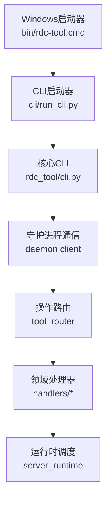
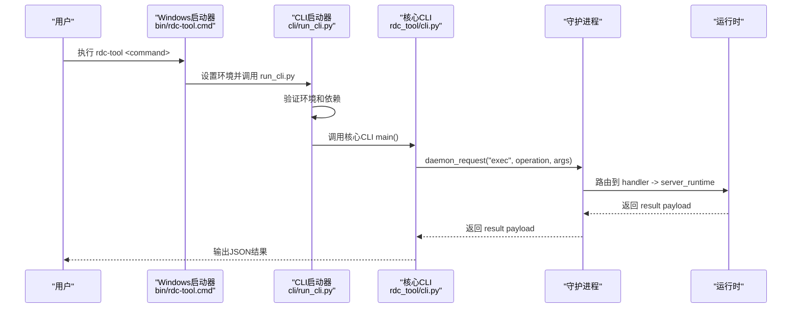

# CLI参考手册

<cite>
**本文引用的文件**
- [bin/rdc-tool.cmd](file://bin/rdc-tool.cmd)
- [cli/run_cli.py](file://cli/run_cli.py)
- [rdc_tool/cli.py](file://rdc_tool/cli.py)
- [install.cmd](file://install.cmd)
- [scripts/rdc_tool_install.ps1](file://scripts/rdc_tool_install.ps1)
- [README.md](file://README.md)
- [tests/test_cli_launcher.py](file://tests/test_cli_launcher.py)
</cite>

## 更新摘要
**所做更改**
- 更新了CLI入口点从rdx到rdc-tool的迁移说明
- 更新了所有命令示例和引用，使用新的rdc-tool命令
- 更新了Windows启动器脚本路径和配置
- 更新了安装和部署相关的命令示例
- 修正了所有文档中的命令引用以保持一致性

## 目录
1. [简介](#简介)
2. [项目结构](#项目结构)
3. [核心组件](#核心组件)
4. [架构总览](#架构总览)
5. [详细命令参考](#详细命令参考)
6. [依赖关系与执行顺序](#依赖关系与执行顺序)
7. [性能与输出格式](#性能与输出格式)
8. [故障排查](#故障排查)
9. [结论](#结论)
10. [附录：常用工作流示例](#附录：常用工作流示例)

## 简介
本手册面向使用 rdc-tool 命令行工具的用户，提供完整的命令参考、参数说明、返回值约定、错误处理策略、JSON/TSV 输出格式说明、命令间依赖关系与执行顺序、以及命令补全配置方法。文档内容严格基于仓库中的实际实现与结构化操作目录生成。

**重要更新**：CLI入口点已从`rdx`迁移到`rdc-tool`。Windows平台现在使用`bin/rdc-tool.cmd`作为主要命令行接口，替代了之前的`bin/rdx.cmd`。所有CLI命令和引用都已相应更新。

## 项目结构
rdc-tool 的 CLI 由启动器与主解析器组成：
- **Windows启动器**：`bin/rdc-tool.cmd`负责环境初始化、Python运行时检查和版本快速输出，并委托给主CLI。
- **主CLI解析器**：`cli/run_cli.py`负责参数解析、子命令分发、与守护进程通信、结果渲染（JSON/TSV）。
- **核心CLI模块**：`rdc_tool/cli.py`提供完整的命令实现和功能。
- 操作路由将 rd.* 操作按命名空间分派到对应处理器模块，再由运行时调度具体实现。



**图示来源**
- [bin/rdc-tool.cmd:1-12](file://bin/rdc-tool.cmd#L1-L12)
- [cli/run_cli.py:16-63](file://cli/run_cli.py#L16-L63)
- [cli/run_cli.py:227-298](file://cli/run_cli.py#L227-L298)
- [rdc_tool/cli.py:62-106](file://rdc_tool/cli.py#L62-L106)

**章节来源**
- [bin/rdc-tool.cmd:1-12](file://bin/rdc-tool.cmd#L1-L12)
- [cli/run_cli.py:16-63](file://cli/run_cli.py#L16-L63)
- [cli/run_cli.py:227-298](file://cli/run_cli.py#L227-L298)
- [rdc_tool/cli.py:62-106](file://rdc_tool/cli.py#L62-L106)

## 核心组件
- **Windows启动器**：`bin/rdc-tool.cmd`检测Python环境、设置环境变量、调用Python CLI。
- **CLI启动器**：`cli/run_cli.py`负责环境验证、依赖检查、版本输出，然后调用核心CLI。
- **核心CLI**：`rdc_tool/cli.py`构建参数解析树，分发子命令；统一封装 JSON 输出与 TSV 投影；管理上下文与守护进程状态。
- 操作路由：根据 catalog 注册 rd.* 操作，校验参数、强制先决条件，再调用领域处理器。
- 领域处理器：各模块（capture、session、event、resource、pipeline、shader 等）仅做轻量转发至运行时。

**章节来源**
- [bin/rdc-tool.cmd:1-12](file://bin/rdc-tool.cmd#L1-L12)
- [cli/run_cli.py:66-84](file://cli/run_cli.py#L66-L84)
- [cli/run_cli.py:227-298](file://cli/run_cli.py#L227-L298)
- [rdc_tool/cli.py:54-125](file://rdc_tool/cli.py#L54-L125)

## 架构总览
rdc-tool 采用"启动器 + CLI + 守护进程 + 运行时"的分层架构。Windows平台通过`bin/rdc-tool.cmd`启动，该脚本负责环境准备和Python运行时检查，然后调用`cli/run_cli.py`，最终进入核心CLI模块执行具体命令。



**图示来源**
- [bin/rdc-tool.cmd:1-12](file://bin/rdc-tool.cmd#L1-L12)
- [cli/run_cli.py:227-298](file://cli/run_cli.py#L227-L298)
- [rdc_tool/cli.py:1381-1769](file://rdc_tool/cli.py#L1381-L1769)

## 详细命令参考

### 全局选项
- --json：启用机器可读的 JSON 输出。
- --daemon-context <id>：指定守护进程状态命名空间（默认 default）。
- --version：打印版本信息。

**章节来源**
- [rdc_tool/cli.py:1381-1387](file://rdc_tool/cli.py#L1381-L1387)

### version
- 用途：打印工具版本与公共契约元数据。
- 选项：--json。
- 输出：人类可读文本或 JSON 信封。
- 退出码：成功为 0。

**章节来源**
- [cli/run_cli.py:165-197](file://cli/run_cli.py#L165-L197)
- [rdc_tool/cli.py:559-564](file://rdc_tool/cli.py#L559-L564)

### doctor
- 用途：验证 CLI 运行时环境是否完整（依赖、Python、RenderDoc、catalog、launchers、daemon 状态等）。
- 选项：--json（内部隐藏）。
- 输出：诊断详情 JSON。
- 退出码：环境不完整时非零。

**章节来源**
- [cli/run_cli.py:200-224](file://cli/run_cli.py#L200-L224)
- [rdc_tool/cli.py:410-532](file://rdc_tool/cli.py#L410-L532)

### tools
- list：列出 catalog 中定义的 rd.* 工具，支持 --full、--namespace、--limit。
- search：搜索工具，支持 --query、--limit。
- describe：描述某个 rd.* 操作的 schema 与契约。
- 输出：JSON。

**章节来源**
- [rdc_tool/cli.py:694-750](file://rdc_tool/cli.py#L694-L750)
- [rdc_tool/cli.py:1404-1417](file://rdc_tool/cli.py#L1404-L1417)

### daemon
- start：启动守护进程，支持 --pipe-name。
- stop：停止守护进程。
- status：查询守护进程状态。
- attach/heartbeat/detach/cleanup：内部客户端生命周期管理。
- 输出：JSON。

**章节来源**
- [rdc_tool/cli.py:1634-1684](file://rdc_tool/cli.py#L1634-L1684)
- [rdc_tool/cli.py:1419-1435](file://rdc_tool/cli.py#L1419-L1435)

### context
- status：打印当前运行时上下文快照。
- update：更新 agent-facing 字段（notes、focus_pixel、focus_resource_id、focus_shader_id）。
- list：列出已知 daemon contexts。
- clear：清理隔离上下文及其运行时状态。
- 输出：JSON。

**章节来源**
- [rdc_tool/cli.py:780-800](file://rdc_tool/cli.py#L780-L800)
- [rdc_tool/cli.py:1686-1714](file://rdc_tool/cli.py#L1686-L1714)
- [rdc_tool/cli.py:1437-1448](file://rdc_tool/cli.py#L1437-L1448)

### call
- 用途：调用任意 rd.* 操作。
- 参数：
  - operation：目标操作名（如 rd.capture.open_file）。
  - --args-json/--args-file：二选一传入参数对象（JSON 字符串或文件路径），二者互斥。
  - --format：json 或 tsv（当工具支持 tabular projection 时才可用）。
  - --remote：标记远程模式。
- 输出：JSON 或 TSV（受工具支持限制）。
- 错误：不支持 TSV 投影时返回结构化错误。

**章节来源**
- [rdc_tool/cli.py:867-885](file://rdc_tool/cli.py#L867-L885)
- [rdc_tool/cli.py:1450-1456](file://rdc_tool/cli.py#L1450-L1456)

### batch
- 用途：执行JSONL格式的只读操作批处理，遇到第一个失败立即停止。
- 参数：
  - source：JSONL文件路径，每行包含 {"operation": "操作名", "args": {参数}} 格式。
  - --remote：标记远程模式。
- 输入格式：JSON Lines (JSONL)，每行一个操作请求。
- 输出格式：每行一个JSON响应，包含操作结果和元数据。
- 行为特性：
  - 顺序执行：按文件顺序逐行处理。
  - 只读限制：仅允许 effects 为 read-only 的操作（replay_position, replay_position_temporary）。
  - 参数验证：在执行前验证操作定义和参数。
  - 错误处理：单个操作失败不影响已完成的后续行输出。
  - 中断支持：支持SIGINT中断，等待当前操作完成后停止。
- 退出码：
  - 0：所有操作成功完成。
  - 1：遇到第一个失败的操作。
  - 2：输入文件读取失败。
  - 130：被信号中断。

**章节来源**
- [rdc_tool/cli.py:1459-1461](file://rdc_tool/cli.py#L1459-L1461)
- [rdc_tool/cli.py:1721-1723](file://rdc_tool/cli.py#L1721-L1723)

### capture
- open：打开捕获文件并创建 Replay Session，可选设置帧索引、artifact 目录、远程句柄、预览窗口。
  - 选项：--file、--frame-index、--artifact-dir、--remote-id、--preview。
  - 流程：init → open_file → open_replay → set_frame → get_context → (可选) open_preview。
  - 输出：包含 capture_file_id、session_id、active_event_id、recovery_status、backend 等信息的 JSON。
- status：查看当前捕获会话状态。
- 错误：每一步失败均会包装为结构化错误，附带上下文与恢复提示。

**章节来源**
- [rdc_tool/cli.py:1042-1171](file://rdc_tool/cli.py#L1042-L1171)
- [rdc_tool/cli.py:1174-1194](file://rdc_tool/cli.py#L1174-L1194)
- [rdc_tool/cli.py:1458-1470](file://rdc_tool/cli.py#L1458-L1470)

### session
- preview on/off/status：控制预览窗口开关与状态。
- 选项：--session-id（on 时可选）。
- 输出：JSON。

**章节来源**
- [rdc_tool/cli.py:1197-1271](file://rdc_tool/cli.py#L1197-L1271)
- [rdc_tool/cli.py:1472-1479](file://rdc_tool/cli.py#L1472-L1479)

### vfs
- ls/cat/resolve/tree：只读 VFS 导航辅助。
- 选项：--path、--session-id、--depth、--max-nodes、--format（ls/tree 支持 tsv）。
- 输出：JSON 或 TSV（仅限支持的子命令）。

**章节来源**
- [rdc_tool/cli.py:888-900](file://rdc_tool/cli.py#L888-L900)
- [rdc_tool/cli.py:1484-1496](file://rdc_tool/cli.py#L1484-L1496)

### event（facade）
- list：列出事件动作（映射到 rd.event.get_action_tree）。
- show：显示事件动作详情（映射到 rd.event.get_action_details）。
- 选项：--session-id、--event-id（show 必需）、--format（list 支持 tsv）。
- 输出：JSON 或 TSV（list 支持）。

**章节来源**
- [rdc_tool/cli.py:953-961](file://rdc_tool/cli.py#L953-L961)
- [rdc_tool/cli.py:1498-1506](file://rdc_tool/cli.py#L1498-L1506)

### pipeline（facade）
- show：显示管线摘要（映射到 rd.pipeline.get_state，detail=summary）。
- section：显示某 shader stage 的管线段（映射到 rd.pipeline.get_stage_state）。
- 选项：--session-id、--event-id、--stage（section 必需）、--format。
- 输出：JSON（TSV 不受支持）。

**章节来源**
- [rdc_tool/cli.py:963-972](file://rdc_tool/cli.py#L963-L972)
- [rdc_tool/cli.py:1508-1518](file://rdc_tool/cli.py#L1508-L1518)

### shader（facade）
- source：获取源码或 fallback（映射到 rd.shader.get_source）。
- disasm：获取反汇编（映射到 rd.shader.get_disassembly）。
- constants：获取常量缓冲内容（映射到 rd.shader.get_constant_buffer_contents）。
- 选项：--session-id、--event-id、--stage（必需）、--slot（constants 必需）、--format。
- 输出：JSON（TSV 不受支持）。

**章节来源**
- [rdc_tool/cli.py:974-983](file://rdc_tool/cli.py#L974-L983)
- [rdc_tool/cli.py:1520-1536](file://rdc_tool/cli.py#L1520-L1536)

### export（facade）
- screenshot：导出截图（映射到 rd.export.screenshot）。
- texture/buffer/mesh：导出纹理/缓冲/网格（分别映射到相应导出工具）。
- 选项：--session-id、--event-id、--out（必需）、--resource-id（texture/buffer 必需）、--format。
- 输出：JSON（TSV 不受支持）。

**章节来源**
- [rdc_tool/cli.py:985-997](file://rdc_tool/cli.py#L985-L997)
- [rdc_tool/cli.py:1538-1555](file://rdc_tool/cli.py#L1538-L1555)

### pixel（facade）
- value/history：读取像素值或历史（分别映射到 rd.texture.get_pixel_value / rd.texture.get_pixel_history）。
- 选项：--session-id、--event-id、--resource-id、--x、--y、--format。
- 输出：JSON（TSV 不受支持）。

**章节来源**
- [rdc_tool/cli.py:999-1010](file://rdc_tool/cli.py#L999-L1010)
- [rdc_tool/cli.py:1557-1566](file://rdc_tool/cli.py#L1557-L1566)

### resource（facade）
- list：列出资源（映射到 rd.resource.list_all）。
- show/usage：显示资源详情或使用情况（映射到 rd.resource.get_details / rd.resource.get_usage）。
- 选项：--session-id、--resource-id（show/usage 必需）、--format（list 支持 tsv）。
- 输出：JSON 或 TSV（list 支持）。

**章节来源**
- [rdc_tool/cli.py:1012-1019](file://rdc_tool/cli.py#L1012-L1019)
- [rdc_tool/cli.py:1568-1577](file://rdc_tool/cli.py#L1568-L1577)

### diff
- pipeline：对比两个事件的管线状态差异，支持 --fail-on-diff。
- image：对比两张图片，支持 --out、--threshold。
- 输出：JSON。

**章节来源**
- [rdc_tool/cli.py:1274-1310](file://rdc_tool/cli.py#L1274-L1310)
- [rdc_tool/cli.py:1579-1590](file://rdc_tool/cli.py#L1579-L1590)

### assert
- pipeline：断言管线差异，支持 --max-changes。
- image：断言图像指标，支持 --mse-max、--max-abs-max、--psnr-min。
- 输出：JSON。

**章节来源**
- [rdc_tool/cli.py:1313-1378](file://rdc_tool/cli.py#L1313-L1378)
- [rdc_tool/cli.py:1592-1605](file://rdc_tool/cli.py#L1592-L1605)

### completion
- 用途：生成 shell 补全脚本。
- 参数：shell（powershell|bash|zsh|fish）。
- 输出：脚本文本，可直接在对应 shell 中加载。

**章节来源**
- [rdc_tool/cli.py:644-691](file://rdc_tool/cli.py#L644-691)
- [rdc_tool/cli.py:1481-1482](file://rdc_tool/cli.py#L1481-L1482)

## 依赖关系与执行顺序
- 大多数 rd.* 操作要求存在有效的 session_id 或 capture_file_id，这些通常由 rd.capture.open_file 与 rd.capture.open_replay 建立。
- 某些操作需要 active_event_id（例如事件相关 API），可通过 rd.replay.set_frame 或 rd.event.set_active 设置。
- 远程能力需通过 rd.core.init 启用，并通过 rd.remote.connect 建立连接。
- 操作路由会在执行前校验参数与先决条件，不满足时将返回结构化错误。


**章节来源**
- [rdc_tool/tool_router.py:89-128](file://rdc_tool/tool_router.py#L89-L128)
- [rdc_tool/cli.py:311-327](file://rdc_tool/cli.py#L311-L327)
- [rdc_tool/cli.py:1042-1171](file://rdc_tool/cli.py#L1042-L1171)

## 性能与输出格式
- JSON 输出：所有命令默认输出 JSON 信封，便于程序化处理。
- TSV 输出：仅当命令或底层工具支持 tabular projection 时可用；否则返回结构化错误，建议回退到 JSON。
- 投影转换：当 --format tsv 时，CLI 会将请求转换为带 include_tsv_text 的投影，并在渲染阶段优先输出 TSV 文本；若无则回退为列头+行数据的表格。

**章节来源**
- [rdc_tool/cli.py:330-394](file://rdc_tool/cli.py#L330-L394)

## 故障排查
- 常见错误类型：
  - 缺少依赖：启动器会报告缺失依赖并返回非零退出码。
  - 会话缺失：需要 session_id 的命令在未打开捕获时会返回结构化错误，提示先打开捕获或传递 --session-id。
  - 捕获打开失败：open_file/open_replay/set_frame 任一失败都会包装为结构化错误，包含失败步骤、上下文快照与恢复提示。
  - 不支持 TSV：当命令或工具不支持 tabular projection 时，返回 projection_not_supported 或 tabular_projection_missing。
- 恢复建议：
  - 使用 `rdc-tool doctor` 检查环境完整性。
  - 使用 `rdc-tool context clear` 清理异常上下文后再重试。
  - 对于捕获打开失败，检查 failed_step 与 source_error_details，必要时重启守护进程或重新打开捕获。

**章节来源**
- [cli/run_cli.py:239-254](file://cli/run_cli.py#L239-L254)
- [rdc_tool/cli.py:802-814](file://rdc_tool/cli.py#L802-L814)
- [rdc_tool/cli.py:817-864](file://rdc_tool/cli.py#L817-L864)
- [rdc_tool/cli.py:926-941](file://rdc_tool/cli.py#L926-L941)

## 结论
rdc-tool CLI 提供了统一的入口来管理与调试捕获文件、回放会话、事件、管线、着色器、资源与导出等功能。通过结构化 catalog 与操作路由，CLI 能够保证参数校验与先决条件检查的一致性；同时提供 JSON/TSV 两种输出格式，便于人类阅读与自动化集成。遵循本手册中的命令与参数规范，可高效完成常见的图形调试与分析任务。

## 附录：常用工作流示例
以下示例展示典型操作流程与命令组合（使用新的 rdc-tool 命令）：

### 基本命令
- 查看版本与环境：
  ```bash
  rdc-tool --version
  rdc-tool --json version
  rdc-tool --json doctor
  ```

- 启动守护进程与上下文管理：
  ```bash
  rdc-tool daemon start --daemon-context local
  rdc-tool context status --daemon-context local --json
  rdc-tool context update --daemon-context local --key notes --value triaged --json
  rdc-tool context clear --daemon-context local
  ```

- 打开捕获并进入回放：
  ```bash
  rdc-tool capture open --file D:\path\capture.rdc --frame-index 0 --preview
  ```

- 会话预览控制：
  ```bash
  rdc-tool session preview on
  ```

### 高级功能
- 直接调用 rd.* 操作：
  ```bash
  rdc-tool call rd.session.get_context --args-file .\args.json --format json
  ```

- 浏览事件与资源（支持 TSV）：
  ```bash
  rdc-tool vfs ls --path / --format tsv
  rdc-tool event list --format tsv
  rdc-tool resource list --format tsv
  ```

- 管线与着色器检查：
  ```bash
  rdc-tool pipeline show --event-id 42
  rdc-tool shader source --event-id 42 --stage ps
  ```

- 导出功能：
  ```bash
  rdc-tool export screenshot --event-id 42 --out .\frame.png
  ```

### 批处理工作流
- 执行JSONL批处理：
  ```bash
  rdc-tool batch ./operations.jsonl
  rdc-tool batch ./operations.jsonl --remote
  ```

- 创建JSONL文件示例：
  ```json
  {"operation": "rd.event.get_action_details", "args": {"session_id": "sess_123", "event_id": 42}}
  {"operation": "rd.resource.list_all", "args": {"session_id": "sess_123"}}
  {"operation": "rd.pipeline.get_state", "args": {"session_id": "sess_123", "event_id": 42}}
  ```

### 安装和部署
- Windows安装：
  ```bash
  install.cmd
  rdc-tool --json doctor
  ```

- 生成Shell补全：
  ```bash
  rdc-tool completion powershell
  rdc-tool completion bash
  rdc-tool completion zsh
  rdc-tool completion fish
  ```

注意：以上示例来源于帮助信息与命令定义，具体行为以实际实现为准。所有命令现在都使用 `rdc-tool` 作为入口点，不再使用旧的 `rdx` 命令。

**章节来源**
- [README.md:17-33](file://README.md#L17-L33)
- [cli/run_cli.py:86-119](file://cli/run_cli.py#L86-L119)
- [rdc_tool/cli.py:62-106](file://rdc_tool/cli.py#L62-L106)
- [tests/test_cli_launcher.py:84-155](file://tests/test_cli_launcher.py#L84-L155)