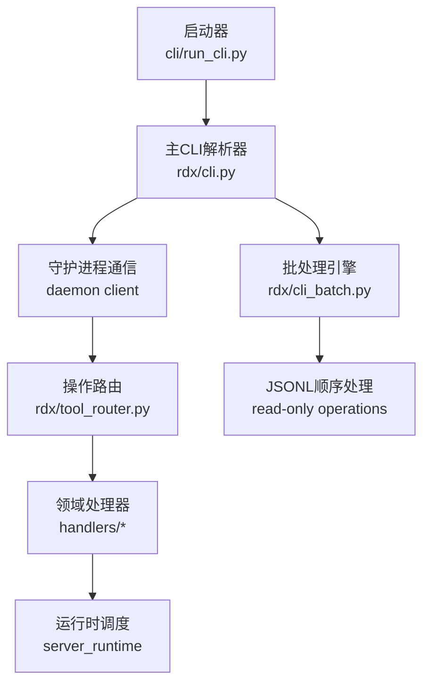
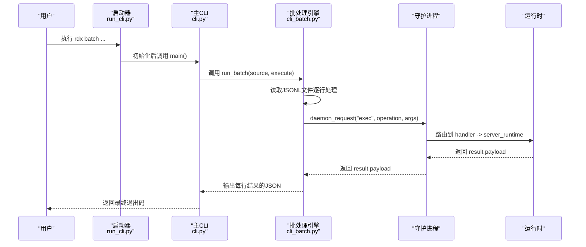
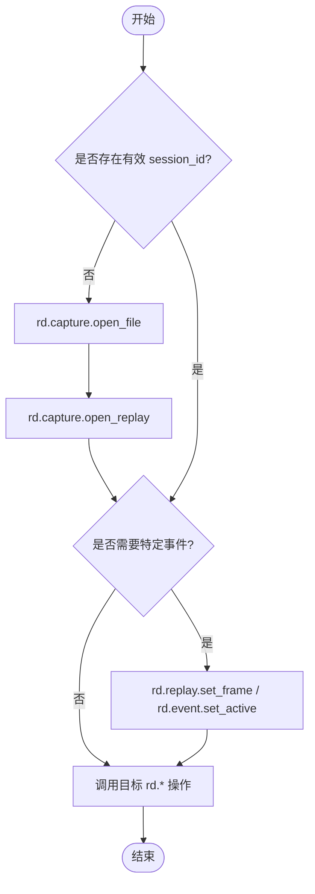

# CLI参考手册

<cite>
**本文引用的文件**
- [cli.py](file://rdx/cli.py)
- [run_cli.py](file://cli/run_cli.py)
- [tool_router.py](file://rdx/tool_router.py)
- [capture.py](file://rdx/handlers/capture.py)
- [session.py](file://rdx/handlers/session.py)
- [event.py](file://rdx/handlers/event.py)
- [resource.py](file://rdx/handlers/resource.py)
- [pipeline.py](file://rdx/handlers/pipeline.py)
- [shader.py](file://rdx/handlers/shader.py)
- [cli_batch.py](file://rdx/cli_batch.py)
- [test_cli_batch.py](file://tests/test_cli_batch.py)
- [runtime_catalog.py](file://rdx/runtime_catalog.py)
- [tool-reference.md](file://docs/tool-reference.md)
- [tool_catalog.json](file://spec/tool_catalog.json)
</cite>

## 更新摘要
**所做更改**
- 新增批处理命令（batch）完整参考文档
- 添加JSONL顺序处理接口的详细说明
- 更新错误处理和退出码说明
- 增强故障排查章节以包含批处理相关错误
- 添加批处理工作流示例

## 目录
1. [简介](#简介)
2. [项目结构](#项目结构)
3. [核心组件](#核心组件)
4. [架构总览](#架构总览)
5. [详细命令参考](#详细命令参考)
6. [依赖关系与执行顺序](#依赖关系与执行顺序)
7. [性能与输出格式](#性能与输出格式)
8. [故障排查](#故障排查)
9. [结论](#结论)
10. [附录：常用工作流示例](#附录：常用工作流示例)

## 简介
本手册面向使用 rdx 命令行工具的用户，提供完整的命令参考、参数说明、返回值约定、错误处理策略、JSON/TSV 输出格式说明、命令间依赖关系与执行顺序、以及命令补全配置方法。文档内容严格基于仓库中的实际实现与结构化操作目录生成。

## 项目结构
rdx 的 CLI 由启动器与主解析器组成：
- 启动器负责环境初始化、依赖检查、版本快速输出，并委托给主 CLI。
- 主 CLI 负责参数解析、子命令分发、与守护进程通信、结果渲染（JSON/TSV）。
- 操作路由将 rd.* 操作按命名空间分派到对应处理器模块，再由运行时调度具体实现。
- **新增** 批处理模块提供顺序JSONL接口用于只读操作的批量处理。



**图示来源**
- [run_cli.py:226-282](file://cli/run_cli.py#L226-L282)
- [cli.py:1381-1769](file://rdx/cli.py#L1381-L1769)
- [tool_router.py:131-154](file://rdx/tool_router.py#L131-L154)
- [cli_batch.py:17-62](file://rdx/cli_batch.py#L17-L62)

**章节来源**
- [run_cli.py:16-63](file://cli/run_cli.py#L16-L63)
- [run_cli.py:226-282](file://cli/run_cli.py#L226-L282)
- [cli.py:1381-1769](file://rdx/cli.py#L1381-L1769)
- [tool_router.py:1-156](file://rdx/tool_router.py#L1-L156)
- [cli_batch.py:1-62](file://rdx/cli_batch.py#L1-L62)

## 核心组件
- 启动器：检测依赖、打印版本、初始化运行环境，然后调用主 CLI。
- 主 CLI：构建参数解析树，分发子命令；统一封装 JSON 输出与 TSV 投影；管理上下文与守护进程状态。
- 操作路由：根据 catalog 注册 rd.* 操作，校验参数、强制先决条件，再调用领域处理器。
- 领域处理器：各模块（capture、session、event、resource、pipeline、shader 等）仅做轻量转发至运行时。
- **新增** 批处理引擎：提供顺序JSONL接口，支持只读操作的批量处理，具备错误恢复和中断处理能力。

**章节来源**
- [run_cli.py:226-282](file://cli/run_cli.py#L226-L282)
- [cli.py:54-125](file://rdx/cli.py#L54-L125)
- [cli.py:330-394](file://rdx/cli.py#L330-L394)
- [tool_router.py:34-57](file://rdx/tool_router.py#L34-L57)
- [tool_router.py:89-154](file://rdx/tool_router.py#L89-L154)
- [capture.py:8-9](file://rdx/handlers/capture.py#L8-L9)
- [session.py:8-12](file://rdx/handlers/session.py#L8-L12)
- [event.py:8-9](file://rdx/handlers/event.py#L8-L9)
- [resource.py:8-9](file://rdx/handlers/resource.py#L8-L9)
- [pipeline.py:8-9](file://rdx/handlers/pipeline.py#L8-L9)
- [shader.py:8-9](file://rdx/handlers/shader.py#L8-L9)
- [cli_batch.py:14-62](file://rdx/cli_batch.py#L14-L62)

## 架构总览
rdx 采用"CLI + 守护进程 + 运行时"的分层架构。CLI 通过守护进程执行 rd.* 操作，所有业务逻辑在运行时中实现。操作路由依据 catalog 进行参数校验与先决条件检查，确保调用安全与一致性。**新增** 批处理功能提供独立的顺序处理管道，专门用于只读操作的批量执行。



**图示来源**
- [run_cli.py:226-282](file://cli/run_cli.py#L226-L282)
- [cli.py:1721-1723](file://rdx/cli.py#L1721-L1723)
- [cli_batch.py:17-62](file://rdx/cli_batch.py#L17-L62)
- [tool_router.py:131-154](file://rdx/tool_router.py#L131-L154)

## 详细命令参考

### 全局选项
- --json：启用机器可读的 JSON 输出。
- --daemon-context <id>：指定守护进程状态命名空间（默认 default）。
- --version：打印版本信息。

**章节来源**
- [cli.py:1381-1387](file://rdx/cli.py#L1381-L1387)

### version
- 用途：打印工具版本与公共契约元数据。
- 选项：--json。
- 输出：人类可读文本或 JSON 信封。
- 退出码：成功为 0。

**章节来源**
- [cli.py:559-564](file://rdx/cli.py#L559-L564)
- [cli.py:1398-1399](file://rdx/cli.py#L1398-L1399)

### doctor
- 用途：验证 CLI 运行时环境是否完整（依赖、Python、RenderDoc、catalog、launchers、daemon 状态等）。
- 选项：--json（内部隐藏）。
- 输出：诊断详情 JSON。
- 退出码：环境不完整时非零。

**章节来源**
- [cli.py:410-532](file://rdx/cli.py#L410-L532)
- [cli.py:1401-1402](file://rdx/cli.py#L1401-L1402)

### tools
- list：列出 catalog 中定义的 rd.* 工具，支持 --full、--namespace、--limit。
- search：搜索工具，支持 --query、--limit。
- describe：描述某个 rd.* 操作的 schema 与契约。
- 输出：JSON。

**章节来源**
- [cli.py:694-750](file://rdx/cli.py#L694-L750)
- [cli.py:1404-1417](file://rdx/cli.py#L1404-L1417)

### daemon
- start：启动守护进程，支持 --pipe-name。
- stop：停止守护进程。
- status：查询守护进程状态。
- attach/heartbeat/detach/cleanup：内部客户端生命周期管理。
- 输出：JSON。

**章节来源**
- [cli.py:1634-1684](file://rdx/cli.py#L1634-L1684)
- [cli.py:1419-1435](file://rdx/cli.py#L1419-L1435)

### context
- status：打印当前运行时上下文快照。
- update：更新 agent-facing 字段（notes、focus_pixel、focus_resource_id、focus_shader_id）。
- list：列出已知 daemon contexts。
- clear：清理隔离上下文及其运行时状态。
- 输出：JSON。

**章节来源**
- [cli.py:780-800](file://rdx/cli.py#L780-L800)
- [cli.py:1686-1714](file://rdx/cli.py#L1686-L1714)
- [cli.py:1437-1448](file://rdx/cli.py#L1437-L1448)

### call
- 用途：调用任意 rd.* 操作。
- 参数：
  - operation：目标操作名（如 rd.capture.open_file）。
  - --args-json/--args-file：二选一传入参数对象（JSON 字符串或文件路径），二者互斥。
  - --format：json 或 tsv（当工具支持 tabular projection 时才可用）。
  - --remote：标记远程模式。
- 输出：JSON 或 TSV（受工具支持限制）。
- 错误：不支持 TSV 投影时返回结构化错误。

**章节来源**
- [cli.py:867-885](file://rdx/cli.py#L867-L885)
- [cli.py:1450-1456](file://rdx/cli.py#L1450-L1456)

### batch
- 用途：执行JSONL格式的只读操作批处理，遇到第一个失败立即停止。
- 参数：
  - source：JSONL文件路径，每行包含 {"operation": "操作名", "args": {参数}} 格式。
  - --remote：标记远程模式。
- 输入格式：JSON Lines (JSONL)，每行一个操作请求。
- 输出格式：每行一个JSON响应，包含操作结果和元数据。
- 行为特性：
  - 顺序执行：按文件顺序逐行处理。
  - 只读限制：仅允许 effects 为 read-only 的操作（replay_position, replay_position_temporary）。
  - 参数验证：在执行前验证操作定义和参数。
  - 错误处理：单个操作失败不影响已完成的后续行输出。
  - 中断支持：支持SIGINT中断，等待当前操作完成后停止。
- 退出码：
  - 0：所有操作成功完成。
  - 1：遇到第一个失败的操作。
  - 2：输入文件读取失败。
  - 130：被信号中断。

**章节来源**
- [cli.py:1459-1461](file://rdx/cli.py#L1459-L1461)
- [cli.py:1721-1723](file://rdx/cli.py#L1721-L1723)
- [cli_batch.py:14-62](file://rdx/cli_batch.py#L14-L62)
- [test_cli_batch.py:19-84](file://tests/test_cli_batch.py#L19-L84)

### capture
- open：打开捕获文件并创建 Replay Session，可选设置帧索引、artifact 目录、远程句柄、预览窗口。
  - 选项：--file、--frame-index、--artifact-dir、--remote-id、--preview。
  - 流程：init → open_file → open_replay → set_frame → get_context → (可选) open_preview。
  - 输出：包含 capture_file_id、session_id、active_event_id、recovery_status、backend 等信息的 JSON。
- status：查看当前捕获会话状态。
- 错误：每一步失败均会包装为结构化错误，附带上下文与恢复提示。

**章节来源**
- [cli.py:1042-1171](file://rdx/cli.py#L1042-L1171)
- [cli.py:1174-1194](file://rdx/cli.py#L1174-L1194)
- [cli.py:1458-1470](file://rdx/cli.py#L1458-L1470)

### session
- preview on/off/status：控制预览窗口开关与状态。
- 选项：--session-id（on 时可选）。
- 输出：JSON。

**章节来源**
- [cli.py:1197-1271](file://rdx/cli.py#L1197-L1271)
- [cli.py:1472-1479](file://rdx/cli.py#L1472-L1479)

### vfs
- ls/cat/resolve/tree：只读 VFS 导航辅助。
- 选项：--path、--session-id、--depth、--max-nodes、--format（ls/tree 支持 tsv）。
- 输出：JSON 或 TSV（仅限支持的子命令）。

**章节来源**
- [cli.py:888-900](file://rdx/cli.py#L888-L900)
- [cli.py:1484-1496](file://rdx/cli.py#L1484-L1496)

### event（facade）
- list：列出事件动作（映射到 rd.event.get_action_tree）。
- show：显示事件动作详情（映射到 rd.event.get_action_details）。
- 选项：--session-id、--event-id（show 必需）、--format（list 支持 tsv）。
- 输出：JSON 或 TSV（list 支持）。

**章节来源**
- [cli.py:953-961](file://rdx/cli.py#L953-L961)
- [cli.py:1498-1506](file://rdx/cli.py#L1498-L1506)

### pipeline（facade）
- show：显示管线摘要（映射到 rd.pipeline.get_state，detail=summary）。
- section：显示某 shader stage 的管线段（映射到 rd.pipeline.get_stage_state）。
- 选项：--session-id、--event-id、--stage（section 必需）、--format。
- 输出：JSON（TSV 不受支持）。

**章节来源**
- [cli.py:963-972](file://rdx/cli.py#L963-L972)
- [cli.py:1508-1518](file://rdx/cli.py#L1508-L1518)

### shader（facade）
- source：获取源码或 fallback（映射到 rd.shader.get_source）。
- disasm：获取反汇编（映射到 rd.shader.get_disassembly）。
- constants：获取常量缓冲内容（映射到 rd.shader.get_constant_buffer_contents）。
- 选项：--session-id、--event-id、--stage（必需）、--slot（constants 必需）、--format。
- 输出：JSON（TSV 不受支持）。

**章节来源**
- [cli.py:974-983](file://rdx/cli.py#L974-L983)
- [cli.py:1520-1536](file://rdx/cli.py#L1520-L1536)

### export（facade）
- screenshot：导出截图（映射到 rd.export.screenshot）。
- texture/buffer/mesh：导出纹理/缓冲/网格（分别映射到相应导出工具）。
- 选项：--session-id、--event-id、--out（必需）、--resource-id（texture/buffer 必需）、--format。
- 输出：JSON（TSV 不受支持）。

**章节来源**
- [cli.py:985-997](file://rdx/cli.py#L985-L997)
- [cli.py:1538-1555](file://rdx/cli.py#L1538-L1555)

### pixel（facade）
- value/history：读取像素值或历史（分别映射到 rd.texture.get_pixel_value / rd.texture.get_pixel_history）。
- 选项：--session-id、--event-id、--resource-id、--x、--y、--format。
- 输出：JSON（TSV 不受支持）。

**章节来源**
- [cli.py:999-1010](file://rdx/cli.py#L999-L1010)
- [cli.py:1557-1566](file://rdx/cli.py#L1557-L1566)

### resource（facade）
- list：列出资源（映射到 rd.resource.list_all）。
- show/usage：显示资源详情或使用情况（映射到 rd.resource.get_details / rd.resource.get_usage）。
- 选项：--session-id、--resource-id（show/usage 必需）、--format（list 支持 tsv）。
- 输出：JSON 或 TSV（list 支持）。

**章节来源**
- [cli.py:1012-1019](file://rdx/cli.py#L1012-L1019)
- [cli.py:1568-1577](file://rdx/cli.py#L1568-L1577)

### diff
- pipeline：对比两个事件的管线状态差异，支持 --fail-on-diff。
- image：对比两张图片，支持 --out、--threshold。
- 输出：JSON。

**章节来源**
- [cli.py:1274-1310](file://rdx/cli.py#L1274-L1310)
- [cli.py:1579-1590](file://rdx/cli.py#L1579-L1590)

### assert
- pipeline：断言管线差异，支持 --max-changes。
- image：断言图像指标，支持 --mse-max、--max-abs-max、--psnr-min。
- 输出：JSON。

**章节来源**
- [cli.py:1313-1378](file://rdx/cli.py#L1313-L1378)
- [cli.py:1592-1605](file://rdx/cli.py#L1592-L1605)

### completion
- 用途：生成 shell 补全脚本。
- 参数：shell（powershell|bash|zsh|fish）。
- 输出：脚本文本，可直接在对应 shell 中加载。

**章节来源**
- [cli.py:644-691](file://rdx/cli.py#L644-691)
- [cli.py:1481-1482](file://rdx/cli.py#L1481-L1482)

## 依赖关系与执行顺序
- 大多数 rd.* 操作要求存在有效的 session_id 或 capture_file_id，这些通常由 rd.capture.open_file 与 rd.capture.open_replay 建立。
- 某些操作需要 active_event_id（例如事件相关 API），可通过 rd.replay.set_frame 或 rd.event.set_active 设置。
- 远程能力需通过 rd.core.init 启用，并通过 rd.remote.connect 建立连接。
- 操作路由会在执行前校验参数与先决条件，不满足时将返回结构化错误。
- **新增** 批处理命令要求所有操作必须是只读的，effects 必须属于 {replay_position, replay_position_temporary}。



**图示来源**
- [tool_router.py:89-128](file://rdx/tool_router.py#L89-L128)
- [cli.py:311-327](file://rdx/cli.py#L311-L327)
- [cli.py:1042-1171](file://rdx/cli.py#L1042-L1171)

**章节来源**
- [tool_router.py:89-128](file://rdx/tool_router.py#L89-L128)
- [cli.py:311-327](file://rdx/cli.py#L311-L327)
- [cli.py:1042-1171](file://rdx/cli.py#L1042-L1171)

## 性能与输出格式
- JSON 输出：所有命令默认输出 JSON 信封，便于程序化处理。
- TSV 输出：仅当命令或底层工具支持 tabular projection 时可用；否则返回结构化错误，建议回退到 JSON。
- 投影转换：当 --format tsv 时，CLI 会将请求转换为带 include_tsv_text 的投影，并在渲染阶段优先输出 TSV 文本；若无则回退为列头+行数据的表格。
- **新增** 批处理输出：每行一个JSON响应，包含标准结果结构和批处理元数据（index、operation、cancelled等）。

**章节来源**
- [cli.py:330-394](file://rdx/cli.py#L330-L394)
- [cli_batch.py:45-49](file://rdx/cli_batch.py#L45-L49)

## 故障排查
- 常见错误类型：
  - 缺少依赖：启动器会报告缺失依赖并返回非零退出码。
  - 会话缺失：需要 session_id 的命令在未打开捕获时会返回结构化错误，提示先打开捕获或传递 --session-id。
  - 捕获打开失败：open_file/open_replay/set_frame 任一失败都会包装为结构化错误，包含失败步骤、上下文快照与恢复提示。
  - 不支持 TSV：当命令或工具不支持 tabular projection 时，返回 projection_not_supported 或 tabular_projection_missing。
  - **新增** 批处理错误：
    - batch_failed：操作执行失败或参数验证错误。
    - batch_cancelled：批处理被用户中断。
    - batch_input_failed：JSONL文件读取或解析失败。
    - 只读限制：尝试执行非只读操作时返回 validation 类别错误。
- 恢复建议：
  - 使用 rdx doctor 检查环境完整性。
  - 使用 rdx context clear 清理异常上下文后再重试。
  - 对于捕获打开失败，检查 failed_step 与 source_error_details，必要时重启守护进程或重新打开捕获。
  - **新增** 批处理恢复：检查 meta.batch.index 定位失败位置，确认操作是否为只读类型。

**章节来源**
- [run_cli.py:239-254](file://cli/run_cli.py#L239-L254)
- [cli.py:802-814](file://rdx/cli.py#L802-L814)
- [cli.py:817-864](file://rdx/cli.py#L817-L864)
- [cli.py:926-941](file://rdx/cli.py#L926-L941)
- [cli_batch.py:42-59](file://rdx/cli_batch.py#L42-L59)
- [test_cli_batch.py:30-84](file://tests/test_cli_batch.py#L30-L84)

## 结论
rdx CLI 提供了统一的入口来管理与调试捕获文件、回放会话、事件、管线、着色器、资源与导出等功能。通过结构化 catalog 与操作路由，CLI 能够保证参数校验与先决条件检查的一致性；同时提供 JSON/TSV 两种输出格式，便于人类阅读与自动化集成。**新增** 的批处理功能为只读操作提供了高效的顺序处理接口，支持大规模数据分析场景。遵循本手册中的命令与参数规范，可高效完成常见的图形调试与分析任务。

## 附录：常用工作流示例
以下示例展示典型操作流程与命令组合（以 rdx 为例）：
- 查看版本与环境：
  - rdx --version
  - rdx --json version
  - rdx --json doctor
- 启动守护进程与上下文管理：
  - rdx daemon start --daemon-context local
  - rdx context status --daemon-context local --json
  - rdx context update --daemon-context local --key notes --value triaged --json
  - rdx context clear --daemon-context local
- 打开捕获并进入回放：
  - rdx capture open --file D:\path\capture.rdc --frame-index 0 --preview
- 会话预览控制：
  - rdx session preview on
- 直接调用 rd.* 操作：
  - rdx call rd.session.get_context --args-file .\args.json --format json
- **新增** 批处理工作流：
  - rdx batch ./operations.jsonl
  - rdx batch ./operations.jsonl --remote
  - 创建JSONL文件示例：
    ```json
    {"operation": "rd.event.get_action_details", "args": {"session_id": "sess_123", "event_id": 42}}
    {"operation": "rd.resource.list_all", "args": {"session_id": "sess_123"}}
    {"operation": "rd.pipeline.get_state", "args": {"session_id": "sess_123", "event_id": 42}}
    ```
- 浏览事件与资源（支持 TSV）：
  - rdx vfs ls --path / --format tsv
  - rdx event list --format tsv
  - rdx resource list --format tsv
- 管线与着色器检查：
  - rdx pipeline show --event-id 42
  - rdx shader source --event-id 42 --stage ps
- 导出：
  - rdx export screenshot --event-id 42 --out .\frame.png

注意：以上示例来源于帮助信息与命令定义，具体行为以实际实现为准。

**章节来源**
- [cli.py:62-104](file://rdx/cli.py#L62-L104)
- [cli.py:1381-1769](file://rdx/cli.py#L1381-L1769)
- [cli_batch.py:17-62](file://rdx/cli_batch.py#L17-L62)
- [test_cli_batch.py:19-84](file://tests/test_cli_batch.py#L19-L84)