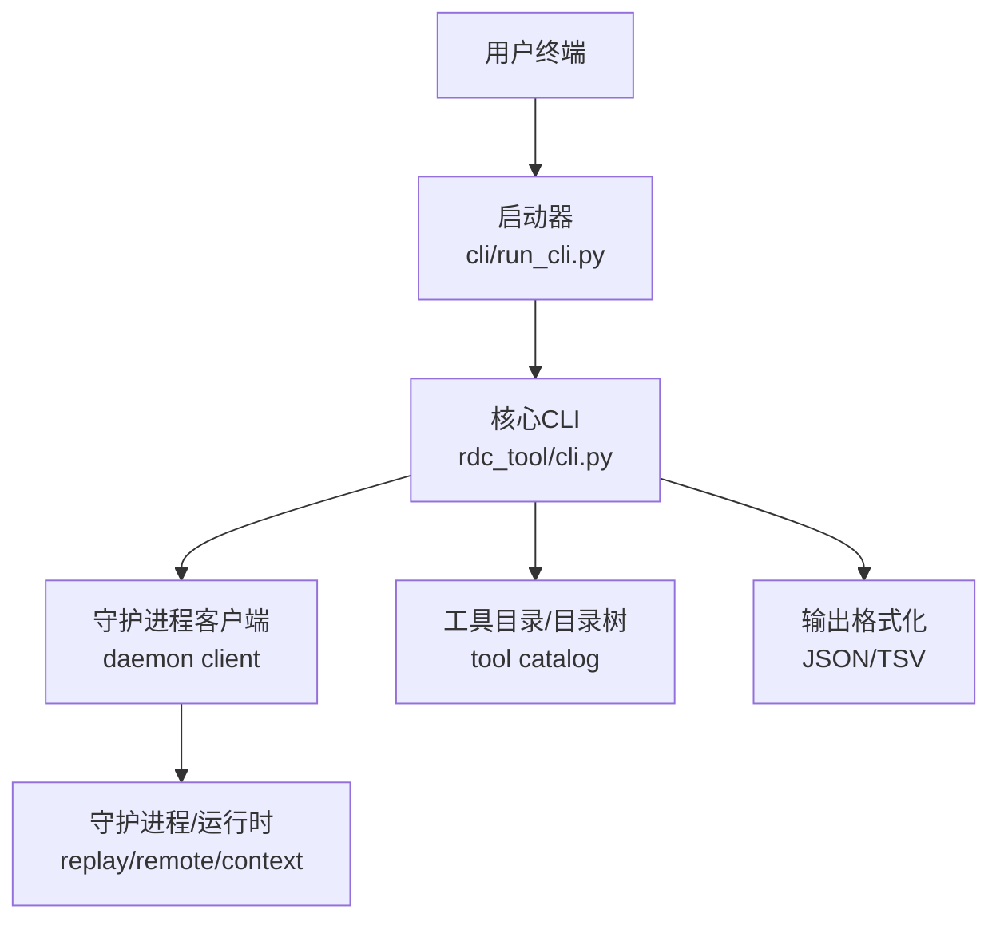
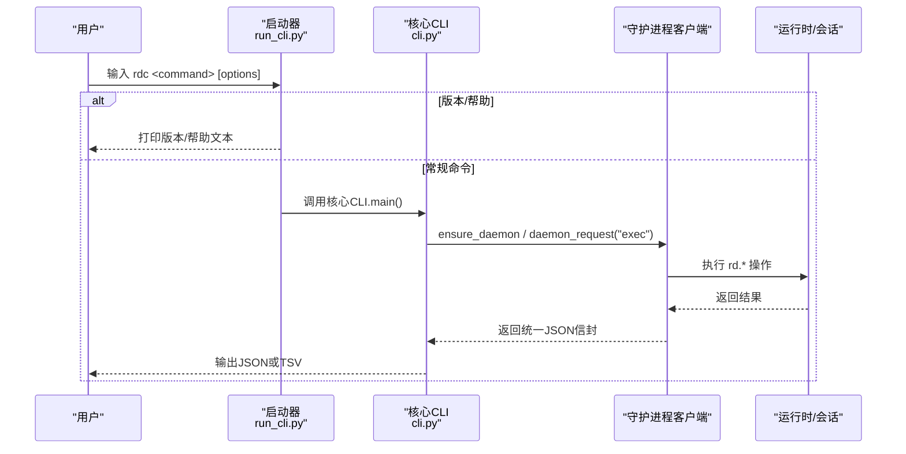
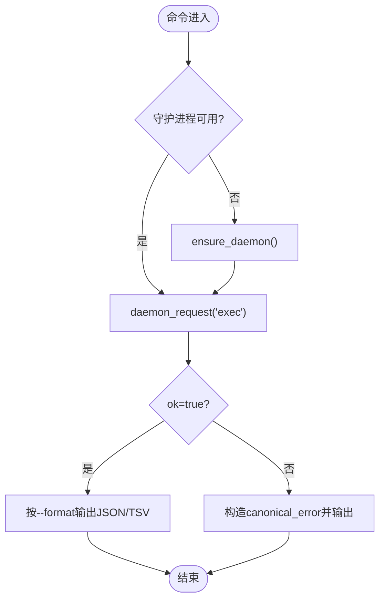
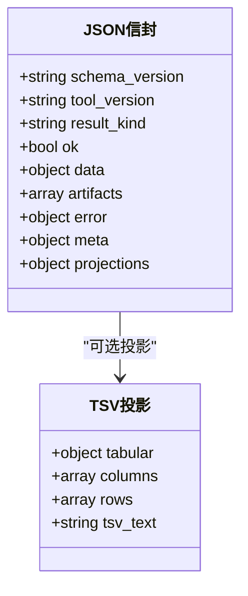
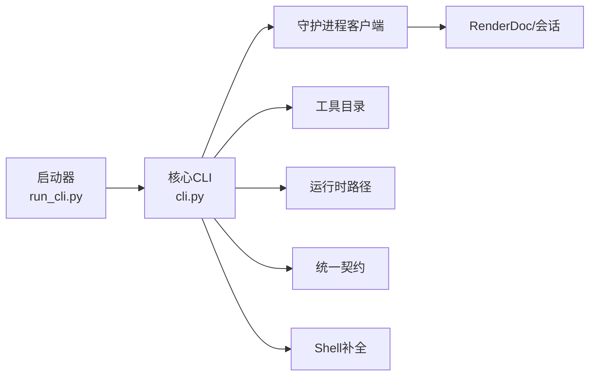

# CLI概览和基础使用

<cite>
**本文引用的文件**
- [cli/run_cli.py](file://cli/run_cli.py)
- [rdc_tool/cli.py](file://rdc_tool/cli.py)
- [README.md](file://README.md)
- [docs/quickstart.md](file://docs/quickstart.md)
- [docs/tool-reference.md](file://docs/tool-reference.md)
- [docs/troubleshooting.md](file://docs/troubleshooting.md)
- [docs/configuration.md](file://docs/configuration.md)
- [rdc_tool/core/contracts.py](file://rdc_tool/core/contracts.py)
</cite>

## 目录
1. [简介](#简介)
2. [项目结构](#项目结构)
3. [核心组件](#核心组件)
4. [架构总览](#架构总览)
5. [详细组件分析](#详细组件分析)
6. [依赖关系分析](#依赖关系分析)
7. [性能注意事项](#性能注意事项)
8. [故障排查指南](#故障排查指南)
9. [结论](#结论)
10. [附录](#附录)

## 简介
本文件面向RDC-Tool的CLI工具“rdc”，提供从入门到快速参考的完整概览。内容涵盖：
- rdc主命令的基本用法、全局选项与参数
- 整体架构，包括守护进程通信机制、JSON输出格式与TSV表格格式的区别
- 如何获取帮助信息、版本信息与运行环境诊断
- 常见操作模式与示例
- 错误处理与退出码含义
- 命令补全功能的配置方法

## 项目结构
rdc-tools采用“启动器 + 核心CLI + 守护进程”的分层设计：
- 启动器：独立入口脚本，负责路径初始化、依赖检查、版本/帮助快速返回，并委派给核心CLI
- 核心CLI：解析参数、选择子命令、与守护进程通信、统一输出JSON或TSV
- 守护进程：承载渲染回放会话、远程连接、上下文状态等长期运行的工作负载

图表来源
- [cli/run_cli.py:16-63](file://cli/run_cli.py#L16-L63)
- [rdc_tool/cli.py:234-264](file://rdc_tool/cli.py#L234-L264)
- [docs/tool-reference.md:1-10](file://docs/tool-reference.md#L1-L10)

章节来源
- [cli/run_cli.py:16-63](file://cli/run_cli.py#L16-L63)
- [rdc_tool/cli.py:234-264](file://rdc_tool/cli.py#L234-L264)
- [docs/tool-reference.md:1-10](file://docs/tool-reference.md#L1-L10)

## 核心组件
- 启动器（cli/run_cli.py）
  - 设置工具根目录与环境变量
  - 快速处理 --version 与 --help
  - 缺失依赖时给出最小化诊断输出
  - 调用核心CLI执行具体命令
- 核心CLI（rdc_tool/cli.py）
  - 定义全局选项：--json、--daemon-context、--session-id、--format、--remote 等
  - 实现子命令：version、doctor、tools、daemon、context、session、capture、vfs、event、pipeline、shader、export、pixel、resource、diff、assert、completion、call
  - 通过守护进程执行 rd.* 操作，统一封装成功/失败响应
  - 支持 JSON 与 TSV 两种输出格式
- 守护进程通信
  - 确保守护进程存在并健康
  - 发送 exec/status/get_state 请求，带超时策略
  - 将结果包装为统一的JSON信封

章节来源
- [cli/run_cli.py:16-63](file://cli/run_cli.py#L16-L63)
- [cli/run_cli.py:226-282](file://cli/run_cli.py#L226-L282)
- [rdc_tool/cli.py:48-104](file://rdc_tool/cli.py#L48-L104)
- [rdc_tool/cli.py:234-264](file://rdc_tool/cli.py#L234-L264)

## 架构总览
rdc命令的执行流程如下：
- 启动器先做轻量检查（版本/帮助/依赖），必要时直接返回
- 若进入核心CLI，则根据子命令路由到对应处理器
- 需要运行时能力的命令会确保守护进程可用，并通过守护进程执行 rd.* 操作
- 所有结果以统一JSON信封输出；列表类命令可切换为TSV投影

图表来源
- [cli/run_cli.py:226-282](file://cli/run_cli.py#L226-L282)
- [rdc_tool/cli.py:234-264](file://rdc_tool/cli.py#L234-L264)

## 详细组件分析

### 全局选项与常用参数
- 全局选项
  - --json：强制输出结构化JSON（便于机器消费）
  - --daemon-context <id>：选择隔离的上下文命名空间（默认 default）
  - --session-id <id>：指定当前会话ID（当未打开捕获时尤为有用）
  - --format json|tsv：控制输出格式（仅部分命令支持TSV）
  - --remote：标记远程相关操作
- 常用参数（随子命令变化）
  - capture open：--file、--frame-index、--preview
  - vfs ls/cat/tree/resolve：--path、--depth、--max-nodes、--projection
  - event list/show：--event-id、--format
  - pipeline show：--event-id、--format
  - shader source/disasm/constants：--event-id、--stage
  - export screenshot/texture/buffer/mesh：--event-id、--out、--file-format
  - pixel value/history：--event-id、--x、--y
  - resource list/show/usage：--format、--resource-id
  - diff pipeline/image：--event-id、--format
  - assert pipeline/image：--event-id、--format
  - completion powershell|bash|zsh|fish：生成Shell补全脚本

章节来源
- [rdc_tool/cli.py:62-104](file://rdc_tool/cli.py#L62-L104)
- [docs/quickstart.md:5-21](file://docs/quickstart.md#L5-L21)
- [docs/tool-reference.md:1-10](file://docs/tool-reference.md#L1-L10)

### 守护进程通信机制
- 启动器在缺少依赖时会提前返回最小化诊断，避免阻塞
- 核心CLI在执行任何需要运行时能力的命令前，会确保守护进程已启动且状态可用
- 通过 daemon_request("exec", ...) 发送操作名与参数，附带 transport="cli" 与 remote 标志
- 对状态查询使用 daemon_request("status"/"get_state")，并在异常时尝试清理残留状态

图表来源
- [rdc_tool/cli.py:234-264](file://rdc_tool/cli.py#L234-L264)
- [rdc_tool/cli.py:267-308](file://rdc_tool/cli.py#L267-L308)

章节来源
- [cli/run_cli.py:226-282](file://cli/run_cli.py#L226-L282)
- [rdc_tool/cli.py:234-264](file://rdc_tool/cli.py#L234-L264)
- [rdc_tool/cli.py:267-308](file://rdc_tool/cli.py#L267-L308)

### JSON输出格式与TSV表格格式
- JSON信封
  - 统一字段：schema_version、tool_version、result_kind、ok、data、artifacts、error、meta、projections
  - 成功时使用 canonical_success，失败时使用 canonical_error
- TSV投影
  - 仅适用于列表/导航类命令（如 vfs ls、event list、resource list）
  - 通过 projection.kind=tabular 与 include_tsv_text 生成列头与行数据
  - 非列表命令仍应使用JSON

图表来源
- [rdc_tool/core/contracts.py:98-164](file://rdc_tool/core/contracts.py#L98-L164)
- [rdc_tool/cli.py:330-394](file://rdc_tool/cli.py#L330-L394)

章节来源
- [rdc_tool/core/contracts.py:98-164](file://rdc_tool/core/contracts.py#L98-L164)
- [rdc_tool/cli.py:330-394](file://rdc_tool/cli.py#L330-L394)
- [docs/troubleshooting.md:43-46](file://docs/troubleshooting.md#L43-L46)

### 帮助信息、版本信息与诊断
- 帮助信息
  - 启动器：--help 或 -h 显示基本用法与示例
  - 核心CLI：内置帮助文本包含命令清单与示例
- 版本信息
  - rdc-tool --version 或 rdc-tool version --json
  - JSON中包含工具版本、平台、入口点与兼容性信息
- 环境诊断
  - rdc-tool doctor 或 rdc-tool --json doctor
  - 报告工具根、Python运行时、RenderDoc布局、catalog计数、启动器存在性、守护进程状态等

章节来源
- [cli/run_cli.py:86-118](file://cli/run_cli.py#L86-L118)
- [cli/run_cli.py:164-196](file://cli/run_cli.py#L164-L196)
- [rdc_tool/cli.py:535-564](file://rdc_tool/cli.py#L535-L564)
- [rdc_tool/cli.py:410-532](file://rdc_tool/cli.py#L410-L532)
- [docs/quickstart.md:5-21](file://docs/quickstart.md#L5-L21)

### 基本命令使用示例
- 查看版本与帮助
  - rdc-tool --version
  - rdc-tool version --json
  - rdc-tool --help
- 环境诊断
  - rdc-tool --json doctor
- 工具发现
  - rdc-tool tools list --json
  - rdc-tool tools search pipeline --json
- 上下文与会话
  - rdc-tool context status --json
  - rdc-tool capture open --file "<路径>" --frame-index 0
  - rdc-tool session preview on|off|status
- 浏览与导出
  - rdc-tool vfs ls --path / --format tsv
  - rdc-tool event list --format tsv
  - rdc-tool pipeline show --event-id 42 --format json
  - rdc-tool export screenshot --event-id 42 --out "<路径>"

章节来源
- [README.md:5-21](file://README.md#L5-L21)
- [docs/quickstart.md:5-21](file://docs/quickstart.md#L5-L21)

### 错误处理与退出码
- 退出码
  - 0：成功
  - 1：运行时错误或断言失败
  - 2：用法错误（例如缺少命令或参数）
- 错误结构
  - 统一使用 canonical_error 包装，包含 code、category、message、details
  - 传输标识 transport 用于区分来源（如 cli）
- 常见错误场景
  - 依赖缺失：启动器提前返回并列出缺失项
  - 守护进程不可用：自动清理残留状态并返回诊断信息
  - TSV投影缺失：提示改用JSON

章节来源
- [rdc_tool/cli.py:48-52](file://rdc_tool/cli.py#L48-L52)
- [rdc_tool/core/contracts.py:129-164](file://rdc_tool/core/contracts.py#L129-L164)
- [cli/run_cli.py:226-282](file://cli/run_cli.py#L226-L282)
- [rdc_tool/cli.py:369-394](file://rdc_tool/cli.py#L369-L394)

### 命令补全功能配置
- 支持的Shell：powershell、bash、zsh、fish
- 使用方法
  - 生成脚本：rdc completion <shell>
  - 将输出粘贴到Shell配置文件或注册为原生补全
- 注意
  - 补全词包含静态命令与动态工具名（来自工具目录）

章节来源
- [rdc_tool/cli.py:567-691](file://rdc_tool/cli.py#L567-L691)

## 依赖关系分析
- 启动器依赖
  - 工具根目录与Python路径初始化
  - 依赖检查（missing_dependencies）
  - 版本/帮助快速路径
- 核心CLI依赖
  - 守护进程客户端（ensure_daemon、daemon_request）
  - 工具目录加载（load_tool_catalog）
  - 运行时路径与资源（binaries_root、pymodules_dir等）
  - 统一契约（canonical_success/error）
- 外部集成点
  - RenderDoc运行时（DLL/PYD布局）
  - SPIR-V工具（spirv-as、spirv-dis，可选）
  - Shell补全（powershell/bash/zsh/fish）

图表来源
- [cli/run_cli.py:16-63](file://cli/run_cli.py#L16-L63)
- [rdc_tool/cli.py:234-264](file://rdc_tool/cli.py#L234-L264)
- [rdc_tool/core/contracts.py:98-164](file://rdc_tool/core/contracts.py#L98-L164)

章节来源
- [cli/run_cli.py:16-63](file://cli/run_cli.py#L16-L63)
- [rdc_tool/cli.py:234-264](file://rdc_tool/cli.py#L234-L264)
- [rdc_tool/core/contracts.py:98-164](file://rdc_tool/core/contracts.py#L98-L164)

## 性能注意事项
- JSON是代理协议的主格式，适合自动化与机器消费
- TSV仅用于列表/导航命令的表格投影，嵌套状态请使用JSON
- 大对象导出建议通过artifact路径而非内联JSON
- 远程操作需关注连接生命周期与句柄复用策略

[本节为通用指导，不直接分析具体文件]

## 故障排查指南
- 优先运行 rdc-tool --json doctor 检查环境与守护进程状态
- 若提示 session_required，请先打开捕获或传递 --session-id
- 远程连接后若出现 remote_handle_consumed，需重新连接或走远程工作流
- 预览窗口问题：检查 session preview status 与 context status 中的 preview.display
- TSV不支持的场景：改用JSON输出
- Android连接恢复：等待就绪后再重试，不要强制停止用户服务

章节来源
- [docs/troubleshooting.md:1-58](file://docs/troubleshooting.md#L1-L58)

## 结论
rdc CLI通过“启动器 + 核心CLI + 守护进程”的清晰分层，提供了稳定、可扩展的调试与分析能力。其统一的JSON信封与可选的TSV投影使得人类可读性与机器可消费性兼顾。借助 doctor、version、completion等辅助命令，用户可以快速完成环境自检、版本确认与交互体验优化。遵循文档中的最佳实践与故障排查步骤，能够高效定位并解决问题。

[本节为总结，不直接分析具体文件]

## 附录
- 环境变量
  - RDC_TOOL_ROOT：覆盖工具根目录（仅在从其他目录启动时需要）
  - RDC_TOOL_CONTEXT_ID：默认上下文ID（可由命令行覆盖）
  - RDC_TOOL_INTERMEDIATE_ROOT：隔离任务级中间产物根
  - RDC_TOOL_RUNTIME_DLL_DIR、RDC_TOOL_RENDERDOC_PATH：维护者/调试用途的路径覆盖
- 参考
  - 快速开始：docs/quickstart.md
  - 工具参考：docs/tool-reference.md
  - 故障排查：docs/troubleshooting.md
  - 配置说明：docs/configuration.md

章节来源
- [docs/configuration.md:1-20](file://docs/configuration.md#L1-L20)
- [docs/quickstart.md:5-21](file://docs/quickstart.md#L5-L21)
- [docs/tool-reference.md:1-10](file://docs/tool-reference.md#L1-L10)
- [docs/troubleshooting.md:1-58](file://docs/troubleshooting.md#L1-L58)