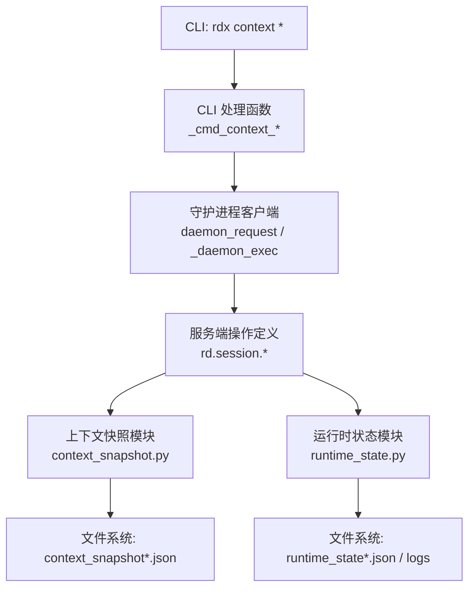
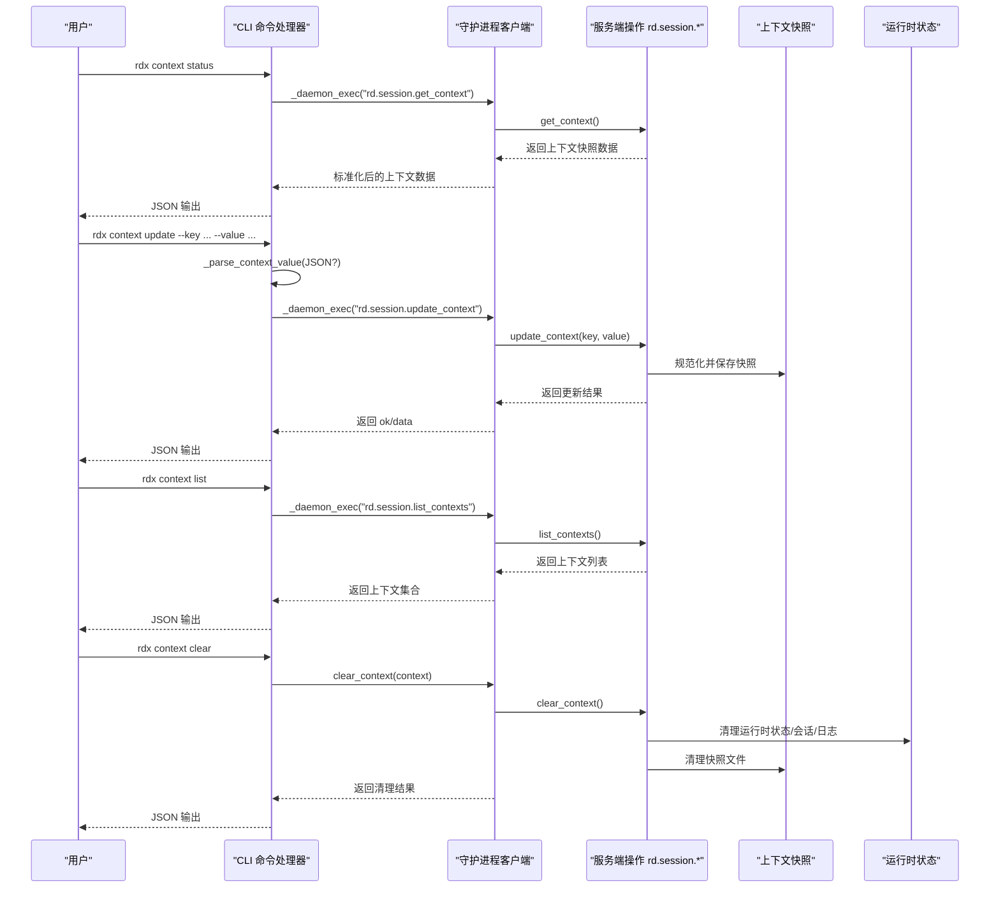
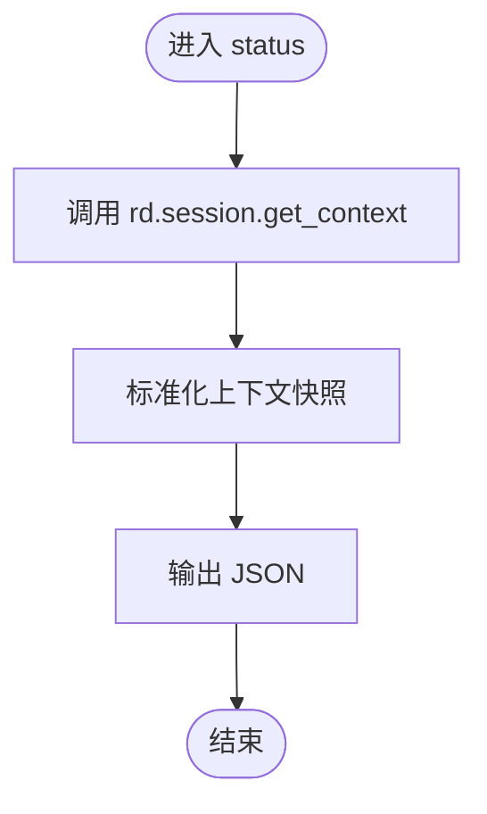
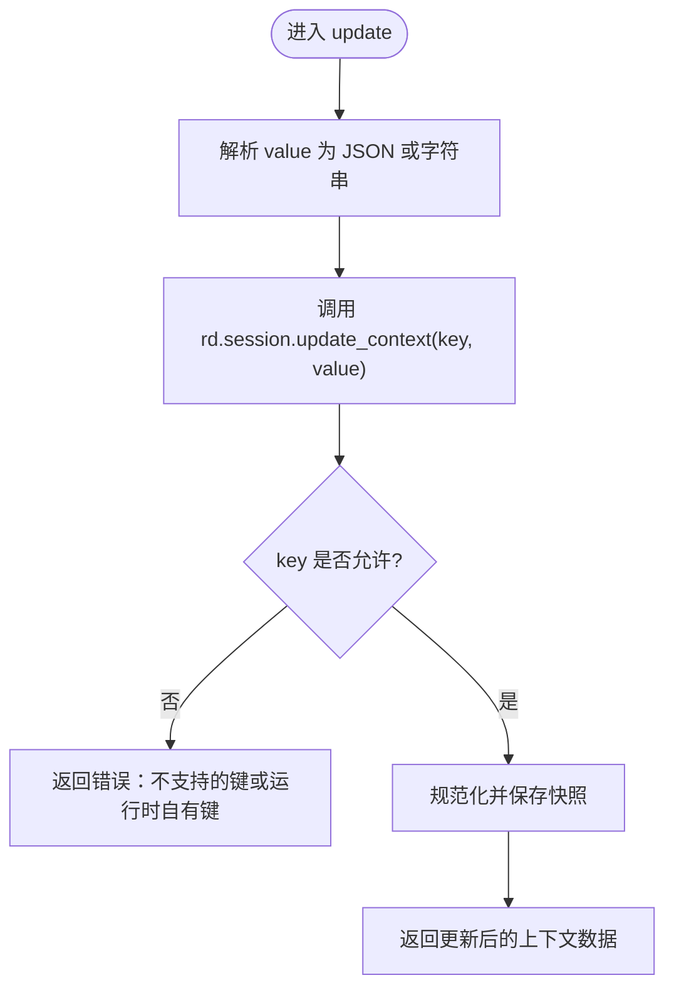
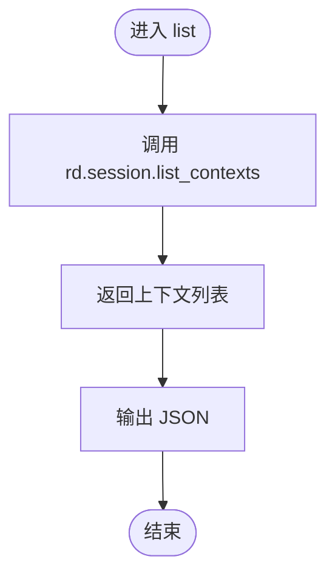
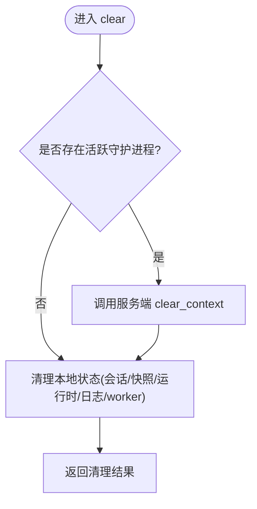
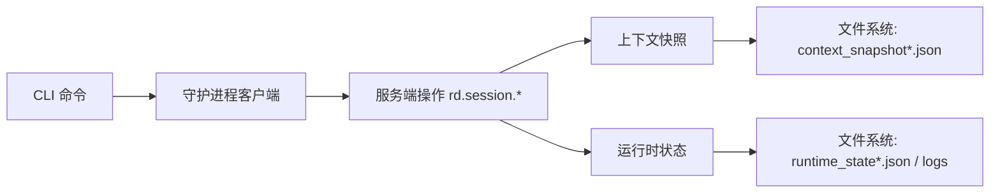

# 上下文管理命令

<cite>
**本文引用的文件**
- [rdx/cli.py](file://rdx/cli.py)
- [rdx/context_snapshot.py](file://rdx/context_snapshot.py)
- [rdx/daemon/client.py](file://rdx/daemon/client.py)
- [rdx/runtime_state.py](file://rdx/runtime_state.py)
- [rdx/operation_definitions.py](file://rdx/operation_definitions.py)
- [tests/test_context_cli_boundary.py](file://tests/test_context_cli_boundary.py)
</cite>

## 目录
1. [简介](#简介)
2. [项目结构](#项目结构)
3. [核心组件](#核心组件)
4. [架构总览](#架构总览)
5. [详细组件分析](#详细组件分析)
6. [依赖关系分析](#依赖关系分析)
7. [性能与一致性](#性能与一致性)
8. [故障排查指南](#故障排查指南)
9. [结论](#结论)
10. [附录：参数与示例](#附录参数与示例)

## 简介
本章节面向使用 rdx 命令行工具的用户，系统化说明“上下文管理”相关命令的用途、行为与最佳实践。重点覆盖以下命令：
- rdx context status：查看当前上下文的状态与信息
- rdx context update：更新上下文的键值对数据（支持 JSON 格式的值）
- rdx context list：列出所有可用的上下文
- rdx context clear：清理指定上下文的数据与状态

同时解释上下文数据的持久化机制、同步策略以及在多任务环境中如何隔离与管理不同的工作上下文。

## 项目结构
上下文管理功能由 CLI 层、守护进程客户端层、上下文快照与运行时状态层共同实现：
- CLI 层负责解析用户命令并调用对应的内部函数
- 守护进程客户端层负责与后台服务交互或本地清理
- 上下文快照与运行时状态层负责持久化存储、并发安全与数据规范化

图表来源
- [rdx/cli.py:770-800](file://rdx/cli.py#L770-L800)
- [rdx/daemon/client.py:837-871](file://rdx/daemon/client.py#L837-L871)
- [rdx/context_snapshot.py:214-280](file://rdx/context_snapshot.py#L214-L280)
- [rdx/runtime_state.py:427-445](file://rdx/runtime_state.py#L427-L445)

章节来源
- [rdx/cli.py:770-800](file://rdx/cli.py#L770-L800)
- [rdx/context_snapshot.py:214-280](file://rdx/context_snapshot.py#L214-L280)
- [rdx/runtime_state.py:427-445](file://rdx/runtime_state.py#L427-L445)

## 核心组件
- CLI 命令处理器：将 rdx context status/update/list/clear 映射到具体操作
- 守护进程客户端：封装与服务端的请求/响应、上下文清理与状态恢复
- 上下文快照：提供默认快照结构、规范化、持久化、并发锁与保留策略
- 运行时状态：列举上下文 ID、读写日志、清理状态文件

章节来源
- [rdx/cli.py:770-800](file://rdx/cli.py#L770-L800)
- [rdx/daemon/client.py:265-294](file://rdx/daemon/client.py#L265-L294)
- [rdx/context_snapshot.py:18-35](file://rdx/context_snapshot.py#L18-L35)
- [rdx/runtime_state.py:427-445](file://rdx/runtime_state.py#L427-L445)

## 架构总览
下图展示了上下文管理命令从 CLI 到持久化的完整调用链与数据流。

图表来源
- [rdx/cli.py:770-800](file://rdx/cli.py#L770-L800)
- [rdx/daemon/client.py:837-871](file://rdx/daemon/client.py#L837-L871)
- [rdx/context_snapshot.py:447-484](file://rdx/context_snapshot.py#L447-L484)
- [rdx/runtime_state.py:427-445](file://rdx/runtime_state.py#L427-L445)

## 详细组件分析

### rdx context status
- 作用：获取当前上下文的状态信息，包括运行时、远程连接、焦点、备注等
- 流程：CLI 调用守护进程执行 rd.session.get_context，返回标准化的上下文快照
- 输出：JSON 格式的上下文数据，包含 context_id、runtime、remote、focus、notes、last_artifacts、updated_at_ms 等字段

图表来源
- [rdx/cli.py:780-784](file://rdx/cli.py#L780-L784)
- [rdx/context_snapshot.py:242-280](file://rdx/context_snapshot.py#L242-L280)

章节来源
- [rdx/cli.py:780-784](file://rdx/cli.py#L780-L784)
- [rdx/context_snapshot.py:242-280](file://rdx/context_snapshot.py#L242-L280)

### rdx context update
- 作用：更新当前上下文的 user-owned 字段，如 focus_pixel、focus_resource_id、focus_shader_id、notes；支持 JSON 值
- 参数：
  - key：要更新的键名（限定为允许的用户可写键）
  - value：任意 JSON 值；传 null 表示清除对应字段
  - context：可选，指定目标上下文（默认 default）
- 流程：CLI 解析 value 为 JSON（若失败则按字符串处理），调用 rd.session.update_context，后端规范化并保存快照
- 约束：不允许直接修改 runtime-owned 字段；非法键会报错

图表来源
- [rdx/cli.py:772-792](file://rdx/cli.py#L772-L792)
- [rdx/context_snapshot.py:486-508](file://rdx/context_snapshot.py#L486-L508)
- [rdx/operation_definitions.py:2799-2813](file://rdx/operation_definitions.py#L2799-L2813)

章节来源
- [rdx/cli.py:772-792](file://rdx/cli.py#L772-L792)
- [rdx/context_snapshot.py:486-508](file://rdx/context_snapshot.py#L486-L508)
- [rdx/operation_definitions.py:2799-2813](file://rdx/operation_definitions.py#L2799-L2813)

### rdx context list
- 作用：列出所有可用的上下文及其基本信息（如 context_id、session_locator、current_session_id、updated_at_ms 等）
- 流程：CLI 调用 rd.session.list_contexts，返回上下文集合
- 用途：在多任务环境中识别不同上下文，便于切换与管理

图表来源
- [rdx/cli.py:795-799](file://rdx/cli.py#L795-L799)
- [rdx/operation_definitions.py:2636-2654](file://rdx/operation_definitions.py#L2636-L2654)

章节来源
- [rdx/cli.py:795-799](file://rdx/cli.py#L795-L799)
- [rdx/operation_definitions.py:2636-2654](file://rdx/operation_definitions.py#L2636-L2654)

### rdx context clear
- 作用：清理指定上下文的数据与状态，包括会话状态、上下文快照、运行时状态、日志与 worker 状态
- 流程：
  - 若无活跃守护进程：直接清理本地状态文件
  - 若有活跃守护进程：通过服务端 clear_context 清理，再清理本地状态
- 返回值：JSON 中包含清理结果与上下文状态摘要

图表来源
- [rdx/daemon/client.py:837-871](file://rdx/daemon/client.py#L837-L871)
- [rdx/context_snapshot.py:478-484](file://rdx/context_snapshot.py#L478-L484)
- [rdx/runtime_state.py:419-425](file://rdx/runtime_state.py#L419-L425)

章节来源
- [rdx/daemon/client.py:837-871](file://rdx/daemon/client.py#L837-L871)
- [rdx/context_snapshot.py:478-484](file://rdx/context_snapshot.py#L478-L484)
- [rdx/runtime_state.py:419-425](file://rdx/runtime_state.py#L419-L425)

## 依赖关系分析
- CLI 依赖守护进程客户端进行跨进程通信或直接清理
- 守护进程客户端依赖上下文快照与运行时状态模块进行持久化
- 上下文快照模块提供并发安全的文件访问（基于线程锁与平台文件锁）
- 运行时状态模块提供上下文 ID 列举与日志读写

图表来源
- [rdx/cli.py:770-800](file://rdx/cli.py#L770-L800)
- [rdx/daemon/client.py:837-871](file://rdx/daemon/client.py#L837-L871)
- [rdx/context_snapshot.py:214-280](file://rdx/context_snapshot.py#L214-L280)
- [rdx/runtime_state.py:427-445](file://rdx/runtime_state.py#L427-L445)

章节来源
- [rdx/cli.py:770-800](file://rdx/cli.py#L770-L800)
- [rdx/daemon/client.py:837-871](file://rdx/daemon/client.py#L837-L871)
- [rdx/context_snapshot.py:214-280](file://rdx/context_snapshot.py#L214-L280)
- [rdx/runtime_state.py:427-445](file://rdx/runtime_state.py#L427-L445)

## 性能与一致性
- 并发安全：上下文快照写入使用线程锁与平台文件锁（Windows 下使用 msvcrt.locking），避免并发写入冲突
- 原子写入：使用原子写入 JSON 的工具函数，确保文件完整性
- 保留策略：上下文快照中的 last_artifacts 支持总量与类型上限控制，避免无限增长
- 上下文隔离：每个上下文拥有独立的快照与状态文件，互不干扰
- 列举效率：上下文 ID 列举基于文件名扫描，适合中小规模上下文数量

章节来源
- [rdx/context_snapshot.py:174-181](file://rdx/context_snapshot.py#L174-L181)
- [rdx/context_snapshot.py:227-240](file://rdx/context_snapshot.py#L227-L240)
- [rdx/context_snapshot.py:335-364](file://rdx/context_snapshot.py#L335-L364)
- [rdx/runtime_state.py:427-445](file://rdx/runtime_state.py#L427-L445)

## 故障排查指南
- 更新失败：检查 key 是否为允许的用户可写键；runtime-owned 键不可手动更新
- 上下文未生效：确认当前上下文是否正确；可通过 list 查看可用上下文
- 清理无效：若存在活跃守护进程，需先停止或通过服务端清理；必要时运行清理残留状态
- 数据不一致：检查上下文快照与运行时状态文件是否被其他进程占用；等待锁释放或重启后重试

章节来源
- [rdx/context_snapshot.py:486-508](file://rdx/context_snapshot.py#L486-L508)
- [rdx/daemon/client.py:837-871](file://rdx/daemon/client.py#L837-L871)
- [tests/test_context_cli_boundary.py:67-126](file://tests/test_context_cli_boundary.py#L67-L126)

## 结论
上下文管理命令提供了在 rdx 中查看、更新、列举与清理上下文的能力。通过 CLI 与守护进程的协作，结合上下文快照与运行时状态的持久化，实现了多任务环境下的上下文隔离与状态恢复。建议在使用时遵循键限制、合理使用 JSON 值、定期清理不再使用的上下文，以保证系统稳定与资源可控。

## 附录：参数与示例

### rdx context status
- 用途：查看当前上下文状态
- 参数：无
- 示例：
  - rdx context status
- 输出要点：context_id、runtime、remote、focus、notes、last_artifacts、updated_at_ms

章节来源
- [rdx/cli.py:780-784](file://rdx/cli.py#L780-L784)
- [rdx/context_snapshot.py:242-280](file://rdx/context_snapshot.py#L242-L280)

### rdx context update
- 用途：更新上下文的 user-owned 字段
- 参数：
  - --key：键名（focus_pixel、focus_resource_id、focus_shader_id、notes）
  - --value：JSON 值或字符串；传 null 表示清除该字段
  - --daemon-context：可选，指定上下文（默认 default）
- 示例：
  - rdx context update --key notes --value "调试记录"
  - rdx context update --key focus_pixel --value '{"x":10,"y":20}'
  - rdx context update --key notes --value null
- 注意：不支持直接修改 runtime-owned 字段；非法键会报错

章节来源
- [rdx/cli.py:772-792](file://rdx/cli.py#L772-L792)
- [rdx/context_snapshot.py:486-508](file://rdx/context_snapshot.py#L486-L508)
- [rdx/operation_definitions.py:2799-2813](file://rdx/operation_definitions.py#L2799-L2813)

### rdx context list
- 用途：列出所有可用上下文
- 参数：无
- 示例：
  - rdx context list
- 输出要点：contexts 列表，每项包含 context_id、session_locator、current_session_id、updated_at_ms 等

章节来源
- [rdx/cli.py:795-799](file://rdx/cli.py#L795-L799)
- [rdx/operation_definitions.py:2636-2654](file://rdx/operation_definitions.py#L2636-L2654)

### rdx context clear
- 用途：清理指定上下文的数据与状态
- 参数：无（默认清理当前上下文；如需清理特定上下文，可在上层传递 context）
- 示例：
  - rdx context clear
- 行为：
  - 无活跃守护进程：直接清理本地状态文件
  - 有活跃守护进程：通过服务端清理，再清理本地状态

章节来源
- [rdx/daemon/client.py:837-871](file://rdx/daemon/client.py#L837-L871)
- [rdx/context_snapshot.py:478-484](file://rdx/context_snapshot.py#L478-L484)
- [rdx/runtime_state.py:419-425](file://rdx/runtime_state.py#L419-L425)

### 多任务场景与最佳实践
- 隔离工作上下文：为不同任务创建独立上下文（例如 qa-receipt、codex-rdc-convergence），避免相互干扰
- 保存与恢复分析状态：通过 update 设置 notes、focus 等字段，配合 list/status 跟踪进度
- 清理与回收：任务完成后执行 clear，释放资源并避免残留状态影响后续任务
- 持久化与同步：上下文快照与运行时状态文件位于 CLI 运行时目录，具备并发锁与原子写入保障

章节来源
- [rdx/context_snapshot.py:214-280](file://rdx/context_snapshot.py#L214-L280)
- [rdx/runtime_state.py:427-445](file://rdx/runtime_state.py#L427-L445)
- [tests/test_context_cli_boundary.py:67-126](file://tests/test_context_cli_boundary.py#L67-L126)