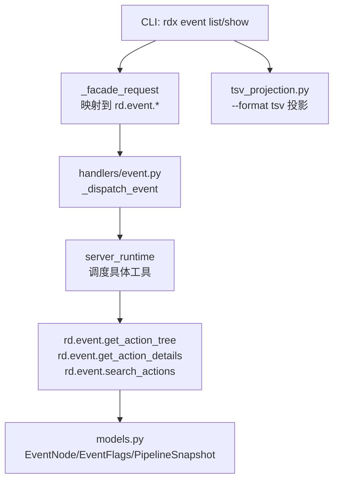
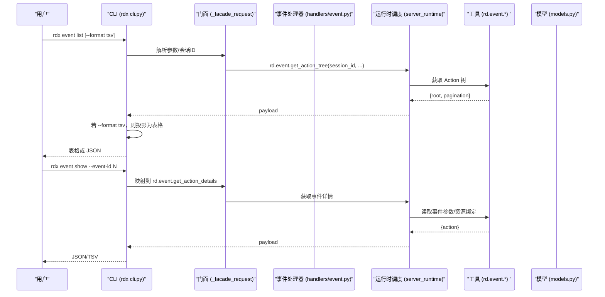
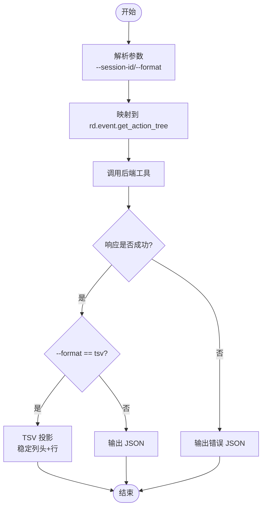
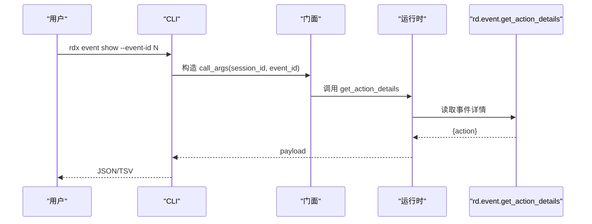
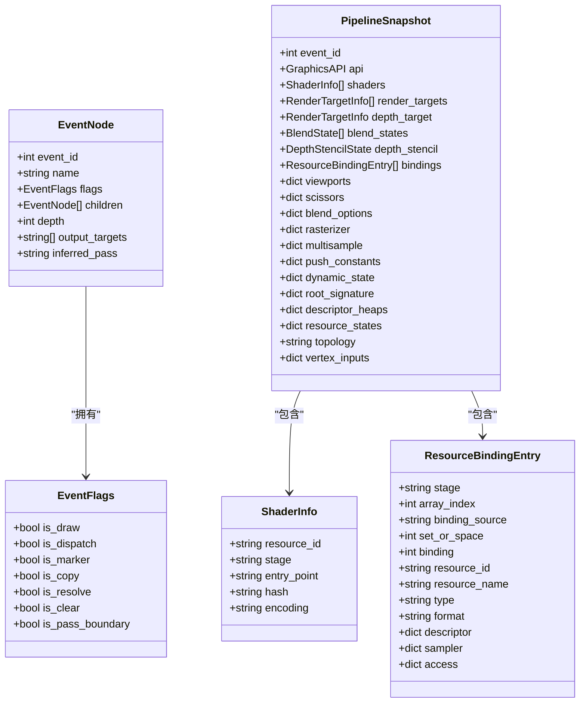
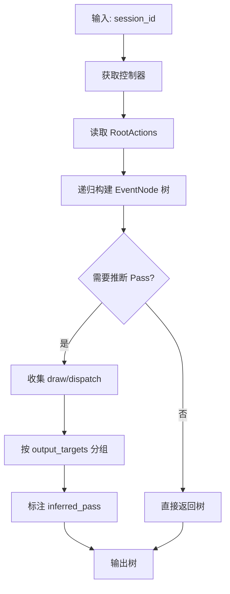
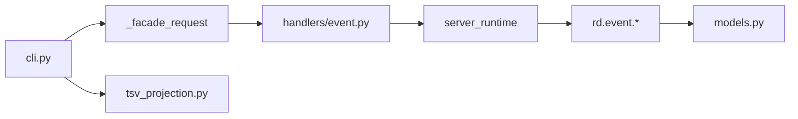

# 事件浏览命令

<cite>
**本文引用的文件**
- [rdx/cli.py](file://rdx/cli.py)
- [rdx/handlers/event.py](file://rdx/handlers/event.py)
- [rdx/core/event_graph.py](file://rdx/core/event_graph.py)
- [rdx/models.py](file://rdx/models.py)
- [rdx/core/tsv_projection.py](file://rdx/core/tsv_projection.py)
- [docs/tool-reference.md](file://docs/tool-reference.md)
</cite>

## 目录
1. [简介](#简介)
2. [项目结构](#项目结构)
3. [核心组件](#核心组件)
4. [架构总览](#架构总览)
5. [详细组件分析](#详细组件分析)
6. [依赖关系分析](#依赖关系分析)
7. [性能注意事项](#性能注意事项)
8. [故障排查指南](#故障排查指南)
9. [结论](#结论)
10. [附录：使用示例与最佳实践](#附录使用示例与最佳实践)

## 简介
本章节面向“事件浏览”能力，聚焦以下目标：
- rdx event list：列出当前帧的 GPU 调用事件（Action 树），支持 --format tsv 输出表格。
- rdx event show：查看指定事件的详细信息，通过 --event-id 指定事件 ID。
- 事件过滤与搜索：基于 API 调用类型、着色器阶段等条件筛选。
- 数据结构：解释 Action 树、API 调用参数、资源绑定信息。
- 实用示例：查找特定 Drawcall、分析事件序列、导出事件数据。

## 项目结构
事件浏览功能由 CLI 门面、后端工具与数据模型共同组成：
- CLI 层负责解析参数、组装请求、渲染输出（JSON/TSV）。
- 后端通过 rd.event.* 工具暴露事件树、事件详情、搜索、管线状态等能力。
- 数据模型定义了事件节点、标志位、管线快照等资源描述结构。

图表来源
- [rdx/cli.py:953-962](file://rdx/cli.py#L953-L962)
- [rdx/handlers/event.py:8-10](file://rdx/handlers/event.py#L8-L10)
- [docs/tool-reference.md:104-116](file://docs/tool-reference.md#L104-L116)
- [rdx/models.py:163-181](file://rdx/models.py#L163-L181)
- [rdx/core/tsv_projection.py:17-51](file://rdx/core/tsv_projection.py#L17-L51)

章节来源
- [rdx/cli.py:953-962](file://rdx/cli.py#L953-L962)
- [rdx/handlers/event.py:8-10](file://rdx/handlers/event.py#L8-L10)
- [docs/tool-reference.md:104-116](file://docs/tool-reference.md#L104-L116)
- [rdx/models.py:163-181](file://rdx/models.py#L163-L181)
- [rdx/core/tsv_projection.py:17-51](file://rdx/core/tsv_projection.py#L17-L51)

## 核心组件
- CLI 门面：将 rdx event list/show 转换为 rd.event.get_action_tree / rd.event.get_action_details 调用，并处理 --session-id、--event-id、--format。
- 事件图服务：构建 EventNode 树、查询 draw/dispatch、推断 pass 边界、按 event_id 查找节点与路径。
- 数据模型：EventFlags（Draw/Dispatch/Marker/Copy/Resolve/Clear/PassBoundary）、EventNode（id/name/flags/children/output_targets/inferred_pass）、PipelineSnapshot（shaders/bindings/render targets 等）。
- TSV 投影：将结构化行数据投影为稳定表头与行列，用于 --format tsv 输出。

章节来源
- [rdx/cli.py:1392-1506](file://rdx/cli.py#L1392-L1506)
- [rdx/core/event_graph.py:152-386](file://rdx/core/event_graph.py#L152-L386)
- [rdx/models.py:163-301](file://rdx/models.py#L163-L301)
- [rdx/core/tsv_projection.py:17-51](file://rdx/core/tsv_projection.py#L17-L51)

## 架构总览
下图展示从命令行到后端工具的完整调用链，以及 JSON/TSV 输出分支。

图表来源
- [rdx/cli.py:953-962](file://rdx/cli.py#L953-L962)
- [rdx/handlers/event.py:8-10](file://rdx/handlers/event.py#L8-L10)
- [docs/tool-reference.md:104-116](file://docs/tool-reference.md#L104-L116)

## 详细组件分析

### rdx event list：列出事件
- 作用：获取当前帧完整的 Action 树，支持分页与裁剪。
- 关键参数：
  - --session-id：选择会话（可选）。
  - --format：json 或 tsv；TSV 仅对列表类命令有效。
- 内部流程：
  - CLI 将子命令映射为 rd.event.get_action_tree。
  - 返回 root 与 pagination（max_nodes、truncated 等）。
  - 当 --format tsv 时，通过 TSV 投影生成稳定表头与行。

图表来源
- [rdx/cli.py:953-962](file://rdx/cli.py#L953-L962)
- [rdx/core/tsv_projection.py:17-51](file://rdx/core/tsv_projection.py#L17-L51)
- [docs/tool-reference.md:104-116](file://docs/tool-reference.md#L104-L116)

章节来源
- [rdx/cli.py:953-962](file://rdx/cli.py#L953-L962)
- [rdx/core/tsv_projection.py:17-51](file://rdx/core/tsv_projection.py#L17-L51)
- [docs/tool-reference.md:104-116](file://docs/tool-reference.md#L104-L116)

### rdx event show：查看事件详情
- 作用：获取单个 Action 的详细信息，包括 Drawcall 参数、Marker 范围、输出目标等摘要。
- 关键参数：
  - --session-id：选择会话（可选）。
  - --event-id：必填，指定要查看的事件 ID。
  - --format：json 或 tsv（详情通常以 JSON 为主）。
- 内部流程：
  - CLI 将子命令映射为 rd.event.get_action_details。
  - 后端返回 action 对象，包含事件相关参数与资源信息。

图表来源
- [rdx/cli.py:953-962](file://rdx/cli.py#L953-L962)
- [docs/tool-reference.md:104-116](file://docs/tool-reference.md#L104-L116)

章节来源
- [rdx/cli.py:953-962](file://rdx/cli.py#L953-L962)
- [docs/tool-reference.md:104-116](file://docs/tool-reference.md#L104-L116)

### 事件过滤与搜索
- 搜索接口：rd.event.search_actions 支持在当前帧的 Action 树中按名称、Flag 或事件范围等条件搜索。
- 过滤维度：
  - API 调用类型：Draw/Dispatch/Marker/Copy/Resolve/Clear/PassBoundary（对应 EventFlags）。
  - 着色器阶段：在管线状态中可区分 vs/hs/ds/gs/ps/cs/ms/as（ShaderStage）。
  - 事件范围：通过 offset/limit/max_nodes 控制遍历范围。
- 典型用法：
  - 先通过 search_actions 定位候选事件 ID。
  - 再用 event show 查看该事件的详细参数与资源绑定。

章节来源
- [docs/tool-reference.md:104-116](file://docs/tool-reference.md#L104-L116)
- [rdx/models.py:42-51](file://rdx/models.py#L42-L51)
- [rdx/models.py:163-171](file://rdx/models.py#L163-L171)

### 事件数据结构：Action 树、API 调用参数、资源绑定
- EventNode：每个事件节点包含 event_id、name、flags、children、depth、output_targets、inferred_pass。
- EventFlags：标记事件类型（is_draw/is_dispatch/is_marker/is_copy/is_resolve/is_clear/is_pass_boundary）。
- PipelineSnapshot：包含 shaders、render_targets、depth_target、blend_states、depth_stencil、bindings、viewports/scissors 等。
- ResourceBindingEntry：描述 stage、set_or_space、binding、resource_id、type、format 等。

图表来源
- [rdx/models.py:163-301](file://rdx/models.py#L163-L301)

章节来源
- [rdx/models.py:163-301](file://rdx/models.py#L163-L301)

### 事件图服务：构建与导航
- 构建事件树：从 Replay Controller 的 ActionDescription 树转换为 EventNode 树。
- 查询 draw/dispatch：展开树并只返回绘制/调度事件。
- 推断 Pass：根据输出目标变化推断渲染 pass 边界，标注 inferred_pass。
- 查找事件与路径：按 event_id 查找节点，并返回根到目标的路径。

图表来源
- [rdx/core/event_graph.py:161-309](file://rdx/core/event_graph.py#L161-L309)

章节来源
- [rdx/core/event_graph.py:161-309](file://rdx/core/event_graph.py#L161-L309)

## 依赖关系分析
- CLI 依赖门面函数进行命令映射，并将结果通过 TSV 投影输出。
- 事件处理器统一转发到 server_runtime._dispatch_event，再由运行时调度具体工具。
- 工具层提供 rd.event.* 系列操作，返回结构化数据。
- 数据模型定义事件与管线状态的字段，确保前后端一致。

图表来源
- [rdx/cli.py:953-962](file://rdx/cli.py#L953-L962)
- [rdx/handlers/event.py:8-10](file://rdx/handlers/event.py#L8-L10)
- [docs/tool-reference.md:104-116](file://docs/tool-reference.md#L104-L116)
- [rdx/models.py:163-301](file://rdx/models.py#L163-L301)
- [rdx/core/tsv_projection.py:17-51](file://rdx/core/tsv_projection.py#L17-L51)

章节来源
- [rdx/cli.py:953-962](file://rdx/cli.py#L953-L962)
- [rdx/handlers/event.py:8-10](file://rdx/handlers/event.py#L8-L10)
- [docs/tool-reference.md:104-116](file://docs/tool-reference.md#L104-L116)
- [rdx/models.py:163-301](file://rdx/models.py#L163-L301)
- [rdx/core/tsv_projection.py:17-51](file://rdx/core/tsv_projection.py#L17-L51)

## 性能注意事项
- 大帧事件树：使用 max_nodes、offset、limit 限制返回规模，避免一次性加载过多节点。
- TSV 输出：适合快速扫描与外部工具处理；复杂嵌套结构建议使用 JSON。
- 推断 Pass：当缺少显式 Marker 时，会根据输出目标变化推断 pass，可能增加计算开销。
- 资源绑定与管线状态：仅在必要时读取，避免频繁切换回放位置。

[本节为通用指导，不直接分析具体文件]

## 故障排查指南
- 不支持的 TSV 投影：非列表类命令使用 --format tsv 会返回 projection_not_supported 错误，应改用 JSON。
- 事件不存在：search_actions 或 find_event 未找到目标时，检查 event_id 或过滤条件。
- 资源不可用：某些后端或 RenderDoc 版本可能无法读取输出目标或管线状态，需降级处理或升级环境。
- 会话上下文：确保已打开捕获文件并创建 Replay Session，再执行事件浏览命令。

章节来源
- [rdx/cli.py:926-941](file://rdx/cli.py#L926-L941)
- [rdx/core/event_graph.py:107-146](file://rdx/core/event_graph.py#L107-L146)
- [docs/tool-reference.md:104-116](file://docs/tool-reference.md#L104-L116)

## 结论
事件浏览命令提供了从高层 Action 树到具体事件详情的完整能力，结合过滤与搜索，能够快速定位 Drawcall、分析事件序列并导出数据。TSV 输出便于自动化处理，JSON 输出适合深度分析。通过 EventGraphService 与数据模型，系统实现了高效的事件导航与状态查询。

[本节为总结性内容，不直接分析具体文件]

## 附录：使用示例与最佳实践
- 列出事件并以表格形式输出：
  - rdx event list --format tsv
  - 适用场景：快速浏览当前帧的所有事件，配合外部工具筛选。
- 查看特定事件详情：
  - rdx event show --event-id <N>
  - 适用场景：深入分析某个 Drawcall 的参数与资源绑定。
- 搜索特定类型的调用：
  - 使用 rd.event.search_actions 按 Flag 或名称过滤，例如查找所有 Draw 或 Dispatch。
- 分析事件序列：
  - 通过 get_parent_chain 获取父链，还原 Marker Stack 或 Pass 层级。
- 导出事件数据：
  - 使用 --format tsv 导出表格，或使用 JSON 保存完整结构以便后续分析。
- 着色器阶段筛选：
  - 结合 pipeline 状态中的 ShaderStage 字段，定位特定阶段的绑定与常量缓冲。

章节来源
- [rdx/cli.py:1392-1506](file://rdx/cli.py#L1392-L1506)
- [docs/tool-reference.md:104-116](file://docs/tool-reference.md#L104-L116)
- [rdx/models.py:42-51](file://rdx/models.py#L42-L51)
- [rdx/core/tsv_projection.py:17-51](file://rdx/core/tsv_projection.py#L17-L51)