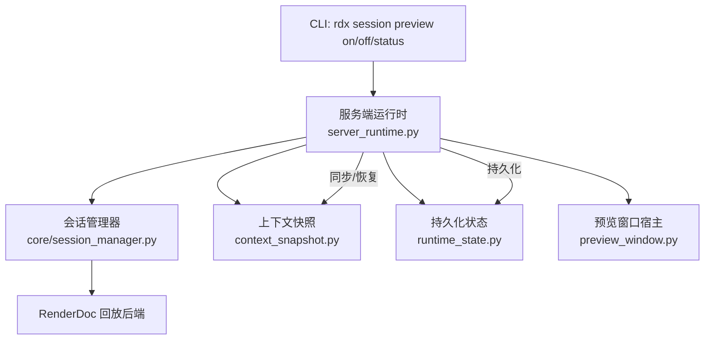
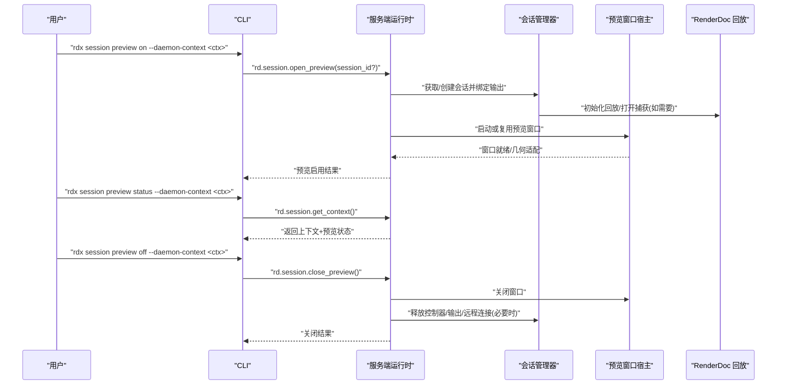
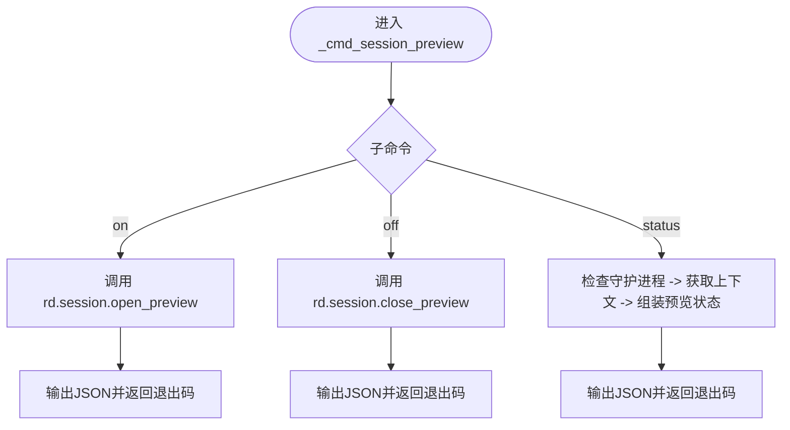
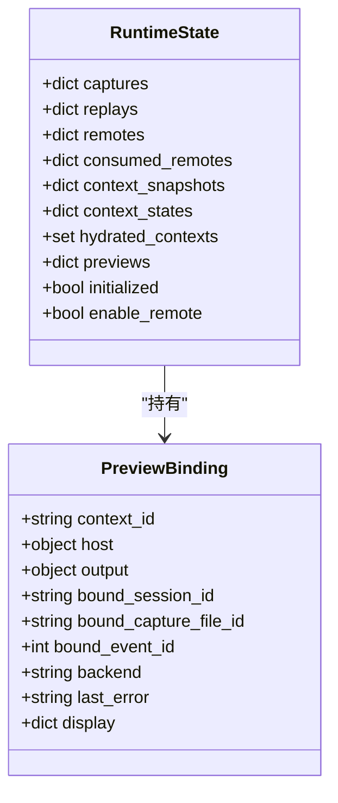
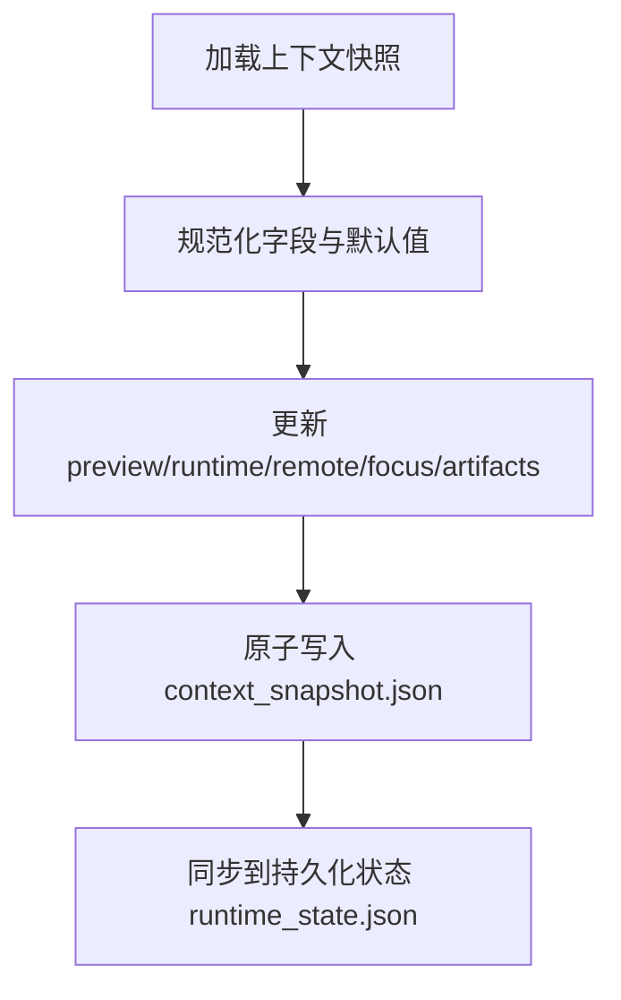
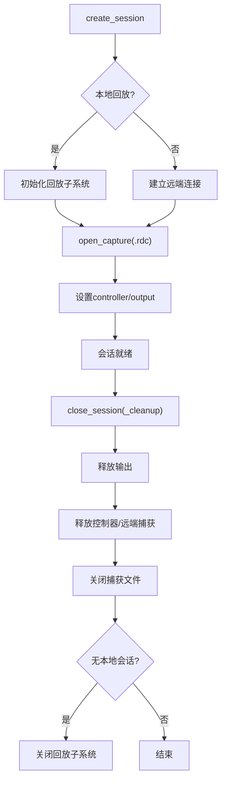
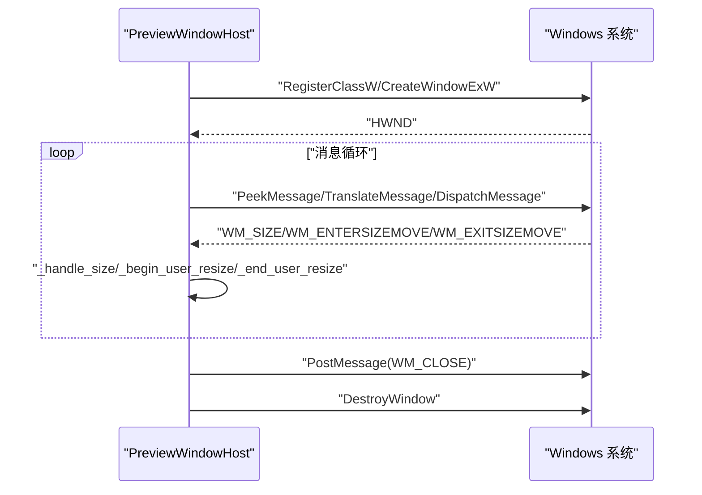
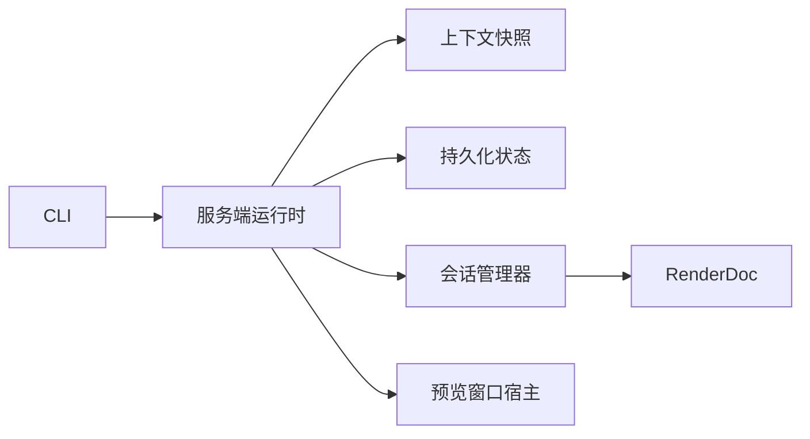

# 会话管理命令

<cite>
**本文引用的文件**
- [rdx/cli.py](file://rdx/cli.py)
- [rdx/server_runtime.py](file://rdx/server_runtime.py)
- [rdx/context_snapshot.py](file://rdx/context_snapshot.py)
- [rdx/runtime_state.py](file://rdx/runtime_state.py)
- [rdx/core/session_manager.py](file://rdx/core/session_manager.py)
- [rdx/preview_window.py](file://rdx/preview_window.py)
- [docs/session-model.md](file://docs/session-model.md)
- [tests/test_cli_capture_open.py](file://tests/test_cli_capture_open.py)
</cite>

## 目录
1. [简介](#简介)
2. [项目结构](#项目结构)
3. [核心组件](#核心组件)
4. [架构总览](#架构总览)
5. [详细组件分析](#详细组件分析)
6. [依赖关系分析](#依赖关系分析)
7. [性能考虑](#性能考虑)
8. [故障排查指南](#故障排查指南)
9. [结论](#结论)
10. [附录：自动化脚本示例与最佳实践](#附录自动化脚本示例与最佳实践)

## 简介
本文件面向使用 RDX 工具链的工程师，系统化说明“会话管理”相关命令与实现，重点覆盖：
- rdx session preview on/off/status 三个子命令如何控制预览窗口的显示状态。
- 会话生命周期管理：上下文快照的创建、更新与清理；会话创建、打开捕获、关闭会话等关键阶段。
- 多上下文隔离机制：--daemon-context 参数的作用与上下文命名空间。
- 会话状态的查询与操作方法。
- 会话与捕获文件的关联关系，以及资源清理的最佳实践。
- 在自动化脚本中管理多个会话的实践建议（以代码片段路径引用代替直接粘贴代码）。

## 项目结构
RDX 的会话管理与预览功能由 CLI、服务端运行时、上下文快照、持久化状态、渲染回放管理器以及 Windows 预览窗口宿主共同协作完成。整体调用链路如下：
- CLI 层解析参数并转发到守护进程/运行时操作。
- 服务端运行时维护上下文状态、会话、预览绑定和渲染回放资源。
- 上下文快照与持久化状态负责跨进程/重启后的状态恢复。
- 渲染回放管理器封装 RenderDoc 本地/远端回放能力。
- 预览窗口宿主提供独立桌面窗口生命周期。

图表来源
- [rdx/cli.py:1197-1271](file://rdx/cli.py#L1197-L1271)
- [rdx/server_runtime.py:218-242](file://rdx/server_runtime.py#L218-L242)
- [rdx/core/session_manager.py:175-259](file://rdx/core/session_manager.py#L175-L259)
- [rdx/context_snapshot.py:214-279](file://rdx/context_snapshot.py#L214-L279)
- [rdx/runtime_state.py:104-149](file://rdx/runtime_state.py#L104-L149)
- [rdx/preview_window.py:192-252](file://rdx/preview_window.py#L192-L252)

章节来源
- [rdx/cli.py:62-104](file://rdx/cli.py#L62-L104)
- [docs/session-model.md:1-10](file://docs/session-model.md#L1-L10)

## 核心组件
- CLI 会话预览命令处理器：解析 on/off/status 子命令，调用守护进程执行 rd.session.open_preview / rd.session.close_preview / rd.session.get_context，并输出标准化 JSON。
- 服务端运行时：维护 RuntimeState，包含 previews、replays、captures、context_snapshots、context_states；负责预览绑定、自动同步、上下文容量限制与资源清理。
- 上下文快照：按 daemon context 维度持久化预览开关、绑定信息、显示几何、最近产物等；支持保留策略与原子写入。
- 持久化状态：存储当前会话、捕获、恢复信息、指标与限制；用于崩溃恢复与跨进程共享。
- 会话管理器：封装 RenderDoc 回放生命周期（本地/远端），管理会话创建、打开捕获、关闭会话、清理资源。
- 预览窗口宿主：Windows 原生窗口线程，处理窗口消息、尺寸自适应、关闭回调。

章节来源
- [rdx/cli.py:1197-1271](file://rdx/cli.py#L1197-L1271)
- [rdx/server_runtime.py:197-242](file://rdx/server_runtime.py#L197-L242)
- [rdx/context_snapshot.py:214-279](file://rdx/context_snapshot.py#L214-L279)
- [rdx/runtime_state.py:104-149](file://rdx/runtime_state.py#L104-L149)
- [rdx/core/session_manager.py:175-259](file://rdx/core/session_manager.py#L175-L259)
- [rdx/preview_window.py:192-252](file://rdx/preview_window.py#L192-L252)

## 架构总览
下图展示从 CLI 到渲染回放的完整调用序列，包括预览开启、状态查询与关闭流程。

图表来源
- [rdx/cli.py:1197-1271](file://rdx/cli.py#L1197-L1271)
- [rdx/server_runtime.py:218-242](file://rdx/server_runtime.py#L218-L242)
- [rdx/core/session_manager.py:175-259](file://rdx/core/session_manager.py#L175-L259)
- [rdx/preview_window.py:221-252](file://rdx/preview_window.py#L221-L252)

## 详细组件分析

### CLI 会话预览命令
- 入口：_cmd_session_preview
- on：调用 rd.session.open_preview，可选传入 session_id；输出标准化成功/失败结果。
- off：调用 rd.session.close_preview；输出标准化结果。
- status：先检查守护进程运行状态，再调用 rd.session.get_context 读取上下文中的 preview 字段，构造统一响应。

图表来源
- [rdx/cli.py:1197-1271](file://rdx/cli.py#L1197-L1271)

章节来源
- [rdx/cli.py:1197-1271](file://rdx/cli.py#L1197-L1271)
- [tests/test_cli_capture_open.py:431-477](file://tests/test_cli_capture_open.py#L431-L477)

### 服务端运行时与预览绑定
- 预览绑定对象 PreviewBinding：记录 context_id、窗口宿主、输出句柄、绑定的 session/capture/event、后端类型、错误信息与显示几何。
- 运行时状态 RuntimeState：集中管理 previews、replays、captures、remotes、context_snapshots、context_states。
- 预览状态规范化：normalize_preview_state / normalize_preview_display_state 保证字段一致性与默认值。
- 自动同步：非预览自身操作的请求前后，可能触发预览自动同步，确保预览与上下文一致。

图表来源
- [rdx/server_runtime.py:197-242](file://rdx/server_runtime.py#L197-L242)

章节来源
- [rdx/server_runtime.py:197-242](file://rdx/server_runtime.py#L197-L242)
- [rdx/server_runtime.py:471-540](file://rdx/server_runtime.py#L471-L540)

### 上下文快照与持久化状态
- 上下文快照 context_snapshot.json：保存 preview.enabled/state/display、session/capture 绑定、焦点像素、最近产物等；按 daemon context 隔离。
- 持久化状态 runtime_state.json：保存 current_session_id/current_capture_file_id、sessions/captures、恢复信息、指标与限制；用于崩溃恢复。
- 原子写入与锁：通过 .lock 文件与互斥量保证并发安全。
- 保留策略：last_artifacts 支持 total_limit/per_type_limit 裁剪。

图表来源
- [rdx/context_snapshot.py:214-279](file://rdx/context_snapshot.py#L214-L279)
- [rdx/context_snapshot.py:447-475](file://rdx/context_snapshot.py#L447-L475)
- [rdx/runtime_state.py:104-149](file://rdx/runtime_state.py#L104-L149)
- [rdx/runtime_state.py:388-416](file://rdx/runtime_state.py#L388-L416)

章节来源
- [rdx/context_snapshot.py:214-279](file://rdx/context_snapshot.py#L214-L279)
- [rdx/context_snapshot.py:447-475](file://rdx/context_snapshot.py#L447-L475)
- [rdx/runtime_state.py:104-149](file://rdx/runtime_state.py#L104-L149)
- [rdx/runtime_state.py:388-416](file://rdx/runtime_state.py#L388-L416)

### 会话生命周期与渲染回放
- 创建会话：create_session 区分 local/remote，初始化回放子系统或远端连接。
- 打开捕获：open_capture 打开 .rdc 文件，设置 controller/output，推断 API 能力，标记 is_initialized。
- 关闭会话：close_session 弹出状态并执行 _cleanup，顺序释放输出、控制器、捕获文件、远端连接，并在无剩余本地会话时关闭回放子系统。
- 远端复制与 Android ADB：支持 CopyCaptureToRemote 与 adb push，带 SHA256 校验与所有权管理。

图表来源
- [rdx/core/session_manager.py:175-259](file://rdx/core/session_manager.py#L175-L259)
- [rdx/core/session_manager.py:301-383](file://rdx/core/session_manager.py#L301-L383)
- [rdx/core/session_manager.py:384-440](file://rdx/core/session_manager.py#L384-L440)
- [rdx/core/session_manager.py:517-569](file://rdx/core/session_manager.py#L517-L569)

章节来源
- [rdx/core/session_manager.py:175-259](file://rdx/core/session_manager.py#L175-L259)
- [rdx/core/session_manager.py:301-383](file://rdx/core/session_manager.py#L301-L383)
- [rdx/core/session_manager.py:384-440](file://rdx/core/session_manager.py#L384-L440)
- [rdx/core/session_manager.py:517-569](file://rdx/core/session_manager.py#L517-L569)

### 预览窗口宿主
- 窗口线程：独立线程创建窗口类、消息循环，处理 WM_CLOSE/WM_DESTROY/WM_SIZE 等。
- 尺寸自适应：根据屏幕工作区与 framebuffer 尺寸计算合适窗口大小，支持手动覆盖与自动调整深度。
- 生命周期：start/close/is_alive/set_title/geometry_snapshot/apply_framebuffer_geometry。

图表来源
- [rdx/preview_window.py:146-189](file://rdx/preview_window.py#L146-L189)
- [rdx/preview_window.py:221-252](file://rdx/preview_window.py#L221-L252)
- [rdx/preview_window.py:381-437](file://rdx/preview_window.py#L381-L437)

章节来源
- [rdx/preview_window.py:192-252](file://rdx/preview_window.py#L192-L252)
- [rdx/preview_window.py:381-437](file://rdx/preview_window.py#L381-L437)

## 依赖关系分析
- CLI 依赖守护进程通信接口，转发预览控制与状态查询。
- 服务端运行时依赖上下文快照与持久化状态进行状态同步与恢复。
- 会话管理器依赖 RenderDoc 回放后端，负责本地/远端资源管理。
- 预览窗口宿主为独立 UI 线程，受运行时控制其生命周期。

图表来源
- [rdx/cli.py:1197-1271](file://rdx/cli.py#L1197-L1271)
- [rdx/server_runtime.py:197-242](file://rdx/server_runtime.py#L197-L242)
- [rdx/core/session_manager.py:175-259](file://rdx/core/session_manager.py#L175-L259)
- [rdx/context_snapshot.py:214-279](file://rdx/context_snapshot.py#L214-L279)
- [rdx/runtime_state.py:104-149](file://rdx/runtime_state.py#L104-L149)
- [rdx/preview_window.py:192-252](file://rdx/preview_window.py#L192-L252)

章节来源
- [rdx/cli.py:1197-1271](file://rdx/cli.py#L1197-L1271)
- [rdx/server_runtime.py:197-242](file://rdx/server_runtime.py#L197-L242)
- [rdx/core/session_manager.py:175-259](file://rdx/core/session_manager.py#L175-L259)
- [rdx/context_snapshot.py:214-279](file://rdx/context_snapshot.py#L214-L279)
- [rdx/runtime_state.py:104-149](file://rdx/runtime_state.py#L104-L149)
- [rdx/preview_window.py:192-252](file://rdx/preview_window.py#L192-L252)

## 性能考虑
- 预览窗口尺寸自适应避免频繁重绘，采用自动调整深度与手动覆盖标志减少抖动。
- 远端捕获传输使用进度回调与 SHA256 校验，失败时快速清理临时路径。
- 上下文容量限制防止过多上下文占用资源；清理时优先释放输出、控制器、捕获文件与远端连接。
- 回放子系统仅在存在本地会话时保持初始化，无剩余本地会话时关闭以降低开销。

[本节为通用指导，不直接分析具体文件]

## 故障排查指南
- 预览状态查询失败：检查守护进程是否运行；若未运行，status 会返回 running=false 且 preview.available=false。
- 打开预览失败：确认已打开捕获并存在有效会话；查看上下文快照中的 preview.last_error 与 display 几何。
- 远端复制失败：检查远端可达性与设备 ADB 配置；关注 remote_capture_copy_failed 错误详情。
- 资源泄漏：确保调用 close_preview 与 close_session；清理后验证输出/控制器/捕获文件/远端连接是否释放。

章节来源
- [rdx/cli.py:1210-1271](file://rdx/cli.py#L1210-L1271)
- [rdx/core/session_manager.py:517-569](file://rdx/core/session_manager.py#L517-L569)
- [docs/session-model.md:15-18](file://docs/session-model.md#L15-L18)

## 结论
RDX 的会话管理通过 CLI、服务端运行时、上下文快照、持久化状态、渲染回放与预览窗口宿主的协同，提供了完整的预览窗口控制与生命周期管理能力。--daemon-context 实现了多上下文隔离，便于并行调试与自动化测试。遵循资源清理最佳实践可避免资源泄漏与状态不一致问题。

[本节为总结性内容，不直接分析具体文件]

## 附录：自动化脚本示例与最佳实践
- 打开捕获并启用预览：参考测试用例中对 capture open 与 preview 的调用序列，确保在 open_replay 成功后调用 open_preview。
- 查询预览状态：使用 session preview status，读取上下文中的 preview.enabled/state/view_mode/bound_session_id/bound_event_id。
- 关闭预览与会话：依次调用 session preview off 与 capture close（或等价操作），确保资源释放。
- 多上下文管理：通过 --daemon-context 指定不同 namespace，避免状态冲突；注意 max_contexts 限制与占用上下文检测。
- 资源清理：在异常路径中也应调用关闭逻辑；远端捕获传输失败需清理临时路径；Android 场景下注意 ADB 与设备序列号配置。

章节来源
- [tests/test_cli_capture_open.py:9-93](file://tests/test_cli_capture_open.py#L9-L93)
- [tests/test_cli_capture_open.py:95-158](file://tests/test_cli_capture_open.py#L95-L158)
- [tests/test_cli_capture_open.py:431-477](file://tests/test_cli_capture_open.py#L431-L477)
- [docs/session-model.md:1-10](file://docs/session-model.md#L1-L10)