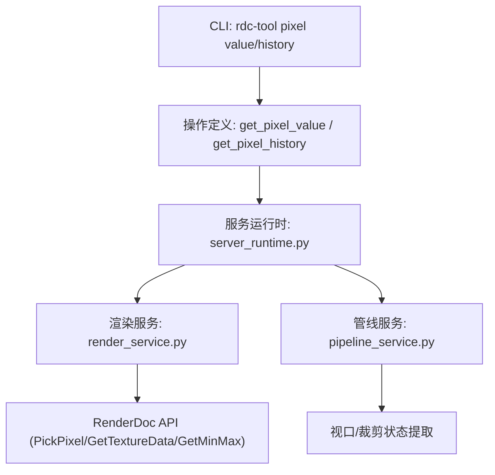
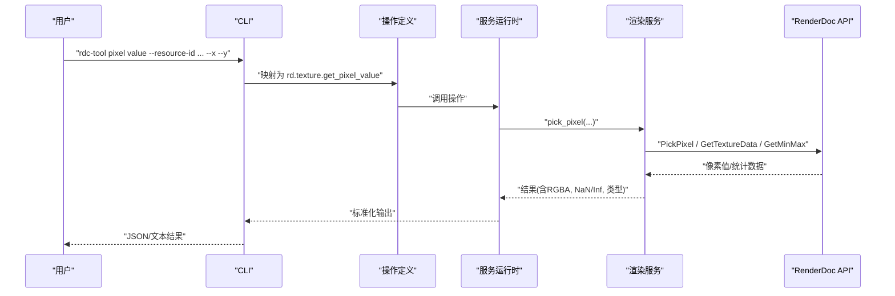
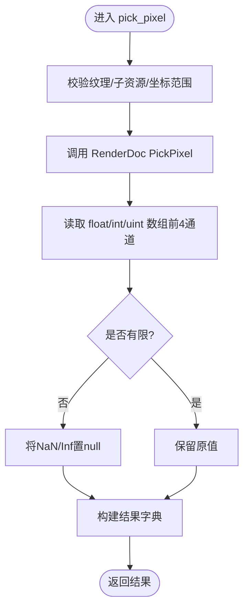
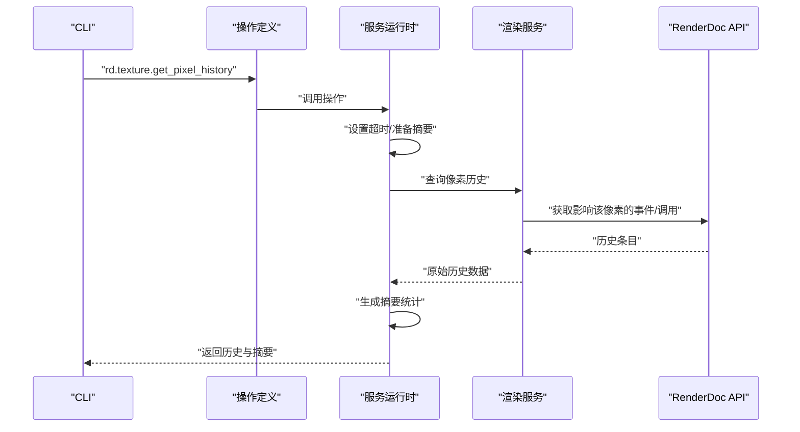
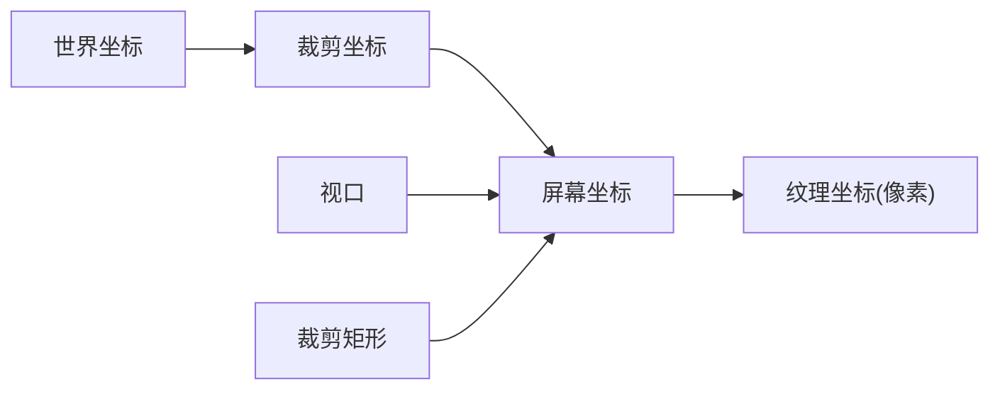
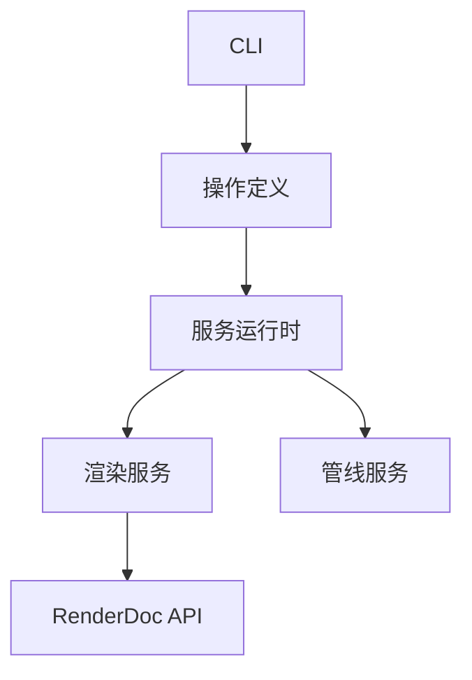

# 像素分析命令

<cite>
**本文引用的文件**
- [rdc_tool/cli.py](file://rdc_tool/cli.py)
- [rdc_tool/operation_definitions.py](file://rdc_tool/operation_definitions.py)
- [rdc_tool/core/render_service.py](file://rdc_tool/core/render_service.py)
- [rdc_tool/server_runtime.py](file://rdc_tool/server_runtime.py)
- [rdc_tool/core/pipeline_service.py](file://rdc_tool/core/pipeline_service.py)
- [rdc_tool/core/verifiers.py](file://rdc_tool/core/verifiers.py)
</cite>

## 目录
1. [简介](#简介)
2. [项目结构](#项目结构)
3. [核心组件](#核心组件)
4. [架构总览](#架构总览)
5. [详细组件分析](#详细组件分析)
6. [依赖关系分析](#依赖关系分析)
7. [性能注意事项](#性能注意事项)
8. [故障排查指南](#故障排查指南)
9. [结论](#结论)
10. [附录](#附录)

## 简介
本文件面向使用 RDC-Tool（rdc）进行渲染调试与像素级分析的工程师，系统化说明以下能力：
- rdc-tool pixel value：读取指定坐标的像素值，支持 RGBA 等颜色格式与多种数值类型。
- rdc-tool pixel history：追踪某像素的历史变化，定位影响该像素的绘制调用或调度，支持时间序列分析。
- 坐标系统定义与转换：屏幕坐标、世界坐标、裁剪坐标与纹理采样坐标的关系。
- 实际使用示例：分析特定像素的颜色变化、追踪渲染错误来源、对比不同帧的像素差异。
- 精度与浮点表示：像素值的精度、NaN/Inf 处理与归一化策略。
- 性能优化建议与最佳实践：如何高效、稳定地执行像素分析与历史回溯。

## 项目结构
围绕像素分析的关键代码分布在 CLI 入口、操作定义、渲染服务与服务运行时中：
- CLI 层提供 rdc-tool pixel value/history 子命令与参数解析。
- 操作定义层声明 rd.texture.get_pixel_value 与 rd.texture.get_pixel_history 的能力、参数与返回结构。
- 渲染服务层实现像素读取、区域读取、统计计算与图像导出。
- 服务运行时层将操作映射到具体实现，并封装像素历史查询的超时与摘要。
- 管线服务层提取视口与裁剪矩形，辅助坐标系统理解。

图表来源
- [rdc_tool/cli.py:1557-1566](file://rdc_tool/cli.py#L1557-L1566)
- [rdc_tool/operation_definitions.py:3807-3860](file://rdc_tool/operation_definitions.py#L3807-L3860)
- [rdc_tool/server_runtime.py:5136-5250](file://rdc_tool/server_runtime.py#L5136-L5250)
- [rdc_tool/core/render_service.py:800-873](file://rdc_tool/core/render_service.py#L800-L873)
- [rdc_tool/core/pipeline_service.py:302-320](file://rdc_tool/core/pipeline_service.py#L302-L320)

章节来源
- [rdc_tool/cli.py:1557-1566](file://rdc_tool/cli.py#L1557-L1566)
- [rdc_tool/operation_definitions.py:3807-3860](file://rdc_tool/operation_definitions.py#L3807-L3860)

## 核心组件
- rdc-tool pixel value
  - 通过 CLI 子命令解析参数（session_id、resource-id、x、y、event_id、format）。
  - 内部映射为 rd.texture.get_pixel_value 操作，读取纹理在指定坐标处的像素值。
  - 返回值包含 RGBA 分量、数值类型、NaN/Inf 标记，以及整数解释（当纹理为整数格式时）。
- rdc-tool pixel history
  - 通过 CLI 子命令解析参数（session_id、resource-id、x、y、event_id、format）。
  - 内部映射为 rd.texture.get_pixel_history 操作，获取当前活动事件下某像素的历史信息，包括影响该像素的绘制调用或调度。
  - 返回历史条目列表与摘要统计，便于时间序列分析。

章节来源
- [rdc_tool/cli.py:1557-1566](file://rdc_tool/cli.py#L1557-L1566)
- [rdc_tool/operation_definitions.py:3807-3860](file://rdc_tool/operation_definitions.py#L3807-L3860)
- [rdc_tool/operation_definitions.py:3746-3762](file://rdc_tool/operation_definitions.py#L3746-L3762)

## 架构总览
像素分析命令的执行路径如下：
- CLI 接收用户输入，构造参数并路由到对应操作。
- 操作定义描述接口契约（参数、返回、作用域、副作用）。
- 服务运行时根据操作名选择实现，必要时设置超时与摘要。
- 渲染服务调用 RenderDoc API 完成像素读取、区域读取、统计计算与图像导出。
- 管线服务提供视口与裁剪状态，辅助坐标系统理解与可视化叠加。

图表来源
- [rdc_tool/cli.py:1557-1566](file://rdc_tool/cli.py#L1557-L1566)
- [rdc_tool/operation_definitions.py:3807-3860](file://rdc_tool/operation_definitions.py#L3807-L3860)
- [rdc_tool/core/render_service.py:800-873](file://rdc_tool/core/render_service.py#L800-L873)

## 详细组件分析

### rdc-tool pixel value 组件
- 功能：读取指定纹理在给定坐标处的像素值，自动按纹理格式解码为 float4 或 int4。
- 关键参数：
  - session_id：会话标识。
  - texture_id：纹理资源 ID。
  - x、y：像素坐标（纹理空间）。
  - mip、slice、sample：子资源选择。
  - as_type：返回值类型（float、uint、int）。
  - event_id：重放事件；省略时使用当前会话事件。
- 返回值要点：
  - RGBA 分量（r/g/b/a），非有限值以 null 表示。
  - value_type：数值类型。
  - has_nan、has_inf：是否包含 NaN/Inf。
  - 整数解释字段（如 r_uint/g_uint/b_uint/a_uint），当纹理为整数格式时可用。
- 实现要点：
  - 通过 RenderDoc 的 PickPixel 获取像素值。
  - 对浮点数组进行有限性检查，避免 NaN/Inf 污染输出。
  - 支持多子资源与坐标边界校验。

图表来源
- [rdc_tool/core/render_service.py:800-873](file://rdc_tool/core/render_service.py#L800-L873)

章节来源
- [rdc_tool/operation_definitions.py:3807-3860](file://rdc_tool/operation_definitions.py#L3807-L3860)
- [rdc_tool/core/render_service.py:800-873](file://rdc_tool/core/render_service.py#L800-L873)

### rdc-tool pixel history 组件
- 功能：获取当前活动事件下某像素的历史信息，即哪些绘制调用或调度影响了该像素。
- 关键参数：
  - session_id、texture_id、x、y、mip、slice、sample。
  - include_shaders：是否包含着色器信息。
  - target：目标渲染目标（texture_id 或 rt_index）。
  - event_id：重放事件；省略时使用当前会话事件。
- 返回值要点：
  - history：历史条目列表（每个条目包含事件、调用信息等）。
  - summary：命中计数、时间跨度等摘要统计。
  - artifacts：可选产物（如可视化图）。
- 实现要点：
  - 服务运行时封装历史查询，提供超时保护与摘要生成。
  - 渲染服务负责与底层 API 交互，获取影响该像素的事件链。

图表来源
- [rdc_tool/operation_definitions.py:3746-3762](file://rdc_tool/operation_definitions.py#L3746-L3762)
- [rdc_tool/server_runtime.py:5136-5250](file://rdc_tool/server_runtime.py#L5136-L5250)

章节来源
- [rdc_tool/operation_definitions.py:3746-3762](file://rdc_tool/operation_definitions.py#L3746-L3762)
- [rdc_tool/server_runtime.py:5136-5250](file://rdc_tool/server_runtime.py#L5136-L5250)

### 坐标系统与转换
- 纹理坐标（像素坐标）：
  - 由 rdc-tool pixel value/history 的 x、y 指定，单位为 texel（纹理元素）。
  - 需考虑 mip/slice/sample 选择的子资源尺寸。
- 视口与裁剪：
  - 视口（viewport）定义渲染到屏幕的区域与深度范围。
  - 裁剪（scissor）进一步限制像素写入区域。
  - 可通过管线服务提取视口与裁剪矩形，辅助判断像素是否被写入。
- 屏幕坐标与世界坐标：
  - 屏幕坐标通常指最终输出图像的像素位置。
  - 世界坐标经投影变换后进入裁剪空间，再映射到屏幕坐标。
  - 若需从屏幕坐标反推纹理坐标，需结合视口与投影矩阵进行逆变换（工具未直接提供，但可借助叠加层与管线状态辅助分析）。

图表来源
- [rdc_tool/core/pipeline_service.py:302-320](file://rdc_tool/core/pipeline_service.py#L302-L320)

章节来源
- [rdc_tool/core/pipeline_service.py:302-320](file://rdc_tool/core/pipeline_service.py#L302-L320)

### 使用示例
- 读取特定像素的颜色变化：
  - 使用 rdc-tool pixel value 在多个事件上读取同一坐标的像素值，比较 RGBA 分量变化。
  - 关注 has_nan/has_inf，识别异常值来源。
- 追踪渲染错误的来源：
  - 使用 rdc-tool pixel history 获取影响该像素的事件链，定位导致异常的绘制调用或着色器阶段。
- 对比不同帧的像素差异：
  - 使用区域读取与统计计算（compute_stats）或直方图（get_histogram）进行全局或局部对比。
  - 结合差异验证器（image diff verifier）生成热力图与指标。

章节来源
- [rdc_tool/operation_definitions.py:3506-3520](file://rdc_tool/operation_definitions.py#L3506-L3520)
- [rdc_tool/core/verifiers.py:284-417](file://rdc_tool/core/verifiers.py#L284-L417)

## 依赖关系分析
- CLI 依赖操作定义以解析命令与参数。
- 操作定义依赖服务运行时以执行具体逻辑。
- 服务运行时依赖渲染服务与管线服务以访问底层 API 与状态。
- 渲染服务依赖 RenderDoc API 完成像素读取与统计。

图表来源
- [rdc_tool/cli.py:1557-1566](file://rdc_tool/cli.py#L1557-L1566)
- [rdc_tool/operation_definitions.py:3807-3860](file://rdc_tool/operation_definitions.py#L3807-L3860)
- [rdc_tool/server_runtime.py:5136-5250](file://rdc_tool/server_runtime.py#L5136-L5250)
- [rdc_tool/core/render_service.py:800-873](file://rdc_tool/core/render_service.py#L800-L873)
- [rdc_tool/core/pipeline_service.py:302-320](file://rdc_tool/core/pipeline_service.py#L302-L320)

章节来源
- [rdc_tool/cli.py:1557-1566](file://rdc_tool/cli.py#L1557-L1566)
- [rdc_tool/operation_definitions.py:3807-3860](file://rdc_tool/operation_definitions.py#L3807-L3860)
- [rdc_tool/server_runtime.py:5136-5250](file://rdc_tool/server_runtime.py#L5136-L5250)
- [rdc_tool/core/render_service.py:800-873](file://rdc_tool/core/render_service.py#L800-L873)
- [rdc_tool/core/pipeline_service.py:302-320](file://rdc_tool/core/pipeline_service.py#L302-L320)

## 性能注意事项
- 像素读取成本：
  - 单像素读取（PickPixel）开销较低，适合快速检查。
  - 区域读取与统计计算可能涉及大量数据搬运，建议使用 stride 降低处理成本。
- 历史查询耗时：
  - 像素历史可能遍历大量事件，服务运行时提供超时保护，避免长时间阻塞。
- 浮点归一化与编码：
  - 图像导出时对浮点数据进行归一化与裁剪，避免溢出与无效值。
- 最佳实践：
  - 优先使用最小必要区域与步长进行读取与分析。
  - 对高频分析任务，缓存中间结果并复用。
  - 使用统计与直方图进行快速健康检查，减少全量 readback。

章节来源
- [rdc_tool/core/render_service.py:198-233](file://rdc_tool/core/render_service.py#L198-L233)
- [rdc_tool/operation_definitions.py:3861-3916](file://rdc_tool/operation_definitions.py#L3861-L3916)
- [rdc_tool/server_runtime.py:5162-5178](file://rdc_tool/server_runtime.py#L5162-L5178)

## 故障排查指南
- 像素读回失败：
  - 检查纹理是否存在、子资源是否有效、坐标是否在范围内。
  - 查看错误信息中的状态码与消息，定位 RenderDoc 调用失败阶段。
- 历史查询超时：
  - 调整超时参数或缩小查询范围（如限定事件区间）。
  - 使用摘要统计评估命中情况，避免全量扫描。
- 坐标不匹配：
  - 确认使用的坐标系统（纹理坐标 vs 屏幕坐标）。
  - 结合视口与裁剪状态，判断像素是否被写入。

章节来源
- [rdc_tool/core/render_service.py:828-834](file://rdc_tool/core/render_service.py#L828-L834)
- [rdc_tool/server_runtime.py:5162-5178](file://rdc_tool/server_runtime.py#L5162-L5178)
- [rdc_tool/core/pipeline_service.py:302-320](file://rdc_tool/core/pipeline_service.py#L302-L320)

## 结论
RDC-Tool 提供了强大的像素分析能力，涵盖单像素读取、历史追踪、区域统计与图像导出。通过清晰的命令接口与稳健的服务实现，用户可以高效定位渲染问题、分析像素变化趋势，并结合坐标系统与管线状态进行综合诊断。遵循性能优化建议与最佳实践，可在大规模场景中保持稳定的分析效率。

## 附录
- 相关命令与操作：
  - rdc-tool pixel value -> rd.texture.get_pixel_value
  - rdc-tool pixel history -> rd.texture.get_pixel_history
  - 区域读取 -> rd.texture.get_region_values
  - 统计计算 -> rd.texture.compute_stats
  - 直方图 -> rd.texture.get_histogram
- 参考文件路径：
  - [rdc_tool/cli.py:1557-1566](file://rdc_tool/cli.py#L1557-L1566)
  - [rdc_tool/operation_definitions.py:3807-3860](file://rdc_tool/operation_definitions.py#L3807-L3860)
  - [rdc_tool/core/render_service.py:800-873](file://rdc_tool/core/render_service.py#L800-L873)
  - [rdc_tool/server_runtime.py:5136-5250](file://rdc_tool/server_runtime.py#L5136-L5250)
  - [rdc_tool/core/pipeline_service.py:302-320](file://rdc_tool/core/pipeline_service.py#L302-L320)