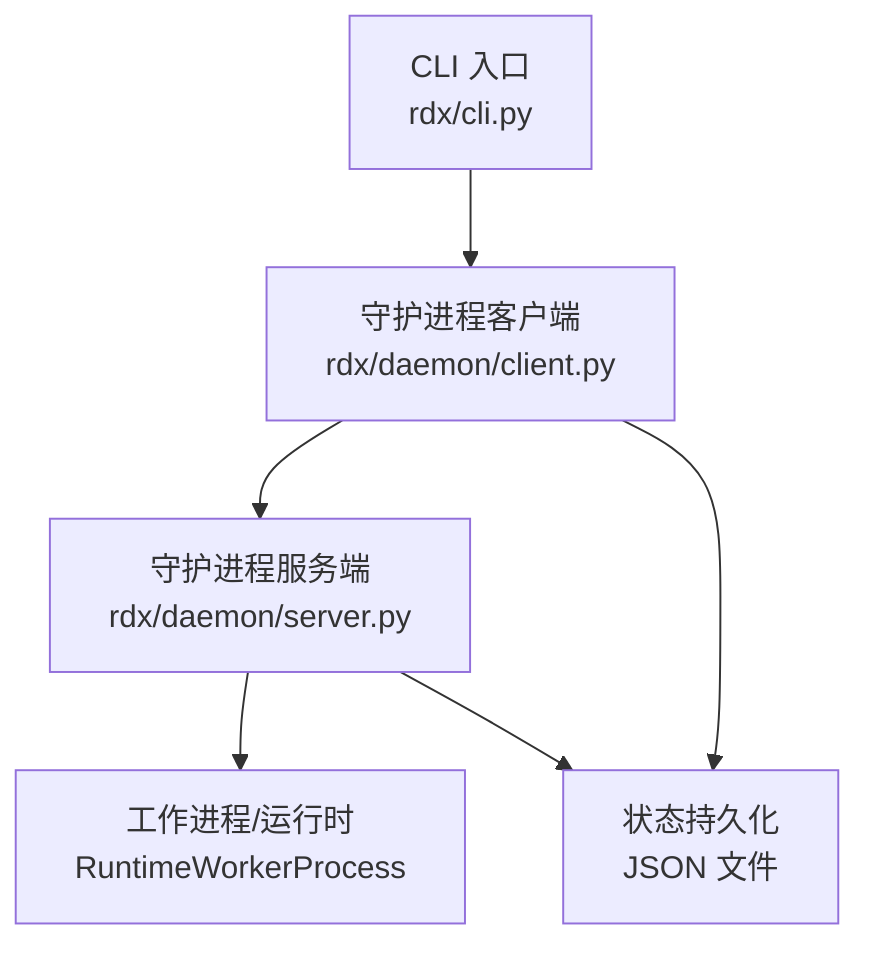
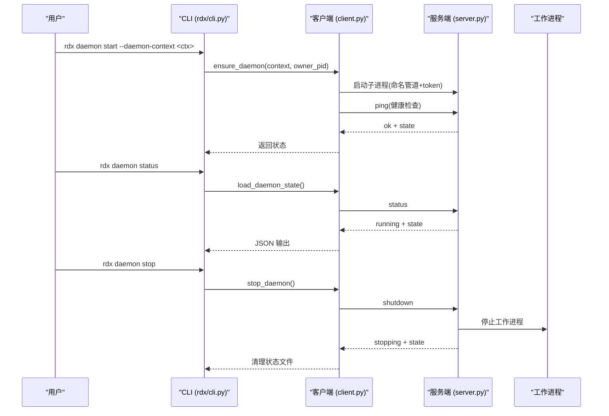
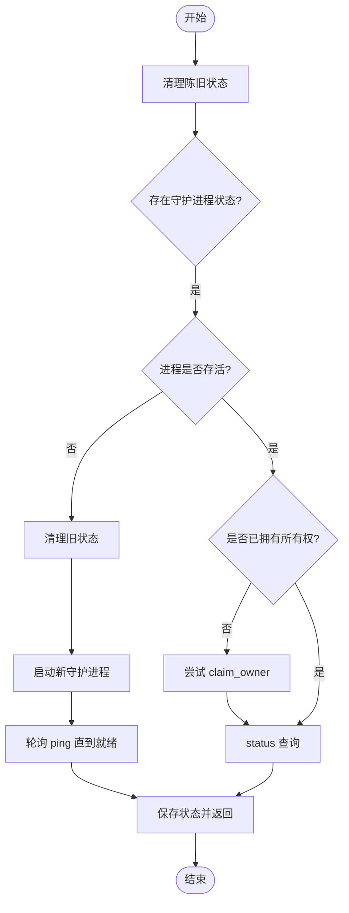
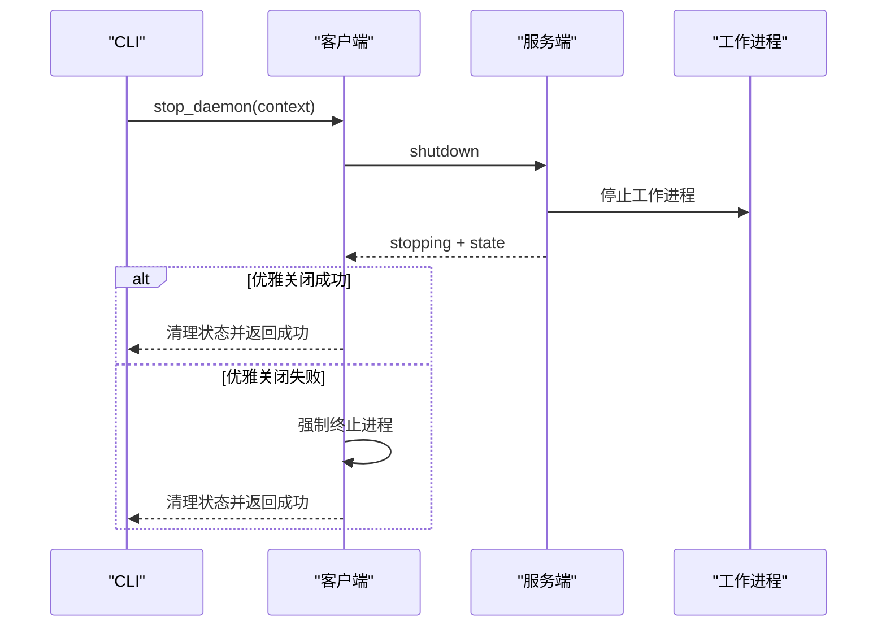
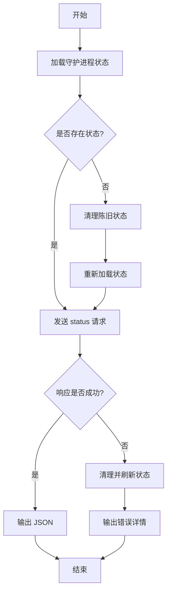
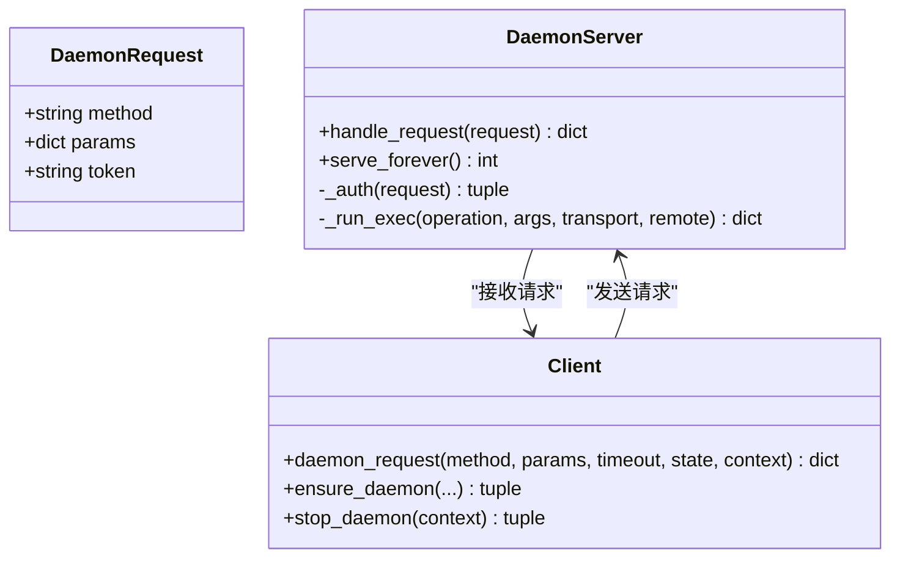
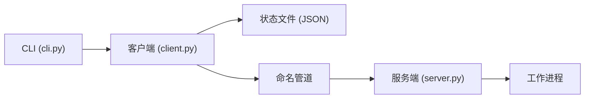

# 守护进程管理命令

<cite>
**本文引用的文件**
- [rdx/cli.py](file://rdx/cli.py)
- [rdx/daemon/server.py](file://rdx/daemon/server.py)
- [rdx/daemon/client.py](file://rdx/daemon/client.py)
- [tests/test_cli_daemon_status.py](file://tests/test_cli_daemon_status.py)
- [tests/test_daemon_client.py](file://tests/test_daemon_client.py)
</cite>

## 目录
1. [简介](#简介)
2. [项目结构](#项目结构)
3. [核心组件](#核心组件)
4. [架构总览](#架构总览)
5. [详细组件分析](#详细组件分析)
6. [依赖关系分析](#依赖关系分析)
7. [性能与超时](#性能与超时)
8. [故障排查指南](#故障排查指南)
9. [结论](#结论)
10. [附录：参数与示例](#附录参数与示例)

## 简介
本文件面向“守护进程管理命令”，围绕以下目标展开：
- rdx daemon start：启动后台服务进程，支持 --daemon-context 指定上下文。
- rdx daemon stop：停止守护进程，包含优雅关闭与资源清理。
- rdx daemon status：检查守护进程运行状态与健康状况。
- 自动化脚本中的生命周期管理、监控、异常处理。
- 守护进程的通信协议、错误恢复机制与性能监控要点。

## 项目结构
守护进程相关代码主要分布在三个模块：
- CLI入口与命令路由：rdx/cli.py
- 守护进程服务端：rdx/daemon/server.py
- 守护进程客户端与状态管理：rdx/daemon/client.py
- 测试用例覆盖关键行为：tests/test_cli_daemon_status.py、tests/test_daemon_client.py

图表来源
- [rdx/cli.py:1634-1653](file://rdx/cli.py#L1634-L1653)
- [rdx/daemon/client.py:623-733](file://rdx/daemon/client.py#L623-L733)
- [rdx/daemon/server.py:657-690](file://rdx/daemon/server.py#L657-L690)

章节来源
- [rdx/cli.py:62-104](file://rdx/cli.py#L62-L104)
- [rdx/daemon/server.py:693-723](file://rdx/daemon/server.py#L693-L723)
- [rdx/daemon/client.py:22-29](file://rdx/daemon/client.py#L22-L29)

## 核心组件
- CLI 命令层：解析命令行参数，调用守护进程客户端完成 start/stop/status。
- 守护进程客户端：负责启动/连接/心跳/清理/停止，维护本地状态文件。
- 守护进程服务端：基于命名管道提供 RPC（ping/status/shutdown/exec/attach/detach/heartbeat/clear_context/get_state/set_state），并维护上下文、会话、活动操作等状态。
- 工作进程：由守护进程按需启动，执行具体工具操作。

章节来源
- [rdx/cli.py:243-264](file://rdx/cli.py#L243-L264)
- [rdx/daemon/client.py:467-515](file://rdx/daemon/client.py#L467-L515)
- [rdx/daemon/server.py:572-643](file://rdx/daemon/server.py#L572-L643)

## 架构总览
守护进程通过 Windows 命名管道进行进程间通信，CLI 作为客户端通过 token 认证后发送请求；服务端维护多上下文、多会话、活动操作、空闲超时与租约过期策略，并在必要时自动回收。

图表来源
- [rdx/cli.py:1634-1653](file://rdx/cli.py#L1634-L1653)
- [rdx/daemon/client.py:623-733](file://rdx/daemon/client.py#L623-L733)
- [rdx/daemon/server.py:572-643](file://rdx/daemon/server.py#L572-L643)
- [rdx/daemon/server.py:693-723](file://rdx/daemon/server.py#L693-L723)

## 详细组件分析

### 守护进程启动流程（rdx daemon start）
- CLI 在收到 daemon start 后，先清理陈旧状态，再调用 ensure_daemon 尝试启动或复用已有守护进程。
- ensure_daemon 会：
  - 加载上下文对应的守护进程状态文件。
  - 若进程仍在运行且未设置 owner，则尝试 claim_owner。
  - 若不存在或未运行，则启动新的守护进程子进程，写入临时状态，轮询 ping 直到就绪。
  - 成功后更新本地状态文件并返回。

图表来源
- [rdx/daemon/client.py:623-733](file://rdx/daemon/client.py#L623-L733)
- [rdx/cli.py:1634-1645](file://rdx/cli.py#L1634-L1645)

章节来源
- [rdx/cli.py:1634-1645](file://rdx/cli.py#L1634-L1645)
- [rdx/daemon/client.py:623-733](file://rdx/daemon/client.py#L623-L733)

### 守护进程停止流程（rdx daemon stop）
- CLI 调用 stop_daemon，优先尝试通过命名管道发送 shutdown 请求，等待进程退出。
- 若优雅关闭失败，则强制终止守护进程及其工作进程，并清理状态文件。
- 停止过程中会按上下文隔离清理，避免影响其他上下文。

图表来源
- [rdx/daemon/client.py:874-901](file://rdx/daemon/client.py#L874-L901)
- [rdx/daemon/server.py:227-245](file://rdx/daemon/server.py#L227-L245)
- [rdx/cli.py:1646-1650](file://rdx/cli.py#L1646-L1650)

章节来源
- [rdx/daemon/client.py:874-901](file://rdx/daemon/client.py#L874-L901)
- [rdx/daemon/server.py:227-245](file://rdx/daemon/server.py#L227-L245)
- [rdx/cli.py:1646-1650](file://rdx/cli.py#L1646-L1650)

### 守护进程状态查询（rdx daemon status）
- CLI 先加载本地状态文件，若不存在则尝试清理陈旧状态后再加载。
- 向守护进程发送 status 请求，获取 running 标志与完整 state。
- 若通信失败，会再次尝试清理并返回干净的状态或错误信息。

图表来源
- [rdx/cli.py:267-308](file://rdx/cli.py#L267-L308)
- [rdx/daemon/server.py:589-591](file://rdx/daemon/server.py#L589-L591)

章节来源
- [rdx/cli.py:267-308](file://rdx/cli.py#L267-L308)
- [tests/test_cli_daemon_status.py:9-33](file://tests/test_cli_daemon_status.py#L9-L33)

### 通信协议与认证
- 传输：Windows 命名管道，地址格式为 \\.\pipe\<pipe_name>。
- 认证：每个请求携带 token，服务端校验通过后处理。
- 方法：
  - ping：健康检查，返回 pong 与 context_id。
  - status：返回 running 与当前 state。
  - shutdown：触发优雅关闭。
  - exec：转发到工作进程执行具体 operation。
  - attach_client / heartbeat / detach_client：客户端生命周期管理。
  - get_state / set_state：读写守护进程内部状态。
  - clear_context：清理上下文快照与状态。

图表来源
- [rdx/daemon/server.py:572-643](file://rdx/daemon/server.py#L572-L643)
- [rdx/daemon/client.py:467-515](file://rdx/daemon/client.py#L467-L515)

章节来源
- [rdx/daemon/server.py:166-169](file://rdx/daemon/server.py#L166-L169)
- [rdx/daemon/server.py:572-643](file://rdx/daemon/server.py#L572-L643)
- [rdx/daemon/client.py:467-515](file://rdx/daemon/client.py#L467-L515)

### 错误恢复与自动清理
- 租约与空闲超时：守护进程周期性检查 attached_clients 的心跳与租约，超过阈值则剔除；若无活跃客户端且长时间无活动，则自动停止。
- 所有者丢失：当 owner_pid 丢失且租约过期，守护进程将停止。
- 陈旧状态清理：客户端在启动前会清理无效/损坏的守护进程状态文件，避免僵尸状态。
- 停止失败回退：优雅关闭失败时强制终止进程并清理状态。

章节来源
- [rdx/daemon/server.py:181-211](file://rdx/daemon/server.py#L181-L211)
- [rdx/daemon/server.py:532-570](file://rdx/daemon/server.py#L532-L570)
- [rdx/daemon/client.py:402-464](file://rdx/daemon/client.py#L402-L464)
- [rdx/daemon/client.py:554-606](file://rdx/daemon/client.py#L554-L606)
- [rdx/daemon/client.py:874-901](file://rdx/daemon/client.py#L874-L901)

### 性能监控与可观测性
- 活动操作跟踪：守护进程维护 active_operation，记录 operation、trace_id、stage、进度百分比等，便于定位长耗时任务。
- 请求计数：active_request_count 反映并发度。
- 时间戳：started_at、last_activity_at 用于空闲检测与日志分析。
- 超时策略：exec 请求有独立超时，超出抛出结构化异常并附带诊断信息。

章节来源
- [rdx/daemon/server.py:259-285](file://rdx/daemon/server.py#L259-L285)
- [rdx/daemon/server.py:452-492](file://rdx/daemon/server.py#L452-L492)
- [rdx/daemon/client.py:49-65](file://rdx/daemon/client.py#L49-L65)
- [rdx/daemon/client.py:49-65](file://rdx/daemon/client.py#L49-L65)

## 依赖关系分析
- CLI 依赖守护进程客户端接口，不直接操作命名管道。
- 客户端封装了状态持久化、进程发现、重试与清理逻辑。
- 服务端依赖工作进程执行实际业务，并通过线程池处理多个连接。
- 状态文件位于运行时目录，按上下文隔离存储。

图表来源
- [rdx/cli.py:1634-1653](file://rdx/cli.py#L1634-L1653)
- [rdx/daemon/client.py:623-733](file://rdx/daemon/client.py#L623-L733)
- [rdx/daemon/server.py:657-690](file://rdx/daemon/server.py#L657-L690)

章节来源
- [rdx/daemon/client.py:22-29](file://rdx/daemon/client.py#L22-L29)
- [rdx/daemon/server.py:102-164](file://rdx/daemon/server.py#L102-L164)

## 性能与超时
- 默认租约超时：120 秒（DEFAULT_LEASE_TIMEOUT_S）。
- 默认空闲超时：900 秒（DEFAULT_IDLE_TIMEOUT_S）。
- 请求超时：daemon_request 默认 10 秒，可通过参数调整；exec 超时由策略函数决定。
- 建议：
  - 在自动化脚本中为长耗时操作设置合理超时。
  - 使用 --daemon-context 隔离不同任务，避免共享上下文导致的竞争。
  - 监控 active_request_count 与 active_operation 以识别瓶颈。

章节来源
- [rdx/daemon/client.py:25-28](file://rdx/daemon/client.py#L25-L28)
- [rdx/daemon/client.py:467-515](file://rdx/daemon/client.py#L467-L515)
- [rdx/daemon/server.py:118-125](file://rdx/daemon/server.py#L118-L125)

## 故障排查指南
- 无法连接守护进程：
  - 检查是否存在有效的守护进程状态文件。
  - 若通信失败，CLI 会自动清理陈旧状态并重试。
- 守护进程无响应：
  - 查看 active_request_count 与 active_operation，确认是否有阻塞任务。
  - 使用 rdx daemon status 获取最新状态。
- 停止失败：
  - 优雅关闭失败时会强制终止进程并清理状态。
  - 若仍有残留进程，可使用系统工具终止。
- 上下文污染：
  - 使用 --daemon-context 隔离上下文。
  - 使用 rdx context clear 清理上下文快照与状态。

章节来源
- [rdx/cli.py:267-308](file://rdx/cli.py#L267-L308)
- [rdx/daemon/client.py:554-606](file://rdx/daemon/client.py#L554-L606)
- [rdx/daemon/client.py:874-901](file://rdx/daemon/client.py#L874-L901)

## 结论
RDX 守护进程管理命令提供了完整的生命周期管理能力：
- start：智能启动或复用守护进程，支持上下文隔离。
- stop：优雅关闭与强制终止结合，确保资源释放。
- status：健康检查与状态可视化，便于监控与排障。
配合超时、租约与空闲策略，系统在自动化环境中具备高可用性与可观测性。

## 附录：参数与示例

### 命令与参数
- rdx daemon start
  - --daemon-context <id>：指定守护进程上下文，默认 default。
  - --pipe-name：自定义命名管道后缀（通常由客户端生成）。
  - 行为：清理陈旧状态，启动或复用守护进程，返回状态。
- rdx daemon stop
  - --daemon-context <id>：指定要停止的上下文。
  - 行为：发送 shutdown，等待退出，失败则强制终止并清理。
- rdx daemon status
  - --daemon-context <id>：指定要查询的上下文。
  - 行为：读取本地状态，远程查询守护进程状态，输出 JSON。

### 使用示例
- 启动特定上下文：
  - rdx --daemon-context local daemon start
- 查询状态：
  - rdx --daemon-context local daemon status
- 停止守护进程：
  - rdx --daemon-context local daemon stop

### 自动化脚本建议
- 启动前先清理陈旧状态，再调用 start。
- 对长耗时操作设置超时，捕获异常并记录 active_operation。
- 定期调用 status 监控 running 与 active_request_count。
- 停止时使用 stop，若失败则强制终止并清理状态。

章节来源
- [rdx/cli.py:62-104](file://rdx/cli.py#L62-L104)
- [rdx/cli.py:1634-1653](file://rdx/cli.py#L1634-L1653)
- [rdx/daemon/client.py:623-733](file://rdx/daemon/client.py#L623-L733)
- [rdx/daemon/client.py:874-901](file://rdx/daemon/client.py#L874-L901)