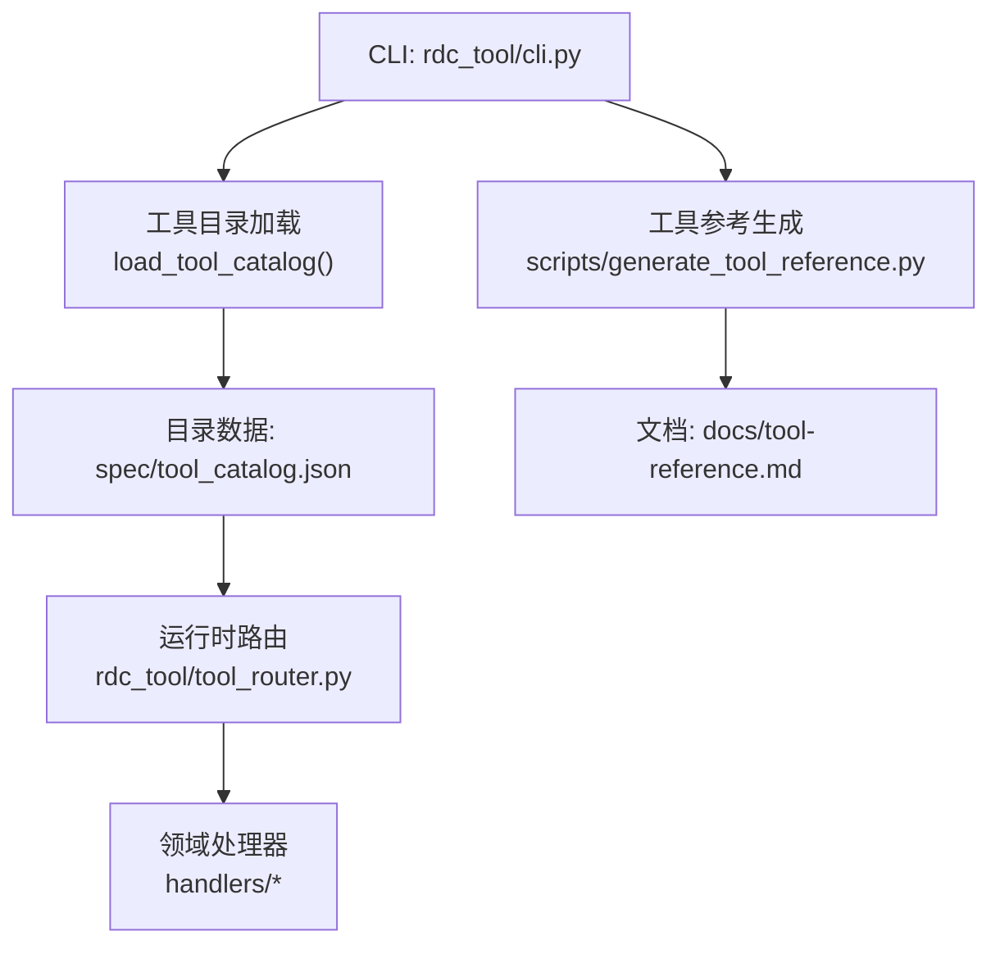
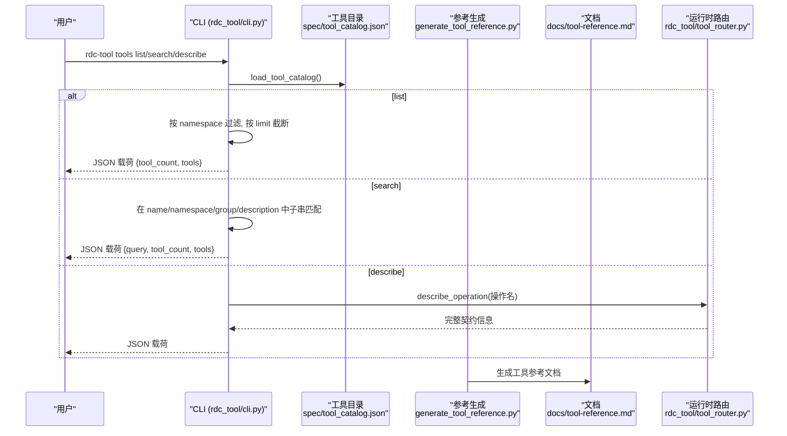
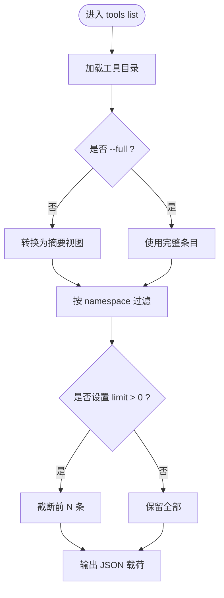
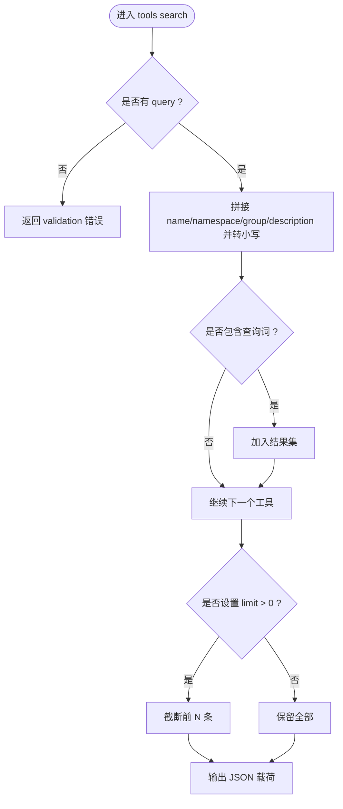
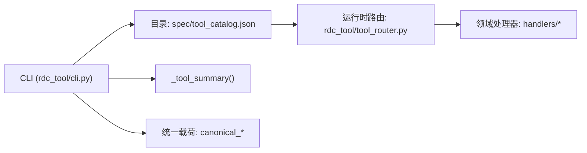

# 工具管理命令

<cite>
**本文引用的文件**
- [rdc_tool/cli.py](file://rdc_tool/cli.py)
- [spec/tool_catalog.json](file://spec/tool_catalog.json)
- [docs/tools.md](file://docs/tools.md)
- [docs/tool-reference.md](file://docs/tool-reference.md)
- [scripts/generate_tool_reference.py](file://scripts/generate_tool_reference.py)
- [rdc_tool/operation_definitions.py](file://rdc_tool/operation_definitions.py)
- [rdc_tool/tool_router.py](file://rdc_tool/tool_router.py)
</cite>

## 目录
1. [简介](#简介)
2. [项目结构](#项目结构)
3. [核心组件](#核心组件)
4. [架构总览](#架构总览)
5. [详细组件分析](#详细组件分析)
6. [依赖关系分析](#依赖关系分析)
7. [性能与使用建议](#性能与使用建议)
8. [故障排查指南](#故障排查指南)
9. [结论](#结论)
10. [附录：参数说明与示例](#附录参数说明与示例)

## 简介
本文件面向“工具管理”相关命令，覆盖以下能力：
- rdc-tool tools list：列出所有可用工具，支持按命名空间过滤和限制返回数量。
- rdc-tool tools search：基于关键词对工具进行模糊搜索（名称、命名空间、分组、描述）。
- rdc-tool tools describe：获取指定工具的完整契约信息（参数、返回值、前置条件、作用域与影响等）。
同时说明工具目录的结构与组织方式，以及如何通过代码定义与生成流程添加或扩展工具，便于发现新工具、批量获取工具信息以及集成到自动化工作流中。

## 项目结构
工具管理命令由 CLI 层解析参数并调用工具目录加载与摘要函数；工具目录来源于结构化定义并通过脚本生成参考文档。关键路径如下：
- CLI 命令实现：rdc_tool/cli.py
- 工具目录数据：spec/tool_catalog.json（由 operation_definitions.py 生成）
- 工具参考文档：docs/tool-reference.md（由 scripts/generate_tool_reference.py 生成）
- 操作定义源：rdc_tool/operation_definitions.py
- 运行时路由与前置条件校验：rdc_tool/tool_router.py

图表来源
- [rdc_tool/cli.py:694-750](file://rdc_tool/cli.py#L694-L750)
- [scripts/generate_tool_reference.py:68-113](file://scripts/generate_tool_reference.py#L68-L113)
- [rdc_tool/tool_router.py:131-154](file://rdc_tool/tool_router.py#L131-L154)

章节来源
- [docs/tools.md:1-19](file://docs/tools.md#L1-L19)
- [docs/tool-reference.md:1-10](file://docs/tool-reference.md#L1-L10)

## 核心组件
- 工具列表命令（tools list）
  - 功能：列出所有工具；可选 --namespace 精确匹配命名空间；可选 --limit 限制返回数量；默认返回摘要视图，--full 可返回完整条目。
  - 输出：包含 tool_count、fingerprint、schema_version 与 tools 列表。
- 工具搜索命令（tools search）
  - 功能：在工具的名称、命名空间、分组、描述中进行子串匹配；支持 --limit 限制结果数。
  - 错误处理：未提供查询时返回明确的 validation 错误。
- 工具描述命令（tools describe）
  - 功能：根据操作名返回完整契约信息（参数、返回值、前置条件、作用域、影响、证据类型、路径输入等）。
  - 用途：用于自动化工作流中按需拉取单个工具的详细说明。

章节来源
- [rdc_tool/cli.py:694-750](file://rdc_tool/cli.py#L694-L750)
- [rdc_tool/cli.py:1408-1417](file://rdc_tool/cli.py#L1408-L1417)
- [docs/tools.md:16-19](file://docs/tools.md#L16-L19)

## 架构总览
工具管理命令的调用链与数据流如下：
- CLI 解析参数后调用 load_tool_catalog() 获取工具目录。
- tools list 根据 namespace 过滤并按 limit 截断，封装为统一成功载荷输出。
- tools search 将查询转为小写并在 name/namespace/group/description 字段中做子串匹配，再按 limit 截断。
- tools describe 通过 describe_operation 获取指定操作的完整元数据。
- 工具目录由 operation_definitions.py 定义，经 generate_tool_reference.py 生成 docs/tool-reference.md。
- 运行时执行时，tool_router 从目录构建注册表，校验参数与前置条件，再分发到具体领域处理器。

图表来源
- [rdc_tool/cli.py:694-750](file://rdc_tool/cli.py#L694-L750)
- [scripts/generate_tool_reference.py:68-113](file://scripts/generate_tool_reference.py#L68-L113)
- [rdc_tool/tool_router.py:131-154](file://rdc_tool/tool_router.py#L131-L154)

## 详细组件分析

### 工具列表（rdc-tool tools list）
- 行为
  - 默认返回摘要视图（name、namespace、group、description、param_names、prerequisites）。
  - 传入 --full 返回完整条目（包含 input_schema、returns_raw、effects、scope 等）。
  - 支持 --namespace 精确匹配命名空间（如 capture、pipeline、buffer 等）。
  - 支持 --limit 限制返回数量（0 表示不限制）。
- 输出结构
  - result_kind: rdc_tool.tools.list
  - data.tool_count: 工具数量
  - data.fingerprint: 目录指纹（可用于冻结版本）
  - data.schema_version: 目录 schema 版本
  - data.tools: 工具列表（摘要或完整）

图表来源
- [rdc_tool/cli.py:694-713](file://rdc_tool/cli.py#L694-L713)

章节来源
- [rdc_tool/cli.py:694-713](file://rdc_tool/cli.py#L694-L713)
- [rdc_tool/cli.py:1408-1410](file://rdc_tool/cli.py#L1408-L1410)

### 工具搜索（rdc-tool tools search）
- 行为
  - 必须提供 query；否则返回 validation 错误。
  - 在 name、namespace、group、description 四个字段拼接后做小写子串匹配。
  - 支持 --limit 限制结果数量（默认 20）。
- 输出结构
  - result_kind: rdc_tool.tools.search
  - data.query: 查询词
  - data.tool_count: 匹配数量
  - data.tools: 匹配到的工具摘要

图表来源
- [rdc_tool/cli.py:716-750](file://rdc_tool/cli.py#L716-L750)

章节来源
- [rdc_tool/cli.py:716-750](file://rdc_tool/cli.py#L716-L750)
- [rdc_tool/cli.py:1414-1417](file://rdc_tool/cli.py#L1414-L1417)

### 工具描述（rdc-tool tools describe）
- 行为
  - 根据操作名（如 rd.core.get_capabilities）返回该工具的完整契约信息。
  - 包括参数定义、返回值、前置条件、作用域、影响、证据类型、路径输入等。
- 典型用途
  - 自动化工作流中按需拉取某个工具的详细说明，结合参数校验与执行。
  - 与 tools list/search 配合，先发现工具，再按需描述。

章节来源
- [docs/tools.md:16-19](file://docs/tools.md#L16-L19)
- [docs/tool-reference.md:1-10](file://docs/tool-reference.md#L1-L10)

### 工具目录结构与组织
- 目录来源
  - 单一事实来源：rdc_tool/operation_definitions.py 定义了所有 rd.* 操作及其约束、前置条件、作用域、影响等。
  - 生成产物：spec/tool_catalog.json 是供 CLI 与运行时使用的目录数据。
  - 文档产物：docs/tool-reference.md 由脚本生成，便于阅读与检索。
- 分组与命名空间
  - 每个工具属于一个 group（如“捕获文件与 Replay Session”、“核心与环境管理”等）。
  - 每个工具有一个 namespace（如 buffer、capture、core、pipeline 等），用于分类与过滤。
- 工具命名规范
  - 工具名以 rd. 开头，格式为 rd.<domain>.<action>，例如 rd.capture.open_file。

章节来源
- [docs/tools.md:1-4](file://docs/tools.md#L1-L4)
- [spec/tool_catalog.json:1-25](file://spec/tool_catalog.json#L1-L25)
- [rdc_tool/operation_definitions.py:490-504](file://rdc_tool/operation_definitions.py#L490-L504)

### 如何添加自定义工具
- 步骤概览
  - 在 rdc_tool/operation_definitions.py 中添加新的操作定义，包含 name、group、description、parameter_raw、returns_raw、input_schema、prerequisites、scope、effects、evidence_kind、path_inputs、namespace 等字段。
  - 运行脚本生成目录与参考文档：python -B scripts/generate_tool_reference.py。
  - 验证目录：可使用 spec/validate_catalog.py 检查唯一性、命名规范与可读性。
  - 若需要运行时路由，确保 domain 映射存在（tool_router 中的 _DOMAIN_HANDLERS），并将 action 分发到对应 handlers。
- 注意事项
  - 工具名必须以 rd. 开头且符合 rd.<domain>.<action> 三段式。
  - 新增工具需明确 prerequisites（如 session_id、capture_file_id、remote_id 等）以确保执行顺序正确。
  - 更新 input_schema 以约束参数类型、枚举、默认值与范围。
  - 保持 description 与 parameter_raw 的一致性，便于自动生成文档与搜索。

章节来源
- [scripts/generate_tool_reference.py:68-113](file://scripts/generate_tool_reference.py#L68-L113)
- [spec/validate_catalog.py:127-157](file://spec/validate_catalog.py#L127-L157)
- [rdc_tool/tool_router.py:34-54](file://rdc_tool/tool_router.py#L34-L54)
- [rdc_tool/tool_router.py:131-154](file://rdc_tool/tool_router.py#L131-L154)

## 依赖关系分析
- CLI 依赖
  - 工具目录加载：load_tool_catalog() 读取 spec/tool_catalog.json。
  - 摘要转换：_tool_summary() 将完整条目转换为轻量摘要。
  - 输出封装：canonical_success/canonical_error 统一载荷格式。
- 运行时依赖
  - 路由与校验：tool_router 根据目录构建 OperationRegistry，校验参数与前置条件后分发到 handlers。
  - 领域处理器：各 handlers 模块实现具体业务逻辑（buffer、capture、core、pipeline 等）。

图表来源
- [rdc_tool/cli.py:397-407](file://rdc_tool/cli.py#L397-L407)
- [rdc_tool/tool_router.py:131-154](file://rdc_tool/tool_router.py#L131-L154)

章节来源
- [rdc_tool/cli.py:397-407](file://rdc_tool/cli.py#L397-L407)
- [rdc_tool/tool_router.py:131-154](file://rdc_tool/tool_router.py#L131-L154)

## 性能与使用建议
- 列表与搜索
  - 使用 --namespace 精确过滤可减少结果量，提升后续处理效率。
  - 使用 --limit 控制返回规模，避免一次性加载过多工具。
- 搜索策略
  - 优先使用 tools list --namespace 获取某领域全量清单，再结合 tools search 进行关键词筛选。
  - 对于复杂需求，可通过 tools describe 获取完整契约后再自动化调用。
- 自动化集成
  - 使用 JSON 作为稳定协议，便于程序解析与流水线集成。
  - 利用 fingerprint 与 schema_version 锁定目录版本，保证执行环境一致性。

[本节为通用指导，无需特定文件引用]

## 故障排查指南
- 搜索无结果
  - 确认 query 非空；为空会返回 validation 错误。
  - 尝试扩大搜索范围或使用 tools list --namespace 缩小领域。
- 列表结果为空
  - 检查目录加载是否成功；查看 catalog payload 的 fingerprint 与 schema_version。
  - 确认是否存在权限或路径问题导致无法读取目录。
- 描述命令失败
  - 确认操作名是否正确（如 rd.core.get_capabilities）。
  - 检查工具是否已注册到目录中。

章节来源
- [rdc_tool/cli.py:716-728](file://rdc_tool/cli.py#L716-L728)
- [rdc_tool/cli.py:694-713](file://rdc_tool/cli.py#L694-L713)

## 结论
工具管理命令提供了统一的发现、检索与描述能力，配合结构化目录与生成流程，能够高效地支持人工使用与自动化集成。通过 namespace 过滤、limit 限制与关键词搜索，可以快速定位所需工具；通过 describe 获取完整契约，便于在流水线中安全调用。目录与文档的生成机制保证了定义与输出的同步，降低了维护成本。

[本节为总结，无需特定文件引用]

## 附录：参数说明与示例

### rdc-tool tools list
- 参数
  - --namespace：按命名空间过滤（如 capture、pipeline、buffer）。
  - --limit：最大返回数量（0 表示不限制）。
  - --full：返回完整条目（含 input_schema、returns_raw、effects 等）。
- 示例
  - 列出所有工具摘要：rdc-tool tools list --json
  - 仅列出 capture 命名空间的前 10 个工具：rdc-tool tools list --namespace capture --limit 10 --json
  - 列出 pipeline 命名空间的完整条目：rdc-tool tools list --namespace pipeline --full --json

章节来源
- [rdc_tool/cli.py:694-713](file://rdc_tool/cli.py#L694-L713)
- [rdc_tool/cli.py:1408-1410](file://rdc_tool/cli.py#L1408-L1410)
- [docs/tools.md:5-10](file://docs/tools.md#L5-L10)

### rdc-tool tools search
- 参数
  - query：必填，关键词（大小写不敏感）。
  - --limit：最大返回数量（默认 20）。
- 示例
  - 搜索包含 texture 的工具：rdc-tool tools search texture --json
  - 搜索 capture 相关工具并限制 5 条：rdc-tool tools search capture --limit 5 --json

章节来源
- [rdc_tool/cli.py:716-750](file://rdc_tool/cli.py#L716-L750)
- [rdc_tool/cli.py:1414-1417](file://rdc_tool/cli.py#L1414-L1417)
- [docs/tools.md:5-10](file://docs/tools.md#L5-L10)

### rdc-tool tools describe
- 参数
  - operation：必填，操作名（如 rd.core.get_capabilities）。
- 示例
  - 获取纹理统计工具的详细描述：rdc-tool tools describe rd.texture.compute_stats --json
  - 获取核心能力详情：rdc-tool tools describe rd.core.get_capabilities --json

章节来源
- [docs/tools.md:5-10](file://docs/tools.md#L5-L10)
- [docs/tool-reference.md:1-10](file://docs/tool-reference.md#L1-L10)

### 工具目录结构与添加自定义工具
- 目录结构
  - 单一事实来源：rdc_tool/operation_definitions.py
  - 目录数据：spec/tool_catalog.json
  - 参考文档：docs/tool-reference.md
- 添加步骤
  - 在 operation_definitions.py 中添加新操作定义。
  - 运行脚本生成目录与文档：python -B scripts/generate_tool_reference.py。
  - 使用 validate_catalog.py 验证目录质量。
  - 如需运行时路由，确保 domain 映射与 handler 实现。

章节来源
- [docs/tools.md:1-4](file://docs/tools.md#L1-L4)
- [scripts/generate_tool_reference.py:68-113](file://scripts/generate_tool_reference.py#L68-L113)
- [spec/validate_catalog.py:127-157](file://spec/validate_catalog.py#L127-L157)
- [rdc_tool/tool_router.py:34-54](file://rdc_tool/tool_router.py#L34-L54)