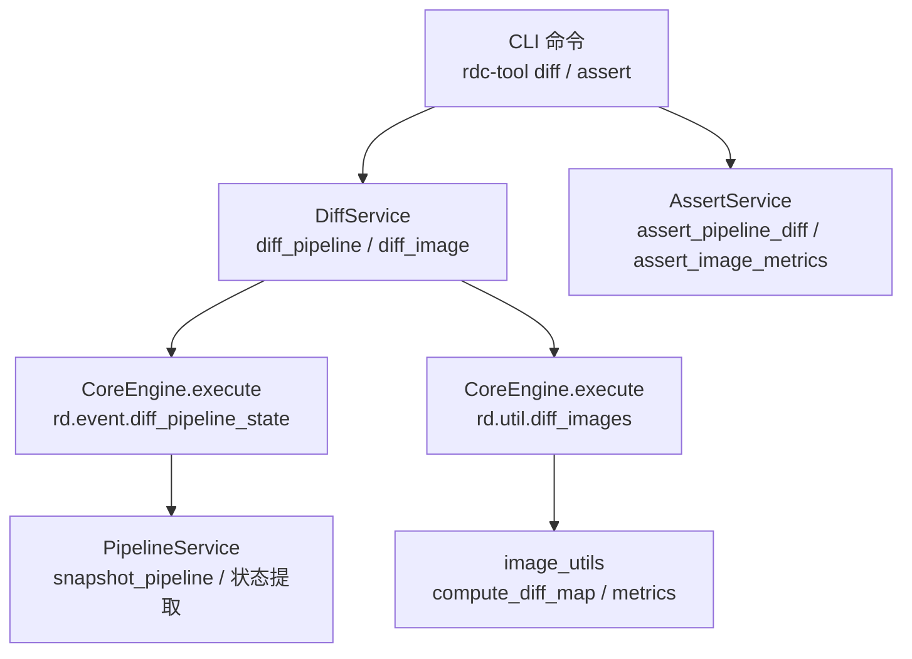
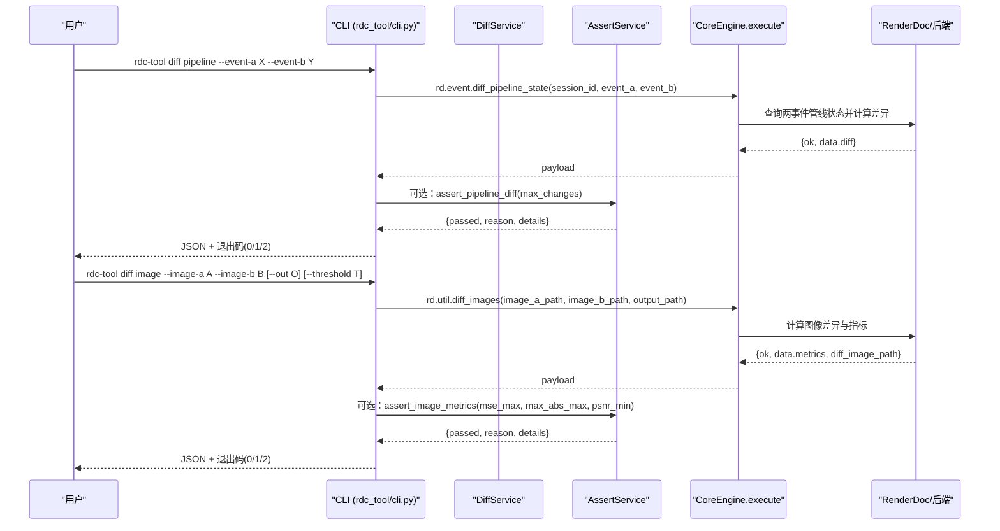
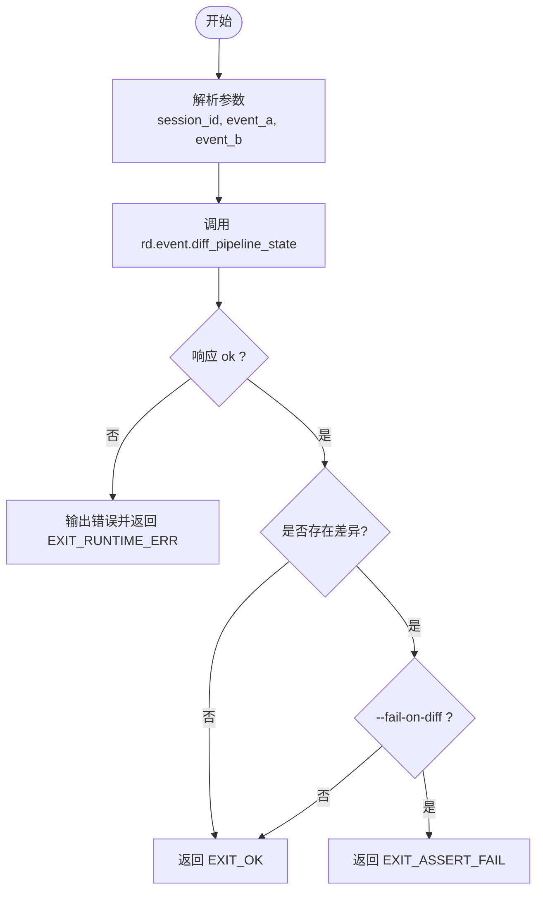
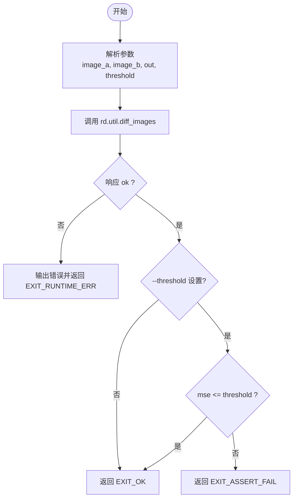
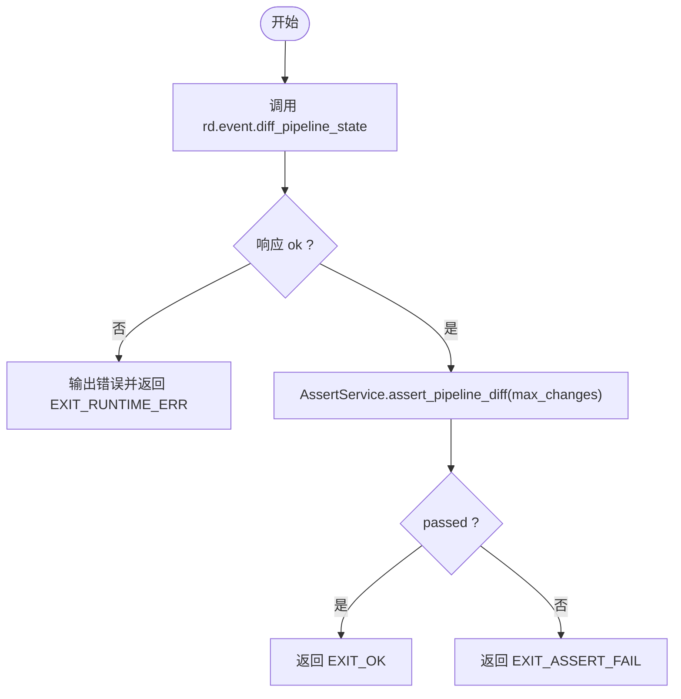
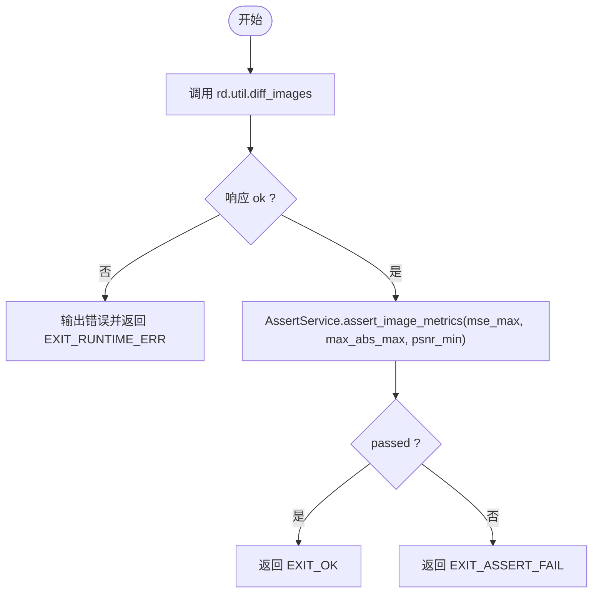
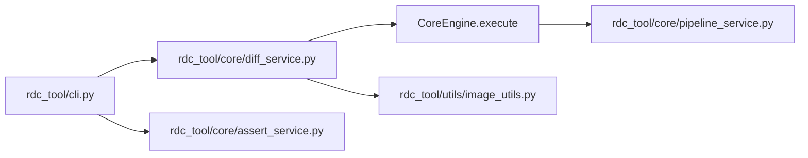

# 差异比较和断言命令

<cite>
**本文引用的文件**
- [rdc_tool/cli.py](file://rdc_tool/cli.py)
- [rdc_tool/core/diff_service.py](file://rdc_tool/core/diff_service.py)
- [rdc_tool/core/assert_service.py](file://rdc_tool/core/assert_service.py)
- [rdc_tool/utils/image_utils.py](file://rdc_tool/utils/image_utils.py)
- [rdc_tool/core/pipeline_service.py](file://rdc_tool/core/pipeline_service.py)
- [docs/tool-reference.md](file://docs/tool-reference.md)
</cite>

## 目录
1. [简介](#简介)
2. [项目结构](#项目结构)
3. [核心组件](#核心组件)
4. [架构总览](#架构总览)
5. [详细组件分析](#详细组件分析)
6. [依赖关系分析](#依赖关系分析)
7. [性能考虑](#性能考虑)
8. [故障排查指南](#故障排查指南)
9. [结论](#结论)
10. [附录：使用示例与自动化集成](#附录使用示例与自动化集成)

## 简介
本文件面向“差异比较”和“断言”两类能力，覆盖以下命令与工作流：
- rdc-tool diff pipeline：比较两个事件（Event）的管线状态差异，用于定位着色器、常量、资源绑定等变化。
- rdc-tool diff image：比较两张图像的差异，支持阈值控制与差异可视化输出。
- rdc-tool assert pipeline：对管线差异进行断言，允许设置最大允许变更数，便于回归测试。
- rdc-tool assert image：对图像差异指标进行断言，支持均方误差（MSE）、最大绝对误差（max_abs）、峰值信噪比（PSNR）等阈值。

这些命令通过 CLI 层调用后端工具（如 rd.event.diff_pipeline_state、rd.util.diff_images），并在断言层统一封装为稳定的 0/1/2 退出码语义，便于在 CI/CD 中集成。

## 项目结构
围绕差异与断言的关键路径如下：
- CLI 入口与参数解析：rdc_tool/cli.py
- 差异服务封装：rdc_tool/core/diff_service.py
- 断言服务封装：rdc_tool/core/assert_service.py
- 图像处理与指标计算：rdc_tool/utils/image_utils.py
- 管线状态快照与提取：rdc_tool/core/pipeline_service.py
- 工具参考与契约说明：docs/tool-reference.md

图表来源
- [rdc_tool/cli.py:1274-1378](file://rdc_tool/cli.py#L1274-L1378)
- [rdc_tool/core/diff_service.py:11-51](file://rdc_tool/core/diff_service.py#L11-L51)
- [rdc_tool/core/assert_service.py:16-79](file://rdc_tool/core/assert_service.py#L16-L79)
- [rdc_tool/utils/image_utils.py:143-220](file://rdc_tool/utils/image_utils.py#L143-L220)
- [rdc_tool/core/pipeline_service.py:590-702](file://rdc_tool/core/pipeline_service.py#L590-L702)

章节来源
- [rdc_tool/cli.py:1274-1378](file://rdc_tool/cli.py#L1274-L1378)
- [docs/tool-reference.md:108-108](file://docs/tool-reference.md#L108-L108)
- [docs/tool-reference.md:236-236](file://docs/tool-reference.md#L236-L236)

## 核心组件
- CLI 命令层
  - rdc-tool diff pipeline：调用 rd.event.diff_pipeline_state，返回 diff 列表；可选 --fail-on-diff 在有差异时返回非零退出码。
  - rdc-tool diff image：调用 rd.util.diff_images，返回指标与差异图；可选 --threshold 基于 MSE 判定失败。
  - rdc-tool assert pipeline：调用相同底层操作后，使用 AssertService.assert_pipeline_diff 判断变更数量是否超过阈值。
  - rdc-tool assert image：调用相同底层操作后，使用 AssertService.assert_image_metrics 校验 MSE/max_abs/PSNR 阈值。
- 差异服务（DiffService）
  - 将 CLI 参数转换为底层操作调用，屏蔽路径规范化与上下文传递。
- 断言服务（AssertService）
  - 提供稳定 0/1/2 退出语义的断言逻辑，封装错误与细节。
- 图像处理（image_utils）
  - compute_diff_map：逐像素 L2 距离热力图，统计 mean_diff、max_diff、diff_pixel_count、diff_ratio 及差异区域 bbox。
  - pixel_stats、tonemap_hdr、array_to_png_bytes 等辅助函数支撑图像读取、统计与导出。
- 管线服务（PipelineService）
  - snapshot_pipeline：从 RenderDoc 控制器中提取各阶段 shader、渲染目标、混合/深度模板、视口/裁剪、拓扑、顶点输入、绑定、推入常量、动态状态、根签名、描述符堆、资源状态等。

章节来源
- [rdc_tool/core/diff_service.py:11-51](file://rdc_tool/core/diff_service.py#L11-L51)
- [rdc_tool/core/assert_service.py:16-79](file://rdc_tool/core/assert_service.py#L16-L79)
- [rdc_tool/utils/image_utils.py:143-220](file://rdc_tool/utils/image_utils.py#L143-L220)
- [rdc_tool/core/pipeline_service.py:590-702](file://rdc_tool/core/pipeline_service.py#L590-L702)

## 架构总览
下图展示了从 CLI 到后端操作的完整调用链，以及断言层的决策分支。

图表来源
- [rdc_tool/cli.py:1274-1378](file://rdc_tool/cli.py#L1274-L1378)
- [rdc_tool/core/diff_service.py:11-51](file://rdc_tool/core/diff_service.py#L11-L51)
- [rdc_tool/core/assert_service.py:16-79](file://rdc_tool/core/assert_service.py#L16-L79)

## 详细组件分析

### rdc-tool diff pipeline
- 功能：比较两个事件的管线状态差异，涵盖着色器、常量缓冲、资源绑定、渲染目标、混合/深度模板、视口/裁剪、拓扑、顶点输入、推入常量、动态状态、根签名、描述符堆、资源状态等。
- 关键实现：
  - CLI 解析参数并调用 _daemon_exec("rd.event.diff_pipeline_state", ...)。
  - 若启用 --fail-on-diff 且存在差异，则返回 EXIT_ASSERT_FAIL。
  - 底层差异由 PipelineService.snapshot_pipeline 提取的状态对比完成。
- 输出：JSON payload，包含 ok、data.diff 等字段。

图表来源
- [rdc_tool/cli.py:1274-1293](file://rdc_tool/cli.py#L1274-L1293)
- [rdc_tool/core/pipeline_service.py:590-702](file://rdc_tool/core/pipeline_service.py#L590-L702)

章节来源
- [rdc_tool/cli.py:1274-1293](file://rdc_tool/cli.py#L1274-L1293)
- [docs/tool-reference.md:108-108](file://docs/tool-reference.md#L108-L108)
- [rdc_tool/core/pipeline_service.py:590-702](file://rdc_tool/core/pipeline_service.py#L590-L702)

### rdc-tool diff image
- 功能：比较两张图像，输出差异图与指标（如 MSE、max_abs、PSNR）。
- 关键实现：
  - CLI 调用 rd.util.diff_images，传入 image_a_path、image_b_path、output_path。
  - 支持 --threshold 基于 MSE 判定失败。
  - 内部使用 image_utils.compute_diff_map 生成热力图与统计信息。
- 输出：JSON payload，包含 ok、data.metrics、data.diff_image_path。

图表来源
- [rdc_tool/cli.py:1296-1310](file://rdc_tool/cli.py#L1296-L1310)
- [rdc_tool/utils/image_utils.py:143-220](file://rdc_tool/utils/image_utils.py#L143-L220)

章节来源
- [rdc_tool/cli.py:1296-1310](file://rdc_tool/cli.py#L1296-L1310)
- [docs/tool-reference.md:236-236](file://docs/tool-reference.md#L236-L236)
- [rdc_tool/utils/image_utils.py:143-220](file://rdc_tool/utils/image_utils.py#L143-L220)

### rdc-tool assert pipeline
- 功能：对管线差异进行断言，允许设置最大允许变更数（--max-changes）。
- 关键实现：
  - 调用 rd.event.diff_pipeline_state 获取差异。
  - 使用 AssertService.assert_pipeline_diff 判断变更数量是否超过阈值。
  - 输出标准化结果 {pass, reason, details}，并根据 passed 决定退出码。
- 适用场景：回归测试中确保管线状态无意外变更或仅允许有限变更。

图表来源
- [rdc_tool/cli.py:1313-1344](file://rdc_tool/cli.py#L1313-L1344)
- [rdc_tool/core/assert_service.py:16-35](file://rdc_tool/core/assert_service.py#L16-L35)

章节来源
- [rdc_tool/cli.py:1313-1344](file://rdc_tool/cli.py#L1313-L1344)
- [rdc_tool/core/assert_service.py:16-35](file://rdc_tool/core/assert_service.py#L16-L35)

### rdc-tool assert image
- 功能：对图像差异指标进行断言，支持 MSE、max_abs、PSNR 阈值。
- 关键实现：
  - 调用 rd.util.diff_images 获取指标。
  - 使用 AssertService.assert_image_metrics 校验各项指标是否在阈值内。
  - 输出标准化结果 {pass, reason, details}，并根据 passed 决定退出码。
- 适用场景：视觉回归测试，确保渲染输出在可接受范围内。

图表来源
- [rdc_tool/cli.py:1347-1378](file://rdc_tool/cli.py#L1347-L1378)
- [rdc_tool/core/assert_service.py:38-79](file://rdc_tool/core/assert_service.py#L38-L79)

章节来源
- [rdc_tool/cli.py:1347-1378](file://rdc_tool/cli.py#L1347-L1378)
- [rdc_tool/core/assert_service.py:38-79](file://rdc_tool/core/assert_service.py#L38-L79)

## 依赖关系分析
- CLI 依赖：
  - 参数解析与路由：_build_parser 定义 diff 与 assert 子命令及其参数。
  - 运行时通信：_daemon_exec 调用后端执行具体操作。
- 服务层依赖：
  - DiffService 依赖 CoreEngine.execute 调用底层工具。
  - AssertService 不直接访问后端，仅对 payload 进行断言。
- 图像处理依赖：
  - image_utils 提供差异图生成与统计，供 rd.util.diff_images 使用。
- 管线状态依赖：
  - PipelineService 通过 RenderDoc API 提取管线状态，供 rd.event.diff_pipeline_state 使用。

图表来源
- [rdc_tool/cli.py:1579-1607](file://rdc_tool/cli.py#L1579-L1607)
- [rdc_tool/core/diff_service.py:11-51](file://rdc_tool/core/diff_service.py#L11-L51)
- [rdc_tool/core/assert_service.py:16-79](file://rdc_tool/core/assert_service.py#L16-L79)
- [rdc_tool/core/pipeline_service.py:590-702](file://rdc_tool/core/pipeline_service.py#L590-L702)

章节来源
- [rdc_tool/cli.py:1579-1607](file://rdc_tool/cli.py#L1579-L1607)
- [rdc_tool/core/diff_service.py:11-51](file://rdc_tool/core/diff_service.py#L11-L51)
- [rdc_tool/core/assert_service.py:16-79](file://rdc_tool/core/assert_service.py#L16-L79)
- [rdc_tool/core/pipeline_service.py:590-702](file://rdc_tool/core/pipeline_service.py#L590-L702)

## 性能考虑
- 管线差异：
  - 差异计算涉及多阶段状态提取，可能包含大量资源与描述符信息；建议在 CI 中限定事件范围与 sections，避免全量扫描。
- 图像差异：
  - compute_diff_map 对整图进行逐像素 L2 计算，内存与时间复杂度与分辨率成正比；建议在大图上先裁剪感兴趣区域或使用较低分辨率基准。
  - 阈值策略：合理设置 --threshold 或 mse_max，以容忍微小数值抖动，减少误报。
- 断言开销：
  - 断言仅在 CLI 层进行轻量比较，主要成本在底层差异计算；可通过并行化多个断言任务提升吞吐。

[本节为通用指导，不直接分析具体文件]

## 故障排查指南
- 常见错误与处理：
  - 会话缺失：rdc-tool diff/ assert pipeline 需要 session_id；若未提供，CLI 会尝试从上下文获取，否则返回错误。
  - 后端失败：当 rd.event.diff_pipeline_state 或 rd.util.diff_images 返回 ok=false 时，CLI 输出标准化错误并返回 EXIT_RUNTIME_ERR。
  - 阈值不满足：rdc-tool diff image --threshold 或 rdc-tool assert image 的指标超出阈值时，返回 EXIT_ASSERT_FAIL。
- 诊断建议：
  - 查看 JSON 输出中的 error.message 与 details，定位具体原因。
  - 对于图像差异，检查输出差异图与指标（mse、max_abs、psnr），结合 image_utils 的统计信息定位问题区域。
  - 对于管线差异，关注 diff 列表中的具体变更项，必要时缩小事件范围或选择特定 sections 进行分析。

章节来源
- [rdc_tool/cli.py:1274-1378](file://rdc_tool/cli.py#L1274-L1378)
- [rdc_tool/core/assert_service.py:16-79](file://rdc_tool/core/assert_service.py#L16-L79)

## 结论
- rdc-tool diff 系列命令提供强大的管线与图像差异能力，适合定位回归与验证变更。
- rdc-tool assert 系列命令将差异结果转化为可自动化的断言，支持灵活的阈值配置，便于在 CI/CD 中集成。
- 通过 CLI、服务层与工具层的清晰分层，系统具备良好的可扩展性与可维护性。

[本节为总结，不直接分析具体文件]

## 附录：使用示例与自动化集成
以下为典型用法示例（以命令行形式描述，不包含代码片段）：
- 比较两个事件的管线状态差异：
  - rdc-tool diff pipeline --session-id <id> --event-a <a> --event-b <b>
  - 若希望任何差异都导致失败：添加 --fail-on-diff
- 比较两张图像并输出差异图：
  - rdc-tool diff image --image-a <path_a> --image-b <path_b> --out <path_out>
  - 基于 MSE 阈值判定失败：添加 --threshold <mse_value>
- 断言管线差异不超过 N 处变更：
  - rdc-tool assert pipeline --session-id <id> --event-a <a> --event-b <b> --max-changes <N>
- 断言图像指标在阈值内：
  - rdc-tool assert image --image-a <path_a> --image-b <path_b> --out <path_out> --mse-max <mse> --max-abs-max <abs> --psnr-min <psnr>

自动化集成建议：
- 在 CI 中分别运行 diff 与 assert 步骤：
  - 先执行 rdc-tool diff 生成基线与当前输出的差异报告（保留 artifacts）。
  - 再执行 rdc-tool assert 进行严格断言，根据退出码决定构建是否通过。
- 阈值调优：
  - 针对图像测试，逐步放宽或收紧 mse_max、max_abs_max、psnr_min，平衡稳定性与敏感性。
  - 针对管线测试，使用 --max-changes 限制允许的变更数量，聚焦关键状态。

章节来源
- [rdc_tool/cli.py:1579-1607](file://rdc_tool/cli.py#L1579-L1607)
- [rdc_tool/cli.py:1274-1378](file://rdc_tool/cli.py#L1274-L1378)
- [docs/tool-reference.md:108-108](file://docs/tool-reference.md#L108-L108)
- [docs/tool-reference.md:236-236](file://docs/tool-reference.md#L236-L236)