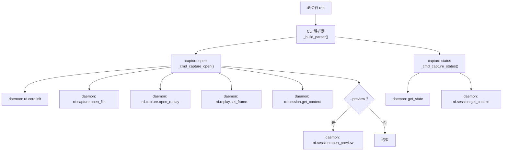
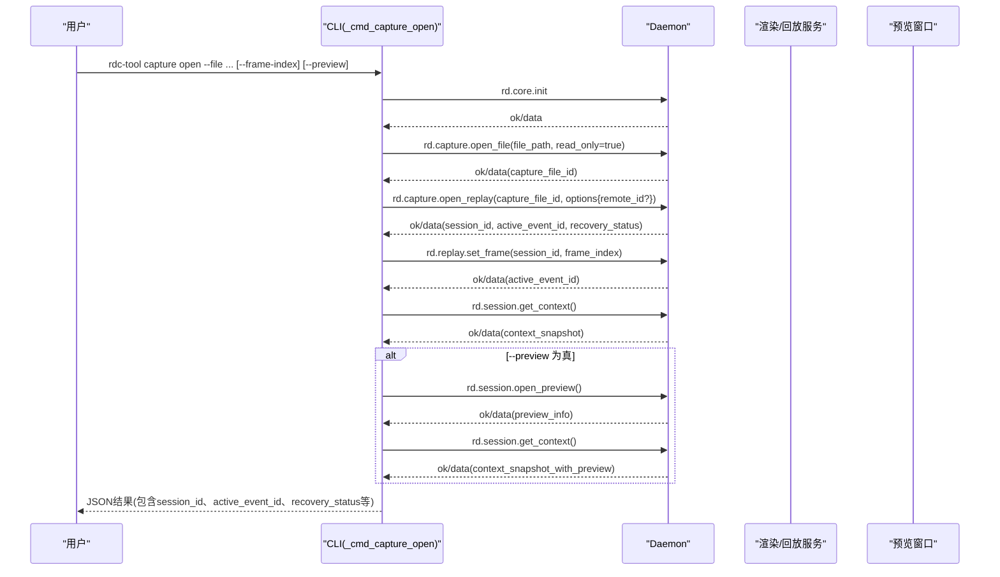
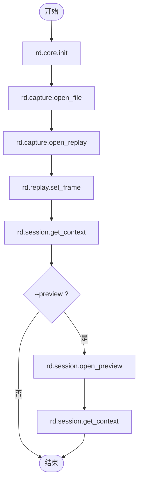
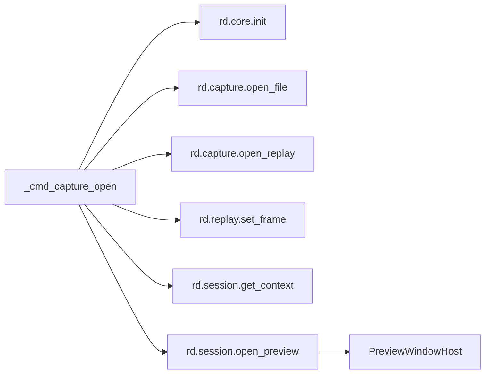

# 捕获文件操作命令

<cite>
**本文引用的文件**
- [rdc_tool/cli.py](file://rdc_tool/cli.py)
- [tests/test_cli_capture_open.py](file://tests/test_cli_capture_open.py)
- [rdc_tool/preview_window.py](file://rdc_tool/preview_window.py)
- [cli/run_cli.py](file://cli/run_cli.py)
</cite>

## 目录
1. [简介](#简介)
2. [项目结构](#项目结构)
3. [核心组件](#核心组件)
4. [架构总览](#架构总览)
5. [详细组件分析](#详细组件分析)
6. [依赖关系分析](#依赖关系分析)
7. [性能与行为特性](#性能与行为特性)
8. [故障排查指南](#故障排查指南)
9. [结论](#结论)
10. [附录：参数、返回值与示例](#附录参数返回值与示例)

## 简介
本章节面向“捕获文件操作”相关命令，重点说明 rdc-tool capture open 与 rdc-tool capture status 的用法、参数、返回格式与错误处理。其中：
- rdc-tool capture open：用于打开一个 .rdc 捕获文件，可选择指定帧索引并启用预览窗口。
- rdc-tool capture status：用于检查当前上下文中的捕获会话状态（是否已有会话、上下文快照等）。

该文档基于仓库中 CLI 实现与测试用例进行整理，确保内容与实际代码一致。

## 项目结构
与捕获命令直接相关的代码主要位于 CLI 层与预览窗口模块：
- CLI 入口与子命令解析：rdc_tool/cli.py
- 捕获打开流程与状态查询：rdc_tool/cli.py 中的 _cmd_capture_open 与 _cmd_capture_status
- 预览窗口宿主：rdc_tool/preview_window.py
- 帮助信息与示例：cli/run_cli.py

图表来源
- [rdc_tool/cli.py:1381-1470](file://rdc_tool/cli.py#L1381-L1470)
- [rdc_tool/cli.py:1042-1194](file://rdc_tool/cli.py#L1042-L1194)

章节来源
- [rdc_tool/cli.py:1381-1470](file://rdc_tool/cli.py#L1381-L1470)
- [rdc_tool/cli.py:1042-1194](file://rdc_tool/cli.py#L1042-L1194)
- [cli/run_cli.py:96-115](file://cli/run_cli.py#L96-L115)

## 核心组件
- 捕获打开命令处理器：_cmd_capture_open
  - 负责初始化上下文、打开捕获文件、启动回放、设置帧索引、获取上下文快照，并在需要时开启预览。
- 捕获状态命令处理器：_cmd_capture_status
  - 负责读取 daemon 状态与上下文快照，输出当前是否有活跃会话及上下文信息。
- 预览窗口宿主：PreviewWindowHost
  - 提供轻量级 Windows 窗口生命周期管理，供预览功能使用。

章节来源
- [rdc_tool/cli.py:1042-1194](file://rdc_tool/cli.py#L1042-L1194)
- [rdc_tool/cli.py:1174-1194](file://rdc_tool/cli.py#L1174-L1194)
- [rdc_tool/preview_window.py:192-238](file://rdc_tool/preview_window.py#L192-L238)

## 架构总览
下图展示了 rdc-tool capture open 的完整调用序列，包括可选的预览步骤与错误封装。

图表来源
- [rdc_tool/cli.py:1042-1171](file://rdc_tool/cli.py#L1042-L1171)
- [tests/test_cli_capture_open.py:9-93](file://tests/test_cli_capture_open.py#L9-L93)

## 详细组件分析

### rdc-tool capture open
- 作用
  - 打开指定的 .rdc 捕获文件，进入回放模式，并可跳转到指定帧；支持可选的预览窗口。
- 关键参数
  - --file：必需，捕获文件路径（会解析为绝对路径）
  - --frame-index：可选，整数，默认 0，表示要跳转到的帧索引
  - --artifact-dir：可选，工件目录（传递给 init）
  - --remote-id：可选，当设置时，open_replay 将强制使用该远程句柄，不会回退到本地 OpenCapture
  - --preview：可选，布尔开关，若启用则调用 rd.session.open_preview 以启动预览
- 执行流程
  - 初始化上下文（rd.core.init）
  - 打开捕获文件（rd.capture.open_file）
  - 启动回放（rd.capture.open_replay），必要时携带 remote_id
  - 设置帧（rd.replay.set_frame）
  - 获取上下文快照（rd.session.get_context）
  - 如启用预览，则打开预览（rd.session.open_preview），再刷新上下文快照
- 返回值
  - 成功：JSON 对象，result_kind 为 "rdc_tool.capture.open"，data 中包含 context_id、capture_file_id、capture_path、session_id、active_event_id、recovery_status、backend、remote_id、runtime、context 等字段
  - 失败：JSON 对象，ok=false，error 包含 code、category、message，details 包含 failed_step、context_id、file_path、capture_file_id、session_id、active_event_id、step_payload、source_error_details、daemon_state、context_snapshot、recovery_hint
- 错误处理
  - 对每一步异常或失败响应进行统一封装，附带上下文快照与 daemon 状态，便于定位问题阶段（init/open_file/open_replay/set_frame/get_context/open_preview）
  - 若 open_replay 失败或超时，仍会尝试获取上下文快照以辅助诊断

图表来源
- [rdc_tool/cli.py:1042-1171](file://rdc_tool/cli.py#L1042-L1171)

章节来源
- [rdc_tool/cli.py:1042-1171](file://rdc_tool/cli.py#L1042-L1171)
- [tests/test_cli_capture_open.py:9-93](file://tests/test_cli_capture_open.py#L9-L93)
- [tests/test_cli_capture_open.py:160-367](file://tests/test_cli_capture_open.py#L160-L367)

### rdc-tool capture status
- 作用
  - 检查当前上下文中的捕获会话状态，判断是否存在活跃会话，并返回上下文快照与 daemon 状态。
- 执行流程
  - 获取 daemon 状态（get_state）
  - 获取上下文快照（rd.session.get_context）
  - 根据 runtime 中的 session_id 判断 has_session
- 返回值
  - JSON 对象，result_kind 为 "rdc_tool.capture.status"，data 中包含 context_id、has_session、state、context

章节来源
- [rdc_tool/cli.py:1174-1194](file://rdc_tool/cli.py#L1174-L1194)

### 预览窗口（--preview）
- 作用
  - 在 capture open 成功后，可启动一个轻量级预览窗口，绑定当前会话与事件，便于可视化查看。
- 实现要点
  - 通过 rd.session.open_preview 启动预览，随后刷新上下文快照以反映 preview.enabled 与 preview.state
  - 底层使用 PreviewWindowHost 管理窗口生命周期、尺寸自适应与消息循环

章节来源
- [rdc_tool/cli.py:1128-1140](file://rdc_tool/cli.py#L1128-L1140)
- [rdc_tool/preview_window.py:192-238](file://rdc_tool/preview_window.py#L192-L238)
- [tests/test_cli_capture_open.py:370-428](file://tests/test_cli_capture_open.py#L370-L428)

## 依赖关系分析
- CLI 层依赖 daemon 提供的工具接口：
  - rd.core.init
  - rd.capture.open_file
  - rd.capture.open_replay
  - rd.replay.set_frame
  - rd.session.get_context
  - rd.session.open_preview / rd.session.close_preview
- 预览功能依赖系统 UI 能力（Windows），由 PreviewWindowHost 封装。

图表来源
- [rdc_tool/cli.py:1042-1171](file://rdc_tool/cli.py#L1042-L1171)
- [rdc_tool/preview_window.py:192-238](file://rdc_tool/preview_window.py#L192-L238)

章节来源
- [rdc_tool/cli.py:1042-1171](file://rdc_tool/cli.py#L1042-L1171)
- [rdc_tool/preview_window.py:192-238](file://rdc_tool/preview_window.py#L192-L238)

## 性能与行为特性
- 帧跳转：set_frame 会更新 active_event_id，影响后续事件导航与预览显示。
- 远程模式：当传入 --remote-id 时，open_replay 将使用该远程句柄，避免回退到本地 OpenCapture，适合远程设备场景。
- 预览窗口：自动根据工作区大小缩放，支持用户手动调整尺寸后锁定覆盖。

[本节为通用行为说明，不直接引用具体代码行]

## 故障排查指南
- 常见失败阶段
  - init：上下文初始化失败
  - open_file：无法打开捕获文件（路径不存在或权限不足）
  - open_replay：回放启动失败（例如远程连接失败、资源不足）
  - set_frame：帧索引无效或超出范围
  - get_context：上下文快照获取失败
  - open_preview：预览窗口启动失败（UI 环境不支持或创建失败）
- 错误信息结构
  - error.code：错误码（如 renderdoc_error、timeout 等）
  - error.category：类别（runtime、validation 等）
  - error.message：人类可读消息
  - details.failed_step：失败的具体步骤
  - details.daemon_state：daemon 状态快照
  - details.context_snapshot：上下文快照（可能 ok=false）
  - details.recovery_hint：恢复建议（如清理上下文后重试）
- 建议操作
  - 检查 --file 路径是否正确且存在
  - 确认 --frame-index 是否在有效范围内
  - 如需远程回放，确保 --remote-id 指向有效的远程句柄
  - 若预览失败，检查系统 UI 环境与权限
  - 遇到上下文占用或卡死，可使用上下文清理命令后再试

章节来源
- [rdc_tool/cli.py:817-864](file://rdc_tool/cli.py#L817-L864)
- [tests/test_cli_capture_open.py:160-367](file://tests/test_cli_capture_open.py#L160-L367)

## 结论
- rdc-tool capture open 提供了完整的捕获文件打开、帧跳转与预览能力，并通过统一的错误封装与上下文快照辅助定位问题。
- rdc-tool capture status 可用于快速检查当前上下文是否已有活跃会话以及上下文快照。
- 结合 --remote-id 与 --preview，可在本地或远程环境下灵活地打开与查看捕获文件。

[本节为总结性内容，不直接引用具体代码行]

## 附录：参数、返回值与示例

### 参数列表（capture open）
- --file：必需，字符串，捕获文件路径（.rdc）
- --frame-index：可选，整数，默认 0
- --artifact-dir：可选，字符串，工件目录
- --remote-id：可选，字符串，远程句柄标识
- --preview：可选，布尔开关

章节来源
- [rdc_tool/cli.py:1458-1470](file://rdc_tool/cli.py#L1458-L1470)

### 返回值格式（capture open）
- 成功
  - result_kind: "rdc_tool.capture.open"
  - data:
    - context_id: 字符串
    - capture_file_id: 字符串
    - capture_path: 字符串（绝对路径）
    - session_id: 字符串
    - active_event_id: 整数
    - recovery_status: 字符串（如 ready）
    - backend: "local" 或 "remote"
    - remote_id: 字符串或空
    - runtime: 对象（包含 session_id、capture_file_id、frame_index、active_event_id、backend_type 等）
    - context: 对象（包含 current_session_id、sessions、preview 等）
- 失败
  - ok: false
  - error: {code, category, message}
  - details: {failed_step, context_id, file_path, capture_file_id, session_id, active_event_id, step_payload, source_error_details, daemon_state, context_snapshot, recovery_hint}

章节来源
- [rdc_tool/cli.py:1154-1171](file://rdc_tool/cli.py#L1154-L1171)
- [rdc_tool/cli.py:817-864](file://rdc_tool/cli.py#L817-L864)

### 返回值格式（capture status）
- result_kind: "rdc_tool.capture.status"
- data:
  - context_id: 字符串
  - has_session: 布尔
  - state: 对象（daemon 状态）
  - context: 对象（上下文快照）

章节来源
- [rdc_tool/cli.py:1174-1194](file://rdc_tool/cli.py#L1174-L1194)

### 使用示例
- 打开本地捕获文件并跳转到第 0 帧：
  - rdc-tool capture open --file D:\path\capture.rdc --frame-index 0
- 打开捕获文件并启用预览窗口：
  - rdc-tool capture open --file D:\path\capture.rdc --frame-index 0 --preview
- 通过远程句柄打开捕获文件：
  - rdc-tool capture open --file D:\path\capture.rdc --remote-id remote_abc
- 检查当前捕获状态：
  - rdc-tool capture status

章节来源
- [cli/run_cli.py:96-115](file://cli/run_cli.py#L96-L115)
- [tests/test_cli_capture_open.py:9-93](file://tests/test_cli_capture_open.py#L9-L93)
- [tests/test_cli_capture_open.py:370-428](file://tests/test_cli_capture_open.py#L370-L428)