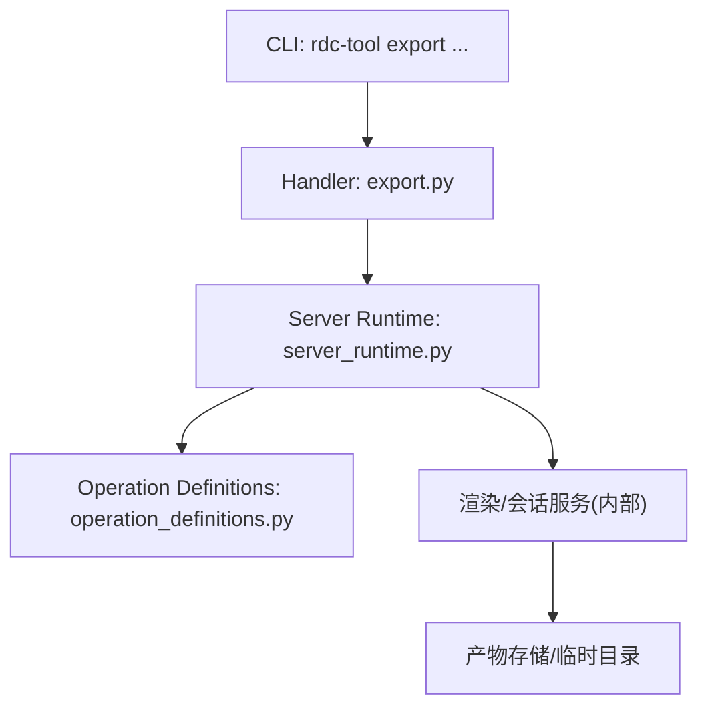
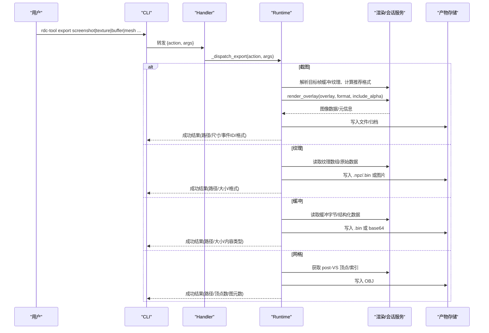
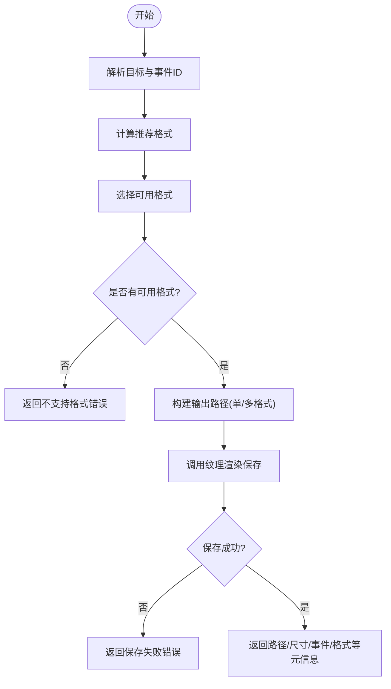
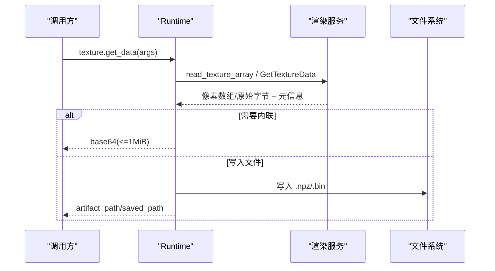
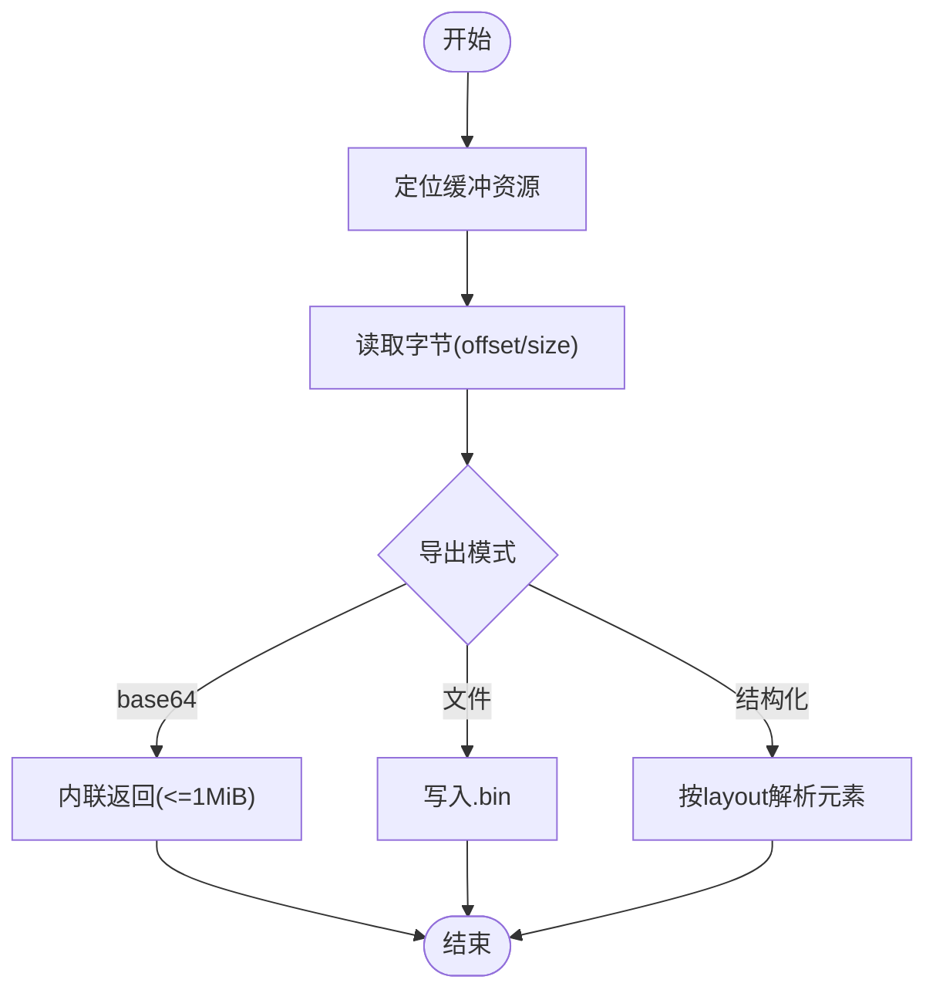
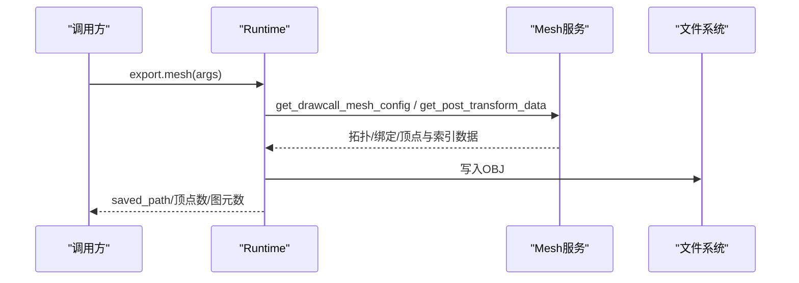
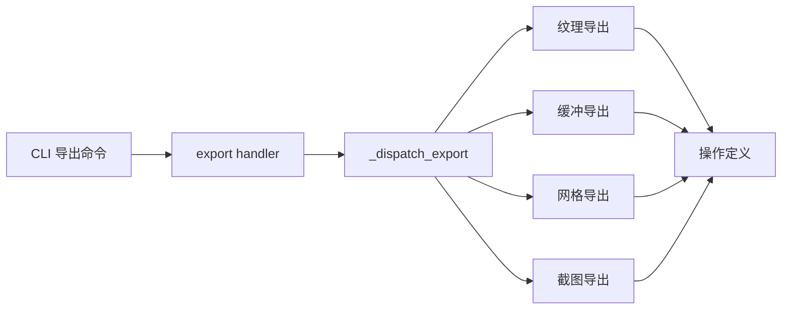

# 数据导出命令

<cite>
**本文引用的文件**
- [rdc_tool/cli.py](file://rdc_tool/cli.py)
- [rdc_tool/handlers/export.py](file://rdc_tool/handlers/export.py)
- [rdc_tool/server_runtime.py](file://rdc_tool/server_runtime.py)
- [rdc_tool/operation_definitions.py](file://rdc_tool/operation_definitions.py)
- [docs/rdc-native-agent-playbook.md](file://docs/rdc-native-agent-playbook.md)
</cite>

## 目录
1. [简介](#简介)
2. [项目结构](#项目结构)
3. [核心组件](#核心组件)
4. [架构总览](#架构总览)
5. [详细组件分析](#详细组件分析)
6. [依赖关系分析](#依赖关系分析)
7. [性能与质量建议](#性能与质量建议)
8. [故障排查指南](#故障排查指南)
9. [结论](#结论)
10. [附录：参数与示例](#附录参数与示例)

## 简介
本章节面向使用 rdc-tool export 系列命令的用户，系统说明以下能力：
- rdc-tool export screenshot：导出屏幕截图（支持 PNG、JPEG、EXR、HDR 等），可叠加覆盖层、控制透明度。
- rdc-tool export texture：导出纹理资源，支持子资源选择、显示映射、通道控制，输出为图片或直接二进制/数值容器。
- rdc-tool export buffer：导出缓冲区原始字节或结构化数据，支持二进制与文本（base64）形式。
- rdc-tool export mesh：导出网格数据，基于后顶点着色器（post-VS）的 float32 位置与图元索引，输出 OBJ 格式。

文档同时提供完整参数说明、批量导出方法、自定义输出格式与质量设置，以及导出数据的后续处理与分析建议。

## 项目结构
导出命令在 CLI 层以“facade”方式暴露，内部通过 server_runtime 分发到具体实现；操作定义集中声明于 operation_definitions，便于生成工具参考与契约。

图表来源
- [rdc_tool/cli.py:1538-1555](file://rdc_tool/cli.py#L1538-L1555)
- [rdc_tool/handlers/export.py:8-9](file://rdc_tool/handlers/export.py#L8-L9)
- [rdc_tool/server_runtime.py:11118-11317](file://rdc_tool/server_runtime.py#L11118-L11317)
- [rdc_tool/operation_definitions.py:1247-1395](file://rdc_tool/operation_definitions.py#L1247-L1395)

章节来源
- [rdc_tool/cli.py:1538-1555](file://rdc_tool/cli.py#L1538-L1555)
- [rdc_tool/handlers/export.py:8-9](file://rdc_tool/handlers/export.py#L8-L9)
- [rdc_tool/server_runtime.py:11118-11317](file://rdc_tool/server_runtime.py#L11118-L11317)
- [rdc_tool/operation_definitions.py:1247-1395](file://rdc_tool/operation_definitions.py#L1247-L1395)

## 核心组件
- CLI 门面：解析 rdc-tool export <subcommand> 并组装调用参数，统一注入 session_id、event_id、resource-id、out、format 等。
- 分发器：server_runtime._dispatch_export 根据 action 路由至 screenshot/texture/buffer/mesh 的具体导出逻辑。
- 操作契约：operation_definitions 中声明 rd.export.* 的参数、返回、前置条件与作用域，保证跨工具一致性。
- 运行时服务：渲染服务负责读取纹理、绘制覆盖层、保存图像；缓冲/网格服务负责读取缓冲与网格数据。

章节来源
- [rdc_tool/cli.py:1538-1555](file://rdc_tool/cli.py#L1538-L1555)
- [rdc_tool/server_runtime.py:11118-11317](file://rdc_tool/server_runtime.py#L11118-L11317)
- [rdc_tool/operation_definitions.py:1247-1395](file://rdc_tool/operation_definitions.py#L1247-L1395)

## 架构总览
下图展示从命令行到导出的端到端流程，包括截图、纹理、缓冲与网格四类导出路径。

图表来源
- [rdc_tool/cli.py:1538-1555](file://rdc_tool/cli.py#L1538-L1555)
- [rdc_tool/handlers/export.py:8-9](file://rdc_tool/handlers/export.py#L8-L9)
- [rdc_tool/server_runtime.py:11118-11317](file://rdc_tool/server_runtime.py#L11118-L11317)
- [rdc_tool/server_runtime.py:8180-8549](file://rdc_tool/server_runtime.py#L8180-L8549)

## 详细组件分析

### 截图导出（screenshot）
- 功能要点
  - 自动解析当前 active event 或指定 event_id 的输出目标。
  - 支持 PNG、JPEG、EXR、HDR 等图像格式；默认 PNG。
  - 支持 include_alpha 控制是否包含透明通道。
  - 支持 overlay 叠加层：None、Drawcall、Wireframe、Overdraw。
  - 若未显式指定 target，则优先使用当前帧缓冲输出槽；否则回退到通用 framebuffer。
  - 多格式导出时，会按推荐格式与请求格式组合生成多个文件。
- 关键流程
  - 解析目标与事件 -> 计算推荐格式 -> 校验允许格式 -> 生成输出路径 -> 调用纹理渲染保存 -> 汇总结果。
- 错误与降级
  - 无法解析视觉目标时会返回明确错误详情（含 session/event/target_source）。
  - 保存失败会携带失败阶段与上下文信息。

图表来源
- [rdc_tool/server_runtime.py:11118-11317](file://rdc_tool/server_runtime.py#L11118-L11317)

章节来源
- [rdc_tool/server_runtime.py:11118-11317](file://rdc_tool/server_runtime.py#L11118-L11317)
- [rdc_tool/operation_definitions.py:1286-1300](file://rdc_tool/operation_definitions.py#L1286-L1300)

### 纹理导出（texture）
- 功能要点
  - 统一入口，支持 subresource（mip/slice/sample）、region 裁剪、显示映射与通道控制。
  - 输出可为图片（由上层封装）或数值容器 .npz / 原始二进制 .bin。
  - 支持 as_base64 内联返回小数据（有 1 MiB 限制）。
- 关键流程
  - 解析纹理 ID 与子资源 -> 读取像素数组或原始数据 -> 写入文件或归档 -> 返回路径与元信息。
- 错误与限制
  - 子资源越界或不合法将报错。
  - 内联返回超过预算会拒绝。

图表来源
- [rdc_tool/server_runtime.py:8470-8549](file://rdc_tool/server_runtime.py#L8470-L8549)

章节来源
- [rdc_tool/server_runtime.py:8470-8549](file://rdc_tool/server_runtime.py#L8470-L8549)
- [rdc_tool/operation_definitions.py:1390-1395](file://rdc_tool/operation_definitions.py#L1390-L1395)

### 缓冲导出（buffer）
- 功能要点
  - 读取缓冲原始字节，支持 offset/size 范围读取。
  - 支持 as_base64 内联返回（<=1 MiB）或写入 .bin 文件。
  - 支持结构化解码 get_structured_data，按 stride 与字段布局解析元素。
  - 支持 search_pattern 在缓冲中搜索字节模式。
- 关键流程
  - 定位缓冲资源 -> 读取字节 -> 按需求 base64/写文件/结构化解析 -> 返回结果。
- 错误与限制
  - 范围越界、不完整读取、布局非法均会返回明确错误。

图表来源
- [rdc_tool/server_runtime.py:8180-8292](file://rdc_tool/server_runtime.py#L8180-L8292)

章节来源
- [rdc_tool/server_runtime.py:8180-8292](file://rdc_tool/server_runtime.py#L8180-L8292)
- [rdc_tool/operation_definitions.py:4-66](file://rdc_tool/operation_definitions.py#L4-L66)

### 网格导出（mesh）
- 功能要点
  - 导出真实 post-VS 位置的 float32 坐标与图元索引，输出 Wavefront OBJ。
  - 支持三角形列表/条带、线列表、点列表拓扑；其他格式与属性不可用。
  - 不支持预-VS 空间、PLY/glTF、属性导出；不支持不完整读回。
- 关键流程
  - 获取 drawcall 配置与 post-VS 数据 -> 读取顶点/索引 -> 写入 OBJ -> 返回统计信息。
- 错误与限制
  - 不支持的几何或不可用的后变换数据会返回特定错误，且不创建占位文件。

图表来源
- [rdc_tool/server_runtime.py:8350-8467](file://rdc_tool/server_runtime.py#L8350-L8467)
- [rdc_tool/operation_definitions.py:1247-1262](file://rdc_tool/operation_definitions.py#L1247-L1262)

章节来源
- [rdc_tool/server_runtime.py:8350-8467](file://rdc_tool/server_runtime.py#L8350-L8467)
- [rdc_tool/operation_definitions.py:1247-1262](file://rdc_tool/operation_definitions.py#L1247-L1262)

## 依赖关系分析
- CLI 仅负责参数解析与转发，不直接实现导出逻辑。
- 所有导出最终汇聚到 server_runtime 的统一分发器，再委派给具体服务。
- 操作定义集中管理，确保各工具的参数、作用域、效果一致且可被外部工具发现。

图表来源
- [rdc_tool/cli.py:1538-1555](file://rdc_tool/cli.py#L1538-L1555)
- [rdc_tool/handlers/export.py:8-9](file://rdc_tool/handlers/export.py#L8-L9)
- [rdc_tool/server_runtime.py:11118-11317](file://rdc_tool/server_runtime.py#L11118-L11317)
- [rdc_tool/operation_definitions.py:1247-1395](file://rdc_tool/operation_definitions.py#L1247-L1395)

章节来源
- [rdc_tool/cli.py:1538-1555](file://rdc_tool/cli.py#L1538-L1555)
- [rdc_tool/handlers/export.py:8-9](file://rdc_tool/handlers/export.py#L8-L9)
- [rdc_tool/server_runtime.py:11118-11317](file://rdc_tool/server_runtime.py#L11118-L11317)
- [rdc_tool/operation_definitions.py:1247-1395](file://rdc_tool/operation_definitions.py#L1247-L1395)

## 性能与质量建议
- 截图质量与体积
  - JPEG 适合照片类场景，PNG 适合无损；EXR/HDR 适合高动态范围工作流。
  - 多格式导出会生成多个文件，注意磁盘占用。
- 纹理导出
  - 大纹理建议使用 .npz 或 .bin 文件，避免 base64 内联导致内存与传输开销。
  - 合理选择 mip/slice/sample，减少不必要的数据量。
- 缓冲导出
  - 结构化解析需正确定义 stride 与字段布局，避免越界与无效解析。
  - 搜索模式时限制 max_results，防止扫描过大缓冲。
- 网格导出
  - 仅支持 post-VS 空间与有限拓扑；如需更复杂模型，请结合管线状态与中间数据自行转换。

[本节为通用指导，无需代码引用]

## 故障排查指南
- 截图目标不可用
  - 检查 event_id 是否正确，确认该事件存在有效的帧缓冲或纹理输出。
  - 查看返回中的 target_source、chosen_output_slot、swapchain_error 等字段定位问题。
- 纹理/缓冲内联超限
  - 当 as_base64 超过 1 MiB 限制时，改为输出文件或使用更小的子资源。
- 网格导出失败
  - 若提示不支持的几何或不可用数据，确认事件处于可提取 post-VS 数据的阶段，并检查拓扑类型。
- 输出路径与权限
  - 确保输出目录存在且可写；必要时提前创建父目录。

章节来源
- [rdc_tool/server_runtime.py:11118-11317](file://rdc_tool/server_runtime.py#L11118-L11317)
- [rdc_tool/server_runtime.py:8180-8549](file://rdc_tool/server_runtime.py#L8180-L8549)

## 结论
rdc-tool export 提供了统一的导出入口，覆盖截图、纹理、缓冲与网格四大常见数据形态。通过 CLI 门面与运行时分发机制，用户可以用一致的参数风格完成不同资源的导出，并结合操作定义的契约进行自动化与批量化处理。建议在大规模导出时关注格式选择、数据量控制与错误处理，以获得稳定高效的导出体验。

[本节为总结性内容，无需代码引用]

## 附录：参数与示例

### 通用参数
- --session-id：会话标识（可通过 capture open 或 context 获取）。
- --event-id：指定事件，用于截图与网格导出。
- --resource-id：纹理或缓冲的资源标识。
- --out：输出文件路径。
- --format：输出格式（如 png/jpg/exr/hdr 或 obj）。
- --daemon-context：可选，指定守护进程上下文。

### 截图导出
- 命令：rdc-tool export screenshot --event-id <id> --out <path> [--format png|jpg|exr|hdr] [--include-alpha true|false] [--overlay none|drawcall|wireframe|overdraw]
- 行为：自动解析事件输出目标，计算推荐格式，支持多格式批量导出。
- 参考：
  - [rdc_tool/cli.py:1538-1544](file://rdc_tool/cli.py#L1538-L1544)
  - [rdc_tool/server_runtime.py:11118-11317](file://rdc_tool/server_runtime.py#L11118-L11317)
  - [docs/rdc-native-agent-playbook.md:86-96](file://docs/rdc-native-agent-playbook.md#L86-L96)

### 纹理导出
- 命令：rdc-tool export texture --resource-id <id> --out <path> [--format npz|bin|png|...]
- 行为：支持子资源选择、区域裁剪、显示映射；数值容器为 .npz，原始二进制为 .bin。
- 参考：
  - [rdc_tool/cli.py:1545-1550](file://rdc_tool/cli.py#L1545-L1550)
  - [rdc_tool/server_runtime.py:8470-8549](file://rdc_tool/server_runtime.py#L8470-L8549)
  - [rdc_tool/operation_definitions.py:1390-1395](file://rdc_tool/operation_definitions.py#L1390-L1395)

### 缓冲导出
- 命令：rdc-tool export buffer --resource-id <id> --out <path> [--as-base64 true|false]
- 行为：读取缓冲字节，支持范围读取与结构化解析；小数据可内联 base64。
- 参考：
  - [rdc_tool/cli.py:1545-1550](file://rdc_tool/cli.py#L1545-L1550)
  - [rdc_tool/server_runtime.py:8180-8292](file://rdc_tool/server_runtime.py#L8180-L8292)
  - [rdc_tool/operation_definitions.py:4-66](file://rdc_tool/operation_definitions.py#L4-L66)

### 网格导出
- 命令：rdc-tool export mesh --event-id <id> --out <path> [--format obj]
- 行为：导出 post-VS 的 float32 顶点与索引为 OBJ；仅支持有限拓扑。
- 参考：
  - [rdc_tool/cli.py:1551-1555](file://rdc_tool/cli.py#L1551-L1555)
  - [rdc_tool/server_runtime.py:8350-8467](file://rdc_tool/server_runtime.py#L8350-L8467)
  - [rdc_tool/operation_definitions.py:1247-1262](file://rdc_tool/operation_definitions.py#L1247-L1262)

### 批量导出建议
- 使用脚本循环遍历事件或资源列表，依次调用导出命令。
- 对截图可使用多格式导出一次性生成多种文件。
- 对纹理/缓冲优先输出文件而非内联 base64，以降低内存压力。
- 结合日志与返回码进行失败重试与告警。

[本节为使用指导，无需代码引用]