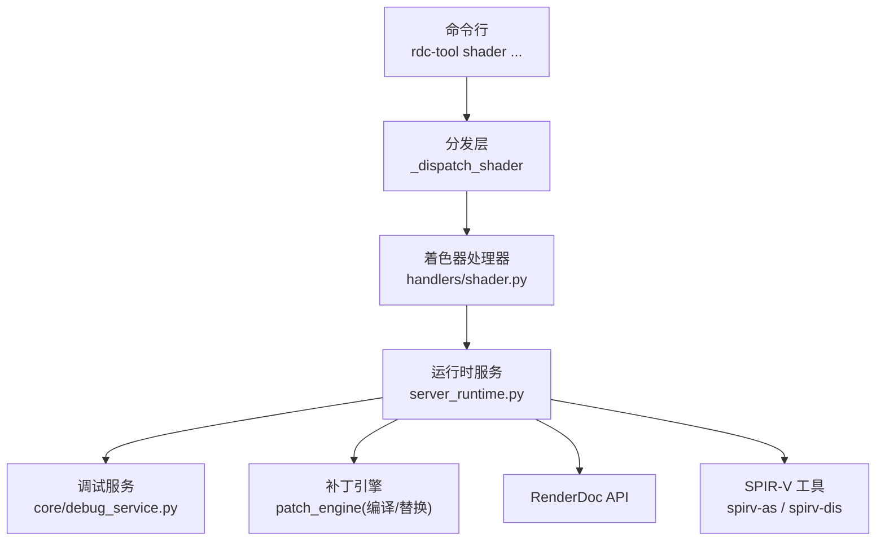
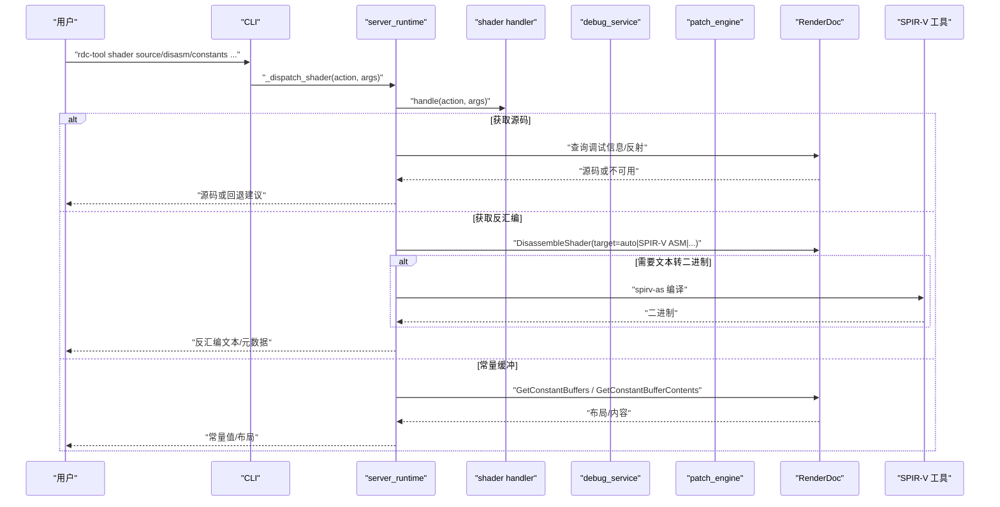
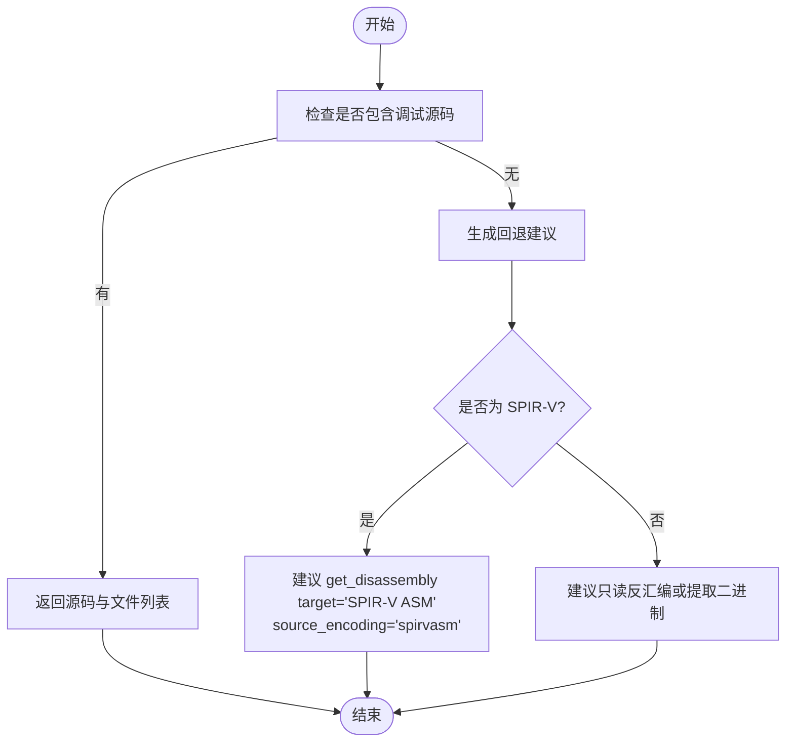
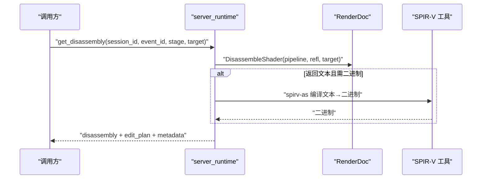
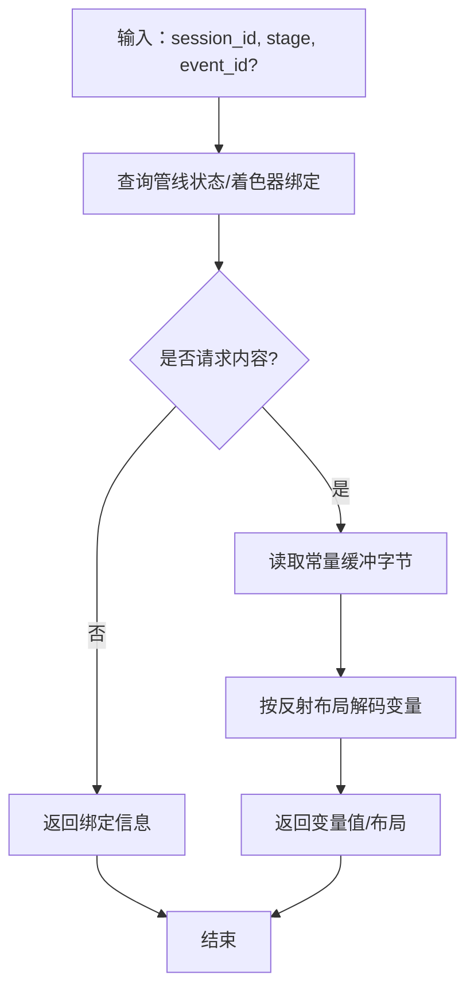
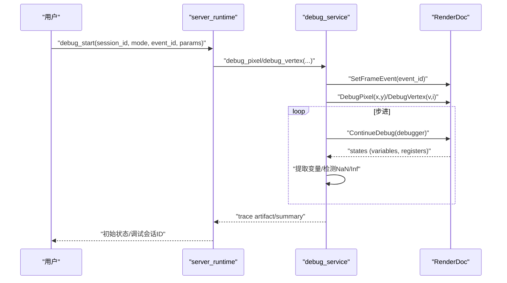
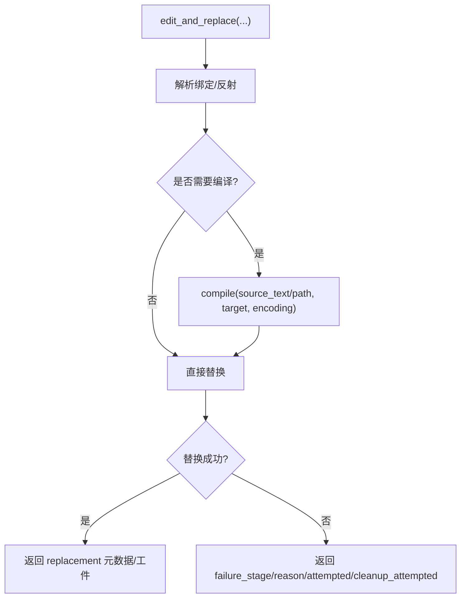
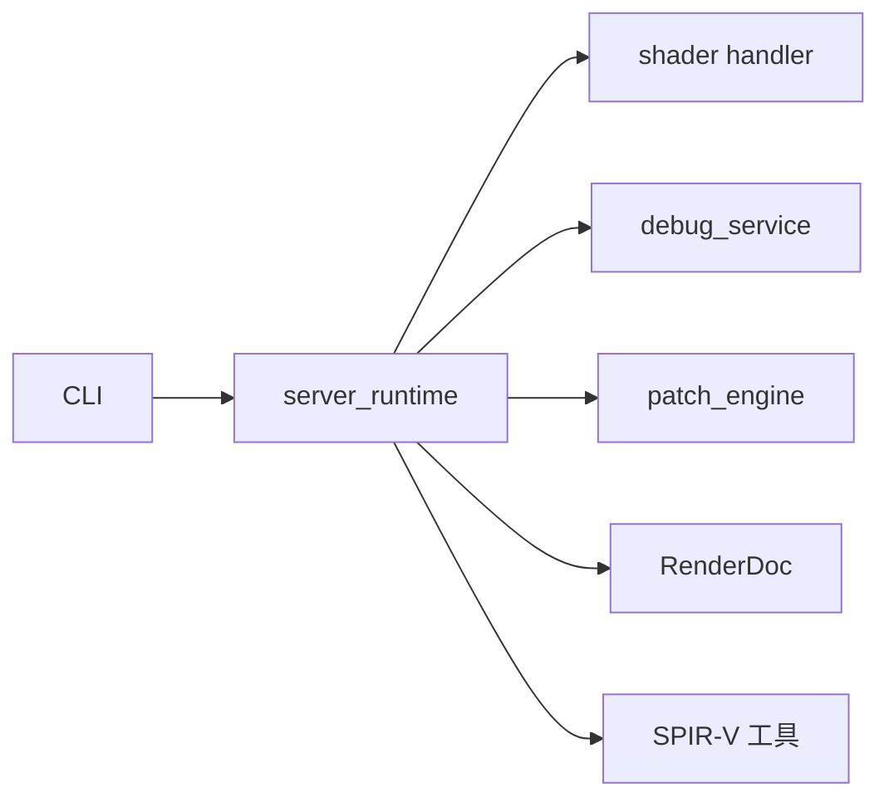

# 着色器调试命令

<cite>
**本文引用的文件**   
- [rdc_tool/handlers/shader.py](file://rdc_tool/handlers/shader.py)
- [rdc_tool/server_runtime.py](file://rdc_tool/server_runtime.py)
- [rdc_tool/core/debug_service.py](file://rdc_tool/core/debug_service.py)
- [rdc_tool/cli.py](file://rdc_tool/cli.py)
- [docs/tool-reference.md](file://docs/tool-reference.md)
- [tests/test_shader_replace_contracts.py](file://tests/test_shader_replace_contracts.py)
</cite>

## 目录
1. [简介](#简介)
2. [项目结构](#项目结构)
3. [核心组件](#核心组件)
4. [架构总览](#架构总览)
5. [详细组件分析](#详细组件分析)
6. [依赖关系分析](#依赖关系分析)
7. [性能注意事项](#性能注意事项)
8. [故障排查指南](#故障排查指南)
9. [结论](#结论)
10. [附录：命令与参数速查](#附录命令与参数速查)

## 简介
本文件面向使用 rdc 工具链的开发者，系统化说明“着色器调试”相关命令与能力，重点覆盖以下目标：
- 获取着色器源代码：通过 rd.shader.get_source（对应 CLI 中的 rdc-tool shader source）在捕获包含调试信息时返回源码；不可用时提供格式感知的回退建议。
- 获取着色器反汇编/IR：通过 rd.shader.get_disassembly（对应 CLI 中的 rdc-tool shader disasm）获取目标 IR/ASM（如 SPIR-V ASM、DXIL 等），并给出可编辑性提示。
- 查看着色器常量值：通过 rd.pipeline.get_constant_buffers / rd.shader.get_constant_buffer_contents（对应 CLI 中的 rdc-tool shader constants）读取常量缓冲布局与运行时绑定数据。
- 事件与阶段选择：所有命令均支持 --event-id 指定 draw-call 事件，--stage 指定着色器阶段（vs、gs、ps、cs 等）。
- SPIR-V 工具集成：当 RenderDoc 未暴露原始 ASM 目标时，可通过 spirv-as/spirv-dis 进行二进制与文本之间的转换，并在环境检测中报告可用性。

## 项目结构
围绕着色器调试的命令由“CLI 入口 → 分发层 → 服务实现 → RenderDoc/驱动”的分层架构组成：
- CLI 层：解析命令行参数（如 --event-id、--stage），将调用映射到内部操作名（例如 rdc-tool shader source → rd.shader.get_source）。
- 分发层：server_runtime._dispatch_shader(action, args) 根据 action 路由到具体实现。
- 服务层：shader handler 转发至 server_runtime；debug_service 封装像素/顶点级逐步调试；patch_engine 负责编译/替换工作流。
- 外部依赖：RenderDoc Python API、可选的 SPIR-V 工具链（spirv-as/spirv-dis）。

**图示来源**
- [rdc_tool/handlers/shader.py:8-9](file://rdc_tool/handlers/shader.py#L8-L9)
- [rdc_tool/server_runtime.py:177-213](file://rdc_tool/server_runtime.py#L177-L213)
- [rdc_tool/core/debug_service.py:43-110](file://rdc_tool/core/debug_service.py#L43-L110)

**章节来源**
- [rdc_tool/handlers/shader.py:1-11](file://rdc_tool/handlers/shader.py#L1-L11)
- [rdc_tool/server_runtime.py:177-213](file://rdc_tool/server_runtime.py#L177-L213)

## 核心组件
- 着色器处理器：统一转发 action 到 server_runtime 的 _dispatch_shader。
- 运行时服务：集中管理 session、replay、artifacts、patch engine、渲染服务等，承载 shader 相关操作的实现。
- 调试服务：封装 RenderDoc 的 pixel/vertex shader debug 能力，支持逐步执行、变量提取、NaN/Inf 检测、trace 持久化。
- 补丁引擎：负责编译、替换、回滚 shader，并与 RenderDoc 的构建/替换接口交互。
- CLI 与环境检测：报告 spirv-as/spirv-dis 可用性，便于在缺少工具时给出明确提示。

**章节来源**
- [rdc_tool/handlers/shader.py:8-9](file://rdc_tool/handlers/shader.py#L8-L9)
- [rdc_tool/core/debug_service.py:43-110](file://rdc_tool/core/debug_service.py#L43-L110)
- [rdc_tool/cli.py:477-489](file://rdc_tool/cli.py#L477-L489)

## 架构总览
下图展示从 CLI 到 RenderDoc 的完整调用路径，以及 SPIR-V 工具在反汇编/编译流程中的角色。

**图示来源**
- [rdc_tool/handlers/shader.py:8-9](file://rdc_tool/handlers/shader.py#L8-L9)
- [rdc_tool/server_runtime.py:177-213](file://rdc_tool/server_runtime.py#L177-L213)
- [rdc_tool/core/debug_service.py:122-191](file://rdc_tool/core/debug_service.py#L122-L191)
- [rdc_tool/cli.py:477-489](file://rdc_tool/cli.py#L477-L489)

## 详细组件分析

### 获取着色器源代码：rd.shader.get_source（CLI：rdc-tool shader source）
- 功能：尝试从捕获文件中提取着色器源码（若包含 PDB/DWARF/source embedding 等调试信息）。
- 失败回退：当调试源码不可用时，返回 format-aware 的回退建议，例如对 SPIR-V 建议使用 rd.shader.get_disassembly，target="SPIR-V ASM"，source_encoding="spirvasm"；对 DXIL/DXBC 则建议只读反汇编或提取二进制。
- 典型参数：session_id、event_id、stage、shader_id（可选）、prefer_original（可选）。
- 输出：source、files、source_available、fallback_tool、fallback_args、edit_plan、failure_stage/reason 等。

**图示来源**
- [tests/test_shader_replace_contracts.py:571-623](file://tests/test_shader_replace_contracts.py#L571-L623)
- [docs/tool-reference.md:200-217](file://docs/tool-reference.md#L200-L217)

**章节来源**
- [docs/tool-reference.md:200-217](file://docs/tool-reference.md#L200-L217)
- [tests/test_shader_replace_contracts.py:571-623](file://tests/test_shader_replace_contracts.py#L571-L623)

### 获取着色器反汇编：rd.shader.get_disassembly（CLI：rdc-tool shader disasm）
- 功能：获取指定 shader 的反汇编/IR，支持 auto/SPIR-V ASM/DXIL 等目标。
- 元数据：返回 target、source_encoding、is_raw_spirv_asm、source_hash、edit_plan（描述可编辑性、允许的操作、推荐下一步工具）。
- 与 SPIR-V 工具链集成：当 RenderDoc 未暴露原始 ASM 目标时，可通过 spirv-as/spirv-dis 进行二进制与文本之间的转换；CLI 会报告这些工具的可用性与路径。
- 典型参数：session_id、event_id、stage、shader_id（可选）、target（可选）。

**图示来源**
- [rdc_tool/cli.py:477-489](file://rdc_tool/cli.py#L477-L489)
- [tests/test_shader_replace_contracts.py:1551-1608](file://tests/test_shader_replace_contracts.py#L1551-L1608)
- [docs/tool-reference.md:200-217](file://docs/tool-reference.md#L200-L217)

**章节来源**
- [docs/tool-reference.md:200-217](file://docs/tool-reference.md#L200-L217)
- [tests/test_shader_replace_contracts.py:1551-1608](file://tests/test_shader_replace_contracts.py#L1551-L1608)
- [rdc_tool/cli.py:477-489](file://rdc_tool/cli.py#L477-L489)

### 查看着色器常量：rd.pipeline.get_constant_buffers / rd.shader.get_constant_buffer_contents（CLI：rdc-tool shader constants）
- 功能：
  - 获取指定 stage 的常量缓冲绑定（slot/buffer/offset/size）。
  - 按反射结构解码常量缓冲变量值（推荐专家级核对）。
- 典型参数：session_id、stage、event_id（可选）、slot/array_index/max_bytes/flatten 等。
- 输出：constant_buffers（布局与绑定）、cbuffer（解码后的变量值）。

**图示来源**
- [docs/tool-reference.md:144-155](file://docs/tool-reference.md#L144-L155)
- [docs/tool-reference.md:200-217](file://docs/tool-reference.md#L200-L217)

**章节来源**
- [docs/tool-reference.md:144-155](file://docs/tool-reference.md#L144-L155)
- [docs/tool-reference.md:200-217](file://docs/tool-reference.md#L200-L217)

### 像素/顶点级逐步调试：rd.debug.*（配合 rd.shader.debug_start）
- 功能：启动 shader debugger（默认 pixel），逐步执行直到断点/结束/超时；支持 step、continue、run_to、evaluate_expression、get_variables、get_callstack、set_breakpoints、clear_breakpoints、finish 等操作。
- 底层实现：debug_service 封装 RenderDoc 的 DebugPixel/DebugVertex 与 ContinueDebug，提取变量、检测 NaN/Inf、持久化 trace artifact。
- 典型参数：session_id、mode、event_id、params、timeout_ms、shader_debug_id（后续步骤）。

**图示来源**
- [rdc_tool/core/debug_service.py:122-191](file://rdc_tool/core/debug_service.py#L122-L191)
- [rdc_tool/core/debug_service.py:271-421](file://rdc_tool/core/debug_service.py#L271-L421)
- [docs/tool-reference.md:82-97](file://docs/tool-reference.md#L82-L97)

**章节来源**
- [rdc_tool/core/debug_service.py:43-110](file://rdc_tool/core/debug_service.py#L43-L110)
- [rdc_tool/core/debug_service.py:122-191](file://rdc_tool/core/debug_service.py#L122-L191)
- [rdc_tool/core/debug_service.py:271-421](file://rdc_tool/core/debug_service.py#L271-L421)
- [docs/tool-reference.md:82-97](file://docs/tool-reference.md#L82-L97)

### 着色器替换与编译：rd.shader.edit_and_replace / rd.shader.compile
- 功能：在当前 Replay Session 中替换 shader；支持 event_id+stage 与 event_id+stage+shader_id 两种入口；可指定 source_text/source_path/target/source_encoding/diff_text 等。
- 编译与回滚：支持外部编译器（dxc/glslangValidator/metal）或 RenderDoc 内置构建；成功后可 revert_replacement 恢复原着色器。
- 与反汇编/源码的关系：当源码不可用时，edit_plan 会指导下一步（如先获取反汇编再编辑）。

**图示来源**
- [docs/tool-reference.md:200-217](file://docs/tool-reference.md#L200-L217)
- [tests/test_shader_replace_contracts.py:276-303](file://tests/test_shader_replace_contracts.py#L276-L303)
- [tests/test_shader_replace_contracts.py:556-568](file://tests/test_shader_replace_contracts.py#L556-L568)

**章节来源**
- [docs/tool-reference.md:200-217](file://docs/tool-reference.md#L200-L217)
- [tests/test_shader_replace_contracts.py:276-303](file://tests/test_shader_replace_contracts.py#L276-L303)
- [tests/test_shader_replace_contracts.py:556-568](file://tests/test_shader_replace_contracts.py#L556-L568)

## 依赖关系分析
- CLI 到分发层：CLI 将 rdc-tool shader source/disasm/constants 映射为 rd.shader.get_source/get_disassembly/get_constant_buffers 等操作。
- 分发层到服务：server_runtime._dispatch_shader 根据 action 路由到具体实现；shader handler 仅做转发。
- 服务到外部：RenderDoc API（着色器调试、反汇编、常量缓冲读取）、SPIR-V 工具（spirv-as/spirv-dis）用于二进制/文本转换。
- 测试验证：测试用例覆盖了 get_source 回退、get_disassembly 的 raw SPIR-V 元数据、edit_and_replace 的工件与错误处理。

**图示来源**
- [rdc_tool/handlers/shader.py:8-9](file://rdc_tool/handlers/shader.py#L8-L9)
- [rdc_tool/server_runtime.py:177-213](file://rdc_tool/server_runtime.py#L177-L213)
- [rdc_tool/cli.py:477-489](file://rdc_tool/cli.py#L477-L489)
- [tests/test_shader_replace_contracts.py:571-623](file://tests/test_shader_replace_contracts.py#L571-L623)

**章节来源**
- [rdc_tool/handlers/shader.py:8-9](file://rdc_tool/handlers/shader.py#L8-L9)
- [rdc_tool/server_runtime.py:177-213](file://rdc_tool/server_runtime.py#L177-L213)
- [rdc_tool/cli.py:477-489](file://rdc_tool/cli.py#L477-L489)
- [tests/test_shader_replace_contracts.py:571-623](file://tests/test_shader_replace_contracts.py#L571-L623)

## 性能注意事项
- 逐步调试步数上限：pixel/vertex 调试默认限制最大步数（例如 20,000），避免 trace 失控。
- 常量缓冲读取大小：max_bytes 控制读取范围，避免过大 JSON 响应；必要时导出为文件。
- 纹理/缓冲区内联限制：内联 base64 限制通常为 1 MiB，超过应使用 output_path 或 artifacts。
- SPIR-V 工具链：spirv-as/spirv-dis 的可用性影响反汇编/编译流程；缺失时将给出明确提示。

[本节为通用指导，不直接分析具体文件]

## 故障排查指南
- 调试不可用：当前 API/驱动不支持 shader debugging（OpenGL/ES 通常不支持），将返回 capability-style 错误或更温和的失败信息。
- RenderDoc 模块不可用：若 renderdoc Python module 未加载，调试功能不可用；请确保 RDC_TOOL_RENDERDOC_PATH 或 sys.path 正确。
- 源码不可用：当捕获不包含调试信息时，get_source 返回 source_available=false 并提供回退建议（如 get_disassembly）。
- 反汇编不可用：当请求 target 不存在或源码不可取时，返回 shader_disassembly_unavailable，并附带 failure_stage/reason。
- 常量缓冲读取失败：资源未绑定或格式不支持时会返回明确的错误码与详情。

**章节来源**
- [rdc_tool/core/debug_service.py:427-466](file://rdc_tool/core/debug_service.py#L427-L466)
- [rdc_tool/core/debug_service.py:573-595](file://rdc_tool/core/debug_service.py#L573-L595)
- [docs/tool-reference.md:200-217](file://docs/tool-reference.md#L200-L217)

## 结论
rdc 的着色器调试命令以统一的 CLI 入口和稳定的内部操作定义，提供了从源码获取、反汇编/IR 查看、常量缓冲检查到像素/顶点级逐步调试的完整能力。通过 format-aware 的回退策略与 SPIR-V 工具链集成，能够在不同平台与捕获条件下提供一致的调试体验。建议在实际使用中结合 event_id 与 stage 精确限定上下文，并利用 edit_plan 与 artifacts 进行问题定位与修复。

[本节为总结，不直接分析具体文件]

## 附录：命令与参数速查
- rdc-tool shader source
  - 作用：获取着色器源码（若捕获包含调试信息）。
  - 关键参数：--event-id、--stage、--shader-id（可选）、--prefer-original（可选）。
  - 回退：当调试源码不可用时，建议 rd.shader.get_disassembly（target="SPIR-V ASM"，source_encoding="spirvasm"）。
- rdc-tool shader disasm
  - 作用：获取着色器反汇编/IR（auto/SPIR-V ASM/DXIL 等）。
  - 关键参数：--event-id、--stage、--shader-id（可选）、--target（可选）。
  - 集成：当 RenderDoc 未暴露原始 ASM 目标时，可使用 spirv-as/spirv-dis 进行转换。
- rdc-tool shader constants
  - 作用：查看常量缓冲绑定与变量值。
  - 关键参数：--event-id、--stage、--slot（可选）、--array-index（可选）、--max-bytes（可选）、--flatten（可选）。
  - 输出：常量缓冲布局与解码后的变量值。

示例用法（概念性）：
- 获取 PS 阶段源码：rdc-tool shader source --event-id 42 --stage ps
- 获取 VS 阶段反汇编：rdc-tool shader disasm --event-id 42 --stage vs --target "SPIR-V ASM"
- 查看 PS 阶段常量缓冲：rdc-tool shader constants --event-id 42 --stage ps --slot 0

**章节来源**
- [rdc_tool/cli.py:101-101](file://rdc_tool/cli.py#L101-L101)
- [docs/tool-reference.md:82-97](file://docs/tool-reference.md#L82-L97)
- [docs/tool-reference.md:144-155](file://docs/tool-reference.md#L144-L155)
- [docs/tool-reference.md:200-217](file://docs/tool-reference.md#L200-L217)
- [tests/test_shader_replace_contracts.py:571-623](file://tests/test_shader_replace_contracts.py#L571-L623)
- [tests/test_shader_replace_contracts.py:1551-1608](file://tests/test_shader_replace_contracts.py#L1551-L1608)