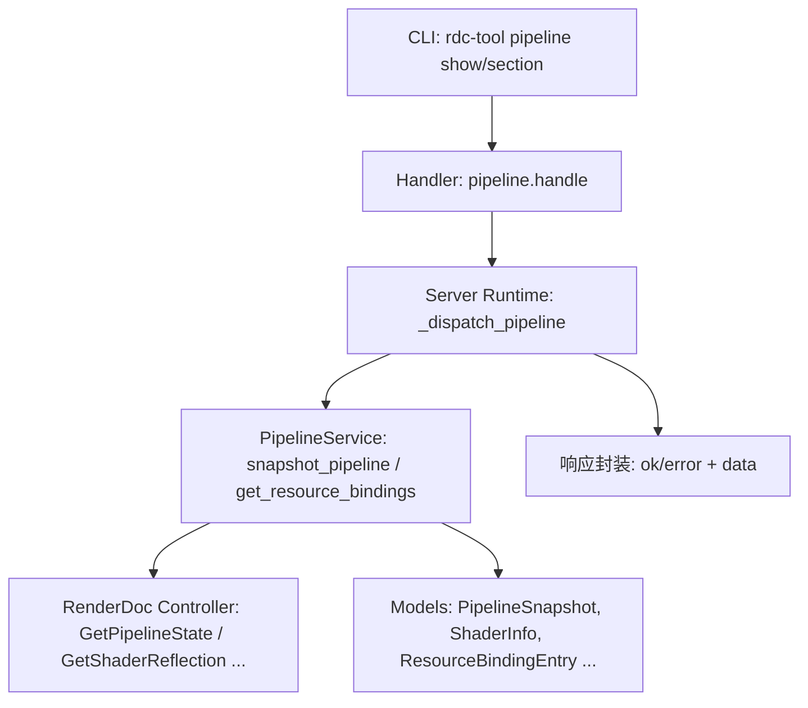
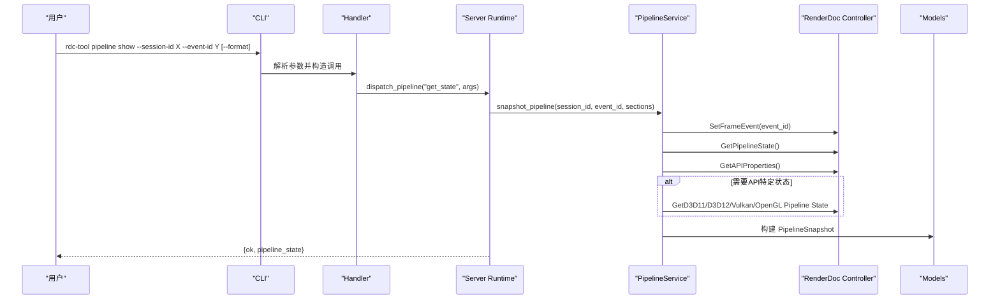
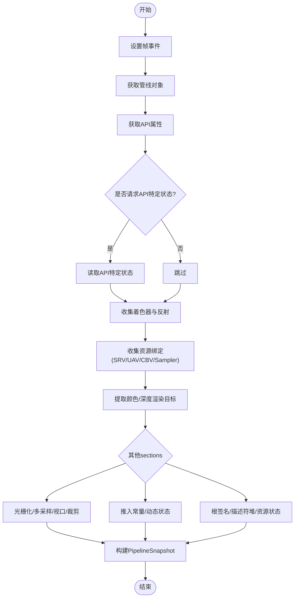
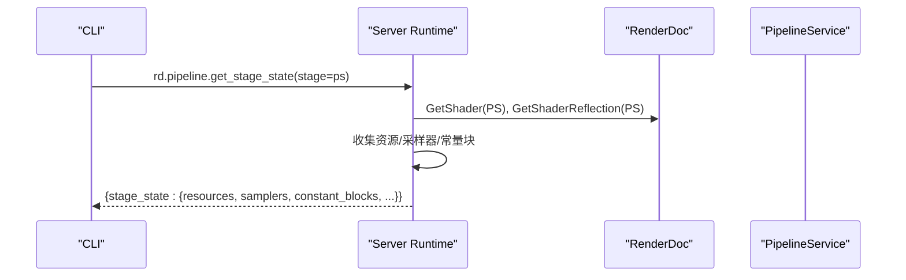
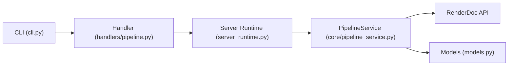

# 管线状态命令

<cite>
**本文引用的文件**
- [rdc_tool/cli.py](file://rdc_tool/cli.py)
- [rdc_tool/handlers/pipeline.py](file://rdc_tool/handlers/pipeline.py)
- [rdc_tool/server_runtime.py](file://rdc_tool/server_runtime.py)
- [rdc_tool/core/pipeline_service.py](file://rdc_tool/core/pipeline_service.py)
- [rdc_tool/models.py](file://rdc_tool/models.py)
</cite>

## 目录
1. [简介](#简介)
2. [项目结构](#项目结构)
3. [核心组件](#核心组件)
4. [架构总览](#架构总览)
5. [详细组件分析](#详细组件分析)
6. [依赖关系分析](#依赖关系分析)
7. [性能考虑](#性能考虑)
8. [故障排查指南](#故障排查指南)
9. [结论](#结论)
10. [附录：使用示例与最佳实践](#附录使用示例与最佳实践)

## 简介
本文件面向“管线状态”相关命令，系统性说明如何使用 rdc-tool pipeline show 与 rdc-tool pipeline section 获取并分析 GPU 管线的当前状态。内容覆盖顶点输入、光栅化、片段着色等阶段的配置；着色器绑定、常量缓冲区、纹理采样器等查询选项；以及如何在实际调试中定位渲染问题、对比不同帧的管线状态差异。同时解释管线状态的数据结构与对应 GPU 硬件概念的关系，帮助读者从命令行到内部服务再到 RenderDoc API 的全链路理解。

## 项目结构
管线状态命令在 CLI 层定义参数与子命令，经由处理器路由到服务端运行时，再由管道服务从 RenderDoc 控制器读取具体管线快照，最终通过模型序列化输出。

图表来源
- [rdc_tool/cli.py:1508-1518](file://rdc_tool/cli.py#L1508-L1518)
- [rdc_tool/handlers/pipeline.py:8-10](file://rdc_tool/handlers/pipeline.py#L8-L10)
- [rdc_tool/server_runtime.py:7470-7500](file://rdc_tool/server_runtime.py#L7470-L7500)
- [rdc_tool/core/pipeline_service.py:590-702](file://rdc_tool/core/pipeline_service.py#L590-L702)
- [rdc_tool/models.py:280-300](file://rdc_tool/models.py#L280-L300)

章节来源
- [rdc_tool/cli.py:1508-1518](file://rdc_tool/cli.py#L1508-L1518)
- [rdc_tool/handlers/pipeline.py:8-10](file://rdc_tool/handlers/pipeline.py#L8-L10)
- [rdc_tool/server_runtime.py:7470-7500](file://rdc_tool/server_runtime.py#L7470-L7500)
- [rdc_tool/core/pipeline_service.py:590-702](file://rdc_tool/core/pipeline_service.py#L590-L702)
- [rdc_tool/models.py:280-300](file://rdc_tool/models.py#L280-L300)

## 核心组件
- CLI 参数解析与命令路由：定义 pipeline show/section 及 shader 相关子命令，统一注入 session-id、event-id、format 等通用参数。
- Handler 转发：将动作委托给 server_runtime 的管道分发器。
- Server Runtime 分发：校验参数、选择 sections、调用 PipelineService 并组装响应。
- PipelineService：基于 RenderDoc 控制器读取管线快照，提取着色器、绑定、视口、混合、深度模板、拓扑、光栅化、多采样、推入常量、动态状态、根签名、描述符堆、资源状态等。
- 数据模型：以 Pydantic 模型表达管线快照、着色器信息、资源绑定条目、渲染目标、混合状态、深度模板状态等。

章节来源
- [rdc_tool/cli.py:1389-1518](file://rdc_tool/cli.py#L1389-L1518)
- [rdc_tool/handlers/pipeline.py:8-10](file://rdc_tool/handlers/pipeline.py#L8-L10)
- [rdc_tool/server_runtime.py:7470-7500](file://rdc_tool/server_runtime.py#L7470-L7500)
- [rdc_tool/core/pipeline_service.py:590-702](file://rdc_tool/core/pipeline_service.py#L590-L702)
- [rdc_tool/models.py:224-300](file://rdc_tool/models.py#L224-L300)

## 架构总览
下图展示从命令行到管线状态数据的完整调用链，包括可选的 sections 过滤与可视化目标附加。

图表来源
- [rdc_tool/cli.py:1508-1518](file://rdc_tool/cli.py#L1508-L1518)
- [rdc_tool/handlers/pipeline.py:8-10](file://rdc_tool/handlers/pipeline.py#L8-L10)
- [rdc_tool/server_runtime.py:7470-7500](file://rdc_tool/server_runtime.py#L7470-L7500)
- [rdc_tool/core/pipeline_service.py:590-702](file://rdc_tool/core/pipeline_service.py#L590-L702)

## 详细组件分析

### 命令入口与参数
- pipeline show：支持 --session-id、--event-id、--format（json/tsv）。默认返回 summary 或 full 的管线摘要，full 包含所有 sections。
- pipeline section：额外要求 --stage（如 vs/hs/ds/gs/ps/cs），用于聚焦某一着色阶段相关的管线部分。
- 这些参数会被转换为内部调用 rd.pipeline.get_state 或 rd.pipeline.get_stage_state，并由服务器端校验与执行。

章节来源
- [rdc_tool/cli.py:1508-1518](file://rdc_tool/cli.py#L1508-L1518)
- [rdc_tool/server_runtime.py:7470-7500](file://rdc_tool/server_runtime.py#L7470-L7500)

### 管线状态快照（pipeline show）
- 作用：获取指定事件处的完整管线状态快照，包括着色器、渲染目标、深度目标、混合状态、深度模板、视口/裁剪、拓扑、顶点输入、光栅化、多采样、推入常量、动态状态、根签名、描述符堆、资源状态等。
- 关键流程：
  - 设置帧事件并获取管线对象。
  - 根据所选 sections 决定是否读取 API 特定状态。
  - 遍历各着色阶段收集着色器信息与资源绑定。
  - 提取渲染目标与深度目标，必要时附加可视化目标信息。
  - 将结果序列化为 PipelineSnapshot。

图表来源
- [rdc_tool/core/pipeline_service.py:590-702](file://rdc_tool/core/pipeline_service.py#L590-L702)
- [rdc_tool/server_runtime.py:7470-7500](file://rdc_tool/server_runtime.py#L7470-L7500)

章节来源
- [rdc_tool/core/pipeline_service.py:590-702](file://rdc_tool/core/pipeline_service.py#L590-L702)
- [rdc_tool/server_runtime.py:7470-7500](file://rdc_tool/server_runtime.py#L7470-L7500)

### 阶段级状态（pipeline section）
- 作用：针对某一着色阶段（如 ps）查看该阶段的管线段细节，例如着色器绑定、常量缓冲区、采样器等。
- 关键流程：
  - 解析 stage 并映射到 RenderDoc 阶段枚举。
  - 获取该阶段着色器与反射信息。
  - 收集只读资源、读写资源、常量块、采样器。
  - 计算绑定质量与降级原因，提供后续工具建议。

图表来源
- [rdc_tool/server_runtime.py:7504-7549](file://rdc_tool/server_runtime.py#L7504-L7549)
- [rdc_tool/core/pipeline_service.py:392-502](file://rdc_tool/core/pipeline_service.py#L392-L502)

章节来源
- [rdc_tool/server_runtime.py:7504-7549](file://rdc_tool/server_runtime.py#L7504-L7549)
- [rdc_tool/core/pipeline_service.py:392-502](file://rdc_tool/core/pipeline_service.py#L392-L502)

### 数据结构与GPU硬件对应关系
- PipelineSnapshot：表示一次事件处的管线快照，包含 api、shaders、render_targets、depth_target、blend_states、depth_stencil、bindings、viewports、scissors、topology、vertex_inputs、rasterizer、multisample、push_constants、dynamic_state、root_signature、descriptor_heaps、resource_states 等字段。
- ShaderInfo：着色器资源ID、阶段、入口点、编码类型。
- ResourceBindingEntry：绑定来源（着色器反射或直接描述符访问）、集合/空间、绑定号、资源ID、名称、类型（SRV/UAV/CBV/Sampler）、格式、描述符/采样器/访问信息。
- BlendState/DepthStencilState：混合与深度模板状态，对应 GPU 的混合单元与深度模板单元。
- RenderTargetInfo：颜色/深度渲染目标，对应 GPU 的输出合并阶段。
- 与硬件对应：
  - 顶点输入 → 顶点装配阶段
  - 拓扑 → 图元装配
  - 视口/裁剪 → 光栅化阶段
  - 混合/深度模板 → 输出合并阶段
  - 着色器绑定 → 描述符表/堆（D3D12/Vulkan）或固定绑定（GL/D3D11）
  - 推入常量 → 着色器常量区
  - 根签名/描述符堆 → D3D12/Vulkan 的资源绑定机制

章节来源
- [rdc_tool/models.py:224-300](file://rdc_tool/models.py#L224-L300)
- [rdc_tool/core/pipeline_service.py:193-327](file://rdc_tool/core/pipeline_service.py#L193-L327)

### 管线状态查询选项
- sections 控制：
  - shaders：着色器列表与反射信息
  - output_targets：渲染目标与深度目标
  - topology：图元拓扑
  - viewports_scissors：视口与裁剪矩形
  - blend：混合状态与选项
  - depth_stencil：深度模板状态
  - bindings：资源绑定（SRV/UAV/CBV/Sampler）
  - vertex_input：顶点输入布局
  - rasterizer：光栅化状态
  - multisample：多采样状态
  - push_constants：推入常量范围与布局
  - dynamic_state：动态状态（Vulkan）
  - root_signature：根签名（D3D12）
  - descriptor_heaps：描述符堆（D3D12）
  - resource_states：资源状态（D3D12/Vulkan）
- 过滤与投影：
  - server_runtime 会根据 detail 与 sections 选择字段，仅返回所需键，减少负载。
  - 当包含 output_targets 时，会尝试附加可视化目标信息。

章节来源
- [rdc_tool/core/pipeline_service.py:318-373](file://rdc_tool/core/pipeline_service.py#L318-L373)
- [rdc_tool/server_runtime.py:7470-7500](file://rdc_tool/server_runtime.py#L7470-L7500)

## 依赖关系分析
- CLI 依赖 handlers/pipeline 进行动作转发。
- handler 依赖 server_runtime 的分发逻辑。
- server_runtime 依赖 pipeline_service 完成真实数据抓取。
- pipeline_service 依赖 RenderDoc Python 模块与控制器接口。
- 所有结构化数据通过 models 中的 Pydantic 模型进行序列化与校验。

图表来源
- [rdc_tool/cli.py:1508-1518](file://rdc_tool/cli.py#L1508-L1518)
- [rdc_tool/handlers/pipeline.py:8-10](file://rdc_tool/handlers/pipeline.py#L8-L10)
- [rdc_tool/server_runtime.py:7470-7500](file://rdc_tool/server_runtime.py#L7470-L7500)
- [rdc_tool/core/pipeline_service.py:590-702](file://rdc_tool/core/pipeline_service.py#L590-L702)
- [rdc_tool/models.py:280-300](file://rdc_tool/models.py#L280-L300)

章节来源
- [rdc_tool/cli.py:1508-1518](file://rdc_tool/cli.py#L1508-L1518)
- [rdc_tool/handlers/pipeline.py:8-10](file://rdc_tool/handlers/pipeline.py#L8-L10)
- [rdc_tool/server_runtime.py:7470-7500](file://rdc_tool/server_runtime.py#L7470-L7500)
- [rdc_tool/core/pipeline_service.py:590-702](file://rdc_tool/core/pipeline_service.py#L590-L702)
- [rdc_tool/models.py:280-300](file://rdc_tool/models.py#L280-L300)

## 性能考虑
- sections 选择性加载：仅在需要时读取 API 特定状态，避免不必要的开销。
- 异步与线程池：对 RenderDoc 的阻塞调用通过 asyncio.to_thread 或 offload 执行，避免阻塞主循环。
- 资源去重：在收集绑定时使用 seen 集合去重，降低重复条目。
- 大对象限制：常量缓冲区可限制最大字节数与扁平化策略，避免过大响应。
- 投影裁剪：server_runtime 按 sections 裁剪返回字段，减少网络传输与序列化成本。

[本节为通用指导，不直接分析具体文件]

## 故障排查指南
- 无效 sections/detail：若传递了不支持的 sections 或 detail，将返回验证错误。检查 sections 是否在 PIPELINE_SECTIONS 白名单内。
- 绑定降级：当反射不可用或部分资源不可用时，binding_truth_level 可能为 binding_degraded，并给出推荐下一步工具。
- 读取失败：顶点缓冲、索引缓冲、渲染目标读取失败时会返回相应错误码，需检查 RenderDoc 上下文与事件有效性。
- 着色器未绑定：若某阶段无着色器绑定，将返回 shader_not_bound 错误，确认事件处确实存在该阶段绘制/调度。

章节来源
- [rdc_tool/server_runtime.py:7470-7500](file://rdc_tool/server_runtime.py#L7470-L7500)
- [rdc_tool/server_runtime.py:7504-7621](file://rdc_tool/server_runtime.py#L7504-L7621)

## 结论
rdc-tool pipeline show 与 rdc-tool pipeline section 提供了从高层摘要到阶段细节的完整管线状态查询能力。通过 sections 精细控制、结合模型化的数据结构与 RenderDoc 底层 API，用户可以高效地分析顶点输入、光栅化、片段着色等阶段配置，定位渲染问题，并在不同帧之间对比差异。建议在复杂场景中优先使用 sections 过滤与 stage 限定，以获得更聚焦且高效的诊断结果。

[本节为总结性内容，不直接分析具体文件]

## 附录：使用示例与最佳实践

- 基本用法
  - 获取某事件的管线摘要：rdc-tool pipeline show --session-id <id> --event-id <id> --format json
  - 获取完整管线快照：rdc-tool pipeline show --session-id <id> --event-id <id> --format json
  - 查看片段阶段状态：rdc-tool pipeline section --session-id <id> --event-id <id> --stage ps --format json

- 聚焦特定 sections
  - 仅查看绑定：rdc-tool pipeline show --session-id <id> --event-id <id> --format json --sections bindings
  - 仅查看渲染目标：rdc-tool pipeline show --session-id <id> --event-id <id> --format json --sections output_targets

- 分析与定位
  - 对比两帧差异：分别对帧 A 与帧 B 执行 pipeline show，比较 bindings、viewports、blend_states、depth_stencil 等关键字段。
  - 定位着色器绑定问题：使用 pipeline section --stage ps 查看 resources/samplers/constant_blocks，并结合 get_resource_bindings 过滤类型（SRV/UAV/CBV/Sampler）。
  - 检查常量缓冲区：使用 shader constants --stage ps --slot <n> 查看常量缓冲区内容与布局。

- 最佳实践
  - 始终指定 --event-id 明确目标帧。
  - 使用 --sections 缩小返回范围，提升性能与可读性。
  - 关注 binding_truth_level 与 summary_degraded_reasons，必要时切换到更底层的常量缓冲区或绑定映射工具。
  - 对于 Vulkan/D3D12，重点关注 push_constants、dynamic_state、root_signature、descriptor_heaps 等现代管线特性。

[本节为使用指导，不直接分析具体文件]