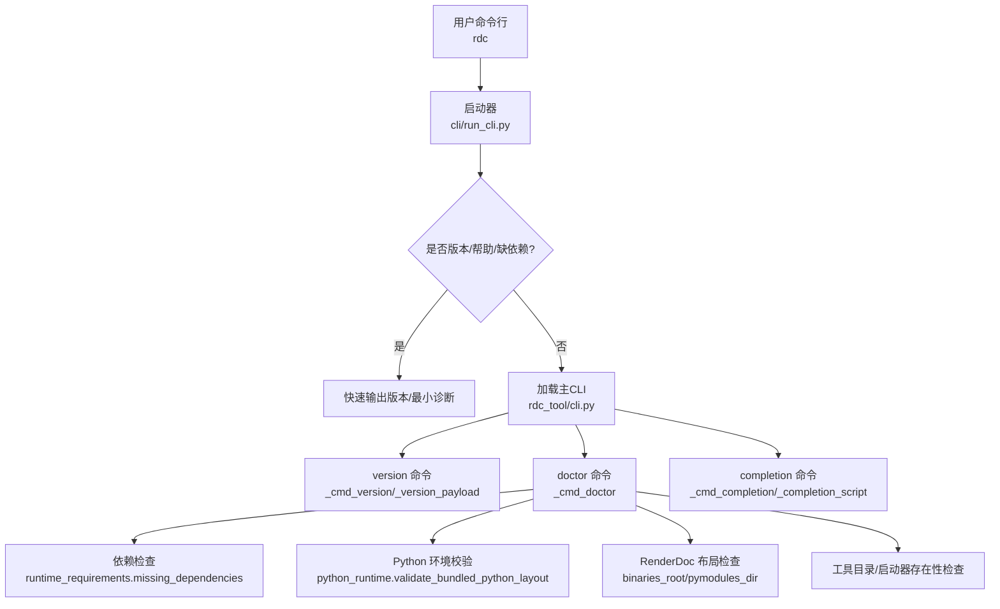
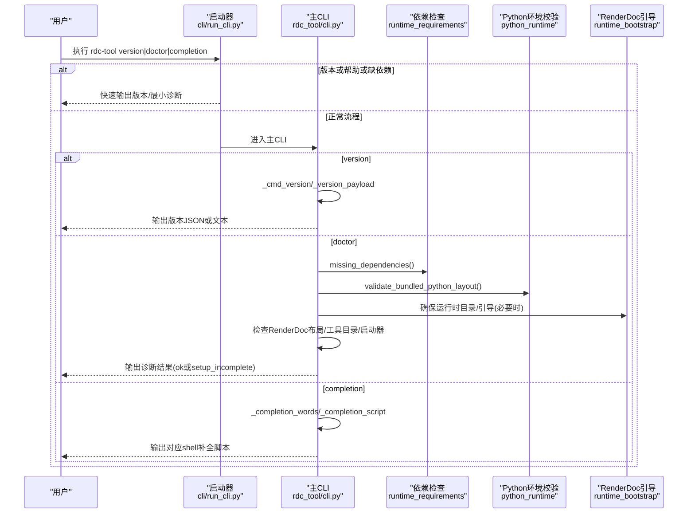
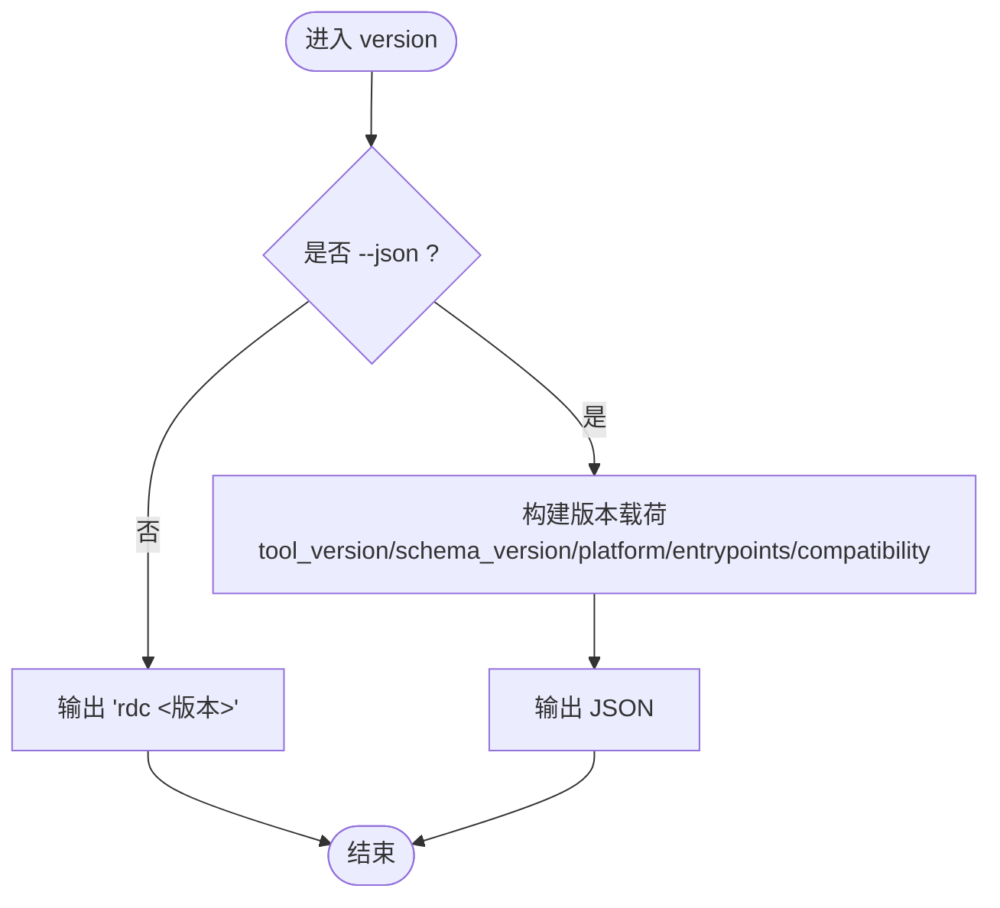
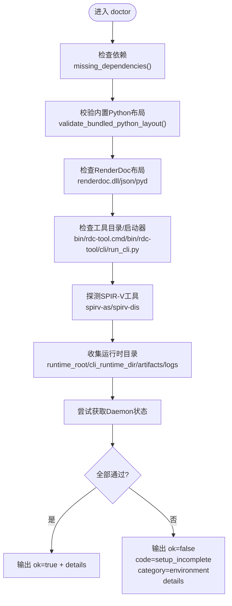
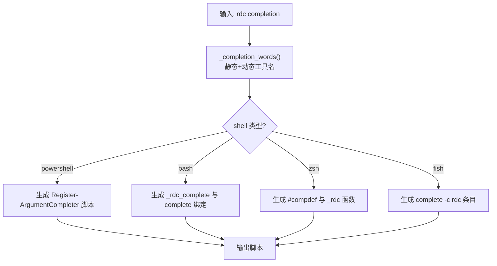
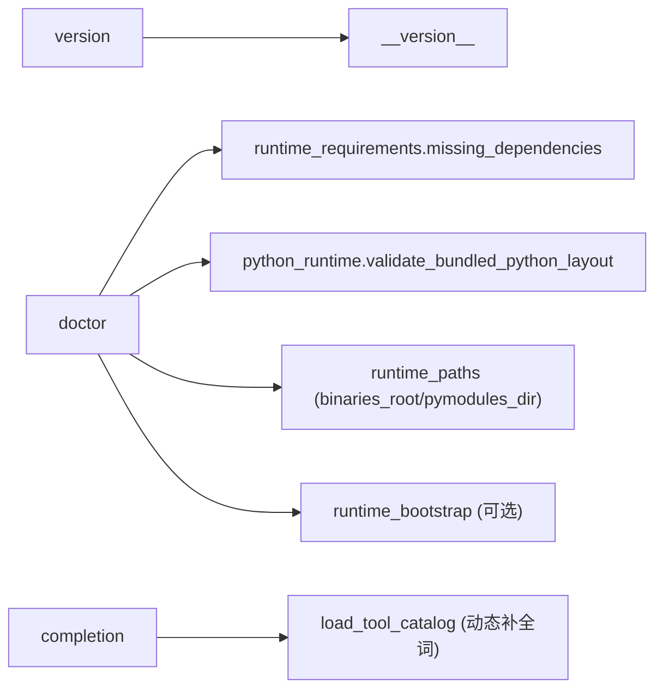

# 系统信息命令

<cite>
**本文引用的文件**
- [rdc_tool/cli.py](file://rdc_tool/cli.py)
- [cli/run_cli.py](file://cli/run_cli.py)
- [rdc_tool/__init__.py](file://rdc_tool/__init__.py)
- [rdc_tool/runtime_requirements.py](file://rdc_tool/runtime_requirements.py)
- [rdc_tool/python_runtime.py](file://rdc_tool/python_runtime.py)
- [rdc_tool/runtime_bootstrap.py](file://rdc_tool/runtime_bootstrap.py)
- [docs/public-contract.md](file://docs/public-contract.md)
- [docs/tool-reference.md](file://docs/tool-reference.md)
</cite>

## 目录
1. [简介](#简介)
2. [项目结构](#项目结构)
3. [核心组件](#核心组件)
4. [架构总览](#架构总览)
5. [详细组件分析](#详细组件分析)
6. [依赖关系分析](#依赖关系分析)
7. [性能与输出格式](#性能与输出格式)
8. [故障排查指南](#故障排查指南)
9. [结论](#结论)
10. [附录：命令速查与示例](#附录命令速查与示例)

## 简介
本章节面向 rdc-tools 的三类系统信息命令，提供完整、可操作的说明与最佳实践：
- rdc-tool version：显示工具版本、平台信息与兼容性状态。
- rdc-tool doctor：执行环境诊断，检查依赖项、Python 环境、RenderDoc 安装与布局、工具目录完整性等。
- rdc completion：生成 shell 补全脚本，支持 PowerShell、Bash、Zsh、Fish。

这些命令可用于获取系统信息、诊断环境问题、配置开发环境，并与其他工具（如 RenderDoc、SPIR-V 工具链）集成使用。

## 项目结构
与系统信息命令直接相关的代码集中在 CLI 入口与运行时辅助模块中：
- CLI 主逻辑与命令实现位于 rdc_tool/cli.py。
- 独立启动器位于 cli/run_cli.py，用于早期版本/依赖缺失时的快速反馈。
- 版本常量定义在 rdc_tool/__init__.py。
- 依赖检测在 rdc_tool/runtime_requirements.py。
- 内置 Python 环境校验在 rdc_tool/python_runtime.py。
- RenderDoc 运行时引导在 rdc_tool/runtime_bootstrap.py。
- 公共契约与工具参考文档在 docs/public-contract.md 与 docs/tool-reference.md。

图表来源
- [cli/run_cli.py:160-196](file://cli/run_cli.py#L160-L196)
- [rdc_tool/cli.py:410-564](file://rdc_tool/cli.py#L410-L564)
- [rdc_tool/runtime_requirements.py:52-57](file://rdc_tool/runtime_requirements.py#L52-L57)
- [rdc_tool/python_runtime.py:104-172](file://rdc_tool/python_runtime.py#L104-L172)

章节来源
- [cli/run_cli.py:16-63](file://cli/run_cli.py#L16-L63)
- [rdc_tool/cli.py:62-104](file://rdc_tool/cli.py#L62-L104)

## 核心组件
- 版本命令（version）
  - 功能：返回工具版本、Schema 版本、平台、工具根路径、公开命令列表、入口点路径以及兼容性元数据。
  - 输出：默认打印“rdc <版本号>”；加 --json 时输出结构化 JSON。
  - 关键实现：_cmd_version、_version_payload。
- 诊断命令（doctor）
  - 功能：全面检查运行环境，包括：
    - 缺失依赖（Pydantic、NumPy、Pillow、Jinja2、aiofiles）。
    - 内置 Python 布局有效性（manifest、exe、DLL、stdlib、site-packages、pth）。
    - RenderDoc 布局（renderdoc.dll、renderdoc.json、renderdoc.pyd）。
    - SPIR-V 工具可用性（spirv-as、spirv-dis）。
    - 工具目录与启动器完整性（bin/rdc-tool.cmd、bin/rdc-tool、cli/run_cli.py）。
    - 工具目录与运行时目录信息。
    - Daemon 状态（若可用）。
  - 输出：成功时返回 ok=true 的诊断详情；失败时返回 ok=false 的错误码 setup_incomplete 与 details。
  - 关键实现：_cmd_doctor。
- 补全命令（completion）
  - 功能：为指定 shell 生成参数补全脚本，包含静态命令/子命令/参数与动态工具名。
  - 支持：PowerShell、Bash、Zsh、Fish。
  - 关键实现：_cmd_completion、_completion_script、_completion_words。

章节来源
- [rdc_tool/cli.py:535-564](file://rdc_tool/cli.py#L535-L564)
- [rdc_tool/cli.py:410-532](file://rdc_tool/cli.py#L410-L532)
- [rdc_tool/cli.py:567-691](file://rdc_tool/cli.py#L567-L691)
- [rdc_tool/runtime_requirements.py:7-13](file://rdc_tool/runtime_requirements.py#L7-L13)
- [rdc_tool/python_runtime.py:104-172](file://rdc_tool/python_runtime.py#L104-L172)

## 架构总览
下图展示了从命令行到具体命令执行的调用链，以及各命令所调用的环境与依赖检查模块。

图表来源
- [cli/run_cli.py:160-196](file://cli/run_cli.py#L160-L196)
- [rdc_tool/cli.py:410-691](file://rdc_tool/cli.py#L410-L691)
- [rdc_tool/runtime_requirements.py:52-57](file://rdc_tool/runtime_requirements.py#L52-L57)
- [rdc_tool/python_runtime.py:104-172](file://rdc_tool/python_runtime.py#L104-L172)

## 详细组件分析

### 版本命令（rdc-tool version）
- 行为
  - 无参或 --version：输出“rdc <版本号>”。
  - --json：输出包含 tool_version、schema_version、platform、tools_root、public_commands、entrypoints、compatibility 的结构化 JSON。
- 关键点
  - 版本来自包内 __version__。
  - 平台字符串根据操作系统判定。
  - 兼容性与契约信息便于上层工具解析。
- 典型输出字段
  - result_kind: rdc_tool.version
  - data.tool_version / schema_version / platform / tools_root / entrypoints / compatibility.stability / compatibility.json_envelope

图表来源
- [rdc_tool/cli.py:535-564](file://rdc_tool/cli.py#L535-L564)
- [rdc_tool/__init__.py:1-4](file://rdc_tool/__init__.py#L1-L4)

章节来源
- [rdc_tool/cli.py:535-564](file://rdc_tool/cli.py#L535-L564)
- [rdc_tool/__init__.py:1-4](file://rdc_tool/__init__.py#L1-L4)
- [docs/public-contract.md:1-11](file://docs/public-contract.md#L1-L11)

### 诊断命令（rdc-tool doctor）
- 行为
  - 收集并验证：
    - 依赖项：pydantic、numpy、Pillow、jinja2、aiofiles。
    - 内置 Python 布局：manifest、exe、dll、stdlib、site-packages、pth。
    - RenderDoc 布局：renderdoc.dll、renderdoc.json、renderdoc.pyd。
    - SPIR-V 工具：spirv-as、spirv-dis。
    - 工具目录与启动器：bin/rdc-tool.cmd、bin/rdc-tool、cli/run_cli.py。
    - 运行时目录：runtime_root、cli_runtime_dir、artifacts_dir、logs_dir。
    - Daemon 状态（若可达）。
  - 成功：ok=true，data 包含上述详细信息。
  - 失败：ok=false，error.code=setup_incomplete，error.category=environment，details 包含问题清单。
- 关键实现
  - 依赖检查：missing_dependencies()。
  - Python 布局校验：validate_bundled_python_layout()。
  - RenderDoc 布局检查：基于 binaries_root() 与 pymodules_dir()。
  - 工具目录/启动器存在性检查。
  - 工具目录与运行时目录信息收集。
  - Daemon 状态查询（可能失败时降级为错误载荷）。

图表来源
- [rdc_tool/cli.py:410-532](file://rdc_tool/cli.py#L410-L532)
- [rdc_tool/runtime_requirements.py:52-57](file://rdc_tool/runtime_requirements.py#L52-L57)
- [rdc_tool/python_runtime.py:104-172](file://rdc_tool/python_runtime.py#L104-L172)

章节来源
- [rdc_tool/cli.py:410-532](file://rdc_tool/cli.py#L410-L532)
- [rdc_tool/runtime_requirements.py:7-13](file://rdc_tool/runtime_requirements.py#L7-L13)
- [rdc_tool/python_runtime.py:104-172](file://rdc_tool/python_runtime.py#L104-L172)

### 补全命令（rdc completion）
- 行为
  - 根据传入的 shell 类型生成对应的补全脚本。
  - 补全词集合包含：
    - 静态命令/子命令/参数（如 version、doctor、tools、daemon、context、session、capture、call、vfs、event、pipeline、shader、export、pixel、resource、diff、assert、completion、powershell、bash、zsh、fish 及常用参数）。
    - 动态工具名：从工具目录加载后合并入补全词。
- 支持 Shell
  - PowerShell：注册原生参数补全。
  - Bash：定义 _rdc_complete 并使用 complete 绑定。
  - Zsh：使用 compdef 与 compadd。
  - Fish：生成 complete -c rdc -f -a ... 条目。
- 关键实现
  - _completion_words：生成补全词表。
  - _completion_script：按 shell 类型生成脚本。
  - _cmd_completion：输出脚本内容。

图表来源
- [rdc_tool/cli.py:567-691](file://rdc_tool/cli.py#L567-L691)

章节来源
- [rdc_tool/cli.py:567-691](file://rdc_tool/cli.py#L567-L691)

## 依赖关系分析
- 版本命令
  - 依赖包版本常量与平台判断。
- 诊断命令
  - 依赖检查模块：runtime_requirements.missing_dependencies。
  - Python 环境校验：python_runtime.validate_bundled_python_layout。
  - 运行时路径：binaries_root、pymodules_dir、runtime_paths。
  - RenderDoc 引导：runtime_bootstrap（在需要时确保导入路径与 DLL 目录）。
- 补全命令
  - 依赖工具目录加载以动态补充补全词。

图表来源
- [rdc_tool/cli.py:410-691](file://rdc_tool/cli.py#L410-L691)
- [rdc_tool/runtime_requirements.py:52-57](file://rdc_tool/runtime_requirements.py#L52-L57)
- [rdc_tool/python_runtime.py:104-172](file://rdc_tool/python_runtime.py#L104-L172)

章节来源
- [rdc_tool/cli.py:410-691](file://rdc_tool/cli.py#L410-L691)
- [rdc_tool/runtime_requirements.py:7-13](file://rdc_tool/runtime_requirements.py#L7-L13)
- [rdc_tool/python_runtime.py:104-172](file://rdc_tool/python_runtime.py#L104-L172)

## 性能与输出格式
- 版本命令
  - 轻量级，几乎无 IO；--json 输出稳定结构，便于自动化消费。
- 诊断命令
  - 涉及文件系统检查与可能的 daemon 状态查询；整体开销较小。
  - 输出为统一 JSON 信封，便于解析与集成。
- 补全命令
  - 仅生成文本脚本；动态工具名加载可能受目录读取影响，但通常很快。
- 输出格式
  - 文本模式：人类可读。
  - JSON 模式：结构化，包含 result_kind、data、error、meta、projections 等字段，便于机器处理。

[本节为通用指导，不直接分析具体文件]

## 故障排查指南
- 常见错误与定位
  - 依赖缺失：doctor 返回 setup_incomplete，details.dependencies.missing 列出缺失包名。
  - Python 环境异常：details.python.bundled_python_failures 列出具体的缺失文件或目录。
  - RenderDoc 布局不完整：details.renderdoc.failures 列出缺失的 dll/json/pyd。
  - SPIR-V 工具不可用：details.shader_tools.spirv_as/spirv_dis.available=false，需安装对应工具。
  - 启动器缺失：details.launchers.*_exists=false，需确认 bin/rdc-tool.cmd、bin/rdc-tool、cli/run_cli.py 是否存在。
  - Daemon 状态异常：details.daemon 包含错误信息，可能是连接或状态读取失败。
- 建议步骤
  - 先运行 rdc-tool doctor --json 获取完整诊断信息。
  - 根据 details 逐项修复依赖与环境。
  - 对 SPIR-V 相关能力，安装 spirv-as/spirv-dis 并确保 PATH 正确。
  - 若使用远程或预览功能，确认 RenderDoc 已正确安装并可被导入。

章节来源
- [rdc_tool/cli.py:410-532](file://rdc_tool/cli.py#L410-L532)
- [rdc_tool/runtime_requirements.py:52-57](file://rdc_tool/runtime_requirements.py#L52-L57)
- [rdc_tool/python_runtime.py:104-172](file://rdc_tool/python_runtime.py#L104-L172)

## 结论
- rdc-tool version 提供稳定的版本与兼容性信息，适合自动化识别与契约校验。
- rdc-tool doctor 是环境健康检查的核心入口，能精准定位依赖、Python 布局、RenderDoc 与工具链问题。
- rdc completion 提升交互效率，支持主流 shell，便于开发与运维集成。
- 三者配合可实现“快速自检—修复—高效使用”的闭环。

[本节为总结，不直接分析具体文件]

## 附录：命令速查与示例
- 版本
  - 文本：rdc-tool version
  - JSON：rdc-tool version --json
  - 用途：查看工具版本、平台、入口点与兼容性。
- 诊断
  - 文本：rdc-tool doctor
  - JSON：rdc-tool doctor --json
  - 用途：检查依赖、Python 环境、RenderDoc 布局、SPIR-V 工具、工具目录与启动器、运行时目录、Daemon 状态。
- 补全
  - PowerShell：rdc completion powershell
  - Bash：rdc completion bash
  - Zsh：rdc completion zsh
  - Fish：rdc completion fish
  - 用途：生成 shell 补全脚本，提升命令行体验。

章节来源
- [rdc_tool/cli.py:62-104](file://rdc_tool/cli.py#L62-L104)
- [rdc_tool/cli.py:535-691](file://rdc_tool/cli.py#L535-L691)
- [cli/run_cli.py:86-118](file://cli/run_cli.py#L86-L118)