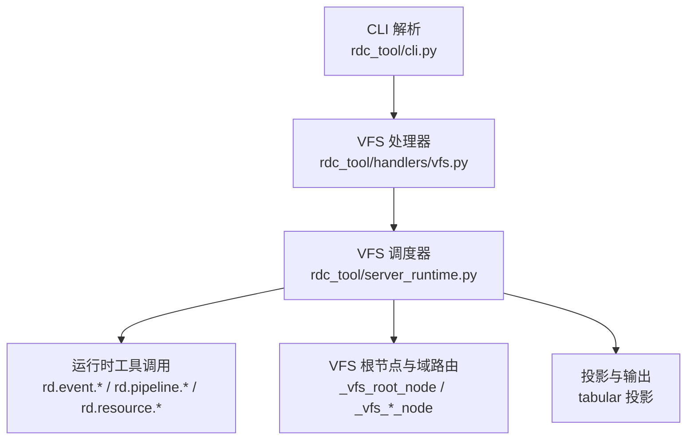
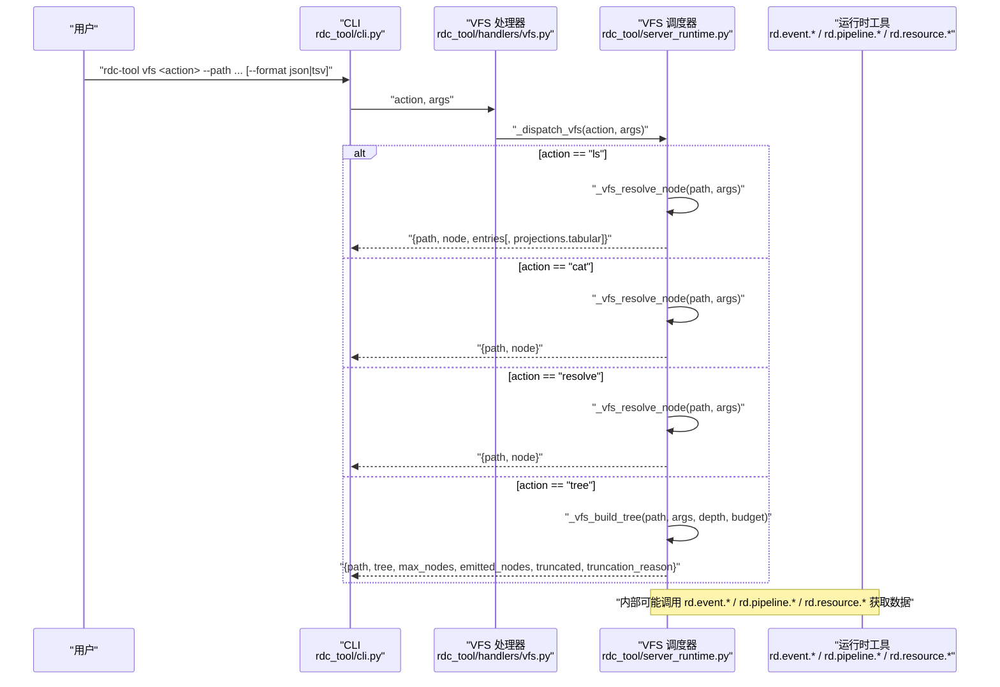
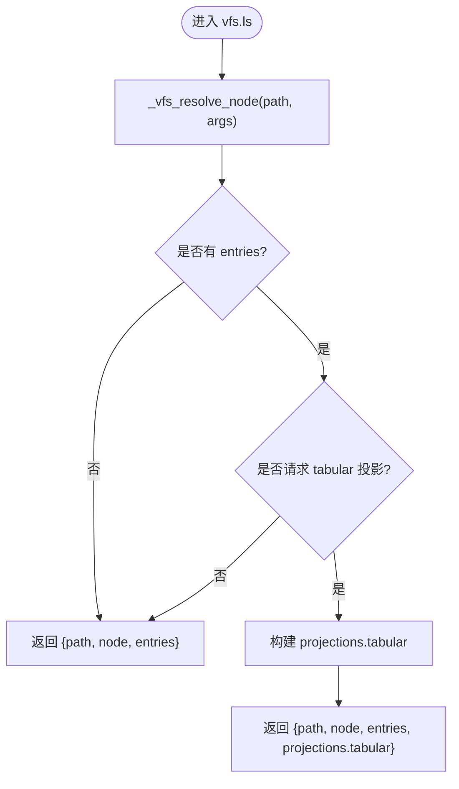
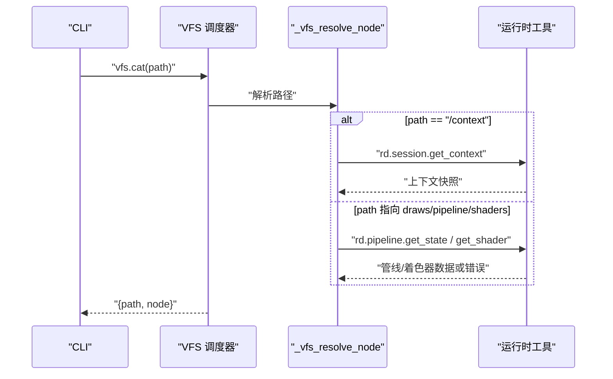
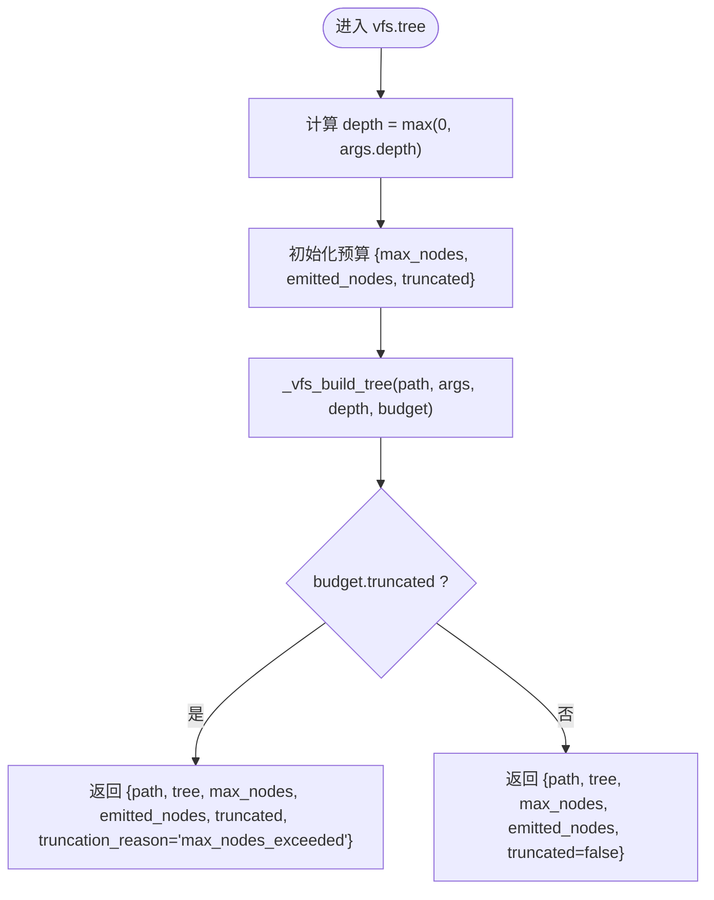
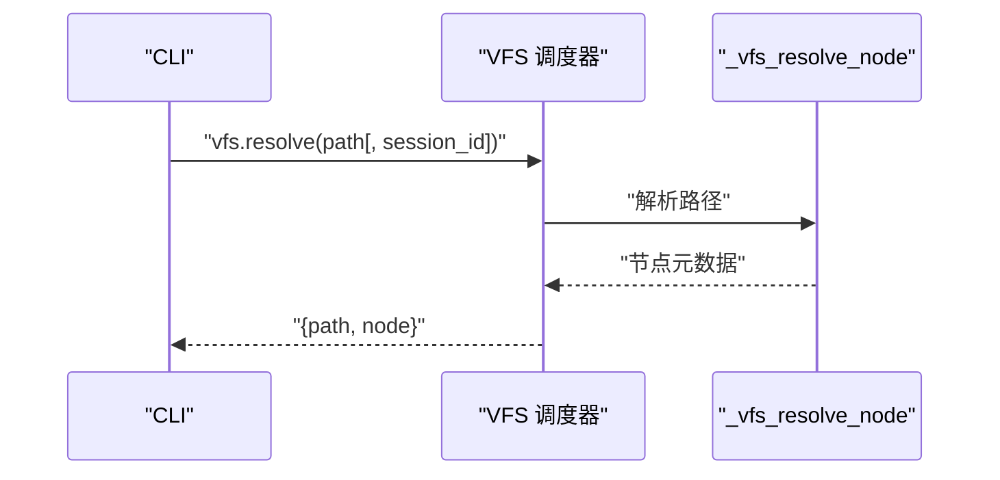
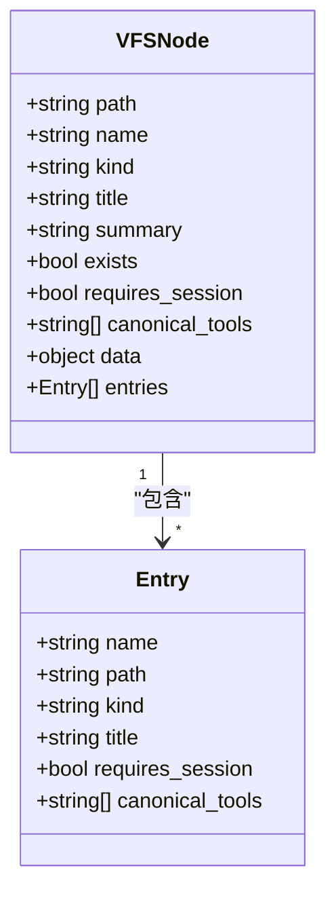
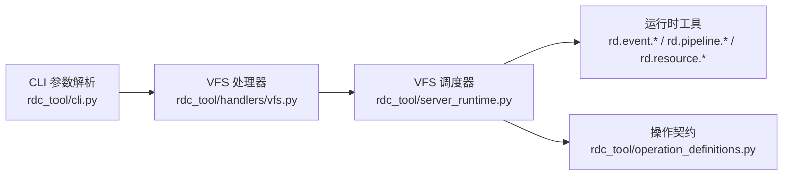

# 虚拟文件系统命令

<cite>
**本文引用的文件**
- [rdc_tool/handlers/vfs.py](file://rdc_tool/handlers/vfs.py)
- [rdc_tool/server_runtime.py](file://rdc_tool/server_runtime.py)
- [rdc_tool/operation_definitions.py](file://rdc_tool/operation_definitions.py)
- [rdc_tool/cli.py](file://rdc_tool/cli.py)
- [tests/test_cli_vfs.py](file://tests/test_cli_vfs.py)
- [tests/test_vfs.py](file://tests/test_vfs.py)
</cite>

## 目录
1. [简介](#简介)
2. [项目结构](#项目结构)
3. [核心组件](#核心组件)
4. [架构总览](#架构总览)
5. [详细组件分析](#详细组件分析)
6. [依赖关系分析](#依赖关系分析)
7. [性能考量](#性能考量)
8. [故障排查指南](#故障排查指南)
9. [结论](#结论)
10. [附录：参数与示例](#附录参数与示例)

## 简介
本章节面向使用 rdc-tool vfs 子命令的开发者与测试工程师，系统性说明以下能力：
- rdc-tool vfs ls：列出虚拟文件系统节点内容，支持表格投影输出。
- rdc-tool vfs cat：读取只读 VFS 节点的 JSON 表示，用于路径式浏览与导航。
- rdc-tool vfs tree：以树形结构展示 VFS 层级，支持深度限制与节点预算控制。
- rdc-tool vfs resolve：解析 VFS 路径到对应节点元数据，判断是否存在、是否需要 session 以及可用的只读视图。

这些命令通过统一的 VFS 路由层映射到运行时工具（如 rd.event.*、rd.pipeline.*、rd.resource.*），实现对捕获回放、管线状态、资源清单等运行时资源的“路径化”访问。VFS 是浏览与导航辅助层，不替代 canonical 调试/导出/状态 API。

## 项目结构
VFS 相关代码主要分布在以下位置：
- CLI 入口与子命令定义：rdc_tool/cli.py
- VFS 处理器转发：rdc_tool/handlers/vfs.py
- VFS 实现与调度：rdc_tool/server_runtime.py
- 操作契约与参数描述：rdc_tool/operation_definitions.py
- 行为验证测试：tests/test_cli_vfs.py、tests/test_vfs.py

**图表来源**
- [rdc_tool/cli.py:1490-1496](file://rdc_tool/cli.py#L1490-L1496)
- [rdc_tool/handlers/vfs.py:8-9](file://rdc_tool/handlers/vfs.py#L8-L9)
- [rdc_tool/server_runtime.py:12085-12120](file://rdc_tool/server_runtime.py#L12085-L12120)
- [rdc_tool/server_runtime.py:11703-11716](file://rdc_tool/server_runtime.py#L11703-L11716)

**章节来源**
- [rdc_tool/cli.py:1490-1496](file://rdc_tool/cli.py#L1490-L1496)
- [rdc_tool/handlers/vfs.py:8-9](file://rdc_tool/handlers/vfs.py#L8-L9)
- [rdc_tool/server_runtime.py:12085-12120](file://rdc_tool/server_runtime.py#L12085-L12120)
- [rdc_tool/server_runtime.py:11703-11716](file://rdc_tool/server_runtime.py#L11703-L11716)

## 核心组件
- VFS 处理器：将 action（ls/cat/tree/resolve）与参数转发给运行时调度器。
- VFS 调度器：根据 action 选择具体实现；对 ls 支持 tabular 投影；tree 支持 depth 与 max_nodes 预算；cat/resolve 返回节点元数据或完整节点。
- VFS 节点模型：统一封装 path、name、kind、title、summary、exists、requires_session、canonical_tools、data、entries 等字段。
- 域路由：根节点包含 context、artifacts、draws、passes、resources、textures、buffers、pipeline、shaders、debug 等域，每个域由专用函数处理路径片段。
- 会话上下文：需要 session 的域自动从当前上下文快照获取 session_id，否则抛出 session_required 错误并给出恢复提示。

**章节来源**
- [rdc_tool/handlers/vfs.py:8-9](file://rdc_tool/handlers/vfs.py#L8-L9)
- [rdc_tool/server_runtime.py:11600-11623](file://rdc_tool/server_runtime.py#L11600-L11623)
- [rdc_tool/server_runtime.py:11703-11716](file://rdc_tool/server_runtime.py#L11703-L11716)
- [rdc_tool/server_runtime.py:11668-11693](file://rdc_tool/server_runtime.py#L11668-L11693)

## 架构总览
下图展示了从 CLI 到 VFS 再到运行时工具的调用链路与数据流。

**图表来源**
- [rdc_tool/cli.py:1490-1496](file://rdc_tool/cli.py#L1490-L1496)
- [rdc_tool/handlers/vfs.py:8-9](file://rdc_tool/handlers/vfs.py#L8-L9)
- [rdc_tool/server_runtime.py:12085-12120](file://rdc_tool/server_runtime.py#L12085-L12120)

## 详细组件分析

### 命令：rdc-tool vfs ls
- 功能：列出指定 VFS 路径下的条目（entries）。仅 ls 支持 tabular 投影，可输出 columns、rows、row_count 与可选 tsv_text。
- 关键流程：
  - 解析 path，调用 _vfs_resolve_node 获取节点与 entries。
  - 若请求 tabular 投影，则生成投影对象并附加到响应。
- 典型用途：快速浏览 draws/passes/resources/pipeline/context/artifacts 结构；配合 --format tsv 进行可读性扫描。

**图表来源**
- [rdc_tool/server_runtime.py:12085-12108](file://rdc_tool/server_runtime.py#L12085-L12108)

**章节来源**
- [rdc_tool/server_runtime.py:12085-12108](file://rdc_tool/server_runtime.py#L12085-L12108)
- [tests/test_cli_vfs.py:320-356](file://tests/test_cli_vfs.py#L320-L356)

### 命令：rdc-tool vfs cat
- 功能：读取只读 VFS 节点的 JSON 表示，返回 node 及其 data。适合精确调试、导出或状态切换前确认路径语义。
- 关键流程：
  - 解析 path，调用 _vfs_resolve_node 获取节点。
  - 返回 {path, node}。
- 特殊路径：
  - /context：通过 rd.session.get_context 获取当前上下文快照。
  - /draws/<event>/pipeline/shaders/<stage>：通过 rd.pipeline.get_state/get_shader 获取管线与着色器信息；未绑定时返回 unavailable 节点。

**图表来源**
- [rdc_tool/server_runtime.py:12109-12111](file://rdc_tool/server_runtime.py#L12109-L12111)
- [tests/test_vfs.py:21-43](file://tests/test_vfs.py#L21-L43)
- [tests/test_vfs.py:45-89](file://tests/test_vfs.py#L45-L89)
- [tests/test_vfs.py:91-131](file://tests/test_vfs.py#L91-L131)

**章节来源**
- [rdc_tool/server_runtime.py:12109-12111](file://rdc_tool/server_runtime.py#L12109-L12111)
- [tests/test_vfs.py:21-43](file://tests/test_vfs.py#L21-L43)
- [tests/test_vfs.py:45-89](file://tests/test_vfs.py#L45-L89)
- [tests/test_vfs.py:91-131](file://tests/test_vfs.py#L91-L131)

### 命令：rdc-tool vfs tree
- 功能：按 VFS 路径返回树形只读视图，适合初步浏览 session 结构或向人展示层级视图。
- 参数：
  - --path：默认 "/"。
  - --session-id：可选，当路径需要 session 时用于解析。
  - --depth：默认 2，控制递归深度。
  - --max-nodes：默认 2000，最大发射节点数，超出会截断并标记 truncation_reason="max_nodes_exceeded"。
- 行为要点：
  - /draws 树在 broad 模式下延迟事件详情（detail_deferred=true），推荐下一步工具为 rd.event.get_action_details。
  - 资源域（/resources、/textures、/buffers）会被限制并可能截断。
  - 支持预算计数 emitted_nodes 与 truncated 标志。

**图表来源**
- [rdc_tool/server_runtime.py:12115-12120](file://rdc_tool/server_runtime.py#L12115-L12120)
- [tests/test_vfs.py:141-150](file://tests/test_vfs.py#L141-L150)
- [tests/test_vfs.py:152-196](file://tests/test_vfs.py#L152-L196)

**章节来源**
- [rdc_tool/server_runtime.py:12115-12120](file://rdc_tool/server_runtime.py#L12115-L12120)
- [tests/test_vfs.py:141-150](file://tests/test_vfs.py#L141-L150)
- [tests/test_vfs.py:152-196](file://tests/test_vfs.py#L152-L196)

### 命令：rdc-tool vfs resolve
- 功能：解析 VFS 路径到对应节点元数据，用于判断 path 是否存在、是否需要 session 以及当前可用的 browse-only 视图。
- 行为：
  - 返回 {path, node}，node 中包含 exists、requires_session、canonical_tools 等元信息。
  - 可用于自动化脚本中先探测路径可用性再决定后续操作。

**图表来源**
- [rdc_tool/server_runtime.py:12112-12114](file://rdc_tool/server_runtime.py#L12112-L12114)
- [tests/test_vfs.py:133-139](file://tests/test_vfs.py#L133-L139)
- [tests/test_cli_vfs.py:264-289](file://tests/test_cli_vfs.py#L264-L289)

**章节来源**
- [rdc_tool/server_runtime.py:12112-12114](file://rdc_tool/server_runtime.py#L12112-L12114)
- [tests/test_vfs.py:133-139](file://tests/test_vfs.py#L133-L139)
- [tests/test_cli_vfs.py:264-289](file://tests/test_cli_vfs.py#L264-L289)

### 虚拟文件系统实现原理与真实文件系统映射
- 根节点：/_vfs_root_node 定义了顶层域（context、artifacts、draws、passes、resources、textures、buffers、pipeline、shaders、debug），每个域对应一组 canonical tools。
- 路径解析：_vfs_normalize_path 与 _vfs_parts 将路径标准化并拆分为片段，交由对应域函数（如 _vfs_draws_node、_vfs_passes_node、_vfs_resource_like_node）处理。
- 会话上下文：需要 session 的域通过 _vfs_require_session_id 从 args 或当前上下文快照获取 session_id；缺失时抛出 session_required 错误并给出恢复提示。
- 节点模型：_vfs_entry/_vfs_node 统一封装节点元数据与条目列表，便于 ls/tree 渲染。
- 与真实文件系统的关系：VFS 并非直接映射磁盘路径，而是将运行时资源（捕获回放、管线状态、资源清单等）抽象为“路径式”命名空间，便于人类与脚本导航。

**图表来源**
- [rdc_tool/server_runtime.py:11600-11623](file://rdc_tool/server_runtime.py#L11600-L11623)

**章节来源**
- [rdc_tool/server_runtime.py:11600-11623](file://rdc_tool/server_runtime.py#L11600-L11623)
- [rdc_tool/server_runtime.py:11703-11716](file://rdc_tool/server_runtime.py#L11703-L11716)
- [rdc_tool/server_runtime.py:11668-11693](file://rdc_tool/server_runtime.py#L11668-L11693)

## 依赖关系分析
- CLI 层：定义 vfs 子命令及参数（path、session-id、depth、max-nodes、format）。
- 处理器层：将 action 与 args 转发至 server_runtime._dispatch_vfs。
- 调度层：根据 action 选择实现；ls 支持 tabular 投影；tree 支持 depth 与 max_nodes 预算；cat/resolve 返回节点。
- 运行时工具层：通过 _vfs_call 调用 rd.event.*、rd.pipeline.*、rd.resource.* 等 canonical tools 获取数据。
- 契约层：operation_definitions.py 描述了各 VFS 操作的参数、返回值与作用域。

**图表来源**
- [rdc_tool/cli.py:1490-1496](file://rdc_tool/cli.py#L1490-L1496)
- [rdc_tool/handlers/vfs.py:8-9](file://rdc_tool/handlers/vfs.py#L8-L9)
- [rdc_tool/server_runtime.py:12085-12120](file://rdc_tool/server_runtime.py#L12085-L12120)
- [rdc_tool/operation_definitions.py:4063-4174](file://rdc_tool/operation_definitions.py#L4063-L4174)

**章节来源**
- [rdc_tool/cli.py:1490-1496](file://rdc_tool/cli.py#L1490-L1496)
- [rdc_tool/handlers/vfs.py:8-9](file://rdc_tool/handlers/vfs.py#L8-L9)
- [rdc_tool/server_runtime.py:12085-12120](file://rdc_tool/server_runtime.py#L12085-L12120)
- [rdc_tool/operation_definitions.py:4063-4174](file://rdc_tool/operation_definitions.py#L4063-L4174)

## 性能考量
- 树遍历预算：tree 命令通过 max_nodes 限制发射节点数，避免大负载；超出时设置 truncated=true 与 truncation_reason="max_nodes_exceeded"。
- 延迟详情：/draws 树在 broad 模式下延迟事件详情（detail_deferred=true），减少不必要的数据加载。
- 资源域限制：/resources、/textures、/buffers 等大范围资源会被限制并可能截断，建议结合 ls 或 targeted cat 进行定向探索。
- 投影优化：ls 的 tabular 投影提供 columns、rows、row_count 与可选 tsv_text，便于快速扫描与可读性输出。

[本节为通用指导，无需特定文件引用]

## 故障排查指南
- session_required：当路径需要 session 但未提供 session_id 且上下文无活动 session 时抛出。恢复提示包括打开捕获文件或传递 --session-id。
- projection_not_supported：非 ls 动作请求 tabular 投影时会返回该错误，并指明支持的 action 列表。
- shader_not_bound：访问 /draws/<event>/pipeline/shaders/<stage> 或 /draws/<event>/shaders/<stage> 时，若着色器未绑定，返回 unavailable 节点并附带错误码与消息。
- 路径无效或索引非法：路径片段期望为数字索引时，若解析失败将抛出 ValueError。

**章节来源**
- [rdc_tool/server_runtime.py:11668-11693](file://rdc_tool/server_runtime.py#L11668-L11693)
- [rdc_tool/server_runtime.py:12085-12093](file://rdc_tool/server_runtime.py#L12085-L12093)
- [tests/test_vfs.py:91-131](file://tests/test_vfs.py#L91-L131)
- [tests/test_cli_vfs.py:358-386](file://tests/test_cli_vfs.py#L358-L386)

## 结论
rdc-tool vfs 命令为运行时资源提供了“路径式”的只读导航能力，覆盖上下文、绘制事件、渲染通道、资源清单、管线与着色器等关键领域。通过 ls、cat、tree、resolve 的组合，用户可以高效探索运行时状态、定位问题、编写自动化脚本。对于大数据量场景，应充分利用 depth、max_nodes、tabular 投影与延迟详情机制，确保性能与可维护性。

[本节为总结性内容，无需特定文件引用]

## 附录：参数与示例

### 公共参数
- --path：VFS 路径，默认 "/"。
- --session-id：可选，当路径需要 session 时用于解析当前会话。
- --format：json 或 tsv（仅 ls 支持 tsv 投影）。

### 命令参数与示例
- rdc-tool vfs ls
  - 参数：--path、--session-id、--format=json|tsv
  - 示例：
    - 列出根目录并以表格形式输出：rdc-tool vfs ls --path / --format tsv
    - 列出 draws 目录：rdc-tool vfs ls --path /draws --session-id sess_demo
- rdc-tool vfs cat
  - 参数：--path、--session-id
  - 示例：
    - 读取上下文快照：rdc-tool vfs cat --path /context --format json
    - 读取某事件的管线摘要：rdc-tool vfs cat --path /draws/42/pipeline/summary --session-id sess_demo
- rdc-tool vfs tree
  - 参数：--path、--session-id、--depth、--max-nodes、--format
  - 示例：
    - 以深度 2 浏览 draws：rdc-tool vfs tree --path /draws --depth 2 --max-nodes 2000 --format json
- rdc-tool vfs resolve
  - 参数：--path、--session-id
  - 示例：
    - 解析路径元数据：rdc-tool vfs resolve --path /pipeline --session-id sess_demo

### 使用场景
- 探索运行时资源：先用 resolve 判断路径可用性，再用 ls 或 tree 浏览结构，最后用 cat 获取具体节点数据。
- 调试文件访问问题：针对 /draws/<event>/pipeline/shaders/<stage> 检查着色器绑定情况，未绑定时查看 unavailable 节点中的错误信息。
- 自动化文件操作：结合 ls 的 tabular 投影与 resolve 的路径探测，编写脚本批量列出与读取节点，避免全量展开导致性能问题。

**章节来源**
- [rdc_tool/cli.py:1490-1496](file://rdc_tool/cli.py#L1490-L1496)
- [tests/test_cli_vfs.py:264-317](file://tests/test_cli_vfs.py#L264-L317)
- [tests/test_cli_vfs.py:320-356](file://tests/test_cli_vfs.py#L320-L356)
- [tests/test_vfs.py:11-19](file://tests/test_vfs.py#L11-L19)
- [tests/test_vfs.py:141-150](file://tests/test_vfs.py#L141-L150)
- [tests/test_vfs.py:152-196](file://tests/test_vfs.py#L152-L196)