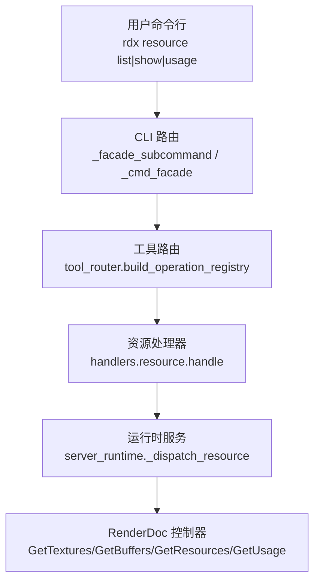
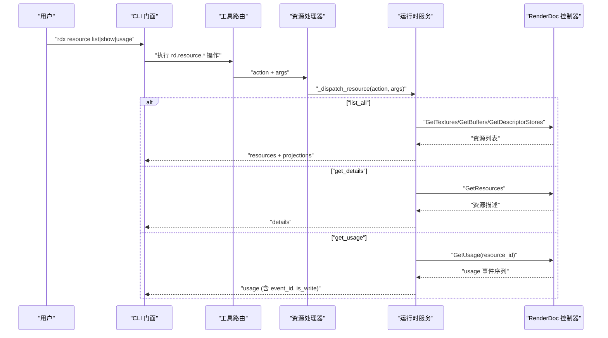
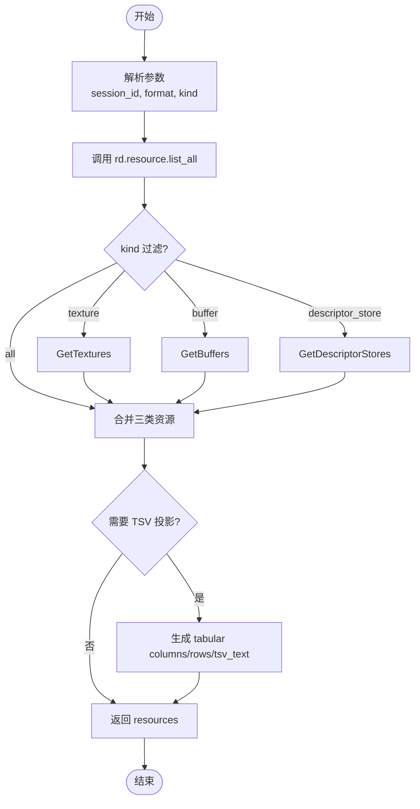
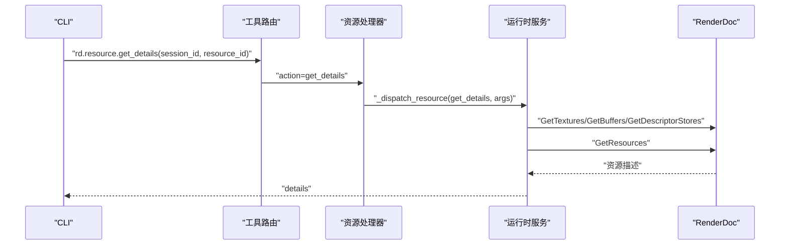
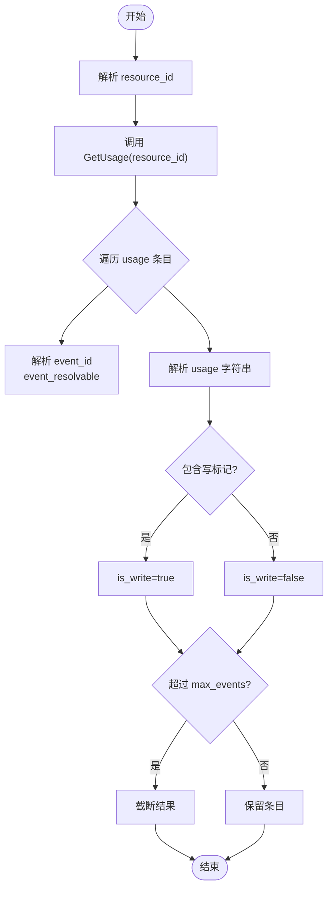
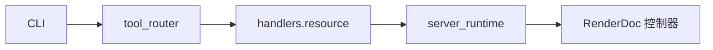

# 资源查询命令

<cite>
**本文引用的文件**
- [cli.py](file://rdx/cli.py)
- [tool_router.py](file://rdx/tool_router.py)
- [resource.py](file://rdx/handlers/resource.py)
- [server_runtime.py](file://rdx/server_runtime.py)
- [operation_definitions.py](file://rdx/operation_definitions.py)
</cite>

## 目录
1. [简介](#简介)
2. [项目结构](#项目结构)
3. [核心组件](#核心组件)
4. [架构总览](#架构总览)
5. [详细组件分析](#详细组件分析)
6. [依赖关系分析](#依赖关系分析)
7. [性能考虑](#性能考虑)
8. [故障排查指南](#故障排查指南)
9. [结论](#结论)
10. [附录](#附录)

## 简介
本章节面向使用 rdx 命令行工具的用户，系统化说明资源查询相关命令：
- rdx resource list：列出捕获中的所有 GPU 资源（纹理、缓冲区、描述符存储等），支持按类型过滤与 TSV 表格输出。
- rdx resource show：查看指定资源的详细信息，包括名称、尺寸、格式、字节大小、别名、绑定名等元数据。
- rdx resource usage：分析指定资源的使用情况，返回关联的事件 ID、读写标记、以及历史访问记录摘要。

这些命令通过 CLI 层映射到内部操作 rd.resource.list_all、rd.resource.get_details、rd.resource.get_usage，并由运行时服务统一调度 RenderDoc 回放控制器进行查询。

## 项目结构
资源查询功能涉及以下关键路径：
- CLI 参数解析与子命令路由：将 rdx resource list/show/usage 转换为内部操作调用。
- 工具路由与前置条件校验：根据 catalog 注册表将 rd.* 操作分发到对应领域处理器。
- 资源领域处理器：将 action 转发给 server_runtime._dispatch_resource。
- 运行时服务实现：具体实现 list_all/get_details/get_usage，并对接 RenderDoc API。
- 操作定义：声明参数、返回值、前置条件与分组信息。

图表来源
- [cli.py:1012-1019](file://rdx/cli.py#L1012-L1019)
- [tool_router.py:131-154](file://rdx/tool_router.py#L131-L154)
- [resource.py:8-9](file://rdx/handlers/resource.py#L8-L9)
- [server_runtime.py:7624-7800](file://rdx/server_runtime.py#L7624-L7800)

章节来源
- [cli.py:1012-1019](file://rdx/cli.py#L1012-L1019)
- [tool_router.py:131-154](file://rdx/tool_router.py#L131-L154)
- [resource.py:8-9](file://rdx/handlers/resource.py#L8-L9)
- [server_runtime.py:7624-7800](file://rdx/server_runtime.py#L7624-L7800)

## 核心组件
- CLI 门面命令：提供 rdx resource list/show/usage 子命令，自动注入 session_id，支持 --format json/tsv。
- 工具路由：基于 catalog 注册表，将 rd.resource.* 操作分发到 handlers.resource.handle。
- 资源处理器：轻量转发器，调用 server_runtime._dispatch_resource(action, args)。
- 运行时服务：实现资源枚举、详情获取、使用统计；支持投影（TSV）与分页限制。
- 操作定义：声明 rd.resource.list_all、rd.resource.get_details、rd.resource.get_usage 的参数、返回值与前置条件。

章节来源
- [cli.py:1568-1577](file://rdx/cli.py#L1568-L1577)
- [tool_router.py:34-54](file://rdx/tool_router.py#L34-L54)
- [resource.py:8-9](file://rdx/handlers/resource.py#L8-L9)
- [operation_definitions.py:2427-2483](file://rdx/operation_definitions.py#L2427-L2483)

## 架构总览
下图展示从命令行到渲染后端的全链路交互：

图表来源
- [cli.py:1012-1019](file://rdx/cli.py#L1012-L1019)
- [tool_router.py:131-154](file://rdx/tool_router.py#L131-L154)
- [resource.py:8-9](file://rdx/handlers/resource.py#L8-L9)
- [server_runtime.py:7624-7800](file://rdx/server_runtime.py#L7624-L7800)

## 详细组件分析

### 命令：rdx resource list
- 作用：列出捕获中的全部资源，支持 kind 过滤（all/texture/buffer/descriptor_store）。
- 参数：
  - --session-id：会话标识（由 CLI 自动注入或显式传入）。
  - --format：json 或 tsv；TSV 时返回列 resource_id、kind、name、width、height、depth、format、byte_size。
  - 内部参数 kind：用于筛选资源类型。
- 行为：
  - 调用 rd.resource.list_all。
  - 若请求 TSV，则附加 projection 以生成 tabular 文本。
  - 返回 resources 列表，包含纹理、缓冲区、描述符存储条目。

图表来源
- [cli.py:1012-1014](file://rdx/cli.py#L1012-L1014)
- [cli.py:330-394](file://rdx/cli.py#L330-L394)
- [server_runtime.py:7744-7761](file://rdx/server_runtime.py#L7744-L7761)
- [server_runtime.py:3068-3090](file://rdx/server_runtime.py#L3068-L3090)

章节来源
- [cli.py:1012-1014](file://rdx/cli.py#L1012-L1014)
- [cli.py:330-394](file://rdx/cli.py#L330-L394)
- [server_runtime.py:7744-7761](file://rdx/server_runtime.py#L7744-L7761)
- [server_runtime.py:3068-3090](file://rdx/server_runtime.py#L3068-L3090)
- [operation_definitions.py:2452-2483](file://rdx/operation_definitions.py#L2452-L2483)

### 命令：rdx resource show
- 作用：查看指定资源的详细信息，包括名称、尺寸、格式、字节大小、别名、绑定名等。
- 参数：
  - --session-id：会话标识。
  - --resource-id：目标资源 ID。
  - --include-initialization：可选，是否包含初始化信息（如父资源、派生资源、初始化块索引）。
- 行为：
  - 调用 rd.resource.get_details。
  - 内部会枚举 textures/buffers/descriptor_stores 并匹配 resource_id。
  - 若未找到资源，返回错误；否则返回 details 对象。

图表来源
- [cli.py:1015-1017](file://rdx/cli.py#L1015-L1017)
- [tool_router.py:131-154](file://rdx/tool_router.py#L131-L154)
- [resource.py:8-9](file://rdx/handlers/resource.py#L8-L9)
- [server_runtime.py:7762-7781](file://rdx/server_runtime.py#L7762-L7781)

章节来源
- [cli.py:1015-1017](file://rdx/cli.py#L1015-L1017)
- [server_runtime.py:7762-7781](file://rdx/server_runtime.py#L7762-L7781)
- [operation_definitions.py:2420-2426](file://rdx/operation_definitions.py#L2420-L2426)

### 命令：rdx resource usage
- 作用：分析指定资源的使用情况，返回关联事件 ID、读写标记、以及历史访问记录摘要。
- 参数：
  - --session-id：会话标识。
  - --resource-id：目标资源 ID。
  - --max-events：可选，限制返回的最大事件数（默认值在实现中截断）。
- 行为：
  - 调用 rd.resource.get_usage。
  - 内部对每个 usage entry 解析 event_id 与 usage 字符串，推断 is_write。
  - 返回 usage 列表，供后续分析内存占用变化与热点事件。

图表来源
- [cli.py:1018-1019](file://rdx/cli.py#L1018-L1019)
- [server_runtime.py:7782-7796](file://rdx/server_runtime.py#L7782-L7796)
- [operation_definitions.py:2427-2449](file://rdx/operation_definitions.py#L2427-L2449)

章节来源
- [cli.py:1018-1019](file://rdx/cli.py#L1018-L1019)
- [server_runtime.py:7782-7796](file://rdx/server_runtime.py#L7782-L7796)
- [operation_definitions.py:2427-2449](file://rdx/operation_definitions.py#L2427-L2449)

### 资源 ID 的生成规则与生命周期管理
- 资源 ID 来源：来自 RenderDoc 控制器的资源对象（纹理、缓冲区、描述符存储）的 resourceId 字段，转为字符串后作为 resource_id。
- 名称组合：对于纹理，系统会结合资源原始名称、绑定名、别名，生成 display_name 与 name_stem，便于人类可读识别。
- 生命周期：
  - 资源存在于当前回放会话中；当会话关闭或切换时，资源 ID 不再有效。
  - 可通过 set_alias 为资源设置本地别名，仅影响后续输出与报告，不修改捕获内容。
  - VFS 导航中，/resources、/textures、/buffers 节点均基于资源列表构建，点击后可进入 usage/data 子节点。

章节来源
- [server_runtime.py:7656-7710](file://rdx/server_runtime.py#L7656-L7710)
- [server_runtime.py:4361-4402](file://rdx/server_runtime.py#L4361-L4402)
- [server_runtime.py:7797-7800](file://rdx/server_runtime.py#L7797-L7800)
- [server_runtime.py:11890-11933](file://rdx/server_runtime.py#L11890-L11933)

### 完整参数说明与使用示例
- 通用参数：
  - --session-id：必需（可由上下文自动注入）。
  - --format：json 或 tsv（list 支持 tsv 表格输出）。
- 子命令参数：
  - list：无额外必填参数；内部使用 kind=all/texture/buffer/descriptor_store。
  - show：--resource-id 必填；可选 --include-initialization。
  - usage：--resource-id 必填；可选 --max-events。
- 示例：
  - 列出所有资源（JSON）：rdx resource list --session-id <id> --format json
  - 列出纹理（TSV）：rdx resource list --session-id <id> --format tsv
  - 查看资源详情：rdx resource show --session-id <id> --resource-id <rid>
  - 查看资源使用：rdx resource usage --session-id <id> --resource-id <rid> --max-events 5000

章节来源
- [cli.py:1568-1577](file://rdx/cli.py#L1568-L1577)
- [cli.py:1012-1019](file://rdx/cli.py#L1012-L1019)
- [operation_definitions.py:2427-2483](file://rdx/operation_definitions.py#L2427-L2483)

## 依赖关系分析
- CLI 依赖 tool_router 将 rd.resource.* 操作分发到 handlers.resource。
- handlers.resource 仅做转发，实际逻辑在 server_runtime._dispatch_resource。
- server_runtime 依赖 RenderDoc 控制器进行资源枚举与使用查询。
- operation_definitions 声明了操作的参数、返回值与前置条件，确保调用前具备 session_id。

图表来源
- [cli.py:1012-1019](file://rdx/cli.py#L1012-L1019)
- [tool_router.py:131-154](file://rdx/tool_router.py#L131-L154)
- [resource.py:8-9](file://rdx/handlers/resource.py#L8-L9)
- [server_runtime.py:7624-7800](file://rdx/server_runtime.py#L7624-L7800)

章节来源
- [cli.py:1012-1019](file://rdx/cli.py#L1012-L1019)
- [tool_router.py:131-154](file://rdx/tool_router.py#L131-L154)
- [resource.py:8-9](file://rdx/handlers/resource.py#L8-L9)
- [server_runtime.py:7624-7800](file://rdx/server_runtime.py#L7624-L7800)

## 性能考虑
- 批量查询：list_all 可一次性获取 textures/buffers/descriptor_stores，减少多次往返；建议优先使用 kind=all 或按需选择 kind。
- 分页处理：usage 支持 --max-events 限制返回条目数量，避免大负载；建议在自动化脚本中合理设置上限。
- 表格投影：list 使用 --format tsv 可获得紧凑的列式输出，适合管道处理与快速浏览。
- 名称优化：纹理显示名通过绑定名与别名组合，有助于快速定位；必要时可使用 set_alias 自定义别名。

[本节为通用指导，无需特定文件引用]

## 故障排查指南
- 缺少会话：若未提供 session_id 且上下文中无活跃会话，CLI 会提示先打开捕获或显式传入 --session-id。
- 资源未找到：show/usage 指定的 resource_id 不存在时，返回 resource_not_found 错误。
- 前置条件失败：操作要求 session_id，若未满足，路由层会返回结构化错误，提示需先打开捕获或回放。
- TSV 投影缺失：当请求 --format tsv 但工具未返回 tabular 投影时，CLI 会给出恢复建议。

章节来源
- [cli.py:311-327](file://rdx/cli.py#L311-L327)
- [cli.py:369-394](file://rdx/cli.py#L369-L394)
- [server_runtime.py:7772-7773](file://rdx/server_runtime.py#L7772-L7773)
- [operation_definitions.py:2427-2483](file://rdx/operation_definitions.py#L2427-L2483)

## 结论
rdx resource 系列命令提供了完整的 GPU 资源查询能力：
- list：高效枚举与过滤，支持 TSV 表格输出。
- show：获取资源元数据与可选初始化信息。
- usage：分析资源的历史使用与读写标记，辅助定位热点与内存问题。
通过 CLI 到运行时服务的清晰分层，以及与 RenderDoc 控制器的稳定对接，用户可以在不同图形 API 下可靠地探查资源状态与使用情况。

[本节为总结性内容，无需特定文件引用]

## 附录
- 相关 VFS 导航：
  - /resources、/textures、/buffers：基于资源列表构建，可进入 usage/data 子节点。
  - /draws/{event_id}/pipeline/shaders：与资源绑定相关的着色器信息。
- 推荐实践：
  - 先使用 list 缩小范围，再使用 show/usage 深入分析。
  - 在自动化流程中使用 --format tsv 提升处理效率。
  - 合理使用 --max-events 控制 usage 返回规模。

章节来源
- [server_runtime.py:11703-11716](file://rdx/server_runtime.py#L11703-L11716)
- [server_runtime.py:11890-11933](file://rdx/server_runtime.py#L11890-L11933)