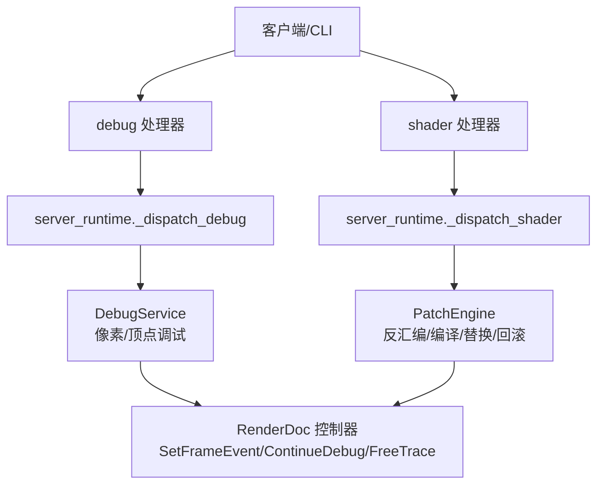
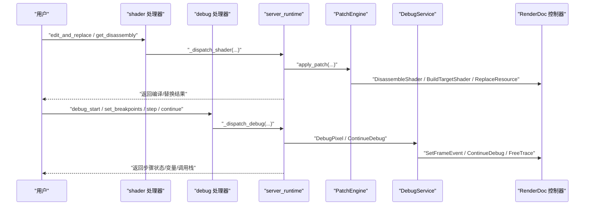
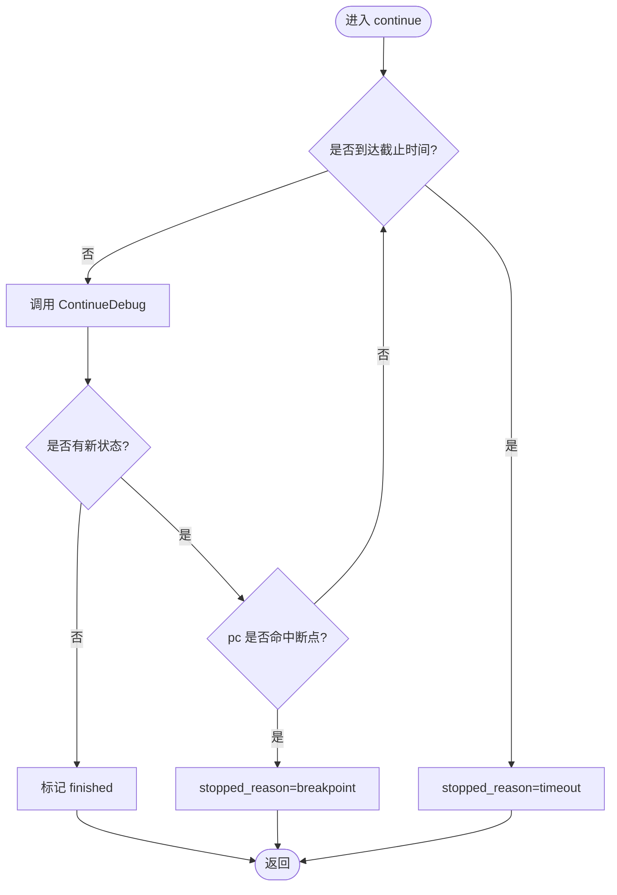
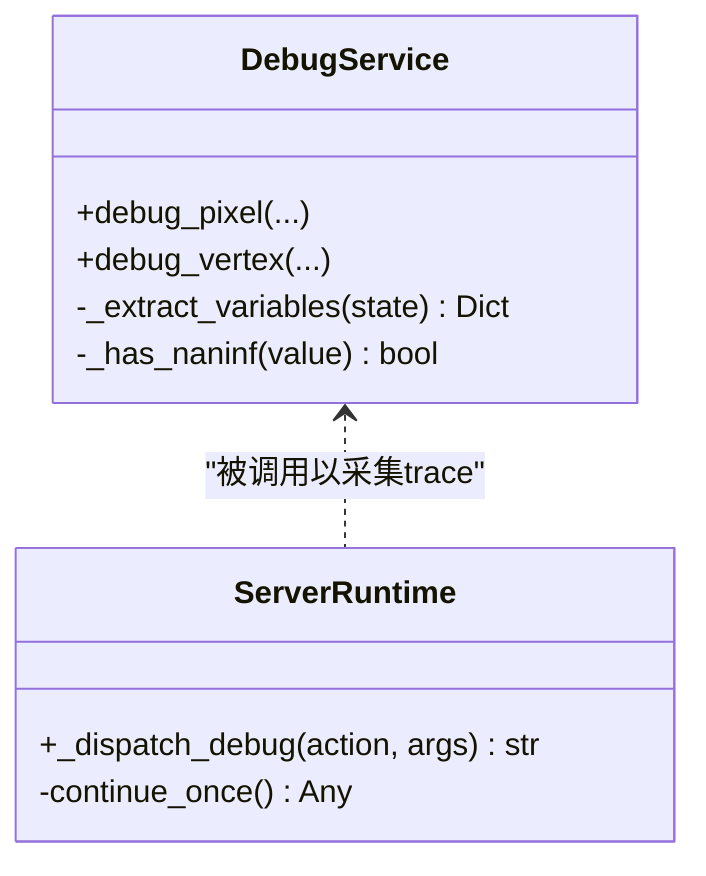
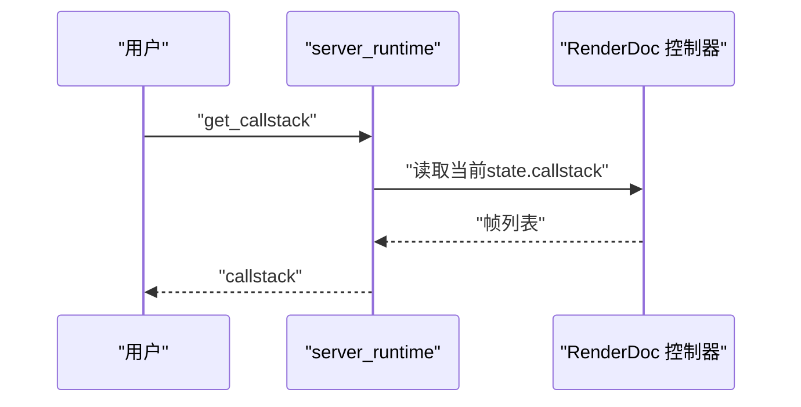
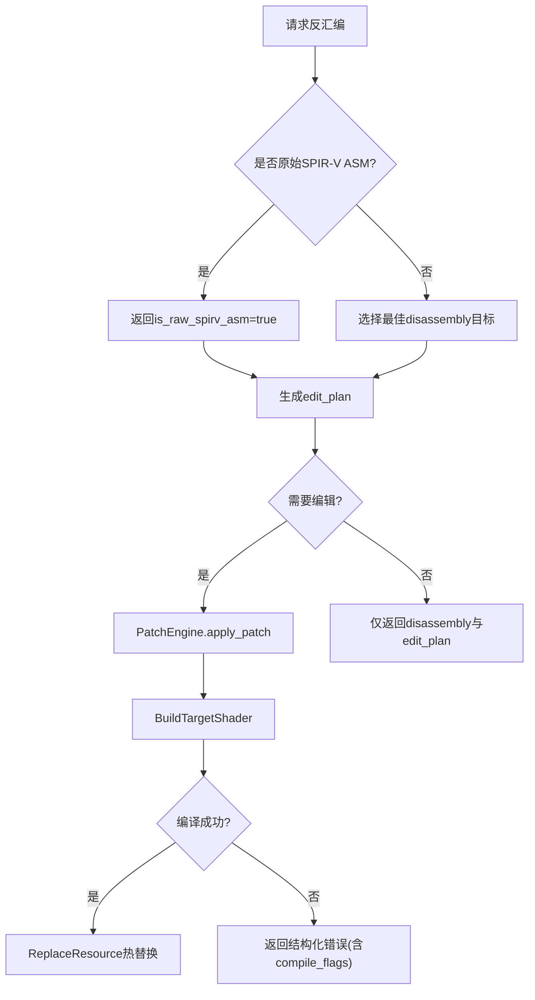
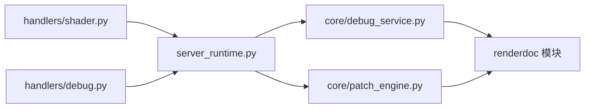

# Shader调试处理器

<cite>
**本文引用的文件**
- [rdx/handlers/shader.py](file://rdx/handlers/shader.py)
- [rdx/handlers/debug.py](file://rdx/handlers/debug.py)
- [rdx/server_runtime.py](file://rdx/server_runtime.py)
- [rdx/core/debug_service.py](file://rdx/core/debug_service.py)
- [rdx/core/patch_engine.py](file://rdx/core/patch_engine.py)
- [tests/test_shader_replace_contracts.py](file://tests/test_shader_replace_contracts.py)
- [docs/rdx-native-agent-playbook.md](file://docs/rdx-native-agent-playbook.md)
</cite>

## 目录
1. [简介](#简介)
2. [项目结构](#项目结构)
3. [核心组件](#核心组件)
4. [架构总览](#架构总览)
5. [详细组件分析](#详细组件分析)
6. [依赖关系分析](#依赖关系分析)
7. [性能考虑](#性能考虑)
8. [故障排查指南](#故障排查指南)
9. [结论](#结论)
10. [附录](#附录)

## 简介
本文件系统性介绍着色器调试处理器的实现与能力，覆盖断点管理、变量检查、调用栈分析、SPIR-V工具链集成、调试信息解析以及性能影响评估。该处理器基于 RenderDoc 的调试原语，封装为异步服务，支持像素级逐步执行、断点命中、变量快照与调用栈回溯，并通过 PatchEngine 在回放环境中对着色器进行源级修改与热替换，从而形成“可观察、可干预、可回滚”的完整调试闭环。

## 项目结构
- 入口层：
  - shader 处理器将动作转发到运行时调度器。
  - debug 处理器将动作转发到运行时调试调度器。
- 运行时层：
  - server_runtime 提供 _dispatch_shader 与 _dispatch_debug，负责参数校验、会话控制、目标选择、断点与步进、变量与调用栈读取、资源释放等。
- 服务层：
  - DebugService 封装 RenderDoc 的 pixel/vertex 调试 API，采集 trace、检测 NaN/Inf、持久化 artifact。
  - PatchEngine 负责反汇编、应用 patch（如精度提升、guard 插入）、编译、替换与回滚。
- 测试与文档：
  - 大量用例验证 edit_and_replace、get_source、get_disassembly、断点与步进行为、SPIR-V 二进制/文本路径、DXIL 只读场景等。
  - 使用手册给出像素调试与编辑流程示例。

图表来源
- [rdx/handlers/shader.py:8-9](file://rdx/handlers/shader.py#L8-L9)
- [rdx/handlers/debug.py:8-9](file://rdx/handlers/debug.py#L8-L9)
- [rdx/server_runtime.py:9518-10897](file://rdx/server_runtime.py#L9518-L10897)
- [rdx/server_runtime.py:10900-11037](file://rdx/server_runtime.py#L10900-L11037)
- [rdx/core/debug_service.py:43-267](file://rdx/core/debug_service.py#L43-L267)
- [rdx/core/patch_engine.py:175-300](file://rdx/core/patch_engine.py#L175-L300)

章节来源
- [rdx/handlers/shader.py:1-11](file://rdx/handlers/shader.py#L1-L11)
- [rdx/handlers/debug.py:1-11](file://rdx/handlers/debug.py#L1-L11)
- [rdx/server_runtime.py:9518-10897](file://rdx/server_runtime.py#L9518-L10897)
- [rdx/server_runtime.py:10900-11037](file://rdx/server_runtime.py#L10900-L11037)

## 核心组件
- 调试处理器路由
  - shader 处理器：统一转发至 _dispatch_shader，支持 compile、get_source、get_disassembly、edit_and_replace 等。
  - debug 处理器：统一转发至 _dispatch_debug，支持 step、continue、run_to、set_breakpoints、clear_breakpoints、get_variables、evaluate_expression、get_callstack、finish。
- 调试服务
  - DebugService：封装像素/顶点调试，支持 run_to_naninf/full_trace，提取变量、检测 NaN/Inf、持久化 trace artifact。
- 补丁引擎
  - PatchEngine：反汇编（优先 SPIR-V ASM），应用 patch（force_full_precision、insert_guard），编译并 ReplaceResource 热替换，记录 PatchRecord 以便回滚。
- 运行时调度
  - server_runtime：会话与控制器管理、目标纹理配置、像素历史聚合、断点与步进循环、变量与调用栈读取、资源释放。

章节来源
- [rdx/server_runtime.py:9518-10897](file://rdx/server_runtime.py#L9518-L10897)
- [rdx/server_runtime.py:10900-11037](file://rdx/server_runtime.py#L10900-L11037)
- [rdx/core/debug_service.py:43-267](file://rdx/core/debug_service.py#L43-L267)
- [rdx/core/patch_engine.py:175-300](file://rdx/core/patch_engine.py#L175-L300)

## 架构总览
下图展示从用户发起调试到渲染驱动执行的端到端流程，包括断点设置、步进、变量读取与调用栈获取。

图表来源
- [rdx/handlers/shader.py:8-9](file://rdx/handlers/shader.py#L8-L9)
- [rdx/handlers/debug.py:8-9](file://rdx/handlers/debug.py#L8-L9)
- [rdx/server_runtime.py:9518-10897](file://rdx/server_runtime.py#L9518-L10897)
- [rdx/server_runtime.py:10900-11037](file://rdx/server_runtime.py#L10900-L11037)
- [rdx/core/debug_service.py:122-267](file://rdx/core/debug_service.py#L122-L267)
- [rdx/core/patch_engine.py:196-300](file://rdx/core/patch_engine.py#L196-L300)

## 详细组件分析

### 断点管理机制
- 断点设置与清除
  - set_breakpoints：接收 breakpoints 列表，写入当前调试句柄的 breakpoints 字段。
  - clear_breakpoints：清空当前调试句柄的 breakpoints。
- 触发处理
  - continue/run_to：循环调用 ContinueDebug，若当前 stepIndex 命中任意断点的 pc，则停止并返回 stopped_reason="breakpoint"；否则继续直到结束或超时。
- 句柄生命周期
  - finish：释放 trace，并从运行时移除调试句柄。

图表来源
- [rdx/server_runtime.py:10915-10975](file://rdx/server_runtime.py#L10915-L10975)
- [rdx/server_runtime.py:10976-10982](file://rdx/server_runtime.py#L10976-L10982)
- [rdx/server_runtime.py:11028-11035](file://rdx/server_runtime.py#L11028-L11035)

章节来源
- [rdx/server_runtime.py:10900-11037](file://rdx/server_runtime.py#L10900-L11037)

### 变量检查功能
- 变量提取
  - get_variables：从当前 state 的 changes 中提取 name/value/type，限制最大数量防止过大响应。
  - evaluate_expression：支持直接读取变量名或 JSON 字面量表达式。
- 数据清洗
  - DebugService 内部对 float('nan'/'inf') 做 JSON 安全转换，避免序列化失败。
- 变量范围
  - 通过 RenderDoc 的 SourceVariableMapping 暴露的局部寄存器/中间值；Uniform 通常由管线常量接口提供，不在本调试句柄变量中直接显示。

图表来源
- [rdx/core/debug_service.py:493-562](file://rdx/core/debug_service.py#L493-L562)
- [rdx/server_runtime.py:10983-10995](file://rdx/server_runtime.py#L10983-L10995)

章节来源
- [rdx/core/debug_service.py:493-562](file://rdx/core/debug_service.py#L493-L562)
- [rdx/server_runtime.py:10983-10995](file://rdx/server_runtime.py#L10983-L10995)

### 调用栈分析能力
- 调用栈读取
  - get_callstack：从 state.callstack 逐帧提取 function/file/line/address，用于函数调用跟踪与执行路径分析。
- 参数传递检查
  - 结合 get_variables 与调用栈，可在某一层函数内查看传入参数的寄存器/变量快照。
- 执行路径分析
  - 配合断点与步进，沿调用栈自顶向下定位异常分支或数值异常源头。

图表来源
- [rdx/server_runtime.py:11013-11027](file://rdx/server_runtime.py#L11013-L11027)

章节来源
- [rdx/server_runtime.py:11013-11027](file://rdx/server_runtime.py#L11013-L11027)

### SPIR-V工具链集成与调试信息解析
- 反汇编与编辑计划
  - get_disassembly：根据后端能力选择最佳目标（优先 SPIR-V ASM），返回 is_raw_spirv_asm 与 edit_plan，指导后续编辑操作。
  - get_source：当调试源码不可用时，自动建议回退到 disassembly 并携带 source_encoding/target。
- 补丁与编译
  - PatchEngine.apply_patch：反汇编 -> 应用 patch -> BuildTargetShader -> ReplaceResource，失败时不替换并清理临时资源。
  - 支持 SPIR-V 二进制与文本两种路径；当后端仅接受二进制时，内部会组装 SPIR-V ASM 再编译。
- 调试信息
  - 通过 reflection 获取编译标志（如 optimization、target），辅助诊断构建失败原因。

图表来源
- [rdx/server_runtime.py:10850-10897](file://rdx/server_runtime.py#L10850-L10897)
- [rdx/core/patch_engine.py:196-300](file://rdx/core/patch_engine.py#L196-L300)
- [tests/test_shader_replace_contracts.py:1551-1582](file://tests/test_shader_replace_contracts.py#L1551-L1582)

章节来源
- [rdx/server_runtime.py:10850-10897](file://rdx/server_runtime.py#L10850-L10897)
- [rdx/core/patch_engine.py:196-300](file://rdx/core/patch_engine.py#L196-L300)
- [tests/test_shader_replace_contracts.py:1551-1582](file://tests/test_shader_replace_contracts.py#L1551-L1582)

### 着色器级别调试与优化实践示例
- 像素调试
  - 使用 debug_start 指定像素坐标与目标输出，支持像素历史聚合与跨事件匹配策略；运行后通过 step/continue 逐步执行，必要时设置断点。
- 变量与调用栈
  - 在断点处调用 get_variables 查看局部变量，调用 get_callstack 确认函数上下文，结合 evaluate_expression 快速取值。
- 源级修改与回滚
  - 通过 get_disassembly 获取可编辑 IR，使用 edit_and_replace 应用 force_full_precision 或 insert_guard 等操作；成功后可 revert_patch 恢复原始着色器。
- 参考命令
  - 像素值与历史查询、着色器源码/反汇编/常量查看、截图导出等，详见使用手册。

章节来源
- [docs/rdx-native-agent-playbook.md:98-115](file://docs/rdx-native-agent-playbook.md#L98-L115)
- [tests/test_shader_replace_contracts.py:276-304](file://tests/test_shader_replace_contracts.py#L276-L304)
- [tests/test_shader_replace_contracts.py:571-628](file://tests/test_shader_replace_contracts.py#L571-L628)

## 依赖关系分析
- 模块耦合
  - handlers 仅做轻量转发，核心逻辑集中在 server_runtime。
  - server_runtime 依赖 DebugService 与 PatchEngine，二者分别封装 RenderDoc 调试与编译替换能力。
- 外部依赖
  - RenderDoc Python 模块延迟导入，避免在无渲染环境加载失败。
  - SPIR-V 工具链（spirv-as/spirv-dis）在 CLI 探测阶段报告可用性，影响 raw SPIR-V ASM 工作流。
- 潜在循环依赖
  - 无直接循环；服务间通过 session_manager/controller 松耦合交互。

图表来源
- [rdx/handlers/shader.py:8-9](file://rdx/handlers/shader.py#L8-L9)
- [rdx/handlers/debug.py:8-9](file://rdx/handlers/debug.py#L8-L9)
- [rdx/server_runtime.py:9518-10897](file://rdx/server_runtime.py#L9518-L10897)
- [rdx/server_runtime.py:10900-11037](file://rdx/server_runtime.py#L10900-L11037)
- [rdx/core/debug_service.py:573-595](file://rdx/core/debug_service.py#L573-L595)
- [rdx/core/patch_engine.py:50-60](file://rdx/core/patch_engine.py#L50-L60)

章节来源
- [rdx/core/debug_service.py:573-595](file://rdx/core/debug_service.py#L573-L595)
- [rdx/core/patch_engine.py:50-60](file://rdx/core/patch_engine.py#L50-L60)

## 性能考虑
- 步进与超时
  - continue/run_to 支持 timeout_ms 限制，避免长时间阻塞；默认超时保护确保 UI/进程稳定性。
- 步数上限
  - DebugService 的 max_steps 限制 trace 长度，防止失控；可根据场景调优。
- 资源释放
  - 每次调试完成后调用 FreeTrace 释放驱动侧资源，避免泄漏。
- 反汇编与编译
  - 优先选择 SPIR-V ASM 以减少中间转换开销；DXIL/DXBC 路径需完整 HLSL 输入，编译失败不替换且保留上下文证据。
- 变量与调用栈
  - get_variables 限制最大变量数以控制响应大小；调用栈仅在可用时返回，避免不必要开销。

[本节为通用性能指导，不直接分析具体文件]

## 故障排查指南
- 常见错误与定位
  - 断点未命中：检查断点 pc 是否与当前 stepIndex 一致；确认 continue 超时设置合理。
  - 变量为空：确认当前 state 存在 changes；必要时先 step 一次使 current_state 更新。
  - 反汇编不可用：当调试源码不可用时，按 edit_plan 提示回退到 disassembly；DXIL 路径可能只读。
  - 编译失败：查看结构化错误中的 compiler_output 与 compile_flags，修正源或目标编码。
- 日志与工件
  - DebugService 会将 trace 持久化为 JSON artifact，便于离线分析；server_runtime 记录远程能力矩阵与尝试日志。
- 回滚与清理
  - PatchEngine 在替换失败时会尝试清理临时资源；必要时手动 revert_patch 恢复原始着色器。

章节来源
- [tests/test_shader_replace_contracts.py:1420-1464](file://tests/test_shader_replace_contracts.py#L1420-L1464)
- [tests/test_shader_replace_contracts.py:1551-1582](file://tests/test_shader_replace_contracts.py#L1551-L1582)
- [rdx/core/debug_service.py:212-252](file://rdx/core/debug_service.py#L212-L252)

## 结论
该着色器调试处理器以 RenderDoc 为核心，提供了完整的断点管理、变量检查、调用栈分析与源级修改能力。通过 SPIR-V 工具链集成与结构化错误反馈，开发者可以在回放环境中高效定位着色器问题并进行针对性优化。建议在复杂场景中结合像素历史、断点与变量快照，形成“观察—假设—验证—修复”的闭环流程。

## 附录
- 术语
  - 反汇编：将二进制着色器转换为可读文本（如 SPIR-V ASM）。
  - 热替换：在不重启进程的情况下替换着色器资源。
  - 调用栈：函数调用的层次结构，包含函数名、文件、行号与地址。
- 相关工具
  - spirv-as/spirv-dis：SPIR-V 汇编/反汇编工具，影响 raw SPIR-V ASM 工作流可用性。

[本节为概念性说明，不直接分析具体文件]