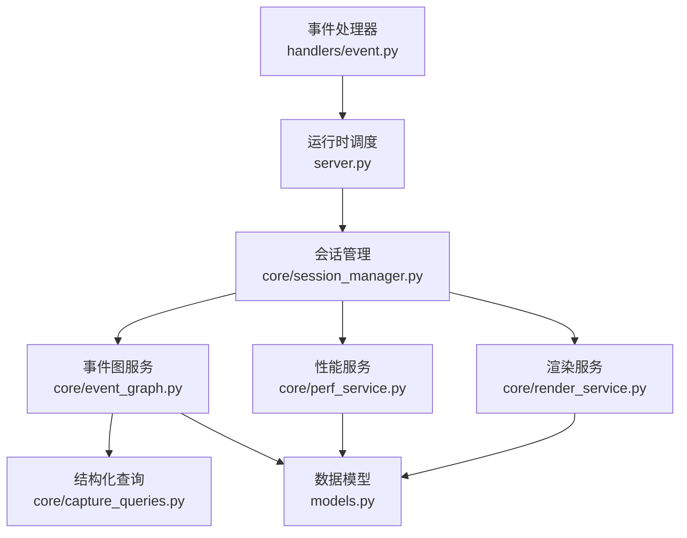
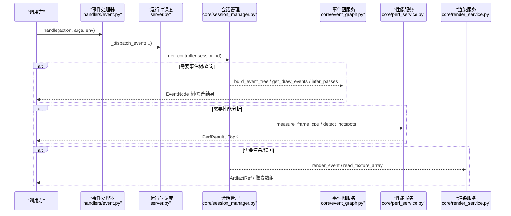
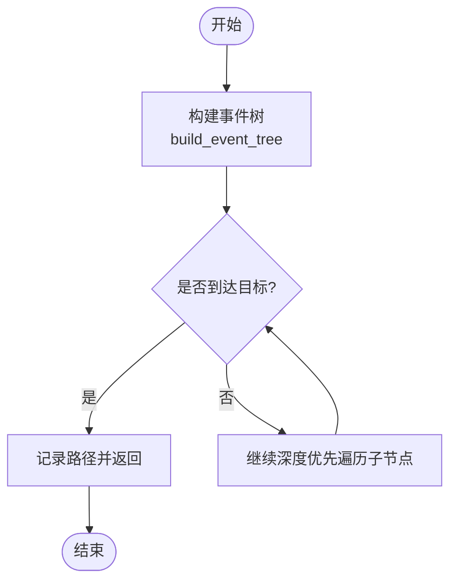
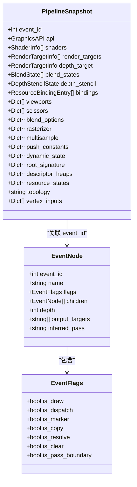
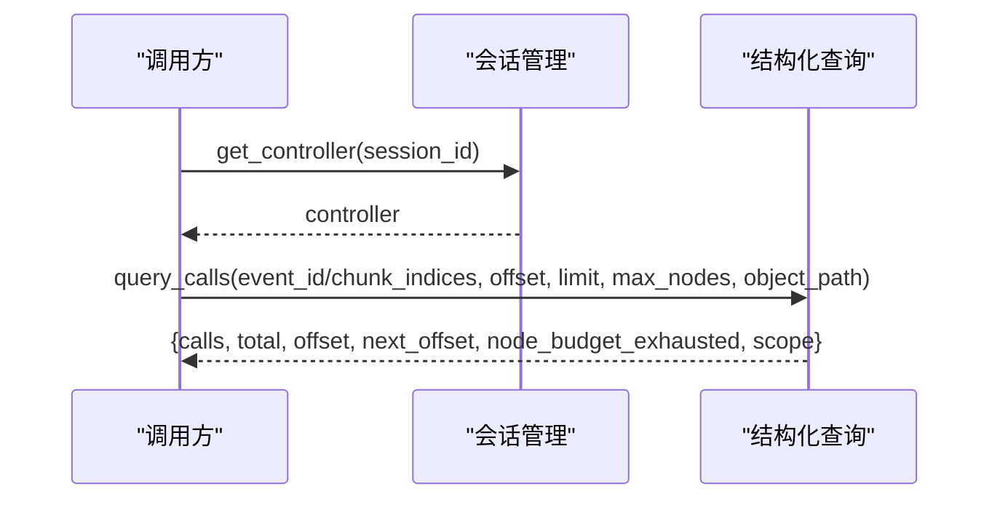
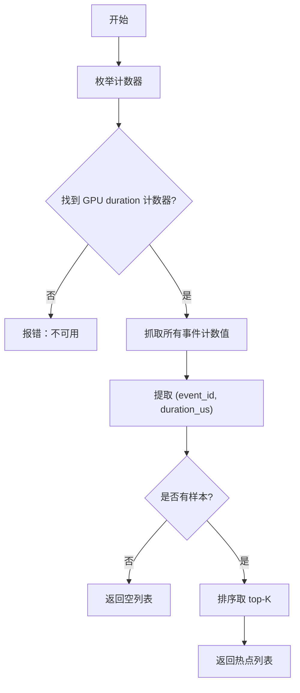
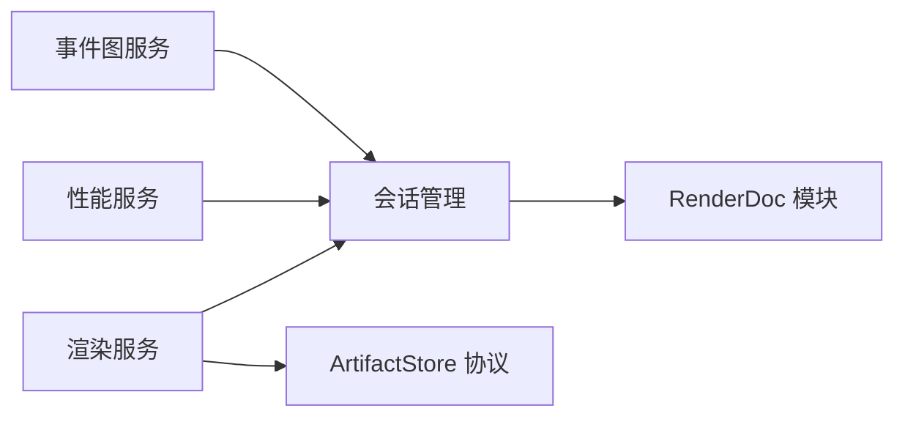

# 事件处理器

<cite>
**本文引用的文件**
- [event.py](file://rdx/handlers/event.py)
- [server.py](file://rdx/server.py)
- [session_manager.py](file://rdx/core/session_manager.py)
- [event_graph.py](file://rdx/core/event_graph.py)
- [capture_queries.py](file://rdx/core/capture_queries.py)
- [perf_service.py](file://rdx/core/perf_service.py)
- [render_service.py](file://rdx/core/render_service.py)
- [models.py](file://rdx/models.py)
- [experiment_runner.py](file://rdx/core/experiment_runner.py)
</cite>

## 目录
1. [简介](#简介)
2. [项目结构](#项目结构)
3. [核心组件](#核心组件)
4. [架构总览](#架构总览)
5. [详细组件分析](#详细组件分析)
6. [依赖关系分析](#依赖关系分析)
7. [性能考虑](#性能考虑)
8. [故障排查指南](#故障排查指南)
9. [结论](#结论)
10. [附录：使用示例与查询语法](#附录：使用示例与查询语法)

## 简介
本文件聚焦于 RDX 工具的事件处理子系统，围绕“GPU 事件导航与查询”“Drawcall 遍历与状态/资源绑定监控”“Action 树遍历算法（深度优先、条件过滤、性能优化）”“API 调用检查（OpenGL/Vulkan/D3D 等）”展开。文档同时给出事件模型设计原理、查询语法规范、性能调优建议，并提供实际使用示例以定位 GPU 调用分析与性能瓶颈。

## 项目结构
RDX 的事件处理由“处理器入口 → 运行时调度 → 会话管理 → 事件图构建与查询 → 渲染/性能服务”构成。关键路径如下：
- 处理器入口：handlers/event.py 将外部动作转发到 server_runtime 的 _dispatch_event。
- 运行时调度：server.py 提供 dispatch_operation，统一创建执行上下文并路由到 CoreEngine。
- 会话管理：core/session_manager.py 负责 RenderDoc replay 生命周期、控制器获取、输出对象创建。
- 事件图：core/event_graph.py 将 RenderDoc ActionDescription 树转换为 EventNode 树，并提供 draw/dispatch 收集、范围查询、pass 推断等能力。
- API 调用检查：core/capture_queries.py 通过结构化 capture 数据读取 API 调用序列，支持按 event 或 chunk 索引访问。
- 性能服务：core/perf_service.py 封装 GPU 计数器采样、热点检测、帧级时长测量。
- 渲染服务：core/render_service.py 提供 headless 渲染、纹理导出、像素读取与分析。
- 数据模型：models.py 定义 EventFlags、EventNode、PipelineSnapshot、PerfResult 等核心类型。
- 实验编排：core/experiment_runner.py 演示如何导航到指定 event 并运行验证器/补丁流程。

**图示来源**
- [event.py:8-9](file://rdx/handlers/event.py#L8-L9)
- [server.py:62-91](file://rdx/server.py#L62-L91)
- [session_manager.py:260-270](file://rdx/core/session_manager.py#L260-L270)
- [event_graph.py:152-191](file://rdx/core/event_graph.py#L152-L191)
- [capture_queries.py:73-119](file://rdx/core/capture_queries.py#L73-L119)
- [perf_service.py:28-63](file://rdx/core/perf_service.py#L28-L63)
- [render_service.py:357-521](file://rdx/core/render_service.py#L357-L521)
- [models.py:163-181](file://rdx/models.py#L163-L181)

**章节来源**
- [event.py:8-9](file://rdx/handlers/event.py#L8-L9)
- [server.py:62-91](file://rdx/server.py#L62-L91)
- [session_manager.py:260-270](file://rdx/core/session_manager.py#L260-L270)
- [event_graph.py:152-191](file://rdx/core/event_graph.py#L152-L191)
- [capture_queries.py:73-119](file://rdx/core/capture_queries.py#L73-L119)
- [perf_service.py:28-63](file://rdx/core/perf_service.py#L28-L63)
- [render_service.py:357-521](file://rdx/core/render_service.py#L357-L521)
- [models.py:163-181](file://rdx/models.py#L163-L181)

## 核心组件
- 事件处理器入口：将 action/args/env 转发给运行时调度，实现跨后端一致的事件分发。
- 会话管理器：维护本地/远程 ReplayController 与 ReplayOutput 的生命周期，提供 get_controller/get_output。
- 事件图服务：构建 EventNode 树；提供 draw/dispatch 收集、事件范围、路径查找、Pass 边界推断。
- 结构化查询：在不触发重放副作用的前提下，读取捕获的结构化 API 调用序列，支持分页与对象路径切片。
- 性能服务：枚举/描述/抓取 GPU 计数器，计算 per-event 样本、汇总统计、异常事件识别与 top-K 热点。
- 渲染服务：headless 渲染、纹理导出、像素读取与统计，支持多种格式与子资源选择。
- 数据模型：统一表达事件标志、节点、管线快照、性能结果、实验证据等。

**章节来源**
- [event.py:8-9](file://rdx/handlers/event.py#L8-L9)
- [session_manager.py:175-251](file://rdx/core/session_manager.py#L175-L251)
- [event_graph.py:152-386](file://rdx/core/event_graph.py#L152-L386)
- [capture_queries.py:73-119](file://rdx/core/capture_queries.py#L73-L119)
- [perf_service.py:28-63](file://rdx/core/perf_service.py#L28-L63)
- [render_service.py:357-521](file://rdx/core/render_service.py#L357-L521)
- [models.py:163-181](file://rdx/models.py#L163-L181)

## 架构总览
下图展示了从事件处理器到具体服务的调用链，以及各组件之间的职责划分。

**图示来源**
- [event.py:8-9](file://rdx/handlers/event.py#L8-L9)
- [server.py:62-91](file://rdx/server.py#L62-L91)
- [session_manager.py:260-270](file://rdx/core/session_manager.py#L260-L270)
- [event_graph.py:152-191](file://rdx/core/event_graph.py#L152-L191)
- [perf_service.py:28-63](file://rdx/core/perf_service.py#L28-L63)
- [render_service.py:357-521](file://rdx/core/render_service.py#L357-L521)

## 详细组件分析

### 事件模型与 Action 树遍历
- 事件模型：EventFlags 标记 draw/dispatch/marker/copy/resolve/clear/pass_boundary；EventNode 包含 event_id、name、flags、children、depth、output_targets、inferred_pass。
- 树构建：build_event_tree 通过 GetRootActions 递归转换 ActionDescription 为 EventNode，记录输出目标与层级。
- 遍历算法：
  - 深度优先搜索：_collect_draws/_collect_ids/_count_nodes/_build_path 均采用 DFS。
  - 条件过滤：仅收集 is_draw 或 is_dispatch 节点；路径构建在命中目标时回溯。
  - Pass 推断：基于相邻 draw 的输出目标集合变化划分逻辑 pass，并在节点上标注 inferred_pass。
- 复杂度：O(N) 时间构建与遍历，N 为 Action 节点数；空间 O(D) 递归栈，D 为最大深度。

**图示来源**
- [event_graph.py:161-191](file://rdx/core/event_graph.py#L161-L191)
- [event_graph.py:313-386](file://rdx/core/event_graph.py#L313-L386)

**章节来源**
- [event_graph.py:152-386](file://rdx/core/event_graph.py#L152-L386)
- [models.py:163-181](file://rdx/models.py#L163-L181)

### Drawcall 遍历与状态/资源绑定监控
- Drawcall 收集：get_draw_events 返回所有 draw/dispatch 节点，保持文档顺序（前序 DFS）。
- 状态改变事件：通过 flags 区分 marker/clear/resolve/present 等，便于过滤非绘制阶段。
- 资源绑定监控：
  - 节点 output_targets 直接来自 Action outputs。
  - 若为空，infer_passes 会尝试通过 SetFrameEvent + GetPipelineState 查询当前输出目标，优雅降级避免失败。
- 管线快照：PipelineSnapshot 可聚合 shaders、render_targets、blend_states、bindings、viewports、scissors 等，用于后续比对与诊断。

**图示来源**
- [models.py:163-181](file://rdx/models.py#L163-L181)
- [models.py:280-301](file://rdx/models.py#L280-L301)
- [event_graph.py:195-309](file://rdx/core/event_graph.py#L195-L309)

**章节来源**
- [event_graph.py:195-309](file://rdx/core/event_graph.py#L195-L309)
- [models.py:280-301](file://rdx/models.py#L280-L301)

### GPU 事件导航与查询能力
- 导航到事件：通过 SessionManager.get_controller 获取控制器，再调用 SetFrameEvent(event_id, True) 定位到目标事件。
- 事件范围：get_event_range 返回全树最小/最大 event_id，便于批量操作。
- 结构化查询：capture_queries.query_calls 支持按 event_id 或 chunk_indices 定位 API 调用，支持 object_path 与 child/value 偏移分页，限制 max_nodes 防止过大响应。
- 无副作用读取：structured_object 对结构化数据进行有界投影，避免完整加载大对象。

**图示来源**
- [session_manager.py:260-270](file://rdx/core/session_manager.py#L260-L270)
- [capture_queries.py:73-119](file://rdx/core/capture_queries.py#L73-L119)

**章节来源**
- [capture_queries.py:73-119](file://rdx/core/capture_queries.py#L73-L119)
- [session_manager.py:260-270](file://rdx/core/session_manager.py#L260-L270)

### 性能计数器与热点检测
- 帧级时长测量：measure_frame_gpu 使用 whole-replay GPU 计数器，返回单次完整重放的秒级时长样本，附带 range(first_event_id, last_event_id)。
- 热点检测：detect_hotspots 枚举 GPU duration 计数器，抓取所有事件的持续时间，排序取 top-K，返回 event_id、duration_us、rank。
- 异常事件：基于均值+Z阈值识别异常事件集，辅助定位抖动或偶发慢调用。

**图示来源**
- [perf_service.py:28-63](file://rdx/core/perf_service.py#L28-L63)
- [perf_service.py:493-602](file://rdx/core/perf_service.py#L493-L602)

**章节来源**
- [perf_service.py:28-63](file://rdx/core/perf_service.py#L28-L63)
- [perf_service.py:493-602](file://rdx/core/perf_service.py#L493-L602)

### API 调用检查（OpenGL/Vulkan/D3D）
- 结构化 API 调用读取：query_calls 通过 GetStructuredFile 获取结构化数据，按事件或块索引解析调用序列，支持对象路径与分页。
- 图形 API 识别：SessionManager._map_graphics_api 根据 pipelineType 映射 GraphicsAPI（D3D11/D3D12/Vulkan/OpenGL/OpenGLES）。
- 兼容性：当某些 API 属性缺失时采用容错策略，确保在不同后端下稳定工作。

**章节来源**
- [capture_queries.py:73-119](file://rdx/core/capture_queries.py#L73-L119)
- [session_manager.py:33-65](file://rdx/core/session_manager.py#L33-L65)

### 渲染与资源绑定可视化
- Headless 渲染：RenderService.render_event 导航到事件，设置 TextureDisplay，输出图像 artifact，支持 overlay、通道、HDR、缩放等。
- 纹理导出：save_texture_file 支持 raw/png/jpg/exr/hdr 等格式，自动校验文件大小与存在性。
- 像素读取：read_texture_array 解析不同分量格式，返回 numpy 数组与统计信息（min/max/mean/nan/inf），支持 region 裁剪。

**章节来源**
- [render_service.py:357-521](file://rdx/core/render_service.py#L357-L521)
- [render_service.py:523-646](file://rdx/core/render_service.py#L523-L646)
- [render_service.py:658-769](file://rdx/core/render_service.py#L658-L769)

### 实验编排与二分定位
- 实验流程：导航到目标 event，采集 baseline 指标，可选应用 patch 后再次采集，比较 before/after 得出 verdict。
- 二分搜索：run_bisect 在 [lo, hi] 范围内二分定位首个 bad event，支持 binary/ddmin 策略与置信度评估。

**章节来源**
- [experiment_runner.py:144-176](file://rdx/core/experiment_runner.py#L144-L176)
- [experiment_runner.py:269-762](file://rdx/core/experiment_runner.py#L269-L762)

## 依赖关系分析
- 松耦合：服务层通过 Protocol 抽象 SessionManager/ArtifactStore，便于替换与测试。
- 延迟导入：renderdoc 模块按需导入，降低启动成本与无环境时的失败概率。
- 线程安全：异步调用通过 asyncio.to_thread/run_in_executor 将阻塞式 RenderDoc API 放入线程池，避免阻塞事件循环。
- 错误分类：统一通过 status_code/status_text 包装错误，附加 capture_context、classification、fix_hint 等调试信息。

**图示来源**
- [render_service.py:64-90](file://rdx/core/render_service.py#L64-L90)
- [perf_service.py:73-89](file://rdx/core/perf_service.py#L73-L89)
- [session_manager.py:171-173](file://rdx/core/session_manager.py#L171-L173)

**章节来源**
- [render_service.py:64-90](file://rdx/core/render_service.py#L64-L90)
- [perf_service.py:73-89](file://rdx/core/perf_service.py#L73-L89)
- [session_manager.py:171-173](file://rdx/core/session_manager.py#L171-L173)

## 性能考虑
- 树构建与遍历：O(N) 时间与 O(D) 栈空间；尽量复用已构建的 EventNode 树以减少重复开销。
- Pass 推断：仅在必要时调用 GetPipelineState，避免频繁切换事件导致的额外开销。
- 计数器采样：
  - 使用 whole-replay 计数器减少多次 FetchCounters 的往返。
  - 合理设置 samples/warmup，避免过度采样。
  - 热点检测时先枚举/描述计数器，快速失败不可用场景。
- 结构化查询：
  - 使用 max_nodes 限制节点预算，防止大对象导致内存压力。
  - 利用 child_offset/value_offset 进行分页读取，避免一次性加载。
- 渲染与读回：
  - 选择合适的输出格式（PNG/JPG/EXR/HDR），权衡体积与质量。
  - 对浮点纹理进行归一化与裁剪，减少不必要的数据传输。

[本节为通用指导，不直接分析具体文件]

## 故障排查指南
- 无法加载 renderdoc 模块：检查是否在 RenderDoc replay 环境中运行，或将共享库目录加入 sys.path/PATH。
- 计数器不可用：确认后端/队列配置支持 whole-replay 或事件级 GPU duration 计数器；否则降级为其他度量。
- 结构化数据不可用：GetStructuredFile 返回 None 时，说明捕获未包含结构化数据，需重新捕获或升级 runtime。
- 远程复制失败：检查远端端点可达性与权限，确认 adb 路径与设备序列号正确。
- 渲染失败：核对 texture_id、subresource、overlay 名称与格式支持；查看 status_code/status_text 详情。

**章节来源**
- [render_service.py:39-56](file://rdx/core/render_service.py#L39-L56)
- [perf_service.py:33-37](file://rdx/core/perf_service.py#L33-L37)
- [capture_queries.py:76-78](file://rdx/core/capture_queries.py#L76-L78)
- [session_manager.py:373-440](file://rdx/core/session_manager.py#L373-L440)

## 结论
RDX 的事件处理器通过清晰的层次化设计与模块化服务，实现了高效的 GPU 事件导航、Drawcall 遍历、状态/资源绑定监控、API 调用检查与性能分析。借助深度优先遍历、条件过滤与预算控制，系统在大规模捕获中仍保持良好性能。结合渲染与像素分析能力，用户可快速定位性能瓶颈与渲染问题。

[本节为总结，不直接分析具体文件]

## 附录：使用示例与查询语法

### 典型使用流程
- 打开捕获并进入回放：
  - 通过会话管理创建 session，open_capture，获取控制器。
  - 使用 SetFrameEvent 导航到目标 event。
- 构建事件树并筛选 draw/dispatch：
  - 调用 build_event_tree 获取 EventNode 树。
  - 使用 get_draw_events 获取绘制事件列表。
- 推断 Pass 边界：
  - 调用 infer_passes，获得每个 draw 的 inferred_pass。
- 性能分析：
  - 使用 measure_frame_gpu 获取整帧时长。
  - 使用 detect_hotspots 获取 top-K 最慢事件。
- 渲染与读回：
  - 使用 render_event 生成图像 artifact。
  - 使用 read_texture_array 获取像素数组与统计。

**章节来源**
- [session_manager.py:175-251](file://rdx/core/session_manager.py#L175-L251)
- [event_graph.py:161-309](file://rdx/core/event_graph.py#L161-L309)
- [perf_service.py:28-63](file://rdx/core/perf_service.py#L28-L63)
- [perf_service.py:493-602](file://rdx/core/perf_service.py#L493-L602)
- [render_service.py:357-521](file://rdx/core/render_service.py#L357-L521)
- [render_service.py:658-769](file://rdx/core/render_service.py#L658-L769)

### 查询语法与参数说明
- 结构化查询 query_calls：
  - event_id：目标事件 ID；或 chunk_indices：直接指定结构化块索引。
  - offset/limit：分页参数，控制每次返回的调用数量。
  - max_nodes：节点预算上限，防止大对象。
  - object_path：对象路径，逐层选择子节点。
  - child_offset/value_offset：子节点/字符串值的起始偏移，支持增量读取。
- 返回值：
  - calls：本次返回的调用条目。
  - total：总调用数。
  - next_offset：下一页偏移（若无则为 None）。
  - node_budget_exhausted：是否因预算耗尽提前终止。
  - scope：作用域标识（如 captured_api_calls）。

**章节来源**
- [capture_queries.py:73-119](file://rdx/core/capture_queries.py#L73-L119)