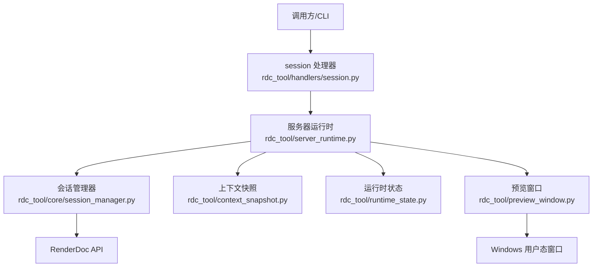
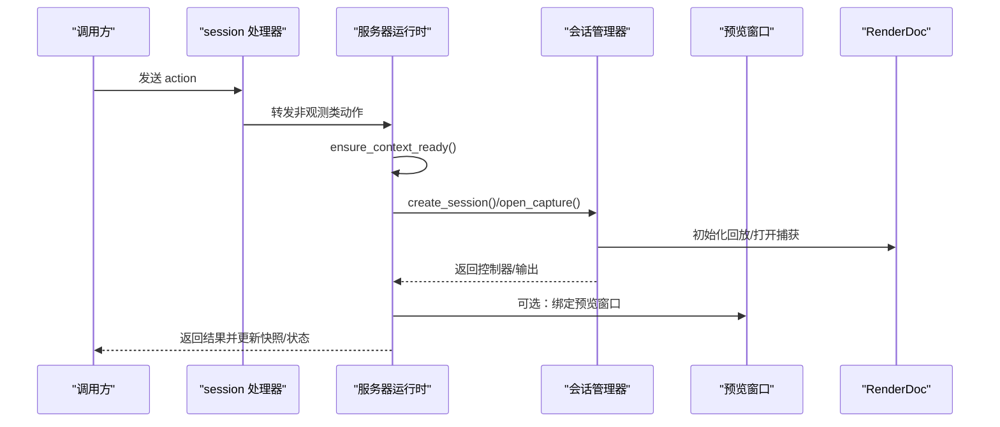
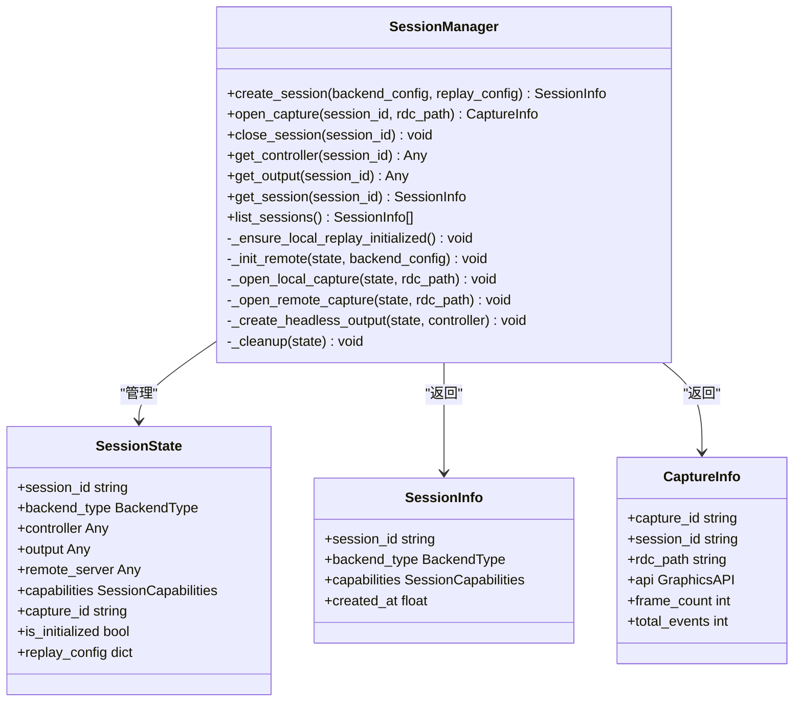
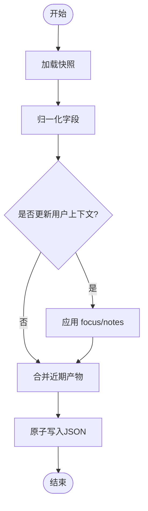
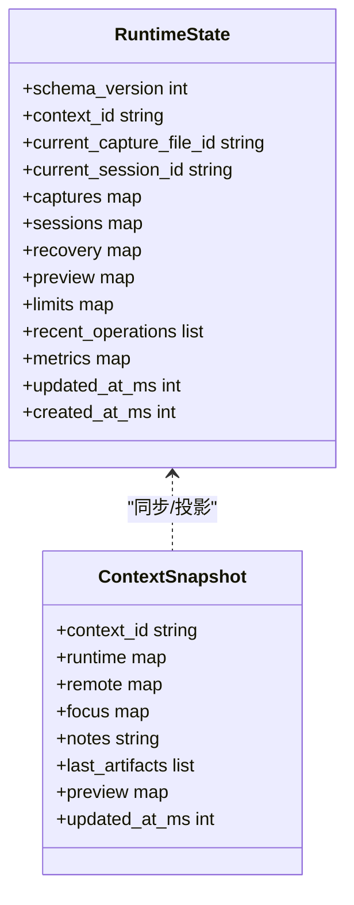
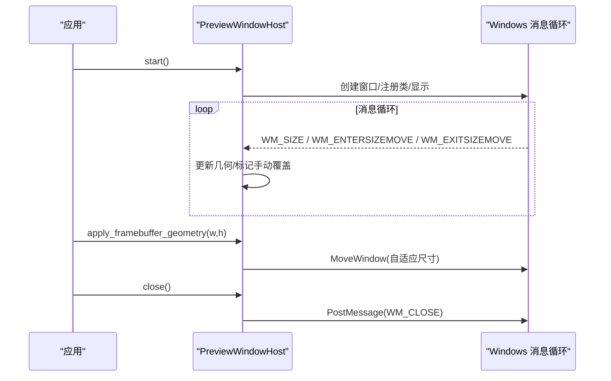
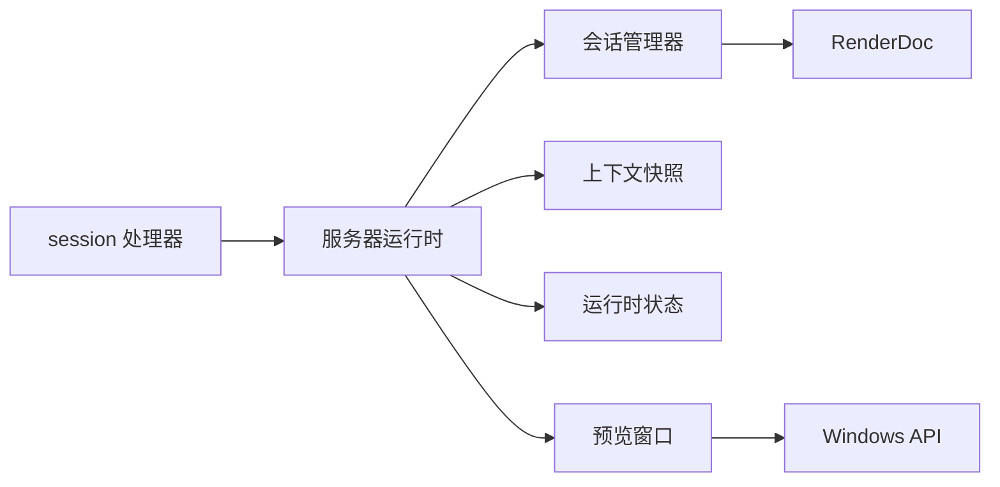

# 会话处理器

<cite>
**本文引用的文件**
- [rdc_tool/handlers/session.py](file://rdc_tool/handlers/session.py)
- [rdc_tool/core/session_manager.py](file://rdc_tool/core/session_manager.py)
- [rdc_tool/context_snapshot.py](file://rdc_tool/context_snapshot.py)
- [rdc_tool/preview_window.py](file://rdc_tool/preview_window.py)
- [rdc_tool/runtime_state.py](file://rdc_tool/runtime_state.py)
- [rdc_tool/server_runtime.py](file://rdc_tool/server_runtime.py)
- [rdc_tool/models.py](file://rdc_tool/models.py)
</cite>

## 目录
1. [简介](#简介)
2. [项目结构](#项目结构)
3. [核心组件](#核心组件)
4. [架构总览](#架构总览)
5. [详细组件分析](#详细组件分析)
6. [依赖关系分析](#依赖关系分析)
7. [性能考虑](#性能考虑)
8. [故障排查指南](#故障排查指南)
9. [结论](#结论)
10. [附录：使用示例与最佳实践](#附录使用示例与最佳实践)

## 简介
本文件围绕“会话处理器”的实现与功能进行系统化说明，覆盖以下主题：
- 会话生命周期管理：创建、打开捕获、切换、销毁等。
- 上下文快照机制：状态保存、恢复与持久化策略（含预览状态）。
- 预览窗口控制：帧缓冲预览、实时渲染观察与用户界面交互。
- 最佳实践、性能优化建议与常见问题解决方案。
- 结合GPU调试与分析工作流的代码级使用指引（以路径引用代替具体代码片段）。

## 项目结构
RDC工具在会话处理方面由多个模块协作完成：
- 会话入口与分发：handlers/session.py 将特定动作路由到回放观测或服务器运行时调度。
- 会话管理器：core/session_manager.py 负责本地/远程后端会话的创建、打开捕获、输出创建、清理等。
- 上下文快照：context_snapshot.py 提供跨进程/跨工具的上下文快照读写、归一化与保留策略。
- 运行时状态：runtime_state.py 提供持久化的上下文状态（包含会话、捕获、预览、指标等）与日志追加。
- 预览窗口：preview_window.py 提供Windows原生窗口宿主，用于帧缓冲预览与尺寸自适应。
- 服务器运行时：server_runtime.py 串联上述能力，实现上下文同步、预览绑定、操作记录与错误包装。
- 数据模型：models.py 定义会话能力、图形API枚举等基础类型。

图表来源
- [rdc_tool/handlers/session.py:8-12](file://rdc_tool/handlers/session.py#L8-L12)
- [rdc_tool/server_runtime.py:106-120](file://rdc_tool/server_runtime.py#L106-L120)
- [rdc_tool/core/session_manager.py:175-259](file://rdc_tool/core/session_manager.py#L175-L259)
- [rdc_tool/context_snapshot.py:214-279](file://rdc_tool/context_snapshot.py#L214-L279)
- [rdc_tool/runtime_state.py:41-76](file://rdc_tool/runtime_state.py#L41-L76)
- [rdc_tool/preview_window.py:192-238](file://rdc_tool/preview_window.py#L192-L238)

章节来源
- [rdc_tool/handlers/session.py:8-12](file://rdc_tool/handlers/session.py#L8-L12)
- [rdc_tool/server_runtime.py:106-120](file://rdc_tool/server_runtime.py#L106-L120)

## 核心组件
- 会话处理器入口：根据action分派到回放观测或服务器运行时调度。
- 会话管理器：单例式会话集合管理，支持本地/远程后端，封装RenderDoc回放初始化、捕获打开、头显输出创建与资源清理。
- 上下文快照：提供默认结构、字段归一化、原子写入与保留策略，维护预览显示状态。
- 运行时状态：持久化当前上下文、会话/捕获列表、恢复信息、预览、指标与最近操作；提供日志追加与读取。
- 预览窗口：基于Win32 API创建独立窗口线程，处理消息循环，支持自动/手动尺寸调整与几何度量。
- 服务器运行时：统一编排上下文就绪、预览自动同步、操作阶段记录、错误标准化与上下文快照/状态同步。

章节来源
- [rdc_tool/handlers/session.py:8-12](file://rdc_tool/handlers/session.py#L8-L12)
- [rdc_tool/core/session_manager.py:148-259](file://rdc_tool/core/session_manager.py#L148-L259)
- [rdc_tool/context_snapshot.py:214-279](file://rdc_tool/context_snapshot.py#L214-L279)
- [rdc_tool/runtime_state.py:104-149](file://rdc_tool/runtime_state.py#L104-L149)
- [rdc_tool/preview_window.py:192-238](file://rdc_tool/preview_window.py#L192-L238)
- [rdc_tool/server_runtime.py:450-540](file://rdc_tool/server_runtime.py#L450-L540)

## 架构总览
会话处理器的整体流程如下：
- 调用方通过 handlers/session.py 发起 action，内部对特定动作（如回放事件获取/观察）直接处理，其余交由 server_runtime._dispatch_session。
- server_runtime 确保上下文就绪，必要时自动同步预览，然后执行核心引擎操作，并在完成后更新上下文快照与状态。
- core/session_manager 负责具体的会话生命周期：创建会话、打开本地/远程捕获、创建无头输出、关闭并释放资源。
- context_snapshot 与 runtime_state 分别维护“快照”和“持久化状态”，两者在服务器运行时中相互同步。
- preview_window 提供可视化预览窗口，配合渲染输出进行帧缓冲展示与尺寸自适应。

图表来源
- [rdc_tool/handlers/session.py:8-12](file://rdc_tool/handlers/session.py#L8-L12)
- [rdc_tool/server_runtime.py:106-120](file://rdc_tool/server_runtime.py#L106-L120)
- [rdc_tool/core/session_manager.py:175-259](file://rdc_tool/core/session_manager.py#L175-L259)
- [rdc_tool/preview_window.py:192-238](file://rdc_tool/preview_window.py#L192-L238)

## 详细组件分析

### 会话管理器（SessionManager）
- 职责
  - 单例管理多会话，线程安全访问（asyncio.Lock）。
  - 创建会话：区分本地/远程后端，初始化回放子系统或建立远程连接。
  - 打开捕获：本地OpenCaptureFile/OpenCapture；远程CopyCaptureToRemote+OpenCapture。
  - 创建无头输出：CreateHeadlessWindowingData + CreateOutput(Texture)。
  - 清理：按顺序关闭输出、控制器、捕获文件、远程连接，必要时关闭全局回放子系统。
- 关键数据结构
  - SessionState：保存session_id、backend_type、controller、output、remote相关字段、capabilities、capture_id、replay_config等。
  - SessionInfo/CaptureInfo：对外暴露的会话/捕获信息模型。
- 错误处理
  - 统一通过 _check_status 包装RenderDoc状态，构造 SessionError，附带分类、修复提示与上下文信息。
- 性能要点
  - 阻塞IO通过 offload 在executor中运行，避免阻塞事件循环。
  - 远程复制支持进度回调，便于前端反馈。

图表来源
- [rdc_tool/core/session_manager.py:118-146](file://rdc_tool/core/session_manager.py#L118-L146)
- [rdc_tool/core/session_manager.py:148-259](file://rdc_tool/core/session_manager.py#L148-L259)
- [rdc_tool/models.py:128-157](file://rdc_tool/models.py#L128-L157)

章节来源
- [rdc_tool/core/session_manager.py:175-259](file://rdc_tool/core/session_manager.py#L175-L259)
- [rdc_tool/core/session_manager.py:301-383](file://rdc_tool/core/session_manager.py#L301-L383)
- [rdc_tool/core/session_manager.py:509-569](file://rdc_tool/core/session_manager.py#L509-L569)
- [rdc_tool/models.py:128-157](file://rdc_tool/models.py#L128-L157)

### 上下文快照机制（Context Snapshot）
- 目标
  - 提供跨工具/进程的上下文快照，包括运行时会话、焦点像素、笔记、预览显示状态等。
  - 保证并发安全与原子写入，支持保留策略限制条目数量。
- 关键能力
  - 默认结构与归一化：default_context_snapshot、normalize_context_snapshot、normalize_preview_state/display。
  - 持久化：load/save/clear，带锁文件与线程互斥。
  - 用户上下文更新：update_user_context 仅允许限定键（focus_pixel/focus_resource_id/focus_shader_id/notes）。
  - 产物合并：merge_recent_artifacts 去重并按保留策略裁剪。
- 预览显示状态
  - 包含输出槽、纹理ID/格式、帧缓冲范围、视口/剪裁矩形、有效区域、适配模式、屏幕截图比例等。

图表来源
- [rdc_tool/context_snapshot.py:214-279](file://rdc_tool/context_snapshot.py#L214-L279)
- [rdc_tool/context_snapshot.py:367-444](file://rdc_tool/context_snapshot.py#L367-L444)
- [rdc_tool/context_snapshot.py:447-475](file://rdc_tool/context_snapshot.py#L447-L475)
- [rdc_tool/context_snapshot.py:486-541](file://rdc_tool/context_snapshot.py#L486-L541)

章节来源
- [rdc_tool/context_snapshot.py:214-279](file://rdc_tool/context_snapshot.py#L214-L279)
- [rdc_tool/context_snapshot.py:367-444](file://rdc_tool/context_snapshot.py#L367-L444)
- [rdc_tool/context_snapshot.py:447-475](file://rdc_tool/context_snapshot.py#L447-L475)
- [rdc_tool/context_snapshot.py:486-541](file://rdc_tool/context_snapshot.py#L486-L541)

### 运行时状态（Runtime State）
- 目标
  - 持久化上下文状态：当前捕获/会话、会话列表、恢复信息、预览、指标、最近操作等。
  - 提供原子写入与日志追加，支持按上下文隔离。
- 关键能力
  - 默认状态与归一化：default_context_state、normalize_context_state。
  - 选择当前会话/捕获：_select_context_session_state 自动选择并持久化。
  - 指标统计：operation_count、error_count、recent_operation_duration_ms等。
  - 日志：append_runtime_log/read_runtime_logs。

图表来源
- [rdc_tool/runtime_state.py:104-149](file://rdc_tool/runtime_state.py#L104-L149)
- [rdc_tool/runtime_state.py:293-385](file://rdc_tool/runtime_state.py#L293-L385)
- [rdc_tool/context_snapshot.py:214-279](file://rdc_tool/context_snapshot.py#L214-L279)

章节来源
- [rdc_tool/runtime_state.py:104-149](file://rdc_tool/runtime_state.py#L104-L149)
- [rdc_tool/runtime_state.py:293-385](file://rdc_tool/runtime_state.py#L293-L385)
- [rdc_tool/runtime_state.py:388-416](file://rdc_tool/runtime_state.py#L388-L416)
- [rdc_tool/runtime_state.py:448-472](file://rdc_tool/runtime_state.py#L448-L472)

### 预览窗口控制（Preview Window）
- 目标
  - 提供独立的Windows窗口线程，用于帧缓冲预览与实时渲染观察。
  - 支持自动/手动尺寸调整、几何度量、用户交互（大小移动/关闭）。
- 关键能力
  - 启动/关闭：start/close，线程内消息循环。
  - 几何适配：apply_framebuffer_geometry 根据帧缓冲尺寸与工作区计算窗口大小。
  - 用户交互：WM_SIZE/WM_ENTERSIZEMOVE/WM_EXITSIZEMOVE 触发手动覆盖标记。
  - 几何快照：geometry_snapshot 返回窗口/客户端矩形与手动覆盖标志。
- 与渲染输出的集成
  - 会话管理器创建无头输出后，可通过服务器运行时绑定到预览窗口，实现帧缓冲预览。

图表来源
- [rdc_tool/preview_window.py:192-238](file://rdc_tool/preview_window.py#L192-L238)
- [rdc_tool/preview_window.py:274-301](file://rdc_tool/preview_window.py#L274-L301)
- [rdc_tool/preview_window.py:381-437](file://rdc_tool/preview_window.py#L381-L437)

章节来源
- [rdc_tool/preview_window.py:192-238](file://rdc_tool/preview_window.py#L192-L238)
- [rdc_tool/preview_window.py:274-301](file://rdc_tool/preview_window.py#L274-L301)
- [rdc_tool/preview_window.py:381-437](file://rdc_tool/preview_window.py#L381-L437)

### 服务器运行时协调（Server Runtime）
- 作用
  - 统一上下文就绪检查、预览自动同步、操作阶段记录、错误标准化、上下文快照/状态同步。
  - 将会话/捕获/预览等能力组合为可被工具调用的操作。
- 关键点
  - 上下文容量限制与占用检测，防止过多上下文导致资源耗尽。
  - 预览状态持久化与同步：_store_preview_state/_sync_context_snapshot_from_state。
  - 操作追踪：_record_operation_start/_record_operation_stage/_record_operation_finish。

章节来源
- [rdc_tool/server_runtime.py:413-468](file://rdc_tool/server_runtime.py#L413-L468)
- [rdc_tool/server_runtime.py:471-540](file://rdc_tool/server_runtime.py#L471-L540)
- [rdc_tool/server_runtime.py:977-1071](file://rdc_tool/server_runtime.py#L977-L1071)
- [rdc_tool/server_runtime.py:1102-1200](file://rdc_tool/server_runtime.py#L1102-L1200)

## 依赖关系分析
- 低耦合高内聚
  - session_manager 专注会话生命周期，不关心上下文快照细节。
  - context_snapshot 与 runtime_state 分别负责快照与持久化状态，通过服务器运行时进行同步。
  - preview_window 独立于会话逻辑，仅通过服务器运行时进行绑定。
- 外部依赖
  - RenderDoc API：会话管理器通过renderdoc模块进行回放初始化、捕获打开、输出创建。
  - Windows API：预览窗口通过ctypes调用user32/kernel32。
- 潜在循环依赖
  - 当前设计通过分层避免循环：handler -> server_runtime -> (session_manager, context_snapshot, runtime_state, preview_window)。

图表来源
- [rdc_tool/handlers/session.py:8-12](file://rdc_tool/handlers/session.py#L8-L12)
- [rdc_tool/server_runtime.py:106-120](file://rdc_tool/server_runtime.py#L106-L120)
- [rdc_tool/core/session_manager.py:175-259](file://rdc_tool/core/session_manager.py#L175-L259)
- [rdc_tool/context_snapshot.py:214-279](file://rdc_tool/context_snapshot.py#L214-L279)
- [rdc_tool/runtime_state.py:104-149](file://rdc_tool/runtime_state.py#L104-L149)
- [rdc_tool/preview_window.py:192-238](file://rdc_tool/preview_window.py#L192-L238)

## 性能考虑
- 异步与阻塞分离
  - 会话管理器将阻塞的RenderDoc调用放入executor执行，避免阻塞事件循环。
- 资源清理
  - 关闭会话时按序释放输出、控制器、捕获文件、远程连接，最后关闭全局回放子系统，减少资源泄漏风险。
- 预览窗口自适应
  - 根据工作区与屏幕截图比例计算窗口尺寸，避免过大窗口造成渲染压力。
- 快照与状态写入
  - 使用原子写入与文件锁，避免并发写冲突；保留策略限制产物数量，降低磁盘与内存压力。
- 远程传输
  - 支持进度回调，便于前端反馈与取消；Android场景通过ADB推送与校验，提高可靠性。

[本节为通用性能讨论，未直接分析具体文件]

## 故障排查指南
- 常见错误与定位
  - RenderDoc状态异常：通过 _check_status 包装的错误会包含status_text与上下文信息，优先检查后端类型、捕获路径与远程端点可达性。
  - 远程复制失败：remote_capture_copy_failed 错误包含copy_error与上下文，确认远端路径与权限。
  - 预览窗口启动失败：TimeoutError或RuntimeError，检查系统API调用与窗口类注册。
- 诊断步骤
  - 查看上下文快照与运行时状态中的last_error与recovery字段。
  - 读取最近操作与阶段日志，定位失败阶段。
  - 对于远程场景，检查transport、endpoint、bootstrap参数与设备序列号。
- 修复建议
  - 本地：验证.rdc文件有效性、驱动兼容性。
  - 远程：确认远端服务存活、端口可达、复制路径存在且可写。
  - 预览：调整screen_cap_ratio或fit_mode，避免窗口尺寸过小。

章节来源
- [rdc_tool/core/session_manager.py:91-116](file://rdc_tool/core/session_manager.py#L91-L116)
- [rdc_tool/core/session_manager.py:384-440](file://rdc_tool/core/session_manager.py#L384-L440)
- [rdc_tool/preview_window.py:221-238](file://rdc_tool/preview_window.py#L221-L238)
- [rdc_tool/server_runtime.py:977-1071](file://rdc_tool/server_runtime.py#L977-L1071)

## 结论
RDC的会话处理器通过清晰的层次划分与模块化设计，实现了稳健的会话生命周期管理、可靠的上下文快照机制以及灵活的预览窗口控制。借助服务器运行时的协调，各组件协同工作，既保证了性能与稳定性，也为GPU调试与分析提供了良好的扩展点。

[本节为总结性内容，未直接分析具体文件]

## 附录：使用示例与最佳实践

### 会话生命周期最佳实践
- 创建会话
  - 明确后端类型（local/remote），配置replay_config（如width/height）。
  - 参考路径：[创建会话:175-206](file://rdc_tool/core/session_manager.py#L175-L206)
- 打开捕获
  - 本地：确保.rdc文件有效，使用OpenCaptureFile/OpenCapture。
  - 远程：先CopyCaptureToRemote，再OpenCapture，注意进度回调。
  - 参考路径：[打开本地捕获:347-372](file://rdc_tool/core/session_manager.py#L347-L372)、[打开远程捕获:373-440](file://rdc_tool/core/session_manager.py#L373-L440)
- 切换会话
  - 通过服务器运行时选择当前会话/捕获，并持久化状态。
  - 参考路径：[选择会话状态:910-922](file://rdc_tool/server_runtime.py#L910-L922)
- 销毁会话
  - 关闭输出、控制器、捕获文件、远程连接，必要时关闭回放子系统。
  - 参考路径：[清理会话:517-569](file://rdc_tool/core/session_manager.py#L517-L569)

### 上下文快照与持久化策略
- 保存与恢复
  - 使用save_context_snapshot/load_context_snapshot进行原子读写，支持多上下文隔离。
  - 参考路径：[保存快照:463-475](file://rdc_tool/context_snapshot.py#L463-L475)、[加载快照:447-460](file://rdc_tool/context_snapshot.py#L447-L460)
- 保留策略
  - 通过SnapshotRetentionPolicy限制总数与每类型数量，避免无限增长。
  - 参考路径：[保留策略](file://rdc_tool/context_snapshot.py:39-43)(file://rdc_tool/context_snapshot.py#L39-L43)、[裁剪产物:335-364](file://rdc_tool/context_snapshot.py#L335-L364)
- 预览状态
  - 使用normalize_preview_state/display进行归一化，确保兼容不同来源的数据。
  - 参考路径：[预览状态归一化:130-171](file://rdc_tool/context_snapshot.py#L130-L171)、[显示状态归一化:83-127](file://rdc_tool/context_snapshot.py#L83-L127)

### 预览窗口控制与帧缓冲预览
- 启动与关闭
  - 使用PreviewWindowHost.start/close管理窗口线程与消息循环。
  - 参考路径：[启动窗口:221-238](file://rdc_tool/preview_window.py#L221-L238)、[关闭窗口:243-252](file://rdc_tool/preview_window.py#L243-L252)
- 帧缓冲适配
  - 根据帧缓冲尺寸与工作区计算窗口大小，支持强制刷新。
  - 参考路径：[应用帧缓冲几何:274-301](file://rdc_tool/preview_window.py#L274-L301)
- 用户交互
  - 处理WM_SIZE/WM_ENTERSIZEMOVE/WM_EXITSIZEMOVE，支持手动覆盖尺寸。
  - 参考路径：[窗口过程:171-189](file://rdc_tool/preview_window.py#L171-L189)、[用户调整:303-318](file://rdc_tool/preview_window.py#L303-L318)

### GPU调试与分析工作流示例（路径引用）
- 初始化上下文与配置
  - 参考路径：[应用运行时配置:319-390](file://rdc_tool/server_runtime.py#L319-L390)
- 打开捕获并创建会话
  - 参考路径：[打开捕获:208-251](file://rdc_tool/core/session_manager.py#L208-L251)
- 设置帧与事件
  - 参考路径：[更新会话记录:846-897](file://rdc_tool/server_runtime.py#L846-L897)
- 启用预览
  - 参考路径：[预览状态存储:523-540](file://rdc_tool/server_runtime.py#L523-L540)、[预览窗口几何:274-301](file://rdc_tool/preview_window.py#L274-L301)
- 记录操作与阶段
  - 参考路径：[记录开始/阶段/结束:977-1071](file://rdc_tool/server_runtime.py#L977-L1071)
- 导出产物与快照
  - 参考路径：[合并产物:511-541](file://rdc_tool/context_snapshot.py#L511-L541)、[保存快照:463-475](file://rdc_tool/context_snapshot.py#L463-L475)

[本节为使用指引，所有代码片段均以路径引用形式提供]