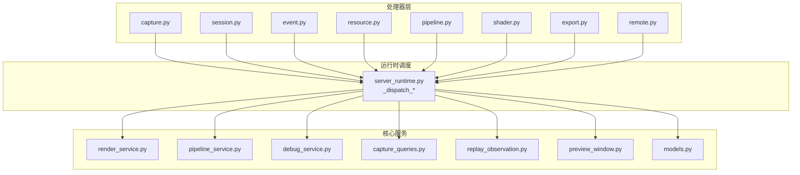
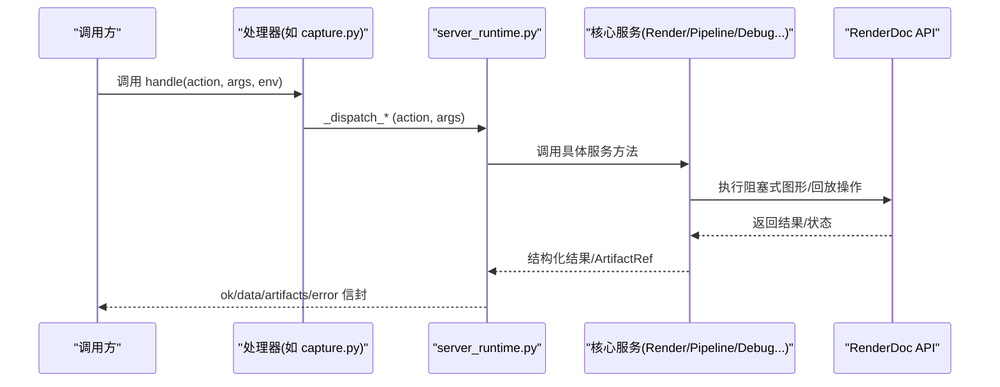
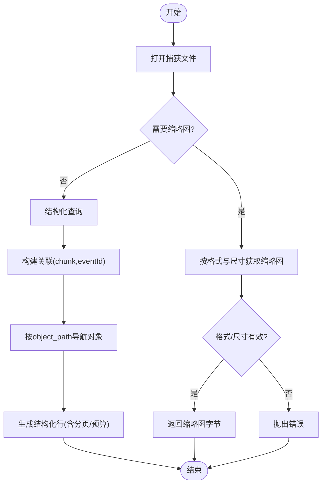
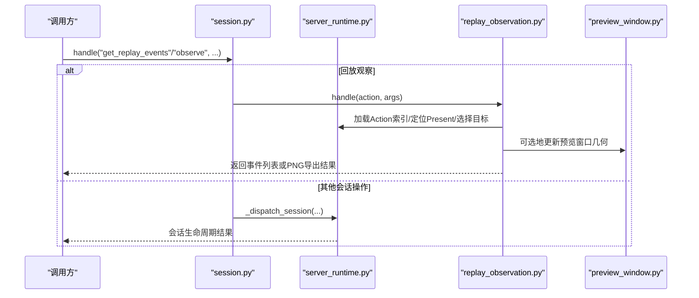
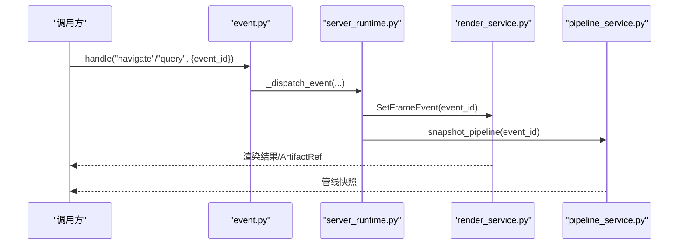
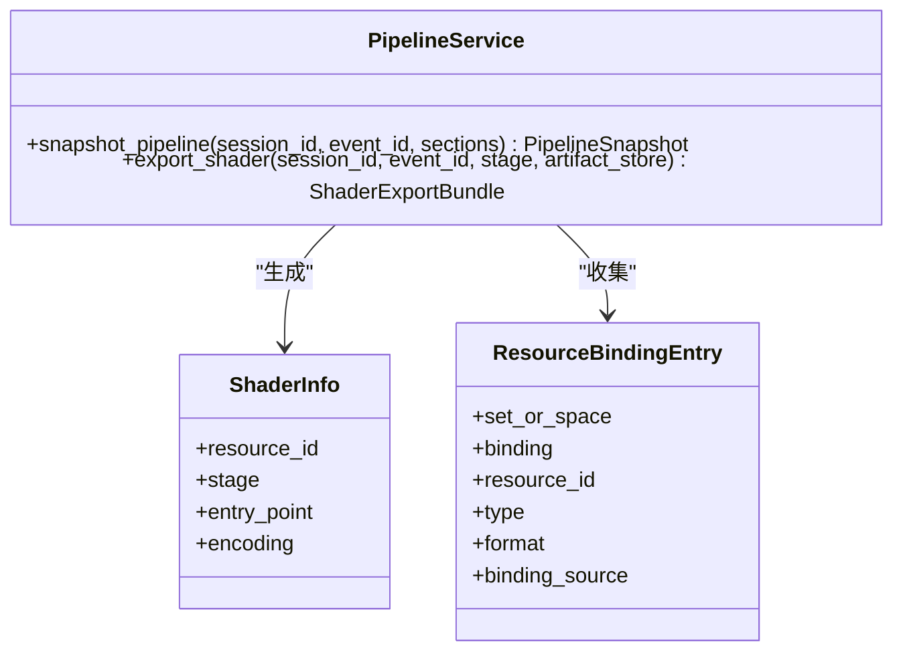
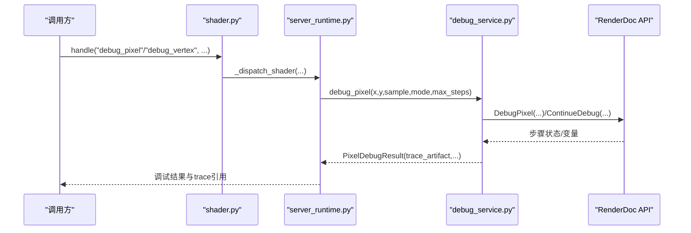
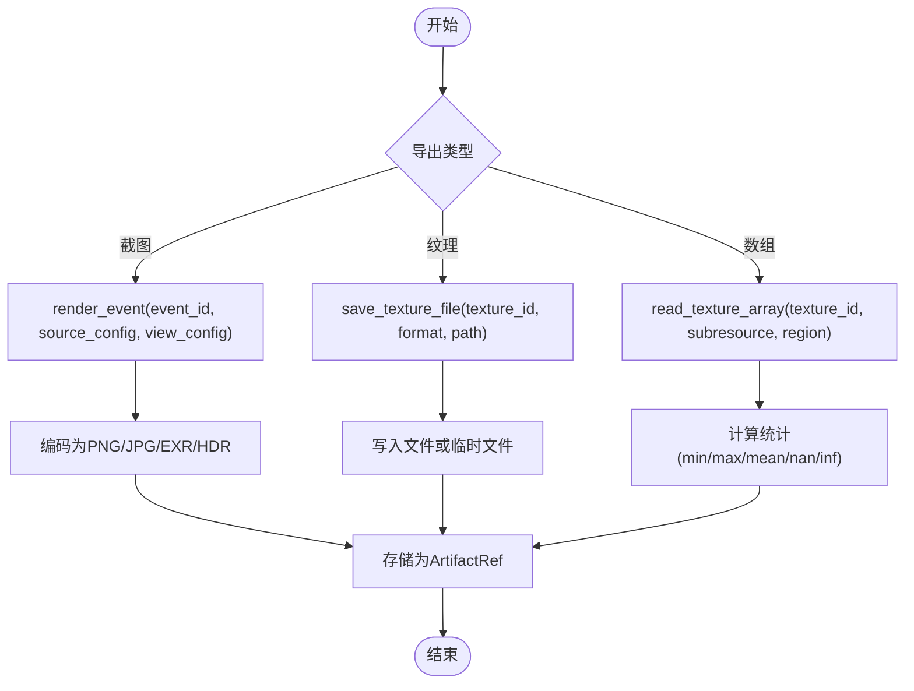
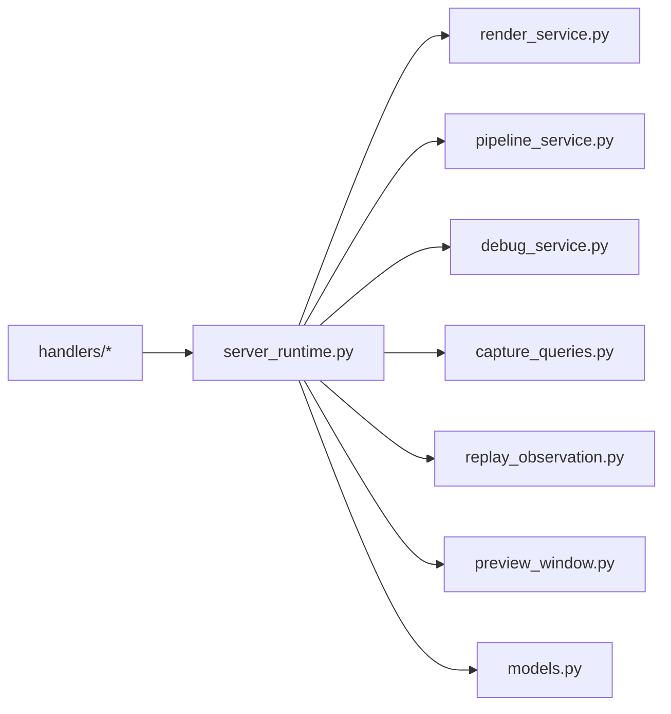

# 处理器模块

<cite>
**本文引用的文件**
- [capture.py](file://rdx/handlers/capture.py)
- [session.py](file://rdx/handlers/session.py)
- [event.py](file://rdx/handlers/event.py)
- [resource.py](file://rdx/handlers/resource.py)
- [pipeline.py](file://rdx/handlers/pipeline.py)
- [shader.py](file://rdx/handlers/shader.py)
- [export.py](file://rdx/handlers/export.py)
- [remote.py](file://rdx/handlers/remote.py)
- [capture_queries.py](file://rdx/core/capture_queries.py)
- [pipeline_service.py](file://rdx/core/pipeline_service.py)
- [render_service.py](file://rdx/core/render_service.py)
- [debug_service.py](file://rdx/core/debug_service.py)
- [replay_observation.py](file://rdx/replay_observation.py)
- [preview_window.py](file://rdx/preview_window.py)
- [server_runtime.py](file://rdx/server_runtime.py)
- [models.py](file://rdx/models.py)
</cite>

## 目录
1. [简介](#简介)
2. [项目结构](#项目结构)
3. [核心组件](#核心组件)
4. [架构总览](#架构总览)
5. [详细组件分析](#详细组件分析)
6. [依赖关系分析](#依赖关系分析)
7. [性能考量](#性能考量)
8. [故障排查指南](#故障排查指南)
9. [结论](#结论)
10. [附录](#附录)

## 简介
本文件面向 RDC-Tool 的“处理器模块”，系统化说明各处理器如何路由到运行时服务，并深入解析以下能力：
- 捕获文件处理器：文件操作、元数据查询与缩略图提取
- 会话处理器：生命周期管理、上下文快照与预览窗口控制
- 事件处理器：导航与查询（Action 树遍历、API 调用检查）
- 资源处理器：资源列表、详情查询与内存使用分析
- 管线状态处理器：Pipeline 状态获取、着色器信息与资源绑定检查
- Shader 调试处理器：断点管理、变量检查与调用栈分析
- 导出处理器：截图、纹理与网格数据导出
- 远程处理器：Android 设备连接与远程捕获控制

## 项目结构
处理器位于 rdx/handlers 下，每个处理器仅负责将 action 分发到 server_runtime 的对应调度方法；具体业务逻辑在 rdx/core 下的服务中实现。渲染、管线、调试等核心能力通过 RenderDoc Python 接口访问，并以异步方式封装，避免阻塞事件循环。

**图表来源**
- [capture.py:8-9](file://rdx/handlers/capture.py#L8-L9)
- [session.py:8-12](file://rdx/handlers/session.py#L8-L12)
- [event.py:8-9](file://rdx/handlers/event.py#L8-L9)
- [resource.py:8-9](file://rdx/handlers/resource.py#L8-L9)
- [pipeline.py:8-9](file://rdx/handlers/pipeline.py#L8-L9)
- [shader.py:8-9](file://rdx/handlers/shader.py#L8-L9)
- [export.py:8-9](file://rdx/handlers/export.py#L8-L9)
- [remote.py:8-9](file://rdx/handlers/remote.py#L8-L9)
- [server_runtime.py:1-200](file://rdx/server_runtime.py#L1-L200)

**章节来源**
- [capture.py:8-9](file://rdx/handlers/capture.py#L8-L9)
- [session.py:8-12](file://rdx/handlers/session.py#L8-L12)
- [event.py:8-9](file://rdx/handlers/event.py#L8-L9)
- [resource.py:8-9](file://rdx/handlers/resource.py#L8-L9)
- [pipeline.py:8-9](file://rdx/handlers/pipeline.py#L8-L9)
- [shader.py:8-9](file://rdx/handlers/shader.py#L8-L9)
- [export.py:8-9](file://rdx/handlers/export.py#L8-L9)
- [remote.py:8-9](file://rdx/handlers/remote.py#L8-L9)
- [server_runtime.py:1-200](file://rdx/server_runtime.py#L1-L200)

## 核心组件
- 处理器层：统一入口，转发 action 到 server_runtime 的 _dispatch_capture/_dispatch_session/_dispatch_event/_dispatch_resource/_dispatch_pipeline/_dispatch_shader/_dispatch_export/_dispatch_remote。
- 运行时调度：维护上下文、会话、远端连接、预览窗口、渲染服务等，并提供统一的 ok/data/artifacts/error 响应封装。
- 核心服务：
  - RenderService：无头渲染、纹理读取与保存、像素拾取、图像编码与存储。
  - PipelineService：管线状态快照、着色器信息、资源绑定、视口/裁剪/混合/深度模板等状态提取。
  - DebugService：像素/顶点着色器调试、步骤追踪、NaN/Inf 检测、trace 持久化。
  - CaptureQueries：结构化捕获数据查询、缩略图提取、对象投影与分页。
  - ReplayObservation：无窗口的回放观察（最终输出定位、目标选择、PNG 导出）。
  - PreviewWindowHost：Windows 预览窗口生命周期与几何自适应。

**章节来源**
- [server_runtime.py:1-200](file://rdx/server_runtime.py#L1-L200)
- [render_service.py:1-120](file://rdx/core/render_service.py#L1-L120)
- [pipeline_service.py:1-120](file://rdx/core/pipeline_service.py#L1-L120)
- [debug_service.py:1-60](file://rdx/core/debug_service.py#L1-L60)
- [capture_queries.py:1-30](file://rdx/core/capture_queries.py#L1-L30)
- [replay_observation.py:1-40](file://rdx/replay_observation.py#L1-L40)
- [preview_window.py:180-240](file://rdx/preview_window.py#L180-L240)

## 架构总览
处理器到服务的调用链如下所示：

**图表来源**
- [capture.py:8-9](file://rdx/handlers/capture.py#L8-L9)
- [server_runtime.py:1-200](file://rdx/server_runtime.py#L1-L200)
- [render_service.py:357-521](file://rdx/core/render_service.py#L357-L521)
- [pipeline_service.py:597-702](file://rdx/core/pipeline_service.py#L597-L702)
- [debug_service.py:54-267](file://rdx/core/debug_service.py#L54-L267)

## 详细组件分析

### 捕获文件处理器（Capture）
- 功能要点
  - 文件打开/关闭：通过 RenderDoc 打开捕获文件，确保 finally 中关闭以释放句柄。
  - 缩略图提取：按指定格式与最大尺寸获取嵌入缩略图，校验返回类型与尺寸是否满足请求。
  - 结构化查询：基于 Action 树定位事件关联的 chunk，支持对象路径、子项偏移与字符串值偏移的分页读取，限制节点预算防止过大响应。
- 关键流程
  - 打开文件 -> 获取缩略图 -> 校验 -> 返回二进制数据 -> 关闭捕获。
  - 构建 associations（chunk,eventId）-> 遍历 Action 树或按索引 -> 按 object_path 导航 -> 生成结构化对象行。

**图表来源**
- [capture_queries.py:8-23](file://rdx/core/capture_queries.py#L8-L23)
- [capture_queries.py:73-119](file://rdx/core/capture_queries.py#L73-L119)

**章节来源**
- [capture.py:8-9](file://rdx/handlers/capture.py#L8-L9)
- [capture_queries.py:8-23](file://rdx/core/capture_queries.py#L8-L23)
- [capture_queries.py:73-119](file://rdx/core/capture_queries.py#L73-L119)

### 会话处理器（Session）
- 功能要点
  - 生命周期管理：创建/切换/销毁会话，维护当前 session_id 与后端类型。
  - 上下文快照：记录上下文 ID、会话 ID、活跃事件、修改状态、显示参数等，便于恢复与对比。
  - 预览窗口控制：启动/关闭预览窗口，根据帧缓冲尺寸自动调整窗口大小，处理用户手动调整。
- 特殊分支
  - get_replay_events/observe：交由 replay_observation 处理，提供无窗口的回放观察与 PNG 导出。

**图表来源**
- [session.py:8-12](file://rdx/handlers/session.py#L8-L12)
- [replay_observation.py:40-147](file://rdx/replay_observation.py#L40-L147)
- [preview_window.py:221-301](file://rdx/preview_window.py#L221-L301)

**章节来源**
- [session.py:8-12](file://rdx/handlers/session.py#L8-L12)
- [replay_observation.py:40-147](file://rdx/replay_observation.py#L40-L147)
- [preview_window.py:221-301](file://rdx/preview_window.py#L221-L301)

### 事件处理器（Event）
- 功能要点
  - 导航：设置当前帧事件，用于后续渲染/管线/调试操作。
  - 查询：结合 Action 树与结构化捕获数据，定位 draw/dispatch/marker/copy 等事件，支持分页与预算控制。
- 典型用法
  - 先导航到目标 event_id，再调用渲染或管线快照，保证状态一致。

**图表来源**
- [event.py:8-9](file://rdx/handlers/event.py#L8-L9)
- [render_service.py:357-521](file://rdx/core/render_service.py#L357-L521)
- [pipeline_service.py:597-702](file://rdx/core/pipeline_service.py#L597-L702)

**章节来源**
- [event.py:8-9](file://rdx/handlers/event.py#L8-L9)
- [capture_queries.py:73-119](file://rdx/core/capture_queries.py#L73-L119)

### 资源处理器（Resource）
- 功能要点
  - 资源列表：枚举捕获中的纹理、缓冲区等资源，供后续查看或导出。
  - 详情查询：获取资源的描述符（格式、尺寸、mip/array/MSAA 等），用于渲染与 readback。
  - 内存使用分析：统计资源占用，辅助性能分析与优化。
- 与渲染服务协作
  - 通过 RenderService 的 save_texture_file/read_texture_array 进行导出与分析。

**章节来源**
- [resource.py:8-9](file://rdx/handlers/resource.py#L8-L9)
- [render_service.py:523-646](file://rdx/core/render_service.py#L523-L646)
- [render_service.py:658-794](file://rdx/core/render_service.py#L658-L794)

### 管线状态处理器（Pipeline）
- 功能要点
  - 状态快照：获取当前事件的管线状态，包括着色器、输出目标、混合/深度模板、视口/裁剪、拓扑、顶点输入、动态状态、根签名/描述符堆/资源状态等。
  - 着色器信息：提取阶段、入口点、编码、反射信息（常量块、只读/读写资源、签名）。
  - 资源绑定检查：从着色器反射或直接描述符访问收集绑定条目，去重并标注来源。
- 关键点
  - 针对 D3D11/D3D12/Vulkan/OpenGL 分别映射状态字段。
  - 对 unavailable 的状态段返回 not_applicable，避免伪造缺失声明。

**图表来源**
- [pipeline_service.py:597-702](file://rdx/core/pipeline_service.py#L597-L702)
- [pipeline_service.py:708-800](file://rdx/core/pipeline_service.py#L708-L800)
- [pipeline_service.py:392-503](file://rdx/core/pipeline_service.py#L392-L503)

**章节来源**
- [pipeline.py:8-9](file://rdx/handlers/pipeline.py#L8-L9)
- [pipeline_service.py:597-702](file://rdx/core/pipeline_service.py#L597-L702)
- [pipeline_service.py:708-800](file://rdx/core/pipeline_service.py#L708-L800)
- [pipeline_service.py:392-503](file://rdx/core/pipeline_service.py#L392-L503)

### Shader 调试处理器（Shader）
- 功能要点
  - 断点管理：通过 DebugService 的 trace 机制，逐步执行着色器，支持运行到首个 NaN/Inf 或全量追踪。
  - 变量检查：从 ShaderDebugState 提取寄存器/变量变化，过滤非 JSON 可序列化值。
  - 调用栈分析：记录 step_index、instruction、registers，支持导出为 JSON artifact 以便离线分析。
- 能力检测
  - 仅对 D3D11/D3D12/Vulkan 支持；OpenGL/OpenGLES 不支持。
  - 若 renderdoc Python 模块不可用，则降级为不可用提示。

**图表来源**
- [shader.py:8-9](file://rdx/handlers/shader.py#L8-L9)
- [debug_service.py:54-267](file://rdx/core/debug_service.py#L54-L267)
- [debug_service.py:271-421](file://rdx/core/debug_service.py#L271-L421)

**章节来源**
- [shader.py:8-9](file://rdx/handlers/shader.py#L8-L9)
- [debug_service.py:54-267](file://rdx/core/debug_service.py#L54-L267)
- [debug_service.py:271-421](file://rdx/core/debug_service.py#L271-L421)

### 导出处理器（Export）
- 功能要点
  - 截图导出：渲染指定事件或纹理到 PNG/JPG/EXR/HDR/BMP/TGA/DDS/Raw/NPZ，并通过 ArtifactStore 持久化。
  - 纹理导出：保存纹理文件或读取为数组，支持 subresource 与 region 裁剪。
  - 网格数据导出：通过 RenderDoc 的网格相关 API（由上层服务封装）导出网格数据（此处以纹理/像素为主）。
- 关键特性
  - 图像编码回退：当 EXR/HDR 编码器不可用时回退到 PNG。
  - 结果状态解析：统一包装 RenderDoc 状态码与文本，便于诊断。

**图表来源**
- [export.py:8-9](file://rdx/handlers/export.py#L8-L9)
- [render_service.py:357-521](file://rdx/core/render_service.py#L357-L521)
- [render_service.py:523-646](file://rdx/core/render_service.py#L523-L646)
- [render_service.py:658-794](file://rdx/core/render_service.py#L658-L794)

**章节来源**
- [export.py:8-9](file://rdx/handlers/export.py#L8-L9)
- [render_service.py:357-521](file://rdx/core/render_service.py#L357-L521)
- [render_service.py:523-646](file://rdx/core/render_service.py#L523-L646)
- [render_service.py:658-794](file://rdx/core/render_service.py#L658-L794)

### 远程处理器（Remote）
- 功能要点
  - Android 设备连接：通过 bootstrap_android_remote 建立连接，管理连接预算、超时与重试策略。
  - 远程捕获控制：在远端设备上启动/停止捕获，管理已知目标与捕获列表。
  - 会话消费：将远端会话租用到本地上下文，支持 strict/relaxed 上下文局部性策略。
- 集成点
  - server_runtime 维护 RemoteHandle/ConsumedRemoteHandle，协调远端服务与本地渲染/管线/调试能力。

**章节来源**
- [remote.py:8-9](file://rdx/handlers/remote.py#L8-L9)
- [server_runtime.py:137-175](file://rdx/server_runtime.py#L137-L175)

## 依赖关系分析
- 处理器与运行时：所有处理器均依赖 server_runtime 的统一调度，保持轻量与一致性。
- 运行时与服务：运行时组合 RenderService、PipelineService、DebugService、CaptureQueries、ReplayObservation、PreviewWindowHost，形成完整工具链。
- 外部依赖：RenderDoc Python 模块延迟导入，仅在需要时加载，降低启动开销与失败面。
- 模型定义：models.py 提供通用数据结构（ArtifactRef、GraphicsAPI、ShaderStage、SessionInfo 等），贯穿各服务。

**图表来源**
- [server_runtime.py:1-200](file://rdx/server_runtime.py#L1-L200)
- [models.py:103-141](file://rdx/models.py#L103-L141)

**章节来源**
- [server_runtime.py:1-200](file://rdx/server_runtime.py#L1-L200)
- [models.py:103-141](file://rdx/models.py#L103-L141)

## 性能考量
- 异步与线程分派：所有阻塞的 RenderDoc 调用通过 asyncio.to_thread 分派到线程池，避免阻塞事件循环。
- 预算与分页：结构化查询使用 node_budget 与 offset/limit 控制响应大小，防止大对象导致内存压力。
- 图像编码回退：EXR/HDR 编码失败时回退到 PNG，提升鲁棒性。
- 延迟导入：renderdoc 模块按需加载，减少启动时间与依赖失败影响。
- 预览窗口自适应：根据工作区与屏幕比例自动缩放，减少频繁重绘与布局抖动。

[本节为通用指导，不直接分析具体文件]

## 故障排查指南
- 渲染/导出失败
  - 检查 RenderDoc 状态码与消息，参考 render_service 的结果解析与分类。
  - 确认纹理 subresource 与 region 合法，避免越界。
- 管线快照异常
  - 确认事件已正确导航（SetFrameEvent），且 API 特定状态可用。
  - 对 unavailable 的状态段，接受 not_applicable 而非报错。
- Shader 调试不可用
  - 确认当前 API 支持（D3D11/D3D12/Vulkan），且 renderdoc Python 模块可用。
  - 若 trace 无效，可能该 draw call 不支持调试。
- 结构化查询错误
  - 检查 object_path、child_offset、value_offset 是否在范围内。
  - 注意 node_budget 耗尽会提前终止，需增大预算或分页读取。
- 预览窗口问题
  - 确认窗口类注册成功，消息循环正常；若启动失败，检查系统权限与显示驱动。

**章节来源**
- [render_service.py:161-195](file://rdx/core/render_service.py#L161-L195)
- [render_service.py:523-646](file://rdx/core/render_service.py#L523-L646)
- [pipeline_service.py:618-702](file://rdx/core/pipeline_service.py#L618-L702)
- [debug_service.py:94-141](file://rdx/core/debug_service.py#L94-L141)
- [capture_queries.py:73-119](file://rdx/core/capture_queries.py#L73-L119)
- [preview_window.py:146-168](file://rdx/preview_window.py#L146-L168)

## 结论
本处理器模块通过简洁的处理器层与强大的核心服务组合，提供了完整的捕获分析、渲染、管线检查、调试与导出能力。借助异步与预算控制，系统在性能与稳定性之间取得平衡；通过延迟导入与回退策略，增强了在不同环境下的可用性。建议在实际使用中：
- 合理设置查询预算与分页参数，避免过大响应。
- 优先使用结构化查询与管线快照定位问题。
- 利用调试 trace 与像素统计快速定位数值异常。
- 在远程场景中，关注连接预算与会话租约策略。

[本节为总结，不直接分析具体文件]

## 附录
- 常用模型
  - ArtifactRef：artifact 引用（uri、sha256、mime、bytes、meta）。
  - GraphicsAPI/ShaderStage：图形 API 与着色器阶段枚举。
  - SessionInfo/Capabilities：会话信息与能力标志。
- 关键服务方法
  - RenderService.render_event/save_texture_file/read_texture_array
  - PipelineService.snapshot_pipeline/export_shader
  - DebugService.debug_pixel/debug_vertex
  - CaptureQueries.read_thumbnail/query_calls
  - ReplayObservation.handle（get_replay_events/observe）
  - PreviewWindowHost.start/close/apply_framebuffer_geometry

**章节来源**
- [models.py:103-141](file://rdx/models.py#L103-L141)
- [render_service.py:357-794](file://rdx/core/render_service.py#L357-L794)
- [pipeline_service.py:597-800](file://rdx/core/pipeline_service.py#L597-L800)
- [debug_service.py:54-421](file://rdx/core/debug_service.py#L54-L421)
- [capture_queries.py:8-119](file://rdx/core/capture_queries.py#L8-L119)
- [replay_observation.py:40-147](file://rdx/replay_observation.py#L40-L147)
- [preview_window.py:221-301](file://rdx/preview_window.py#L221-L301)