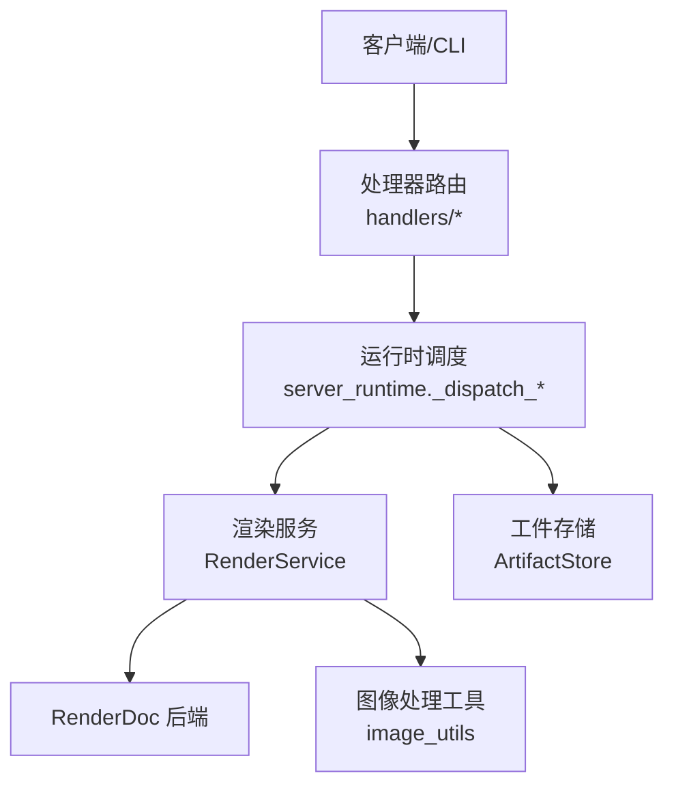
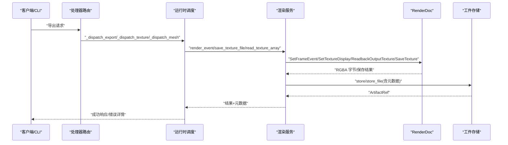
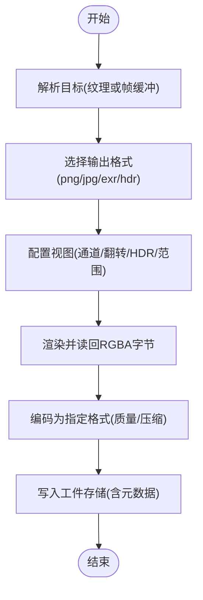
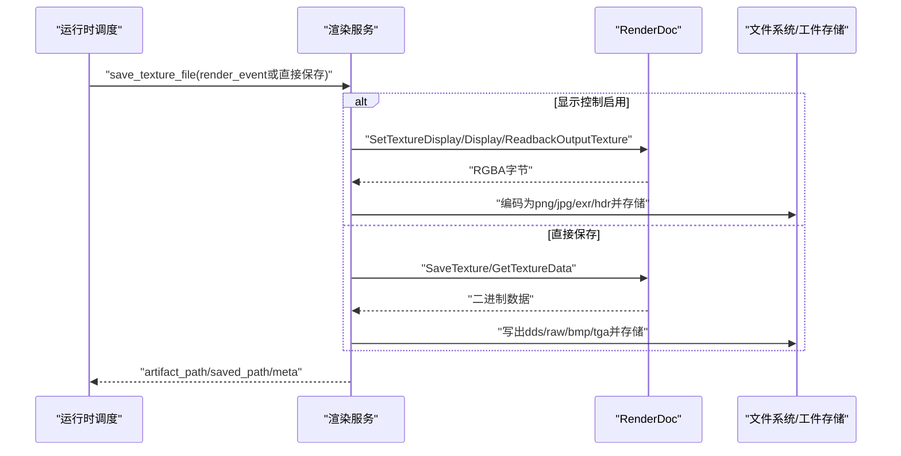
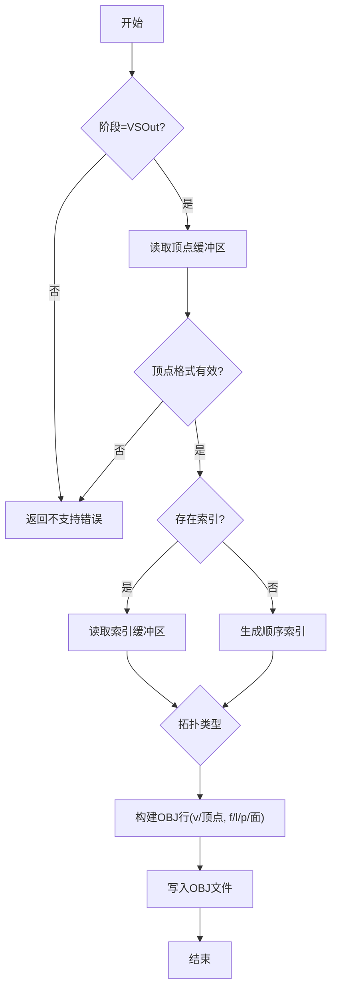
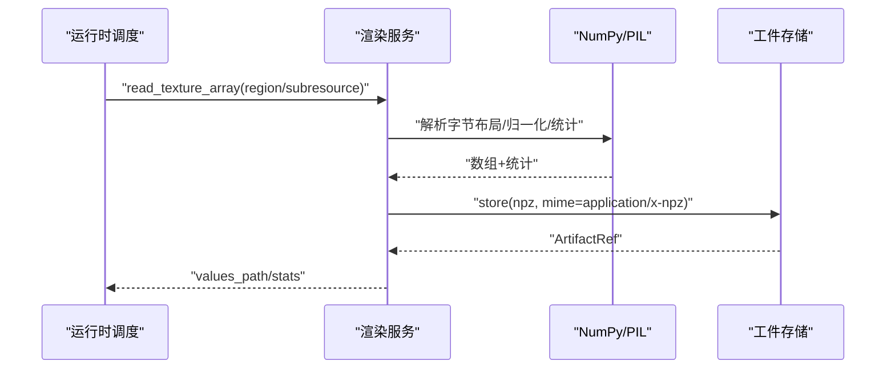
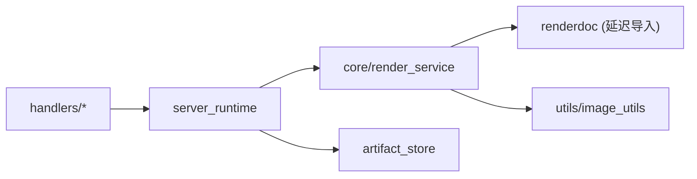

# 导出处理器

<cite>
**本文引用的文件**
- [export.py](file://rdx/handlers/export.py)
- [texture.py](file://rdx/handlers/texture.py)
- [mesh.py](file://rdx/handlers/mesh.py)
- [server_runtime.py](file://rdx/server_runtime.py)
- [render_service.py](file://rdx/core/render_service.py)
- [image_utils.py](file://rdx/utils/image_utils.py)
- [cli.py](file://rdx/cli.py)
- [operation_definitions.py](file://rdx/operation_definitions.py)
</cite>

## 目录
1. [简介](#简介)
2. [项目结构](#项目结构)
3. [核心组件](#核心组件)
4. [架构总览](#架构总览)
5. [详细组件分析](#详细组件分析)
6. [依赖关系分析](#依赖关系分析)
7. [性能与优化](#性能与优化)
8. [故障排查指南](#故障排查指南)
9. [结论](#结论)
10. [附录：使用示例](#附录使用示例)

## 简介
本文件系统性说明 RDC-Tool 的“导出处理器”实现，覆盖截图导出、纹理导出与网格数据导出三大能力。重点解释帧缓冲捕获、图像格式转换与质量控制、多种纹理格式保存与压缩选项、网格顶点/索引/拓扑提取，以及批量导出、服务端集成和自动化报告生成策略。文档同时提供流程图与时序图，帮助读者快速理解数据流与控制流。

## 项目结构
导出功能由“处理器路由 + 运行时调度 + 渲染服务 + 工具库”四层组成：
- 处理器路由层：将外部调用转发到运行时（如 export/texture/mesh）。
- 运行时调度层：统一解析参数、选择目标、协调渲染服务与持久化。
- 渲染服务层：封装 RenderDoc 的纹理显示、读回、像素检查等异步操作。
- 工具库层：图像处理、统计、HDR 色调映射等通用能力。

图表来源
- [export.py:8-9](file://rdx/handlers/export.py#L8-L9)
- [texture.py:8-9](file://rdx/handlers/texture.py#L8-L9)
- [mesh.py:8-9](file://rdx/handlers/mesh.py#L8-L9)
- [server_runtime.py:11118-11299](file://rdx/server_runtime.py#L11118-L11299)
- [server_runtime.py:8470-8841](file://rdx/server_runtime.py#L8470-L8841)
- [server_runtime.py:8093-8146](file://rdx/server_runtime.py#L8093-L8146)
- [render_service.py:346-521](file://rdx/core/render_service.py#L346-L521)
- [render_service.py:523-653](file://rdx/core/render_service.py#L523-L653)
- [render_service.py:658-794](file://rdx/core/render_service.py#L658-L794)
- [image_utils.py:21-478](file://rdx/utils/image_utils.py#L21-L478)

章节来源
- [export.py:8-9](file://rdx/handlers/export.py#L8-L9)
- [texture.py:8-9](file://rdx/handlers/texture.py#L8-L9)
- [mesh.py:8-9](file://rdx/handlers/mesh.py#L8-L9)
- [server_runtime.py:11118-11299](file://rdx/server_runtime.py#L11118-L11299)
- [server_runtime.py:8470-8841](file://rdx/server_runtime.py#L8470-L8841)
- [server_runtime.py:8093-8146](file://rdx/server_runtime.py#L8093-L8146)
- [render_service.py:346-521](file://rdx/core/render_service.py#L346-L521)
- [render_service.py:523-653](file://rdx/core/render_service.py#L523-L653)
- [render_service.py:658-794](file://rdx/core/render_service.py#L658-L794)
- [image_utils.py:21-478](file://rdx/utils/image_utils.py#L21-L478)

## 核心组件
- 处理器路由
  - 导出入口：将 action 与参数转交给 server_runtime 的统一分发器。
  - 纹理入口：将纹理相关动作转交给 server_runtime 的纹理分发器。
  - 网格入口：将网格相关动作转交给 server_runtime 的网格分发器。
- 运行时调度
  - 截图导出：解析目标（可回退到帧缓冲）、选择输出格式、调用纹理渲染并保存。
  - 纹理导出：支持直接保存或经显示控制（通道/翻转/HDR）后编码；支持多格式批量导出。
  - 网格导出：仅支持 post-VS 空间、三角/线/点拓扑的 OBJ 导出。
- 渲染服务
  - 事件渲染与读回：通过 TextureDisplay 配置视图，读取 RGBA 字节并编码为 PNG/JPG/EXR/HDR。
  - 纹理保存：通过 SaveTexture 或 GetTextureData 直接写出 DDS/Raw/BMP/TGA 等。
  - 数值容器导出：将纹理读回为 npz 容器，附带统计信息。
- 图像处理工具
  - NaN/Inf 检测、差异热力图、边界框叠加、像素统计、HDR 色调映射、PNG 编解码等。

章节来源
- [export.py:8-9](file://rdx/handlers/export.py#L8-L9)
- [texture.py:8-9](file://rdx/handlers/texture.py#L8-L9)
- [mesh.py:8-9](file://rdx/handlers/mesh.py#L8-L9)
- [server_runtime.py:11118-11299](file://rdx/server_runtime.py#L11118-L11299)
- [server_runtime.py:8470-8841](file://rdx/server_runtime.py#L8470-L8841)
- [server_runtime.py:8093-8146](file://rdx/server_runtime.py#L8093-L8146)
- [render_service.py:346-521](file://rdx/core/render_service.py#L346-L521)
- [render_service.py:523-653](file://rdx/core/render_service.py#L523-L653)
- [render_service.py:658-794](file://rdx/core/render_service.py#L658-L794)
- [image_utils.py:21-478](file://rdx/utils/image_utils.py#L21-L478)

## 架构总览
导出处理器的整体流程如下：
- 客户端/CLI 发起导出请求。
- 处理器路由将请求转发至运行时调度。
- 运行时根据 action 选择具体导出路径（截图/纹理/网格）。
- 渲染服务负责与 RenderDoc 交互，完成帧缓冲捕获、纹理读回与编码。
- 工件存储将结果持久化为 artifact，并返回引用与元数据。
- 可选地，图像处理工具对数据进行增强（如 HDR 色调映射、NaN/Inf 可视化）。

图表来源
- [server_runtime.py:11118-11299](file://rdx/server_runtime.py#L11118-L11299)
- [server_runtime.py:8470-8841](file://rdx/server_runtime.py#L8470-L8841)
- [server_runtime.py:8093-8146](file://rdx/server_runtime.py#L8093-L8146)
- [render_service.py:346-521](file://rdx/core/render_service.py#L346-L521)
- [render_service.py:523-653](file://rdx/core/render_service.py#L523-L653)
- [render_service.py:658-794](file://rdx/core/render_service.py#L658-L794)

## 详细组件分析

### 截图导出（帧缓冲捕获、图像格式与质量）
- 目标解析与回退：优先使用显式纹理目标，否则回退到当前帧缓冲输出；记录 present 事件与语义信息。
- 格式选择：默认 png，支持 jpg/exr/hdr；自动推荐基于纹理类型（HDR/立方体贴图等）。
- 渲染与编码：通过 TextureDisplay 设置缩放、通道、HDR 乘数、翻转、原始输出等；读回 RGBA 字节后编码为指定格式。
- 质量控制：JPG 固定质量；EXR/HDR 在缺少编码器时回退 PNG；未知格式回退 PNG。
- 输出：单格式返回 artifact_path/saved_path/meta；多格式返回 exports/saved_paths/image_paths。

图表来源
- [server_runtime.py:11118-11299](file://rdx/server_runtime.py#L11118-L11299)
- [render_service.py:346-521](file://rdx/core/render_service.py#L346-L521)
- [render_service.py:278-338](file://rdx/core/render_service.py#L278-L338)

章节来源
- [server_runtime.py:11118-11299](file://rdx/server_runtime.py#L11118-L11299)
- [render_service.py:346-521](file://rdx/core/render_service.py#L346-L521)
- [render_service.py:278-338](file://rdx/core/render_service.py#L278-L338)

### 纹理导出机制（多格式保存与压缩选项）
- 两种路径：
  - 显示映射路径：当启用 channels/remap/flip_y 等显示控制时，走 render_event 编码为 png/jpg/exr/hdr。
  - 直接保存路径：通过 SaveTexture 或 GetTextureData 写出 dds/raw/bmp/tga 等。
- 子资源选择：支持 mip/slice/sample 精确导出。
- 批量导出：支持一次请求多个格式，自动命名与复制。
- 质量与兼容性：若实际编码格式与请求不一致，返回 format_error 并提供降级原因与建议格式。

图表来源
- [server_runtime.py:7856-8074](file://rdx/server_runtime.py#L7856-L8074)
- [render_service.py:523-653](file://rdx/core/render_service.py#L523-L653)
- [render_service.py:658-794](file://rdx/core/render_service.py#L658-L794)

章节来源
- [server_runtime.py:7856-8074](file://rdx/server_runtime.py#L7856-L8074)
- [render_service.py:523-653](file://rdx/core/render_service.py#L523-L653)
- [render_service.py:658-794](file://rdx/core/render_service.py#L658-L794)

### 网格数据导出（顶点、索引与材质）
- 支持阶段：post-VS 空间（VSOut），不支持 pre-VS 或 GSOut 的 OBJ 导出。
- 顶点数据：要求 32-bit float 位置；按 stride 解析顶点数组。
- 索引数据：支持 u16/u32 索引；自动应用 baseVertex 偏移。
- 拓扑处理：TriangleList/TriangleStrip/LineList/PointList 转换为 OBJ 面/线/点。
- 限制：不支持属性、PLY/glTF、非有限值、不完整读回；失败不写占位文件。

图表来源
- [server_runtime.py:8093-8146](file://rdx/server_runtime.py#L8093-L8146)

章节来源
- [server_runtime.py:8093-8146](file://rdx/server_runtime.py#L8093-L8146)

### 数值容器导出与统计（npz 与直方图）
- 数值容器：read_texture_array 将纹理读回为 NumPy 数组，序列化压缩为 .npz，附带形状、dtype、统计（min/max/mean/nan/inf）。
- 区域采样：支持矩形区域与步长采样，降低大数据量成本。
- 直方图：按通道计算直方图，支持范围与 bin 数配置。

图表来源
- [render_service.py:658-794](file://rdx/core/render_service.py#L658-L794)
- [server_runtime.py:8500-8700](file://rdx/server_runtime.py#L8500-L8700)

章节来源
- [render_service.py:658-794](file://rdx/core/render_service.py#L658-L794)
- [server_runtime.py:8500-8700](file://rdx/server_runtime.py#L8500-L8700)

### 叠加层渲染与可视化（overlay）
- 支持 overlay：Drawcall/Wireframe/Depth/Stencil/BackfaceCull/ViewportScissor/QuadOverdraw/TriangleSize 等。
- 通道控制：可选择 r/g/b/a 通道可见性；支持 flip_y。
- 输出：渲染到纹理并导出图片，便于调试绘制调用与过度绘制。

章节来源
- [server_runtime.py:8700-8769](file://rdx/server_runtime.py#L8700-L8769)
- [render_service.py:235-261](file://rdx/core/render_service.py#L235-L261)

## 依赖关系分析
- 处理器路由依赖运行时分发器，运行时依赖渲染服务与工件存储。
- 渲染服务依赖 RenderDoc 模块（延迟导入），并在不可用时抛出明确错误。
- 图像处理工具依赖 PIL 与 imageio（可选），在缺失时回退到 PNG。
- 运行时还依赖上下文快照、进度上报、超时策略等基础设施。

图表来源
- [export.py:8-9](file://rdx/handlers/export.py#L8-L9)
- [texture.py:8-9](file://rdx/handlers/texture.py#L8-L9)
- [mesh.py:8-9](file://rdx/handlers/mesh.py#L8-L9)
- [server_runtime.py:11118-11299](file://rdx/server_runtime.py#L11118-L11299)
- [render_service.py:39-56](file://rdx/core/render_service.py#L39-L56)
- [render_service.py:278-338](file://rdx/core/render_service.py#L278-L338)

章节来源
- [export.py:8-9](file://rdx/handlers/export.py#L8-L9)
- [texture.py:8-9](file://rdx/handlers/texture.py#L8-L9)
- [mesh.py:8-9](file://rdx/handlers/mesh.py#L8-L9)
- [server_runtime.py:11118-11299](file://rdx/server_runtime.py#L11118-L11299)
- [render_service.py:39-56](file://rdx/core/render_service.py#L39-L56)
- [render_service.py:278-338](file://rdx/core/render_service.py#L278-L338)

## 性能与优化
- 异步分派：所有阻塞的 RenderDoc 调用通过线程池执行，避免阻塞事件循环。
- 批量导出：一次请求多格式，减少重复导航与读回。
- 区域采样：支持 region 与 stride，降低大数据量处理成本。
- 编码回退：当可选编码器不可用时自动回退到 PNG，保证稳定性。
- 内存与预算：内联传输限制（如 1 MiB），大对象通过工件存储持久化。
- 推荐格式：根据纹理类型（HDR/深度/法线/遮罩/压缩）智能推荐输出格式。

[本节为通用指导，无需特定文件来源]

## 故障排查指南
- 渲染目标不可用：检查 session_id/event_id 是否正确；确认目标纹理是否存在或帧缓冲可用。
- 格式编码器不可用：当请求格式与实际编码不一致时，查看 format_error 中的 requested_format/actual_format/reason。
- 网格导出失败：确认阶段为 VSOut、顶点为 float32、索引宽度为 u16/u32、拓扑受支持且读回完整。
- 数值容器为空：确保 subresource 与 region 合法；检查纹理尺寸与分量布局是否受支持。
- 超时与恢复：像素历史等操作可能超时；关注 runtime 日志与上下文状态恢复提示。

章节来源
- [server_runtime.py:11118-11299](file://rdx/server_runtime.py#L11118-L11299)
- [server_runtime.py:8093-8146](file://rdx/server_runtime.py#L8093-L8146)
- [render_service.py:523-653](file://rdx/core/render_service.py#L523-L653)
- [render_service.py:658-794](file://rdx/core/render_service.py#L658-L794)

## 结论
导出处理器以清晰的层次化设计实现了截图、纹理与网格的高效导出。通过异步分派、批量导出、区域采样与智能格式推荐，兼顾了性能与可用性。结合工件存储与元数据，便于自动化报告与持续集成。对于复杂场景（HDR、深度、法线、遮罩），系统提供了丰富的可视化与数值分析能力，满足调试与验证需求。

[本节为总结，无需特定文件来源]

## 附录：使用示例
以下示例展示如何通过 CLI 与服务端接口进行数据导出、格式转换与自动化报告生成。

- 截图导出
  - CLI：导出指定事件的帧缓冲截图。
  - 服务端：调用 rd.export.screenshot，指定 session_id、event_id、output_path、file_format。
  - 参考：
    - [cli.py:1538-1555](file://rdx/cli.py#L1538-L1555)
    - [operation_definitions.py:1286-1314](file://rdx/operation_definitions.py#L1286-L1314)
    - [server_runtime.py:11118-11299](file://rdx/server_runtime.py#L11118-L11299)

- 纹理导出
  - CLI：导出纹理资源为图片/二进制。
  - 服务端：调用 rd.export.texture，指定 texture_id、subresource、output_path、file_format；可启用 channels/remap/flip_y 进行显示映射。
  - 参考：
    - [cli.py:1545-1550](file://rdx/cli.py#L1545-L1550)
    - [server_runtime.py:7856-8074](file://rdx/server_runtime.py#L7856-L8074)
    - [render_service.py:523-653](file://rdx/core/render_service.py#L523-L653)

- 网格导出
  - CLI：导出事件网格为 OBJ。
  - 服务端：调用 rd.export.mesh，仅支持 post-VS 空间与受支持拓扑。
  - 参考：
    - [cli.py:1551-1555](file://rdx/cli.py#L1551-L1555)
    - [server_runtime.py:8093-8146](file://rdx/server_runtime.py#L8093-L8146)

- 数值容器与直方图
  - 服务端：调用 rd.texture.get_data 获取 npz 容器；调用 rd.texture.get_histogram 计算直方图。
  - 参考：
    - [server_runtime.py:8500-8700](file://rdx/server_runtime.py#L8500-L8700)

- 叠加层渲染
  - 服务端：调用 rd.texture.render_overlay 渲染 Drawcall/Wireframe/Overdraw 等叠加层并导出图片。
  - 参考：
    - [server_runtime.py:8700-8769](file://rdx/server_runtime.py#L8700-L8769)

- 自动化报告生成
  - 组合多次导出（截图/纹理/网格/数值容器），收集 artifact_path/saved_path/meta，生成汇总报告。
  - 参考：
    - [operation_definitions.py:1286-1314](file://rdx/operation_definitions.py#L1286-L1314)
    - [server_runtime.py:11118-11299](file://rdx/server_runtime.py#L11118-L11299)

章节来源
- [cli.py:1538-1555](file://rdx/cli.py#L1538-L1555)
- [operation_definitions.py:1286-1314](file://rdx/operation_definitions.py#L1286-L1314)
- [server_runtime.py:7856-8074](file://rdx/server_runtime.py#L7856-L8074)
- [server_runtime.py:8093-8146](file://rdx/server_runtime.py#L8093-L8146)
- [server_runtime.py:8500-8700](file://rdx/server_runtime.py#L8500-L8700)
- [server_runtime.py:8700-8769](file://rdx/server_runtime.py#L8700-L8769)
- [server_runtime.py:11118-11299](file://rdx/server_runtime.py#L11118-L11299)