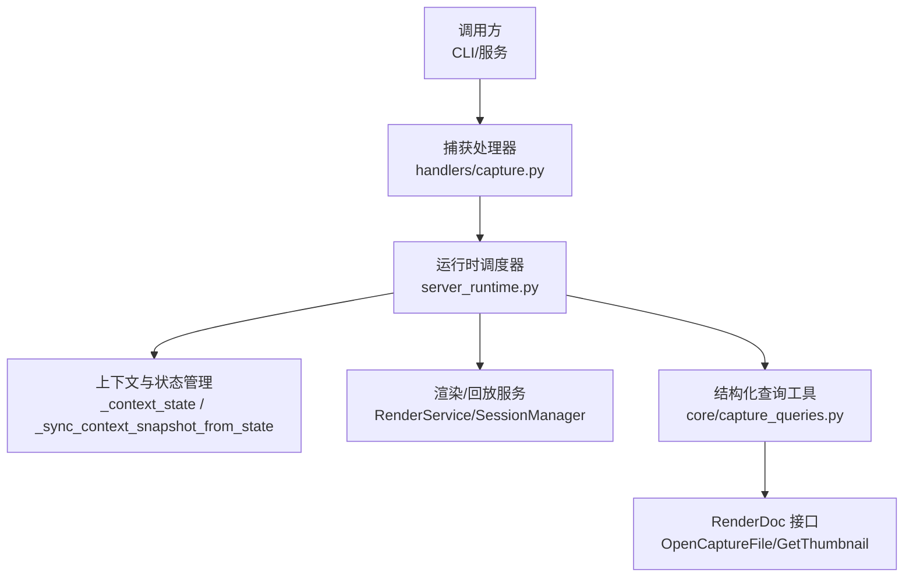
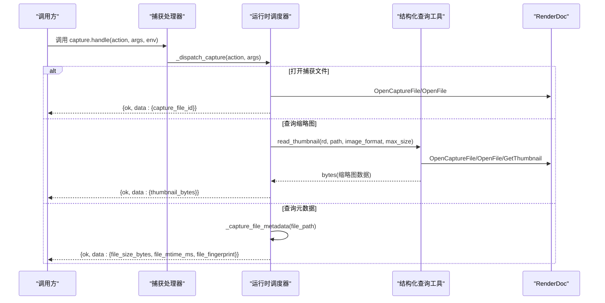
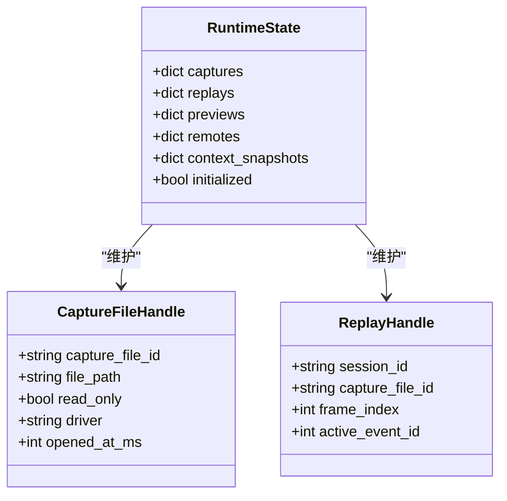
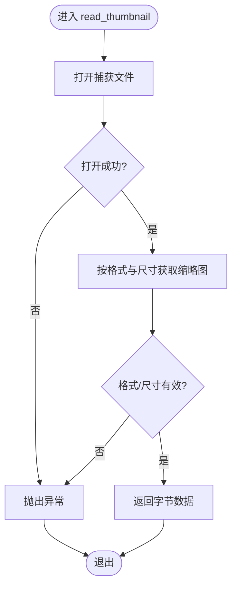
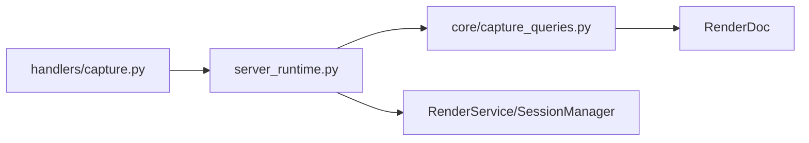

# 捕获文件处理器

<cite>
**本文引用的文件**
- [rdc_tool/handlers/capture.py](file://rdc_tool/handlers/capture.py)
- [rdc_tool/server_runtime.py](file://rdc_tool/server_runtime.py)
- [rdc_tool/core/capture_queries.py](file://rdc_tool/core/capture_queries.py)
- [tests/test_cli_capture_open.py](file://tests/test_cli_capture_open.py)
</cite>

## 目录
1. [简介](#简介)
2. [项目结构](#项目结构)
3. [核心组件](#核心组件)
4. [架构总览](#架构总览)
5. [详细组件分析](#详细组件分析)
6. [依赖关系分析](#依赖关系分析)
7. [性能考虑](#性能考虑)
8. [故障排查指南](#故障排查指南)
9. [结论](#结论)
10. [附录：API 参考与示例](#附录api-参考与示例)

## 简介
本文件聚焦“捕获文件处理器”的实现与功能，说明其如何封装 RenderDoc 的捕获文件操作（打开、关闭、元数据查询、缩略图提取等），并通过 server_runtime._dispatch_capture 提供统一接口。文档还涵盖与其他模块的集成方式、错误处理机制，以及面向调用方的 API 参数与返回值约定。

## 项目结构
捕获文件处理入口位于 handlers 层，负责将外部请求转发到运行时调度器；运行时调度器在 server_runtime.py 中实现统一的捕获/回放/会话状态管理；对 RenderDoc 的直接访问集中在 core/capture_queries.py 中，用于无副作用的只读查询（如缩略图）。

图表来源
- [rdc_tool/handlers/capture.py:8-9](file://rdc_tool/handlers/capture.py#L8-L9)
- [rdc_tool/server_runtime.py:120-238](file://rdc_tool/server_runtime.py#L120-L238)
- [rdc_tool/core/capture_queries.py:8-23](file://rdc_tool/core/capture_queries.py#L8-L23)

章节来源
- [rdc_tool/handlers/capture.py:1-11](file://rdc_tool/handlers/capture.py#L1-L11)
- [rdc_tool/server_runtime.py:120-238](file://rdc_tool/server_runtime.py#L120-L238)
- [rdc_tool/core/capture_queries.py:1-119](file://rdc_tool/core/capture_queries.py#L1-L119)

## 核心组件
- 捕获处理器适配器：将 action + args 路由到运行时调度器的捕获分发方法。
- 运行时调度器：维护捕获句柄、回放会话、上下文快照与指标，协调各服务完成具体操作。
- 结构化查询工具：以只读方式访问 RenderDoc 捕获文件的元数据与缩略图。

关键职责
- 打开/关闭捕获文件：创建并缓存 CaptureFileHandle，更新上下文状态。
- 元数据查询：返回文件大小、修改时间、指纹等。
- 缩略图提取：通过 RenderDoc 获取指定格式与尺寸的缩略图字节。
- 统一接口：对外暴露 rd.capture.* 系列操作，内部由 _dispatch_capture 分派。

章节来源
- [rdc_tool/handlers/capture.py:8-9](file://rdc_tool/handlers/capture.py#L8-L9)
- [rdc_tool/server_runtime.py:120-238](file://rdc_tool/server_runtime.py#L120-L238)
- [rdc_tool/core/capture_queries.py:8-23](file://rdc_tool/core/capture_queries.py#L8-L23)

## 架构总览
捕获文件处理的端到端流程如下：

图表来源
- [rdc_tool/handlers/capture.py:8-9](file://rdc_tool/handlers/capture.py#L8-L9)
- [rdc_tool/core/capture_queries.py:8-23](file://rdc_tool/core/capture_queries.py#L8-L23)
- [rdc_tool/server_runtime.py:624-639](file://rdc_tool/server_runtime.py#L624-L639)

## 详细组件分析

### 捕获处理器（handlers/capture.py）
- 作用：作为统一入口，接收 action 与参数，委托给运行时调度器的捕获分发方法。
- 设计要点：极简适配层，避免业务逻辑外泄，便于测试与替换。

章节来源
- [rdc_tool/handlers/capture.py:1-11](file://rdc_tool/handlers/capture.py#L1-L11)

### 运行时调度器（server_runtime.py）
- 捕获句柄模型：CaptureFileHandle 记录捕获文件 ID、路径、只读标志、驱动、打开时间等。
- 会话模型：ReplayHandle 记录 session_id、capture_file_id、frame_index、active_event_id。
- 上下文快照：_sync_context_snapshot_from_state 将当前会话/捕获信息同步到上下文快照，供上层消费。
- 元数据：_capture_file_metadata 基于文件系统统计信息生成文件指纹与大小、修改时间。
- 状态更新：_upsert_context_capture/_remove_context_capture 维护上下文中的捕获集合与当前选择。
- 指标与追踪：记录操作开始/阶段/结束，维护最近操作列表与度量。

图表来源
- [rdc_tool/server_runtime.py:120-238](file://rdc_tool/server_runtime.py#L120-L238)

章节来源
- [rdc_tool/server_runtime.py:120-238](file://rdc_tool/server_runtime.py#L120-L238)
- [rdc_tool/server_runtime.py:624-639](file://rdc_tool/server_runtime.py#L624-L639)
- [rdc_tool/server_runtime.py:807-843](file://rdc_tool/server_runtime.py#L807-L843)
- [rdc_tool/server_runtime.py:977-1071](file://rdc_tool/server_runtime.py#L977-L1071)

### 结构化查询工具（core/capture_queries.py）
- 缩略图读取：read_thumbnail 打开捕获文件，按指定格式与最大尺寸获取缩略图，并进行基本校验后返回字节数据。
- 结构化对象投影：structured_object 对捕获的结构化数据进行有界遍历，支持分页与省略计数。
- 调用查询：query_calls 根据事件或块索引定位结构化对象，限制节点预算，返回分页结果。

图表来源
- [rdc_tool/core/capture_queries.py:8-23](file://rdc_tool/core/capture_queries.py#L8-L23)

章节来源
- [rdc_tool/core/capture_queries.py:1-119](file://rdc_tool/core/capture_queries.py#L1-L119)

### 统一接口设计与分派
- 入口：handlers/capture.handle(action, args, env) 直接调用 server_runtime._dispatch_capture(action, args)。
- 分派：_dispatch_capture 根据 action 字符串路由到具体实现（例如 open_file、open_replay、close、get_metadata、get_thumbnail 等）。
- 上下文与状态：每次操作会记录到上下文快照与最近操作中，便于诊断与恢复。

章节来源
- [rdc_tool/handlers/capture.py:8-9](file://rdc_tool/handlers/capture.py#L8-L9)
- [rdc_tool/server_runtime.py:977-1071](file://rdc_tool/server_runtime.py#L977-L1071)

## 依赖关系分析
- 处理器依赖运行时调度器：解耦 UI/CLI 与底层实现。
- 运行时调度器依赖：
  - 上下文快照与状态管理：持久化与一致性保障。
  - 渲染/回放服务：会话生命周期与资源访问。
  - 结构化查询工具：只读访问捕获文件内容。
- 外部依赖：RenderDoc API（OpenCaptureFile、OpenFile、GetThumbnail 等）。

图表来源
- [rdc_tool/handlers/capture.py:8-9](file://rdc_tool/handlers/capture.py#L8-L9)
- [rdc_tool/core/capture_queries.py:8-23](file://rdc_tool/core/capture_queries.py#L8-L23)

章节来源
- [rdc_tool/handlers/capture.py:1-11](file://rdc_tool/handlers/capture.py#L1-L11)
- [rdc_tool/server_runtime.py:120-238](file://rdc_tool/server_runtime.py#L120-L238)
- [rdc_tool/core/capture_queries.py:1-119](file://rdc_tool/core/capture_queries.py#L1-L119)

## 性能考虑
- 缩略图提取：read_thumbnail 使用 RenderDoc 原生能力，限制最大尺寸以减少内存与带宽消耗。
- 结构化查询：structured_object/query_calls 使用节点预算与分页，避免一次性加载大量数据。
- 上下文快照：仅同步必要字段，减少序列化开销。
- 资源复用：CaptureFileHandle 与 ReplayHandle 在运行时内缓存，降低重复打开成本。

[本节为通用指导，不直接分析具体文件]

## 故障排查指南
- 打开失败：检查文件路径与权限；确认 RenderDoc 版本与驱动兼容。
- 缩略图无效：确认 image_format 与 max_size 合法；若返回数据不符合预期，检查 GetThumbnail 的 type/width/height。
- 会话/捕获状态不一致：查看上下文快照与最近操作记录，定位失败步骤与上下文信息。
- 超时与异常：结合 CLI 测试用例中的错误包装行为，关注 failed_step、daemon_state、context_snapshot 等字段。

章节来源
- [tests/test_cli_capture_open.py:160-367](file://tests/test_cli_capture_open.py#L160-L367)
- [rdc_tool/server_runtime.py:977-1071](file://rdc_tool/server_runtime.py#L977-L1071)

## 结论
捕获文件处理器通过极简的适配层与统一的运行时调度，将 RenderDoc 的捕获文件操作封装为稳定、可观测、可扩展的接口。借助上下文快照与操作追踪，系统具备良好的可诊断性与恢复能力；结构化查询工具确保只读场景下的安全与高效。整体设计清晰、职责分明，便于后续扩展与维护。

[本节为总结性内容，不直接分析具体文件]

## 附录：API 参考与示例

### 统一入口
- 函数：handle(action, args, env) -> Any
- 行为：将 action 与 args 转交给 server_runtime._dispatch_capture。

章节来源
- [rdc_tool/handlers/capture.py:8-9](file://rdc_tool/handlers/capture.py#L8-L9)

### 常见操作与参数/返回值约定
- 打开捕获文件
  - 输入：action="open_file"，args 包含 file_path、driver（可选）、read_only（可选）
  - 输出：{ok: true, data: {capture_file_id}}
- 打开回放
  - 输入：action="open_replay"，args 包含 capture_file_id、options（可含 remote_id）
  - 输出：{ok: true, data: {session_id, capture_file_id, active_event_id, recovery_status}}
- 设置帧/事件
  - 输入：action="set_frame"/"set_active_event"，args 包含 session_id、frame_index/active_event_id
  - 输出：{ok: true, data: {active_event_id}}
- 查询元数据
  - 输入：action="get_metadata"，args 包含 file_path
  - 输出：{ok: true, data: {file_path, file_size_bytes, file_mtime_ms, file_fingerprint}}
- 提取缩略图
  - 输入：action="get_thumbnail"，args 包含 file_path、image_format、max_size
  - 输出：{ok: true, data: {thumbnail_bytes}}

章节来源
- [rdc_tool/core/capture_queries.py:8-23](file://rdc_tool/core/capture_queries.py#L8-L23)
- [rdc_tool/server_runtime.py:624-639](file://rdc_tool/server_runtime.py#L624-L639)
- [tests/test_cli_capture_open.py:9-92](file://tests/test_cli_capture_open.py#L9-L92)

### 错误处理与诊断
- 错误包装：当 open_replay 或 get_context 失败时，CLI 会将错误包装为包含 failed_step、capture_file_id、daemon_state、context_snapshot 的诊断信息。
- 上下文快照：失败时仍尽量提供上下文快照，辅助定位问题。

章节来源
- [tests/test_cli_capture_open.py:160-367](file://tests/test_cli_capture_open.py#L160-L367)