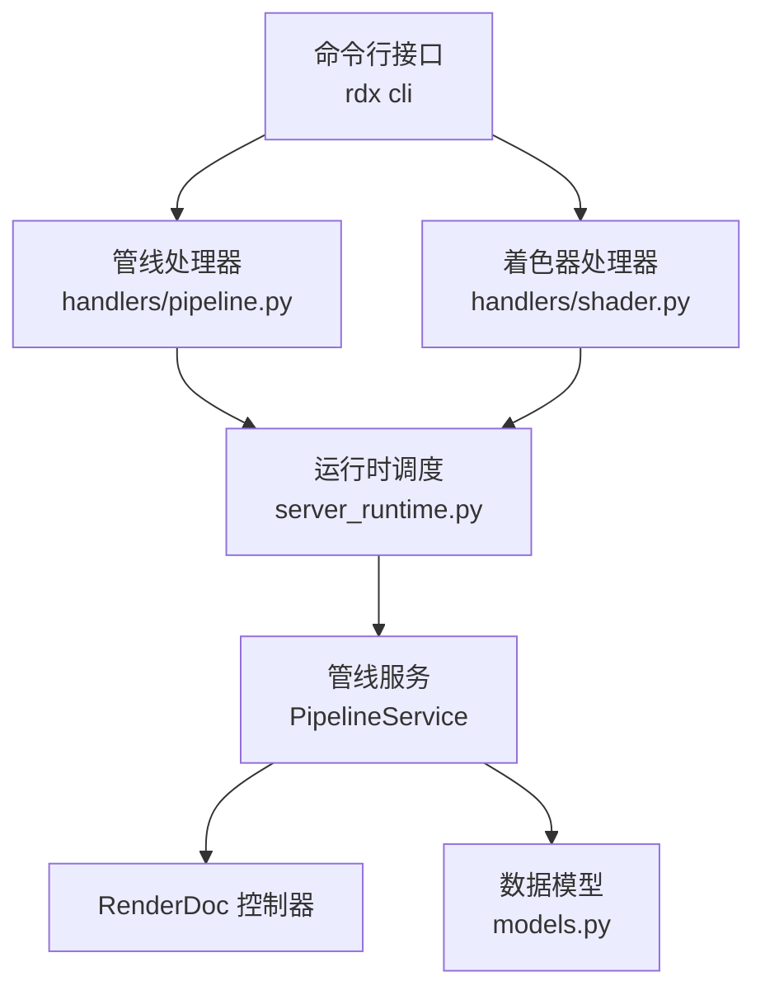
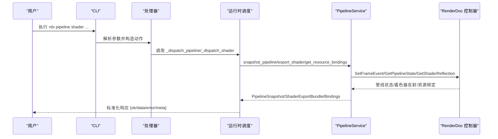
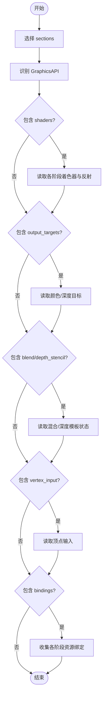
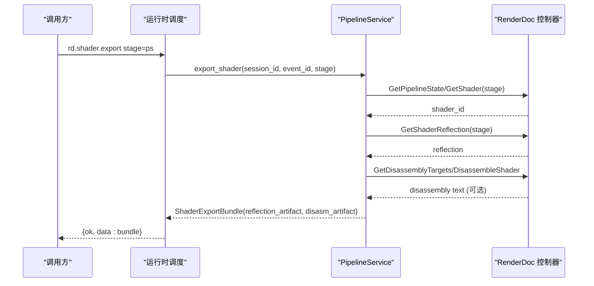
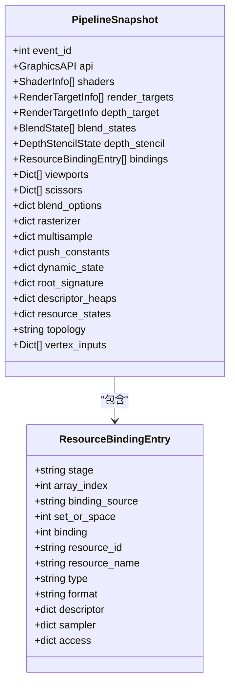
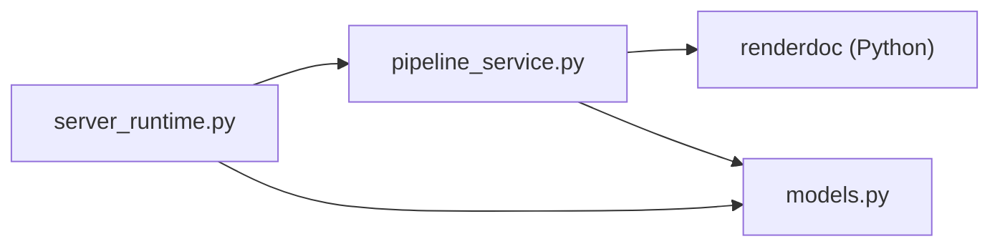

# 管线状态处理器

<cite>
**本文引用的文件**
- [pipeline_service.py](file://rdx/core/pipeline_service.py)
- [server_runtime.py](file://rdx/server_runtime.py)
- [models.py](file://rdx/models.py)
- [pipeline.py](file://rdx/handlers/pipeline.py)
- [shader.py](file://rdx/handlers/shader.py)
- [cli.py](file://rdx/cli.py)
- [test_vfs.py](file://tests/test_vfs.py)
</cite>

## 目录
1. [简介](#简介)
2. [项目结构](#项目结构)
3. [核心组件](#核心组件)
4. [架构总览](#架构总览)
5. [详细组件分析](#详细组件分析)
6. [依赖关系分析](#依赖关系分析)
7. [性能考虑](#性能考虑)
8. [故障排查指南](#故障排查指南)
9. [结论](#结论)
10. [附录](#附录)

## 简介
本文件围绕“管线状态处理器”的实现与功能展开，重点说明：
- GPU 管线状态查询机制：顶点输入阶段、光栅化阶段、片段处理阶段等状态的获取方式。
- 着色器信息获取：着色器源码/反汇编、反射信息、编译信息与依赖关系。
- 资源绑定检查：验证各阶段资源绑定的一致性与可用性。
- 提供渲染调试、着色器优化和问题排查的实际案例与流程建议。

## 项目结构
RDX 工具通过分层设计将管线状态能力封装在核心服务中，并通过运行时调度暴露为统一操作接口：
- 核心服务层：PipelineService 负责从 RenderDoc 控制器读取管线状态、着色器反射、资源绑定等。
- 运行时调度层：server_runtime._dispatch_pipeline/_dispatch_shader 将外部调用路由到具体实现。
- 数据模型层：models.py 定义 PipelineSnapshot、ShaderInfo、ResourceBindingEntry 等结构化类型。
- 入口与 CLI：handlers/pipeline.py、handlers/shader.py 转发到 server_runtime；CLI 提供命令行入口。
- 测试用例：tests/test_vfs.py 覆盖 VFS 对管线/着色器的访问路径。

图表来源
- [pipeline_service.py:590-702](file://rdx/core/pipeline_service.py#L590-L702)
- [server_runtime.py:7461-7621](file://rdx/server_runtime.py#L7461-L7621)
- [server_runtime.py:9518-9717](file://rdx/server_runtime.py#L9518-L9717)
- [models.py:224-313](file://rdx/models.py#L224-L313)

章节来源
- [pipeline_service.py:590-702](file://rdx/core/pipeline_service.py#L590-L702)
- [server_runtime.py:7461-7621](file://rdx/server_runtime.py#L7461-L7621)
- [server_runtime.py:9518-9717](file://rdx/server_runtime.py#L9518-L9717)
- [models.py:224-313](file://rdx/models.py#L224-L313)

## 核心组件
- PipelineService：提供 snapshot_pipeline、export_shader、get_resource_bindings 等方法，封装了多 API（D3D11/D3D12/Vulkan/OpenGL）的状态提取逻辑。
- server_runtime._dispatch_pipeline/_dispatch_shader：对外暴露 rd.pipeline.* 与 rd.shader.* 操作，负责参数校验、事件定位、结果包装。
- models：定义 PipelineSnapshot、ShaderInfo、ResourceBindingEntry、BlendState、DepthStencilState、RenderTargetInfo 等数据结构。
- handlers：轻量转发层，将 action 分发到 server_runtime。
- CLI：将用户命令转换为 rd.pipeline.get_state、rd.shader.source/disasm/constants 等操作。

章节来源
- [pipeline_service.py:590-874](file://rdx/core/pipeline_service.py#L590-L874)
- [server_runtime.py:7461-7621](file://rdx/server_runtime.py#L7461-L7621)
- [server_runtime.py:9518-9717](file://rdx/server_runtime.py#L9518-L9717)
- [models.py:224-313](file://rdx/models.py#L224-L313)
- [pipeline.py:1-11](file://rdx/handlers/pipeline.py#L1-L11)
- [shader.py:1-11](file://rdx/handlers/shader.py#L1-L11)
- [cli.py:971-983](file://rdx/cli.py#L971-L983)

## 架构总览
下图展示了从 CLI 到管线状态查询的完整调用链，以及关键的数据转换点。

图表来源
- [cli.py:971-983](file://rdx/cli.py#L971-L983)
- [server_runtime.py:7461-7621](file://rdx/server_runtime.py#L7461-L7621)
- [server_runtime.py:9518-9717](file://rdx/server_runtime.py#L9518-L9717)
- [pipeline_service.py:590-874](file://rdx/core/pipeline_service.py#L590-L874)

## 详细组件分析

### 管线状态快照与分段查询
- 支持按 sections 选择性获取：shaders、output_targets、topology、viewports_scissors、blend、depth_stencil、bindings、vertex_input、rasterizer、multisample、push_constants、dynamic_state、root_signature、descriptor_heaps、resource_states。
- 针对多后端 API 的差异，内部函数分别提取 blend、depth/stencil、viewport/scissor、topology 等状态，并映射为标准模型字段。
- 输出目标（颜色/深度）通过 GetOutputTargets/GetDepthTarget 获取，并尝试填充纹理格式、尺寸、sRGB 标志。

图表来源
- [pipeline_service.py:318-373](file://rdx/core/pipeline_service.py#L318-L373)
- [pipeline_service.py:590-702](file://rdx/core/pipeline_service.py#L590-L702)

章节来源
- [pipeline_service.py:318-373](file://rdx/core/pipeline_service.py#L318-L373)
- [pipeline_service.py:590-702](file://rdx/core/pipeline_service.py#L590-L702)

### 着色器信息获取与导出
- export_shader：根据阶段获取着色器 ID、反射信息、入口点、编码；生成反射 JSON 与可选反汇编文本；计算内容哈希；返回 ArtifactRef 引用。
- 反射字典包含输入/输出签名、常量块、只读/读写资源、采样器等，便于依赖关系分析与后续替换。
- 反汇编目标通过控制器查询，失败时记录日志但不中断主流程。

图表来源
- [pipeline_service.py:708-832](file://rdx/core/pipeline_service.py#L708-L832)
- [server_runtime.py:9518-9717](file://rdx/server_runtime.py#L9518-L9717)

章节来源
- [pipeline_service.py:708-832](file://rdx/core/pipeline_service.py#L708-L832)
- [server_runtime.py:9518-9717](file://rdx/server_runtime.py#L9518-L9717)

### 资源绑定检查与一致性验证
- get_resource_bindings：遍历所有或指定阶段的着色器，收集只读资源、读写资源、常量块、采样器，并去重合并。
- 绑定条目包含 set_or_space、binding、type（SRV/UAV/CBV/Sampler）、format、descriptor、access、sampler 等，便于跨阶段一致性检查。
- 对于 Vulkan/D3D12/Vulkan 等资源状态与描述符堆，可通过 sections 获取 root_signature、descriptor_heaps、resource_states 以辅助诊断。

图表来源
- [models.py:232-300](file://rdx/models.py#L232-L300)
- [pipeline_service.py:392-502](file://rdx/core/pipeline_service.py#L392-L502)
- [pipeline_service.py:838-869](file://rdx/core/pipeline_service.py#L838-L869)

章节来源
- [pipeline_service.py:392-502](file://rdx/core/pipeline_service.py#L392-L502)
- [pipeline_service.py:838-869](file://rdx/core/pipeline_service.py#L838-L869)
- [models.py:232-300](file://rdx/models.py#L232-L300)

### 顶点输入、光栅化、片段处理阶段配置获取
- 顶点输入：通过 pipe.GetVertexInputs() 获取，并在 selected 包含 vertex_input 时纳入快照。
- 光栅化：通过 _state_section("rasterizer") 与 _extract_viewport/_extract_scissor 获取视口/裁剪矩形及光栅化状态。
- 片段处理：通过 _extract_blend_state/_extract_depth_stencil 获取混合与深度模板状态；输出目标用于确定片段写入位置。

章节来源
- [pipeline_service.py:302-315](file://rdx/core/pipeline_service.py#L302-L315)
- [pipeline_service.py:193-250](file://rdx/core/pipeline_service.py#L193-L250)
- [pipeline_service.py:590-702](file://rdx/core/pipeline_service.py#L590-L702)

### 状态验证规则与最佳实践
- 空着色器检测：若阶段未绑定着色器，应返回明确错误（如 shader_not_bound），避免静默失败。
- 降级提示：当反射不可用或部分信息缺失时，设置 binding_truth_level 为 degraded，并给出推荐下一步工具。
- 资源一致性：对比同一 set/space 下的绑定索引与类型，确保 SRV/UAV/CBV/Sampler 与预期一致。
- 输出目标有效性：颜色/深度目标需存在且格式兼容，必要时进行 sRGB 标记与尺寸校验。

章节来源
- [server_runtime.py:7504-7549](file://rdx/server_runtime.py#L7504-L7549)
- [server_runtime.py:7603-7621](file://rdx/server_runtime.py#L7603-L7621)
- [pipeline_service.py:621-683](file://rdx/core/pipeline_service.py#L621-L683)

## 依赖关系分析
- PipelineService 依赖 RenderDoc Python 模块（renderdoc），通过延迟导入与异常处理保证在非回放环境下的健壮性。
- server_runtime 管理 SessionManager、ArtifactStore、PatchEngine 等，协调生命周期与上下文。
- models 作为稳定契约，被上层调度与下层服务共同使用，确保数据一致性。

图表来源
- [pipeline_service.py:34-48](file://rdx/core/pipeline_service.py#L34-L48)
- [server_runtime.py:230-238](file://rdx/server_runtime.py#L230-L238)
- [models.py:224-313](file://rdx/models.py#L224-L313)

章节来源
- [pipeline_service.py:34-48](file://rdx/core/pipeline_service.py#L34-L48)
- [server_runtime.py:230-238](file://rdx/server_runtime.py#L230-L238)
- [models.py:224-313](file://rdx/models.py#L224-L313)

## 性能考虑
- 异步与线程池：大量 RenderDoc 调用通过 asyncio.to_thread 或 _offload 在后台线程执行，避免阻塞事件循环。
- 选择性加载：sections 控制仅获取必要状态，减少不必要的数据拷贝与解析开销。
- 去重与缓存：资源绑定收集时对相同 key 的去重，避免重复条目；反射与常量缓冲可结合缓存策略降低重复读取。
- 反汇编与导出：仅在需要时触发 DisassembleShader，失败时记录日志并继续，避免影响主流程。

[本节为通用性能建议，不直接分析具体文件]

## 故障排查指南
- 着色器未绑定：当阶段无着色器时，返回 shader_not_bound 错误，附带 session/event/stage 详情，便于快速定位。
- 反射不可用：若 GetShaderReflection 失败，设置 binding_truth_level=degraded，并提示使用 rd.pipeline.get_constant_buffers 或 rd.shader.get_bindpoint_mapping 进一步诊断。
- 资源绑定不一致：通过 get_resource_bindings 过滤特定类型（SRV/UAV/CBV/Sampler），比对 set/binding/type 是否匹配预期。
- 输出目标不可用：若无法解析颜色/深度目标，返回 unavailable_reason，并检查帧缓冲区回退策略。

章节来源
- [server_runtime.py:7603-7621](file://rdx/server_runtime.py#L7603-L7621)
- [server_runtime.py:7504-7549](file://rdx/server_runtime.py#L7504-L7549)
- [pipeline_service.py:621-683](file://rdx/core/pipeline_service.py#L621-L683)

## 结论
管线状态处理器通过 PipelineService 提供了跨 API 的统一能力，涵盖着色器信息、资源绑定、管线状态快照与导出。配合 server_runtime 的调度与 models 的结构化契约，能够高效支持渲染调试、着色器优化与问题排查。实践中建议：
- 使用 sections 精确获取所需状态，减少开销。
- 关注 binding_truth_level 与 unavailable_reason，及时降级与提示。
- 利用 get_resource_bindings 与导出产物（反射 JSON、反汇编）进行依赖分析与优化。

[本节为总结性内容，不直接分析具体文件]

## 附录
- 实际案例：通过 VFS 路径 /draws/{event}/shaders/{stage} 访问管线与着色器，底层会调用 rd.pipeline.get_state 与 rd.pipeline.get_shader，若着色器未绑定则节点标记为不可用并携带错误码。
- 常用命令：rdx pipeline section --stage ps；rdx shader source/disasm/constants --stage ps；rdx export screenshot/texture/buffer/mesh。

章节来源
- [test_vfs.py:45-130](file://tests/test_vfs.py#L45-L130)
- [cli.py:971-983](file://rdx/cli.py#L971-L983)