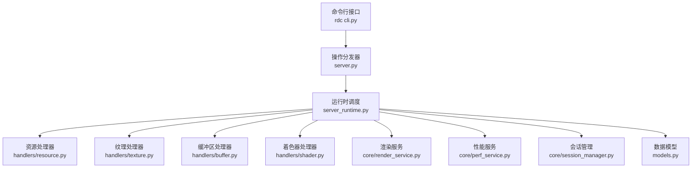
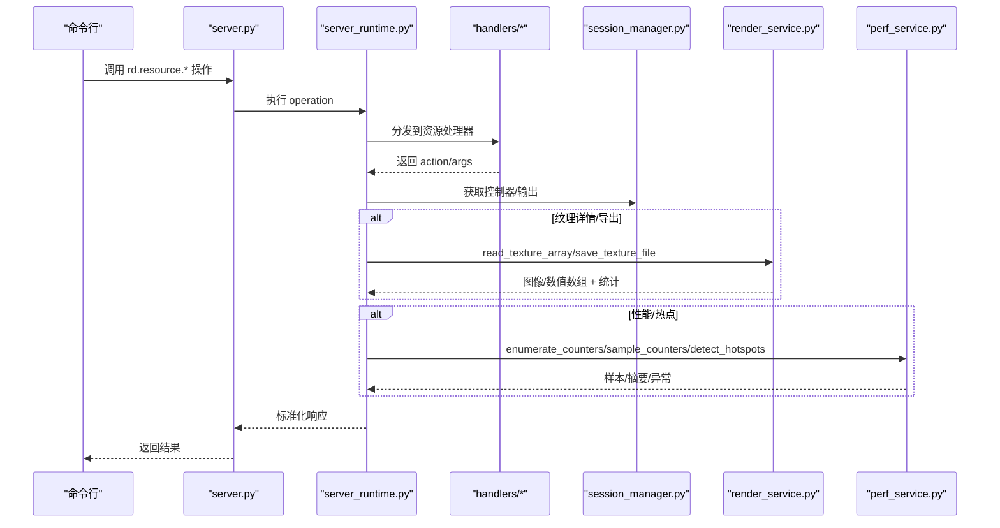
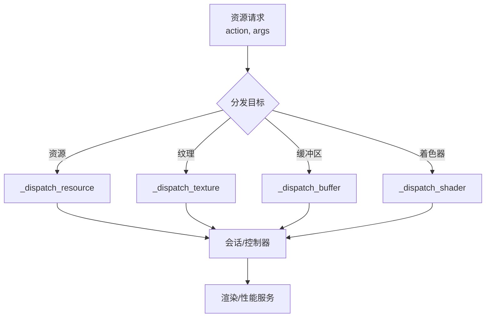
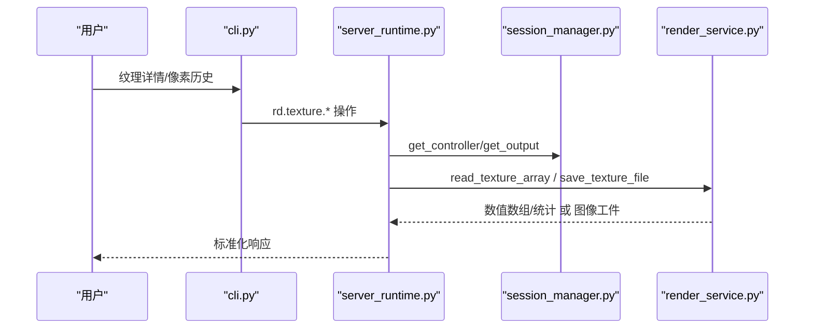
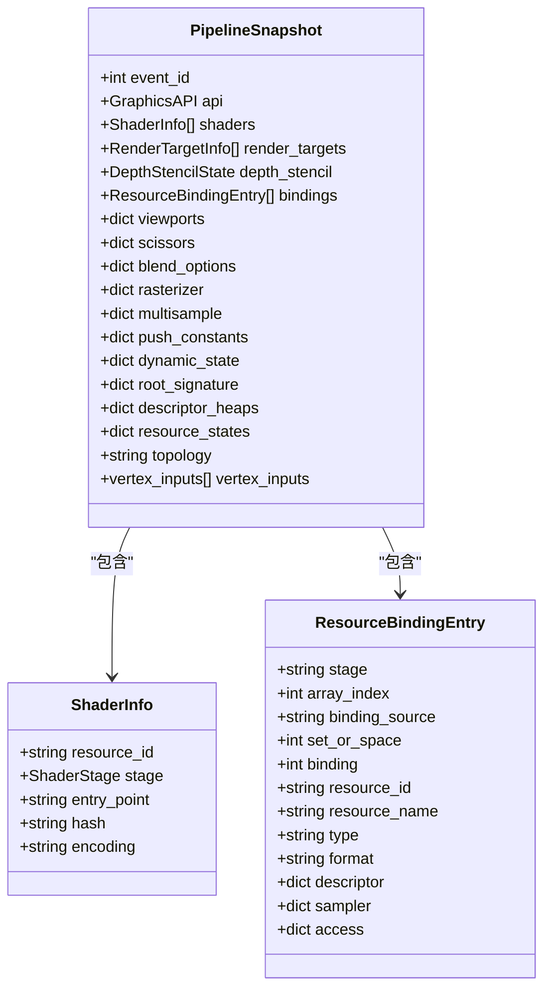
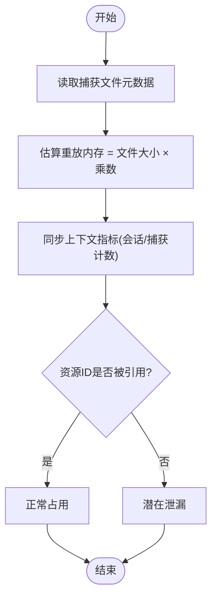
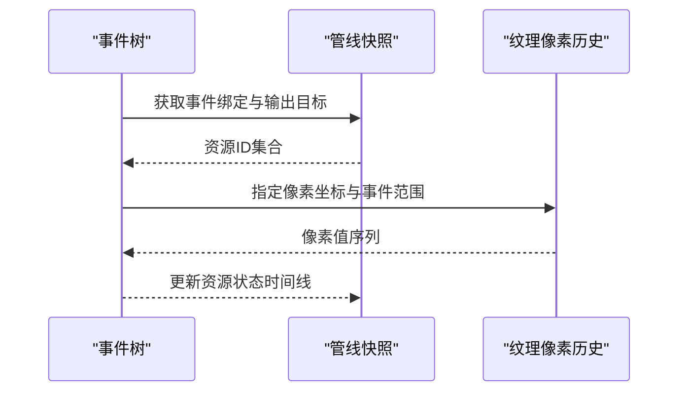
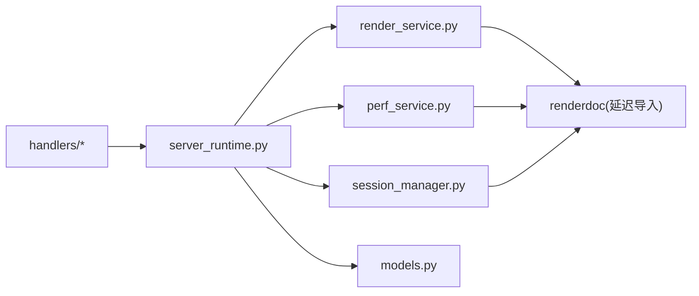

# 资源处理器

<cite>
**本文引用的文件**
- [resource.py](file://rdc_tool/handlers/resource.py)
- [texture.py](file://rdc_tool/handlers/texture.py)
- [buffer.py](file://rdc_tool/handlers/buffer.py)
- [shader.py](file://rdc_tool/handlers/shader.py)
- [server_runtime.py](file://rdc_tool/server_runtime.py)
- [models.py](file://rdc_tool/models.py)
- [render_service.py](file://rdc_tool/core/render_service.py)
- [perf_service.py](file://rdc_tool/core/perf_service.py)
- [session_manager.py](file://rdc_tool/core/session_manager.py)
- [cli.py](file://rdc_tool/cli.py)
- [server.py](file://rdc_tool/server.py)
</cite>

## 目录
1. [简介](#简介)
2. [项目结构](#项目结构)
3. [核心组件](#核心组件)
4. [架构总览](#架构总览)
5. [详细组件分析](#详细组件分析)
6. [依赖关系分析](#依赖关系分析)
7. [性能与内存管理](#性能与内存管理)
8. [故障排查指南](#故障排查指南)
9. [结论](#结论)
10. [附录：使用示例](#附录使用示例)

## 简介
本文件聚焦 RDC-Tool 中的“资源处理器”能力，围绕 GPU 资源的列表查询、详情获取、元数据访问（纹理、缓冲区、着色器）、内存使用分析与历史追踪进行系统化说明。文档从模型设计、查询优化策略到内存管理与最佳实践，提供可操作的资源分析、性能监控和问题诊断方法，帮助读者在不深入底层实现的情况下高效完成资源级问题定位。

## 项目结构
资源处理相关代码采用“薄入口 + 运行时分发 + 领域服务”的分层组织：
- 处理器入口：handlers 下的 resource/texture/buffer/shader 仅做动作转发，统一委托给 server_runtime 的专用分发函数。
- 运行时调度：server_runtime 负责上下文、会话、渲染、性能、事件图、工件存储等服务的协调。
- 领域服务：render_service 负责纹理读回、导出与像素统计；perf_service 负责 GPU 计数器采样与热点检测；session_manager 负责回放会话生命周期与控制器访问。
- 数据模型：models.py 定义响应封装、管线快照、着色器信息、性能结果等结构化类型。
- CLI 与服务器：cli.py 暴露资源相关命令并映射到 rd.resource.* 操作；server.py 提供统一的 operation 执行入口。

**图示来源**
- [server.py:62-142](file://rdc_tool/server.py#L62-L142)
- [server_runtime.py:1-120](file://rdc_tool/server_runtime.py#L1-L120)
- [resource.py:8-9](file://rdc_tool/handlers/resource.py#L8-L9)
- [texture.py:8-9](file://rdc_tool/handlers/texture.py#L8-L9)
- [buffer.py:8-9](file://rdc_tool/handlers/buffer.py#L8-L9)
- [shader.py:8-9](file://rdc_tool/handlers/shader.py#L8-L9)

**章节来源**
- [server.py:62-142](file://rdc_tool/server.py#L62-L142)
- [server_runtime.py:1-120](file://rdc_tool/server_runtime.py#L1-L120)
- [resource.py:8-9](file://rdc_tool/handlers/resource.py#L8-L9)
- [texture.py:8-9](file://rdc_tool/handlers/texture.py#L8-L9)
- [buffer.py:8-9](file://rdc_tool/handlers/buffer.py#L8-L9)
- [shader.py:8-9](file://rdc_tool/handlers/shader.py#L8-L9)

## 核心组件
- 资源处理器入口：将 action 与参数转交给 server_runtime 的资源分发函数，保持处理器极简、无状态。
- 运行时调度：维护上下文、会话、预览、工件存储、配置与限制，协调各服务完成资源查询、导出与分析。
- 渲染服务：对纹理进行 readback、编码、导出与像素统计，支持子资源选择与区域裁剪。
- 性能服务：枚举/采样 GPU 计数器，计算 per-counter 摘要与异常事件，识别热点事件。
- 会话管理：创建/打开/关闭回放会话，提供控制器与输出对象，封装本地/远程差异。
- 数据模型：统一响应信封、管线快照、着色器信息、性能结果等，保证跨模块一致的数据契约。

**章节来源**
- [resource.py:8-9](file://rdc_tool/handlers/resource.py#L8-L9)
- [server_runtime.py:196-239](file://rdc_tool/server_runtime.py#L196-L239)
- [render_service.py:346-521](file://rdc_tool/core/render_service.py#L346-L521)
- [perf_service.py:212-487](file://rdc_tool/core/perf_service.py#L212-L487)
- [session_manager.py:148-293](file://rdc_tool/core/session_manager.py#L148-L293)
- [models.py:117-122](file://rdc_tool/models.py#L117-L122)

## 架构总览
资源处理的核心调用链如下：
- CLI 通过 facade 将资源命令映射为 rd.resource.list_all / rd.resource.get_details / rd.resource.get_usage 等操作。
- server.py 统一执行 operation，设置上下文与进度上报，调用 CoreEngine 执行具体工具。
- server_runtime 根据工具名路由到对应分发函数（如 _dispatch_resource），再组合 session_manager、render_service、perf_service 完成资源查询、导出与分析。
- 渲染服务通过 RenderDoc 控制器读取纹理数据、生成图像或数值数组，并通过 artifact_store 持久化工件。
- 性能服务通过控制器枚举/采样 GPU 计数器，产出样本、摘要与异常事件。

**图示来源**
- [cli.py:1012-1020](file://rdc_tool/cli.py#L1012-L1020)
- [server.py:62-142](file://rdc_tool/server.py#L62-L142)
- [server_runtime.py:196-239](file://rdc_tool/server_runtime.py#L196-L239)
- [render_service.py:658-794](file://rdc_tool/core/render_service.py#L658-L794)
- [perf_service.py:235-487](file://rdc_tool/core/perf_service.py#L235-L487)

## 详细组件分析

### 资源处理器与分发机制
- 处理器职责单一：resource/texture/buffer/shader 仅转发 action 与 args 至 server_runtime 的专用分发函数，避免重复逻辑。
- 分发与上下文：server_runtime 在上下文中注入 context_id、trace_id、progress reporter，确保操作可追踪、可观测。
- 会话绑定：资源操作通常依赖当前会话的控制器与输出，由 session_manager 提供。

**图示来源**
- [resource.py:8-9](file://rdc_tool/handlers/resource.py#L8-L9)
- [texture.py:8-9](file://rdc_tool/handlers/texture.py#L8-L9)
- [buffer.py:8-9](file://rdc_tool/handlers/buffer.py#L8-L9)
- [shader.py:8-9](file://rdc_tool/handlers/shader.py#L8-L9)
- [server_runtime.py:196-239](file://rdc_tool/server_runtime.py#L196-L239)

**章节来源**
- [resource.py:8-9](file://rdc_tool/handlers/resource.py#L8-L9)
- [texture.py:8-9](file://rdc_tool/handlers/texture.py#L8-L9)
- [buffer.py:8-9](file://rdc_tool/handlers/buffer.py#L8-L9)
- [shader.py:8-9](file://rdc_tool/handlers/shader.py#L8-L9)
- [server_runtime.py:196-239](file://rdc_tool/server_runtime.py#L196-L239)

### 纹理资源：列表、详情与像素历史
- 列表与详情：通过 rd.resource.list_all 与 rd.resource.get_details 获取资源清单与元数据；纹理详情包含尺寸、格式、子资源信息等。
- 像素值与历史：rd.texture.get_pixel_value 与 rd.texture.get_pixel_history 基于渲染服务的 read_texture_array 与像素统计，支持 mip/slice/sample 与 region 裁剪。
- 导出与可视化：save_texture_file 支持多种格式导出；render_event 可将帧事件渲染为图像工件。

**图示来源**
- [cli.py:999-1010](file://rdc_tool/cli.py#L999-L1010)
- [render_service.py:658-794](file://rdc_tool/core/render_service.py#L658-L794)
- [session_manager.py:260-273](file://rdc_tool/core/session_manager.py#L260-L273)

**章节来源**
- [cli.py:999-1010](file://rdc_tool/cli.py#L999-L1010)
- [render_service.py:658-794](file://rdc_tool/core/render_service.py#L658-L794)
- [session_manager.py:260-273](file://rdc_tool/core/session_manager.py#L260-L273)

### 缓冲区与着色器资源：元数据与常量
- 缓冲区：可通过 rd.export.buffer 导出缓冲内容；资源详情中通常包含大小、布局、用途等元数据。
- 着色器：rd.shader.source/disasm/constants 获取源码、反汇编与常量缓冲区内容；PipelineSnapshot 记录着色器阶段、入口点、编码等信息。
- 绑定关系：ResourceBindingEntry 描述 stage、set/space、binding、资源类型与格式，便于关联资源与管线状态。

**图示来源**
- [models.py:224-230](file://rdc_tool/models.py#L224-L230)
- [models.py:232-245](file://rdc_tool/models.py#L232-L245)
- [models.py:280-301](file://rdc_tool/models.py#L280-L301)

**章节来源**
- [models.py:224-301](file://rdc_tool/models.py#L224-L301)
- [cli.py:971-995](file://rdc_tool/cli.py#L971-L995)

### 内存使用分析：估算、统计与泄漏检测
- 文件大小与重放内存估算：_capture_file_metadata 获取捕获文件大小与指纹；_estimated_replay_memory_bytes 按乘数估算重放内存占用。
- 上下文指标：_sync_context_metrics 统计活跃会话/捕获数量，辅助内存与资源占用概览。
- 泄漏检测思路：结合资源列表与使用计数，对比创建/销毁路径；若资源 ID 长期存在且无引用，标记潜在泄漏；配合性能服务热点事件定位写入频繁的资源。

**图示来源**
- [server_runtime.py:624-645](file://rdc_tool/server_runtime.py#L624-L645)
- [server_runtime.py:647-654](file://rdc_tool/server_runtime.py#L647-L654)

**章节来源**
- [server_runtime.py:624-645](file://rdc_tool/server_runtime.py#L624-L645)
- [server_runtime.py:647-654](file://rdc_tool/server_runtime.py#L647-L654)

### 资源历史追踪：生命周期与状态变化
- 事件树与输出目标：EventNode 包含 output_targets（资源ID字符串），用于关联事件与资源；可用于构建资源使用历史。
- 管线快照：PipelineSnapshot 记录特定事件的管线状态与资源绑定，作为时间点快照。
- 像素历史：纹理像素历史通过渲染服务与事件导航，记录像素值随时间的变化，辅助定位写入源。

**图示来源**
- [models.py:173-181](file://rdc_tool/models.py#L173-L181)
- [models.py:280-301](file://rdc_tool/models.py#L280-L301)
- [render_service.py:658-794](file://rdc_tool/core/render_service.py#L658-L794)

**章节来源**
- [models.py:173-181](file://rdc_tool/models.py#L173-L181)
- [models.py:280-301](file://rdc_tool/models.py#L280-L301)
- [render_service.py:658-794](file://rdc_tool/core/render_service.py#L658-L794)

## 依赖关系分析
- 处理器与服务解耦：handlers 仅转发，server_runtime 聚合服务；render_service/perf_service/session_manager 通过协议或接口被调用，降低耦合。
- 外部依赖延迟加载：renderdoc 模块在需要时导入，避免启动失败；错误路径提供清晰提示。
- 数据契约稳定：models.py 定义的结构化类型贯穿响应、管线快照与性能结果，保证跨模块一致性。

**图示来源**
- [render_service.py:39-56](file://rdc_tool/core/render_service.py#L39-L56)
- [perf_service.py:73-96](file://rdc_tool/core/perf_service.py#L73-L96)
- [session_manager.py:27-30](file://rdc_tool/core/session_manager.py#L27-L30)

**章节来源**
- [render_service.py:39-56](file://rdc_tool/core/render_service.py#L39-L56)
- [perf_service.py:73-96](file://rdc_tool/core/perf_service.py#L73-L96)
- [session_manager.py:27-30](file://rdc_tool/core/session_manager.py#L27-L30)

## 性能与内存管理
- 异步与线程池：所有阻塞的 RenderDoc 调用通过 asyncio.to_thread 或 run_in_executor 分派，避免阻塞事件循环。
- 计数器采样与热点：perf_service 枚举/采样 GPU 计数器，计算 p95、标准差与异常事件，识别 top-K 最慢事件。
- 内存估算与限制：_estimated_replay_memory_bytes 使用可配置的乘数估算重放内存；runtime_limits 提供上下文/会话/捕获上限。
- 工件存储：图像与数值数组通过 artifact_store 持久化，减少内存驻留；默认内存或 stdout，仅在显式请求时写盘。

**章节来源**
- [render_service.py:357-521](file://rdc_tool/core/render_service.py#L357-L521)
- [perf_service.py:235-487](file://rdc_tool/core/perf_service.py#L235-L487)
- [server_runtime.py:397-410](file://rdc_tool/server_runtime.py#L397-L410)
- [AGENTS.md:40-47](file://AGENTS.md#L40-L47)

## 故障排查指南
- 渲染导出失败：检查 SaveTexture 状态码与后端类型，确认 texture_id、subresource 与文件格式；参考错误分类与修复建议。
- 计数器不可用：确认 renderdoc 模块可用；若 EnumerateCounters/FetchCounters 失败，检查驱动/队列配置与平台支持。
- 会话状态缺失：get_controller/get_output 抛出 SessionError 时，检查会话是否已正确创建与打开捕获。
- 像素历史为空：确保事件已导航到目标帧，纹理尺寸与 subresource 有效；region 必须在子资源范围内。

**章节来源**
- [render_service.py:523-646](file://rdc_tool/core/render_service.py#L523-L646)
- [perf_service.py:235-487](file://rdc_tool/core/perf_service.py#L235-L487)
- [session_manager.py:260-273](file://rdc_tool/core/session_manager.py#L260-L273)

## 结论
资源处理器以简洁的转发模式接入运行时调度，结合渲染与性能服务实现对 GPU 资源的全面分析。通过模型化的数据契约、异步线程池与工件存储，系统在查询效率、内存占用与可观测性之间取得平衡。借助资源列表、详情、像素历史与计数器采样，开发者可快速定位资源相关问题，优化内存使用并提升性能。

## 附录：使用示例
- 资源列表与详情
  - 列出资源：rdc-tool resource list --format tsv
  - 查看资源详情：rdc-tool resource show --resource-id <id> --format json
- 纹理像素调试
  - 读取像素值：rdc-tool pixel value --event-id 42 --resource-id <tex-id> --x 320 --y 180 --format json
  - 查看像素历史：rdc-tool pixel history --event-id 42 --resource-id <tex-id> --x 320 --y 180 --format json
- 导出与可视化
  - 导出纹理：rdc-tool export texture --resource-id <id> --out out.png
  - 导出缓冲：rdc-tool export buffer --resource-id <id> --out out.raw
- 性能与热点
  - 枚举计数器：rdc perf counters --format json
  - 采样计数器：rdc perf sample --event-range 1,1000 --counter-ids <ids> --format json
  - 检测热点：rdc perf hotspots --top-k 10 --format json

**章节来源**
- [cli.py:1012-1020](file://rdc_tool/cli.py#L1012-L1020)
- [cli.py:971-995](file://rdc_tool/cli.py#L971-L995)
- [perf_service.py:235-487](file://rdc_tool/core/perf_service.py#L235-L487)