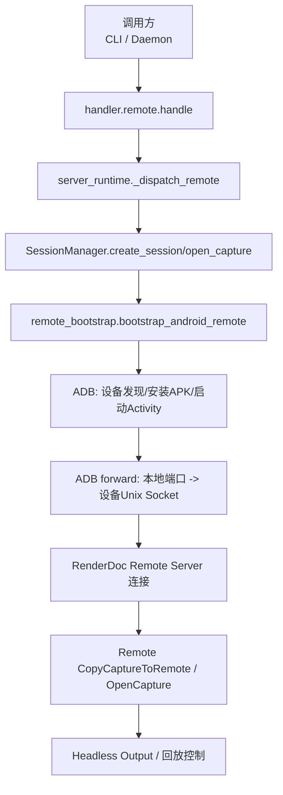
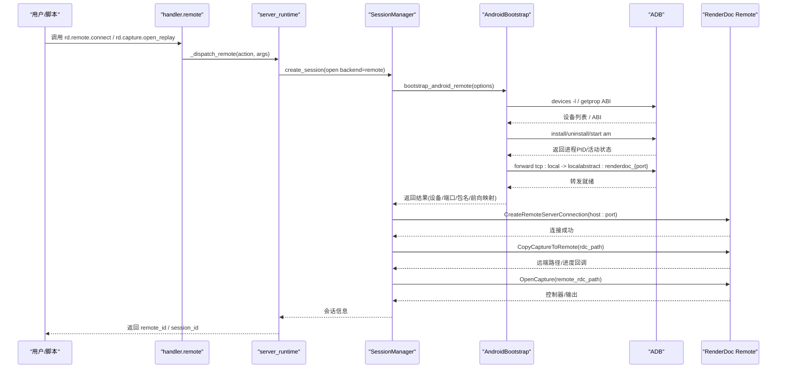
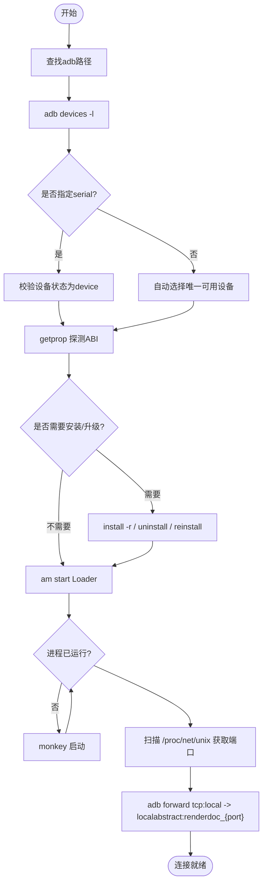
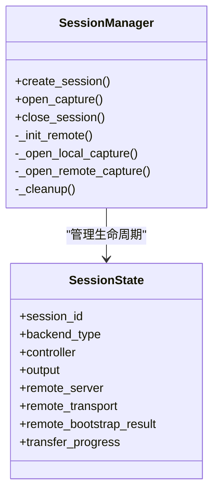
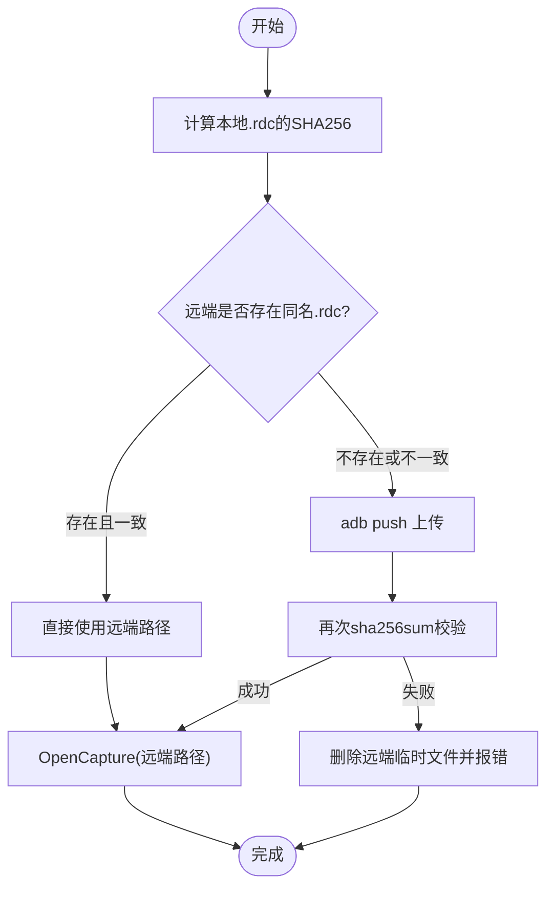
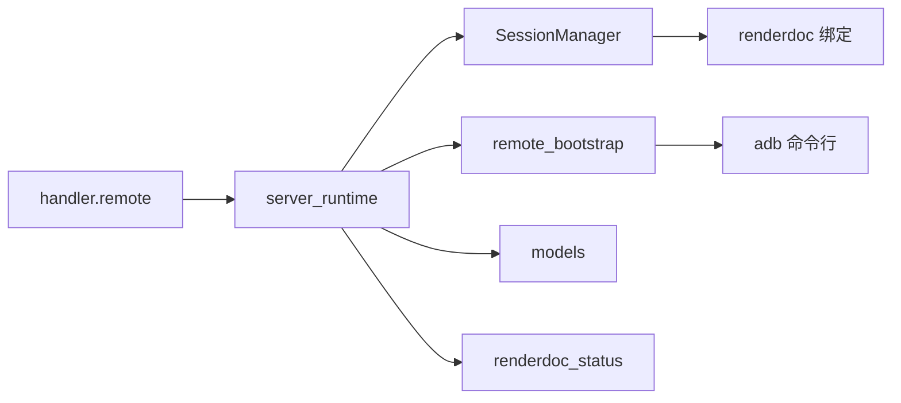

# 远程处理器

<cite>
**本文引用的文件**
- [remote.py](file://rdx/handlers/remote.py)
- [remote_bootstrap.py](file://rdx/remote_bootstrap.py)
- [capture.py](file://rdx/handlers/capture.py)
- [session_manager.py](file://rdx/core/session_manager.py)
- [server_runtime.py](file://rdx/server_runtime.py)
- [models.py](file://rdx/models.py)
- [renderdoc_status.py](file://rdx/core/renderdoc_status.py)
- [android-remote-cli-smoke-prompt.md](file://docs/android-remote-cli-smoke-prompt.md)
</cite>

## 目录
1. [简介](#简介)
2. [项目结构](#项目结构)
3. [核心组件](#核心组件)
4. [架构总览](#架构总览)
5. [详细组件分析](#详细组件分析)
6. [依赖关系分析](#依赖关系分析)
7. [性能与网络优化](#性能与网络优化)
8. [安全考虑](#安全考虑)
9. [故障排查指南](#故障排查指南)
10. [结论](#结论)
11. [附录：示例工作流](#附录示例工作流)

## 简介
本文件系统性介绍 RDC-Tool 的“远程处理器”实现，重点覆盖：
- Android 设备连接机制：设备发现、连接建立、通信协议（ADB + RenderDoc 远程服务）。
- 远程捕获控制：启动、停止与管理远程设备的捕获会话。
- 数据传输机制：捕获文件的上传/下载、进度监控与错误重试策略。
- 网络通信优化、安全性与跨平台兼容性处理。
- 具体示例：远程调试、设备管理与分布式分析工作流的搭建。

## 项目结构
围绕远程能力的关键代码分布在以下模块：
- 远端入口与分发：handlers/remote.py、handlers/capture.py
- Android 引导与连接：remote_bootstrap.py
- 会话与回放管理：core/session_manager.py
- 运行时服务与工具注册：server_runtime.py
- 数据模型与枚举：models.py
- RenderDoc 状态封装：core/renderdoc_status.py
- Android 远程 CLI 冒烟流程说明：docs/android-remote-cli-smoke-prompt.md

图表来源
- [remote.py:8-9](file://rdx/handlers/remote.py#L8-L9)
- [server_runtime.py:137-162](file://rdx/server_runtime.py#L137-L162)
- [session_manager.py:175-206](file://rdx/core/session_manager.py#L175-L206)
- [remote_bootstrap.py:495-698](file://rdx/remote_bootstrap.py#L495-L698)

章节来源
- [remote.py:1-11](file://rdx/handlers/remote.py#L1-L11)
- [capture.py:1-11](file://rdx/handlers/capture.py#L1-L11)
- [remote_bootstrap.py:1-785](file://rdx/remote_bootstrap.py#L1-L785)
- [session_manager.py:1-569](file://rdx/core/session_manager.py#L1-L569)
- [server_runtime.py:1-800](file://rdx/server_runtime.py#L1-L800)
- [models.py:1-584](file://rdx/models.py#L1-L584)
- [renderdoc_status.py:1-105](file://rdx/core/renderdoc_status.py#L1-L105)
- [android-remote-cli-smoke-prompt.md:1-49](file://docs/android-remote-cli-smoke-prompt.md#L1-L49)

## 核心组件
- 远端处理器入口：将 action 转发到 server_runtime 的远程分发器。
- Android 引导器：负责 adb 路径解析、设备发现、ABI 探测、APK 安装/升级、Activity 启动、Unix Socket 探测、ADB forward 建立。
- 会话管理器：统一创建本地/远程会话、打开捕获、复制捕获到远端、打开远端回放、清理资源。
- 运行时服务：维护远程句柄、上下文、配置、进度上报、工具注册与调度。
- 数据模型：后端类型、图形 API、会话能力等结构化定义。
- RenderDoc 状态封装：统一判断成功/失败并生成可诊断的错误详情。

章节来源
- [remote.py:8-9](file://rdx/handlers/remote.py#L8-L9)
- [remote_bootstrap.py:133-167](file://rdx/remote_bootstrap.py#L133-L167)
- [remote_bootstrap.py:294-339](file://rdx/remote_bootstrap.py#L294-L339)
- [remote_bootstrap.py:495-698](file://rdx/remote_bootstrap.py#L495-L698)
- [session_manager.py:175-206](file://rdx/core/session_manager.py#L175-L206)
- [session_manager.py:373-440](file://rdx/core/session_manager.py#L373-L440)
- [models.py:28-39](file://rdx/models.py#L28-L39)
- [renderdoc_status.py:10-34](file://rdx/core/renderdoc_status.py#L10-L34)

## 架构总览
远程处理器通过“处理器->运行时->会话->Android引导->ADB/RenderDoc”的分层协作完成端到端能力。

图表来源
- [remote.py:8-9](file://rdx/handlers/remote.py#L8-L9)
- [server_runtime.py:137-162](file://rdx/server_runtime.py#L137-L162)
- [session_manager.py:175-206](file://rdx/core/session_manager.py#L175-L206)
- [session_manager.py:373-440](file://rdx/core/session_manager.py#L373-L440)
- [remote_bootstrap.py:495-698](file://rdx/remote_bootstrap.py#L495-L698)

## 详细组件分析

### Android 设备连接机制
- 设备发现：通过 adb devices -l 解析设备序列号与状态；支持多设备时要求显式指定 device_serial。
- ABI 探测：依次查询 ro.product.cpu.abilist64 / ro.product.cpu.abilist / ro.product.cpu.abi，选择 arm64 或 arm32 对应 APK。
- APK 安装/升级：优先尝试带 -r 的安装；若签名不匹配或版本冲突，则卸载后重装；记录安装模式与原因。
- Activity 启动：使用 am start 启动 Loader 活动，参数注入 renderdoccmd remoteserver；若失败则回退 monkey 启动。
- Unix Socket 探测：读取 /proc/net/unix，匹配 @renderdoc_{port} 正则，确定远程服务监听端口。
- ADB Forward：将本地 TCP 端口转发到设备上的 localabstract:renderdoc_{port}，形成本地可达的渲染回放通道。
- 超时与取消：ConnectionBudget 提供统一截止时间与取消信号，所有子步骤均受其约束。

图表来源
- [remote_bootstrap.py:133-167](file://rdx/remote_bootstrap.py#L133-L167)
- [remote_bootstrap.py:294-339](file://rdx/remote_bootstrap.py#L294-L339)
- [remote_bootstrap.py:341-372](file://rdx/remote_bootstrap.py#L341-L372)
- [remote_bootstrap.py:401-423](file://rdx/remote_bootstrap.py#L401-L423)
- [remote_bootstrap.py:425-449](file://rdx/remote_bootstrap.py#L425-L449)
- [remote_bootstrap.py:451-492](file://rdx/remote_bootstrap.py#L451-L492)
- [remote_bootstrap.py:599-698](file://rdx/remote_bootstrap.py#L599-L698)

章节来源
- [remote_bootstrap.py:133-167](file://rdx/remote_bootstrap.py#L133-L167)
- [remote_bootstrap.py:294-339](file://rdx/remote_bootstrap.py#L294-L339)
- [remote_bootstrap.py:401-423](file://rdx/remote_bootstrap.py#L401-L423)
- [remote_bootstrap.py:451-492](file://rdx/remote_bootstrap.py#L451-L492)
- [remote_bootstrap.py:599-698](file://rdx/remote_bootstrap.py#L599-L698)

### 远程捕获控制功能
- 会话创建：根据后端类型区分本地/远程；远程会话会记录 remote_host/port、transport、bootstrap 信息等。
- 打开捕获：
  - 本地：直接打开 .rdc 文件并创建 headless 输出。
  - 远程：先复制捕获到远端（或直接使用远端路径），再打开回放。
- 关闭会话：按顺序关闭输出、控制器、捕获文件、远端连接；必要时关闭本地回放子系统。

图表来源
- [session_manager.py:118-140](file://rdx/core/session_manager.py#L118-L140)
- [session_manager.py:175-206](file://rdx/core/session_manager.py#L175-L206)
- [session_manager.py:208-251](file://rdx/core/session_manager.py#L208-L251)
- [session_manager.py:309-345](file://rdx/core/session_manager.py#L309-L345)
- [session_manager.py:347-382](file://rdx/core/session_manager.py#L347-L382)
- [session_manager.py:517-569](file://rdx/core/session_manager.py#L517-L569)

章节来源
- [session_manager.py:175-206](file://rdx/core/session_manager.py#L175-L206)
- [session_manager.py:208-251](file://rdx/core/session_manager.py#L208-L251)
- [session_manager.py:309-345](file://rdx/core/session_manager.py#L309-L345)
- [session_manager.py:347-382](file://rdx/core/session_manager.py#L347-L382)
- [session_manager.py:517-569](file://rdx/core/session_manager.py#L517-L569)

### 数据传输机制（上传/下载、进度、重试）
- 上传到远端：
  - 非 ADB Android 传输：调用远端服务的 CopyCaptureToRemote，并通过回调报告进度 fraction。
  - ADB Android 传输：计算本地文件 SHA256，以哈希命名远端文件；若存在且一致则复用；否则 push 并再次校验；失败时清理已创建的远端文件。
- 下载/导出：由上层工具通过回放输出或导出接口获取图像/事件数据；此处聚焦捕获文件传输。
- 进度监控：通过 transfer_progress 回调上报 capture_transfer_started / capture_transfer_progress / capture_transfer_done。
- 错误重试：
  - ADB push 失败会触发清理并抛出异常，调用方可据此重试。
  - 远端 CopyCaptureToRemote 失败会构造包含 copy_error 的结构化错误，便于上层识别与重试。

图表来源
- [session_manager.py:384-440](file://rdx/core/session_manager.py#L384-L440)
- [session_manager.py:442-507](file://rdx/core/session_manager.py#L442-L507)

章节来源
- [session_manager.py:384-440](file://rdx/core/session_manager.py#L384-L440)
- [session_manager.py:442-507](file://rdx/core/session_manager.py#L442-L507)

### 网络通信优化
- 连接预算与超时：ConnectionBudget 限制整个连接过程的耗时，避免长时间阻塞。
- 端口复用与冲突规避：优先使用请求端口，否则从新出现的 socket 列表中推断；避免重复绑定。
- 进程/服务借用：若检测到已有 RenderDocCmd 进程，则复用而非重复安装/启动，减少开销。
- 头窗口无头输出：创建固定分辨率的 headless 输出，避免 GUI 依赖，提升稳定性。
- 批量操作与最小化往返：在 ADB 操作中合并必要的 shell 命令，减少多次交互。

章节来源
- [remote_bootstrap.py:37-58](file://rdx/remote_bootstrap.py#L37-L58)
- [remote_bootstrap.py:476-492](file://rdx/remote_bootstrap.py#L476-L492)
- [remote_bootstrap.py:521-543](file://rdx/remote_bootstrap.py#L521-L543)
- [session_manager.py:509-515](file://rdx/core/session_manager.py#L509-L515)

### 安全考虑
- 仅本地转发：ADB forward 将本地端口映射到设备 Unix Socket，默认仅在本地环回地址暴露，降低外部访问风险。
- 权限与签名：安装 APK 时使用 -g 授予必要权限；遇到签名不匹配时强制卸载后重装，避免混用不同签名应用。
- 输入校验：对 host/port/device_serial/ABI 等进行严格校验与规范化，防止非法输入导致意外行为。
- 错误信息脱敏：错误详情中不包含敏感路径或密钥，仅保留诊断所需的最小信息。

章节来源
- [remote_bootstrap.py:217-230](file://rdx/remote_bootstrap.py#L217-L230)
- [remote_bootstrap.py:529-543](file://rdx/remote_bootstrap.py#L529-L543)
- [remote_bootstrap.py:686-698](file://rdx/remote_bootstrap.py#L686-L698)

### 跨平台兼容性处理
- ADB 路径解析：支持环境变量 RDX_ANDROID_ADB_PATH、ADB、ANDROID_SDK_ROOT、ANDROID_HOME、Windows LOCALAPPDATA 等多种来源。
- ABI 兼容：同时支持 arm32/arm64，并在缺失或未支持时报错提示。
- 文本编码：subprocess 输出使用 utf-8 解码，errors="replace" 避免不可编码字符中断流程。
- 时间与时区：使用 monotonic 时间进行超时控制，避免系统时钟变化影响。

章节来源
- [remote_bootstrap.py:133-167](file://rdx/remote_bootstrap.py#L133-L167)
- [remote_bootstrap.py:341-372](file://rdx/remote_bootstrap.py#L341-L372)
- [remote_bootstrap.py:169-202](file://rdx/remote_bootstrap.py#L169-L202)

## 依赖关系分析
- handler.remote 依赖 server_runtime 的远程分发。
- server_runtime 依赖 SessionManager、remote_bootstrap、models、renderdoc_status。
- SessionManager 依赖 RenderDoc Python 绑定（renderdoc 模块）与 ADB 子进程。
- remote_bootstrap 依赖 ADB 命令行工具与 Android 系统属性。

图表来源
- [remote.py:8-9](file://rdx/handlers/remote.py#L8-L9)
- [server_runtime.py:73-82](file://rdx/server_runtime.py#L73-L82)
- [session_manager.py:27-30](file://rdx/core/session_manager.py#L27-L30)
- [remote_bootstrap.py:17-26](file://rdx/remote_bootstrap.py#L17-L26)

章节来源
- [remote.py:8-9](file://rdx/handlers/remote.py#L8-L9)
- [server_runtime.py:73-82](file://rdx/server_runtime.py#L73-L82)
- [session_manager.py:27-30](file://rdx/core/session_manager.py#L27-L30)
- [remote_bootstrap.py:17-26](file://rdx/remote_bootstrap.py#L17-L26)

## 性能与网络优化
- 连接预算：统一超时与取消，避免长尾任务拖垮整体流程。
- 复用现有服务：检测并借用已运行的 RenderDocCmd，减少安装/启动成本。
- 捕获缓存：基于 SHA256 的远端缓存，避免重复上传相同文件。
- 无头输出：固定分辨率的 headless 输出，减少 GUI 开销。
- 最小化 ADB 调用：合并必要的 shell 命令，减少往返次数。

[本节为通用指导，不直接分析具体文件]

## 安全考虑
- 本地转发：仅通过 localhost 暴露本地端口，降低暴露面。
- 权限与签名：安装时授予必要权限，处理签名冲突以避免安全风险。
- 输入校验：严格校验 host/port/device_serial/ABI，防止注入或越权。
- 错误信息：仅输出必要诊断信息，避免泄露敏感数据。

[本节为通用指导，不直接分析具体文件]

## 故障排查指南
- 常见错误分类：
  - ADB 不可用：检查环境变量与 platform-tools 安装。
  - 设备未就绪：确认设备状态为 device，或指定正确的 serial。
  - ABI 不支持：确认设备 ABI 为 arm32/arm64。
  - APK 安装失败：查看签名冲突或版本降级错误，必要时卸载后重装。
  - 活动启动失败：检查 activity 名称与参数，或使用 monkey 回退。
  - Socket 未找到：等待一段时间并重试，或检查是否有其他实例占用。
  - 捕获复制失败：检查网络连通性、远端路径权限与磁盘空间。
- 诊断要点：
  - 使用 ConnectionBudget 记录的剩余时间与取消状态定位超时点。
  - 查看 cleanup_actions 了解已执行的操作，辅助定位失败阶段。
  - 利用 renderdoc_status 中的 result_code/status_text 快速定位底层错误。

章节来源
- [remote_bootstrap.py:29-35](file://rdx/remote_bootstrap.py#L29-L35)
- [remote_bootstrap.py:169-202](file://rdx/remote_bootstrap.py#L169-L202)
- [remote_bootstrap.py:217-285](file://rdx/remote_bootstrap.py#L217-L285)
- [remote_bootstrap.py:599-698](file://rdx/remote_bootstrap.py#L599-L698)
- [renderdoc_status.py:57-105](file://rdx/core/renderdoc_status.py#L57-L105)

## 结论
远程处理器通过清晰的层次化设计，将 Android 设备发现、连接建立、会话管理与数据传输解耦，结合严格的超时与错误处理，提供了稳定可靠的远程调试与分析能力。借助 ADB forward 与 RenderDoc 远程服务，可在本地无缝操控远端设备并进行捕获回放。通过捕获缓存、无头输出与连接预算等手段，系统在性能与可靠性之间取得平衡。

[本节为总结性内容，不直接分析具体文件]

## 附录：示例工作流
- Android 远程冒烟流程（CLI）：
  - 初始化与连接：rdx --json doctor；rdx call rd.remote.connect --args-file ...；rdx call rd.remote.ping --args-file ...
  - 打开捕获与回放：rdx call rd.capture.open_file ...；rdx call rd.capture.open_replay ...
  - 上下文查询：rdx call rd.session.get_context
- 注意事项：
  - 对于 adb_android 传输，options.transport 应设置为 "adb_android"，可选 device_serial/local_port/install_apk/push_config。
  - 保持 remote_id 明确，避免远端回放回落到本地。
  - 观察远程显示能力边界：当前客户端无法确认 Android 屏幕呈现，需记录为 unsupported。

章节来源
- [android-remote-cli-smoke-prompt.md:5-24](file://docs/android-remote-cli-smoke-prompt.md#L5-L24)
- [operation_definitions.py:1962-1975](file://rdx/operation_definitions.py#L1962-L1975)
- [operation_definitions.py:2169-2189](file://rdx/operation_definitions.py#L2169-L2189)