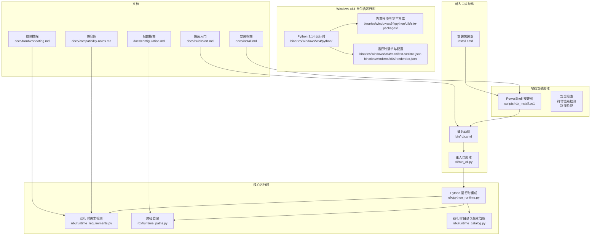
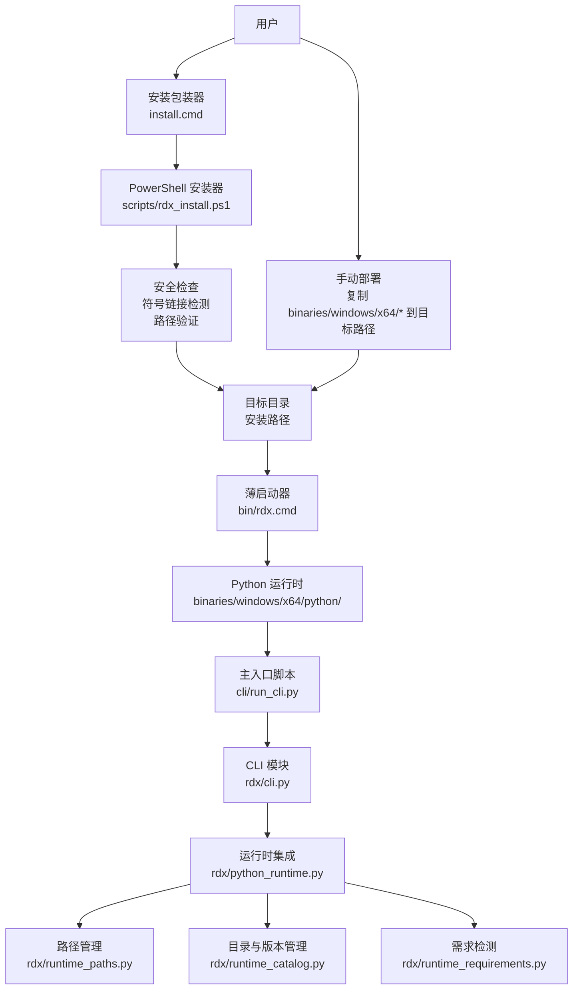
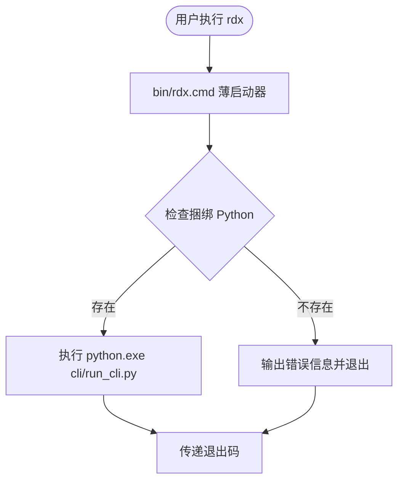
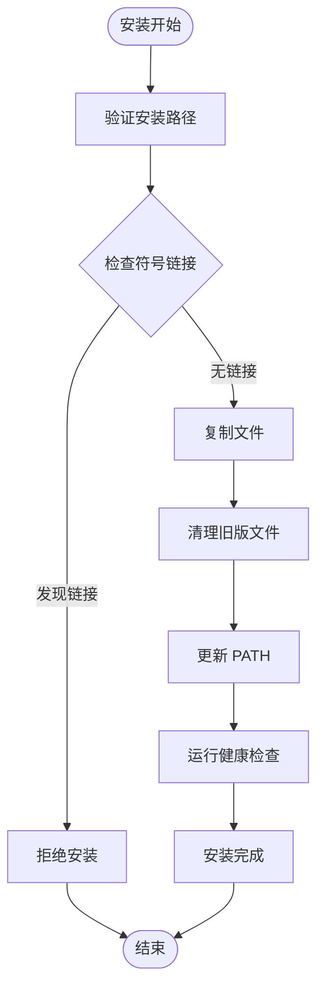
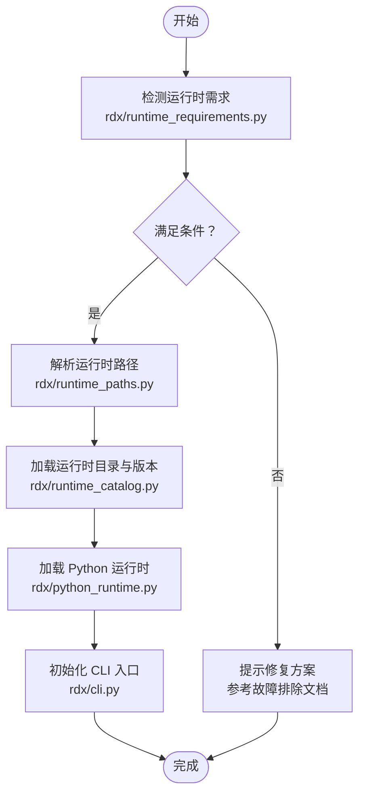
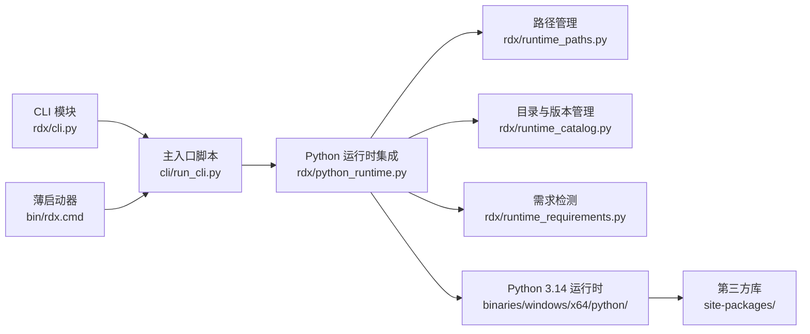

# 安装与配置

<cite>
**本文引用的文件**
- [install.md](file://docs/install.md)
- [configuration.md](file://docs/configuration.md)
- [quickstart.md](file://docs/quickstart.md)
- [compatibility-notes.md](file://docs/compatibility-notes.md)
- [troubleshooting.md](file://docs/troubleshooting.md)
- [rdx_install.ps1](file://scripts/rdx_install.ps1)
- [install.cmd](file://install.cmd)
- [bin/rdx.cmd](file://bin/rdx.cmd)
- [cli/run_cli.py](file://cli/run_cli.py)
- [python314._pth](file://binaries/windows/x64/python/python314._pth)
- [manifest.runtime.json](file://binaries/windows/x64/manifest.runtime.json)
- [renderdoc.json](file://binaries/windows/x64/renderdoc.json)
- [runtime_requirements.py](file://rdx/runtime_requirements.py)
- [runtime_paths.py](file://rdx/runtime_paths.py)
- [runtime_catalog.py](file://rdx/runtime_catalog.py)
- [python_runtime.py](file://rdx/python_runtime.py)
- [config.py](file://rdx/config.py)
- [cli.py](file://rdx/cli.py)
- [package_runtime.py](file://scripts/package_runtime.py)
- [verify_release_package.py](file://scripts/verify_release_package.py)
</cite>

## 更新摘要
**所做更改**
- 更新了 Windows 入口点结构，采用新的 bin/rdx.cmd 薄启动器调用捆绑的 Python 解释器
- 增强了 PowerShell 安装器的安全改进，包括符号链接检测防止和路径验证
- 更新了安装脚本的安全检查机制，防止符号链接攻击
- 简化了启动流程，移除了旧的批处理启动器文件
- 增强了安装过程的健壮性和安全性

## 目录
1. [简介](#简介)
2. [项目结构](#项目结构)
3. [核心组件](#核心组件)
4. [架构总览](#架构总览)
5. [详细组件分析](#详细组件分析)
6. [依赖关系分析](#依赖关系分析)
7. [性能考虑](#性能考虑)
8. [故障排除指南](#故障排除指南)
9. [结论](#结论)
10. [附录](#附录)

## 简介
本文件提供 RDC Agent Tools 在 Windows x64 平台上的完整安装与配置指南，覆盖系统要求、依赖项、兼容性、多种安装方式（自包含发布包、脚本安装、手动部署）及其优缺点与适用场景。同时包含配置选项、环境变量、路径配置、配置验证步骤、常见问题解决方案以及高级定制化设置指导。

**更新** 新版本采用了全新的 Windows 入口点结构，通过 bin/rdx.cmd 薄启动器直接调用捆绑的 Python 解释器，并增强了 PowerShell 安装器的安全功能。

## 项目结构
该仓库采用模块化组织：核心运行时与工具位于 rdx 包中，Windows x64 自包含运行时位于 binaries/windows/x64，安装脚本位于 scripts 目录，用户文档位于 docs 目录。关键文件包括：
- Windows x64 自包含运行时：包含 Python 3.14 运行时、第三方库、渲染文档支持等
- 新的入口点结构：bin/rdx.cmd 薄启动器和 cli/run_cli.py 主入口
- 增强的安装脚本：PowerShell 安装器与安全改进
- 文档：安装、配置、快速入门、兼容性与故障排除指南
- 核心运行时：运行时需求检测、路径管理、运行时目录与版本管理

**图表来源**
- [bin/rdx.cmd](file://bin/rdx.cmd)
- [cli/run_cli.py](file://cli/run_cli.py)
- [install.cmd](file://install.cmd)
- [scripts/rdx_install.ps1](file://scripts/rdx_install.ps1)
- [python314._pth](file://binaries/windows/x64/python/python314._pth)
- [manifest.runtime.json](file://binaries/windows/x64/manifest.runtime.json)
- [renderdoc.json](file://binaries/windows/x64/renderdoc.json)
- [runtime_requirements.py](file://rdx/runtime_requirements.py)
- [runtime_paths.py](file://rdx/runtime_paths.py)
- [runtime_catalog.py](file://rdx/runtime_catalog.py)
- [python_runtime.py](file://rdx/python_runtime.py)
- [install.md](file://docs/install.md)
- [configuration.md](file://docs/configuration.md)
- [quickstart.md](file://docs/quickstart.md)
- [compatibility-notes.md](file://docs/compatibility-notes.md)
- [troubleshooting.md](file://docs/troubleshooting.md)

**章节来源**
- [install.md](file://docs/install.md)
- [configuration.md](file://docs/configuration.md)
- [quickstart.md](file://docs/quickstart.md)
- [compatibility-notes.md](file://docs/compatibility-notes.md)
- [troubleshooting.md](file://docs/troubleshooting.md)
- [bin/rdx.cmd](file://bin/rdx.cmd)
- [cli/run_cli.py](file://cli/run_cli.py)
- [install.cmd](file://install.cmd)
- [scripts/rdx_install.ps1](file://scripts/rdx_install.ps1)
- [python314._pth](file://binaries/windows/x64/python/python314._pth)
- [manifest.runtime.json](file://binaries/windows/x64/manifest.runtime.json)
- [renderdoc.json](file://binaries/windows/x64/renderdoc.json)
- [runtime_requirements.py](file://rdx/runtime_requirements.py)
- [runtime_paths.py](file://rdx/runtime_paths.py)
- [runtime_catalog.py](file://rdx/runtime_catalog.py)
- [python_runtime.py](file://rdx/python_runtime.py)

## 核心组件
- Windows x64 自包含运行时：包含 Python 3.14、标准库、第三方库与渲染文档支持，便于离线部署与最小化依赖。
- **新入口点结构**：bin/rdx.cmd 薄启动器直接调用捆绑的 Python 解释器，提供更简洁的启动流程。
- **增强的安装脚本**：PowerShell 安装器包含符号链接检测、路径验证等安全改进。
- 配置系统：集中于运行时路径与版本管理，支持多运行时共存与切换。
- 启动器：通过新的薄启动器加载运行时并执行 CLI，移除了复杂的批处理启动器。

**章节来源**
- [bin/rdx.cmd](file://bin/rdx.cmd)
- [cli/run_cli.py](file://cli/run_cli.py)
- [scripts/rdx_install.ps1](file://scripts/rdx_install.ps1)
- [python314._pth](file://binaries/windows/x64/python/python314._pth)
- [manifest.runtime.json](file://binaries/windows/x64/manifest.runtime.json)
- [renderdoc.json](file://binaries/windows/x64/renderdoc.json)
- [runtime_paths.py](file://rdx/runtime_paths.py)
- [runtime_catalog.py](file://rdx/runtime_catalog.py)
- [python_runtime.py](file://rdx/python_runtime.py)
- [install.cmd](file://install.cmd)

## 架构总览
下图展示 Windows x64 平台安装与运行的整体架构：用户通过 install.cmd 或 PowerShell 安装器获得自包含运行时；通过新的 bin/rdx.cmd 薄启动器加载 Python 运行时与第三方库；CLI 模块负责命令解析与执行；增强的安装脚本确保安装过程的安全性。

**图表来源**
- [install.cmd](file://install.cmd)
- [scripts/rdx_install.ps1](file://scripts/rdx_install.ps1)
- [bin/rdx.cmd](file://bin/rdx.cmd)
- [cli/run_cli.py](file://cli/run_cli.py)
- [python_runtime.py](file://rdx/python_runtime.py)
- [runtime_paths.py](file://rdx/runtime_paths.py)
- [runtime_catalog.py](file://rdx/runtime_catalog.py)
- [runtime_requirements.py](file://rdx/runtime_requirements.py)
- [cli.py](file://rdx/cli.py)

## 详细组件分析

### Windows x64 自包含运行时
- Python 3.14 运行时：包含标准库、site-packages 第三方库与扩展模块，适合离线部署。
- 渲染文档支持：包含 RenderDoc 集成配置，便于图形调试与捕获。
- 运行时清单：包含运行时元数据与依赖声明，用于验证与分发。

**章节来源**
- [python314._pth](file://binaries/windows/x64/python/python314._pth)
- [manifest.runtime.json](file://binaries/windows/x64/manifest.runtime.json)
- [renderdoc.json](file://binaries/windows/x64/renderdoc.json)

### 新入口点结构：bin/rdx.cmd 薄启动器
- **功能**：简化的 Windows 命令行入口，直接调用捆绑的 Python 解释器
- **优势**：更少的中间层、更快的启动速度、更好的错误处理
- **安全特性**：验证捆绑 Python 存在性，失败时返回明确的错误码
- **兼容性**：保持与现有工具的兼容性，支持所有标准参数传递

**图表来源**
- [bin/rdx.cmd](file://bin/rdx.cmd)
- [cli/run_cli.py](file://cli/run_cli.py)

**章节来源**
- [bin/rdx.cmd](file://bin/rdx.cmd)
- [cli/run_cli.py](file://cli/run_cli.py)

### 增强的 PowerShell 安装器
- **安全改进**：
  - 符号链接检测：防止符号链接攻击，拒绝包含符号链接的安装路径
  - 路径验证：严格的安装路径验证，确保路径安全性和有效性
  - 源和目标检查：防止源和目标路径相互包含或相同
- **功能增强**：
  - 自动清理旧版启动器文件（rdx.bat 和 scripts/rdx_bat_launcher.ps1）
  - 改进的 PATH 管理，保留其他安装的 PATH 条目
  - 增强的错误处理和诊断信息
- **操作模式**：支持 install、upgrade、uninstall、doctor 四种操作

**图表来源**
- [scripts/rdx_install.ps1](file://scripts/rdx_install.ps1)

**章节来源**
- [scripts/rdx_install.ps1](file://scripts/rdx_install.ps1)

### 安装包装器：install.cmd
- **功能**：PowerShell 安装器的简单包装器，提供友好的命令行界面
- **默认行为**：无参数时自动执行安装并添加到 PATH
- **参数传递**：支持所有 PowerShell 安装器参数
- **用户体验**：安装完成后暂停等待用户查看结果

**章节来源**
- [install.cmd](file://install.cmd)

### 主入口脚本：cli/run_cli.py
- **功能**：RDX 工具的主入口点，负责初始化环境和执行命令
- **环境管理**：自动设置 RDX_TOOLS_ROOT 环境变量和 Python 路径
- **编码处理**：确保 UTF-8 编码输出，支持国际化
- **命令路由**：根据参数选择相应的命令处理器

**章节来源**
- [cli/run_cli.py](file://cli/run_cli.py)

### 运行时需求检测与路径管理
- 需求检测：检查 Python 版本、第三方库完整性、系统兼容性。
- 路径管理：集中管理运行时路径、缓存目录、日志目录。
- 目录与版本管理：支持多版本共存与切换，便于灰度与回滚。

**图表来源**
- [runtime_requirements.py](file://rdx/runtime_requirements.py)
- [runtime_paths.py](file://rdx/runtime_paths.py)
- [runtime_catalog.py](file://rdx/runtime_catalog.py)
- [python_runtime.py](file://rdx/python_runtime.py)
- [cli.py](file://rdx/cli.py)

**章节来源**
- [runtime_requirements.py](file://rdx/runtime_requirements.py)
- [runtime_paths.py](file://rdx/runtime_paths.py)
- [runtime_catalog.py](file://rdx/runtime_catalog.py)
- [python_runtime.py](file://rdx/python_runtime.py)
- [cli.py](file://rdx/cli.py)

### 配置系统与高级定制
- 配置选项：运行时路径、日志级别、缓存策略、超时策略等。
- 环境变量：可通过环境变量覆盖默认路径与行为。
- 路径配置：支持相对路径、绝对路径与环境变量组合。
- 高级定制：运行时目录结构、版本选择、第三方库替换与扩展。

**章节来源**
- [configuration.md](file://docs/configuration.md)
- [runtime_paths.py](file://rdx/runtime_paths.py)
- [runtime_catalog.py](file://rdx/runtime_catalog.py)
- [config.py](file://rdx/config.py)

## 依赖关系分析
- 内部依赖：CLI 依赖运行时集成，运行时集成依赖路径与目录管理，目录管理依赖需求检测。
- 外部依赖：Python 3.14、第三方库（如 numpy、httpx 等）、操作系统兼容性。
- 分发依赖：自包含运行时减少外部依赖，提升可移植性。

**图表来源**
- [cli.py](file://rdx/cli.py)
- [cli/run_cli.py](file://cli/run_cli.py)
- [python_runtime.py](file://rdx/python_runtime.py)
- [runtime_paths.py](file://rdx/runtime_paths.py)
- [runtime_catalog.py](file://rdx/runtime_catalog.py)
- [runtime_requirements.py](file://rdx/runtime_requirements.py)
- [bin/rdx.cmd](file://bin/rdx.cmd)
- [python314._pth](file://binaries/windows/x64/python/python314._pth)

**章节来源**
- [cli.py](file://rdx/cli.py)
- [cli/run_cli.py](file://cli/run_cli.py)
- [python_runtime.py](file://rdx/python_runtime.py)
- [runtime_paths.py](file://rdx/runtime_paths.py)
- [runtime_catalog.py](file://rdx/runtime_catalog.py)
- [runtime_requirements.py](file://rdx/runtime_requirements.py)
- [bin/rdx.cmd](file://bin/rdx.cmd)
- [python314._pth](file://binaries/windows/x64/python/python314._pth)

## 性能考虑
- 自包含运行时避免动态加载第三方库带来的延迟，启动更快。
- **新入口点结构**：薄启动器减少了中间层，提升了启动性能。
- 合理的日志级别与缓存策略可降低磁盘 IO 与内存占用。
- 多版本共存建议仅保留必要版本，减少路径扫描与冲突。
- **安全检查优化**：安装时的符号链接检测和路径验证经过优化，不影响正常安装性能。

## 故障排除指南
- 安装失败：检查网络、权限与磁盘空间；参考安装脚本输出与日志。
- **新入口点问题**：确认 bin/rdx.cmd 存在且可执行；检查捆绑 Python 是否完整。
- **符号链接错误**：如果安装过程中遇到符号链接相关错误，请检查目标路径是否包含符号链接。
- 启动异常：确认薄启动器与主入口脚本路径正确；检查环境变量。
- 运行时不兼容：根据需求检测结果更新运行时或调整配置。
- 常见问题与解决方案：参见故障排除文档中的具体条目与操作步骤。

**章节来源**
- [troubleshooting.md](file://docs/troubleshooting.md)
- [bin/rdx.cmd](file://bin/rdx.cmd)
- [scripts/rdx_install.ps1](file://scripts/rdx_install.ps1)
- [cli/run_cli.py](file://cli/run_cli.py)
- [runtime_requirements.py](file://rdx/runtime_requirements.py)

## 结论
通过全新的薄启动器结构和增强的安全功能，RDC Agent Tools 在 Windows x64 平台上实现了更安全、更可靠的部署体验。新的 bin/rdx.cmd 薄启动器提供了更简洁的启动流程，而增强的 PowerShell 安装器确保了安装过程的安全性。结合灵活的配置系统与完善的故障排除机制，既能满足日常开发需求，也能支撑大规模生产环境。

## 附录

### 系统要求与兼容性
- 操作系统：Windows x64（具体版本请参考兼容性文档）。
- 运行时：Python 3.14（已内置于自包含包）。
- 硬件：根据工具链负载评估 CPU、内存与存储需求。
- 兼容性：第三方库与系统组件的兼容性以运行时清单为准。

**章节来源**
- [compatibility-notes.md](file://docs/compatibility-notes.md)
- [manifest.runtime.json](file://binaries/windows/x64/manifest.runtime.json)

### 安装方式对比与适用场景
- **薄启动器方式**：最简部署，适合直接使用 rdx 命令，推荐大多数用户。
- **PowerShell 安装器**：自动化与可重复，适合批量与 CI/CD，提供安全保证。
- **手动部署**：灵活性最高，适合深度定制与特殊环境。

**章节来源**
- [install.md](file://docs/install.md)
- [bin/rdx.cmd](file://bin/rdx.cmd)
- [scripts/rdx_install.ps1](file://scripts/rdx_install.ps1)

### 配置验证步骤
- 启动验证：通过薄启动器执行基础命令，观察输出与返回码。
- 路径验证：确认运行时路径、日志路径与缓存路径存在且可写。
- 依赖验证：检查第三方库是否完整加载。
- 安全验证：使用 doctor 命令验证安装完整性。
- 性能验证：在典型工作负载下测量启动时间与资源占用。

**章节来源**
- [quickstart.md](file://docs/quickstart.md)
- [runtime_paths.py](file://rdx/runtime_paths.py)
- [python_runtime.py](file://rdx/python_runtime.py)

### 高级配置与定制化
- 运行时版本管理：通过目录与版本管理模块选择特定版本。
- 环境变量覆盖：通过环境变量调整默认路径与行为。
- **自定义启动参数**：修改 bin/rdx.cmd 添加或修改启动参数。
- **安全配置**：调整安装脚本的安全检查级别。
- 发布与打包：使用打包脚本生成自包含发布包并进行校验。

**章节来源**
- [runtime_catalog.py](file://rdx/runtime_catalog.py)
- [runtime_paths.py](file://rdx/runtime_paths.py)
- [bin/rdx.cmd](file://bin/rdx.cmd)
- [scripts/rdx_install.ps1](file://scripts/rdx_install.ps1)
- [package_runtime.py](file://scripts/package_runtime.py)
- [verify_release_package.py](file://scripts/verify_release_package.py)