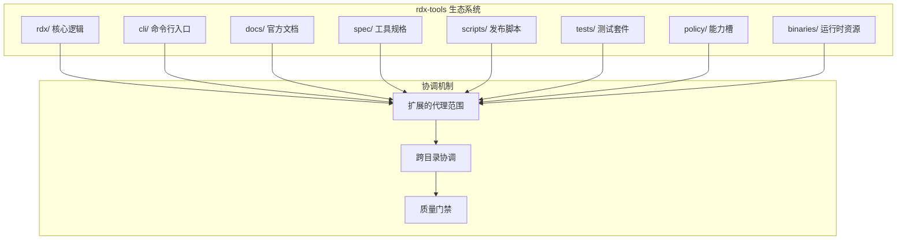
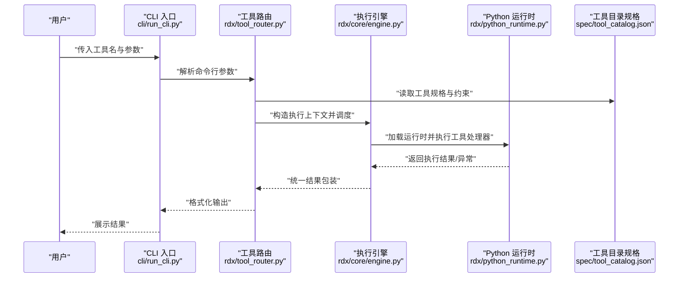
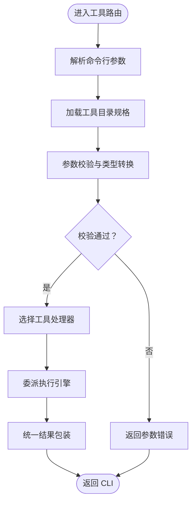
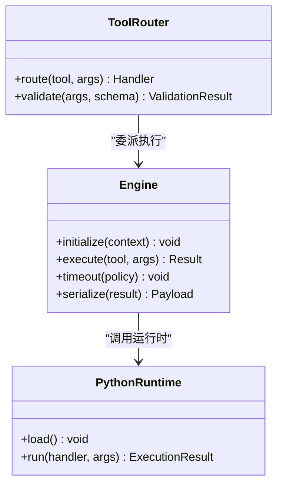
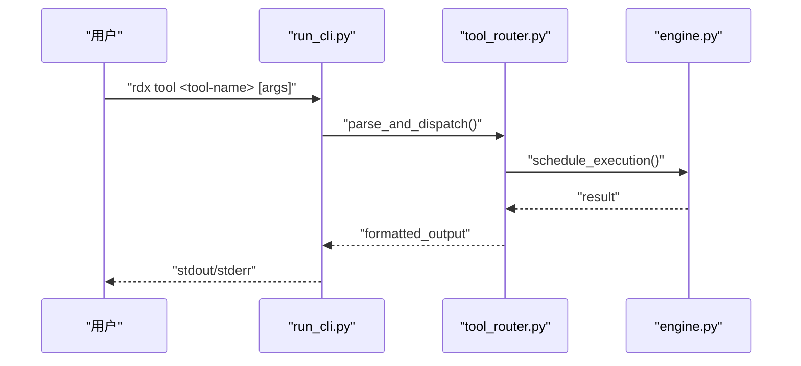
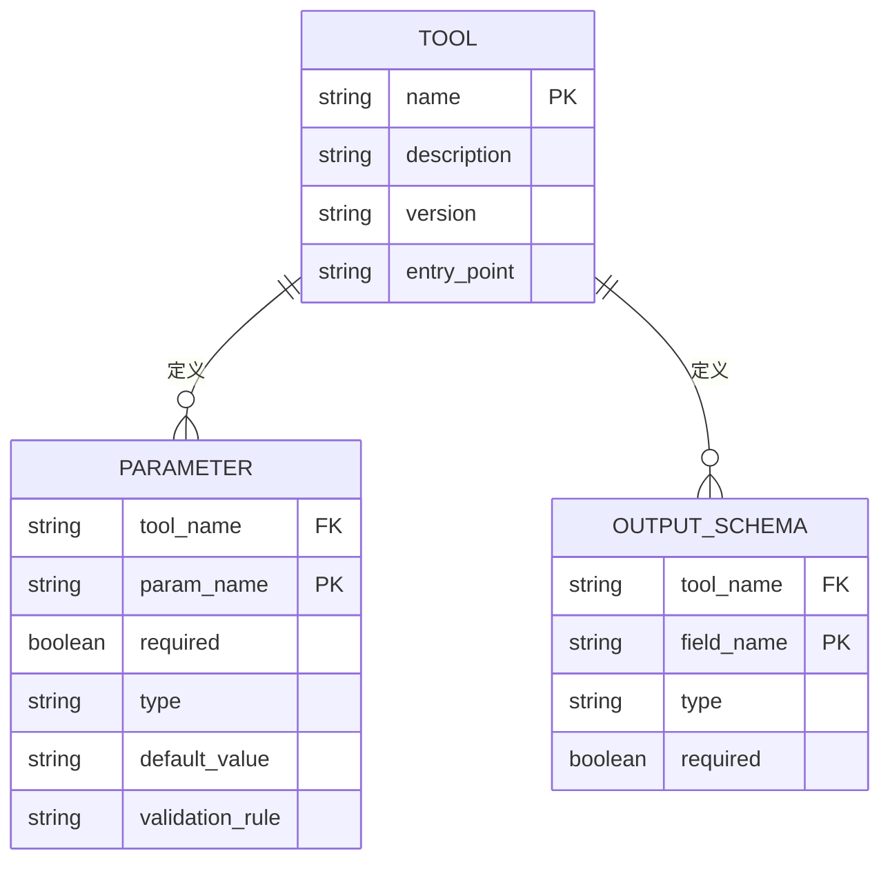
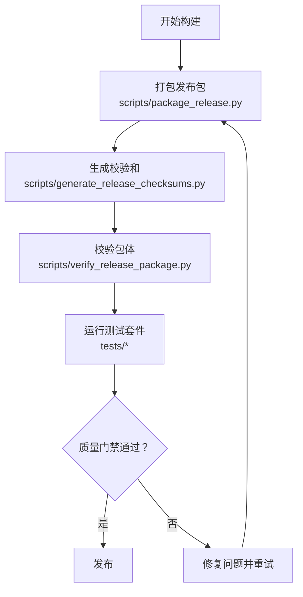
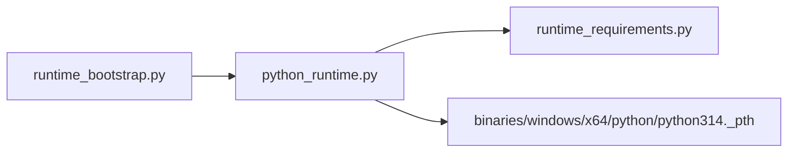
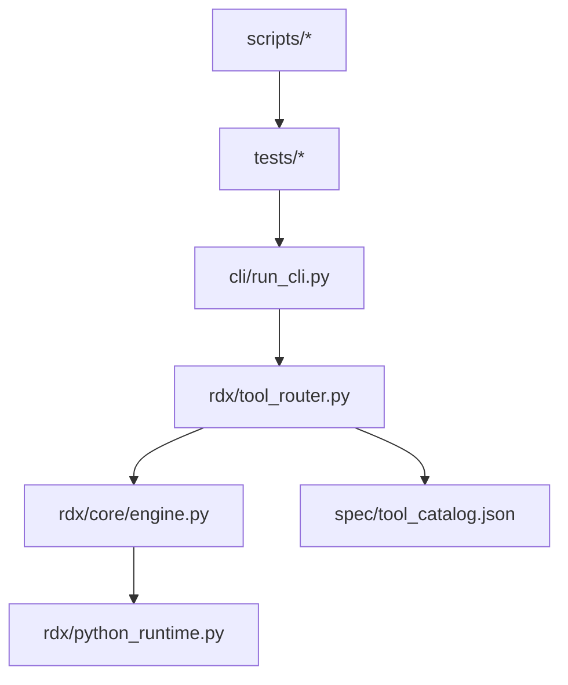

# 工具开发指南

<cite>
**本文引用的文件**
- [AGENTS.md](file://AGENTS.md)
- [README.md](file://README.md)
- [docs/tools.md](file://docs/tools.md)
- [docs/agent-model.md](file://docs/agent-model.md)
- [docs/doc-governance.md](file://docs/doc-governance.md)
- [docs/troubleshooting.md](file://docs/troubleshooting.md)
- [rdx/tool_router.py](file://rdx/tool_router.py)
- [rdx/core/engine.py](file://rdx/core/engine.py)
- [cli/run_cli.py](file://cli/run_cli.py)
- [spec/tool_catalog.json](file://spec/tool_catalog.json)
- [spec/tool_catalog_overlay.json](file://spec/tool_catalog_overlay.json)
- [scripts/package_release.py](file://scripts/package_release.py)
- [scripts/generate_release_checksums.py](file://scripts/generate_release_checksums.py)
- [scripts/verify_release_package.py](file://scripts/verify_release_package.py)
- [scripts/README.md](file://scripts/README.md)
- [tests/test_layout.py](file://tests/test_layout.py)
- [tests/test_scripts_governance.py](file://tests/test_scripts_governance.py)
- [tests/test_release_gate.py](file://tests/test_release_gate.py)
- [policy/README.md](file://policy/README.md)
</cite>

## 更新摘要
**变更内容**
- 更新了项目范围说明，反映扩展的代理范围涵盖整个 rdx-tools 生态系统
- 新增了跨目录协调开发的指导原则
- 更新了文档治理和冲突解决策略
- 增强了测试和质量门禁的相关说明
- 完善了发布流程中的多目录协调要求

## 目录
1. [简介](#简介)
2. [项目范围与结构](#项目范围与结构)
3. [核心组件](#核心组件)
4. [架构总览](#架构总览)
5. [详细组件分析](#详细组件分析)
6. [依赖关系分析](#依赖关系分析)
7. [性能考虑](#性能考虑)
8. [故障排除指南](#故障排除指南)
9. [结论](#结论)
10. [附录](#附录)

## 简介
本指南面向希望为 RDX Agent Tools 平台开发自定义工具的工程师与测试人员。随着代理范围的扩展，工具开发现已涵盖整个 rdx-tools 生态系统，包括 `rdx/`、`cli/`、`docs/`、`scripts/`、`tests/` 和 `spec/` 目录。内容覆盖从工具开发流程、接口规范、实现模式到测试策略、调试技巧、性能优化、发布流程与版本管理等全生命周期实践。文档同时提供工具开发模板、代码示例路径与常见问题解决方案，并给出面向初学者的循序渐进学习路径。

## 项目范围与结构
该仓库采用模块化组织方式，核心围绕"工具路由""执行引擎""CLI 运行时""规格目录""脚本打包与校验""测试套件"展开。关键目录与职责如下：

- **rdx**：平台核心逻辑（工具路由、执行引擎、运行时、模型等）
- **cli**：命令行入口与运行 CLI 的封装
- **docs**：官方文档（工具开发、快速开始、安装、配置、故障排除等）
- **spec**：工具目录规格与叠加层（用于声明工具能力、参数、输出格式等）
- **scripts**：发布与质量门禁脚本（打包、校验、生成校验和）
- **tests**：端到端与单元测试，保障发布质量
- **binaries**：预编译运行时二进制与 Python 运行时资源（Windows x64）
- **policy**：能力槽保留目录，当前不参与运行时行为

**图表来源**
- [AGENTS.md:3](file://AGENTS.md#L3)
- [tests/test_layout.py:79-98](file://tests/test_layout.py#L79-L98)

**章节来源**
- [AGENTS.md:3](file://AGENTS.md#L3)
- [tests/test_layout.py:79-98](file://tests/test_layout.py#L79-L98)
- [policy/README.md:1-6](file://policy/README.md#L1-L6)

## 核心组件
- **工具路由（Tool Router）**：负责根据工具名称与参数选择具体工具处理器，协调参数解析与结果返回。
- **执行引擎（Engine）**：封装工具执行上下文、超时控制、错误处理与结果序列化。
- **CLI 入口（run_cli.py）**：提供命令行调用入口，解析用户输入并委派给工具路由。
- **工具目录规格（tool_catalog.json / overlay）**：声明工具清单、参数约束、输出格式与兼容性要求。
- **发布脚本（package_release.py、generate_release_checksums.py、verify_release_package.py）**：自动化打包、生成校验和与验证发布包完整性。
- **测试套件（tests/*）**：覆盖发布包、运行时打包、工具集成等场景。
- **Python 运行时与引导**：提供可移植的 Python 运行环境与引导逻辑，支持 Windows x64 预编译二进制。

**章节来源**
- [rdx/tool_router.py](file://rdx/tool_router.py)
- [rdx/core/engine.py](file://rdx/core/engine.py)
- [cli/run_cli.py](file://cli/run_cli.py)
- [spec/tool_catalog.json](file://spec/tool_catalog.json)
- [spec/tool_catalog_overlay.json](file://spec/tool_catalog_overlay.json)
- [scripts/package_release.py](file://scripts/package_release.py)
- [scripts/generate_release_checksums.py](file://scripts/generate_release_checksums.py)
- [scripts/verify_release_package.py](file://scripts/verify_release_package.py)
- [tests/test_release_package.py](file://tests/test_release_package.py)

## 架构总览
下图展示了从 CLI 到工具路由、执行引擎与运行时的整体调用链路，以及规格目录对工具行为的约束作用。

**图表来源**
- [cli/run_cli.py](file://cli/run_cli.py)
- [rdx/tool_router.py](file://rdx/tool_router.py)
- [rdx/core/engine.py](file://rdx/core/engine.py)
- [rdx/python_runtime.py](file://rdx/python_runtime.py)
- [spec/tool_catalog.json](file://spec/tool_catalog.json)

## 详细组件分析

### 工具路由（Tool Router）
- **职责**：根据工具标识与参数映射到具体处理器；进行参数校验与类型转换；统一结果格式化与错误传播。
- **关键点**：
  - 工具注册与发现：通过工具目录规格动态加载可用工具清单。
  - 参数接收：支持位置参数、命名参数与标志位；参数类型与必填性由规格约束。
  - 返回值格式：统一为结构化结果对象，包含状态码、数据载荷与错误信息。
  - 安全与隔离：限制工具访问范围，避免越权操作。

**图表来源**
- [rdx/tool_router.py](file://rdx/tool_router.py)
- [spec/tool_catalog.json](file://spec/tool_catalog.json)

**章节来源**
- [rdx/tool_router.py](file://rdx/tool_router.py)
- [spec/tool_catalog.json](file://spec/tool_catalog.json)

### 执行引擎（Engine）
- **职责**：管理工具执行生命周期，包括上下文初始化、超时控制、异常捕获与结果序列化。
- **关键点**：
  - 上下文隔离：为每个工具创建独立执行上下文，避免全局污染。
  - 超时策略：基于工具规格或默认策略设置超时时间，防止长时间阻塞。
  - 错误处理：捕获工具内部异常，转换为标准错误响应，保留堆栈信息以便调试。
  - 结果序列化：确保返回值符合预期格式，便于上层消费。

**图表来源**
- [rdx/core/engine.py](file://rdx/core/engine.py)
- [rdx/tool_router.py](file://rdx/tool_router.py)
- [rdx/python_runtime.py](file://rdx/python_runtime.py)

**章节来源**
- [rdx/core/engine.py](file://rdx/core/engine.py)
- [rdx/python_runtime.py](file://rdx/python_runtime.py)

### CLI 入口（run_cli.py）
- **职责**：作为用户交互入口，解析命令行参数，调用工具路由并输出结果。
- **关键点**：
  - 参数解析：支持子命令、选项与参数分组。
  - 输出控制：根据日志级别与格式化选项调整输出样式。
  - 异常透传：将底层异常转换为用户友好的提示信息。

**图表来源**
- [cli/run_cli.py](file://cli/run_cli.py)
- [rdx/tool_router.py](file://rdx/tool_router.py)
- [rdx/core/engine.py](file://rdx/core/engine.py)

**章节来源**
- [cli/run_cli.py](file://cli/run_cli.py)

### 工具目录规格（tool_catalog.json / overlay）
- **职责**：以 JSON 规格声明工具清单、参数约束、输出格式与兼容性要求。
- **关键点**：
  - 工具元数据：名称、描述、版本、入口点、依赖项。
  - 参数模式：必填、类型、默认值、取值范围与校验规则。
  - 输出模式：字段定义、数据类型与示例。
  - 叠加层：允许在不同环境或版本中覆盖默认规格，保证兼容性。

**图表来源**
- [spec/tool_catalog.json](file://spec/tool_catalog.json)
- [spec/tool_catalog_overlay.json](file://spec/tool_catalog_overlay.json)

**章节来源**
- [spec/tool_catalog.json](file://spec/tool_catalog.json)
- [spec/tool_catalog_overlay.json](file://spec/tool_catalog_overlay.json)

### 发布与质量门禁（scripts/*）
- **职责**：自动化打包、生成校验和与验证发布包完整性，确保跨平台一致性。
- **关键点**：
  - 包装流程：收集运行时、工具与文档，按平台归档。
  - 校验和：对发布包生成哈希，便于下载后验证。
  - 校验脚本：检查包内文件完整性、签名与版本信息。
  - 测试联动：与测试套件配合，确保发布包满足质量门槛。

**图表来源**
- [scripts/package_release.py](file://scripts/package_release.py)
- [scripts/generate_release_checksums.py](file://scripts/generate_release_checksums.py)
- [scripts/verify_release_package.py](file://scripts/verify_release_package.py)
- [tests/test_release_package.py](file://tests/test_release_package.py)

**章节来源**
- [scripts/package_release.py](file://scripts/package_release.py)
- [scripts/generate_release_checksums.py](file://scripts/generate_release_checksums.py)
- [scripts/verify_release_package.py](file://scripts/verify_release_package.py)
- [tests/test_release_package.py](file://tests/test_release_package.py)

### Python 运行时与引导
- **职责**：提供可移植的 Python 运行环境与引导逻辑，支持 Windows x64 预编译二进制。
- **关键点**：
  - 运行时加载：根据平台选择合适的 Python 解释器与库。
  - 引导程序：初始化运行时环境变量与模块路径。
  - 依赖管理：声明运行时所需模块与版本，确保工具可复现执行。

**图表来源**
- [rdx/runtime_bootstrap.py](file://rdx/runtime_bootstrap.py)
- [rdx/python_runtime.py](file://rdx/python_runtime.py)
- [rdx/runtime_requirements.py](file://rdx/runtime_requirements.py)
- [binaries/windows/x64/python/python314._pth](file://binaries/windows/x64/python/python314._pth)

**章节来源**
- [rdx/runtime_bootstrap.py](file://rdx/runtime_bootstrap.py)
- [rdx/python_runtime.py](file://rdx/python_runtime.py)
- [rdx/runtime_requirements.py](file://rdx/runtime_requirements.py)
- [binaries/windows/x64/python/python314._pth](file://binaries/windows/x64/python/python314._pth)

## 依赖关系分析
- **组件耦合**：
  - CLI 仅依赖工具路由；工具路由依赖执行引擎与规格目录；执行引擎依赖运行时。
  - 发布脚本与测试套件独立于核心运行时，但与发布产物强关联。
- **外部依赖**：
  - Windows x64 平台使用预编译 Python 运行时，减少环境差异。
  - 规格目录作为契约，约束工具实现与消费者行为。

**图表来源**
- [cli/run_cli.py](file://cli/run_cli.py)
- [rdx/tool_router.py](file://rdx/tool_router.py)
- [rdx/core/engine.py](file://rdx/core/engine.py)
- [rdx/python_runtime.py](file://rdx/python_runtime.py)
- [spec/tool_catalog.json](file://spec/tool_catalog.json)
- [scripts/package_release.py](file://scripts/package_release.py)
- [tests/test_release_package.py](file://tests/test_release_package.py)

**章节来源**
- [cli/run_cli.py](file://cli/run_cli.py)
- [rdx/tool_router.py](file://rdx/tool_router.py)
- [rdx/core/engine.py](file://rdx/core/engine.py)
- [rdx/python_runtime.py](file://rdx/python_runtime.py)
- [spec/tool_catalog.json](file://spec/tool_catalog.json)
- [scripts/package_release.py](file://scripts/package_release.py)
- [tests/test_release_package.py](file://tests/test_release_package.py)

## 性能考虑
- **工具执行超时**：通过执行引擎的超时策略限制单次工具运行时间，避免阻塞。
- **运行时复用**：在多工具并发场景下，尽量复用已初始化的运行时实例，降低启动开销。
- **结果缓存**：对重复且稳定的工具输出进行缓存，减少重复计算。
- **I/O 优化**：合理使用流式处理与批量操作，避免大对象频繁拷贝。
- **平台适配**：针对 Windows x64 使用预编译运行时，减少环境准备时间。

## 故障排除指南
- **常见问题与定位**：
  - 参数错误：检查工具目录规格中的参数定义与必填项，确认 CLI 输入是否匹配。
  - 工具未找到：核对工具名称与规格清单，确认工具入口点正确。
  - 运行时加载失败：检查运行时引导与依赖声明，确保模块路径与版本一致。
  - 发布包校验失败：使用校验脚本逐项比对，确认文件完整性与签名。
- **调试技巧**：
  - 启用详细日志：通过 CLI 的日志级别选项输出更详细的执行轨迹。
  - 单步验证：使用最小化参数集与简单工具先行验证流程。
  - 回归测试：结合测试套件运行关键场景，确保修复不引入新问题。

**章节来源**
- [docs/troubleshooting.md](file://docs/troubleshooting.md)
- [cli/run_cli.py](file://cli/run_cli.py)
- [rdx/tool_router.py](file://rdx/tool_router.py)
- [rdx/core/engine.py](file://rdx/core/engine.py)
- [scripts/verify_release_package.py](file://scripts/verify_release_package.py)
- [tests/test_release_package.py](file://tests/test_release_package.py)

## 结论
本指南系统阐述了 RDX Agent Tools 平台的工具开发方法论与工程实践。随着代理范围的扩展至整个 rdx-tools 生态系统，开发者需要更加关注跨目录协调、文档一致性、测试覆盖率和发布质量。通过规范化的工具目录规格、清晰的路由与执行引擎设计、完善的发布与测试体系，开发者可以高效地实现、验证与交付高质量工具。建议在实践中遵循"先规格、后实现、再测试"的流程，并持续关注性能与兼容性。

## 附录

### 工具开发模板（步骤指引）
- **步骤 1**：在工具目录规格中新增工具条目，定义名称、版本、入口点与参数模式。
- **步骤 2**：实现工具处理器函数，遵循参数接收与返回值格式约定。
- **步骤 3**：编写单元测试与集成测试，覆盖正常路径与边界条件。
- **步骤 4**：本地运行 CLI 验证参数解析与输出格式。
- **步骤 5**：更新发布脚本与校验规则，确保打包流程自动化。
- **步骤 6**：运行质量门禁测试，通过后发布新版本。

**章节来源**
- [spec/tool_catalog.json](file://spec/tool_catalog.json)
- [docs/tools.md](file://docs/tools.md)
- [tests/test_release_package.py](file://tests/test_release_package.py)

### 接口规范与实现模式
- **参数接收**：
  - 必填参数必须在规格中标注；可选参数提供默认值。
  - 支持布尔、字符串、数值与数组等常见类型。
- **返回值格式**：
  - 统一包含状态码、消息与数据载荷；错误时包含堆栈信息。
- **实现模式**：
  - 处理器应幂等、无副作用优先；对有副作用的操作需明确前置条件与回滚策略。

**章节来源**
- [spec/tool_catalog.json](file://spec/tool_catalog.json)
- [rdx/tool_router.py](file://rdx/tool_router.py)
- [rdx/core/engine.py](file://rdx/core/engine.py)

### 测试策略与调试技巧
- **测试策略**：
  - 单元测试：覆盖处理器核心逻辑与边界条件。
  - 集成测试：验证 CLI → 路由 → 引擎 → 运行时的完整链路。
  - 发布测试：使用发布脚本与校验脚本验证包体完整性。
- **调试技巧**：
  - 使用最小化输入复现问题。
  - 分阶段断点：在 CLI、路由、引擎与运行时分别设置断点。
  - 日志分级：区分 INFO/WARN/ERROR，便于快速定位。

**章节来源**
- [tests/test_release_package.py](file://tests/test_release_package.py)
- [tests/test_package_runtime.py](file://tests/test_package_runtime.py)
- [cli/run_cli.py](file://cli/run_cli.py)
- [rdx/tool_router.py](file://rdx/tool_router.py)
- [rdx/core/engine.py](file://rdx/core/engine.py)

### 版本管理与兼容性
- **版本管理**：
  - 工具版本与平台版本解耦，通过规格中的版本号与兼容性声明控制升级策略。
- **兼容性**：
  - 使用叠加层覆盖特定环境的规格差异，保证多平台一致性。
  - 对破坏性变更提供迁移指南与过渡期策略。

**章节来源**
- [spec/tool_catalog.json](file://spec/tool_catalog.json)
- [spec/tool_catalog_overlay.json](file://spec/tool_catalog_overlay.json)

### 学习路径（面向初学者）
- **第 1 天**：阅读快速开始与安装指南，搭建本地开发环境。
- **第 2 天**：阅读工具开发文档，理解规格与路由机制。
- **第 3 天**：实现第一个简单工具，编写最小测试用例。
- **第 4 天**：接入 CLI 并运行本地验证，修复常见问题。
- **第 5 天**：完善规格、补充测试与发布脚本，完成一次小版本发布。

**章节来源**
- [docs/quickstart.md](file://docs/quickstart.md)
- [docs/install.md](file://docs/install.md)
- [docs/tools.md](file://docs/tools.md)

### 跨目录协调开发指南
**新增** 随着代理范围的扩展，开发者需要在以下目录间进行协调：

- **rdx/**：核心工具实现与运行时逻辑
- **cli/**：命令行接口与用户交互
- **docs/**：用户文档与维护者文档
- **scripts/**：构建、测试与发布脚本
- **tests/**：单元测试与集成测试
- **spec/**：工具规格与契约定义

**协调原则**：
1. **同步更新**：修改工具接口时需同步更新规格、文档和测试
2. **冲突解决**：当 CLI、文档或测试不一致时，优先修复实现并同步文档
3. **质量保证**：所有变更需通过完整的质量门禁流程
4. **向后兼容**：保持现有工具接口的向后兼容性

**章节来源**
- [AGENTS.md:3-17](file://AGENTS.md#L3-L17)
- [docs/doc-governance.md:1-14](file://docs/doc-governance.md#L1-L14)
- [tests/test_scripts_governance.py:8-38](file://tests/test_scripts_governance.py#L8-L38)

### 质量门禁与发布流程
**新增** 扩展的代理范围要求更严格的质量门禁：

- **脚本治理**：所有脚本必须通过语法检查和依赖验证
- **文档健康**：文档链接必须有效，示例命令必须可执行
- **测试覆盖**：新功能必须有相应的测试用例覆盖
- **发布验证**：发布包必须包含完整的运行时和依赖

**章节来源**
- [scripts/README.md:1-26](file://scripts/README.md#L1-L26)
- [tests/test_scripts_governance.py:47-68](file://tests/test_scripts_governance.py#L47-L68)
- [tests/test_release_gate.py:308-328](file://tests/test_release_gate.py#L308-L328)