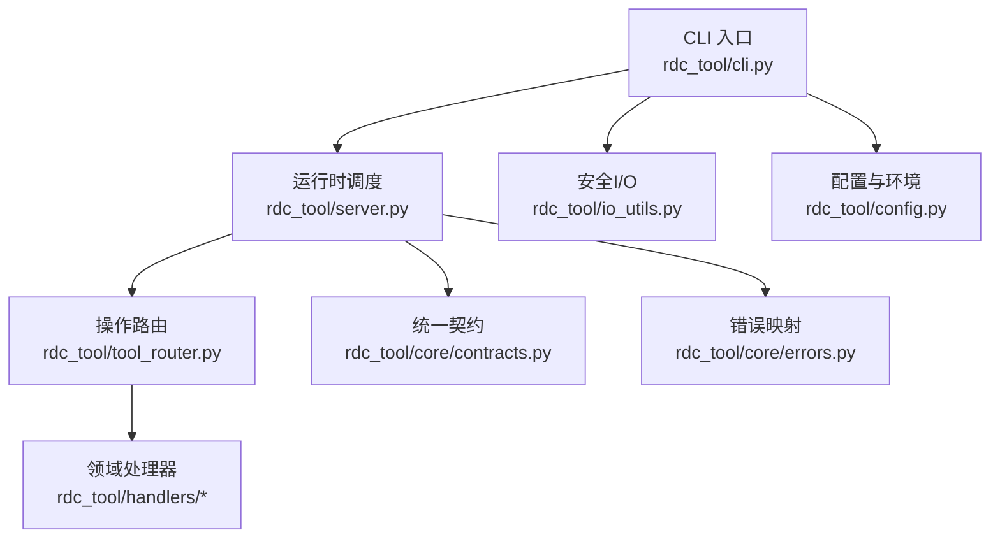
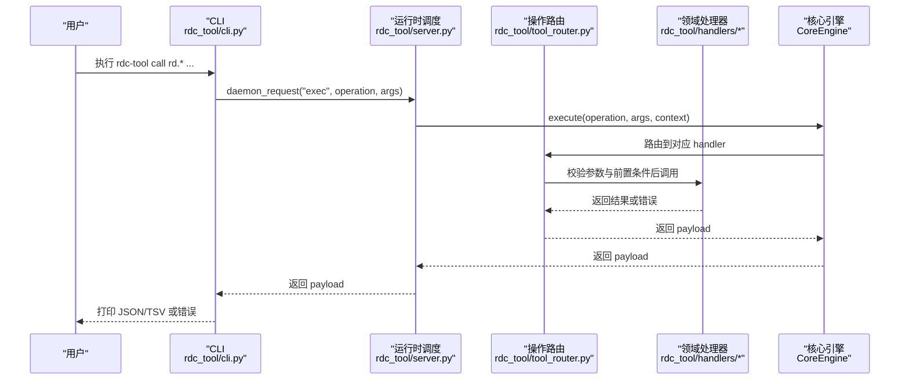
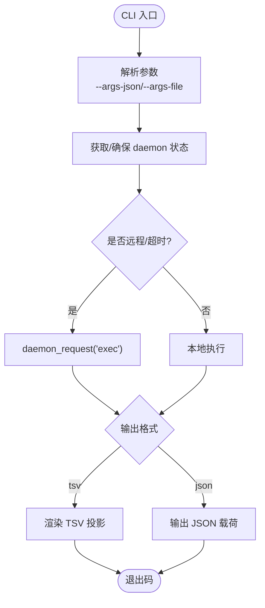
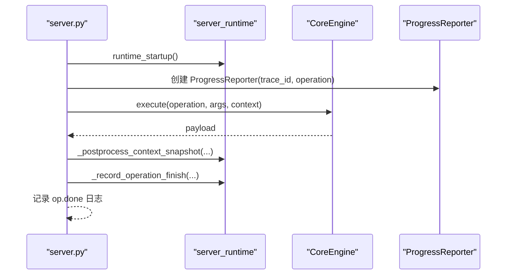
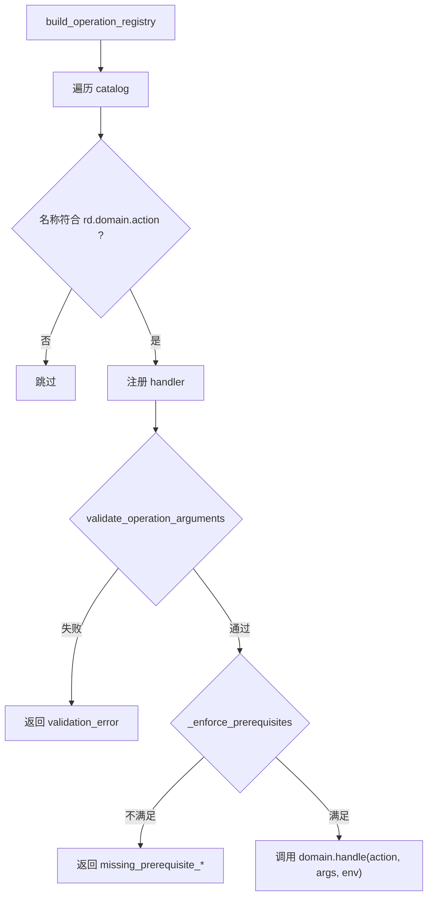
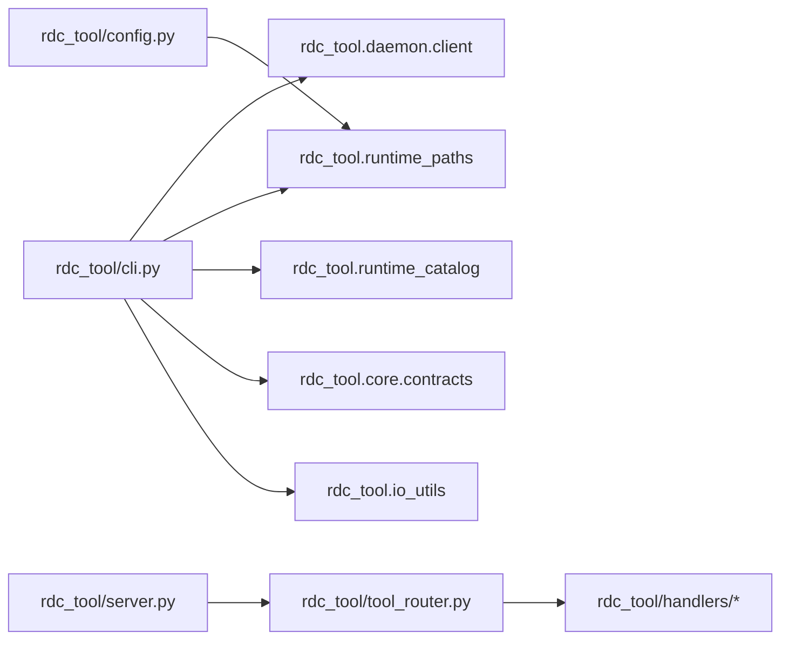

# 代码规范和最佳实践

<cite>
**本文引用的文件**
- [README.md](file://README.md)
- [pyproject.toml](file://pyproject.toml)
- [rdc_tool/__init__.py](file://rdc_tool/__init__.py)
- [rdc_tool/cli.py](file://rdc_tool/cli.py)
- [rdc_tool/config.py](file://rdc_tool/config.py)
- [rdc_tool/core/errors.py](file://rdc_tool/core/errors.py)
- [rdc_tool/core/contracts.py](file://rdc_tool/core/contracts.py)
- [rdc_tool/io_utils.py](file://rdc_tool/io_utils.py)
- [rdc_tool/server.py](file://rdc_tool/server.py)
- [rdc_tool/tool_router.py](file://rdc_tool/tool_router.py)
- [tests/conftest.py](file://tests/conftest.py)
- [AGENTS.md](file://AGENTS.md)
- [docs/doc-governance.md](file://docs/doc-governance.md)
</cite>

## 目录
1. [简介](#简介)
2. [项目结构](#项目结构)
3. [核心组件](#核心组件)
4. [架构总览](#架构总览)
5. [详细组件分析](#详细组件分析)
6. [依赖关系分析](#依赖关系分析)
7. [性能与资源管理](#性能与资源管理)
8. [错误处理规范](#错误处理规范)
9. [代码审查清单](#代码审查清单)
10. [重构与向后兼容](#重构与向后兼容)
11. [常见反模式与规避](#常见反模式与规避)
12. [文档编写规范](#文档编写规范)
13. [结论](#结论)

## 简介
本指南面向 RDC-Tool（rdc-tools）项目的 Python 代码质量与一致性，覆盖编码规范、命名约定、格式与注释标准；阐述分层架构、模块组织与依赖管理；定义错误处理、日志记录与异常类型；提供性能优化建议（内存、I/O、并发）；给出代码审查检查清单；说明重构原则与向后兼容性保证；总结常见反模式与避免方法；并明确文档编写标准与工具使用。

## 项目结构
- CLI 入口与命令路由：通过 rdc 命令暴露 JSON-first 操作，CLI 负责参数解析、输出格式化、与守护进程通信。
- 运行时调度：server.py 将操作分发到 CoreEngine，统一上下文、进度上报、生命周期钩子与预览同步。
- 操作注册与前置条件：tool_router.py 基于 catalog 构建 OperationRegistry，校验参数与前置条件后委派至 handlers。
- 配置与环境：config.py 集中数据类化配置项，支持环境变量注入；runtime_paths 等路径由运行时决定。
- 契约与产物：core/contracts.py 定义统一成功/失败响应、制品元信息、TSV 投影与版本标识。
- I/O 安全：io_utils.py 提供原子写入、JSON 安全序列化与流式输出，确保崩溃恢复与跨平台稳定性。
- 错误体系：core/errors.py 定义分类异常与映射策略，便于上层统一转换为稳定错误载荷。
- 测试隔离：tests/conftest.py 设置中间目录、清理状态、注入运行环境，确保可重复执行。

图表来源
- [rdc_tool/cli.py:1-120](file://rdc_tool/cli.py#L1-L120)
- [rdc_tool/server.py:62-145](file://rdc_tool/server.py#L62-L145)
- [rdc_tool/tool_router.py:131-154](file://rdc_tool/tool_router.py#L131-L154)
- [rdc_tool/core/contracts.py:98-164](file://rdc_tool/core/contracts.py#L98-L164)
- [rdc_tool/core/errors.py:9-119](file://rdc_tool/core/errors.py#L9-L119)
- [rdc_tool/io_utils.py:19-161](file://rdc_tool/io_utils.py#L19-L161)
- [rdc_tool/config.py:15-186](file://rdc_tool/config.py#L15-L186)

章节来源
- [README.md:1-70](file://README.md#L1-L70)
- [pyproject.toml:1-45](file://pyproject.toml#L1-L45)

## 核心组件
- CLI 适配器：负责参数解析、JSON 输出、daemon 通信、工具发现、完成脚本生成、诊断与健康检查。
- 运行时调度器：启动/关闭运行时、创建执行上下文、记录操作开始/结束、自动预览同步、异常转契约。
- 操作路由与注册：从 catalog 加载工具定义，按域分派到 handlers，校验参数与前置条件。
- 配置系统：以 dataclass 组织后端、回放、工作器、制品、数据库、二分查找、报告、限制等配置，支持环境变量覆盖。
- 契约与制品：统一成功/失败载荷、制品元信息、TSV 投影、版本与追踪字段。
- I/O 工具：原子写、JSON 安全序列化、追加 JSONL、临时文件清理。
- 错误体系：结构化异常族与通用映射函数，将系统异常归一为领域错误。

章节来源
- [rdc_tool/cli.py:54-125](file://rdc_tool/cli.py#L54-L125)
- [rdc_tool/server.py:38-145](file://rdc_tool/server.py#L38-L145)
- [rdc_tool/tool_router.py:34-154](file://rdc_tool/tool_router.py#L34-L154)
- [rdc_tool/config.py:15-186](file://rdc_tool/config.py#L15-L186)
- [rdc_tool/core/contracts.py:98-164](file://rdc_tool/core/contracts.py#L98-L164)
- [rdc_tool/io_utils.py:19-161](file://rdc_tool/io_utils.py#L19-L161)
- [rdc_tool/core/errors.py:9-119](file://rdc_tool/core/errors.py#L9-L119)

## 架构总览
RDC 采用“CLI -> 守护进程 -> 运行时 -> 操作引擎 -> 领域处理器”的分层模型。CLI 仅关注用户交互与输出；运行时负责上下文、进度、预览同步与生命周期；操作引擎根据 catalog 路由到具体 handler；handler 调用底层能力并返回统一契约载荷。

图表来源
- [rdc_tool/cli.py:243-264](file://rdc_tool/cli.py#L243-L264)
- [rdc_tool/server.py:62-145](file://rdc_tool/server.py#L62-L145)
- [rdc_tool/tool_router.py:131-154](file://rdc_tool/tool_router.py#L131-L154)

## 详细组件分析

### CLI 适配器（rdc_tool/cli.py）
- 职责：解析命令行、构造 JSON 参数、选择上下文、调用 daemon、渲染 TSV/JSON、健康检查、工具列表与搜索、补全脚本。
- 关键流程：
  - 参数加载：支持 --args-json 与 --args-file，具备 Windows 命令行恢复逻辑。
  - 结果渲染：优先 TSV 投影，否则 JSON；统一错误载荷。
  - 诊断：doctor 汇总依赖、Python 布局、RenderDoc 文件、catalog、launchers、daemon 状态。
- 错误处理：捕获异常并转为 canonical_error，包含 code/category/message/details。
- 输出：safe_json_text + safe_stream_write 保证跨平台与编码安全。

图表来源
- [rdc_tool/cli.py:188-221](file://rdc_tool/cli.py#L188-L221)
- [rdc_tool/cli.py:243-264](file://rdc_tool/cli.py#L243-L264)
- [rdc_tool/cli.py:330-394](file://rdc_tool/cli.py#L330-L394)

章节来源
- [rdc_tool/cli.py:54-125](file://rdc_tool/cli.py#L54-L125)
- [rdc_tool/cli.py:188-221](file://rdc_tool/cli.py#L188-L221)
- [rdc_tool/cli.py:243-264](file://rdc_tool/cli.py#L243-L264)
- [rdc_tool/cli.py:330-394](file://rdc_tool/cli.py#L330-L394)
- [rdc_tool/cli.py:410-533](file://rdc_tool/cli.py#L410-L533)

### 运行时调度（rdc_tool/server.py）
- 职责：懒加载 server_runtime、创建 CoreEngine、建立 ExecutionContext、记录操作日志、自动预览同步、异常转契约。
- 关键点：
  - 上下文隔离：通过 _CURRENT_CONTEXT_ID 与 _CURRENT_PROGRESS_REPORTER 控制作用域。
  - 预览同步：除特定操作外，自动同步预览以确保 UI 一致。
  - 错误收敛：map_exception -> canonical_error，统一错误结构。
- 日志：记录 op.start/op.done，包含 transport、remote、trace_id、duration_ms。

图表来源
- [rdc_tool/server.py:38-145](file://rdc_tool/server.py#L38-L145)

章节来源
- [rdc_tool/server.py:38-145](file://rdc_tool/server.py#L38-L145)

### 操作路由与注册（rdc_tool/tool_router.py）
- 职责：从 catalog 构建 OperationRegistry，按域分派到 handlers；校验参数与前置条件。
- 前置条件：支持 capture_file_id、session_id、remote_id、active_event_id、capability.remote 等；可按 when 条件启用。
- 参数校验：validate_operation_arguments 基于 catalog 定义进行强约束。

图表来源
- [rdc_tool/tool_router.py:131-154](file://rdc_tool/tool_router.py#L131-L154)
- [rdc_tool/tool_router.py:89-128](file://rdc_tool/tool_router.py#L89-L128)

章节来源
- [rdc_tool/tool_router.py:34-154](file://rdc_tool/tool_router.py#L34-L154)

### 配置与环境（rdc_tool/config.py）
- 设计：以 dataclass 组织多类配置（后端、回放、工作器、制品、数据库、二分查找、报告、限制、自适应二分、补丁）。
- 环境变量：from_env 支持大量 RDC_TOOL_* 变量覆盖默认值，便于 CI/CD 与部署定制。
- 建议：新增配置项应遵循现有命名与分组，保持默认值合理且可覆盖。

章节来源
- [rdc_tool/config.py:15-186](file://rdc_tool/config.py#L15-L186)

### 统一契约与制品（rdc_tool/core/contracts.py）
- 成功/失败载荷：canonical_success/canonical_error 提供 schema_version、tool_version、result_kind、ok、data、artifacts、error、meta、projections、trace_id、transport、duration_ms。
- 制品元信息：make_artifact_from_path/from_url 标准化 artifact_id、type、mime、size_bytes、sha256、path/url/storage_backend/metadata。
- TSV 投影：stable_tsv_header 与 normalize_drilldown_fields 保证列稳定与钻取链接。

章节来源
- [rdc_tool/core/contracts.py:98-164](file://rdc_tool/core/contracts.py#L98-L164)
- [rdc_tool/core/contracts.py:46-95](file://rdc_tool/core/contracts.py#L46-L95)
- [rdc_tool/core/contracts.py:224-240](file://rdc_tool/core/contracts.py#L224-L240)

### I/O 安全（rdc_tool/io_utils.py）
- 原子写：atomic_write_text/atomic_write_json/atomic_append_jsonl 使用临时文件 + os.replace 实现原子替换，失败时回滚备份。
- JSON 安全：safe_json_text 对字符串进行 UTF-8 校验与替换，避免非法字符导致崩溃。
- 流式输出：safe_stream_write 处理 UnicodeEncodeError 并 flush。

章节来源
- [rdc_tool/io_utils.py:19-161](file://rdc_tool/io_utils.py#L19-L161)

### 错误体系（rdc_tool/core/errors.py）
- 异常族：CoreError 及子类（ValidationError、NotFoundError、AssertionFailedError、RuntimeToolError、PermissionToolError、IOToolError、InternalToolError）。
- 映射：map_exception 将系统异常（FileNotFoundError、PermissionError、ValueError/TypeError/KeyError、OSError）归一为领域错误；兼容 SessionError。
- 建议：业务层抛出领域异常，避免裸 Exception；在边界处统一 map_exception。

章节来源
- [rdc_tool/core/errors.py:9-119](file://rdc_tool/core/errors.py#L9-L119)

## 依赖关系分析
- 包元数据：pyproject.toml 声明依赖 aiofiles、jinja2、numpy、Pillow、pydantic；entry point rdc=rdc_tool.cli:main；pytest markers 区分 unit/contract/fixture_integration/gpu_live。
- 模块耦合：
  - cli 依赖 daemon client、runtime paths、catalog、contracts、io_utils、timeout_policy。
  - server 依赖 tool_router、core engine、artifact publisher、progress reporter。
  - tool_router 依赖 handlers 域模块与 catalog。
  - config 依赖 runtime_paths。
- 外部集成：RenderDoc 二进制与 Python 运行时布局由 doctor 与 validate_bundled_python_layout 验证。

图表来源
- [pyproject.toml:1-45](file://pyproject.toml#L1-L45)
- [rdc_tool/cli.py:17-46](file://rdc_tool/cli.py#L17-L46)
- [rdc_tool/server.py:7-11](file://rdc_tool/server.py#L7-L11)
- [rdc_tool/tool_router.py:10-30](file://rdc_tool/tool_router.py#L10-L30)
- [rdc_tool/config.py:12-13](file://rdc_tool/config.py#L12-L13)

章节来源
- [pyproject.toml:1-45](file://pyproject.toml#L1-L45)

## 性能与资源管理
- 内存管理
  - 大对象尽量流式处理，避免一次性加载完整帧或大文件到内存。
  - 使用 atomic_write_* 的临时文件机制减少中间态占用，及时释放。
  - 制品哈希计算采用分块读取，降低峰值内存。
- I/O 优化
  - 使用 safe_stream_write 直接写入 stdout，避免额外缓冲。
  - 批量写入 JSONL 时使用 atomic_append_jsonl，减少锁竞争与部分写入风险。
  - 路径与目录创建使用 mkdir(parents=True, exist_ok=True)，避免重复开销。
- 并发处理
  - 异步操作通过 async/await 与 CoreEngine 执行；注意上下文隔离与进度上报。
  - 预览同步在非预览相关操作中自动触发，避免频繁 UI 刷新。
  - 任务队列与工作器数量通过 WorkerConfig 控制，防止资源争用。
- 资源生命周期
  - 谁创建谁收口：文件、连接、窗口、进程必须在成功、失败和取消路径中释放。
  - 测试隔离：conftest 清理 runtime_state/context_snapshot，确保可重复执行。

章节来源
- [rdc_tool/core/contracts.py:31-39](file://rdc_tool/core/contracts.py#L31-L39)
- [rdc_tool/io_utils.py:67-161](file://rdc_tool/io_utils.py#L67-L161)
- [rdc_tool/server.py:84-145](file://rdc_tool/server.py#L84-L145)
- [tests/conftest.py:29-46](file://tests/conftest.py#L29-L46)

## 错误处理规范
- 异常类型
  - 业务错误：抛出 ValidationError、NotFoundError、RuntimeToolError 等。
  - 系统错误：在边界处使用 map_exception 转换为领域错误。
- 错误信息格式
  - 统一使用 canonical_error 构造错误载荷，包含 code、category、message、details。
  - CLI 层通过 _exception_error_payload 包装异常，确保传输层一致性。
- 日志记录
  - 运行时记录 op.start/op.done，包含 transport、remote、trace_id、duration_ms。
  - 错误路径需记录上下文快照与清理状态，便于定位问题。
- 最佳实践
  - 禁止吞掉异常；必须记录并转换为稳定错误载荷。
  - details 仅包含必要调试信息，避免敏感数据泄露。
  - 对外接口只暴露 message 与 code，内部细节保留于 meta/details。

章节来源
- [rdc_tool/core/errors.py:9-119](file://rdc_tool/core/errors.py#L9-L119)
- [rdc_tool/core/contracts.py:129-164](file://rdc_tool/core/contracts.py#L129-L164)
- [rdc_tool/cli.py:107-118](file://rdc_tool/cli.py#L107-L118)
- [rdc_tool/server.py:115-141](file://rdc_tool/server.py#L115-L141)

## 代码审查清单
- 功能正确性
  - 是否遵循 catalog 定义的参数与返回值？
  - 前置条件是否被正确校验与提示？
  - TSV/JSON 输出是否符合契约？
- 安全性考虑
  - 是否避免路径穿越与任意文件写入？
  - 是否对输入进行严格校验与白名单过滤？
  - 是否避免在错误详情中泄露敏感信息？
- 可维护性评估
  - 模块职责是否单一？是否存在循环依赖？
  - 配置项是否可通过环境变量覆盖？
  - 是否添加了必要的单元测试与契约测试？
- 性能与资源
  - 是否存在不必要的大对象复制？
  - I/O 是否使用原子写入与流式处理？
  - 并发场景下是否有上下文隔离与资源释放？
- 文档与契约
  - 公共命令与行为是否与 README/docs 一致？
  - 变更是否同步更新 catalog 与工具参考？

## 重构与向后兼容
- 接口设计原则
  - 以 catalog 为唯一真源，所有操作名、参数、结果、前置条件由此生成。
  - 新增/移除操作需同步更新 operation_definitions、catalog、CLI discovery、docs/tool-reference.md。
- 向后兼容性保证
  - 禁止删除已公开的操作；如需废弃，先标记并在升级文档中说明迁移路径。
  - 保持 JSON 信封稳定：schema_version、tool_version、result_kind、ok、data、error、meta、projections。
  - 对旧入口保留转发兼容层仅在必要时，且需明确生命周期与下线计划。
- 重构步骤
  - 先在 tests 中覆盖行为，再逐步替换实现。
  - 使用 validate_operation_arguments 强制参数校验，避免隐式行为。
  - 变更 preview 几何或会话状态时，同步 smoke 脚本与用户文档。

章节来源
- [docs/doc-governance.md:9-15](file://docs/doc-governance.md#L9-L15)
- [AGENTS.md:11-22](file://AGENTS.md#L11-L22)

## 常见反模式与规避
- 反模式：在 handler 中直接读写全局状态
  - 规避：通过 ExecutionContext 与 server_runtime 上下文传递状态。
- 反模式：忽略前置条件导致后续操作失败
  - 规避：使用 _enforce_prerequisites 与 validate_operation_arguments。
- 反模式：使用裸 Exception 或吞掉异常
  - 规避：抛出领域异常或在边界处 map_exception。
- 反模式：非原子写入导致数据损坏
  - 规避：使用 atomic_write_* 与 atomic_swap_path。
- 反模式：硬编码路径或端口
  - 规避：通过 config.py 与 from_env 注入配置。
- 反模式：在 CLI 中实现复杂业务逻辑
  - 规避：CLI 仅做参数解析与输出，业务逻辑下沉至 handlers。

## 文档编写规范
- 范围与权威
  - 文档聚焦 shell 入口与 JSON 行为；维护者内部细节仅在 maintainer 章节出现。
  - 安装与快速入门不得要求用户运行包管理器或创建虚拟环境；GA 工件自包含。
- 生成与验证
  - operation_definitions.py 是唯一真源；catalog 与 tool-reference.md 通过脚本生成并校验。
  - 接口移除需在 tool-interface-upgrade.md 说明；示例、脚本与测试必须使用当前名称。
- 夹具策略
  - 小体积公开 .rdc 可放入 tests/fixtures，但需记录来源、大小、SHA256 与许可；发布包排除测试资产。
- 发布门禁
  - release gate 验证源码树与包校验；GA 资格需指定或要求 dist/ 中的最新包，严格匹配 checksum、manifest 与源码树。

章节来源
- [docs/doc-governance.md:1-18](file://docs/doc-governance.md#L1-L18)
- [AGENTS.md:1-54](file://AGENTS.md#L1-L54)

## 结论
本指南基于 RDC-Tool 的实际代码结构与运行契约，提供了从编码规范、架构模式、错误处理、性能优化到代码审查与重构的系统化实践。遵循这些规范可显著提升代码质量、一致性与可维护性，同时保障 CLI 与 JSON 契约的稳定演进。建议在每次变更中对照本指南与 AGENTS.md、doc-governance.md 进行自检，并通过测试与生成文档验证一致性。