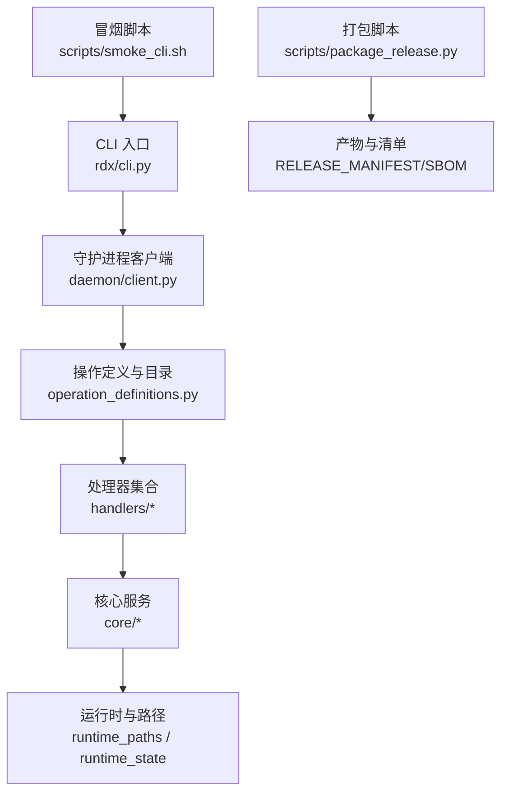
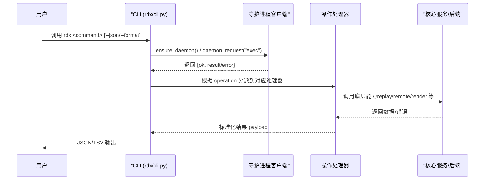
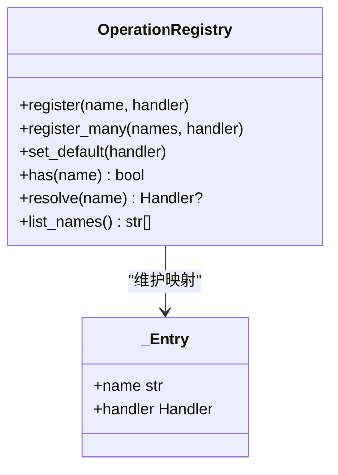
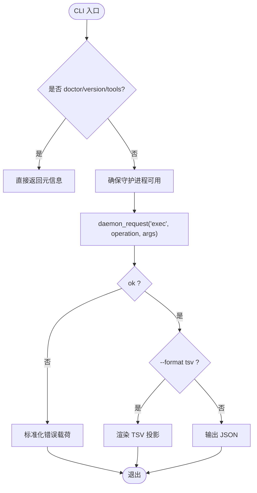
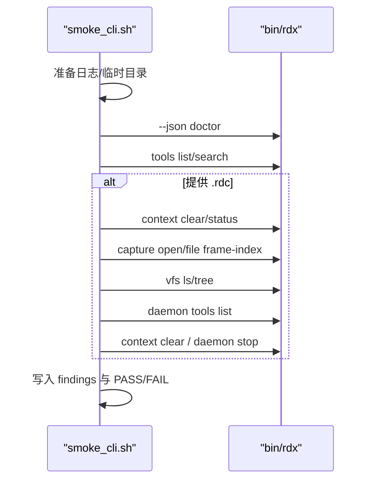
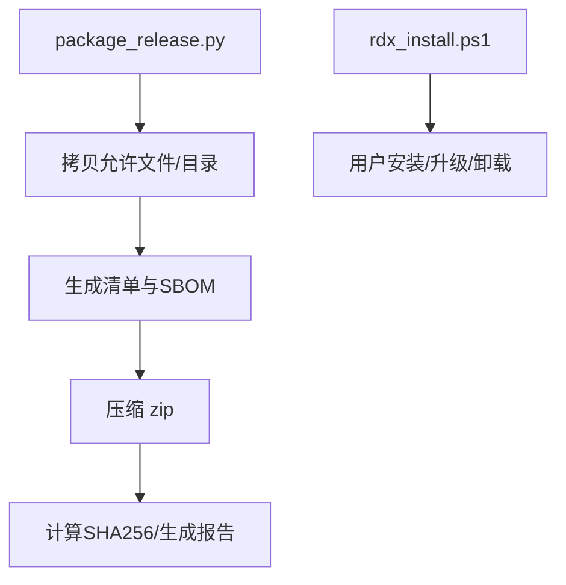
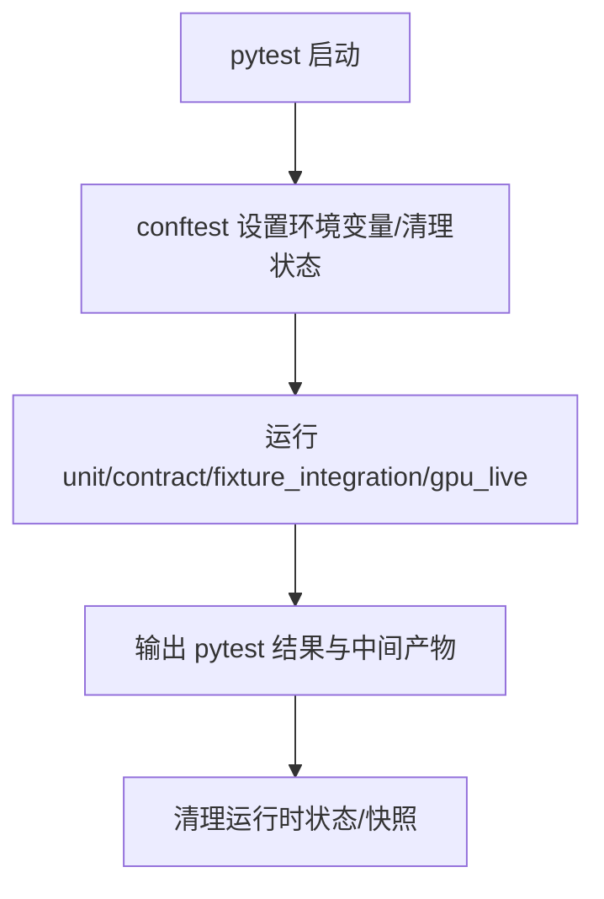
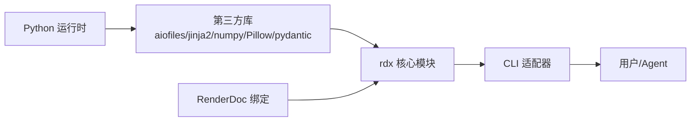

# 开发指南

<cite>
**本文引用的文件**
- [README.md](file://README.md)
- [pyproject.toml](file://pyproject.toml)
- [rdx/operation_definitions.py](file://rdx/operation_definitions.py)
- [rdx/core/operation_registry.py](file://rdx/core/operation_registry.py)
- [rdx/cli.py](file://rdx/cli.py)
- [scripts/smoke_cli.sh](file://scripts/smoke_cli.sh)
- [scripts/package_release.py](file://scripts/package_release.py)
- [docs/install.md](file://docs/install.md)
- [docs/fixture-strategy.md](file://docs/fixture-strategy.md)
- [tests/conftest.py](file://tests/conftest.py)
- [tests/fixtures/README.md](file://tests/fixtures/README.md)
- [scripts/README.md](file://scripts/README.md)
</cite>

## 目录
1. [简介](#简介)
2. [项目结构](#项目结构)
3. [核心组件](#核心组件)
4. [架构总览](#架构总览)
5. [详细组件分析](#详细组件分析)
6. [依赖关系分析](#依赖关系分析)
7. [性能与稳定性](#性能与稳定性)
8. [故障排查指南](#故障排查指南)
9. [结论](#结论)
10. [附录：开发与发布流程](#附录开发与发布流程)

## 简介
本指南面向希望理解并扩展 RDC-Tool（rdx-tools）的开发者。内容涵盖如何添加新操作、实现处理器、编写测试（单元、集成、冒烟）、Fixture 策略、代码规范与最佳实践、构建与发布流程、调试技巧、常见问题与贡献流程，以及完整的开发环境搭建说明。

RDX-Tool 是一个以 JSON 为契约的 CLI 工具集，通过守护进程驱动本地或远程回放能力，暴露统一的 rd.* 操作接口，支持工具发现、上下文管理、捕获/回放、资源与事件浏览、着色器调试、导出与对比等能力。

**章节来源**
- [README.md:1-70](file://README.md#L1-L70)

## 项目结构
仓库采用“功能域 + 运行时”分层组织：
- rdx：核心运行时、CLI 适配、守护进程客户端、工具路由、配置与路径、运行时状态等
- handlers：按领域划分的处理器（buffer/capture/session/pipeline/shader 等）
- core：通用服务（断言、差异、渲染、性能、流水线、会话管理等）
- scripts：冒烟脚本、打包、参考文档生成、发布门禁等
- tests：单元测试、契约测试、集成测试与 Fixture
- binaries：Windows x64 自包含运行环境（Python、RenderDoc 绑定等）
- docs：安装、会话模型、工具参考、Fixture 策略等
- spec：工具目录生成与校验

**图表来源**
- [rdx/cli.py:1-120](file://rdx/cli.py#L1-L120)
- [rdx/operation_definitions.py:1-120](file://rdx/operation_definitions.py#L1-L120)
- [scripts/smoke_cli.sh:1-120](file://scripts/smoke_cli.sh#L1-L120)
- [scripts/package_release.py:1-120](file://scripts/package_release.py#L1-L120)

**章节来源**
- [pyproject.toml:1-45](file://pyproject.toml#L1-L45)
- [scripts/README.md:1-29](file://scripts/README.md#L1-L29)

## 核心组件
- 操作定义与目录：集中声明所有 rd.* 操作的名称、分组、描述、参数 schema、前置条件、作用域与副作用，用于工具发现、文档与契约校验。
- 操作注册表：统一注册与解析操作处理器，支持默认处理器与批量注册。
- CLI 适配器：负责命令解析、JSON 输出、TSV 投影、上下文选择、守护进程通信、错误规范化输出。
- 守护进程客户端：启动/连接守护进程、执行 exec/status、心跳与清理。
- 运行时与路径：提供 artifacts/logs/runtime 目录、Python 布局验证、依赖检查。
- 冒烟脚本：端到端验证 CLI 基本能力与捕获链。
- 打包脚本：生成自包含 Windows x64 包，附带清单与 SBOM。

**章节来源**
- [rdx/operation_definitions.py:1-120](file://rdx/operation_definitions.py#L1-L120)
- [rdx/core/operation_registry.py:1-45](file://rdx/core/operation_registry.py#L1-L45)
- [rdx/cli.py:1-120](file://rdx/cli.py#L1-L120)
- [scripts/smoke_cli.sh:1-120](file://scripts/smoke_cli.sh#L1-L120)
- [scripts/package_release.py:1-120](file://scripts/package_release.py#L1-L120)

## 架构总览
RDX-Tool 采用“CLI -> 守护进程 -> 操作处理器 -> 核心服务/后端”的分层架构。CLI 仅负责参数解析、协议封装与结果渲染；具体业务逻辑在守护进程中由操作处理器完成，并通过核心服务访问 RenderDoc 或其他后端。

**图表来源**
- [rdx/cli.py:230-330](file://rdx/cli.py#L230-L330)
- [rdx/operation_definitions.py:200-300](file://rdx/operation_definitions.py#L200-L300)

## 详细组件分析

### 操作定义与处理器扩展
- 新增操作规范
  - 在操作定义中补充 name、group、description、parameter_raw、returns_raw、param_names、prerequisites、namespace、input_schema、scope、effects、evidence_kind、path_inputs 等字段。
  - 确保 input_schema 严格约束参数类型、必填项与互斥关系，便于契约测试与自动校验。
  - 明确 scope（global/replay）与 effects（如 lifecycle、replay_position、artifact_write），帮助调度与幂等性判断。
- 处理器实现
  - 将操作映射到 handlers 下的具体模块，遵循“单一职责、可测试、可回滚”的原则。
  - 使用核心服务（如 diff_service、perf_service、render_service 等）完成跨模块复用。
  - 对 I/O 与外部依赖进行抽象，便于单元测试与集成测试替换。
- 注册与发现
  - 通过 OperationRegistry 注册处理器，支持 register/register_many/set_default。
  - 工具列表与搜索基于 operation_definitions 生成，新增操作后需重新生成目录。

**图表来源**
- [rdx/core/operation_registry.py:1-45](file://rdx/core/operation_registry.py#L1-L45)

**章节来源**
- [rdx/operation_definitions.py:1-120](file://rdx/operation_definitions.py#L1-L120)
- [rdx/core/operation_registry.py:1-45](file://rdx/core/operation_registry.py#L1-L45)

### CLI 与守护进程交互
- 关键流程
  - 初始化与诊断：doctor 检查依赖、Python 布局、RenderDoc 文件、目录与工具可用性。
  - 工具发现：tools list/search 读取目录并过滤。
  - 上下文管理：context status/update/list/clear 通过守护进程持久化上下文。
  - 操作执行：call/exec 将 operation 与 args 发送至守护进程，统一错误包装与 TSV 投影渲染。
- 错误处理
  - 异常转换为标准错误载荷（code/category/message/details），便于上层消费与自动化判定。
  - TSV 投影缺失时给出恢复建议。

**图表来源**
- [rdx/cli.py:410-560](file://rdx/cli.py#L410-L560)
- [rdx/cli.py:230-395](file://rdx/cli.py#L230-L395)

**章节来源**
- [rdx/cli.py:1-120](file://rdx/cli.py#L1-L120)
- [rdx/cli.py:230-395](file://rdx/cli.py#L230-L395)
- [rdx/cli.py:410-560](file://rdx/cli.py#L410-L560)

### 冒烟测试与端到端验证
- 冒烟脚本覆盖
  - 基础能力：doctor JSON、tools list/search。
  - 捕获链路：context clear/status、capture open/status、context update、vfs ls/tree、daemon tools list。
  - 清理：context clear、daemon stop。
- 超时与日志
  - 支持步骤级超时与打开超时，记录命令与结果，失败时输出上下文状态摘要。
- 报告
  - 生成 findings 文件，包含上下文、RDC 路径/大小/哈希、命令序列与最终状态。

**图表来源**
- [scripts/smoke_cli.sh:228-264](file://scripts/smoke_cli.sh#L228-L264)

**章节来源**
- [scripts/smoke_cli.sh:1-120](file://scripts/smoke_cli.sh#L1-L120)
- [scripts/smoke_cli.sh:228-264](file://scripts/smoke_cli.sh#L228-L264)

### 构建系统与发布流程
- 包构建
  - 复制允许的文件与目录，排除测试与缓存，生成 RELEASE_MANIFEST.json、LICENSE_INVENTORY.json、SBOM.json。
  - 压缩为 rdx-tools-<version>-windows-x64.zip，并输出 SHA256SUMS 与 release_report.md。
- 版本与平台
  - 版本号来自 pyproject 中的 __version__，平台固定 windows-x64。
- 安装与升级
  - 提供 PowerShell 安装脚本，支持 install/upgrade/uninstall/doctor，可 DryRun 预览 PATH 变更。

**图表来源**
- [scripts/package_release.py:86-157](file://scripts/package_release.py#L86-L157)
- [scripts/package_release.py:168-215](file://scripts/package_release.py#L168-L215)
- [docs/install.md:1-31](file://docs/install.md#L1-L31)

**章节来源**
- [scripts/package_release.py:1-120](file://scripts/package_release.py#L1-L120)
- [scripts/package_release.py:168-215](file://scripts/package_release.py#L168-L215)
- [docs/install.md:1-31](file://docs/install.md#L1-L31)

### 测试策略与 Fixture
- 测试分层
  - 单元与契约测试：使用 fake controller、mock payload、schema 校验与目录一致性检查。
  - Fixture 集成测试：使用仓库内公开的小体积 .rdc 捕获，保证确定性。
  - GPU 在线测试：需要真实 RenderDoc/GPU/远程环境，不作为默认门禁。
- Fixture 规则
  - 仅允许小体积、来源清晰、许可明确的公共捕获。
  - 禁止提交私有/大型捕获与绝对路径。
  - 记录文件名、大小、SHA256、来源与许可。
- 测试隔离
  - conftest 设置中间目录、清理运行时状态与快照，避免测试间污染。

**图表来源**
- [tests/conftest.py:1-46](file://tests/conftest.py#L1-L46)
- [docs/fixture-strategy.md:1-28](file://docs/fixture-strategy.md#L1-L28)
- [tests/fixtures/README.md:1-26](file://tests/fixtures/README.md#L1-L26)

**章节来源**
- [tests/conftest.py:1-46](file://tests/conftest.py#L1-L46)
- [docs/fixture-strategy.md:1-28](file://docs/fixture-strategy.md#L1-L28)
- [tests/fixtures/README.md:1-26](file://tests/fixtures/README.md#L1-L26)

## 依赖关系分析
- 运行时依赖
  - Python >= 3.11，必要库包括 aiofiles、jinja2、numpy、Pillow、pydantic。
  - Windows x64 自包含包内置 Python 与 RenderDoc 绑定，无需用户额外安装。
- 工具链
  - SPIRV 工具可选（spirv-as/spirv-dis），用于着色器相关能力。
- 目录与路径
  - 通过 runtime_paths 统一管理 artifacts/logs/runtime 等目录，便于测试与发布隔离。

**图表来源**
- [pyproject.toml:1-45](file://pyproject.toml#L1-L45)
- [rdx/cli.py:410-560](file://rdx/cli.py#L410-L560)

**章节来源**
- [pyproject.toml:1-45](file://pyproject.toml#L1-L45)
- [rdx/cli.py:410-560](file://rdx/cli.py#L410-L560)

## 性能与稳定性
- 超时控制
  - 冒烟脚本支持步骤级超时与 capture open 超时，防止长时间阻塞。
  - CLI 对 daemon_exec 使用动态超时策略，依据 operation 与参数调整。
- 资源管理
  - 上下文与运行时状态在测试与冒烟结束时清理，避免泄漏。
  - 打包脚本排除测试与缓存，减小产物体积。
- 可观测性
  - 提供 logs、metrics、tool graph、operation history 等能力，便于定位问题与优化。

[本节为通用指导，不直接分析具体文件]

## 故障排查指南
- 常见症状与定位
  - doctor 失败：检查依赖、Python 布局、RenderDoc 文件是否存在。
  - 守护进程状态异常：查看 daemon status，必要时清理 stale state。
  - TSV 投影缺失：确认操作是否返回 tabular projection，否则退回 JSON。
- 日志与证据
  - 冒烟脚本会记录命令与结果，失败时输出上下文状态摘要与 findings 文件。
  - 可通过 core.get_logs 获取内部日志，结合 tool graph 与 operation history 定位。
- 修复建议
  - 修复依赖或路径问题后重新运行 smoke。
  - 若涉及捕获损坏或会话不一致，尝试关闭并重建 session。

**章节来源**
- [scripts/smoke_cli.sh:162-227](file://scripts/smoke_cli.sh#L162-L227)
- [rdx/cli.py:267-330](file://rdx/cli.py#L267-L330)
- [rdx/cli.py:330-395](file://rdx/cli.py#L330-L395)

## 结论
RDX-Tool 通过清晰的 JSON 契约、统一的 CLI 与守护进程架构、完善的冒烟与打包流程，提供了稳定可扩展的 RenderDoc 工具运行时。开发者应遵循操作定义规范、处理器实现约定与测试分层策略，配合 Fixture 与隔离机制，持续增强工具能力并保持向后兼容。

[本节为总结性内容，不直接分析具体文件]

## 附录：开发与发布流程

### 开发环境搭建
- 基础要求
  - Python >= 3.11，建议使用仓库提供的自包含包或本地虚拟环境。
  - Windows x64 环境下可直接使用二进制包；非 Windows 环境需自行准备 RenderDoc 绑定。
- 安装与验证
  - 解压包后运行安装脚本进行安装/升级/卸载/doctor。
  - 使用 rdx --json doctor 验证环境与依赖。
- 运行冒烟
  - 使用 bash scripts/smoke_cli.sh 进行基础冒烟；如需捕获链路，传入 --rdc 指定捕获路径。

**章节来源**
- [docs/install.md:1-31](file://docs/install.md#L1-L31)
- [scripts/README.md:1-29](file://scripts/README.md#L1-L29)
- [scripts/smoke_cli.sh:228-264](file://scripts/smoke_cli.sh#L228-L264)

### 添加新操作（步骤清单）
- 在 operation_definitions.py 中新增操作条目，完善 schema、前置条件与作用域。
- 在 handlers 下实现处理器逻辑，优先复用 core 服务。
- 通过 OperationRegistry 注册处理器（如适用）。
- 更新工具目录与参考文档（由脚本自动生成）。
- 编写单元测试与契约测试，必要时增加 fixture 集成测试。
- 运行冒烟脚本验证端到端流程。

**章节来源**
- [rdx/operation_definitions.py:1-120](file://rdx/operation_definitions.py#L1-L120)
- [rdx/core/operation_registry.py:1-45](file://rdx/core/operation_registry.py#L1-L45)
- [scripts/README.md:1-29](file://scripts/README.md#L1-L29)

### 测试编写要点
- 单元测试
  - 针对纯函数与无副作用逻辑，使用 mock/fake 输入输出。
  - 使用 markers 标记 unit/contract 用例，便于快速回归。
- 集成测试
  - 使用 fixtures/ 中的公开捕获进行确定性验证。
  - 通过 conftest 隔离运行时状态，避免交叉影响。
- 冒烟测试
  - 覆盖 doctor、工具发现、捕获链路与清理。
  - 记录日志与 findings，便于 CI 与人工复核。

**章节来源**
- [tests/conftest.py:1-46](file://tests/conftest.py#L1-L46)
- [docs/fixture-strategy.md:1-28](file://docs/fixture-strategy.md#L1-L28)
- [scripts/smoke_cli.sh:228-264](file://scripts/smoke_cli.sh#L228-L264)

### 代码规范与最佳实践
- 命名约定
  - 模块与函数使用小写下划线；类名使用大驼峰；常量全大写。
- 错误处理
  - 统一使用 canonical_error/canonical_success 包装结果，携带 code/category/message/details。
  - 对外部依赖调用进行 try/except 包裹，提供可恢复提示。
- 性能优化
  - 避免在大对象上频繁序列化；合理使用 artifact 文件存储大数据。
  - 使用 TSV 投影减少传输开销；限制 max_elements/max_lines 等参数。
- 可测试性
  - 将 I/O 与外部依赖抽象为接口或服务，便于替换与模拟。
  - 保持处理器无状态或显式状态管理，利于并发与重试。

[本节为通用指导，不直接分析具体文件]

### 构建与发布
- 构建包
  - 运行 scripts/package_release.py 生成 zip 包与清单。
  - 校验版本号与平台，输出 SHA256 与报告。
- 发布门禁
  - 使用 release_gate.py 检查冒烟报告与打包产物。
  - 确保 tests/fixtures 与 .rdc 不被包含进发布包。

**章节来源**
- [scripts/package_release.py:168-215](file://scripts/package_release.py#L168-L215)
- [scripts/README.md:1-29](file://scripts/README.md#L1-L29)

### 调试技巧
- 启用更高日志级别：通过 core.set_log_level 提升日志粒度。
- 查看最近操作历史：core.get_operation_history 过滤 running/completed/failed。
- 获取运行时指标：core.get_runtime_metrics 查看限制、指标与恢复摘要。
- 可视化依赖图：core.get_tool_graph 辅助 Agent 选择合适的主接口与导航层。

**章节来源**
- [rdx/operation_definitions.py:324-424](file://rdx/operation_definitions.py#L324-L424)

### 贡献与审查流程
- 提交前自检
  - 运行冒烟脚本与单元测试，确保无回归。
  - 更新操作定义与目录，确保工具发现一致。
- 审查关注点
  - 契约兼容性：input_schema、返回值结构与错误码。
  - 安全性：避免泄露敏感信息与绝对路径。
  - 可维护性：模块化、注释与测试覆盖率。

[本节为通用指导，不直接分析具体文件]