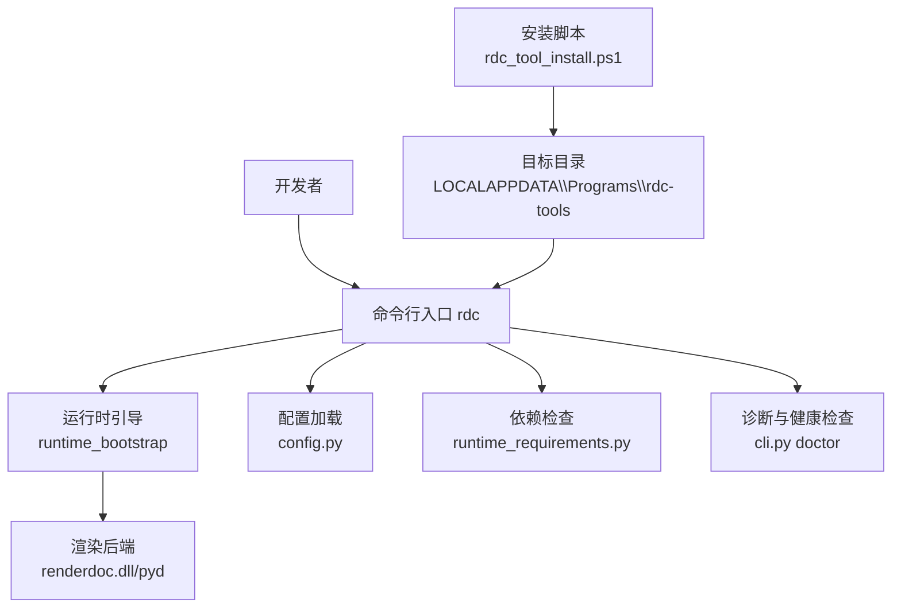
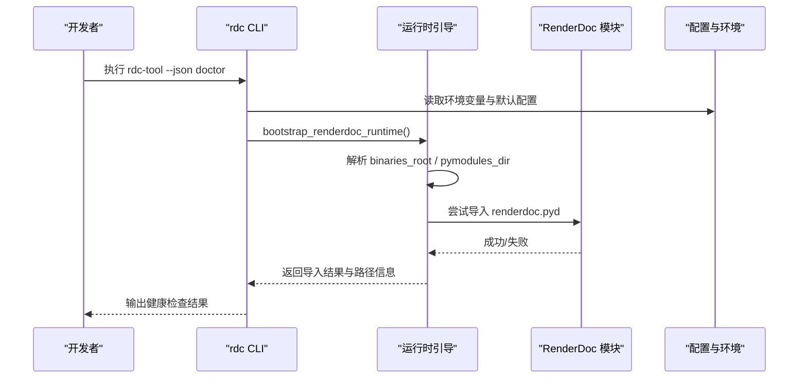
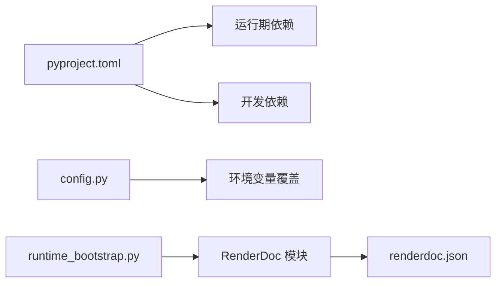

# 开发环境搭建

<cite>
**本文引用的文件**
- [README.md](file://README.md)
- [pyproject.toml](file://pyproject.toml)
- [docs/install.md](file://docs/install.md)
- [docs/quickstart.md](file://docs/quickstart.md)
- [docs/troubleshooting.md](file://docs/troubleshooting.md)
- [scripts/rdc_tool_install.ps1](file://scripts/rdc_tool_install.ps1)
- [rdc_tool/config.py](file://rdc_tool/config.py)
- [rdc_tool/runtime_requirements.py](file://rdc_tool/runtime_requirements.py)
- [rdc_tool/runtime_bootstrap.py](file://rdc_tool/runtime_bootstrap.py)
- [rdc_tool/cli.py](file://rdc_tool/cli.py)
- [tests/conftest.py](file://tests/conftest.py)
- [binaries/windows/x64/renderdoc.json](file://binaries/windows/x64/renderdoc.json)
</cite>

## 目录
1. [简介](#简介)
2. [项目结构](#项目结构)
3. [核心组件](#核心组件)
4. [架构总览](#架构总览)
5. [详细组件分析](#详细组件分析)
6. [依赖关系分析](#依赖关系分析)
7. [性能注意事项](#性能注意事项)
8. [故障排查指南](#故障排查指南)
9. [结论](#结论)
10. [附录](#附录)

## 简介
本指南面向希望在本地快速搭建 RDC-Tool（rdc-tools）开发环境的开发者。项目提供自包含的 Windows x64 发布包，默认无需安装系统 Python；同时支持在源码环境下进行开发与测试。文档涵盖：
- Python 环境与版本要求、必要系统依赖
- 依赖安装与虚拟环境配置
- 推荐 IDE、调试器与代码格式化设置
- 本地开发工作流（修改、测试、调试）
- RenderDoc 环境配置（驱动与工具）
- 常见问题定位与解决
- Docker 容器化开发选项
- 贡献代码前的准备与审查流程

## 项目结构
仓库采用“功能域 + 运行时”组织方式：
- rdc：核心逻辑、CLI、服务、运行时引导与配置
- binaries/windows/x64：自包含的运行时（Python、RenderDoc 模块、DLL）
- scripts：安装、打包、校验脚本
- tests：单元测试与集成测试
- docs：用户与开发者文档
- spec：工具目录与校验

图表来源
- [rdc_tool/cli.py:412-513](file://rdc_tool/cli.py#L412-L513)
- [rdc_tool/runtime_bootstrap.py:105-130](file://rdc_tool/runtime_bootstrap.py#L105-L130)
- [scripts/rdc_tool_install.ps1:141-167](file://scripts/rdc_tool_install.ps1#L141-L167)

章节来源
- [README.md:1-70](file://README.md#L1-L70)
- [docs/install.md:1-31](file://docs/install.md#L1-L31)
- [pyproject.toml:1-45](file://pyproject.toml#L1-L45)

## 核心组件
- CLI 入口与健康检查：通过 rdc 命令暴露操作，doctor 子命令用于环境自检（Python、RenderDoc 布局、工具链、守护进程状态）。
- 运行时引导：自动解析并注册二进制与 Python 模块路径，必要时将 DLL 目录加入系统搜索路径，确保 renderdoc.pyd 可被导入。
- 配置系统：集中管理后端类型、GPU 选择、工件存储、数据库路径、报告输出、限制策略等，并通过环境变量覆盖。
- 依赖检测：声明运行期必需依赖，并提供缺失依赖清单。
- 安装脚本：Windows 下将源码或发布包复制到目标目录，可选写入 PATH，并执行 doctor 验证。

章节来源
- [rdc_tool/cli.py:412-513](file://rdc_tool/cli.py#L412-L513)
- [rdc_tool/runtime_bootstrap.py:105-130](file://rdc_tool/runtime_bootstrap.py#L105-L130)
- [rdc_tool/config.py:117-186](file://rdc_tool/config.py#L117-L186)
- [rdc_tool/runtime_requirements.py:7-13](file://rdc_tool/runtime_requirements.py#L7-L13)
- [scripts/rdc_tool_install.ps1:141-167](file://scripts/rdc_tool_install.ps1#L141-L167)

## 架构总览
下图展示了从命令行到渲染后端的启动链路，以及关键的环境变量与路径解析过程。

图表来源
- [rdc_tool/cli.py:412-513](file://rdc_tool/cli.py#L412-L513)
- [rdc_tool/runtime_bootstrap.py:105-130](file://rdc_tool/runtime_bootstrap.py#L105-L130)
- [rdc_tool/config.py:135-186](file://rdc_tool/config.py#L135-L186)

## 详细组件分析

### 环境要求与依赖
- Python 版本：项目要求 Python >= 3.11。
- 运行期依赖：pydantic、numpy、Pillow、jinja2、aiofiles。
- 可选开发依赖：pytest（用于测试）。
- 工具链：spirv-as/spirv-dis（可选，用于 SPIR-V 汇编/反汇编场景）。

建议：
- 使用独立虚拟环境隔离依赖，便于切换不同 Python 版本。
- 若使用源码开发，请确保已安装上述依赖；若使用发布包，则无需额外安装 Python。

章节来源
- [pyproject.toml:5-27](file://pyproject.toml#L5-L27)
- [rdc_tool/runtime_requirements.py:7-13](file://rdc_tool/runtime_requirements.py#L7-L13)
- [rdc_tool/cli.py:452-489](file://rdc_tool/cli.py#L452-L489)

### 安装与升级（Windows）
- 发布包为自包含 zip，解压后通过 PowerShell 脚本安装或升级，可选择将安装目录加入用户 PATH。
- 安装完成后执行 doctor 以验证环境。
- 卸载时仅移除由脚本管理的目录与 PATH 条目。

步骤要点：
- 指定安装目录（默认 LOCALAPPDATA\Programs\rdc-tools）。
- 使用 -AddToPath 将工具目录加入用户 PATH。
- 使用 -DryRun 预览实际动作。

章节来源
- [docs/install.md:5-31](file://docs/install.md#L5-L31)
- [scripts/rdc_tool_install.ps1:141-167](file://scripts/rdc_tool_install.ps1#L141-L167)

### 源码开发环境搭建
- 克隆仓库后，建议使用 Python >= 3.11 创建虚拟环境。
- 安装运行期依赖与开发依赖（pytest）。
- 如需本地调试 RenderDoc 绑定，需确保 binaries/windows/x64 下的 Python 模块与 DLL 可用，或通过环境变量指向自定义路径。
- 测试前可通过 conftest 设置的中间目录与运行时路径隔离状态。

章节来源
- [pyproject.toml:5-27](file://pyproject.toml#L5-L27)
- [tests/conftest.py:10-27](file://tests/conftest.py#L10-L27)

### RenderDoc 环境配置
- 发布包内包含 renderdoc.dll、renderdoc.json、renderdoc.pyd，位于 binaries/windows/x64 及其 pymodules 子目录。
- 运行时引导会优先使用环境变量 RDC_TOOL_RUNTIME_DLL_DIR 与 RDC_TOOL_RENDERDOC_PATH 指定路径；未设置时使用默认位置。
- 在 Windows 上，引导过程会将二进制目录注册为 DLL 搜索目录，避免动态库加载失败。
- Vulkan 层配置文件 renderdoc.json 定义了层名称、库路径、API 版本及启用/禁用环境变量。

章节来源
- [rdc_tool/runtime_bootstrap.py:42-57](file://rdc_tool/runtime_bootstrap.py#L42-L57)
- [rdc_tool/runtime_bootstrap.py:70-89](file://rdc_tool/runtime_bootstrap.py#L70-L89)
- [binaries/windows/x64/renderdoc.json:1-49](file://binaries/windows/x64/renderdoc.json#L1-L49)

### 配置与环境变量
- 配置项包括后端类型、GPU 选择、工件存储路径、数据库路径、报告输出、限制策略、自适应二分搜索等。
- 常用环境变量：
  - RDC_TOOL_RENDERDOC_PATH：指定 RenderDoc Python 模块路径
  - RDC_TOOL_RUNTIME_DLL_DIR：指定运行时 DLL 目录
  - RDC_TOOL_ARTIFACT_STORE / RDC_TOOL_DATA_DIR / RDC_TOOL_REPORT_DIR：分别覆盖工件、数据库、报告输出路径
  - RDC_TOOL_LOG_LEVEL：日志级别
  - RDC_TOOL_GPU_VENDOR：GPU 厂商过滤
  - RDC_TOOL_SPIRV_TOOLS_PATH：SPIR-V 工具路径
  - RDC_TOOL_HEADLESS：无头模式开关
  - 其他 bisect、快照保留、运行时限制相关变量

章节来源
- [rdc_tool/config.py:16-131](file://rdc_tool/config.py#L16-L131)
- [rdc_tool/config.py:135-186](file://rdc_tool/config.py#L135-L186)

### 本地开发工作流程
- 快速开始：从 resources/tools 或使用 bin/rdc-tool 执行示例命令，查看上下文状态、打开捕获、浏览事件与资源。
- 守护进程：部分命令通过守护进程执行，超时或异常时会打印失败命令、守护进程状态与上下文信息。
- 预览：打开捕获后可启用预览，注意 preview.display 应反映完整帧缓冲而非视口裁剪。
- Smoke 测试：通过 bash 脚本执行端到端冒烟，支持传入 .rdc 路径与上下文标识。

章节来源
- [docs/quickstart.md:1-49](file://docs/quickstart.md#L1-L49)
- [README.md:29-39](file://README.md#L29-L39)

### 调试技巧
- 使用 rdc-tool --json doctor 获取环境诊断信息（工具根、Python 运行时、RenderDoc 布局、目录、守护进程状态）。
- 使用 rdc-tool context status --json 查看当前上下文与会话状态；必要时清理上下文并重新打开捕获。
- 对于远程回放，关注 remote_handle_consumed 标志，避免重用已被占用的句柄。
- 着色器替换：先读取 edit_plan，再编辑文本；当需要原始 SPIR-V ASM 时，确保 spirv-as 可用。

章节来源
- [docs/troubleshooting.md:1-58](file://docs/troubleshooting.md#L1-L58)
- [rdc_tool/cli.py:412-513](file://rdc_tool/cli.py#L412-L513)

### 测试运行
- 测试标记：unit、contract、fixture_integration、gpu_live。
- 测试前会设置中间目录与运行时路径，并在用例前后清理上下文状态与快照，保证隔离性。
- 建议在虚拟环境中安装 pytest，并按需运行特定标记的测试集。

章节来源
- [pyproject.toml:36-44](file://pyproject.toml#L36-L44)
- [tests/conftest.py:10-46](file://tests/conftest.py#L10-L46)

### Docker 容器化开发
- 项目未提供内置 Dockerfile；可在容器中安装 Python 与依赖，挂载源码目录进行开发与测试。
- 由于 RenderDoc 与 GPU 交互依赖宿主驱动与运行时，容器内通常无法直接访问 GPU 设备；适合运行纯 Python 逻辑与单元测试。
- 若需在容器中进行 GPU 相关测试，需结合宿主机驱动与设备映射（例如 NVIDIA Container Toolkit），并确保 RenderDoc 模块与 DLL 路径正确。

[本节为概念性说明，不直接分析具体文件]

### 贡献代码前的准备与审查流程
- 环境准备：确保 Python 版本满足要求，安装依赖，运行 smoke 与测试集，确认 doctor 通过。
- 提交前自检：更新文档与变更说明，保持工具目录与依赖一致。
- 代码审查：遵循仓库治理与文档规范，确保接口契约与行为稳定。

章节来源
- [README.md:52-65](file://README.md#L52-L65)
- [pyproject.toml:36-44](file://pyproject.toml#L36-L44)

## 依赖关系分析
- 构建系统：setuptools、wheel。
- 运行期依赖：pydantic、numpy、Pillow、jinja2、aiofiles。
- 开发依赖：pytest。
- 外部工具：spirv-as/spirv-dis（可选）。
- 运行时路径：通过环境变量或默认路径解析 binaries_root 与 pymodules_dir。

图表来源
- [pyproject.toml:1-27](file://pyproject.toml#L1-L27)
- [rdc_tool/config.py:135-186](file://rdc_tool/config.py#L135-L186)
- [rdc_tool/runtime_bootstrap.py:42-57](file://rdc_tool/runtime_bootstrap.py#L42-L57)
- [binaries/windows/x64/renderdoc.json:1-49](file://binaries/windows/x64/renderdoc.json#L1-L49)

章节来源
- [pyproject.toml:1-27](file://pyproject.toml#L1-L27)
- [rdc_tool/runtime_requirements.py:7-13](file://rdc_tool/runtime_requirements.py#L7-L13)

## 性能注意事项
- 合理设置运行时限制（最大上下文数、会话数、捕获文件大小、估计内存等），避免资源耗尽。
- 在无头模式下减少 GUI 开销，提升批量任务效率。
- 控制工件存储大小与压缩策略，平衡磁盘占用与检索速度。
- 使用日志级别调节输出量，生产环境建议 INFO 及以上。

章节来源
- [rdc_tool/config.py:82-131](file://rdc_tool/config.py#L82-L131)

## 故障排查指南
- 首查：执行 rdc-tool --json doctor，检查 Python、RenderDoc 布局、工具链与守护进程状态。
- 会话状态：使用 context status 与 context clear 恢复；必要时重新打开捕获。
- 远程生命周期：出现 remote_handle_consumed 时，避免重用句柄，按远程工作流重连。
- 着色器替换：确保 SPIR-V 工具可用，遵循 edit_plan 与源格式要求。
- 纹理导出：明确 file_format 参数；PNG 为显示映射输出，不代表 HDR 数据证据。
- Android 连接：复用已有辅助进程，网络就绪后重试；避免强制停止用户服务。
- 恢复查询失败：区分缩略图缺失、初始化溯源缺失、GPU 时间戳覆盖不足与读回失败；必要时关闭并重建会话。

章节来源
- [docs/troubleshooting.md:1-58](file://docs/troubleshooting.md#L1-L58)
- [rdc_tool/cli.py:412-513](file://rdc_tool/cli.py#L412-L513)

## 结论
RDC-Tool 提供自包含的 Windows 发布包与源码开发能力。通过标准安装脚本与 doctor 诊断，可快速完成环境搭建；借助运行时引导与配置系统，能灵活适配不同部署场景。建议开发者在虚拟环境中进行源码开发，使用测试与冒烟脚本保障质量，并结合故障排查指南高效定位问题。

## 附录

### 常见环境问题与解决方案
- 权限问题：安装脚本修改用户 PATH 需要相应权限；如遇拒绝，请以管理员身份运行 PowerShell。
- 路径配置：通过 RDC_TOOL_RUNTIME_DLL_DIR 与 RDC_TOOL_RENDERDOC_PATH 显式指定路径，避免默认路径冲突。
- 依赖冲突：使用虚拟环境隔离依赖；发布包自带 Python 与模块，无需系统 Python。
- RenderDoc 加载失败：确认 binaries/windows/x64 下存在 renderdoc.dll 与 renderdoc.pyd，且引导过程已成功注册 DLL 目录。

章节来源
- [scripts/rdc_tool_install.ps1:88-117](file://scripts/rdc_tool_install.ps1#L88-L117)
- [rdc_tool/runtime_bootstrap.py:70-89](file://rdc_tool/runtime_bootstrap.py#L70-L89)