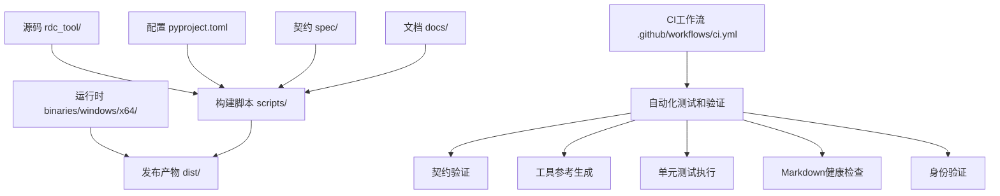
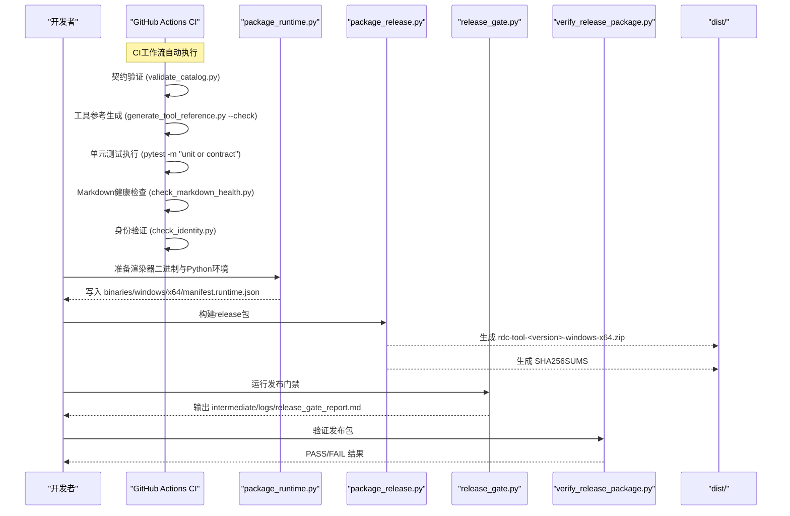
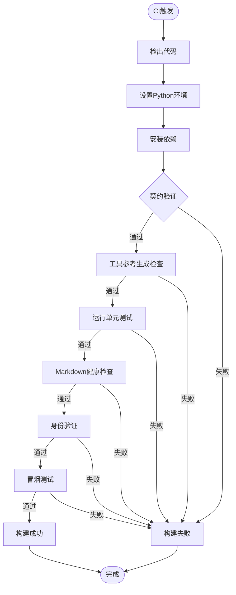
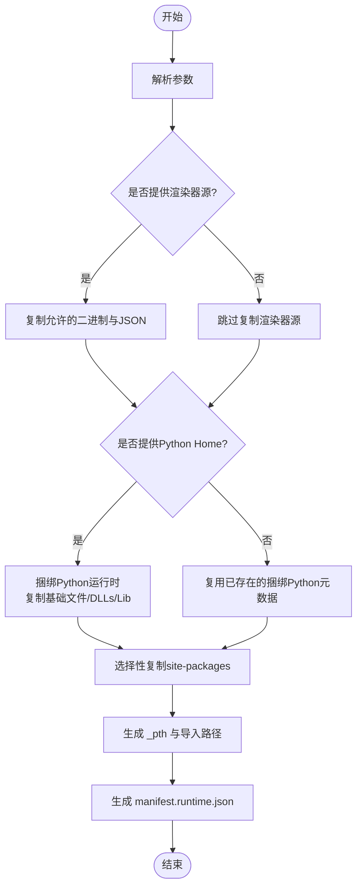
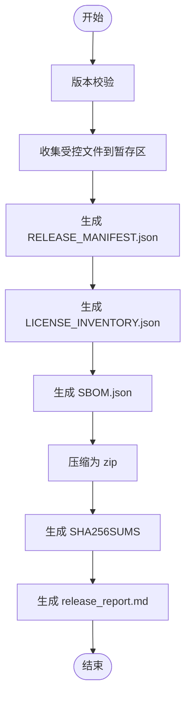
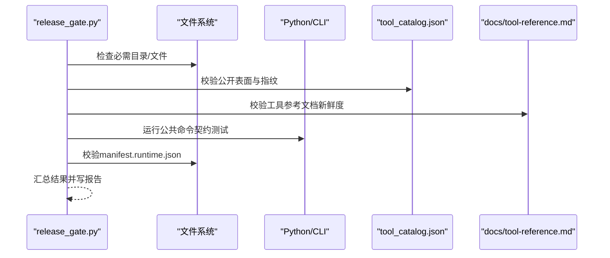
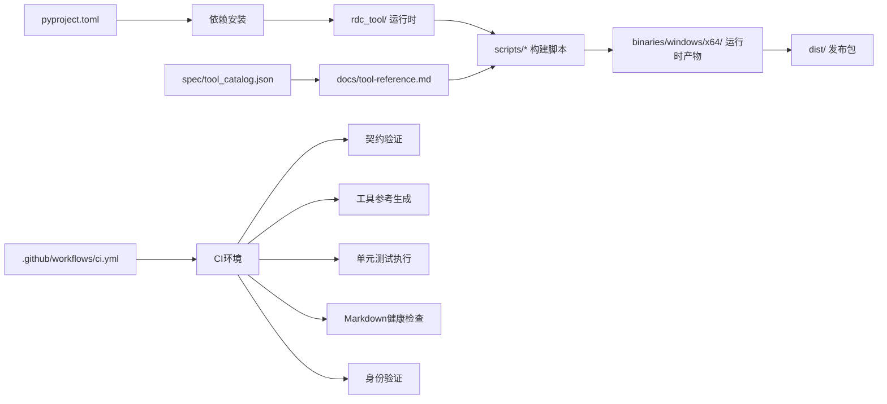

# 构建和发布

<cite>
**本文引用的文件**
- [pyproject.toml](file://pyproject.toml)
- [rdc_tool/__init__.py](file://rdc_tool/__init__.py)
- [scripts/package_release.py](file://scripts/package_release.py)
- [scripts/package_runtime.py](file://scripts/package_runtime.py)
- [scripts/release_gate.py](file://scripts/release_gate.py)
- [scripts/generate_release_checksums.py](file://scripts/generate_release_checksums.py)
- [scripts/verify_release_package.py](file://scripts/verify_release_package.py)
- [scripts/_shared.py](file://scripts/_shared.py)
- [scripts/generate_tool_reference.py](file://scripts/generate_tool_reference.py)
- [scripts/check_identity.py](file://scripts/check_identity.py)
- [scripts/check_markdown_health.py](file://scripts/check_markdown_health.py)
- [spec/validate_catalog.py](file://spec/validate_catalog.py)
- [.github/workflows/ci.yml](file://.github/workflows/ci.yml)
- [rdc_tool/runtime_requirements.py](file://rdc_tool/runtime_requirements.py)
- [rdc_tool/python_runtime.py](file://rdc_tool/python_runtime.py)
- [bin/rdc-tool.cmd](file://bin/rdc-tool.cmd)
- [spec/tool_catalog.json](file://spec/tool_catalog.json)
</cite>

## 更新摘要
**所做更改**
- 新增GitHub Actions CI工作流章节，详细说明自动化测试和验证流程
- 更新构建系统配置部分，包含CI环境特定的设置
- 增强发布前检查清单，集成CI中的各种验证步骤
- 添加CI流水线自动化说明，包括契约验证、工具参考生成、单元测试等
- 更新故障排查指南，包含CI相关的错误处理

## 目录
1. [简介](#简介)
2. [项目结构](#项目结构)
3. [核心组件](#核心组件)
4. [架构总览](#架构总览)
5. [详细组件分析](#详细组件分析)
6. [依赖关系分析](#依赖关系分析)
7. [性能考虑](#性能考虑)
8. [故障排查指南](#故障排查指南)
9. [结论](#结论)
10. [附录](#附录)

## 简介
本指南面向RDC-Tool项目的构建与发布，覆盖以下主题：
- 构建系统配置与依赖管理（基于pyproject.toml）
- GitHub Actions CI工作流自动化（测试、验证、发布流程）
- 打包脚本使用方式（release包与runtime包）
- 版本管理策略（版本号规则与变更日志维护）
- 发布前检查清单（代码质量、测试验证、文档更新）
- 二进制打包与签名（Windows平台特殊处理）
- 自动化脚本说明（发布流水线）
- 回滚策略与发布后验证
- 第三方依赖许可证合规检查与SBOM生成

## 项目结构
本项目采用"源码+脚本+产物"的清晰分层：
- 源码位于 rdc_tool/ 与 cli/，通过 pyproject.toml 暴露命令行入口
- 构建与发布脚本集中在 scripts/，负责打包、校验、生成清单与校验和
- 运行时二进制与Python环境打包在 binaries/windows/x64/
- 工具目录规范与契约定义在 spec/ 与 docs/
- CI工作流配置在 .github/workflows/ci.yml，自动化测试和验证流程

**图表来源**
- [pyproject.toml:1-45](file://pyproject.toml#L1-L45)
- [scripts/package_release.py:1-215](file://scripts/package_release.py#L1-L215)
- [scripts/package_runtime.py:1-355](file://scripts/package_runtime.py#L1-L355)
- [.github/workflows/ci.yml:1-45](file://.github/workflows/ci.yml#L1-L45)

**章节来源**
- [pyproject.toml:1-45](file://pyproject.toml#L1-L45)

## 核心组件
- 构建系统与依赖声明：pyproject.toml 定义了构建后端、包名、版本、Python版本要求、依赖与可选依赖，并注册了命令行入口。
- **新增** GitHub Actions CI工作流：自动化测试、验证和发布流程，包括契约验证、工具参考生成、单元测试、Markdown健康检查和身份验证。
- 版本来源：包版本由 rdc_tool/__init__.py 中的 __version__ 提供，打包脚本会读取该值用于产物命名与元数据。
- Runtime打包：scripts/package_runtime.py 将外部RenderDoc二进制与捆绑的CPython运行时复制到 binaries/windows/x64/，并生成 manifest.runtime.json。
- Release打包：scripts/package_release.py 从仓库根复制受控文件到暂存区，生成RELEASE_MANIFEST.json、LICENSE_INVENTORY.json、SBOM.json，并压缩为zip。
- 发布门禁：scripts/release_gate.py 执行结构与内容检查、运行公共命令契约测试、校验manifest与打包一致性、生成报告。
- 包验证：scripts/verify_release_package.py 解压并验证发布包的完整性、入口点、许可证清单、SBOM、公共命令契约等。
- **新增** 身份验证：scripts/check_identity.py 检查废弃的身份引用，确保代码库中不包含旧的rdx-tools相关标识。
- **新增** Markdown健康检查：scripts/check_markdown_health.py 验证文档编码、链接完整性和内容一致性。
- **新增** 契约验证：spec/validate_catalog.py 验证tool_catalog.json的结构和内容正确性。
- 辅助工具：scripts/_shared.py 提供路径解析、子进程调用、JSON读写等通用能力；scripts/generate_tool_reference.py 从代码生成工具参考文档；scripts/generate_release_checksums.py 生成SHA256校验和。

**章节来源**
- [pyproject.toml:1-45](file://pyproject.toml#L1-L45)
- [.github/workflows/ci.yml:1-45](file://.github/workflows/ci.yml#L1-L45)
- [rdc_tool/__init__.py:1-4](file://rdc_tool/__init__.py#L1-L4)
- [scripts/package_runtime.py:1-355](file://scripts/package_runtime.py#L1-L355)
- [scripts/package_release.py:1-215](file://scripts/package_release.py#L1-L215)
- [scripts/release_gate.py:1-678](file://scripts/release_gate.py#L1-L678)
- [scripts/verify_release_package.py:1-337](file://scripts/verify_release_package.py#L1-L337)
- [scripts/check_identity.py:1-29](file://scripts/check_identity.py#L1-L29)
- [scripts/check_markdown_health.py:1-243](file://scripts/check_markdown_health.py#L1-L243)
- [spec/validate_catalog.py:1-162](file://spec/validate_catalog.py#L1-L162)
- [scripts/_shared.py:1-92](file://scripts/_shared.py#L1-L92)
- [scripts/generate_tool_reference.py:1-140](file://scripts/generate_tool_reference.py#L1-L140)
- [scripts/generate_release_checksums.py:1-56](file://scripts/generate_release_checksums.py#L1-L56)

## 架构总览
下图展示了从源码到发布产物的完整流程，包括GitHub Actions CI工作流的自动化测试和验证，以及Runtime打包、Release打包、门禁校验与包验证。

**图表来源**
- [.github/workflows/ci.yml:12-26](file://.github/workflows/ci.yml#L12-L26)
- [scripts/package_runtime.py:288-350](file://scripts/package_runtime.py#L288-L350)
- [scripts/package_release.py:168-210](file://scripts/package_release.py#L168-L210)
- [scripts/release_gate.py:520-673](file://scripts/release_gate.py#L520-L673)
- [scripts/verify_release_package.py:301-332](file://scripts/verify_release_package.py#L301-L332)

## 详细组件分析

### 构建系统与依赖管理（pyproject.toml）
- 构建后端：使用 setuptools.build_meta，要求 setuptools>=68 与 wheel。
- 包信息：name=rdc-tools，version来自 rdc_tool/__init__.py，requires-python>=3.11，license=Apache-2.0。
- 依赖：aiofiles、jinja2、numpy、Pillow、pydantic。
- 可选依赖：dev包含pytest。
- 入口点：注册 rdc 命令指向 rdc_tool.cli:main。
- 包发现：setuptools.packages.find 包含 rdc*。
- pytest配置：测试路径tests，忽略.git、intermediate、binaries，定义标记unit/contract/fixture_integration/gpu_live。
- **新增** CI环境支持：CI工作流使用Python 3.14进行构建和测试。

**章节来源**
- [pyproject.toml:1-45](file://pyproject.toml#L1-L45)
- [.github/workflows/ci.yml:18-21](file://.github/workflows/ci.yml#L18-L21)
- [rdc_tool/__init__.py:1-4](file://rdc_tool/__init__.py#L1-L4)

### GitHub Actions CI工作流（.github/workflows/ci.yml）
**新增** CI工作流提供了完整的自动化测试和验证流程：

- **触发条件**：push到main分支或创建pull request时自动触发
- **并发控制**：使用concurrency组避免重复构建，支持取消进行中的任务
- **权限设置**：仅授予contents: read权限，遵循最小权限原则

#### 契约验证作业（contract job）
- 运行环境：windows-latest
- 步骤：
  1. 检出代码（支持LFS）
  2. 设置Python 3.14环境
  3. 安装开发依赖（pip install -e ".[dev]"）
  4. 执行契约验证（python spec/validate_catalog.py）
  5. 生成并检查工具参考文档（python scripts/generate_tool_reference.py --check）
  6. 运行单元测试和契约测试（pytest tests -q -m "unit or contract"）
  7. 执行Markdown健康检查（python scripts/check_markdown_health.py）
  8. 执行身份验证（python scripts/check_identity.py）

#### 冒烟测试作业（doctor-no-capture job）
- 运行环境：windows-latest
- 功能：验证打包的CLI在没有捕获环境下的基本功能
- 测试内容：
  - 执行 rdc-tool --version 验证版本信息
  - 执行 rdc-tool --json doctor 验证医生命令
  - 验证返回结果的result_kind字段
  - 检查退出码是否符合预期（0或2）

**图表来源**
- [.github/workflows/ci.yml:12-45](file://.github/workflows/ci.yml#L12-L45)

**章节来源**
- [.github/workflows/ci.yml:1-45](file://.github/workflows/ci.yml#L1-L45)

### Runtime包构建（scripts/package_runtime.py）
- 输入参数：
  - --source：渲染器源目录（相对或绝对路径）
  - --python-home：CPython home路径
  - --site-packages-source：site-packages源路径（默认 .venv/Lib/site-packages）
  - --python-version：覆盖捆绑Python版本元数据
- 行为要点：
  - 过滤允许的文件后缀（*.dll, *.json），排除调试符号与头文件
  - 复制Python基础文件（python.exe、pythonw.exe、python3.dll、vcruntime等）
  - 复制DLLs与Lib标准库，跳过顶层测试与缓存目录
  - 选择性捆绑site-packages，依据 rdc_tool/runtime_requirements.py 的白名单/黑名单
  - 生成 python{tag}._pth 以设置导入路径
  - 生成 manifest.runtime.json，记录所有文件及其sha256与size
- 错误处理：
  - 缺失python.exe或版本探测失败时报错
  - site-packages不能指向输出树内部，防止循环引用
  - 复制权限错误时提示并返回非零退出码

**图表来源**
- [scripts/package_runtime.py:279-350](file://scripts/package_runtime.py#L279-L350)
- [rdc_tool/runtime_requirements.py:1-73](file://rdc_tool/runtime_requirements.py#L1-L73)

**章节来源**
- [scripts/package_runtime.py:1-355](file://scripts/package_runtime.py#L1-L355)
- [rdc_tool/runtime_requirements.py:1-73](file://rdc_tool/runtime_requirements.py#L1-L73)

### Release包构建（scripts/package_release.py）
- 行为要点：
  - 从仓库根复制受控目录与文件（bin、binaries、cli、docs、policy、rdc、scripts、spec等）
  - 排除测试、缓存、中间产物与特定后缀（.pyc/.pdb/.lib等）
  - 生成 RELEASE_MANIFEST.json（包含public_commands、entrypoints、files列表）
  - 生成 LICENSE_INVENTORY.json（扫描site-packages的*.dist-info/METADATA提取名称、版本、许可证）
  - 生成 SBOM.json（组件清单，schema=rdc-tools.sbom.v1）
  - 压缩为 rdc-tool-<version>-windows-x64.zip，并生成 SHA256SUMS
  - 输出 release_report.md 摘要
- 版本校验：若传入--version与包内TOOL_VERSION不一致则报错退出

**图表来源**
- [scripts/package_release.py:86-157](file://scripts/package_release.py#L86-L157)
- [scripts/package_release.py:168-210](file://scripts/package_release.py#L168-L210)

**章节来源**
- [scripts/package_release.py:1-215](file://scripts/package_release.py#L1-L215)

### 发布门禁（scripts/release_gate.py）
- 结构检查：必需目录与文件存在性
- 内容扫描：禁止调试框架引用、用户文档不得包含pip/uv/venv引导命令、禁止bin/rdc-tool.cmd示例命令
- 契约校验：
  - tool_catalog.json与代码定义一致，指纹匹配
  - 工具参考文档由 generate_tool_reference.py 生成且未过期
  - 公共命令帮助输出必须显示 usage: rdc，且不包含bin/rdc-tool.cmd示例
- 运行时校验：
  - 校验 manifest.runtime.json 完整性（文件数量、大小、sha256）
  - 校验捆绑Python布局（python_runtime.validate_bundled_python_layout）
- 公共命令冒烟：
  - 运行 rdc-tool --help/--version/tools list/context status/vfs ls 等
  - 负向用例期望特定错误码（如session_required、projection_not_supported）
- 报告：输出 intermediate/logs/release_gate_report.md，整体PASS/FAIL

**图表来源**
- [scripts/release_gate.py:28-105](file://scripts/release_gate.py#L28-L105)
- [scripts/release_gate.py:254-378](file://scripts/release_gate.py#L254-L378)
- [scripts/release_gate.py:520-673](file://scripts/release_gate.py#L520-L673)

**章节来源**
- [scripts/release_gate.py:1-678](file://scripts/release_gate.py#L1-L678)
- [scripts/generate_tool_reference.py:68-135](file://scripts/generate_tool_reference.py#L68-L135)
- [rdc_tool/python_runtime.py:104-172](file://rdc_tool/python_runtime.py#L104-L172)

### 发布包验证（scripts/verify_release_package.py）
- 前置检查：禁止预GA载荷与MCP公开入口泄露
- 解压定位：找到包含 bin/rdc-tool.cmd 的包根目录
- 清单校验：RELEASE_MANIFEST.json的public_commands与entrypoints必须匹配预期
- 许可证与SBOM：LICENSE_INVENTORY.json与SBOM.json必须存在且包含Apache-2.0
- 公共命令契约：doctor/version/tools list/context/vfs等命令成功执行
- 负向契约：期望的错误码与result_kind正确
- 结果：输出PASS/FAIL

**章节来源**
- [scripts/verify_release_package.py:1-337](file://scripts/verify_release_package.py#L1-L337)

### Windows平台特殊处理
- 启动器：bin/rdc-tool.cmd 调用 PowerShell 脚本执行实际逻辑，支持 --non-interactive
- 环境变量：PATH与PATHEXT注入，确保bat与powershell可被正确调用
- 发布门禁与验证中均通过cmd.exe调用bin/rdc-tool.cmd进行物理启动器测试

**章节来源**
- [bin/rdc-tool.cmd:1-18](file://bin/rdc-tool.cmd#L1-L18)
- [scripts/release_gate.py:117-173](file://scripts/release_gate.py#L117-L173)
- [scripts/verify_release_package.py:67-107](file://scripts/verify_release_package.py#L67-L107)

### 新增：身份验证（scripts/check_identity.py）
**新增** 身份验证脚本确保代码库中不包含废弃的rdx-tools相关标识：
- 检查README.md、AGENTS.md和docs目录下的所有markdown文件
- 检测废弃的身份引用模式（rdx-tools、`rdx`、bin/rdx、rdx_install）
- 检查是否存在废弃的入口文件（rdx、bin/rdx、bin/rdx.cmd、scripts/rdx_install.ps1）
- 输出详细的失败信息和统计结果

**章节来源**
- [scripts/check_identity.py:1-29](file://scripts/check_identity.py#L1-L29)

### 新增：Markdown健康检查（scripts/check_markdown_health.py）
**新增** Markdown健康检查脚本确保文档质量和一致性：
- UTF-8 BOM编码检查
- 可疑字符模式检测（mojibake片段）
- 本地链接完整性验证
- 必需文档存在性检查
- 导航链接完整性验证
- 工具计数一致性检查
- 会话工具引用检查
- 远程生命周期语义检查
- Agent自测指导检查

**章节来源**
- [scripts/check_markdown_health.py:1-243](file://scripts/check_markdown_health.py#L1-L243)

### 新增：契约验证（spec/validate_catalog.py）
**新增** 契约验证脚本确保tool_catalog.json的正确性：
- 工具计数一致性检查
- 工具名称唯一性验证
- 工具名称前缀验证（必须以rd.开头）
- 兼容性别名移除检查
- 可读性验证（无占位符文本、无乱码）
- Schema验证（前置条件、投影支持等）
- 源路径格式验证

**章节来源**
- [spec/validate_catalog.py:1-162](file://spec/validate_catalog.py#L1-L162)

## 依赖关系分析
- 构建依赖：setuptools、wheel（由pyproject.toml指定）
- 运行依赖：aiofiles、jinja2、numpy、Pillow、pydantic（由pyproject.toml指定）
- **新增** CI依赖：Python 3.14、pytest、开发依赖包
- 捆绑site-packages过滤：依据 rdc_tool/runtime_requirements.py 的白名单/黑名单，避免测试与开发工具进入发布包
- 契约与文档：spec/tool_catalog.json 与 docs/tool-reference.md 需保持同步，由 generate_tool_reference.py 生成

**图表来源**
- [pyproject.toml:13-27](file://pyproject.toml#L13-L27)
- [rdc_tool/runtime_requirements.py:15-42](file://rdc_tool/runtime_requirements.py#L15-L42)
- [scripts/generate_tool_reference.py:68-135](file://scripts/generate_tool_reference.py#L68-L135)
- [.github/workflows/ci.yml:12-26](file://.github/workflows/ci.yml#L12-L26)

**章节来源**
- [pyproject.toml:1-45](file://pyproject.toml#L1-L45)
- [rdc_tool/runtime_requirements.py:1-73](file://rdc_tool/runtime_requirements.py#L1-L73)
- [spec/tool_catalog.json:1-200](file://spec/tool_catalog.json#L1-L200)

## 性能考虑
- 打包阶段：
  - 仅复制受控文件，跳过测试与缓存，减少zip体积与构建时间
  - 使用ZIP_DEFLATED压缩级别9，平衡体积与速度
- 校验阶段：
  - 使用流式sha256计算，避免大文件内存占用
  - 并行化建议：可在CI中将release_gate与verify_release_package作为独立任务并行执行
- **新增** CI优化：
  - 使用concurrency组避免重复构建
  - 仅运行必要的测试集（unit or contract）
  - 缓存Python依赖以提高构建速度
- 运行时：
  - 捆绑Python的stdlib与site-packages按需裁剪，减少加载开销

## 故障排查指南
- 版本不匹配：当--version与包内TOOL_VERSION不一致时，release打包会提前退出
- 缺少manifest：release_gate会检查manifest.runtime.json是否存在且有效，否则失败
- Python环境异常：package_runtime在探测python.exe或版本失败时会抛出明确错误
- 契约失败：release_gate与verify_release_package对公共命令的期望返回值与result_kind进行严格校验，失败时输出详细上下文
- 许可证与SBOM：verify_release_package要求LICENSE_INVENTORY.json与SBOM.json存在且包含Apache-2.0
- **新增** CI故障排查：
  - 契约验证失败：检查tool_catalog.json的schema和可读性
  - 工具参考过时：重新生成工具参考文档
  - Markdown健康检查失败：检查文档编码、链接和必需内容
  - 身份验证失败：清理废弃的rdx-tools相关标识
  - 冒烟测试失败：检查Windows环境下CLI的基本功能

**章节来源**
- [scripts/package_release.py:168-176](file://scripts/package_release.py#L168-L176)
- [scripts/release_gate.py:254-283](file://scripts/release_gate.py#L254-L283)
- [scripts/package_runtime.py:111-125](file://scripts/package_runtime.py#L111-L125)
- [scripts/verify_release_package.py:126-176](file://scripts/verify_release_package.py#L126-L176)
- [.github/workflows/ci.yml:12-45](file://.github/workflows/ci.yml#L12-L45)

## 结论
RDC-Tool的构建与发布体系围绕"受控复制、清单校验、契约测试、SBOM生成"展开，确保发布包的可追溯性与稳定性。**新增的GitHub Actions CI工作流**进一步增强了自动化程度，通过契约验证、工具参考生成、单元测试、Markdown健康检查和身份验证等多重保障，可以在提交和合并请求时自动识别问题。通过release_gate与verify_release_package的双重保障，结合CI的自动化检查，可以实现安全、可回滚、可审计的发布过程。遵循本文档的流程与检查清单，配合CI工作流的自动化验证，可以显著提高软件质量和发布效率。

## 附录

### 构建与发布步骤（推荐顺序）
1. **新增** CI验证：
   - 提交代码到main分支或创建pull request
   - 等待CI工作流自动执行契约验证、工具参考生成、单元测试、Markdown健康检查和身份验证
   - 解决CI报告中发现的问题
2. 准备Runtime：
   - 执行 package_runtime.py，提供渲染器源与Python home，生成 binaries/windows/x64/ 与 manifest.runtime.json
3. 构建Release包：
   - 执行 package_release.py，生成 dist/ 下的zip与SHA256SUMS
4. 运行发布门禁：
   - 执行 release_gate.py，查看 intermediate/logs/release_gate_report.md
5. 验证发布包：
   - 执行 verify_release_package.py，确认PASS
6. 生成额外校验和（可选）：
   - 执行 generate_release_checksums.py，输出 logs/release_checksums.sha256

**章节来源**
- [.github/workflows/ci.yml:12-45](file://.github/workflows/ci.yml#L12-L45)
- [scripts/package_runtime.py:279-350](file://scripts/package_runtime.py#L279-L350)
- [scripts/package_release.py:168-210](file://scripts/package_release.py#L168-L210)
- [scripts/release_gate.py:520-673](file://scripts/release_gate.py#L520-L673)
- [scripts/verify_release_package.py:301-332](file://scripts/verify_release_package.py#L301-L332)
- [scripts/generate_release_checksums.py:29-50](file://scripts/generate_release_checksums.py#L29-L50)

### 版本管理策略
- 版本号来源：rdc_tool/__init__.py 的 __version__
- 版本传播：package_release.py 读取 TOOL_VERSION 并用于产物命名与元数据
- 变更日志：CHANGELOG.md 为必需文件，release_gate会检查其存在
- 建议：每次发布前更新 __version__ 与 CHANGELOG.md，并确保工具参考文档由 generate_tool_reference.py 生成

**章节来源**
- [rdc_tool/__init__.py:1-4](file://rdc_tool/__init__.py#L1-L4)
- [scripts/package_release.py:19-21](file://scripts/package_release.py#L19-L21)
- [scripts/release_gate.py:45-51](file://scripts/release_gate.py#L45-L51)
- [scripts/generate_tool_reference.py:68-135](file://scripts/generate_tool_reference.py#L68-L135)

### 发布前检查清单
- 结构：必需目录与文件存在
- 契约：tool_catalog.json与代码定义一致，工具参考文档新鲜
- 公共命令：rdc-tool --help/--version/tools list/context status/vfs ls 等正常
- 运行时：manifest.runtime.json完整，捆绑Python布局有效
- 文档：用户文档不包含pip/uv/venv引导命令，不使用bin/rdc-tool.cmd示例命令
- 安全：无调试框架引用，无MCP公开入口泄露
- **新增** CI检查：
  - 契约验证通过（validate_catalog.py）
  - 工具参考文档最新（generate_tool_reference.py --check）
  - 单元测试和契约测试通过（pytest -m "unit or contract"）
  - Markdown健康检查通过（check_markdown_health.py）
  - 身份验证通过（check_identity.py）

**章节来源**
- [scripts/release_gate.py:28-105](file://scripts/release_gate.py#L28-L105)
- [scripts/release_gate.py:294-378](file://scripts/release_gate.py#L294-L378)
- [.github/workflows/ci.yml:12-26](file://.github/workflows/ci.yml#L12-L26)

### 二进制打包与签名（Windows）
- 打包：package_runtime.py 复制允许的二进制与JSON，生成manifest.runtime.json
- 签名：当前脚本未内置签名步骤；建议在CI中于生成zip后对二进制与zip进行签名，并将签名文件纳入发布资产
- 启动器：bin/rdc-tool.cmd 通过PowerShell调用实际逻辑，支持非交互模式

**章节来源**
- [scripts/package_runtime.py:24-42](file://scripts/package_runtime.py#L24-L42)
- [bin/rdc-tool.cmd:1-18](file://bin/rdc-tool.cmd#L1-L18)

### 回滚策略与发布后验证
- 回滚策略：
  - 保留上一版本的发布包与校验和，便于快速回滚
  - 若发现严重问题，撤销发布并重新执行构建与验证流程
- 发布后验证：
  - 在目标环境执行 rdc-tool --json doctor 与关键工具命令
  - 核对版本与入口点是否与发布包一致
  - 检查日志与上下文快照是否正常生成

**章节来源**
- [scripts/verify_release_package.py:178-207](file://scripts/verify_release_package.py#L178-L207)

### 第三方依赖许可证合规与通知生成
- 许可证清单：package_release.py 扫描 site-packages 的 METADATA，生成 LICENSE_INVENTORY.json
- SBOM：同时生成 SBOM.json，包含组件名称、版本与许可证
- 合规检查：verify_release_package.py 验证SBOM与许可证清单的存在与正确性
- 通知：可将 LICENSE_INVENTORY.json 与 SBOM.json 作为发布附件，供法务与合规团队审阅

**章节来源**
- [scripts/package_release.py:108-157](file://scripts/package_release.py#L108-L157)
- [scripts/verify_release_package.py:154-176](file://scripts/verify_release_package.py#L154-L176)

### GitHub Actions CI工作流详解
**新增** CI工作流提供了完整的自动化质量保证流程：

#### 工作流配置
- **触发条件**：push到main分支或创建pull request
- **并发控制**：使用ci-${{ github.workflow }}-${{ github.ref }}组避免重复构建
- **权限设置**：仅授予contents: read权限

#### 契约验证作业
- **Python环境**：使用Python 3.14
- **依赖安装**：安装开发依赖（pip install -e ".[dev]"）
- **验证步骤**：
  1. 契约验证：python spec/validate_catalog.py
  2. 工具参考检查：python scripts/generate_tool_reference.py --check
  3. 单元测试：python -m pytest tests -q -m "unit or contract"
  4. Markdown健康检查：python scripts/check_markdown_health.py
  5. 身份验证：python scripts/check_identity.py

#### 冒烟测试作业
- **运行环境**：Windows latest
- **测试内容**：
  - CLI版本检查：.\bin\rdc-tool.cmd --version
  - 医生命令检查：.\bin\rdc-tool.cmd --json doctor
  - 响应验证：检查result_kind字段和退出码

**章节来源**
- [.github/workflows/ci.yml:1-45](file://.github/workflows/ci.yml#L1-L45)