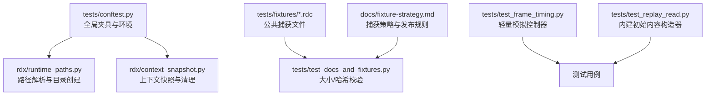
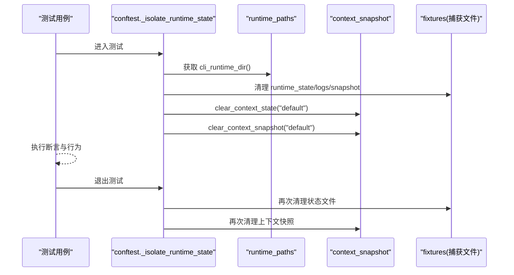
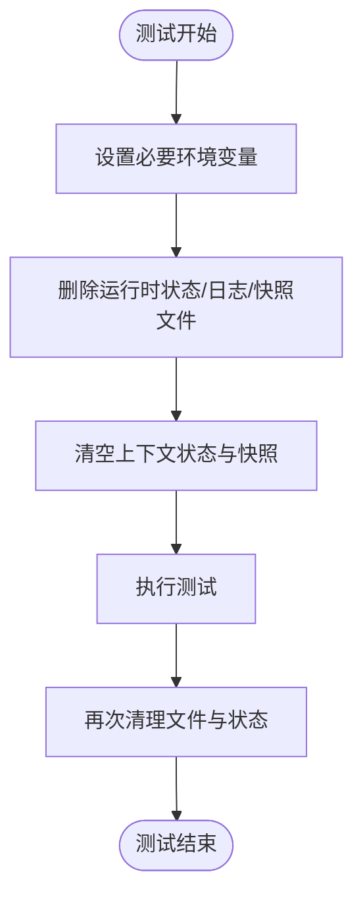
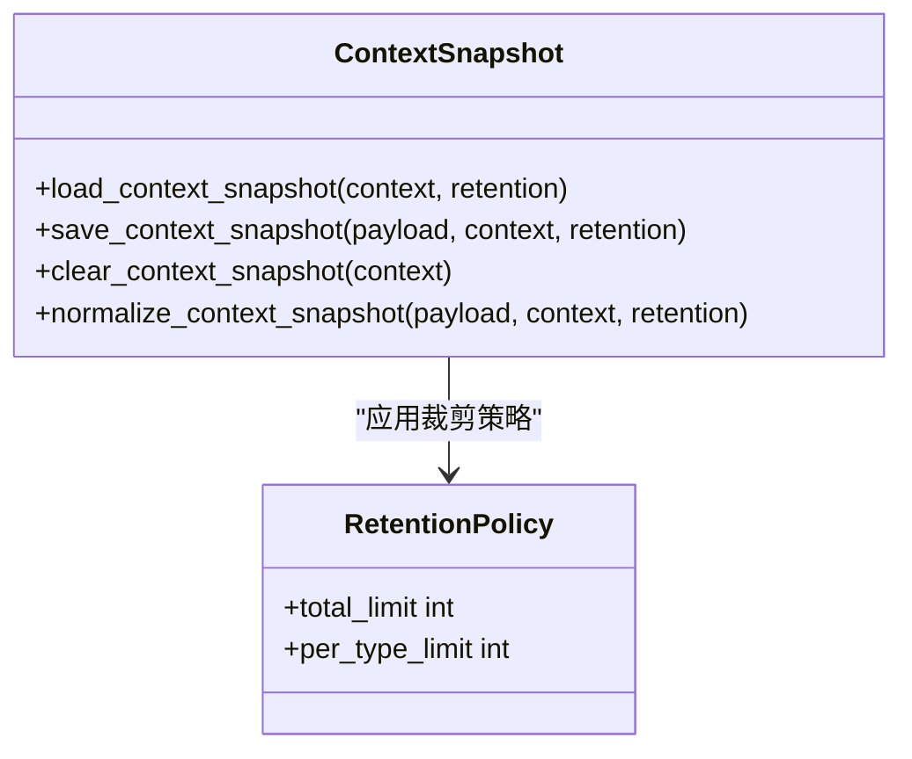
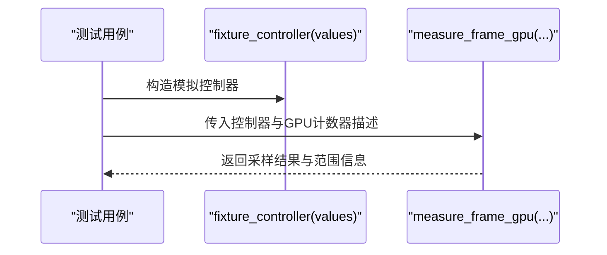
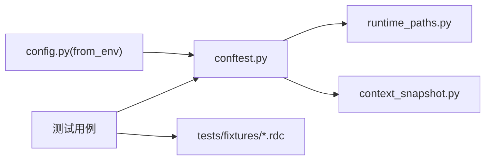

# Fixture策略

<cite>
**本文引用的文件**
- [tests/conftest.py](file://tests/conftest.py)
- [rdx/runtime_paths.py](file://rdx/runtime_paths.py)
- [rdx/context_snapshot.py](file://rdx/context_snapshot.py)
- [tests/fixtures/README.md](file://tests/fixtures/README.md)
- [docs/fixture-strategy.md](file://docs/fixture-strategy.md)
- [tests/test_docs_and_fixtures.py](file://tests/test_docs_and_fixtures.py)
- [tests/test_frame_timing.py](file://tests/test_frame_timing.py)
- [tests/test_replay_read.py](file://tests/test_replay_read.py)
- [rdx/config.py](file://rdx/config.py)
</cite>

## 目录
1. [简介](#简介)
2. [项目结构](#项目结构)
3. [核心组件](#核心组件)
4. [架构总览](#架构总览)
5. [详细组件分析](#详细组件分析)
6. [依赖关系分析](#依赖关系分析)
7. [性能考虑](#性能考虑)
8. [故障排查指南](#故障排查指南)
9. [结论](#结论)
10. [附录](#附录)

## 简介
本文件面向RDC-Tool项目的测试数据与环境管理，系统化说明Fixture策略：如何在全局与模块级组织夹具、隔离运行时状态、设置环境变量、管理临时目录，以及如何为不同场景（如RenderDoc捕获回放、模拟设备、测试配置）创建可复用、可维护的测试数据与模拟器。文档同时给出作用域与生命周期控制的最佳实践，确保测试独立性与执行效率。

## 项目结构
- 全局夹具与环境初始化位于 tests/conftest.py，负责：
  - 设置 RDX_INTERMEDIATE_ROOT、RDX_TOOLS_ROOT、RDX_ARTIFACT_DIR、RDX_RENDERDOC_PATH、RDX_RUNTIME_DLL_DIR 等关键环境变量
  - 通过 autouse fixture 在每个测试前后清理运行时状态与快照文件，保证测试隔离
- 运行时路径由 rdx/runtime_paths.py 提供统一解析，所有中间产物、日志、工件、pytest输出均落在 intermediate 下
- 上下文快照与清理逻辑在 rdx/context_snapshot.py，支持按context隔离、原子写入、锁保护与保留策略
- 测试专用捕获文件位于 tests/fixtures/*.rdc，并通过 docs/fixture-strategy.md 与 tests/fixtures/README.md 约束其来源、许可证与发布排除策略
- 验证类测试确保 fixtures 的大小与哈希一致，并校验第三方声明覆盖

**图示来源**
- [tests/conftest.py:10-27](file://tests/conftest.py#L10-L27)
- [rdx/runtime_paths.py:83-123](file://rdx/runtime_paths.py#L83-L123)
- [rdx/context_snapshot.py:214-240](file://rdx/context_snapshot.py#L214-L240)
- [tests/fixtures/README.md:1-26](file://tests/fixtures/README.md#L1-L26)
- [docs/fixture-strategy.md:1-28](file://docs/fixture-strategy.md#L1-L28)
- [tests/test_docs_and_fixtures.py:60-83](file://tests/test_docs_and_fixtures.py#L60-L83)

**章节来源**
- [tests/conftest.py:10-46](file://tests/conftest.py#L10-L46)
- [rdx/runtime_paths.py:83-123](file://rdx/runtime_paths.py#L83-L123)
- [tests/fixtures/README.md:1-26](file://tests/fixtures/README.md#L1-L26)
- [docs/fixture-strategy.md:1-28](file://docs/fixture-strategy.md#L1-L28)

## 核心组件
- 全局隔离夹具
  - 自动运行于每个测试前后，清理运行时状态目录中的 runtime_state*.json、runtime_logs*.jsonl、context_snapshot*.json，并调用 clear_context_state/clear_context_snapshot，避免跨测试污染
  - 通过 setdefault 注入关键环境变量，使工具链在测试中始终指向仓库根与中间目录
- 运行时路径与目录
  - 通过 RDX_INTERMEDIATE_ROOT 或默认 intermediate 作为工作区；cli_runtime_dir、artifacts_dir、pytest_dir、logs_dir 等子目录按需创建
- 上下文快照
  - 提供默认快照结构、规范化、持久化、锁定与清理能力；支持按 context 隔离与保留策略裁剪
- 捕获文件策略
  - 仅允许小体积、公开来源、有明确许可的 .rdc 放入 tests/fixtures；发布包必须排除这些文件；变更需记录大小、SHA256、来源与许可证

**章节来源**
- [tests/conftest.py:29-46](file://tests/conftest.py#L29-L46)
- [rdx/runtime_paths.py:83-123](file://rdx/runtime_paths.py#L83-L123)
- [rdx/context_snapshot.py:214-240](file://rdx/context_snapshot.py#L214-L240)
- [tests/fixtures/README.md:13-26](file://tests/fixtures/README.md#L13-L26)
- [docs/fixture-strategy.md:13-28](file://docs/fixture-strategy.md#L13-L28)

## 架构总览
下图展示测试执行时环境准备、状态隔离与数据访问的关键交互：

**图示来源**
- [tests/conftest.py:29-46](file://tests/conftest.py#L29-L46)
- [rdx/runtime_paths.py:92-94](file://rdx/runtime_paths.py#L92-L94)
- [rdx/context_snapshot.py:478-484](file://rdx/context_snapshot.py#L478-L484)

## 详细组件分析

### 全局夹具与环境隔离（autouse fixture）
- 职责
  - 设置 RDX_INTERMEDIATE_ROOT、RDX_TOOLS_ROOT、RDX_ARTIFACT_DIR、RDX_RENDERDOC_PATH、RDX_RUNTIME_DLL_DIR
  - 在每个测试前后清理运行时状态与快照，确保测试间完全隔离
- 关键点
  - 使用 setdefault 避免覆盖外部显式设置
  - 清理范围限定到 cli_runtime_dir() 下的三类文件模式
  - 清理后调用 clear_context_state/clear_context_snapshot 重置内存态

**图示来源**
- [tests/conftest.py:10-27](file://tests/conftest.py#L10-L27)
- [tests/conftest.py:29-46](file://tests/conftest.py#L29-L46)

**章节来源**
- [tests/conftest.py:10-46](file://tests/conftest.py#L10-L46)

### 运行时路径与目录管理
- 路径解析优先级
  - tools_root() 优先读取 RDX_TOOLS_ROOT，否则回退到包根
  - intermediate_root() 优先读取 RDX_INTERMEDIATE_ROOT，否则使用 {tools_root}/intermediate
- 常用目录
  - cli_runtime_dir()、artifacts_dir()、pytest_dir()、logs_dir() 等均在 ensure_runtime_dirs() 中创建
- 建议
  - 测试中通过环境变量切换 intermediate 根，便于并行与隔离
  - 避免硬编码绝对路径，统一通过 runtime_paths 获取

**章节来源**
- [rdx/runtime_paths.py:14-57](file://rdx/runtime_paths.py#L14-L57)
- [rdx/runtime_paths.py:83-123](file://rdx/runtime_paths.py#L83-L123)

### 上下文快照与保留策略
- 功能要点
  - 默认快照结构包含运行时、远程、焦点、预览等字段
  - 读写带锁与原子写入，避免并发损坏
  - 支持 retention 策略限制最近工件数量与每类型上限
- 清理接口
  - clear_context_snapshot(context) 删除对应快照文件
  - 配合 conftest 的 autouse fixture 实现测试级隔离

**图示来源**
- [rdx/context_snapshot.py:214-240](file://rdx/context_snapshot.py#L214-L240)
- [rdx/context_snapshot.py:335-364](file://rdx/context_snapshot.py#L335-L364)
- [rdx/context_snapshot.py:447-484](file://rdx/context_snapshot.py#L447-L484)

**章节来源**
- [rdx/context_snapshot.py:214-240](file://rdx/context_snapshot.py#L214-L240)
- [rdx/context_snapshot.py:335-364](file://rdx/context_snapshot.py#L335-L364)
- [rdx/context_snapshot.py:447-484](file://rdx/context_snapshot.py#L447-L484)

### 捕获文件（.rdc）策略与管理
- 原则
  - 仅允许小体积、公开来源、有明确许可的 .rdc 放入 tests/fixtures
  - 不得将本地、私有、客户或大文件纳入仓库
  - 禁止在源码、文档、发布元数据中写入开发者机器绝对路径
  - 记录文件名、大小、SHA256、来源与许可证；第三方归属在 THIRD_PARTY_NOTICES.md 中体现
  - 发布包必须排除 .rdc 与 tests/
- 验证
  - test_public_rdc_fixtures_have_expected_size_and_hash 校验每个 fixture 的大小与哈希
  - test_fixture_policy_and_third_party_notices_cover_copied_assets 校验 README 与 NOTICE 覆盖

**章节来源**
- [docs/fixture-strategy.md:13-28](file://docs/fixture-strategy.md#L13-L28)
- [tests/fixtures/README.md:1-26](file://tests/fixtures/README.md#L1-L26)
- [tests/test_docs_and_fixtures.py:60-83](file://tests/test_docs_and_fixtures.py#L60-L83)

### 测试专用的Fixture设计模式

#### 渲染与回放相关
- 轻量模拟控制器
  - 使用 types.SimpleNamespace 构造最小化的控制器对象，满足枚举、描述、事件查询等接口，用于性能测量与边界条件测试
- 初始内容构造器
  - 通过工厂函数生成符合内部结构的资源/内存/动作集合，用于验证初始内容溯源与完整性检查

**图示来源**
- [tests/test_frame_timing.py:9-17](file://tests/test_frame_timing.py#L9-L17)
- [tests/test_frame_timing.py:19-27](file://tests/test_frame_timing.py#L19-L27)

**章节来源**
- [tests/test_frame_timing.py:9-46](file://tests/test_frame_timing.py#L9-L46)
- [tests/test_replay_read.py:82-111](file://tests/test_replay_read.py#L82-L111)

#### 环境与配置相关
- 通过环境变量注入配置
  - RDX_RENDERDOC_PATH、RDX_DATA_DIR、RDX_REPORT_DIR、RDX_GPU_VENDOR、RDX_SPIRV_TOOLS_PATH、RDX_HEADLESS 等
  - 通过 from_env() 加载配置，测试可通过 monkeypatch 或 setenv 切换行为
- 推荐做法
  - 对需要真实渲染环境的用例使用标记或可选夹具，默认不强制依赖GPU
  - 对无头回放设置 RDX_HEADLESS=1，避免UI阻塞

**章节来源**
- [rdx/config.py:136-186](file://rdx/config.py#L136-L186)

### Fixture的作用域与生命周期控制
- 作用域建议
  - 测试级隔离：使用 autouse fixture 在每个测试前后清理状态，避免共享可变状态
  - 会话级共享：仅在确有必要且具备幂等清理时使用 session/module 级夹具
- 生命周期最佳实践
  - 任何创建的文件/进程/连接必须在 finally 或 yield 后清理
  - 对外部资源（如RenderDoc模块、设备）采用“按需加载+显式释放”的模式
  - 使用独立的 intermediate 根进行并行测试，避免文件竞争

[本节为通用指导，不直接分析具体文件]

## 依赖关系分析
- 耦合点
  - conftest 依赖 runtime_paths 与 context_snapshot，形成“环境→路径→状态”的单向依赖
  - 测试用例依赖 fixtures 与模拟控制器，保持被测代码与测试数据的解耦
- 外部依赖
  - RenderDoc模块路径通过 RDX_RENDERDOC_PATH 注入，避免硬编码
  - Android/ADB路径通过 RDX_ANDROID_ADB_PATH 注入（在远程引导中使用）

**图示来源**
- [tests/conftest.py:10-27](file://tests/conftest.py#L10-L27)
- [rdx/runtime_paths.py:83-123](file://rdx/runtime_paths.py#L83-L123)
- [rdx/context_snapshot.py:214-240](file://rdx/context_snapshot.py#L214-L240)
- [rdx/config.py:136-186](file://rdx/config.py#L136-L186)

**章节来源**
- [tests/conftest.py:10-46](file://tests/conftest.py#L10-L46)
- [rdx/config.py:136-186](file://rdx/config.py#L136-L186)

## 性能考虑
- 减少I/O
  - 将中间产物集中在 isolated intermediate 根，避免跨测试竞争
  - 使用原子写入与文件锁降低并发写冲突
- 缩短启动时间
  - 避免在 autouse fixture 中做昂贵初始化；将重负载放入 module/session 级夹具并显式释放
- 数据复用
  - 对只读捕获文件使用固定路径与校验，避免重复下载或生成
- 并行执行
  - 通过 RDX_INTERMEDIATE_ROOT 为每个进程分配独立目录，确保并行安全

[本节为通用指导，不直接分析具体文件]

## 故障排查指南
- 常见问题
  - 测试间状态污染：确认 autouse fixture 是否成功清理 runtime_state/logs/snapshot
  - RenderDoc模块未找到：检查 RDX_RENDERDOC_PATH 是否正确指向 pymodules
  - 捕获文件不一致：核对 tests/fixtures/README.md 中的大小与SHA256，必要时重新生成
  - 并发写冲突：确认上下文快照写入是否走原子写入与锁保护
- 定位步骤
  - 查看 intermediate/logs 与 intermediate/artifacts 输出
  - 检查 pytest 输出目录是否存在异常残留
  - 使用最小复现用例逐步缩小范围

**章节来源**
- [tests/conftest.py:29-46](file://tests/conftest.py#L29-L46)
- [rdx/context_snapshot.py:214-240](file://rdx/context_snapshot.py#L214-L240)
- [tests/test_docs_and_fixtures.py:60-83](file://tests/test_docs_and_fixtures.py#L60-L83)

## 结论
本项目的Fixture策略以“强隔离、弱耦合、可验证”为核心：通过全局 autouse fixture 与环境变量注入确保测试独立性；通过统一的运行时路径与上下文快照机制保障状态一致性；通过严格的捕获文件策略与自动化校验保证数据可信与发布安全。结合轻量模拟控制器与工厂型数据构造器，可在不依赖真实GPU/设备的条件下高效覆盖核心逻辑。遵循本文规范，可显著提升测试的可维护性、可并行性与稳定性。

[本节为总结性内容，不直接分析具体文件]

## 附录
- 快速清单
  - 新增捕获文件：更新 tests/fixtures/README.md 与 THIRD_PARTY_NOTICES.md，并在测试中校验大小与哈希
  - 新增环境变量：在 conftest 中 setdefault，并在 config.from_env 中处理
  - 新增运行时状态：在 autouse fixture 的清理模式中增加对应文件模式
  - 新增模拟控制器：尽量使用 SimpleNamespace 与工厂函数，保持最小接口
- 参考路径
  - 全局夹具与环境：[tests/conftest.py](file://tests/conftest.py)
  - 路径与目录：[rdx/runtime_paths.py](file://rdx/runtime_paths.py)
  - 上下文快照：[rdx/context_snapshot.py](file://rdx/context_snapshot.py)
  - 捕获策略：[docs/fixture-strategy.md](file://docs/fixture-strategy.md)、[tests/fixtures/README.md](file://tests/fixtures/README.md)
  - 配置注入：[rdx/config.py](file://rdx/config.py)
  - 示例测试：[tests/test_frame_timing.py](file://tests/test_frame_timing.py)、[tests/test_replay_read.py](file://tests/test_replay_read.py)

[本节为索引与指引，不直接分析具体文件]