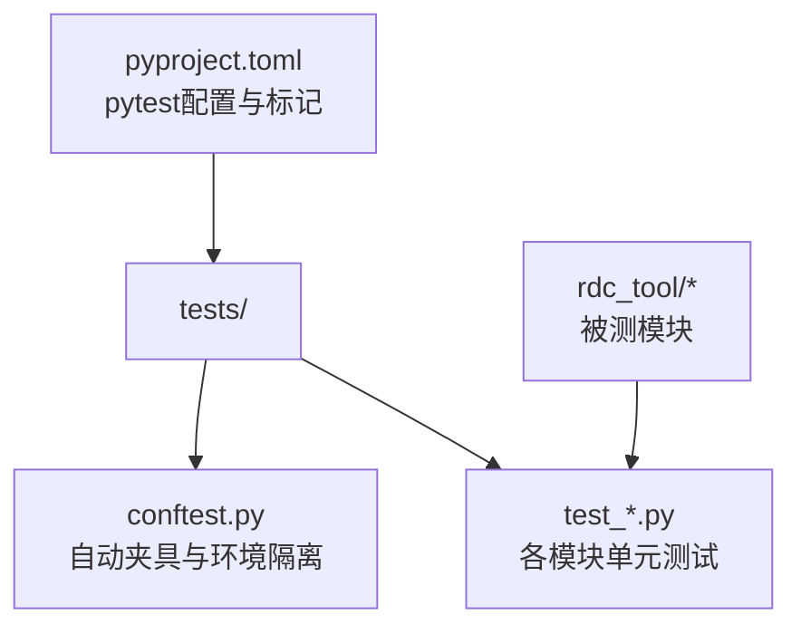
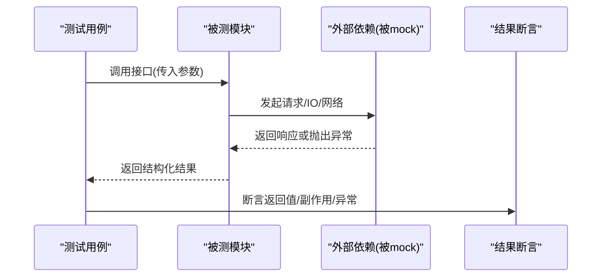
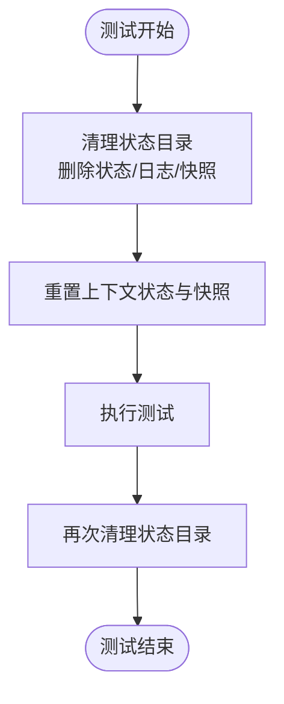
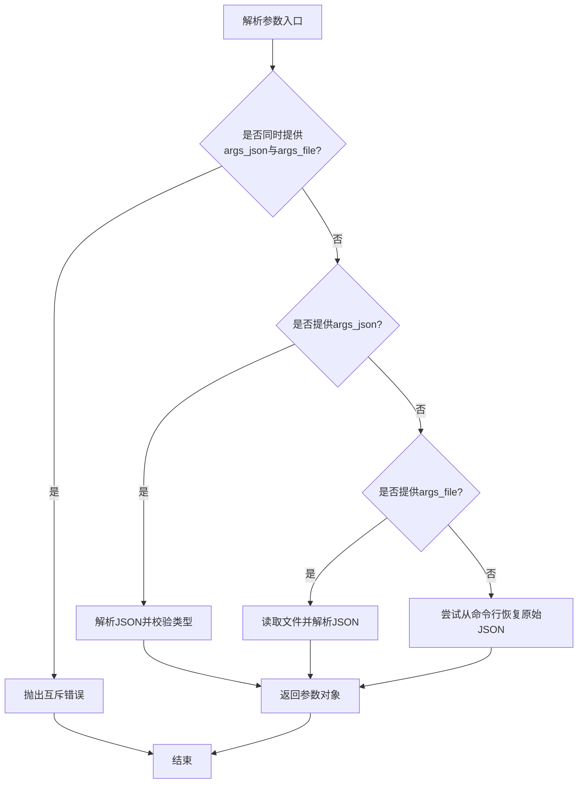
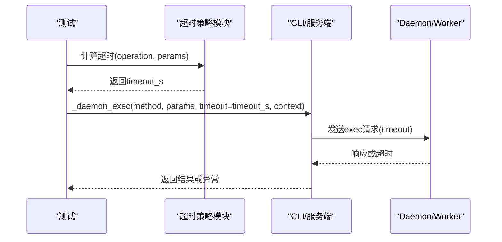
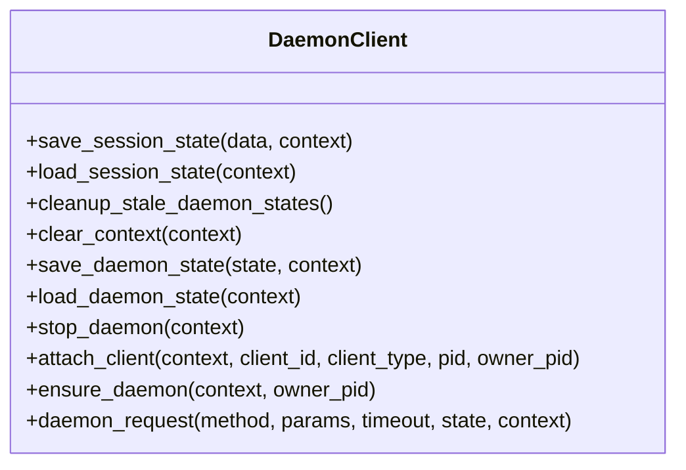
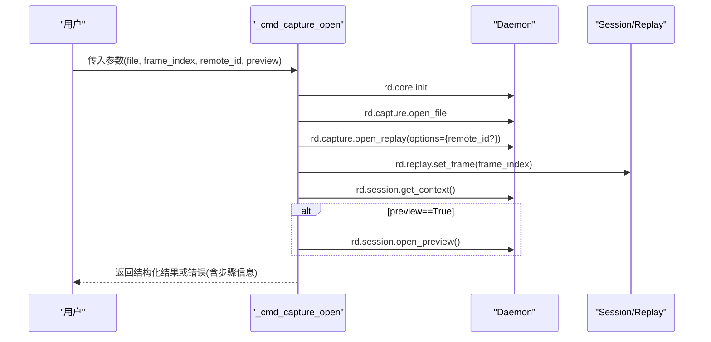
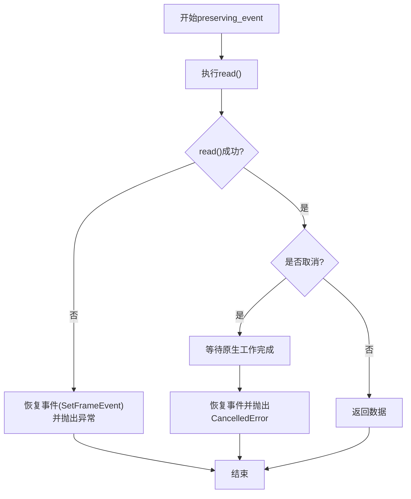

# 单元测试

<cite>
**本文引用的文件**
- [tests/conftest.py](file://tests/conftest.py)
- [pyproject.toml](file://pyproject.toml)
- [tests/test_io_utils.py](file://tests/test_io_utils.py)
- [tests/test_cli_call_args.py](file://tests/test_cli_call_args.py)
- [tests/test_timeout_policy.py](file://tests/test_timeout_policy.py)
- [tests/test_daemon_client.py](file://tests/test_daemon_client.py)
- [tests/test_cli_capture_open.py](file://tests/test_cli_capture_open.py)
- [tests/test_context_snapshot.py](file://tests/test_context_snapshot.py)
- [tests/test_replay_read.py](file://tests/test_replay_read.py)
- [tests/test_vfs.py](file://tests/test_vfs.py)
- [tests/test_python_runtime.py](file://tests/test_python_runtime.py)
- [tests/test_release_package.py](file://tests/test_release_package.py)
</cite>

## 目录
1. [简介](#简介)
2. [项目结构](#项目结构)
3. [核心组件](#核心组件)
4. [架构总览](#架构总览)
5. [详细组件分析](#详细组件分析)
6. [依赖关系分析](#依赖关系分析)
7. [性能考虑](#性能考虑)
8. [故障排查指南](#故障排查指南)
9. [结论](#结论)
10. [附录](#附录)

## 简介
本文件面向RDC-Tool项目的测试实践，系统性说明如何使用pytest编写高质量单元测试。内容覆盖：
- 测试隔离与自动夹具（conftest.py）
- CLI参数解析、I/O工具函数、超时策略等模块的测试方法
- 模拟RenderDoc API调用、断言与异常处理
- 异步代码与守护进程通信的测试实现
- 测试数据准备技巧与最佳实践

## 项目结构
测试根目录为 tests，使用 pytest 作为测试框架，并通过 pyproject.toml 配置测试路径与标记。conftest.py 提供全局自动夹具，确保每个测试在干净的环境中运行，避免状态污染。

**图表来源**
- [tests/conftest.py:1-46](file://tests/conftest.py#L1-L46)
- [pyproject.toml:36-45](file://pyproject.toml#L36-L45)

**章节来源**
- [tests/conftest.py:1-46](file://tests/conftest.py#L1-L46)
- [pyproject.toml:36-45](file://pyproject.toml#L36-L45)

## 核心组件
- 测试隔离夹具：通过自动夹具清理运行时状态、上下文快照与日志，保证测试间完全隔离。
- CLI参数解析测试：验证JSON参数、文件参数、UTF-8 BOM、错误提示与恢复逻辑。
- I/O工具函数测试：验证JSON文本安全输出，如非法代理字符的处理。
- 超时策略测试：针对不同操作计算合适的超时窗口，并验证CLI与服务端传递。
- 守护进程客户端测试：会话状态隔离、清理死态、原子写入、停止流程、超时异常细节。
- 重放读取测试：事件保护、取消与恢复、初始内容溯源校验。
- VFS路由测试：虚拟文件系统的路由、节点生成与懒加载。
- Python运行时布局验证：打包产物完整性检查。
- 发布包验证：构建与校验脚本的契约测试。

**章节来源**
- [tests/conftest.py:29-46](file://tests/conftest.py#L29-L46)
- [tests/test_io_utils.py:6-13](file://tests/test_io_utils.py#L6-L13)
- [tests/test_cli_call_args.py:8-116](file://tests/test_cli_call_args.py#L8-L116)
- [tests/test_timeout_policy.py:38-105](file://tests/test_timeout_policy.py#L38-L105)
- [tests/test_daemon_client.py:38-460](file://tests/test_daemon_client.py#L38-L460)
- [tests/test_replay_read.py:10-176](file://tests/test_replay_read.py#L10-L176)
- [tests/test_vfs.py:11-196](file://tests/test_vfs.py#L11-L196)
- [tests/test_python_runtime.py:17-61](file://tests/test_python_runtime.py#L17-L61)
- [tests/test_release_package.py:17-175](file://tests/test_release_package.py#L17-L175)

## 架构总览
测试围绕被测模块的边界进行设计：通过monkeypatch替换外部依赖（如daemon_request、server._runtime），构造确定性输入，断言返回值或副作用。异步流程通过asyncio.run驱动，配合事件与任务控制来验证取消与恢复行为。

[此图为概念性流程图，不直接映射具体源码]

## 详细组件分析

### 测试隔离机制（conftest.py）
- 自动夹具在每个测试前后清理运行时状态目录中的状态文件与日志，并调用clear_context_state与clear_context_snapshot重置上下文。
- 环境变量设置固定中间目录、工具根目录、RenderDoc路径与运行时DLL目录，确保跨平台一致性。

**图表来源**
- [tests/conftest.py:29-46](file://tests/conftest.py#L29-L46)

**章节来源**
- [tests/conftest.py:1-46](file://tests/conftest.py#L1-L46)

### CLI参数解析测试（test_cli_call_args.py）
- 覆盖场景：
  - 未知操作在守护进程执行前拒绝，返回operation_not_found错误。
  - 支持从args_json对象与args_file文件加载参数，包括UTF-8 BOM。
  - 拒绝同时提供args_json与args_file，以及无效JSON或非对象类型。
  - 复杂JSON（如多行着色器源）给出友好提示，建议使用--args-file。
  - 从命令行恢复原始JSON负载，用于Windows环境兼容。
- 断言要点：
  - 错误码、错误消息包含关键信息。
  - 返回值结构与字段符合预期。

**图表来源**
- [tests/test_cli_call_args.py:21-116](file://tests/test_cli_call_args.py#L21-L116)

**章节来源**
- [tests/test_cli_call_args.py:8-116](file://tests/test_cli_call_args.py#L8-L116)

### I/O工具函数测试（test_io_utils.py）
- 目标：验证safe_json_text对非法代理字符的转义，确保输出可编码为UTF-8。
- 断言：
  - 输出中包含转义的代理序列。
  - 编码成功无异常。

**章节来源**
- [tests/test_io_utils.py:6-13](file://tests/test_io_utils.py#L6-L13)

### 超时策略测试（test_timeout_policy.py）
- 目标：根据操作名与参数动态计算daemon/worker超时窗口，并验证CLI与服务端传递。
- 覆盖场景：
  - 事件查询使用重型窗口。
  - 远程连接使用远程默认超时毫秒数。
  - 打开本地/远程回放使用不同窗口。
  - 打开文件、获取会话上下文使用特定窗口。
  - CLI调用时正确传递timeout与context。
  - 远程连接默认超时与等待端点。
  - 远程Ping从上下文快照重建句柄。

**图表来源**
- [tests/test_timeout_policy.py:38-105](file://tests/test_timeout_policy.py#L38-L105)

**章节来源**
- [tests/test_timeout_policy.py:38-213](file://tests/test_timeout_policy.py#L38-L213)

### 守护进程客户端测试（test_daemon_client.py）
- 目标：验证会话状态按context隔离、清理死态、原子写入、停止流程、超时异常细节。
- 覆盖场景：
  - 会话状态按context隔离存储与读取。
  - 清理死态daemon与session文件。
  - clear_context不触发stop daemon。
  - save_daemon_state使用原子replace，无临时文件残留。
  - stop_daemon先加载状态再清理，杀死同context worker。
  - attach_client转发owner_pid。
  - ensure_daemon向已有zero owner的daemon申请owner。
  - 所有者丢失后退出live daemon进程。
  - 解析器接受全局owner_pid与daemon_context。
  - daemon_request超时返回结构化详情（包含active_operation、daemon_state_excerpt）。

**图表来源**
- [tests/test_daemon_client.py:38-460](file://tests/test_daemon_client.py#L38-L460)

**章节来源**
- [tests/test_daemon_client.py:38-460](file://tests/test_daemon_client.py#L38-L460)

### CLI捕获打开流程测试（test_cli_capture_open.py）
- 目标：验证capture open完整流程，包括初始化、打开文件、打开回放、设置帧、获取上下文、预览状态。
- 覆盖场景：
  - 成功路径返回机器可读payload，包含context_id、capture_file_id、session_id、active_event_id、recovery_status、backend、remote_id等。
  - 远程ID传递到open_replay选项。
  - 失败与异常被包装为带步骤信息的错误，包含failed_step、capture_file_id、daemon_state、context_snapshot。
  - 预览模式调用session.open_preview并返回preview状态。

**图表来源**
- [tests/test_cli_capture_open.py:9-478](file://tests/test_cli_capture_open.py#L9-L478)

**章节来源**
- [tests/test_cli_capture_open.py:9-478](file://tests/test_cli_capture_open.py#L9-L478)

### 上下文快照测试（test_context_snapshot.py）
- 目标：验证上下文更新与读取的往返一致性、最近制品追踪、不可分派宏、显式context_id支持。
- 覆盖场景：
  - 更新focus.pixel并读取确认。
  - 导出buffer后记录last_artifacts。
  - 移除的宏不可分派，返回not_found。
  - 显式context_id隔离上下文。

**章节来源**
- [tests/test_context_snapshot.py:12-108](file://tests/test_context_snapshot.py#L12-L108)

### 重放读取测试（test_replay_read.py）
- 目标：验证preserving_event在读取失败、取消、恢复失败时的行为；initial_provenance对资源初始内容的溯源校验。
- 覆盖场景：
  - 读取失败恢复事件并传播异常。
  - 取消时先完成原生工作再恢复事件。
  - 恢复失败不返回成功。
  - API查询参数校验与边界条件。
  - 初始内容可用性检查（尺寸、稀疏、子资源覆盖）。

**图表来源**
- [tests/test_replay_read.py:10-49](file://tests/test_replay_read.py#L10-L49)

**章节来源**
- [tests/test_replay_read.py:10-176](file://tests/test_replay_read.py#L10-L176)

### VFS路由测试（test_vfs.py）
- 目标：验证虚拟文件系统的ls、cat、tree、resolve等操作，以及通过pipeline工具路由获取shader信息。
- 覆盖场景：
  - 列出顶级域。
  - cat /context使用上下文快照。
  - /draws/<event>/shaders/<stage>路由到pipeline工具。
  - shader未绑定返回unavailable节点。
  - resolve返回节点路径。
  - tree限制max_nodes并截断。
  - draws树延迟action详情。

**章节来源**
- [tests/test_vfs.py:11-196](file://tests/test_vfs.py#L11-L196)

### Python运行时布局验证（test_python_runtime.py）
- 目标：验证捆绑Python布局完整性，包括exe、dll、Lib、site-packages、DLLs与manifest。
- 断言：
  - 布局有效且details包含bundled_python字段。

**章节来源**
- [tests/test_python_runtime.py:17-61](file://tests/test_python_runtime.py#L17-L61)

### 发布包验证（test_release_package.py）
- 目标：验证release包构建与校验脚本，确保不包含测试数据、敏感日志、预GA路径等。
- 覆盖场景：
  - 构建自包含zip，包含必要清单与SBOM。
  - 校验manifest公共命令、入口点、文件列表。
  - 拒绝预GA路径与标记。
  - 校验许可证清单与SBOM一致性。

**章节来源**
- [tests/test_release_package.py:17-175](file://tests/test_release_package.py#L17-L175)

## 依赖关系分析
测试通过monkeypatch替换外部依赖，降低耦合度，提高可测性。常见依赖包括：
- rdc_tool.cli._daemon_exec：模拟守护进程执行。
- rdc_tool.server.dispatch_operation：模拟服务分发。
- rdc_tool.daemon.client.Client：模拟管道通信。
- rdc_tool.python_runtime.binaries_root：模拟二进制根路径。
- scripts.package_release._tools_root：模拟工具根路径。

[此图为概念性依赖图，不直接映射具体源码]

**章节来源**
- [tests/test_cli_call_args.py:8-116](file://tests/test_cli_call_args.py#L8-L116)
- [tests/test_cli_capture_open.py:9-478](file://tests/test_cli_capture_open.py#L9-L478)
- [tests/test_daemon_client.py:38-460](file://tests/test_daemon_client.py#L38-L460)
- [tests/test_python_runtime.py:17-61](file://tests/test_python_runtime.py#L17-L61)
- [tests/test_release_package.py:17-175](file://tests/test_release_package.py#L17-L175)

## 性能考虑
- 使用tmp_path创建临时目录，避免磁盘IO污染。
- 通过monkeypatch减少外部调用开销，提升测试速度。
- 异步测试中合理使用asyncio.Event与任务取消，避免长时间阻塞。
- 超时策略测试聚焦边界值，减少随机性。

[本节提供一般性指导，无需具体文件引用]

## 故障排查指南
- 超时异常：检查daemon_request超时参数与active_operation、daemon_state_excerpt是否正确填充。
- 上下文污染：确认conftest自动夹具已清理状态，必要时手动调用clear_context_state与clear_context_snapshot。
- JSON解析错误：检查args_json与args_file的互斥性与格式，复杂内容建议使用文件方式。
- 守护进程状态：清理死态daemon与session文件，确保stop流程正确杀死worker。

**章节来源**
- [tests/test_daemon_client.py:396-460](file://tests/test_daemon_client.py#L396-L460)
- [tests/test_cli_call_args.py:44-116](file://tests/test_cli_call_args.py#L44-L116)
- [tests/conftest.py:29-46](file://tests/conftest.py#L29-L46)

## 结论
RDC-Tool项目的单元测试采用pytest框架，结合conftest自动夹具实现强隔离，通过monkeypatch模拟外部依赖，覆盖CLI参数解析、I/O工具、超时策略、守护进程通信、重放读取、VFS路由、Python运行时布局与发布包验证等核心模块。测试设计注重确定性、可维护性与可观测性，便于持续集成与回归验证。

[本节为总结性内容，无需具体文件引用]

## 附录
- 测试标记：unit、contract、fixture_integration、gpu_live，用于区分测试类型与运行范围。
- 测试路径：tests目录，排除intermediate与binaries。
- 开发依赖：pytest>=9.0。

**章节来源**
- [pyproject.toml:24-45](file://pyproject.toml#L24-L45)