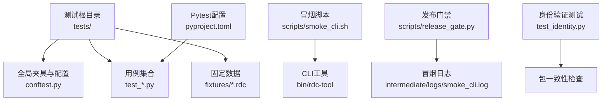
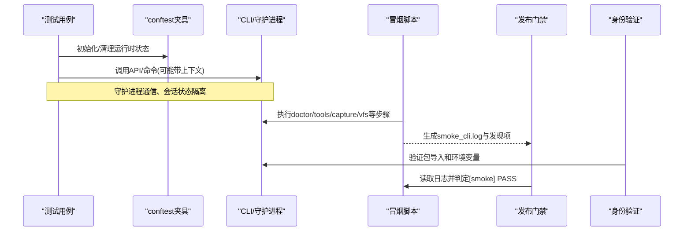
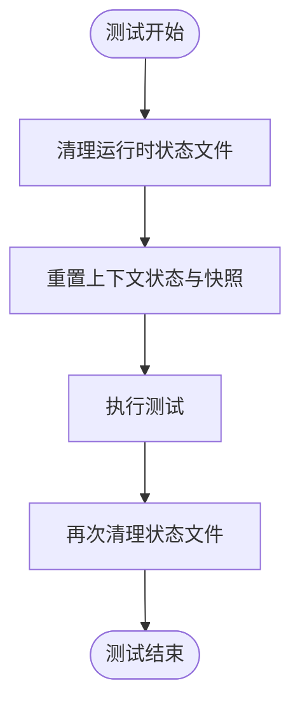
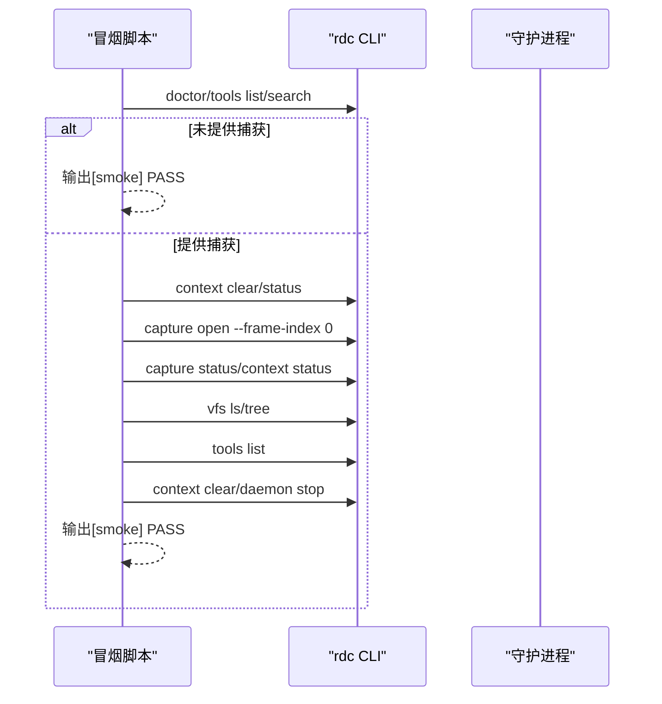
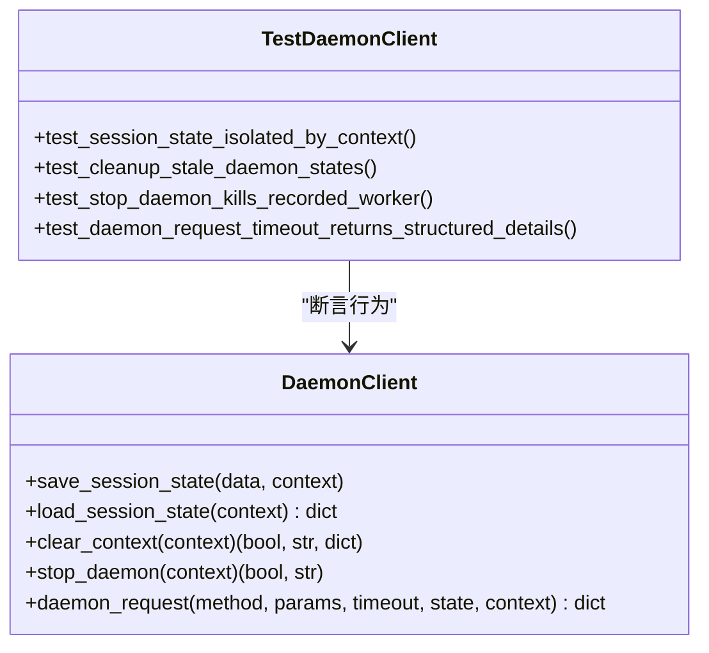
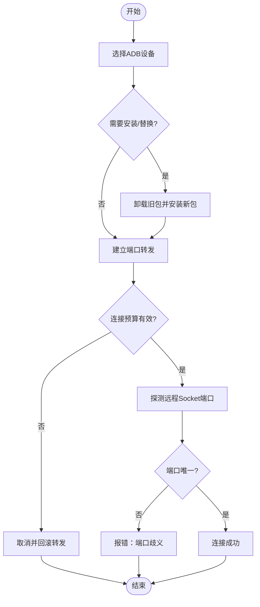
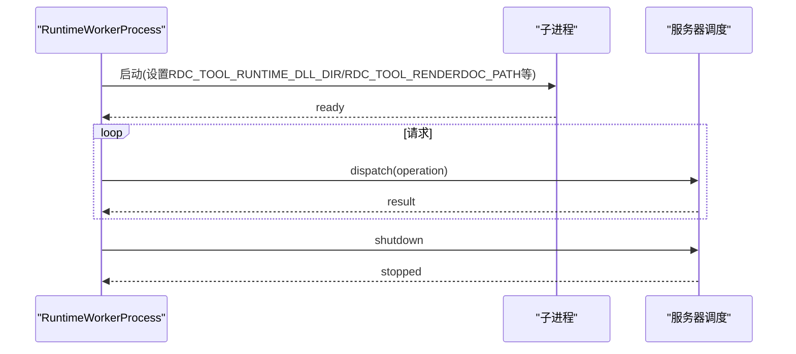
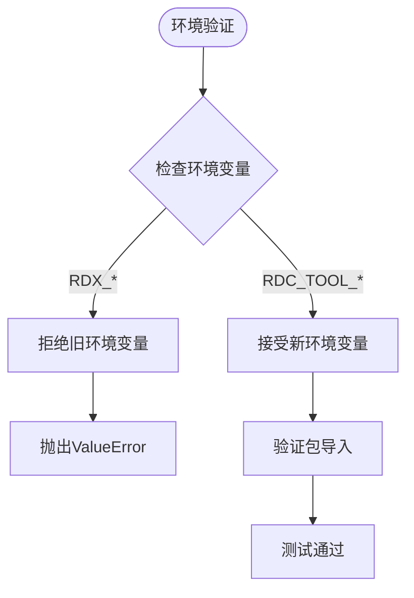
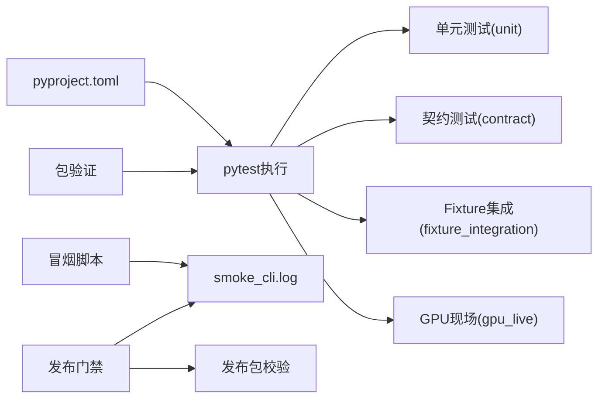

# 测试策略

<cite>
**本文引用的文件**
- [tests/conftest.py](file://tests/conftest.py)
- [docs/fixture-strategy.md](file://docs/fixture-strategy.md)
- [tests/fixtures/README.md](file://tests/fixtures/README.md)
- [scripts/smoke_cli.sh](file://scripts/smoke_cli.sh)
- [tests/test_daemon_client.py](file://tests/test_daemon_client.py)
- [tests/test_remote_bootstrap.py](file://tests/test_remote_bootstrap.py)
- [tests/test_runtime_worker.py](file://tests/test_runtime_worker.py)
- [pyproject.toml](file://pyproject.toml)
- [scripts/release_gate.py](file://scripts/release_gate.py)
- [tests/test_identity.py](file://tests/test_identity.py)
- [tests/test_cli_batch.py](file://tests/test_cli_batch.py)
- [tests/test_io_utils.py](file://tests/test_io_utils.py)
- [tests/test_python_runtime.py](file://tests/test_python_runtime.py)
- [tests/test_replay_facts.py](file://tests/test_replay_facts.py)
- [scripts/check_identity.py](file://scripts/check_identity.py)
</cite>

## 更新摘要
**所做更改**
- 更新了包结构迁移：所有测试文件现在从 `rdc_tool` 导入而不是 `rdx`
- 添加了新的身份验证测试，用于验证包一致性
- 更新了夹具和配置以支持新的包命名空间
- 增强了环境验证测试，确保旧环境变量被正确拒绝

## 目录
1. [简介](#简介)
2. [项目结构](#项目结构)
3. [核心组件](#核心组件)
4. [架构总览](#架构总览)
5. [详细组件分析](#详细组件分析)
6. [依赖关系分析](#依赖关系分析)
7. [性能考虑](#性能考虑)
8. [故障排查指南](#故障排查指南)
9. [结论](#结论)
10. [附录](#附录)

## 简介
本文件面向RDC-Tool项目的测试策略与实践，覆盖单元测试、集成测试与冒烟测试的编写方法、Fixture策略、异步测试处理、覆盖率与性能测试指导，以及持续集成中的测试执行与报告生成。文档基于仓库现有实现进行归纳，确保可追溯性与可操作性。

**更新** 测试套件已更新以适配新的包结构，所有测试文件现在从 `rdc_tool` 导入而不是 `rdx`，并新增了身份验证测试来验证包一致性。

## 项目结构
测试相关的关键位置与职责：
- tests/conftest.py：全局测试配置与环境隔离，设置中间产物目录、清理运行时状态、注入环境变量。
- tests/fixtures：仅包含小型公开RenderDoc捕获文件（.rdc），用于确定性仓库测试；发布包不包含这些文件。
- scripts/smoke_cli.sh：CLI冒烟脚本，支持入口冒烟与带捕获文件的完整链路冒烟，输出日志与发现项。
- pyproject.toml：pytest配置、测试标记（unit/contract/fixture_integration/gpu_live）、测试路径与忽略目录。
- scripts/release_gate.py：发布门禁，校验清单、运行公共命令、检查冒烟报告、验证发布包。

**图表来源**
- [tests/conftest.py:1-46](file://tests/conftest.py#L1-L46)
- [scripts/smoke_cli.sh:1-264](file://scripts/smoke_cli.sh#L1-L264)
- [pyproject.toml:36-44](file://pyproject.toml#L36-L44)
- [scripts/release_gate.py:399-412](file://scripts/release_gate.py#L399-L412)
- [tests/test_identity.py:1-31](file://tests/test_identity.py#L1-L31)

**章节来源**
- [tests/conftest.py:1-46](file://tests/conftest.py#L1-L46)
- [docs/fixture-strategy.md:1-28](file://docs/fixture-strategy.md#L1-L28)
- [tests/fixtures/README.md:1-26](file://tests/fixtures/README.md#L1-L26)
- [scripts/smoke_cli.sh:1-264](file://scripts/smoke_cli.sh#L1-L264)
- [pyproject.toml:36-44](file://pyproject.toml#L36-L44)
- [scripts/release_gate.py:399-412](file://scripts/release_gate.py#L399-L412)

## 核心组件
- 测试环境与隔离：通过自动夹具在每次测试前后清理运行时状态文件与上下文快照，保证测试间隔离与可重复性。
- 捕获文件策略：仅允许小型公开.rdc进入仓库，记录来源与许可证；本地或Android远程冒烟可通过外部路径传入真实捕获。
- 冒烟测试：支持无捕获的入口冒烟与带捕获的完整链路冒烟，统一输出到中间日志并生成发现项Markdown。
- 守护进程与客户端：针对daemon client的会话状态、上下文隔离、清理死态、停止守护、超时异常等场景提供全面单测。
- Android远程引导：对设备选择、APK安装/替换、端口转发、连接预算、取消与回滚等进行参数化与边界测试。
- 运行时工作进程：验证工作进程使用源码运行时直接启动、保持事件循环与原生线程、EOF关闭顺序等。
- **新增** 包身份验证：确保从 `rdc_tool` 包导入正常工作，拒绝旧的 `rdx` 环境变量。

**章节来源**
- [tests/conftest.py:29-46](file://tests/conftest.py#L29-L46)
- [docs/fixture-strategy.md:5-27](file://docs/fixture-strategy.md#L5-L27)
- [scripts/smoke_cli.sh:238-264](file://scripts/smoke_cli.sh#L238-L264)
- [tests/test_daemon_client.py:38-187](file://tests/test_daemon_client.py#L38-L187)
- [tests/test_remote_bootstrap.py:11-219](file://tests/test_remote_bootstrap.py#L11-L219)
- [tests/test_runtime_worker.py:49-136](file://tests/test_runtime_worker.py#L49-L136)
- [tests/test_identity.py:14-31](file://tests/test_identity.py#L14-L31)

## 架构总览
测试体系由三层构成：
- 单元与契约层：快速行为与接口契约校验，不依赖外部捕获或GPU环境。
- Fixture驱动层：使用仓库内小型公开捕获进行确定性验证。
- 冒烟与现场层：需要真实RenderDoc/GPU/Android设备的端到端流程验证。

**图表来源**
- [tests/conftest.py:29-46](file://tests/conftest.py#L29-L46)
- [scripts/smoke_cli.sh:238-264](file://scripts/smoke_cli.sh#L238-L264)
- [scripts/release_gate.py:399-412](file://scripts/release_gate.py#L399-L412)
- [tests/test_identity.py:14-31](file://tests/test_identity.py#L14-L31)

## 详细组件分析

### 测试配置与夹具（conftest.py）
- 作用：设置中间产物根目录、创建pytest输出目录、注入关键环境变量（工具根、工件目录、RenderDoc路径、运行时DLL目录）。
- 自动隔离：每个测试前后清理runtime_state、context_snapshot、runtime_logs等文件，并重置上下文状态与快照，避免跨测试污染。
- 最佳实践：
  - 新增需要持久化的测试数据应放入intermediate目录，并通过环境变量指向。
  - 需要自定义夹具时，优先复用清理逻辑，确保测试后恢复干净状态。

**图表来源**
- [tests/conftest.py:29-46](file://tests/conftest.py#L29-L46)

**章节来源**
- [tests/conftest.py:1-46](file://tests/conftest.py#L1-L46)

### 捕获文件Fixture策略
- 规则：仅允许小型公开.rdc进入tests/fixtures，禁止私有/大型捕获；记录文件名、大小、SHA256、来源与许可证。
- 使用分层：
  - unit/contract：使用假控制器、模拟载荷、模式与目录校验。
  - fixture_integration：使用已提交的公开捕获进行确定性测试。
  - gpu_live：需要真实RenderDoc/GPU/远程环境，不作为默认门禁。
- 发布行为：发布包排除.rdc与tests目录；冒烟脚本可选择是否携带捕获文件执行完整链路。

**章节来源**
- [docs/fixture-strategy.md:1-28](file://docs/fixture-strategy.md#L1-L28)
- [tests/fixtures/README.md:1-26](file://tests/fixtures/README.md#L1-L26)

### 冒烟测试（CLI与守护进程）
- 入口冒烟：无需捕获文件，执行doctor、tools list/search等基础命令。
- 完整链路冒烟：传入外部.rdc路径，依次执行context clear/status、capture open/status、vfs操作、daemon tools list、cleanup与stop。
- 超时与失败处理：每步带超时，失败或超时会记录上下文状态并写入发现项，最终输出PASS/FAIL。
- 报告：生成smoke_cli.log与tool_smoke_findings.md，供发布门禁校验。

**图表来源**
- [scripts/smoke_cli.sh:238-264](file://scripts/smoke_cli.sh#L238-L264)

**章节来源**
- [scripts/smoke_cli.sh:1-264](file://scripts/smoke_cli.sh#L1-L264)

### 守护进程客户端测试
- 会话状态按上下文隔离：不同上下文保存/加载独立session_state文件。
- 清理死态：检测无效JSON、孤儿上下文工件、删除死PID对应的daemon与session状态。
- 停止守护：先加载状态再清理，确保正确终止worker进程且不影响其他上下文。
- 超时异常：当请求超时时抛出结构化异常，包含operation、context_id、timeout_seconds、active_operation等详情。

**图表来源**
- [tests/test_daemon_client.py:38-187](file://tests/test_daemon_client.py#L38-L187)
- [tests/test_daemon_client.py:396-460](file://tests/test_daemon_client.py#L396-L460)

**章节来源**
- [tests/test_daemon_client.py:38-187](file://tests/test_daemon_client.py#L38-L187)
- [tests/test_daemon_client.py:396-460](file://tests/test_daemon_client.py#L396-L460)

### Android远程引导测试
- 设备选择：多设备时必须指定序列号，否则抛出错误。
- APK安装与替换：签名不匹配时强制替换并卸载旧包；卸载失败则上报具体错误码。
- 端口转发与连接预算：优先使用请求端口，回退到检测到的唯一端口；支持取消与超时，失败时仅回滚创建的转发。
- 借用Helper保护：若检测到Helper被替换或映射不属于当前任务，拒绝停止或移除转发。

**图表来源**
- [tests/test_remote_bootstrap.py:11-219](file://tests/test_remote_bootstrap.py#L11-L219)
- [tests/test_remote_bootstrap.py:275-311](file://tests/test_remote_bootstrap.py#L275-L311)

**章节来源**
- [tests/test_remote_bootstrap.py:11-219](file://tests/test_remote_bootstrap.py#L11-L219)
- [tests/test_remote_bootstrap.py:275-311](file://tests/test_remote_bootstrap.py#L275-L311)

### 运行时工作进程测试
- 源码运行时直用：通过manifest.runtime.json声明二进制与pymodules，工作进程以源码路径启动，设置必要环境变量。
- 事件循环与线程：跨请求保持同一事件循环与原生线程，shutdown时安全关闭。
- EOF关闭：标准输入结束时先触发shutdown，再清理状态，确保资源释放顺序正确。

**图表来源**
- [tests/test_runtime_worker.py:49-91](file://tests/test_runtime_worker.py#L49-L91)
- [tests/test_runtime_worker.py:93-136](file://tests/test_runtime_worker.py#L93-L136)

**章节来源**
- [tests/test_runtime_worker.py:49-136](file://tests/test_runtime_worker.py#L49-L136)

### 包身份验证测试
**新增** 包结构迁移验证：
- 环境变量验证：确保旧的 `RDX_INTERMEDIATE_ROOT` 环境变量被正确拒绝，只接受新的 `RDC_TOOL_INTERMEDIATE_ROOT`。
- 包导入测试：验证所有测试文件都能正确从 `rdc_tool` 包导入模块。
- 向后兼容性：确保旧的环境变量不会创建任何文件或目录。

**图表来源**
- [tests/test_identity.py:14-31](file://tests/test_identity.py#L14-L31)

**章节来源**
- [tests/test_identity.py:1-31](file://tests/test_identity.py#L1-L31)

## 依赖关系分析
- pytest配置：测试路径为tests，忽略.git/intermediate/binaries；定义unit/contract/fixture_integration/gpu_live标记，便于选择性执行。
- 冒烟与门禁：冒烟脚本输出日志，发布门禁读取日志并判定是否包含[smoke] PASS；同时校验公共命令、目录/文件完整性、发布包一致性。
- 环境依赖：测试通过环境变量控制中间产物、渲染库路径与运行时DLL目录，确保跨环境可重复执行。
- **新增** 包依赖：所有测试现在依赖 `rdc_tool` 包而不是 `rdx`，确保包结构迁移的完整性。

**图表来源**
- [pyproject.toml:36-44](file://pyproject.toml#L36-L44)
- [scripts/release_gate.py:399-412](file://scripts/release_gate.py#L399-L412)
- [scripts/release_gate.py:520-673](file://scripts/release_gate.py#L520-L673)
- [tests/test_identity.py:1-31](file://tests/test_identity.py#L1-L31)

**章节来源**
- [pyproject.toml:36-44](file://pyproject.toml#L36-L44)
- [scripts/release_gate.py:399-412](file://scripts/release_gate.py#L399-L412)
- [scripts/release_gate.py:520-673](file://scripts/release_gate.py#L520-L673)

## 性能考虑
- 单元测试与契约测试应保持快速，避免I/O阻塞；必要时使用mock/monkeypatch隔离外部依赖。
- GPU性能采样属于重负载场景，建议放在gpu_live标记中按需执行，不在默认门禁中运行。
- 冒烟脚本每步带超时，防止长时间挂起；建议在CI中根据平台能力调整超时参数。
- 工作进程测试验证事件循环与线程复用，减少上下文切换开销；生产环境也应保持类似设计。
- **新增** 包导入优化：新的包结构减少了导入路径复杂度，提升了测试启动速度。

## 故障排查指南
- 守护进程超时：查看daemon_request抛出的结构化异常，关注operation、context_id、timeout_seconds与active_operation字段，定位卡住的请求。
- Android远程连接失败：检查设备离线、端口冲突、Helper被替换等情况；确认连接预算是否被取消或超时。
- 冒烟失败：查看smoke_cli.log与tool_smoke_findings.md，定位失败步骤与上下文状态；必要时增加调试输出或延长超时。
- 发布门禁失败：根据报告逐项检查目录/文件缺失、帮助文本规范、目录扫描规则、发布包一致性等问题。
- **新增** 包导入失败：检查是否正确从 `rdc_tool` 导入而不是 `rdx`，确保环境变量设置为新的 `RDC_TOOL_*` 格式。

**章节来源**
- [tests/test_daemon_client.py:396-460](file://tests/test_daemon_client.py#L396-L460)
- [tests/test_remote_bootstrap.py:214-244](file://tests/test_remote_bootstrap.py#L214-L244)
- [scripts/smoke_cli.sh:199-227](file://scripts/smoke_cli.sh#L199-L227)
- [scripts/release_gate.py:520-673](file://scripts/release_gate.py#L520-L673)
- [tests/test_identity.py:14-31](file://tests/test_identity.py#L14-L31)

## 结论
RDC-Tool的测试体系围绕"快速单元/契约"、"确定性Fixture"与"严格冒烟/门禁"构建，结合严格的Fixture策略与完善的守护进程/Android远程测试，确保代码质量与发布可靠性。**更新** 随着包结构迁移到 `rdc_tool`，测试套件已完全适配新的命名空间，并增加了身份验证测试来确保向后兼容性和包一致性。建议在CI中分层执行标记用例，结合冒烟日志与发布门禁形成闭环。

## 附录
- 常见测试场景示例（以路径引用代替代码片段）：
  - 文件操作测试：参考守护进程客户端的状态文件读写与清理逻辑。
    - [tests/test_daemon_client.py:38-137](file://tests/test_daemon_client.py#L38-L137)
  - 会话管理测试：参考上下文隔离、会话状态保存/加载与清理。
    - [tests/test_daemon_client.py:38-97](file://tests/test_daemon_client.py#L38-L97)
  - 远程连接测试：参考Android远程引导的设备选择、APK安装、端口转发与连接预算。
    - [tests/test_remote_bootstrap.py:11-219](file://tests/test_remote_bootstrap.py#L11-L219)
  - 异步测试处理：参考工作进程的事件循环与线程复用、EOF关闭顺序。
    - [tests/test_runtime_worker.py:93-136](file://tests/test_runtime_worker.py#L93-L136)
  - **新增** 包导入测试：参考包身份验证和环境变量检查。
    - [tests/test_identity.py:14-31](file://tests/test_identity.py#L14-L31)
- 持续集成中的测试执行与报告生成：
  - 使用pytest标记选择性执行unit/contract/fixture_integration/gpu_live。
  - 运行冒烟脚本生成smoke_cli.log与tool_smoke_findings.md。
  - 发布门禁读取冒烟日志并校验发布包，输出release_gate_report.md。
  - **新增** 包一致性检查：验证所有测试文件都使用正确的包导入路径。

**章节来源**
- [tests/test_daemon_client.py:38-137](file://tests/test_daemon_client.py#L38-L137)
- [tests/test_remote_bootstrap.py:11-219](file://tests/test_remote_bootstrap.py#L11-L219)
- [tests/test_runtime_worker.py:93-136](file://tests/test_runtime_worker.py#L93-L136)
- [scripts/smoke_cli.sh:238-264](file://scripts/smoke_cli.sh#L238-L264)
- [scripts/release_gate.py:520-673](file://scripts/release_gate.py#L520-L673)
- [tests/test_identity.py:14-31](file://tests/test_identity.py#L14-L31)