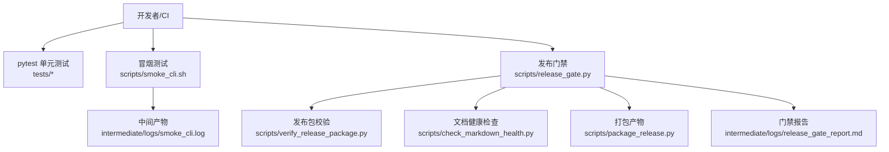
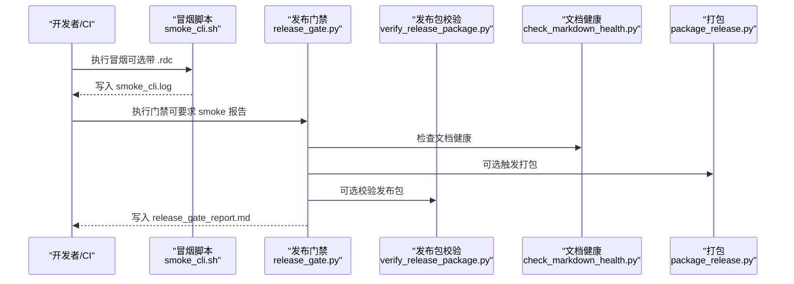
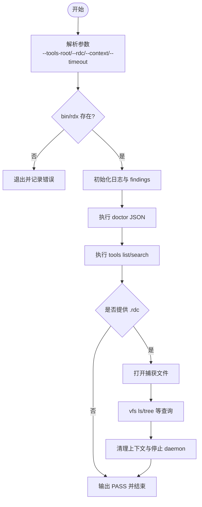
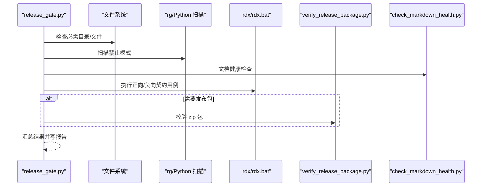
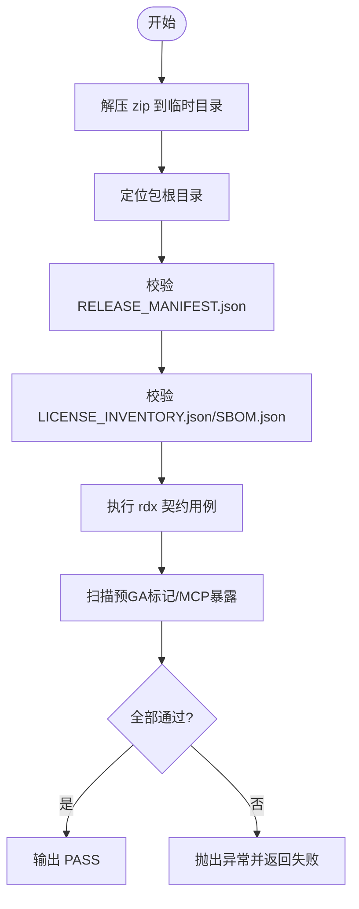
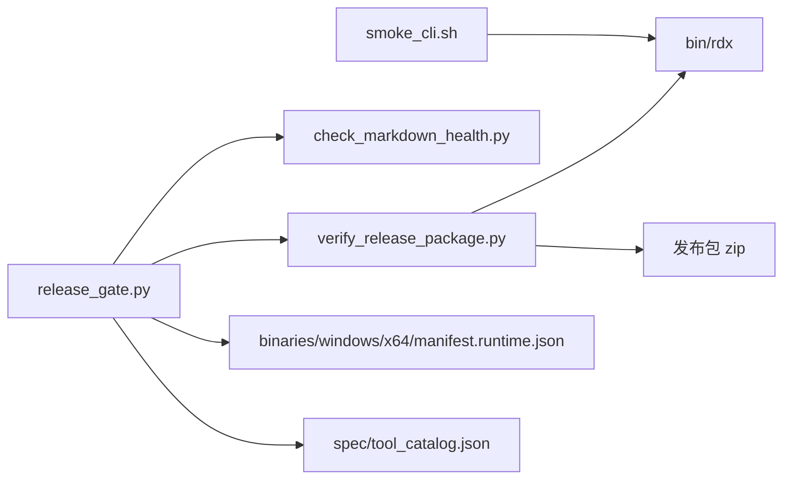

# 测试自动化

<cite>
**本文引用的文件**
- [smoke_cli.sh](file://scripts/smoke_cli.sh)
- [release_gate.py](file://scripts/release_gate.py)
- [verify_release_package.py](file://scripts/verify_release_package.py)
- [_shared.py](file://scripts/_shared.py)
- [pyproject.toml](file://pyproject.toml)
- [conftest.py](file://tests/conftest.py)
- [check_markdown_health.py](file://scripts/check_markdown_health.py)
- [package_release.py](file://scripts/package_release.py)
- [release-baseline.md](file://docs/release-baseline.md)
- [README.md](file://scripts/README.md)
</cite>

## 目录
1. [简介](#简介)
2. [项目结构](#项目结构)
3. [核心组件](#核心组件)
4. [架构总览](#架构总览)
5. [详细组件分析](#详细组件分析)
6. [依赖关系分析](#依赖关系分析)
7. [性能与并行化建议](#性能与并行化建议)
8. [故障排查指南](#故障排查指南)
9. [结论](#结论)
10. [附录：脚本示例与流水线配置](#附录脚本示例与流水线配置)

## 简介
本文件面向RDC-Tool项目的测试自动化，覆盖以下目标：
- 说明冒烟测试脚本如何快速验证命令行工具的基本能力。
- 解释发布门禁测试的设计与执行时机（提交前、发布前）。
- 给出测试结果收集、失败分析与质量指标统计方法。
- 提供持续集成流水线的配置思路（并行执行、缓存优化、通知）。
- 展示自动化测试执行与环境准备的脚本示例。
- 说明测试覆盖率收集与报告的方法。

## 项目结构
本项目将测试相关能力分布在如下位置：
- 冒烟测试：scripts/smoke_cli.sh
- 发布门禁：scripts/release_gate.py
- 发布包校验：scripts/verify_release_package.py
- 公共工具：scripts/_shared.py
- 文档健康检查：scripts/check_markdown_health.py
- 打包产物：scripts/package_release.py
- 测试框架配置：pyproject.toml、tests/conftest.py
- 发布基线流程：docs/release-baseline.md、scripts/README.md

图表来源
- [smoke_cli.sh:1-264](file://scripts/smoke_cli.sh#L1-L264)
- [release_gate.py:520-673](file://scripts/release_gate.py#L520-L673)
- [verify_release_package.py:301-332](file://scripts/verify_release_package.py#L301-L332)
- [check_markdown_health.py:1-61](file://scripts/check_markmarkdown_health.py#L1-L61)
- [package_release.py:191-214](file://scripts/package_release.py#L191-L214)

章节来源
- [pyproject.toml:36-44](file://pyproject.toml#L36-L44)
- [conftest.py:1-46](file://tests/conftest.py#L1-L46)
- [release-baseline.md:1-22](file://docs/release-baseline.md#L1-L22)
- [scripts/README.md:1-29](file://scripts/README.md#L1-L29)

## 核心组件
- 冒烟测试脚本 smoke_cli.sh
  - 通过 bin/rdx 执行 doctor、tools list/search、capture open/status、vfs ls/tree 等关键路径。
  - 支持 --rdc 参数进行捕获文件链路验证；输出日志到 intermediate/logs/smoke_cli.log，并生成 findings 摘要。
  - 使用 /usr/bin/timeout 或系统 timeout 命令限制单步超时，避免卡死。
- 发布门禁 release_gate.py
  - 校验目录/文件完整性、清单 manifest、捆绑 Python 布局、用户文档规范、公开命令帮助文本、工具目录一致性、MCP 暴露面等。
  - 调用 public 入口 rdx 和 rdx.bat 执行一组正向/负向用例，确保 CLI 契约稳定。
  - 可选要求 smoke_cli.log 存在且标记 PASS，以及 dist 下的发布包存在并通过 verify_release_package.py。
  - 输出统一门禁报告 intermediate/logs/release_gate_report.md。
- 发布包校验 verify_release_package.py
  - 解压 zip，校验 RELEASE_MANIFEST.json、LICENSE_INVENTORY.json、SBOM.json。
  - 在隔离环境中运行 rdx 的 doctor/version/tools list/context/vfs 等契约用例，并检查负面契约。
  - 扫描预 GA 标记与 MCP 暴露面，防止未发布内容进入发布包。
- 共享工具 _shared.py
  - 提供 tools_root、run_subprocess、extract_json_payload、write_text 等通用能力，被门禁与校验脚本复用。
- 文档健康 check_markdown_health.py
  - 检查必需文档、导航链接、危险字符等，保证文档质量。
- 打包 package_release.py
  - 生成 zip 包与 SHA256SUMS，并输出 release_report.md。
- 测试框架 pyproject.toml 与 tests/conftest.py
  - pytest 配置 testpaths、忽略目录、markers。
  - conftest 设置 RDX_INTERMEDIATE_ROOT、清理运行时状态，保证测试隔离。

章节来源
- [smoke_cli.sh:18-264](file://scripts/smoke_cli.sh#L18-L264)
- [release_gate.py:28-673](file://scripts/release_gate.py#L28-L673)
- [verify_release_package.py:23-332](file://scripts/verify_release_package.py#L23-L332)
- [_shared.py:10-92](file://scripts/_shared.py#L10-L92)
- [check_markdown_health.py:1-61](file://scripts/check_markdown_health.py#L1-L61)
- [package_release.py:191-214](file://scripts/package_release.py#L191-L214)
- [pyproject.toml:36-44](file://pyproject.toml#L36-L44)
- [conftest.py:10-46](file://tests/conftest.py#L10-L46)

## 架构总览
冒烟测试与发布门禁形成“快速验证 + 严格门禁”的双层保障：
- 冒烟测试聚焦端到端的关键路径，产出可审计日志。
- 发布门禁在源码树与发布包两个层面做全面校验，包括契约、文档、清单、安全与合规项。
- 两者均通过中间目录 intermediate 输出结果，便于 CI 归档与可视化。

图表来源
- [smoke_cli.sh:229-264](file://scripts/smoke_cli.sh#L229-L264)
- [release_gate.py:520-673](file://scripts/release_gate.py#L520-L673)
- [verify_release_package.py:301-332](file://scripts/verify_release_package.py#L301-L332)
- [check_markdown_health.py:1-61](file://scripts/check_markdown_health.py#L1-L61)
- [package_release.py:191-214](file://scripts/package_release.py#L191-L214)

## 详细组件分析

### 冒烟测试脚本 smoke_cli.sh
- 功能要点
  - 解析参数：--tools-root、--rdc、--context、--timeout、--open-timeout。
  - 定位 RDX 启动器 bin/rdx，准备 intermediate 日志与 findings。
  - 检测并记录 .rdc 文件大小与 SHA256。
  - 按步骤执行 CLI 命令，记录 COMMAND_LOG 与 RESULT_LOG。
  - 对超时与失败分支打印上下文状态并清理 daemon 上下文。
  - 无 .rdc 时仅执行入口级冒烟；有 .rdc 时执行 capture open/status、vfs 查询、daemon tools list 等。
- 关键流程

图表来源
- [smoke_cli.sh:18-264](file://scripts/smoke_cli.sh#L18-L264)

章节来源
- [smoke_cli.sh:18-264](file://scripts/smoke_cli.sh#L18-L264)

### 发布门禁 release_gate.py
- 功能要点
  - 结构检查：必需目录/文件存在性。
  - 代码扫描：禁止引用扩展路径、调试框架术语；用户文档禁止 venv/pip 引导与 rdx.bat 命令示例。
  - 公开表面：catalog 名称集合与指纹一致；工具参考文档与代码定义一致；不暴露 MCP 公开入口。
  - 清单与运行时：manifest.runtime.json 完整性校验；捆绑 Python 布局校验。
  - 入口契约：rdx --help/--version/--json doctor/tools list/context status/list/update/clear、vfs ls、rdx.bat 非交互 doctor。
  - 负面契约：TSV 投影不支持、缺失 tabular projection、session_required 等错误码预期。
  - 报告：汇总所有检查项为 Markdown 报告。
- 关键流程

图表来源
- [release_gate.py:28-673](file://scripts/release_gate.py#L28-L673)

章节来源
- [release_gate.py:28-673](file://scripts/release_gate.py#L28-L673)

### 发布包校验 verify_release_package.py
- 功能要点
  - 解压 zip，定位包根目录。
  - 校验 RELEASE_MANIFEST.json、LICENSE_INVENTORY.json、SBOM.json。
  - 在隔离环境执行 rdx 契约用例（doctor/version/tools list/context/vfs），并断言负面契约。
  - 扫描预 GA 标记与 MCP 暴露面，防止未发布内容进入发布包。
- 关键流程

图表来源
- [verify_release_package.py:119-332](file://scripts/verify_release_package.py#L119-L332)

章节来源
- [verify_release_package.py:119-332](file://scripts/verify_release_package.py#L119-L332)

### 共享工具 _shared.py
- 提供跨脚本复用的能力：
  - tools_root：根据环境变量或锚点文件解析仓库根。
  - run_subprocess：统一子进程调用，捕获 stdout/stderr。
  - extract_json_payload：从混合文本中抽取 JSON 负载。
  - write_text/load_json：安全的读写 JSON/文本。

章节来源
- [_shared.py:10-92](file://scripts/_shared.py#L10-L92)

### 测试框架与隔离
- pytest 配置
  - 测试路径 tests，忽略 .git、intermediate、binaries。
  - 标记 unit、contract、fixture_integration、gpu_live，便于选择性执行。
- 测试隔离
  - 通过 RDX_INTERMEDIATE_ROOT 指定隔离中间目录。
  - 自动清理 runtime_state、runtime_logs、context_snapshot，避免测试间污染。

章节来源
- [pyproject.toml:36-44](file://pyproject.toml#L36-L44)
- [conftest.py:10-46](file://tests/conftest.py#L10-L46)

## 依赖关系分析
- 冒烟脚本依赖 bin/rdx 与可选 /usr/bin/timeout。
- 发布门禁依赖：
  - 源码树中的 spec/tool_catalog.json、docs/tool-reference.md。
  - 二进制清单 binaries/windows/x64/manifest.runtime.json。
  - 可选 dist 下的发布包与 scripts/verify_release_package.py。
- 发布包校验依赖 zip 包内的 RELEASE_MANIFEST.json、LICENSE_INVENTORY.json、SBOM.json 及 rdx/rdx.bat。
- 共享工具被门禁与校验脚本共同使用，降低重复实现。

图表来源
- [smoke_cli.sh:71-87](file://scripts/smoke_cli.sh#L71-L87)
- [release_gate.py:28-673](file://scripts/release_gate.py#L28-L673)
- [verify_release_package.py:119-332](file://scripts/verify_release_package.py#L119-L332)

章节来源
- [release_gate.py:28-673](file://scripts/release_gate.py#L28-L673)
- [verify_release_package.py:119-332](file://scripts/verify_release_package.py#L119-L332)

## 性能与并行化建议
- 并行执行
  - pytest 可使用 -n 选项并行执行单元与契约测试，缩短 CI 时间。
  - 冒烟与门禁可并行：冒烟侧重运行时行为，门禁侧重静态与契约，互不干扰。
- 缓存优化
  - 缓存 Python 虚拟环境与 pip/uv 包索引，减少安装耗时。
  - 缓存 binaries/windows/x64/python 与 pymodules，避免重复下载。
  - 缓存 intermediate 目录中的构建产物（如 catalog、tool reference），但需确保失效策略正确。
- 资源隔离
  - 每个任务使用独立的 RDX_INTERMEDIATE_ROOT，避免状态冲突。
  - 冒烟脚本已支持 --context 隔离上下文，建议在 CI 中为每次执行分配唯一 context。

[本节为通用指导，无需特定文件来源]

## 故障排查指南
- 冒烟失败
  - 查看 intermediate/logs/smoke_cli.log 中的步骤日志与失败原因。
  - 若超时，检查 --timeout 与 --open-timeout 是否合理；确认 /usr/bin/timeout 可用。
  - 若 .rdc 路径无效，确认路径存在并可读。
- 门禁失败
  - 查看 intermediate/logs/release_gate_report.md，逐项定位 FAIL 的检查名与详情。
  - 常见失败：catalog 不一致、工具参考过时、用户文档包含禁用模式、manifest 校验失败。
- 发布包校验失败
  - verify_release_package.py 会抛出具体异常信息，检查 zip 包内清单与契约用例输出。
  - 注意预 GA 标记与 MCP 暴露面扫描结果。

章节来源
- [smoke_cli.sh:123-227](file://scripts/smoke_cli.sh#L123-L227)
- [release_gate.py:520-673](file://scripts/release_gate.py#L520-L673)
- [verify_release_package.py:301-332](file://scripts/verify_release_package.py#L301-L332)

## 结论
RDC-Tool 的测试自动化以冒烟脚本与发布门禁为核心，辅以发布包校验与文档健康检查，形成从快速验证到严格门禁的完整闭环。通过中间目录集中输出日志与报告，便于 CI 归档与问题定位。结合并行执行与缓存优化，可在保证质量的同时提升流水线效率。

[本节为总结，无需特定文件来源]

## 附录：脚本示例与流水线配置

### 冒烟测试执行示例
- 基础冒烟（仅入口）：
  - bash scripts/smoke_cli.sh
- 带捕获文件的冒烟：
  - bash scripts/smoke_cli.sh --rdc "C:/path/sample.rdc" --context cli-smoke
- 自定义超时：
  - bash scripts/smoke_cli.sh --timeout 180 --open-timeout 600 --context smoke-123

章节来源
- [smoke_cli.sh:18-264](file://scripts/smoke_cli.sh#L18-L264)
- [scripts/README.md:15-22](file://scripts/README.md#L15-L22)

### 发布基线与门禁
- 发布前完整流程：
  - python spec/validate_catalog.py
  - python scripts/generate_tool_reference.py --check
  - python -m pytest tests -q
  - python scripts/check_markdown_health.py
  - python scripts/package_release.py
  - python scripts/release_gate.py --require-smoke-reports --require-release-package
- 直接运行冒烟作为门禁证据：
  - bash scripts/smoke_cli.sh --context release-smoke
  - bash scripts/smoke_cli.sh --rdc "C:/path/sample.rdc" --context release-smoke

章节来源
- [release-baseline.md:1-22](file://docs/release-baseline.md#L1-L22)
- [scripts/README.md:1-29](file://scripts/README.md#L1-L29)

### 持续集成流水线建议
- 阶段划分
  - 构建与缓存：恢复 Python 环境、二进制与模块缓存。
  - 单元测试：pytest 并行执行，标记筛选 unit/contract。
  - 冒烟测试：独立作业，输出 smoke_cli.log。
  - 文档健康：check_markdown_health.py。
  - 打包与校验：package_release.py 与 verify_release_package.py。
  - 门禁：release_gate.py，聚合报告。
- 并行策略
  - 单元测试与冒烟可并行；门禁在冒烟完成后执行（如需 smoke 证据）。
- 缓存键
  - 基于依赖锁定文件与操作系统平台生成缓存键。
- 通知机制
  - 失败时发送通知（邮件/聊天群），附带报告路径与关键日志片段。
- 工件归档
  - 归档 intermediate/logs/smoke_cli.log 与 release_gate_report.md。

[本节为通用指导，无需特定文件来源]

### 测试覆盖率收集与报告
- 推荐方案
  - 使用 coverage.py 收集覆盖率，配合 pytest-cov 插件。
  - 在 CI 中生成 HTML 与 XML 报告，上传至制品库。
- 执行方式
  - 在 pytest 命令中加入 --cov=rdx --cov-report=html --cov-report=xml。
  - 将 intermediate/coverage 目录作为工件归档。
- 阈值与门禁
  - 可设置覆盖率阈值，低于阈值则门禁失败。
  - 针对新增代码提高覆盖率要求，逐步提升整体质量。

[本节为通用指导，无需特定文件来源]