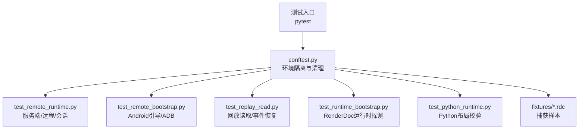
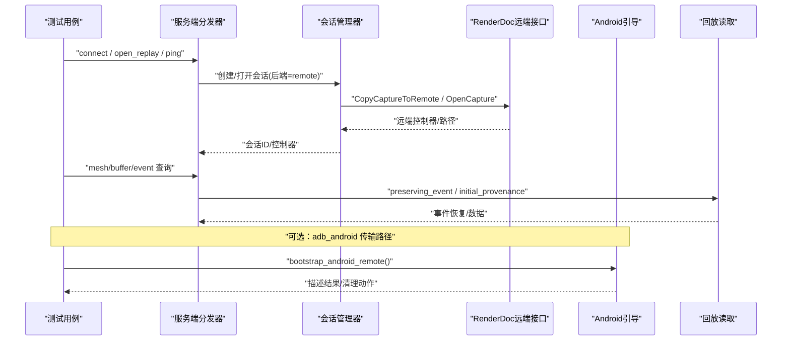
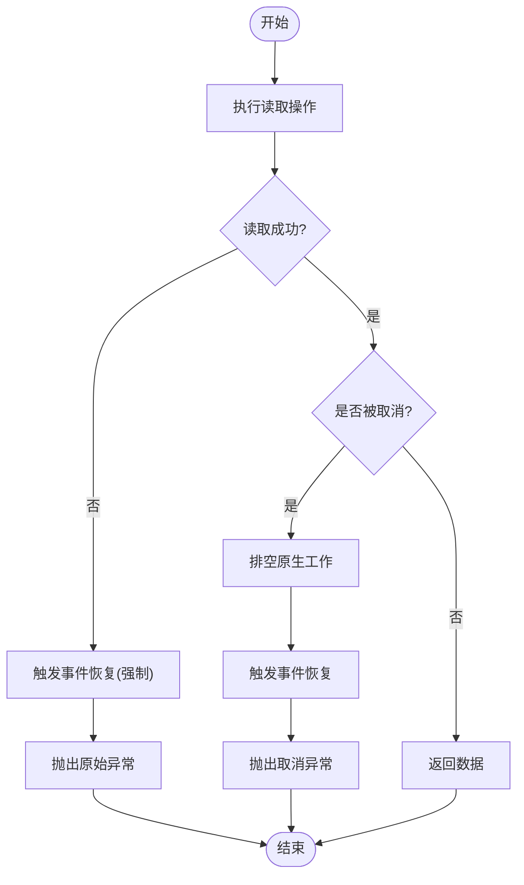
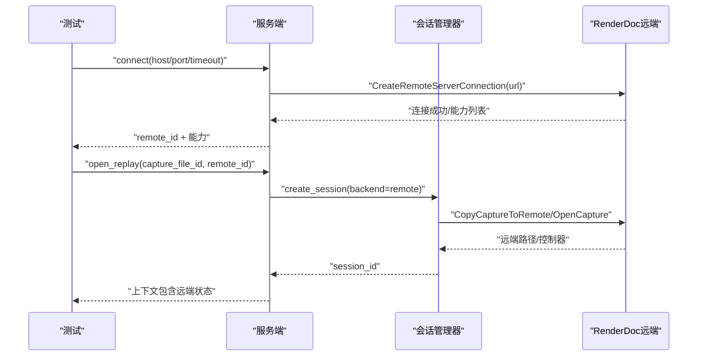
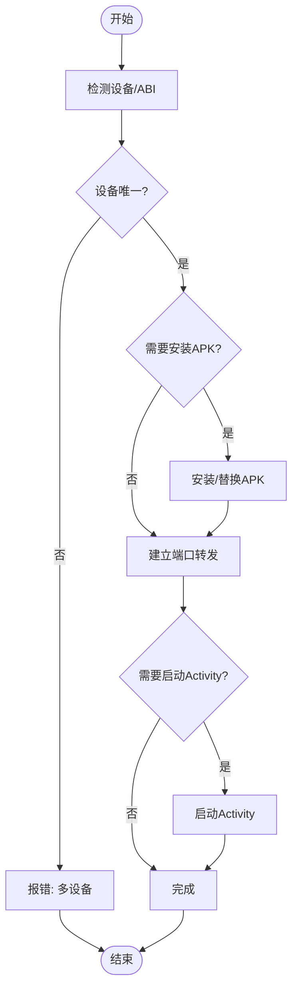
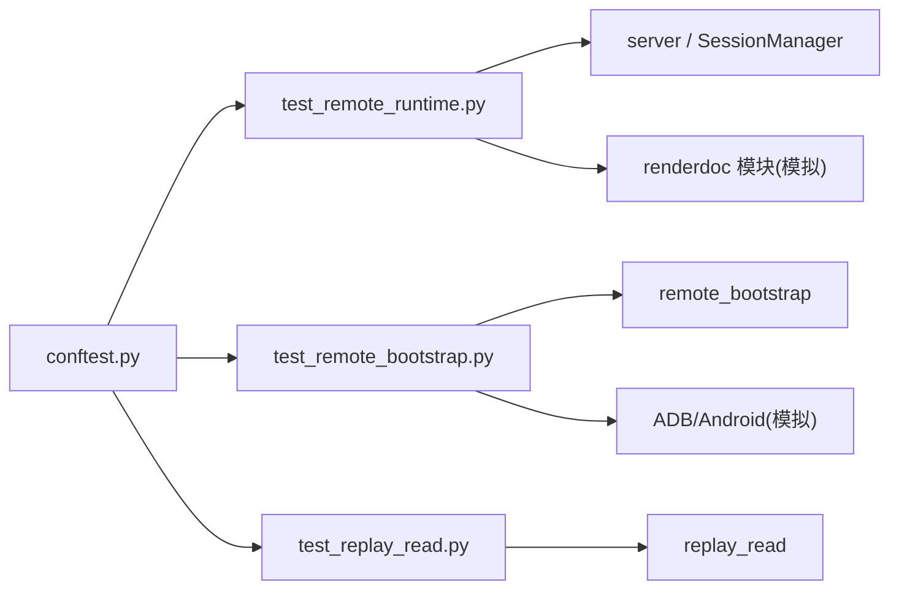

# 集成测试

<cite>
**本文引用的文件**
- [tests/conftest.py](file://tests/conftest.py)
- [tests/test_replay_read.py](file://tests/test_replay_read.py)
- [tests/test_remote_runtime.py](file://tests/test_remote_runtime.py)
- [tests/test_remote_bootstrap.py](file://tests/test_remote_bootstrap.py)
- [tests/test_runtime_bootstrap.py](file://tests/test_runtime_bootstrap.py)
- [tests/test_python_runtime.py](file://tests/test_python_runtime.py)
- [tests/fixtures/README.md](file://tests/fixtures/README.md)
- [tests/test_docs_and_fixtures.py](file://tests/test_docs_and_fixtures.py)
- [pyproject.toml](file://pyproject.toml)
- [binaries/windows/x64/renderdoc.json](file://binaries/windows/x64/renderdoc.json)
- [binaries/windows/x64/manifest.runtime.json](file://binaries/windows/x64/manifest.runtime.json)
</cite>

## 目录
1. [简介](#简介)
2. [项目结构](#项目结构)
3. [核心组件](#核心组件)
4. [架构总览](#架构总览)
5. [详细组件分析](#详细组件分析)
6. [依赖关系分析](#依赖关系分析)
7. [性能考虑](#性能考虑)
8. [故障排查指南](#故障排查指南)
9. [结论](#结论)
10. [附录](#附录)

## 简介
本文件面向RDC-Tool项目的集成测试，系统性说明如何验证组件间交互与端到端流程。重点覆盖：
- 运行时启动、远程连接、回放读取与服务端事件处理
- 完整测试环境搭建（RenderDoc二进制、Python运行时、网络模拟）
- 捕获文件完整处理流程、会话管理、远程Android设备连接
- 测试数据管理（.rdc文件、模拟设备响应）
- 异步操作与资源清理策略

## 项目结构
测试相关的关键位置与职责：
- tests/conftest.py：全局测试夹具与环境隔离，设置中间产物目录、渲染模块路径、运行时DLL目录，并在每个用例前后清理上下文状态与快照。
- tests/*_runtime*.py：围绕服务端、远程连接、会话生命周期、远端Android引导的集成测试。
- tests/test_replay_read.py：回放读取与事件恢复的集成行为验证。
- tests/test_remote_bootstrap.py：Android远程引导、ADB转发、APK安装与清理等流程验证。
- tests/test_runtime_bootstrap.py：RenderDoc运行时探测与路径注入。
- tests/test_python_runtime.py：内置Python布局校验。
- tests/fixtures/README.md：公共.rdc捕获文件的来源、大小与哈希约束。
- pyproject.toml：pytest配置、标记与测试路径。

**图示来源**
- [tests/conftest.py:10-27](file://tests/conftest.py#L10-L27)
- [pyproject.toml:36-44](file://pyproject.toml#L36-L44)

**章节来源**
- [tests/conftest.py:10-46](file://tests/conftest.py#L10-L46)
- [pyproject.toml:36-44](file://pyproject.toml#L36-L44)

## 核心组件
- 测试环境与隔离
  - 通过环境变量指定工具根、工件目录、RenderDoc Python模块路径与运行时DLL目录，确保测试在受控环境中运行。
  - 自动夹具在每个用例前后清理运行时状态、日志与上下文快照，避免用例间污染。
- 回放读取与事件恢复
  - 验证读取失败时能回滚到上一帧事件；取消任务时先排空原生工作再恢复事件；恢复失败不会返回成功。
- 远程连接与会话管理
  - 复用拥有者连接、本地复制捕获文件到远端、打开远端捕获并维持活跃句柄；支持ADB Android传输；验证跨上下文句柄复用限制与已消耗句柄的生命周期错误。
- Android远程引导
  - 选择ADB设备、安装或复用辅助APK、建立端口转发、启动Activity、清理资源；支持预算与取消、超时控制。
- 运行时与Python
  - 探测并注入RenderDoc运行时路径；校验内置Python布局完整性。

**章节来源**
- [tests/conftest.py:10-46](file://tests/conftest.py#L10-L46)
- [tests/test_replay_read.py:10-176](file://tests/test_replay_read.py#L10-L176)
- [tests/test_remote_runtime.py:18-800](file://tests/test_remote_runtime.py#L18-L800)
- [tests/test_remote_bootstrap.py:11-336](file://tests/test_remote_bootstrap.py#L11-L336)
- [tests/test_runtime_bootstrap.py:13-39](file://tests/test_runtime_bootstrap.py#L13-L39)
- [tests/test_python_runtime.py:17-61](file://tests/test_python_runtime.py#L17-L61)

## 架构总览
下图展示集成测试中关键调用链：从服务端分发器到会话管理器、远端服务器、Android引导与回放读取。

**图示来源**
- [tests/test_remote_runtime.py:72-94](file://tests/test_remote_runtime.py#L72-L94)
- [tests/test_remote_runtime.py:187-300](file://tests/test_remote_runtime.py#L187-L300)
- [tests/test_replay_read.py:10-49](file://tests/test_replay_read.py#L10-L49)
- [tests/test_remote_bootstrap.py:189-212](file://tests/test_remote_bootstrap.py#L189-L212)

## 详细组件分析

### 回放读取与事件恢复
- 设计要点
  - 使用“保留事件”包装读取逻辑，确保异常或取消时能恢复到指定帧事件。
  - 初始内容溯源需满足字节完整性、资源匹配与子资源覆盖要求。
- 关键场景
  - 读取失败：抛出原始异常，同时记录一次强制恢复。
  - 任务取消：等待原生工作完成后恢复事件，最终抛出取消异常。
  - 恢复失败：封装为特定错误类型，不掩盖底层原因。
  - API参数校验：对事件查询的参数进行严格校验，拒绝非法组合。

**图示来源**
- [tests/test_replay_read.py:10-49](file://tests/test_replay_read.py#L10-L49)
- [tests/test_replay_read.py:113-165](file://tests/test_replay_read.py#L113-L165)

**章节来源**
- [tests/test_replay_read.py:10-176](file://tests/test_replay_read.py#L10-L176)

### 远程连接与会话管理
- 设计要点
  - 复用已有远端连接，避免重复创建；本地复制捕获文件到远端后打开。
  - 会话级持有远端句柄，跨上下文限制复用；已消耗句柄禁止再次使用。
  - 支持ADB Android传输，无需显式host/port即可连接。
- 关键场景
  - 连接成功：返回活跃句柄与服务器能力信息。
  - 连接失败：不分配远端ID，保持状态一致。
  - 打开回放：保持活跃远端句柄，更新上下文中的远端状态。
  - 应用启动：将远端ExecuteAndInject的状态映射为明确的错误码与信息。

**图示来源**
- [tests/test_remote_runtime.py:72-94](file://tests/test_remote_runtime.py#L72-L94)
- [tests/test_remote_runtime.py:187-300](file://tests/test_remote_runtime.py#L187-L300)
- [tests/test_remote_runtime.py:302-384](file://tests/test_remote_runtime.py#L302-L384)

**章节来源**
- [tests/test_remote_runtime.py:72-384](file://tests/test_remote_runtime.py#L72-L384)

### Android远程引导
- 设计要点
  - 多设备时要求明确序列号；按ABI选择对应APK包名；支持ADB路径环境变量覆盖。
  - 安装或复用辅助APK，建立端口转发，启动Activity；提供清理函数移除转发与配置。
  - 连接预算与取消：支持超时与取消信号，保证资源回滚。
- 关键场景
  - 选择设备：多设备报错；单设备直接选择。
  - 安装APK：签名不匹配时尝试卸载重装；卸载失败上报具体错误。
  - 端口转发：冲突时拒绝重绑定；借用模式不破坏外部进程。
  - 清理：仅停止自有进程，删除自有转发，删除临时配置。

**图示来源**
- [tests/test_remote_bootstrap.py:11-38](file://tests/test_remote_bootstrap.py#L11-L38)
- [tests/test_remote_bootstrap.py:76-107](file://tests/test_remote_bootstrap.py#L76-L107)
- [tests/test_remote_bootstrap.py:138-180](file://tests/test_remote_bootstrap.py#L138-L180)
- [tests/test_remote_bootstrap.py:189-212](file://tests/test_remote_bootstrap.py#L189-L212)
- [tests/test_remote_bootstrap.py:275-311](file://tests/test_remote_bootstrap.py#L275-L311)

**章节来源**
- [tests/test_remote_bootstrap.py:11-336](file://tests/test_remote_bootstrap.py#L11-L336)

### 运行时与Python环境
- RenderDoc运行时探测
  - 支持通过环境变量指定运行时DLL目录；自动注入Python模块路径；Windows平台可探测导入成功与否。
- 内置Python布局校验
  - 校验Python可执行、DLL、标准库与site-packages布局；读取manifest.runtime.json中的元数据。

**章节来源**
- [tests/test_runtime_bootstrap.py:13-39](file://tests/test_runtime_bootstrap.py#L13-L39)
- [tests/test_python_runtime.py:17-61](file://tests/test_python_runtime.py#L17-L61)
- [binaries/windows/x64/manifest.runtime.json](file://binaries/windows/x64/manifest.runtime.json)

## 依赖关系分析
- 测试与模块耦合
  - conftest.py为所有测试提供统一的环境隔离与清理，降低模块间耦合。
  - test_remote_runtime.py依赖server、SessionManager、models等核心模块，通过monkeypatch替换外部依赖（如renderdoc模块）。
  - test_remote_bootstrap.py依赖remote_bootstrap，通过mock subprocess与ADB命令验证流程。
  - test_replay_read.py依赖replay_read与runtime_catalog，验证回放读取与参数校验。
- 外部依赖与集成点
  - RenderDoc二进制与Python模块：通过环境变量与运行时探测注入。
  - ADB与Android设备：通过ADB命令与端口转发模拟真实设备交互。
  - .rdc捕获文件：作为测试输入，确保大小与哈希稳定。

**图示来源**
- [tests/conftest.py:10-27](file://tests/conftest.py#L10-L27)
- [tests/test_remote_runtime.py:18-94](file://tests/test_remote_runtime.py#L18-L94)
- [tests/test_remote_bootstrap.py:11-38](file://tests/test_remote_bootstrap.py#L11-L38)
- [tests/test_replay_read.py:10-49](file://tests/test_replay_read.py#L10-L49)

**章节来源**
- [tests/conftest.py:10-46](file://tests/conftest.py#L10-L46)
- [tests/test_remote_runtime.py:18-384](file://tests/test_remote_runtime.py#L18-L384)
- [tests/test_remote_bootstrap.py:11-336](file://tests/test_remote_bootstrap.py#L11-L336)
- [tests/test_replay_read.py:10-176](file://tests/test_replay_read.py#L10-L176)

## 性能考虑
- 回放读取优化
  - 使用“保留事件”减少不必要的帧切换开销；在取消时尽快恢复事件，避免阻塞。
- 远程连接优化
  - 复用远端连接与控制器，减少握手与复制成本；仅在必要时复制捕获文件到远端。
- Android引导优化
  - 复用现有辅助进程与端口转发，避免重复安装与启动；预算与取消机制防止长时间阻塞。
- I/O与内存
  - 缓冲区读取尽量保持在内存中，避免不必要的持久化；仅在需要时生成工件。

[本节为通用指导，不直接分析具体文件]

## 故障排查指南
- 回放读取失败
  - 检查读取回调是否抛出异常；确认事件恢复是否被触发；查看恢复失败时的错误封装。
- 远程连接失败
  - 检查远端Ping状态；确认连接超时与终端状态（如版本不兼容）不会重试；验证已消耗句柄的错误码。
- Android引导失败
  - 检查ADB路径与设备状态；确认APK安装与卸载错误码；验证端口转发冲突与借用模式下的清理行为。
- 运行时与Python
  - 校验内置Python布局缺失项；确认RenderDoc模块导入路径与环境变量设置正确。

**章节来源**
- [tests/test_replay_read.py:51-63](file://tests/test_replay_read.py#L51-L63)
- [tests/test_remote_runtime.py:219-247](file://tests/test_remote_runtime.py#L219-L247)
- [tests/test_remote_runtime.py:433-467](file://tests/test_remote_runtime.py#L433-L467)
- [tests/test_remote_bootstrap.py:214-230](file://tests/test_remote_bootstrap.py#L214-L230)
- [tests/test_python_runtime.py:17-61](file://tests/test_python_runtime.py#L17-L61)

## 结论
RDC-Tool的集成测试通过严格的夹具隔离、详尽的模拟与断言，覆盖了回放读取、远程连接、Android引导与运行时初始化等关键路径。测试不仅验证正常流程，还充分覆盖异常、取消与资源清理场景，确保系统在复杂交互下的稳定性与可维护性。建议持续扩展测试用例以覆盖更多边界条件，并保持测试数据与环境的稳定性。

[本节为总结，不直接分析具体文件]

## 附录
- 测试数据管理
  - fixtures目录包含小型公共.rdc捕获文件，用于测试输入；通过哈希与大小校验确保一致性。
  - 可通过CLI传入外部捕获路径进行更广泛的冒烟测试。
- 测试标记与运行
  - 使用pytest标记区分单元、契约、fixture集成与GPU现场测试；默认跳过intermediate与binaries目录。

**章节来源**
- [tests/fixtures/README.md:1-26](file://tests/fixtures/README.md#L1-L26)
- [tests/test_docs_and_fixtures.py:60-83](file://tests/test_docs_and_fixtures.py#L60-L83)
- [pyproject.toml:36-44](file://pyproject.toml#L36-L44)