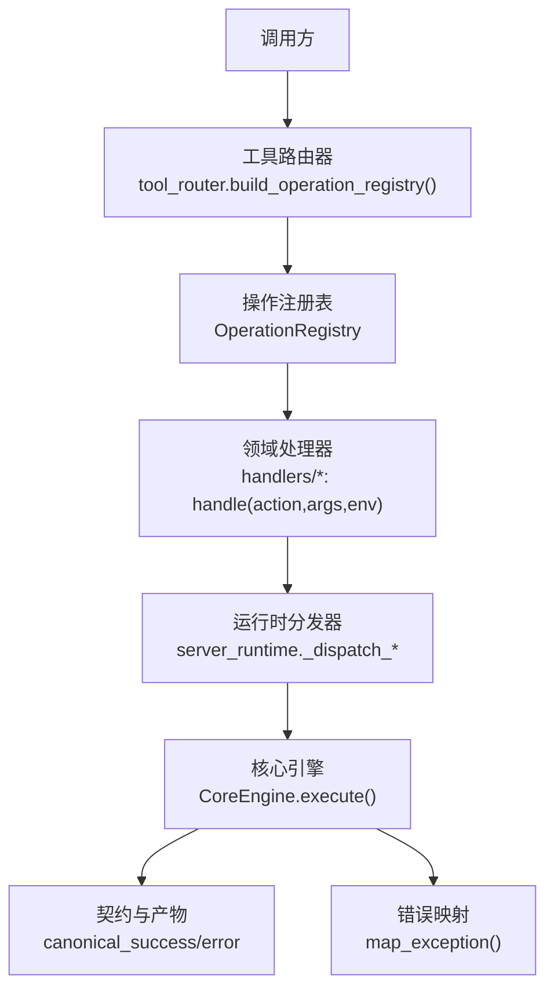
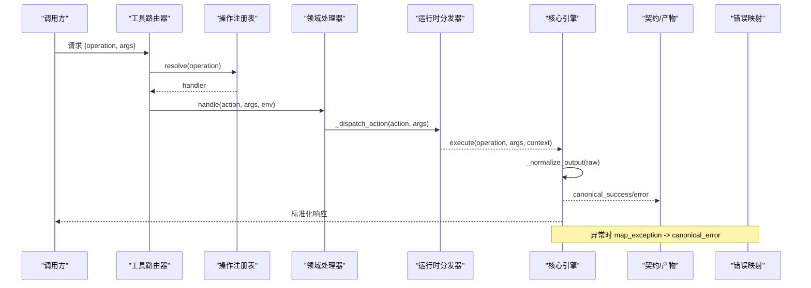
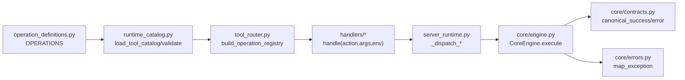

# 处理器实现

<cite>
**本文引用的文件**
- [operation_registry.py](file://rdx/core/operation_registry.py)
- [engine.py](file://rdx/core/engine.py)
- [contracts.py](file://rdx/core/contracts.py)
- [errors.py](file://rdx/core/errors.py)
- [tool_router.py](file://rdx/tool_router.py)
- [runtime_catalog.py](file://rdx/runtime_catalog.py)
- [server_runtime.py](file://rdx/server_runtime.py)
- [handlers/core.py](file://rdx/handlers/core.py)
- [handlers/capture.py](file://rdx/handlers/capture.py)
- [handlers/buffer.py](file://rdx/handlers/buffer.py)
- [handlers/session.py](file://rdx/handlers/session.py)
- [handlers/util.py](file://rdx/handlers/util.py)
- [operation_definitions.py](file://rdx/operation_definitions.py)
</cite>

## 目录
1. [简介](#简介)
2. [项目结构](#项目结构)
3. [核心组件](#核心组件)
4. [架构总览](#架构总览)
5. [详细组件分析](#详细组件分析)
6. [依赖关系分析](#依赖关系分析)
7. [性能考虑](#性能考虑)
8. [故障排查指南](#故障排查指南)
9. [结论](#结论)
10. [附录](#附录)

## 简介
本指南面向需要为新操作编写“处理器函数”的开发者，系统说明处理器的基本结构、参数解析、业务逻辑实现与返回值格式化；解释错误处理模式（异常捕获、错误信息封装、状态恢复）；阐述状态管理机制（会话状态访问、上下文操作、资源清理）；提供从简单查询到复杂操作的完整实现范式；说明与核心引擎的集成方式（操作注册、执行调度、结果返回）；并覆盖异步处理模式、并发安全考量、性能优化建议与最佳实践。

## 项目结构
RDX 采用“目录即命名空间”的处理器组织方式：每个领域（如 buffer、capture、core、session 等）在 rdx/handlers 下提供统一的 handle(action, args, env) 入口，由 tool_router 根据 catalog 动态路由到对应领域处理器，再由 server_runtime 将 action 分派到具体实现。核心引擎 CoreEngine 负责统一执行、规范化输出与错误归一化。

图表来源
- [tool_router.py:131-154](file://rdx/tool_router.py#L131-L154)
- [operation_registry.py:18-43](file://rdx/core/operation_registry.py#L18-L43)
- [engine.py:30-75](file://rdx/core/engine.py#L30-L75)
- [contracts.py:98-164](file://rdx/core/contracts.py#L98-L164)
- [errors.py:90-119](file://rdx/core/errors.py#L90-L119)

章节来源
- [tool_router.py:1-156](file://rdx/tool_router.py#L1-L156)
- [operation_registry.py:1-45](file://rdx/core/operation_registry.py#L1-L45)
- [engine.py:1-204](file://rdx/core/engine.py#L1-L204)

## 核心组件
- 操作注册表 OperationRegistry：维护 name→handler 映射，支持批量注册、默认处理器、名称列表。
- 核心引擎 CoreEngine：统一执行入口，负责参数传递、结果规范化、错误归一化、元数据注入。
- 契约 contracts：定义成功/失败的标准响应结构与产物收集。
- 错误体系 errors：统一异常分类与映射，确保错误码、类别、详情一致。
- 工具路由器 tool_router：基于 catalog 构建注册表，校验参数、前置条件检查、路由到领域处理器。
- 运行时 server_runtime：承载全局状态（捕获句柄、回放会话、远程连接、预览绑定等），并提供 _dispatch_* 分派方法。
- 领域处理器 handlers/*：按领域划分，统一 handle(action, args, env) 接口，内部委托给 server_runtime。

章节来源
- [operation_registry.py:18-43](file://rdx/core/operation_registry.py#L18-L43)
- [engine.py:30-204](file://rdx/core/engine.py#L30-L204)
- [contracts.py:98-164](file://rdx/core/contracts.py#L98-L164)
- [errors.py:9-119](file://rdx/core/errors.py#L9-L119)
- [tool_router.py:34-154](file://rdx/tool_router.py#L34-L154)
- [server_runtime.py:120-238](file://rdx/server_runtime.py#L120-L238)
- [handlers/core.py:8-10](file://rdx/handlers/core.py#L8-L10)
- [handlers/capture.py:8-10](file://rdx/handlers/capture.py#L8-L10)
- [handlers/buffer.py:8-10](file://rdx/handlers/buffer.py#L8-L10)
- [handlers/session.py:8-12](file://rdx/handlers/session.py#L8-L12)
- [handlers/util.py:8-10](file://rdx/handlers/util.py#L8-L10)

## 架构总览
下图展示一次操作调用的端到端流程：从调用方发起，经路由与注册表查找处理器，进入领域处理器后交由运行时分发，最终由核心引擎统一执行、规范化输出与错误处理。

图表来源
- [tool_router.py:131-154](file://rdx/tool_router.py#L131-L154)
- [operation_registry.py:33-43](file://rdx/core/operation_registry.py#L33-L43)
- [engine.py:40-75](file://rdx/core/engine.py#L40-L75)
- [engine.py:77-204](file://rdx/core/engine.py#L77-L204)
- [contracts.py:98-164](file://rdx/core/contracts.py#L98-L164)
- [errors.py:90-119](file://rdx/core/errors.py#L90-L119)

## 详细组件分析

### 处理器基本结构与函数签名
- 统一入口：async def handle(action: str, args: Dict[str, Any], env: Dict[str, Any]) -> Any
- 职责：接收 action 与参数，进行必要校验与前置条件检查，调用领域具体实现，返回任意对象（将被引擎规范化）。
- 示例路径：
  - core 领域：[handle:8-10](file://rdx/handlers/core.py#L8-L10)
  - capture 领域：[handle:8-10](file://rdx/handlers/capture.py#L8-L10)
  - buffer 领域：[handle:8-10](file://rdx/handlers/buffer.py#L8-L10)
  - session 领域（含特殊分支）：[handle:8-12](file://rdx/handlers/session.py#L8-L12)
  - util 领域：[handle:8-10](file://rdx/handlers/util.py#L8-L10)

章节来源
- [handlers/core.py:8-10](file://rdx/handlers/core.py#L8-L10)
- [handlers/capture.py:8-10](file://rdx/handlers/capture.py#L8-L10)
- [handlers/buffer.py:8-10](file://rdx/handlers/buffer.py#L8-L10)
- [handlers/session.py:8-12](file://rdx/handlers/session.py#L8-L12)
- [handlers/util.py:8-10](file://rdx/handlers/util.py#L8-L10)

### 参数解析与校验
- 参数校验由 tool_router 在调用处理器前完成：validate_operation_arguments(name, args)，依据 operation_definitions 中的 input_schema 进行类型、枚举、范围、必填项、未知字段等校验。
- 若校验失败，直接返回结构化错误（success=false, code=validation_error, category=validation）。
- 参考路径：
  - 校验入口：[build_operation_registry:131-154](file://rdx/tool_router.py#L131-L154)
  - 校验实现：[validate_operation_arguments:38-91](file://rdx/runtime_catalog.py#L38-L91)
  - 操作定义与 schema：[OPERATIONS:1-800](file://rdx/operation_definitions.py#L1-L800)

章节来源
- [tool_router.py:131-154](file://rdx/tool_router.py#L131-L154)
- [runtime_catalog.py:38-91](file://rdx/runtime_catalog.py#L38-L91)
- [operation_definitions.py:1-800](file://rdx/operation_definitions.py#L1-L800)

### 前置条件检查与会话上下文
- 前置条件：tool_router 根据 catalog 中 prerequisites 检查必需上下文（如 session_id、capture_file_id、remote_id、active_event_id、capability.remote）。
- 上下文快照：通过 server_runtime._context_snapshot() 获取当前上下文状态，结合运行时状态判断是否满足要求。
- 参考路径：
  - 前置条件判定：[_enforce_prerequisites:112-128](file://rdx/tool_router.py#L112-L128)
  - 上下文快照读取：[_has_prerequisite:89-109](file://rdx/tool_router.py#L89-L109)

章节来源
- [tool_router.py:80-128](file://rdx/tool_router.py#L80-L128)

### 业务逻辑实现与资源管理
- 领域处理器通常将具体逻辑委托给 server_runtime 的 _dispatch_* 方法，这些方法管理捕获句柄、回放会话、远程连接、预览绑定等资源生命周期。
- 关键资源数据结构：
  - CaptureFileHandle、ReplayHandle、RemoteHandle、ShaderDebugHandle、RuntimeState、PreviewBinding
- 参考路径：
  - 资源句柄与运行时状态：[CaptureFileHandle/ReplayHandle/RemoteHandle/...:120-238](file://rdx/server_runtime.py#L120-L238)
  - 会话/上下文状态存取：[_context_state/_store_context_state:450-468](file://rdx/server_runtime.py#L450-L468)
  - 预览绑定与显示状态：[PreviewBinding/_preview_update_payload:217-228](file://rdx/server_runtime.py#L217-L228), [file://rdx/server_runtime.py#L482-L531]

章节来源
- [server_runtime.py:120-238](file://rdx/server_runtime.py#L120-L238)
- [server_runtime.py:450-531](file://rdx/server_runtime.py#L450-L531)

### 返回值格式与产物发布
- 处理器可返回任意对象，CoreEngine._normalize_output 会将其转换为标准信封：
  - 已符合契约的结构体：直接返回
  - 字符串：尝试 JSON 解析，否则包装为 {"raw": ...}
  - dict：识别 success/error_message 或 ok/data 等常见键，生成 canonical_success/error
  - 其他类型：包装为 {"value": ...}
- 产物自动发现：collect_artifact_candidates 扫描 payload 中的路径/URL 字段，发布为 artifacts。
- 参考路径：
  - 规范化输出：[_normalize_output:77-204](file://rdx/core/engine.py#L77-L204)
  - 成功/失败契约：[canonical_success/canonical_error:98-164](file://rdx/core/contracts.py#L98-L164)
  - 产物候选收集：[collect_artifact_candidates:191-221](file://rdx/core/contracts.py#L191-L221)

章节来源
- [engine.py:77-204](file://rdx/core/engine.py#L77-L204)
- [contracts.py:98-164](file://rdx/core/contracts.py#L98-L164)
- [contracts.py:191-221](file://rdx/core/contracts.py#L191-L221)

### 错误处理模式
- 异常分类：CoreError 及其子类（ValidationError、NotFoundError、RuntimeToolError、PermissionToolError、IOToolError、InternalToolError）。
- 异常映射：map_exception 将 Python 内置异常与自定义 SessionError 映射为标准 CoreError。
- 引擎层捕获：CoreEngine.execute 捕获所有异常，记录日志，返回 canonical_error，附带 trace_id、transport、duration_ms。
- 参考路径：
  - 错误类定义：[CoreError 及子类:9-87](file://rdx/core/errors.py#L9-L87)
  - 异常映射：[map_exception:90-119](file://rdx/core/errors.py#L90-L119)
  - 引擎异常捕获：[execute:40-75](file://rdx/core/engine.py#L40-L75)

章节来源
- [errors.py:9-119](file://rdx/core/errors.py#L9-L119)
- [engine.py:40-75](file://rdx/core/engine.py#L40-L75)

### 状态管理与资源清理
- 上下文状态：_context_state 加载/创建上下文状态，_store_context_state 持久化；支持限制与容量控制（max_contexts）。
- 会话/捕获/远程：RuntimeState 集中管理句柄；关闭/释放逻辑由对应 _dispatch_* 实现负责。
- 预览绑定：PreviewBinding 关联上下文与显示后端，支持状态更新与错误追踪。
- 参考路径：
  - 上下文状态存取：[_context_state/_store_context_state:450-468](file://rdx/server_runtime.py#L450-L468)
  - 容量与占用检查：[_ensure_context_capacity/_occupying_context_ids:417-448](file://rdx/server_runtime.py#L417-L448)
  - 预览状态更新：[_preview_update_payload/_store_preview_state:482-531](file://rdx/server_runtime.py#L482-L531)

章节来源
- [server_runtime.py:417-531](file://rdx/server_runtime.py#L417-L531)

### 与核心引擎的集成方式
- 操作注册：tool_router.build_operation_registry 遍历 catalog，为每个 rd.* 操作注册一个闭包处理器，先校验参数与前置条件，再调用领域处理器。
- 执行调度：CoreEngine.execute 通过 registry.resolve 找到处理器并 await 调用，随后规范化输出。
- 结果返回：统一使用 canonical_success/error 包裹 data、artifacts、meta、projections 等。
- 参考路径：
  - 注册与路由：[build_operation_registry:131-154](file://rdx/tool_router.py#L131-L154)
  - 执行与归一化：[CoreEngine.execute/_normalize_output:40-204](file://rdx/core/engine.py#L40-L204)
  - 契约封装：[canonical_success/canonical_error:98-164](file://rdx/core/contracts.py#L98-L164)

章节来源
- [tool_router.py:131-154](file://rdx/tool_router.py#L131-L154)
- [engine.py:40-204](file://rdx/core/engine.py#L40-L204)
- [contracts.py:98-164](file://rdx/core/contracts.py#L98-L164)

### 异步处理模式与并发安全
- 处理器均为 async 函数，便于 I/O 密集任务（网络、磁盘、渲染）非阻塞执行。
- 上下文变量：_CURRENT_CONTEXT_ID、_CURRENT_PROGRESS_REPORTER 用于跨异步边界传递上下文与进度报告。
- 并发安全：全局 RuntimeState 需通过同步原语保护（如锁）或在单事件循环内串行化处理；避免共享可变状态被并发写入。
- 参考路径：
  - 上下文变量定义：[_CURRENT_CONTEXT_ID/_CURRENT_PROGRESS_REPORTER:99-103](file://rdx/server_runtime.py#L99-L103)
  - 进度上报：[_progress:248-266](file://rdx/server_runtime.py#L248-L266)

章节来源
- [server_runtime.py:99-103](file://rdx/server_runtime.py#L99-L103)
- [server_runtime.py:248-266](file://rdx/server_runtime.py#L248-L266)

### 完整实现示例（从简单查询到复杂操作）
- 简单查询（core.get_version）：
  - 处理器：[core.handle:8-10](file://rdx/handlers/core.py#L8-L10)
  - 分派：server_runtime._dispatch_core("get_version", args)
  - 返回：由引擎规范化为 canonical_success，包含版本信息。
- 复杂操作（buffer.get_structured_data）：
  - 处理器：[buffer.handle:8-10](file://rdx/handlers/buffer.py#L8-L10)
  - 分派：server_runtime._dispatch_buffer("get_structured_data", args)
  - 业务：解码 buffer 内容，可能涉及回放位置移动、结构化布局解析、产物（图像/TSV）发布。
- 会话相关（session.observe）：
  - 处理器：[session.handle:8-12](file://rdx/handlers/session.py#L8-L12)
  - 特殊分支：对 observe/get_replay_events 走专用观察处理，其余走通用分发。

章节来源
- [handlers/core.py:8-10](file://rdx/handlers/core.py#L8-L10)
- [handlers/buffer.py:8-10](file://rdx/handlers/buffer.py#L8-L10)
- [handlers/session.py:8-12](file://rdx/handlers/session.py#L8-L12)

## 依赖关系分析

图表来源
- [operation_definitions.py:1-800](file://rdx/operation_definitions.py#L1-L800)
- [runtime_catalog.py:17-91](file://rdx/runtime_catalog.py#L17-L91)
- [tool_router.py:131-154](file://rdx/tool_router.py#L131-L154)
- [handlers/core.py:8-10](file://rdx/handlers/core.py#L8-L10)
- [server_runtime.py:120-238](file://rdx/server_runtime.py#L120-L238)
- [engine.py:40-204](file://rdx/core/engine.py#L40-L204)
- [contracts.py:98-164](file://rdx/core/contracts.py#L98-L164)
- [errors.py:90-119](file://rdx/core/errors.py#L90-L119)

章节来源
- [operation_definitions.py:1-800](file://rdx/operation_definitions.py#L1-L800)
- [runtime_catalog.py:17-91](file://rdx/runtime_catalog.py#L17-L91)
- [tool_router.py:131-154](file://rdx/tool_router.py#L131-L154)
- [engine.py:40-204](file://rdx/core/engine.py#L40-L204)

## 性能考虑
- 大对象传输：优先使用 artifact 机制（文件/URL）而非 JSON 内联，避免内存与序列化开销。
- 流式/分页：对大数据集（如 TSV、事件列表）采用分页与投影（projections）减少传输量。
- 缓存与复用：重用 ReplaySession、Remote 连接，避免重复建立成本。
- 资源限制：利用 runtime_limits 控制上下文数、会话数、捕获大小与估计内存，防止过载。
- 进度反馈：使用 ProgressReporter 上报阶段进度，提升交互体验与可观测性。
- 并行与隔离：I/O 密集型任务使用异步；共享状态变更加锁或串行化，避免竞态。

## 故障排查指南
- 常见问题定位：
  - 参数校验失败：检查 input_schema 与传入参数类型/范围/必填项。
  - 前置条件不满足：确认 session_id/capture_file_id/remote_id 等上下文存在。
  - 资源泄漏：检查捕获/回放/远程句柄是否正确关闭。
  - 产物未发布：确认返回 payload 中包含 artifact_path/url 或 data 可被 collect_artifact_candidates 识别。
- 调试技巧：
  - 启用更高日志级别：core.set_log_level。
  - 查看最近操作历史：core.get_operation_history。
  - 查看运行指标：core.get_runtime_metrics。
  - 健康检查：core.healthcheck。
- 参考路径：
  - 日志与指标：[core.get_logs/core.get_runtime_metrics:324-393](file://rdx/operation_definitions.py#L324-L393)
  - 健康检查：[core.healthcheck:442-464](file://rdx/operation_definitions.py#L442-L464)

章节来源
- [operation_definitions.py:324-464](file://rdx/operation_definitions.py#L324-L464)

## 结论
通过统一的处理器接口、catalog 驱动的路由与校验、核心引擎的规范化输出与错误映射，RDX 提供了可扩展、可观测且高性能的操作执行框架。新增处理器只需遵循 handle(action, args, env) 约定，并在 server_runtime 中实现 _dispatch_* 分派逻辑，即可无缝接入现有生态。借助产物机制、进度上报与上下文状态管理，可轻松实现从简单查询到复杂工作流的多样化场景。

## 附录
- 新增处理器步骤清单：
  1) 在 operation_definitions.py 中添加操作定义（name、group、description、input_schema、prerequisites、effects 等）。
  2) 在对应 handlers/* 模块中实现 handle(action, args, env)，必要时添加 action 分支。
  3) 在 server_runtime.py 中实现 _dispatch_<domain>(action, args)，完成业务逻辑与资源管理。
  4) 验证参数校验与前置条件，测试成功与失败路径，确认产物发布与错误封装正确。
  5) 补充文档与示例，确保 discoverable 与可维护。